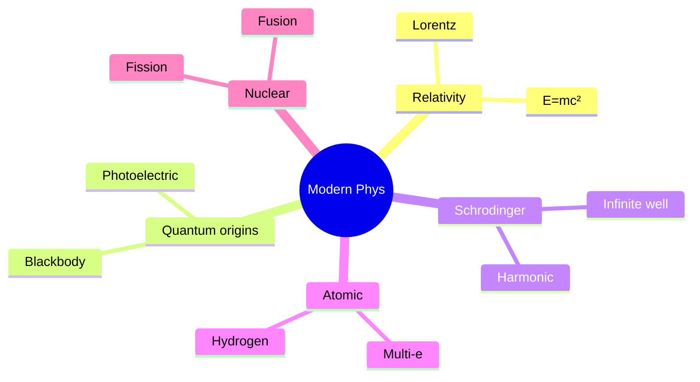
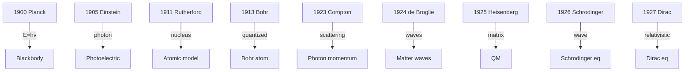
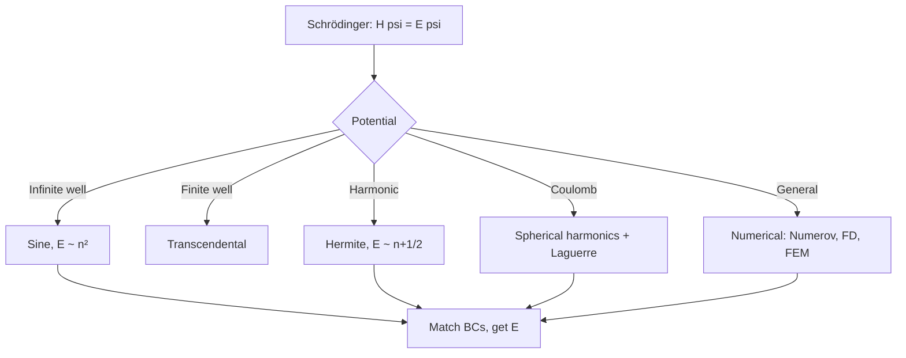
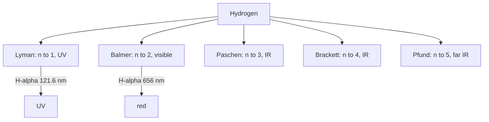
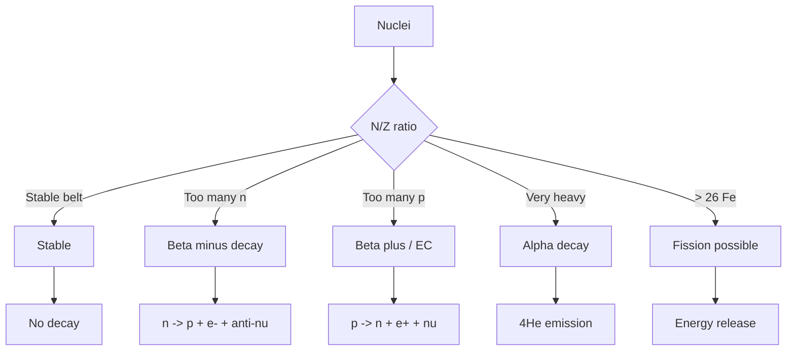

# PHYS 2022 — Modern Physics
> **Phase 1 BSc Foundation | HKUST PHYS 2022 | Relativity, quantum, atomic, nuclear**  
> **Bilingual 深度自學檔案 · 中英對照**

---

## 問題 1：5 個核心心智模型

1. **Relativity** — $c$ constant, $E = mc^2$, time dilation
2. **Wave-particle duality** — photon, de Broglie
3. **Quantization** — atomic levels, discrete energy
4. **Uncertainty principle** — $\Delta x \Delta p \geq \hbar/2$
5. **Schrödinger equation** — $i\hbar \partial_t \psi = H \psi$

---

## 問題 2：3 個根本分歧
1. **Copenhagen vs many-worlds** — interpretation
2. **Hidden variables (Bohm) vs $\psi$-epistemic** — realism
3. **Determinism vs randomness** — classical vs quantum

---

## 問題 3：10 個深度問題
1. 給定 muon lifetime, derive time dilation for atmospheric muons。
2. 為什麼 photoelectric 證明 light 係 photon?
3. 給定 Compton, derive wavelength shift formula。
4. 為什麼 Bohr model 失敗 for He atom?
5. 給定 $E_n = -13.6/n^2$ eV, derive Lyman series wavelengths。
6. 為什麼 wave function 必須 be square-integrable?
7. 給定 $\psi = A e^{-x^2/a^2}$, compute $\Delta x$ and $\Delta p$, verify uncertainty。
8. 為什麼 infinite square well has $E \propto n^2$ 而非 linear?
9. 給定 quantum harmonic oscillator, derive zero-point energy $\hbar\omega/2$。
10. 解釋 why quantum tunneling 對 STM essential。

---

## 深入 1：Special Relativity
**Deep Dive I**

Postulates, Lorentz transformation, time dilation, length contraction, $E = mc^2$, 4-vectors.

**Engineering:** GPS, particle physics.

## 深入 2：Quantum Origins
**Deep Dive II**

Blackbody, photoelectric, Compton, Bohr model, de Broglie, wave-particle.

**Engineering:** Photonics, electron microscopy.

## 深入 3：Schrödinger Equation
**Deep Dive III**

Time-dependent, time-independent, infinite well, harmonic, hydrogen.

**Engineering:** Quantum dots, transistors.

## 深入 4：Atomic Physics
**Deep Dive IV**

Hydrogen, helium, multi-electron, spectroscopy, lasers.

**Engineering:** Atomic clocks, spectroscopy.

## 深入 5：Nuclear & Particle
**Deep Dive V**

Binding energy, decay, fission, fusion, standard model.

**Engineering:** Nuclear power, medicine.

---

## 自測 1：Muon lifetime
**Answer:** $t' = t/\sqrt{1-v^2/c^2}$, muons reach ground.  
**Engineering:** Cosmic ray detection.

## 自測 2：Photoelectric
**Answer:** $KE = h\nu - W$.  
**Engineering:** Solar cell.

## 自測 3：Compton
**Answer:** $\Delta\lambda = h/(m_e c)(1-\cos\theta)$.  
**Engineering:** X-ray scattering.

## 自測 4：Bohr fails He
**Answer:** No 2-body reduction, electron-electron.  
**Engineering:** Need QM many-body.

## 自測 5：Lyman
**Answer:** $1/\lambda = R(1 - 1/n^2)$, n=2,3,... Lyman α at 121.6 nm.  
**Engineering:** UV spectroscopy.

## 自測 6：Square-integrable
**Answer:** $\int |\psi|^2 dV = 1$ for probability.  
**Engineering:** QM foundation.

## 自測 7：Uncertainty Gaussian
**Answer:** $\Delta x = a/\sqrt 2$, $\Delta p = \hbar/(a\sqrt 2)$, product = $\hbar/2$.  
**Engineering:** Minimum uncertainty states.

## 自測 8：Infinite well $n^2$
**Answer:** $E_n = n^2\pi^2\hbar^2/(2mL^2)$, $k_n = n\pi/L$ quantized.  
**Engineering:** Quantum dot.

## 自測 9：Zero-point
**Answer:** $E_0 = \hbar\omega/2$ from uncertainty, no $n=0$ in classical.  
**Engineering:** Casimir effect.

## 自測 10：Tunneling
**Answer:** $T \propto e^{-2\kappa L}$, exponential in width.  
**Engineering:** STM.

---

## 📊 Diagram 1: Modern Physics Map

## 📊 Diagram 2: Modern Physics Timeline

## 📊 Diagram 3: Schrödinger Workflow

## 📊 Diagram 4: Hydrogen Spectrum

## 📊 Diagram 5: Nuclear Stability

---

## 深度總結 Deep Insights

1. **Relativity + QM = modern physics** — both counter-intuitive
2. **Quantization is universal** — $E = nh\nu$, $L = mvr$
3. **$\hbar$ is fundamental** — sets scale of QM effects
4. **Schrödinger works** — for non-relativistic
5. **Standard model = current frontier** — strong, weak, EM

---

**自學建議** — Krane "Modern Physics". MIT OCW 8.04 + 8.06.
