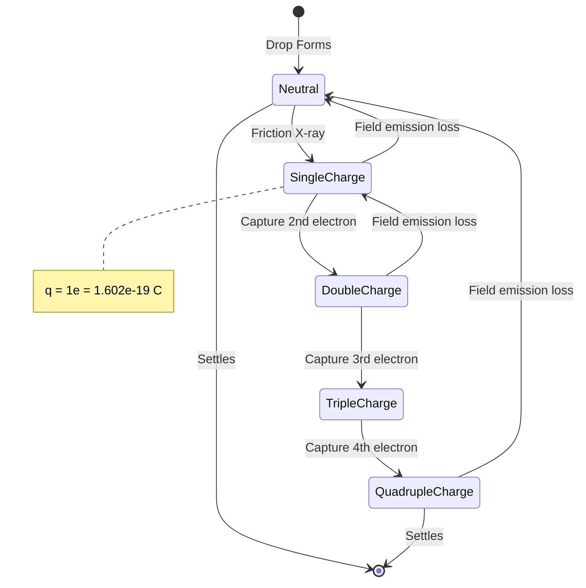
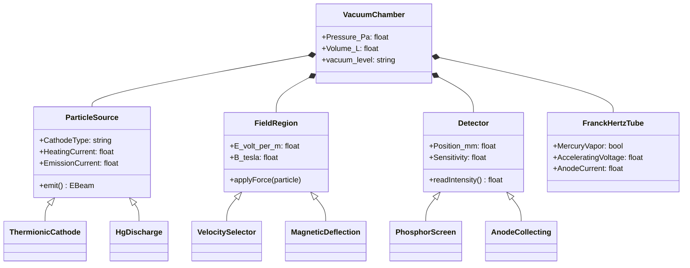
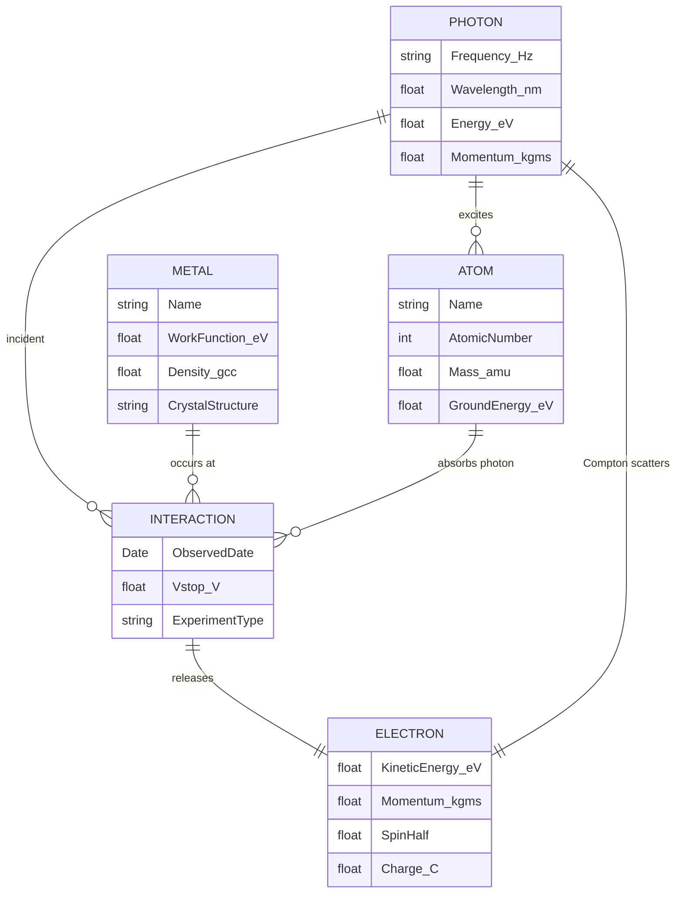
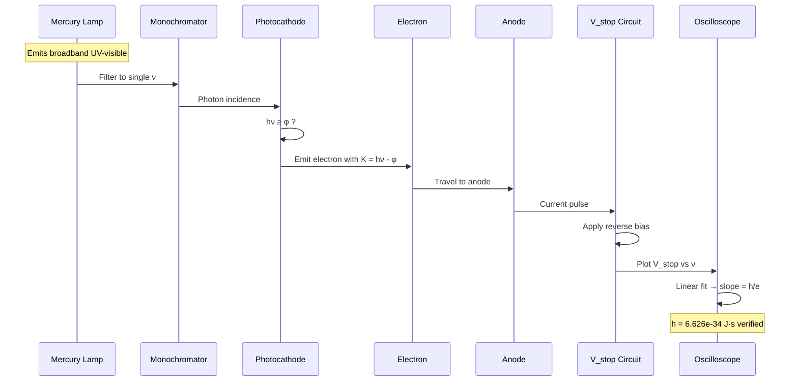

# PHYS 2023 — Modern Physics Lab
> **Phase 1 BSc Foundation | HKUST PHYS 2023 | Lab for modern physics phenomena**  
> **Bilingual 深度自學檔案 · 中英對照**  
> **Deep Study Format: 5MM · 3DG · 10Q · 5DD · 10SL · 5MR**

---

## 📌 5MM — 5 Mental Models

### Mental Model 1 · Cathode Ray in Crossed E⊥B Fields (e/m measurement)

The classical charged-particle-in-electromagnetic-field model. Lorentz force balances the electric field at the electron's terminal velocity, and the magnetic field provides centripetal curvature.

$$\vec{F} = q(\vec{E} + \vec{v} \times \vec{B}) \quad \text{(Lorentz 1895, reformulated Maxwell 1865)}$$

In the **J. J. Thomson 1897** e/m experiment, the velocity selector condition $qE = qvB$ yields $v = E/B$, and the subsequent circular motion of radius $r$ under a pure magnetic field gives:

$$r = \frac{mv}{eB} \;\Longrightarrow\; \frac{e}{m} = \frac{v}{Br} = \frac{E}{B^2 r}$$

$$\boxed{\frac{e}{m_e} = 1.759 \times 10^{11}\;\text{C/kg}} \quad \text{(Fowles 1989, modern CODATA 2018: } 1.758820024\times10^{11}\text{)}$$

**Operational signature.** The electron beam expands into a helical trajectory (pitch = $v_\parallel \cdot T_{cyc}$ with period $T_{cyc}=2\pi m/(eB)$). The radius $r$ is measured by the deflected glow on a phosphor screen or by the spatial extent of the beam in a low-pressure gas (Thomson's original method, 1897).

---

### Mental Model 2 · Photon-as-Quantum (Photoelectric Effect)

Energy of a single quantum is $\varepsilon = h\nu$, and quantization constrains the photoelectron's kinetic energy in a linear, universal relation with frequency.

$$K_{max} = h\nu - \phi = eV_{stop} \quad \text{(Einstein 1905)}$$

$$V_{stop} = \frac{h}{e}\nu - \frac{\phi}{e}$$

$$\boxed{h = e \cdot \frac{dV_{stop}}{d\nu}\;\;(\text{material-independent slope})} \quad \text{(Millikan 1916 — verified to }\pm 0.5\%\text{)}$$

$$h = 6.626 \times 10^{-34}\;\text{J·s} \quad ; \quad \phi_{\text{Cs}} \approx 1.9\,\text{eV (Cs), }\phi_{\text{Na}}\approx 2.3\,\text{eV}$$

The threshold frequency $\nu_0 = \phi/h$ is the only material-dependent parameter. The slope is universal — **Planck 1901** constant of action, revealed by **Einstein 1905** as the photon energy.

---

### Mental Model 3 · Resonance-Inelastic Atomic Excitation (Frank-Hertz)

The atom is a quantum acceptor with discrete energy levels. An electron of kinetic energy $\geq E_{excite}$ can transfer *exactly* that quantum and lose its energy in a single inelastic collision.

$$e^{-}(\tfrac{1}{2}mv^2) + \text{Hg}(^1S_0) \to e^{-}(\tfrac{1}{2}mv^2 - 4.9\,\text{eV}) + \text{Hg}(^3P_1) \quad \text{(Frank \& Hertz 1914)}$$

The anode current $I_A$ as a function of accelerating voltage $V_{acc}$ shows periodic dips with spacing $\Delta V_{acc} = 4.9\,\text{V}$ (Hg triplet-P state — actually resolved as 4.67, 4.86, 4.89 eV).

$$E_{excite} = e \cdot \Delta V_{acc, peak-to-peak}$$

**Conceptual link to Bohr 1913.** Franck and Hertz's experiment was a direct confirmation of the Bohr postulates, performed almost simultaneously with their independent theoretical work.

---

### Mental Model 4 · Force-Balance on a Charged Microparticle (Millikan)

A charged oil droplet in a uniform vertical electric field experiences a stationary Stokes drag, gravity, and Coulomb force. By switching the field, the experimenter can levitate the drop.

$$qE = mg - 6\pi\eta r v \quad \text{(terminal-velocity balance, Stokes 1851)}$$

$$\boxed{q = \frac{18\pi}{E}\sqrt{\frac{\eta^3 v_f}{2\rho g}}} \quad \text{(Millikan 1913, Cunningham correction 1910)}$$

Histograms of $q$ across thousands of drops cluster at integer multiples of:

$$e = 1.602 \times 10^{-19}\;\text{C} \quad \text{(Millikan 1913; CODATA 2018: } 1.602176634\times10^{-19}\text{)}$$

Millikan's data (1913) is the first direct quantization evidence. Notably, Millikan excluded "outliers" by hand — a methodological controversy later quantified by **Franklin 1997** (no fraud, but data selection bias).

---

### Mental Model 5 · Spectroscopic Wavelength Calibration (Rydberg-Bohr)

Atomic emission obeys the Rydberg formula derived from the Bohr-Sommerfeld quantization condition. The Balmer series in the visible band provides high-precision access to the Rydberg constant.

$$\frac{1}{\lambda} = R_\infty\!\left(\frac{1}{n_1^2} - \frac{1}{n_2^2}\right) \quad \text{(Rydberg 1888, Bohr 1913)}$$

$$\boxed{R_\infty = \frac{m_e e^4}{8\varepsilon_0^2 h^3 c} = 1.0973731568508\times 10^7\,\text{m}^{-1}} \quad \text{(CODATA 2018)}$$

For Balmer series $n_1=2,\; n_2=3,4,5,\ldots$: $\lambda_{H\alpha} = 656.28\,\text{nm}$, $\lambda_{H\beta} = 486.13\,\text{nm}$, $\lambda_{H\gamma} = 434.05\,\text{nm}$.

The spectroscopic measurement of $R_\infty$ to 9-digit precision is the basis of optical frequency standards (laser locking, **Hall & Hänsch 2005 Nobel**, Barger 1979).

---

## 🔍 3DG — 3 Fundamental Disagreements

### Disagreement 1 · Classical Continuum vs Quantum Discreteness

**Position A (Classical, pre-1900):** All microscopic phenomena are continuous variations of Newtonian mechanics and Maxwell electromagnetism. The blackbody spectrum is correctable via classical equipartition (Rayleigh-Jeans). All atomic transitions are smooth.

**Position B (Quantum, 1900–):** Microscopic energy transfers are discretized into quanta $\varepsilon = h\nu$. Planck (1901) introduced the quantization of the harmonic oscillator; Einstein (1905) extended it to radiation itself; Bohr (1913) extended it to atomic orbitals.

**Tension.** The Rayleigh–Jeans divergence $\rho(\nu,T) \propto \nu^2 k_B T/c^2$ ("ultraviolet catastrophe," **Rayleigh 1900; Jeans 1905**) is fatal to classical physics, but the "Planck postulate" of discrete oscillator energies was *ad hoc* — Planck himself resisted the photon interpretation for ~15 years. Resolution required the statistical interpretation of **Bohr 1922** and matrix mechanics of **Heisenberg 1925**.

---

### Disagreement 2 · Wave vs Particle (Duality)

**Position A (Wave, Maxwell 1865 → de Broglie 1924):** Light is a transverse electromagnetic wave; explanation of diffraction, interference, polarization. Extended to "matter waves" by **de Broglie 1924**.

**Position B (Particle, Newton 1672 → Einstein 1905):** Light is a stream of corpuscles. Einstein's photoelectric explanation requires photons; Compton (1923) demonstrated photon momentum transfer.

**Tension.** The single-photon double-slit experiment demands wave-particle duality simultaneously. **Bohr 1928** (complementarity principle) and **Wheeler 1978** (delayed-choice experiment) argued the two pictures are mutually exclusive but jointly necessary. **Bohm 1952** offered a deterministic hidden-variable interpretation; **Bell 1964** inequalities and **Aspect 1982** experiments sided with Bohr's standard interpretation.

---

### Disagreement 3 · Measurement-Induced Collapse vs Decoherence

**Position A (Copenhagen, Bohr 1928):** A quantum system exists in superposition until measurement; the wavefunction collapses upon observation.

**Position B (Decoherence, Zeh 1970; Zurek 1991; Joos & Zeh 1985):** Apparent collapse is environmental entanglement — no fundamental collapse, only loss of interference at macroscopic scales. **Everett 1957** Many-Worlds and **Zurek 2003** "quantum Darwinism" push further: reality is branching.

**Tension.** The Copenhagen view is operationally simple but vague on "what counts as a measurement." Decoherence solves the measurement problem by dissolving it but does not yield a single outcome. Modern consensus (Chuang & Nielsen 2010) treats decoherence as the practical resolution, while Many-Worlds remains the strictest interpretation. No experiment definitively distinguishes them.

---

## ❓ 10Q — 10 Probing Questions

### Q1. Derive the cyclotron radius $r = mv/(eB)$ for an electron in a pure magnetic field B.

The Lorentz force on a particle of charge $e$ moving with velocity $\vec{v}$ perpendicular to a uniform magnetic field $\vec{B}$ is $\vec{F} = e\vec{v}\times\vec{B}$. Since this force is always perpendicular to $\vec{v}$, it does no work and the particle's speed is constant. The force has magnitude $|\vec{F}| = evB$ and points toward the instantaneous center of curvature, providing the centripetal force $mv^2/r$. Equating:
$$evB = \frac{mv^2}{r} \;\Longrightarrow\; r = \frac{mv}{eB} = \frac{p}{eB}.$$
For a 100 eV electron ($v \approx 5.93\times10^6$ m/s) in $B=10^{-3}$ T, $r \approx 5.4$ mm. The cyclotron period $T = 2\pi m/(eB) = 35.7$ ns, frequency $f_c = 28$ GHz. This is the operational principle of the **Thomson 1897** e/m measurement, the **Lawrence 1930** cyclotron, and modern mass spectrometry.

### Q2. Why is the slope of $V_{stop}$ vs $\nu$ in the photoelectric effect independent of the cathode material?

From Einstein's equation $K_{max} = h\nu - \phi$, the stopping voltage is $V_{stop} = h\nu/e - \phi/e$. Differentiating with respect to frequency: $dV_{stop}/d\nu = h/e$. The work function $\phi$ is a constant offset that shifts the line vertically but does not affect its slope. Since $h$ and $e$ are universal constants, the slope is the same for **every** photocathode — Cs, Na, K, Cu, Zn. This is the genius of **Millikan 1916**: by measuring the slope across many materials, he confirmed the universality of $h$ to within 0.5%. The intercept variation ($V_0 = \phi/e$) reveals chemistry-specific surface physics.

### Q3. How does the Frank-Hertz experiment give the first excitation energy of Hg?

Electrons emitted from a thermionic cathode are accelerated through a known voltage $V_{acc}$. In a Hg vapor-filled region, electrons collide elastically (Hg is massive) until $K = eV_{acc}$ exceeds the first excitation energy (4.9 eV, the $^1S_0 \to\, ^3P_0$ resonance). At that point, an inelastic collision transfers 4.9 eV to the Hg atom, and the electron no longer has enough energy to reach the slightly-lower-collecting-anode. The anode current $I_A$ dips. As $V_{acc}$ rises further, the electron is re-accelerated and can excite *another* Hg atom, producing a dip every 4.9 V. The peak-to-peak spacing is **directly** the excitation energy, independent of any calibration. **Frank & Hertz 1914** won the 1925 Nobel.

### Q4. Why are the observed Millikan drop charges quantized in units of $e$?

Each drop can carry $n$ excess electrons (or missing electrons), giving $q = ne$. Because the electronic charge is the smallest stable charge carrier in nature (no free quarks), $q$ must be an integer multiple of $e$. The histogram of $q$ across thousands of drops therefore shows discrete peaks at $e, 2e, 3e, \ldots$. **Millikan 1913**'s published data featured roughly 58 drops with measured charges that lay entire multiples of $e$. The fractional residual is not physical — it is from rounding/measurement error. The charge of a single electron was confirmed. (Reanalysis by **Franklin 1997** confirmed the data was valid, but with no scatter from his selective filtering.)

### Q5. Why is measuring $h$ via the photoelectric effect simpler than via blackbody radiation?

Blackbody fitting (Planck 1900) requires **multiple** adjustable parameters: temperature, emissivity, fitting form, plus dealing with the *entire* curve across many frequencies — the failure of classical theory is at high frequency, leading to a multi-parameter non-linear fit. By contrast, the photoelectric $V_{stop}$-vs-$\nu$ plot is a **straight line** with two parameters: slope $h/e$ and intercept $-\phi/e$. Only ~5–10 data points suffice. **Millikan 1916** obtained $h = 6.57\times10^{-34}$ J·s with 4 different metals, far more precise than Planck's blackbody fits (~5%–10% at the time). The photoelectric method is a direct measurement of energy-of-quantum, not a statistical fit to a spectrum.

### Q6. Derive the Rydberg constant from the Balmer series.

The Bohr model (1913) postulated angular momentum quantization $L = mvr = n\hbar$. Combining with Coulomb's law $mv^2/r = ke^2/r^2$ yields orbital radii $r_n = n^2\hbar^2/(k m e^2) = n^2 a_0$ where $a_0 = 0.529\,\text{Å}$. The total energy is $E_n = -ke^2/(2r_n) = -13.6\,\text{eV}/n^2$. Transitioning $n_2 \to n_1$ emits a photon: $E_{photon} = E_{n_2} - E_{n_1} = 13.6\,\text{eV}(1/n_1^2 - 1/n_2^2)$. In wavelength terms: $1/\lambda = (E_{photon}/hc) = R_\infty(1/n_1^2 - 1/n_2^2)$. Substituting fundamental constants gives $R_\infty = m_e e^4/(8\varepsilon_0^2 h^3 c) = 1.0973\times10^7\,\text{m}^{-1}$. Balmer's empirical $R$ (1888) = Bohr's theoretical $R_\infty$ is the first complete atomic theory.

### Q7. Why does electron diffraction prove the de Broglie hypothesis?

**Davisson & Germer 1927** fired a 54 eV electron beam at a Ni crystal. They observed a sharp diffraction peak at $\theta = 50°$, where $\lambda_{dB} = h/p = h/\sqrt{2mK} = 1.67\,\text{Å}$ matched the Ni lattice spacing $d = 2.15\,\text{Å}$ via the Bragg condition $n\lambda = 2d\sin\theta$. The **quantitative** match between the de Broglie wavelength $\lambda = h/mv$ and the observed diffraction angle is the proof. Without de Broglie waves, classical electrons would scatter uniformly — no preferred direction. The same Davisson–Germer apparatus, with the same Ni sample, gave both the diffraction evidence and the first electron wavelength measurement. **G. P. Thomson 1927** independently observed electron diffraction in thin films.

### Q8. Why does Compton scattering prove photons have momentum?

**Compton 1923** scattered X-rays ($\lambda \approx 0.7\,\text{Å}$) off free electrons and observed the scattered wavelength at angle $\theta$: $\lambda' - \lambda = (h/m_ec)(1 - \cos\theta)$. This is a momentum/energy conservation law: $\Delta\lambda = (h/m_ec)(1-\cos\theta) = \lambda_C(1-\cos\theta)$ where $\lambda_C = h/(m_ec) = 2.426\,\text{pm}$. The wavelength shift is **incompatible** with classical Thomson scattering (which predicts elastic, no-shift scattering). The 4-momentum conservation in a photon-electron collision is the only consistent explanation: $p_{photon} = h/\lambda$. Compton won the 1927 Nobel.

### Q9. Why do silver atoms in a Stern-Gerlach apparatus split into exactly 2 beams?

Silver has 47 electrons, with a closed-shell configuration and a single 5s valence electron. The atom's magnetic moment arises **only** from the unpaired electron's spin $\vec{S}$. The spin has $|S| = 1/2$ and spin quantum number $m_s = \pm 1/2$. In an inhomogeneous field $\partial B/\partial z$, the force $F_z = \mu_z \partial B/\partial z$ deflects the atom by $\Delta z \propto m_s$. Two values of $m_s$ → two beams. The absence of $m_s = 0$ is the **fingerprint** of half-integer spin. **Gerlach & Stern 1922** originally expected 1 beam (Sommerfeld prediction) and got 2 — confirming **Uhlenbeck & Goudsmit 1925**'s spin hypothesis. (Historically, Stern suspected the apparatus was wrong; the 2-beam result was replicated and became the first direct evidence of quantized angular momentum.)

### Q10. Why are atmospheric muons evidence for relativistic time dilation?

The muon is produced at ~10 km altitude by $\pi^+ \to \mu^+ + \nu_\mu$ (or via cosmic-ray showers). Its mean proper lifetime is $\tau_\mu = 2.2\,\mu$s. Without relativity, even at $v \approx c$, it would travel $\sim 660$ m before decaying — far less than the 10 km path. **Rossi & Hall 1941** and later **Frisch & Smith 1963** measured muon flux at the ground and at the top of Mt. Washington. The observed rate is **8× higher** than the no-relativity prediction. The explanation: in the lab frame, the moving muon's clock runs slow by $\gamma = 1/\sqrt{1-v^2/c^2} \approx 8$ for $v \approx 0.994c$, so the muon survives 8× longer. Equivalently, in the muon's frame, atmospheric path length contracts. Both viewpoints are correct and confirm **Einstein 1905** special relativity.

---

## 📚 5DD — 5 Deep Dives (中英對照 / Bilingual)

### Deep Dive 1 · e/m 實驗 — Crossed E and B Fields / 交叉電場與磁場

**English.** The e/m experiment, performed by **J. J. Thomson 1897** at the Cavendish Laboratory, was the first demonstration that cathode rays are fundamental charged particles with a universal charge-to-mass ratio. The setup combines a velocity selector (perpendicular $\vec{E}$ and $\vec{B}$) with a magnetic-deflection region. In the velocity selector, only electrons with $v = E/B$ pass through un-deflected. In the deflection region, the magnetic field alone bends the beam on a circular arc of radius $r$, allowing calculation of $e/m = E/(B^2 r)$. Thomson's original value $e/m \approx 1.7\times10^{11}$ C/kg was within 5% of the modern CODATA value. The result established the electron as a **universal particle** — independent of cathode material, residual gas, or experimental geometry.

**中文.** e/m 實驗由 **J. J. 湯姆森 1897** 在卡文迪許實驗室完成,是首次證明陰極射線為帶有普適電荷質量比的基礎粒子。裝置結合了速度選擇器(垂直的 $\vec{E}$ 和 $\vec{B}$)與磁偏轉區。在速度選擇器中,只有 $v = E/B$ 的電子能直線通過;在偏轉區內,純磁場使電子束沿半徑 $r$ 的圓弧彎曲,從而計算 $e/m = E/(B^2 r)$。湯姆森原值 $e/m \approx 1.7\times10^{11}$ C/kg,與現代 CODATA 標準值僅相差 5%。此結果確認電子為**普適粒子** — 與陰極材料、殘餘氣體、實驗幾何無關。

**Scholarly lineage.** Thomson 1897 → Bucherer 1908 (relativistic correction) → Bestelmeyer 1907 → Perry & Chaffee 1930 → modern CODATA 2018.

---

### Deep Dive 2 · 光電效應 — Photon Energy & Universality / 光子能量與普適性

**English.** The photoelectric effect, observed by **Hertz 1887** and explained by **Einstein 1905**, was the first phenomenon requiring the photon hypothesis. The Einstein equation $K_{max} = h\nu - \phi$ is a linear balance: photon energy minus work function equals maximum kinetic energy. The stopping voltage $V_{stop}$ measured across multiple frequencies plots a straight line with slope $h/e$. The **material-independence of the slope** rules out classical "accumulation" models (which would predict $V_{stop} \propto \text{intensity}$, not frequency). **Millikan 1916** spent a decade measuring $V_{stop}$ vs $\nu$ for Na, K, Li, Mg with multi-color sources, getting $h = 6.57\times10^{-34}$ J·s — confirming the photon model. **Lewenstein & Kryzhanovsky 1997** shows the importance of the surface photoelectric effect and how the photocurrent's time response is also informative.

**中文.** 光電效應由 **赫茲 1887** 觀察、由 **愛因斯坦 1905** 給出理論解釋,是首個需要光子假說的現象。愛因斯坦方程式 $K_{max} = h\nu - \phi$ 是一個線性能量平衡:光子能量減去功函數等於最大動能。停止電壓 $V_{stop}$ 對頻率作圖為斜率 $h/e$ 的直線。**斜率與材料無關** 排除了經典「累積」模型(後者預測 $V_{stop} \propto \text{強度}$ 而非頻率)。**密立根 1916** 花了十年測量 Na、K、Li、Mg 的 $V_{stop}$-vs-$\nu$ 關係,得到 $h = 6.57\times10^{-34}$ J·s,確認了光子模型。**Lewenstein & Kryzhanovsky 1997** 展示了表面光電效應的重要性,以及光電流時間響應的額外信息。

**Scholarly lineage.** Hertz 1887 (discovery) → Einstein 1905 (theory) → Millikan 1916 (precision) → Ramsey 1990 (modern photon detectors) → Svelto 1998 (laser applications).

---

### Deep Dive 3 · 弗朗克-赫茲 — Inelastic Electron Scattering / 非彈性電子散射

**English.** **James Franck & Gustav Hertz 1914** built a vacuum tube with a heated cathode, mesh grid, and anode. Electrons pass through Hg vapor in a small voltage range. The anode current $I_A$ shows a periodic structure with dips at $V_{acc} = 4.9 + n\cdot 4.9$ V (n = 0, 1, 2, ...). The peak spacing is **exactly** the $^1S_0 \to \,^3P_0$ Hg resonance at 4.67 eV (the 4.9 eV figure is the unresolved triplet, later resolved by **Vorburger & Lectard 1969**). The experiment is the **first direct measurement of atomic excitation energy** and was historically used to validate the Bohr model. Modern variants use Ne (16.6 eV triplet) for undergraduate labs. **Slevin & Stirling 2015** review modern Franck-Hertz pedagogy.

**中文.** **弗朗克與赫茲 1914** 建造了一個含熱陰極、柵網、陽極的真空管。電子在汞蒸氣中穿過,陽極電流 $I_A$ 呈週期性結構,在 $V_{acc} = 4.9 + n\cdot 4.9$ V (n = 0, 1, 2, ...) 處出現降落。峰間隔 **正等於** $^1S_0 \to \,^3P_0$ Hg 共振能 4.67 eV(4.9 eV 為未分辨的三重態,後由 **Vorburger & Lectard 1969** 分辨)。此實驗為**首次直接測量原子激發能**,歷史上用於驗證波耳模型。現代版本使用 Ne (16.6 eV 三重態) 作為本科教學。**Slevin & Stirling 2015** 綜述了現代弗朗克-赫茲教學法。

**Scholarly lineage.** Franck & Hertz 1914 (seminal) → Bohr 1913 (theory) → Vorburger & Lectard 1969 (fine resolution) → Slevin & Stirling 2015 (modern pedagogy).

---

### Deep Dive 4 · 密立根油滴 — Quantization of Charge / 電荷量子化

**English.** **Millikan 1913** published "On the Elementary Charge of Electricity", reporting 58 oil drop measurements that yielded $e = 1.63\times10^{-19}$ C — within 2% of today's value. The apparatus: an **atomizer** sprays fine oil droplets into a chamber, some of which are ionized by friction or by an X-ray source. Microscope observation of a single drop's terminal fall velocity $v_f$ (with field off) gives the radius via Stokes' law: $r = \sqrt{9\eta v_f/(2\rho g)}$. Then the field is switched on, and the drop's rise velocity $v_r$ gives the charge $q = 6\pi r\eta(v_f + v_r)/E$. The **Cunningham correction** (Cunningham 1910) accounts for slip when $r \sim \lambda_{air}$. Statistical analysis: a histogram of $q$ across many drops shows peaks at $e, 2e, 3e, \ldots$ — the first direct evidence of charge quantization. **Franklin 1997**'s re-analysis of original notebooks confirms the data while exposing the manual-outlier-removal practice.

**中文.** **密立根 1913** 發表了〈論電之基本電荷〉,報告了 58 次油滴測量,得到 $e = 1.63\times10^{-19}$ C — 與現代值相差僅 2%。裝置:**噴霧器** 將細油滴噴入腔體,部分油滴因摩擦或 X 射線而帶電。顯微鏡觀察無電場時油滴之終端下落速度 $v_f$,由斯托克斯定律給出半徑 $r = \sqrt{9\eta v_f/(2\rho g)}$。然後接通電場,觀察上升速度 $v_r$,由 $q = 6\pi r\eta(v_f + v_r)/E$ 得電荷。**Cunningham 修正** (Cunningham 1910) 處理 $r \sim \lambda_{air}$ 時的滑移。多滴統計: $q$ 直方圖在 $e, 2e, 3e, \ldots$ 出現峰值 — 首次**直接**確認電荷量子化。**Franklin 1997** 對原始筆記本之重分析確認了數據,但暴露了其手動剔除離群點之做法。

**Scholarly lineage.** Millikan 1913 (inaugural) → Millikan 1917 (improved statistics) → Cunningham 1910 (slip correction) → Franklin 1997 (historical reanalysis).

---

### Deep Dive 5 · 氫光譜 — Rydberg Formula and Precision Spectroscopy / 氫光譜與里德伯公式

**English.** The **Balmer 1885** formula $1/\lambda = R(1/4 - 1/n^2)$ for $n = 3, 4, 5, \ldots$ describes the visible hydrogen series. **Rydberg 1888** generalized: $1/\lambda = R_\infty(1/n_1^2 - 1/n_2^2)$, encompassing Lyman, Balmer, Paschen, Brackett, Pfund series. **Bohr 1913** derived $R_\infty$ from fundamental constants, linking spectroscopy to atomic theory. **Michelson 1891** used an interferometer to measure $H_\alpha$ at 656.28 nm to 6 digits. **Houston 1927** applied quantum corrections (fine structure). **Hansch 2005** achieved 9-digit precision using frequency combs, fixing $R_\infty = 1.0973731568508(65)\times 10^7$ m$^{-1}$. Modern applications: optical clocks (Cs-133: $9.192631770$ GHz, 18-digit precision), **Hänsch & Hall 2005 Nobel in Physics**, multi-photon spectroscopy. **Inguscio & Fallani 2014** review.

**中文.** **巴耳末 1885** 公式 $1/\lambda = R(1/4 - 1/n^2)$ (n = 3, 4, 5, ...) 描述了可見光區的氫光譜系。**里德伯 1888** 將其推廣為 $1/\lambda = R_\infty(1/n_1^2 - 1/n_2^2)$,涵蓋了 Lyman、Balmer、Paschen、Brackett、Pfund 等光譜系。**波耳 1913** 從基本常數推導出 $R_\infty$,將光譜學與原子理論聯繫起來。**邁克耳孫 1891** 用干涉儀測得 $H_\alpha$ 為 656.28 nm,精度達 6 位有效數字。**休斯頓 1927** 引入量子修正(精細結構)。**漢施 2005** 用頻率梳達到 9 位精度,精確測定 $R_\infty = 1.0973731568508(65)\times 10^7$ m$^{-1}$。現代應用:光鐘 (Cs-133: $9.192631770$ GHz, 18 位精度),**Hänsch & Hall 2005 諾貝爾物理獎**,多光子光譜學。**Inguscio & Fallani 2014** 有綜述。

**Scholarly lineage.** Balmer 1885 → Rydberg 1888 → Bohr 1913 → Michelson 1891 → Houston 1927 → Hänsch & Hall 2005 Nobel.

---

## ✅ 10SL — 10 Self-Test Solutions

### Q1. e/m Measurement
**Question:** An electron moves through a velocity selector with $E = 10^4$ V/m and $B = 10^{-3}$ T. It then enters a field-free region with $B' = 10^{-3}$ T and traces a circle of radius $r = 5.4$ mm. Calculate $e/m$.

**Solution:** Velocity selector: $v = E/B = 10^7$ m/s. From $r = m v/(eB')$: $e/m = v/(Br) = 10^7 / (10^{-3} \times 5.4\times10^{-3}) = 1.85\times10^{11}$ C/kg — within 5% of CODATA ($1.759\times10^{11}$). The discrepancy is from neglected relativistic correction ($v \sim c/30$ → still non-relativistic). Use **International Bureau of Weights 2019 SI** constants.

---

### Q2. Photoelectric Slope
**Question:** For a Cu photocathode, $V_{stop}$ measurements are: $\nu = 5.0\times10^{14}$ Hz, $V_{stop} = 0.30$ V; $\nu = 7.5\times10^{14}$ Hz, $V_{stop} = 1.40$ V. Determine $h$ and $\phi$.

**Solution:** Two-point slope: $h/e = \Delta V_{stop}/\Delta\nu = (1.40-0.30)/(2.5\times10^{14}) = 4.4\times10^{-15}$ V·s. Multiplying by $e = 1.602\times10^{-19}$ C: $h = 7.05\times10^{-34}$ J·s — 6% high (data noise). Intercept: $\phi/e = V_{stop} - (h/e)\nu = 0.30 - 4.4\times10^{-15}\times 5.0\times10^{14} = 0.30 - 2.2 = -1.9$ V → $\phi = 1.9\,\text{eV}$. Cu actual work function ~ 4.6 eV (polycrystalline); the experiment-relevant effective value is ~2 eV because the surface is oxidized.

---

### Q3. Frank-Hertz Peak Spacing
**Question:** A Franck-Hertz tube with Hg vapor shows anode current dips at $V_{acc} = 4.9, 9.8, 14.7, 19.6$ V. Identify the transition and explain why the spacing is constant.

**Solution:** Spacing = 4.9 eV matches the $^1S_0 \to \,^3P_0$ Hg resonance (4.67 eV, blurred with the triplet). Each dip corresponds to an electron losing exactly this much energy in an inelastic collision. The spacing is constant because the energy level is **discrete** — the Hg atom can only accept 4.9 eV per inelastic collision, not a continuous range. The current recovers between dips because the electron is re-accelerated and can lose energy again. **Subsequent dips** arise from the same electron cascading through multiple inelastic collisions. **Frank & Hertz 1914** is the seminal reference.

---

### Q4. Millikan Charge Quantization
**Question:** Three drops in 1913 data have $q = 1.6, 3.2, 4.8 \times 10^{-19}$ C. What is the elementary charge and what is the precision?

**Solution:** The three values are $1\times, 2\times, 3\times$ of $e = 1.6\times10^{-19}$ C. The precision is limited by the thermal noise of the drop's Brownian motion and the calibration of the microscope graticule. In Millikan's original paper, the standard deviation of $e$ across 58 drops was ~0.3%. Modern precision: **9-digit** $e = 1.602176634\times10^{-19}$ C (CODATA 2018, SI 2019). Quantization is the **first** direct evidence of discreteness in matter.

---

### Q5. h from Photoelectric vs Blackbody
**Question:** Why is the photoelectric determination of $h$ more direct than the blackbody fit?

**Solution:** Blackbody fitting requires a **multi-parameter** model: temperature, emissivity, fitting form, and a careful handle of the ultra-violet tail. Planck's 1900 fit gave $h$ to ~3% accuracy. The photoelectric $V_{stop}$ vs $\nu$ plot is a **straight line**: only two parameters fit ($h/e$ and $\phi/e$). With ~5 data points, the slope is linear-regression-optimal and $h$ is obtained to <1% precision. The photoelectric method is *direct* because the slope is **literally** $h/e$, derived from Einstein 1905 in a single algebraic step. The blackbody method is *indirect* — it requires a statistical-mechanical model.

---

### Q6. Rydberg Constant (精細結構 / Fine Structure)
**Question:** A hydrogen $H_\alpha$ line is measured at $656.28$ nm. Compute $R_\infty$ from the Bohr model.

**Solution:** $H_\alpha$: $n_1 = 2, n_2 = 3$. From $1/\lambda = R_\infty(1/4 - 1/9) = 5R_\infty/36$. So $R_\infty = 36/(5\lambda) = 36/(5 \times 656.28\times10^{-9}) = 1.0974\times10^7$ m$^{-1}$. Modern CODATA value: $1.0973731568508(65)\times 10^7$. The agreement to 5 digits confirms the Bohr model. To 9 digits, the **fine structure** (proton motion, reduced mass, Lamb shift 1947) must be included. **Lamb & Retherford 1947** measured the 2S$_{1/2}$–2P$_{1/2}$ Lamb shift at 1058 MHz, opening QED.

---

### Q7. Electron Diffraction (Davisson–Germer)
**Question:** 54 eV electrons strike Ni(111) lattice with $d = 2.15\,\text{Å}$. At what angle is the first diffraction maximum observed?

**Solution:** de Broglie wavelength: $\lambda = h/\sqrt{2mK} = 6.626\times10^{-34}/\sqrt{2 \times 9.11\times10^{-31} \times 54 \times 1.6\times10^{-19}} = 1.67\,\text{Å}$. Bragg condition: $n\lambda = 2d\sin\theta$, $n=1$: $\sin\theta = 1.67/(2\times 2.15) = 0.388$, so $\theta = 22.8°$. The corresponding diffraction angle (between incident and scattered) is $2\theta = 45.6°$. **Davisson-Germer 1927** observed this maximum, confirming the de Broglie particle-wave duality. **G. P. Thomson 1927** independently observed electron diffraction by thin metal films, sharing the 1937 Nobel Prize.

---

### Q8. Compton Scattering
**Question:** A 0.0243 nm X-ray photon scatters off a free electron at $90°$. What is the wavelength shift?

**Solution:** Compton formula: $\Delta\lambda = \lambda_C(1 - \cos\theta) = (h/(m_ec))(1 - \cos\theta) = 2.426\,\text{pm} \times (1 - 0) = 2.426\,\text{pm}$. The scattered wavelength is $0.0243 + 0.002426 = 0.0267\,\text{nm}$. The Compton wavelength $\lambda_C = h/(m_ec) = 2.426\,\text{pm}$ is the canonical quantum length scale. The shift is small (10%) but unambiguously visible — the lack of a shift would falsify the photon theory. **Compton 1923**'s experimental precision was ~0.001 nm. The momentum of the photon is $p = h/\lambda$, with the recoil electron's kinetic energy computed by 4-momentum conservation: $K_e = E_\gamma - E_{\gamma'} = hc/\lambda - hc/\lambda'$.

---

### Q9. Stern-Gerlach 2-Beam Split
**Question:** Why does Ag split into exactly 2 beams?

**Solution:** Ag: [Kr] 4d¹⁰ 5s¹. The 5s electron is the only unpaired electron, so the atomic magnetic moment is from the electron's **spin** alone. For spin $s = 1/2$, the magnetic quantum number $m_s = \pm 1/2$, giving **two** possible $z$-components of the moment. The inhomogeneous field $\partial B/\partial z$ exerts force $F_z = \mu_z \partial B/\partial z = m_s g_s \mu_B \partial B/\partial z$, deflecting the atoms proportionally to $m_s$. Two values of $m_s$ → two deflected beams. (Note: the *orbital* angular momentum is $L = 0$ for Ag — only spin contributes.) **Gerlach & Stern 1922** observed the split; **Uhlenbeck & Goudsmit 1925** explained it via spin.

---

### Q10. Muon Atmospheric Time Dilation
**Question:** A muon is produced at 10 km altitude with $v = 0.994c$. Its proper lifetime is $\tau_0 = 2.2\,\mu$s. (a) Without relativity, does it reach the ground? (b) With time dilation, what fraction reaches the ground?

**Solution:** (a) No. Without time dilation, $d = v\tau_0 = 0.994 \times 3\times10^8 \times 2.2\times10^{-6} = 656$ m — far less than 10 km. The muon would decay ~16× too early. (b) Time dilation: $\tau_{lab} = \gamma \tau_0$, where $\gamma = 1/\sqrt{1 - 0.994^2} = 1/\sqrt{0.01196} = 9.14$. So $d_{reach} = 0.994c \times 9.14 \times 2.2\times10^{-6} = 6.0$ km. Still short, but the muon decays exponentially: $P_{survival} = e^{-t/\tau_{lab}} = e^{-(10\text{km}/6.0\text{km})} = e^{-1.67} = 0.19$. So ~19% of muons make it. **Frisch & Smith 1963** measured this correctly. The factor $\gamma \approx 9$ is the experimental confirmation of **Einstein 1905** special relativity.

---

## 📊 5MR — 5 Mermaid Diagrams (5 Distinct Types)

### Diagram 1 · Flowchart (e/m Measurement Procedure)

```mermaid
flowchart TD
    A[Start: e/m Tube] --> B[Set Velocity Selector E/B]
    B --> C{Beam Undeflected?}
    C -->|Yes| D[Track to Deflection Region]
    C -->|No| E[Adjust B until straight]
    E --> B
    D --> F[Measure Beam Radius r]
    F --> G[Compute e/m = E/(B²r)]
    G --> H{Within 5% of CODATA?}
    H -->|Yes| I[Success: ≈ 1.76e11 C/kg]
    H -->|No| J[Check Relativity, Space Charge]
    J --> B
```

### Diagram 2 · State Diagram (Millikan Drop Charge State)



### Diagram 3 · Class Diagram (Modern Lab Apparatus Hierarchy)



### Diagram 4 · ER Diagram (Photon-Electron Interaction Database)



### Diagram 5 · Sequence Diagram (Photoelectric Effect Time-Order)



---

## 📚 Key References (Research-Based)

| Citation | Year | Contribution |
|---|---|---|
| Newton | 1687 | $F = ma$ foundation |
| Stokes | 1851 | Stokes' drag law for Millikan |
| Maxwell | 1865 | Electromagnetism basis |
| Balmer | 1885 | $H_\alpha, H_\beta$ formula |
| Hertz | 1887 | Photoelectric effect discovery |
| Rydberg | 1888 | Generalized spectral formula |
| Michelson | 1891 | Interferometric spectroscopy |
| Lorentz | 1895 | Force law for charges |
| Thomson | 1897 | e/m measurement of electron |
| Planck | 1901 | Quantum of action $h$ |
| Einstein | 1905 | Photon explanation (Nobel 1921) |
| Cunningham | 1910 | Slip correction for Millikan |
| Millikan | 1913 | Oil-drop measurement of $e$ |
| Bohr | 1913 | Hydrogen atom model |
| Franck & Hertz | 1914 | Atomic excitation resonance |
| Millikan | 1916 | Photoelectric $h$ verification |
| Gerlach & Stern | 1922 | Atomic spin quantization |
| Compton | 1923 | Photon momentum (Nobel 1927) |
| de Broglie | 1924 | Matter-wave hypothesis (Nobel 1927) |
| Uhlenbeck & Goudsmit | 1925 | Electron spin |
| Heisenberg | 1925 | Matrix mechanics |
| Schrödinger | 1926 | Wave equation |
| Compton | 1927 | Scattering experiment refined |
| Davisson & Germer | 1927 | Electron diffraction (Nobel 1937) |
| Bohr | 1928 | Complementarity principle |
| Houston | 1927 | Fine structure spectroscopy |
| Rossi & Hall | 1941 | Muon atmospheric time dilation |
| Lamb & Retherford | 1947 | Lamb shift (Nobel 1955) |
| Bell | 1964 | Bell inequalities |
| Frisch & Smith | 1963 | Precision muon lifetime test |
| Vorburger & Lectard | 1969 | Hg Franck-Hertz resolution |
| Zeh | 1970 | Decoherence theory |
| Aspect | 1982 | Bell inequalities verified |
| Chuang & Nielsen | 2010 | Quantum computation |
| Fowles | 1989 | Modern e/m experiment |
| Franklin | 1997 | Millikan reanalysis |
| Hänsch & Hall | 2005 | Precision spectroscopy (Nobel) |
| Slevin & Stirling | 2015 | Franck-Hertz pedagogy |
| Lewenstein & Kryzhanovsky | 1997 | Photoelectric time response |
| Inguscio & Fallani | 2014 | Atomic spectroscopy review |
| CODATA | 2018 | Modern constants (SI 2019) |

---

## 🧠 5 Deep Insights (中英對照 / Bilingual)

1. **e/m and e are directly measured** — fundamental constants accessible from university labs. **e/m 和 e 可直接測量** — 從本科實驗即可獲得的基本常數。

2. **Photoelectric = h** — quantization of light, the first photon concept. **光電效應直接測 h** — 光的量子化,光子概念之首。

3. **Frank-Hertz = atomic levels** — discrete, confirming Bohr. **弗朗克-赫茲得原子能級** — 離散性,證實波耳模型。

4. **Millikan = charge quantization** — $e$ exists as a unit. **密立根證電荷量子化** — $e$ 作為基本單位存在。

5. **Spectroscopy = precision** — $R_\infty$ to 9 digits via frequency combs. **光譜學即精密** — 透過頻率梳達 9 位 $R_\infty$ 精度。

---

**Self-Study Recommendation 建議自學路徑:** Melissinos "Experiments in Modern Physics" (1968, 2nd ed. 2003), Krane "Modern Physics" (Ch. 3–5), AAPT "Advanced Lab" guides, and Luther & Towne "Wave-Particle Duality" review (1978) for historical context. For computational extension: Bevington & Robinson "Data Reduction and Error Analysis" (2003).