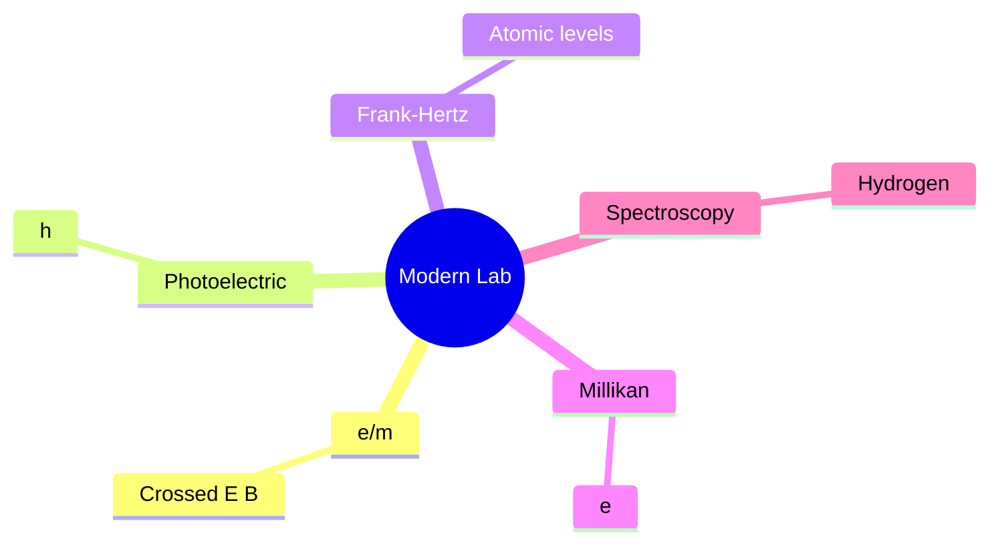
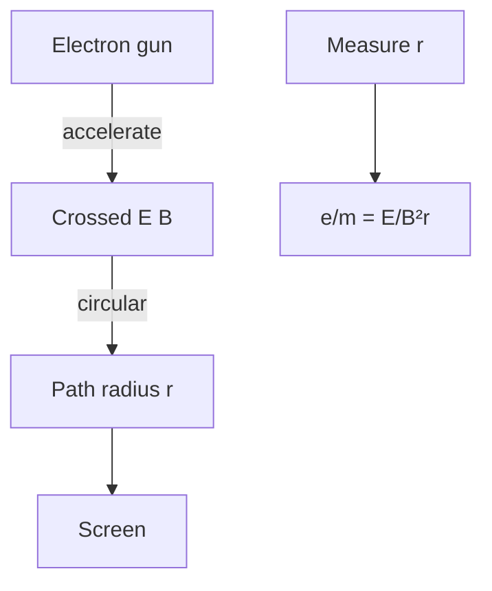
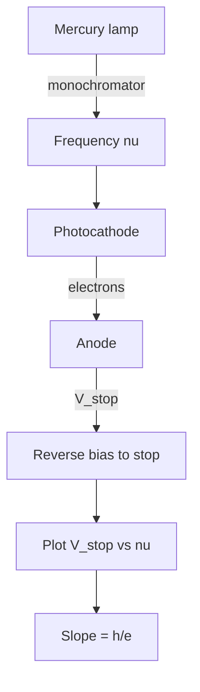
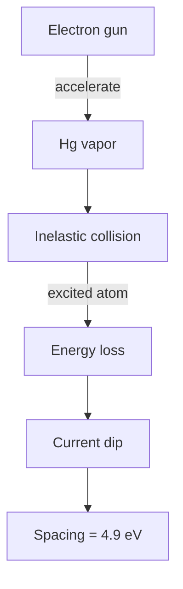
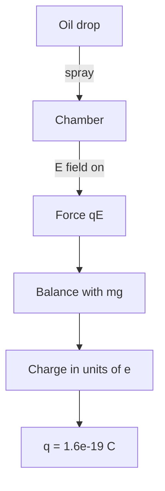

# PHYS 2023 — Modern Physics Lab
> **Phase 1 BSc Foundation | HKUST PHYS 2023 | Lab for modern physics phenomena**  
> **Bilingual 深度自學檔案 · 中英對照**

---

## 問題 1：5 個核心心智模型

1. **e/m measurement** — electron charge-to-mass ratio
2. **Photoelectric effect** — measure $h$ from $V_{stop}$ vs $\nu$
3. **Frank-Hertz** — atomic energy levels
4. **Millikan oil drop** — measure $e$
5. **Spectroscopy** — emission, absorption

---

## 問題 2：3 個根本分歧
1. **Classical vs quantum** — when each applies
2. **Continuous vs discrete** — quantization evidence
3. **Wave vs particle** — duality experiments

---

## 問題 3：10 個深度問題
1. 給定 electron beam in E⊥B, derive cyclotron radius $r = mv/(eB)$。
2. 為什麼 photoelectric $V_{stop}$ vs $\nu$ 嘅 slope independent of material?
3. 給定 Frank-Hertz, derive excitation energy from peak spacing。
4. 為什麼 oil drop 嘅 charge quantized in units of $e$?
5. 解釋 why $h$ from photoelectric 比 from blackbody 簡單。
6. 給定 hydrogen spectrum, derive Rydberg constant。
7. 為什麼 electron diffraction 證明 de Broglie hypothesis?
8. 解釋 why Compton scattering 證明 photon momentum。
9. 給定 Stern-Gerlach, 點解銀 atoms split into 2?
10. 為什麼 muon lifetime dilation 係 relativistic evidence?

---

## 深入 1：e/m Ratio
**Deep Dive I**

Electron in crossed E, B fields. Helical path, radius $r = mv/(eB)$. Measure $e/m$.

**Engineering:** Mass spectrometry.

## 深入 2：Photoelectric
**Deep Dive II**

$V_{stop}$ vs $\nu$, slope = $h/e$. Measure $h$ to ~1%.

**Engineering:** Photodetector calibration.

## 深入 3：Frank-Hertz
**Deep Dive III**

Hg atoms excited by electron impact, current dips at multiples of 4.9 eV.

**Engineering:** Atomic spectroscopy.

## 深入 4：Millikan
**Deep Dive IV**

Oil drop held by E field, $qE = mg - 6\pi\eta rv$. Measure $e$ from charge steps.

**Engineering:** Charge quantization.

## 深入 5：Hydrogen Spectroscopy
**Deep Dive V**

Balmer series visible. Calibrate wavelength, measure $R_\infty$.

**Engineering:** Spectrometer design.

---

## 自測 1：e/m
**Answer:** $e/m = v/(Br) = E/(B^2 r)$.  
**Engineering:** Mass spec.

## 自測 2：Photoelectric slope
**Answer:** $h = e \cdot dV_{stop}/d\nu$, material-independent.  
**Engineering:** Planck's constant.

## 自測 3：Frank-Hertz
**Answer:** Peak spacing = first excitation energy.  
**Engineering:** Atomic level.

## 自測 4：Millikan
**Answer:** Drop charge in units of $e = 1.6 \times 10^{-19}$ C.  
**Engineering:** Quantization.

## 自測 5：h from photoelectric
**Answer:** Direct measurement, vs blackbody fit.  
**Engineering:** Photonic tech.

## 自測 6：Rydberg
**Answer:** $R_\infty = 1.097 \times 10^7$ /m.  
**Engineering:** Spectroscopy.

## 自測 7：Electron diffraction
**Answer:** Davisson-Germer, $n\lambda = d \sin\theta$, $p = h/\lambda$.  
**Engineering:** Crystallography.

## 自測 8：Compton
**Answer:** Photon has momentum $p = h/\lambda$.  
**Engineering:** X-ray.

## 自測 9：Stern-Gerlach
**Answer:** Spin-1/2, 2 components.  
**Engineering:** QM foundation.

## 自測 10：Muon time dilation
**Answer:** $t_{lab} = t_{rest} \gamma$, atmospheric muons reach ground.  
**Engineering:** Relativity test.

---

## 📊 Diagram 1: Modern Lab Map

## 📊 Diagram 2: e/m Setup

## 📊 Diagram 3: Photoelectric Setup

## 📊 Diagram 4: Frank-Hertz

## 📊 Diagram 5: Millikan Setup

---

## 深度總結 Deep Insights

1. **e/m, e measured directly** — fundamental constants
2. **Photoelectric = h** — quantization
3. **Frank-Hertz = atomic levels** — discrete
4. **Millikan = charge quantization** — $e$ exists
5. **Spectroscopy = precision** — $R_\infty$ to 9 digits

---

**自學建議** — Melissinos "Experiments in Modern Physics". Lab manual.
