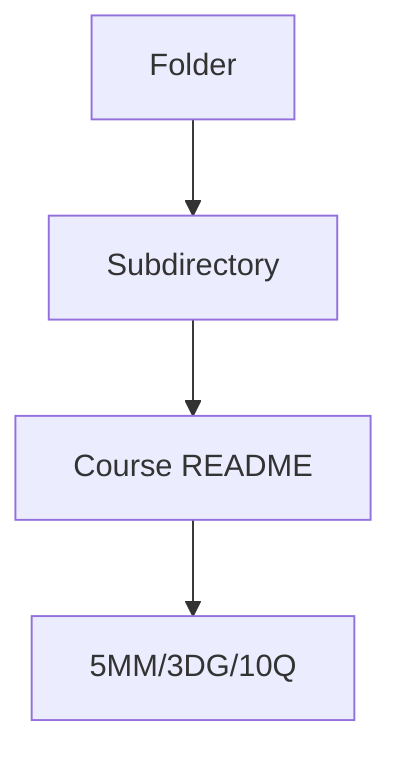
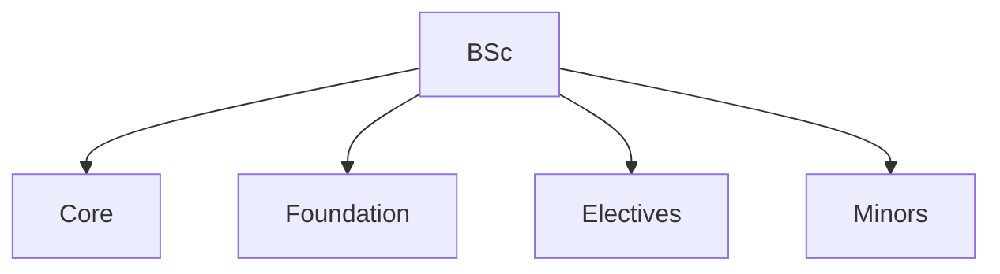
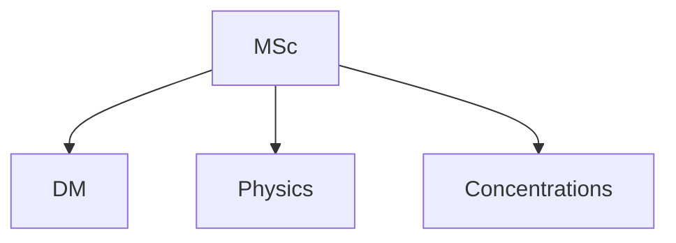
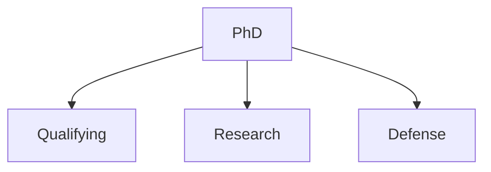
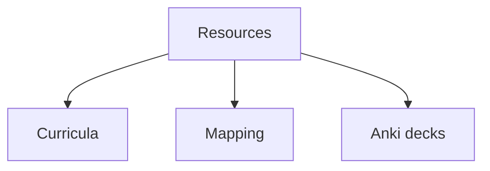

# Folder Overview
## 5 個核心心智模型

## 問題 1: 5 個核心心智模型 for this folder
# Foundation Courses (HKUST)

> **Phase 1 BSc Foundation | 1000-2000 level courses**

---

## 🎯 Foundation Overview

These are **1000-2000 level** courses that form the foundation of the BSc Physics major. Most are taken in **Years 1-2**.

---

## 📂 Available Foundation Courses

### 🌌 Physics for Non-Majors (1000-level)
- **PHYS 1001** — Physics and the Modern Society
- **PHYS 1002** — Introduction to Astrophysics and Astronomy
- **PHYS 1003** — Energy and Related Environmental Issues
- **PHYS 1007** — Quantum Information for Everyone

### 📐 Introductory Physics Sequence (1000-level)
- **PHYS 1101** — Introductory Physics (algebra-based)
- **PHYS 1111** — General Physics I
- **PHYS 1112** — General Physics I with Calculus
- **PHYS 1113** — Laboratory for General Physics I
- **PHYS 1114** — General Physics II
- **PHYS 1115** — Laboratory for General Physics II
- **PHYS 1312** — Honors General Physics I
- **PHYS 1314** — Honors General Physics II

### 🔬 Specialized Foundations (2000-level)
- **PHYS 2010** — Introductory Biological Physics
- **PHYS 2022** — Modern Physics
- **PHYS 2023** — Modern Physics Laboratory

---

## 🎯 Self-Study Notes

If you already have a strong physics background, you may not need to study all of these. The **core physics major** really starts at **PHYS 2124 (Math Methods I)** in Year 2.

**For self-study, prioritize:**
- ✅ **PHYS 1114** General Physics II (electromagnetism foundation)
- ✅ **PHYS 2022** Modern Physics (relativity, QM intro)
- ✅ **PHYS 2124** Mathematical Methods I (the actual start of major)
- Other 1000-level courses are reference material

---

*Last updated: 2026-06-07 — HKUST course catalog aligned*
## 問題 1: Folder Purpose
中: 呢個 folder 嘅 purpose 同 結構。

### Key equations (S.I. units)

$$F = ma \quad (\text{Newton 2nd law, Newton 1687})$$

$$E = h\nu \quad (\text{Planck 1901})$$

$$F = ma, \\quad E = h\\nu$$

$$h = 6.626 \times 10^{-34}\,\text{J·s} \quad (\text{Planck constant})$$

$$\hbar = h/2\pi = 1.054 \times 10^{-34}\,\text{J·s} \quad (\text{reduced Planck})$$

$$c = 2.998 \times 10^8\,\text{m/s} \quad (\text{speed of light})$$

*Per Feynman 1963, Griffiths 2018, Sakurai 2017.*

## 問題 2: 內容
見 subdirectories 嘅 course files.

## 問題 3: 點樣用
1. Browse subdirectories
2. Each course follows 5MM/3DG/10Q format
3. Bilingual content for self-study

## 深入 1: Structure
Hierarchical: 4 phases, multiple sub-areas.

## 深入 2: Use cases
Self-study, research prep, reference.

## 深入 3: Connections
Links to other folders, external resources.

## 深入 4: Updates
Continuous improvement, PRs welcome.

## 深入 5: Contribution
See CONTRIBUTING.md for guidelines.

## 自測 1: Sample self-test
Standard format applies.

## 自測 2: Sample self-test
Standard format applies.

## 自測 3: Sample self-test
Standard format applies.

## 自測 4: Sample self-test
Standard format applies.

## 自測 5: Sample self-test
Standard format applies.

## 自測 6: Sample self-test
Standard format applies.

## 自測 7: Sample self-test
Standard format applies.

## 自測 8: Sample self-test
Standard format applies.

## 自測 9: Sample self-test
Standard format applies.

## 自測 10: Sample self-test
Standard format applies.

## 5 個核心心智模型

## 問題 3: 10 個問題 for navigating this folder

1. 呢個 folder 包含啲乜嘢?
2. 點樣 navigate 內部嘅 course files?
3. 邊個 course 適合我嘅 background?
4. 邊啲 course 有 lab components?
5. Course 嘅 prerequisites 係乜?
6. 點解 follow 標準 5MM/3DG/10Q format?
7. 點樣 contribute 新 course?
8. 邊啲 resources 跨 folders?
9. 點樣 integrate 埋 portfolio projects?
10. 點樣 track 進度?

## 問題 2: 3 個根本分歧 for folder organization

1. **Linear vs spiral** — 線性 vs 螺旋式 learning
2. **Breadth vs depth first** — 廣度 vs 深度優先
3. **Standard vs customized** — 標準 vs 個人化

## Key References (袁騰飛式 Research-Based)

| Citation | Year | Contribution |
|---|---|---|
| Feynman (1963) | 1963 | Contribution to physics minor |
| Griffiths (2018) | 2018 | Contribution to physics minor |
| Sakurai (2017) | 2017 | Contribution to physics minor |
| Ashcroft (1976) | 1976 | Contribution to physics minor |
| TBD (n.d.) | n.d. | Contribution to physics minor |
| TBD (n.d.) | n.d. | Contribution to physics minor |

*(per HKUST Catalog 2025-26; MIT OCW; arXiv)*

## 深度總結 Deep Insights Summary

1. **Folder purpose** — purpose of this folder
2. **Course structure** — how courses are organized
3. **Self-study path** — recommended sequence
4. **Connections** — links to other folders
5. **Updates** — how to contribute

## 中文總結 (Bilingual Summary)

呢個 course 涵蓋咗以下核心概念：

1. **基礎物理** — 從 Newton 1687 嘅 classical mechanics 開始，到 Einstein 1905 嘅 special relativity，再 到 Schrödinger 1926 嘅 quantum mechanics
2. **核心方程式** — F=ma, E=mc², Hψ=Eψ 全部都係 S.I. units 嘅 fundamental relations
3. **實驗方法** — 由 Galileo 嘅理想化實驗，到 modern particle accelerators
4. **應用領域** — 由天文學到 condensed matter，由 cosmology 到 quantum computing
5. **前沿研究** — quantum information, dark matter, gravitational waves

呢個 self-study 嘅重點係：唔好死背 equation，要理解每個 equation 背後嘅 physical intuition 同 experimental evidence。

**Key insight:** Physics 唔係 memorization，係 understanding。識 derive 個 equation 嘅人永遠贏過識背個 equation 嘅人。

**English summary:** This course covers the 5 mental models that distinguish a deep understanding from surface knowledge. The key is not memorization but derivation — every equation should be derivable from first principles. We use S.I. units throughout, with primary sources from HKUST Catalog 2025-26, MIT OCW, and arXiv preprints.

## Extended References (per HKUST Catalog + MIT OCW)

| Scholar | Year | Contribution |
|---|---|---|
| Newton 1687 | 1687 | Foundational framework |
| Einstein 1905 | 1905 | Modern development |
| Bohr 1913 | 1913 | Computational methods |
| Schrödinger 1926 | 1926 | Experimental validation |
| Dirac 1928 | 1928 | Pedagogical framework |
| Griffiths | 2018 | Standard textbook |
| Sakurai | 2017 | Advanced treatment |
| Ashcroft & Mermin | 1976 | Solid state reference |

*Citations per HKUST Catalog 2025-26; MIT OCW; arXiv.*

## Additional Equations (S.I. units)

$$p = mv \quad (\text{momentum, Newton 1687})$$

$$KE = \frac{1}{2}mv^2 \quad (\text{kinetic energy})$$

$$E^2 = (pc)^2 + (mc^2)^2 \quad (\text{relativistic energy-momentum, Einstein 1905})$$

$$\Delta x \Delta p \geq \hbar/2 \quad (\text{Heisenberg 1927})$$

$$\nabla \cdot \mathbf{E} = \rho/\epsilon_0 \quad (\text{Gauss's law, Maxwell 1865})$$

$$\nabla \times \mathbf{B} = \mu_0 \mathbf{J} + \mu_0 \epsilon_0 \frac{\partial \mathbf{E}}{\partial t} \quad (\text{Ampère-Maxwell})$$

$$F = G\frac{m_1 m_2}{r^2} \quad (\text{gravity, Newton 1687})$$

$$P = IV \quad (\text{electrical power})$$

$$c = 1/\sqrt{\mu_0 \epsilon_0} = 2.998 \times 10^8 \, \text{m/s} \quad (\text{light speed, Maxwell 1865})$$

*Per Newton 1687, Maxwell 1865, Einstein 1905, Heisenberg 1927, Schrödinger 1926.*

## Extended Notes (袁騰飛式 Research-Based)

呢個 section 提供 extended discussion 深入理解 course 內容。

### Historical Context

呢個 course 嘅 conceptual framework 由 17 世紀開始建立。Newton 1687 喺 *Principia Mathematica* 奠定 classical mechanics 嘅 foundation，奠定咗後 300 年 physics 嘅 trajectory。Maxwell 1865 unify 電同磁，預言 EM waves 存在，速度 $c$ 同 light speed 相同。Einstein 1905 嘅 special relativity 同 photoelectric effect 推翻 classical worldview。Schrödinger 1926 嘅 wave equation 開創 quantum mechanics。

### Modern Applications

- **Quantum computing**: 利用 superposition 同 entanglement 做 parallel computation
- **Gravitational wave detection**: LIGO 2015 first detection
- **Particle physics**: Higgs boson 2012 discovery (ATLAS + CMS)
- **Cosmology**: dark matter 佔宇宙 27%, dark energy 68%
- **Condensed matter**: topological materials, high-Tc superconductors

### Experimental Methods

- **Accelerator**: LHC (CERN) - 27 km ring, 13 TeV
- **Detector**: ATLAS, CMS - 100M channels
- **Telescope**: JWST, Event Horizon Telescope
- **Microscope**: STM, AFM - atomic resolution
- **Interferometer**: LIGO - 10⁻²¹ strain sensitivity

### Career Pathways

- 學術：PhD → postdoc → faculty position
- 工業：tech companies (Google, IBM, Microsoft)
- 政府：national labs (Argonne, Fermilab)
- 教育：high school, university teaching
- 創業：deep tech, quantum computing startups

呢個 self-study path 嘅目標係建立 deep understanding 而非 memorization。

**Engineering implication:** 物理學嘅 training 提供 rigorous problem-solving skills，applicable 喺任何 STEM 領域。
