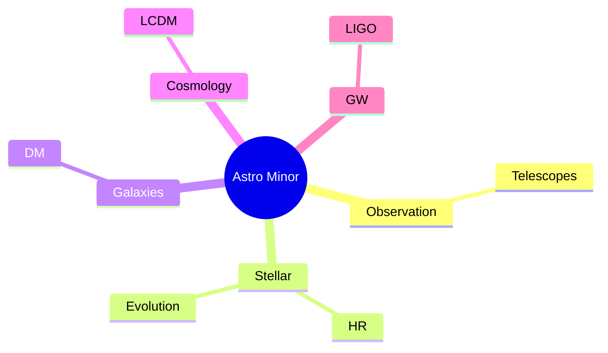
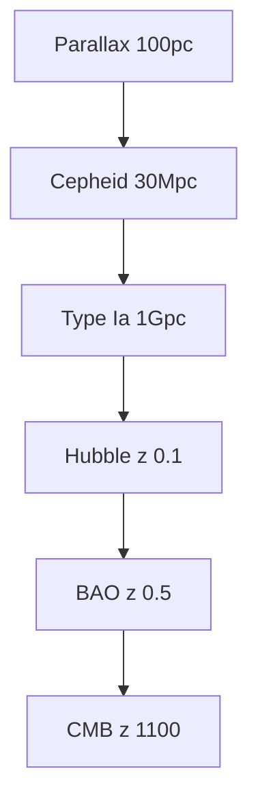
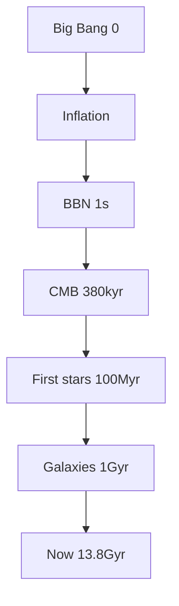
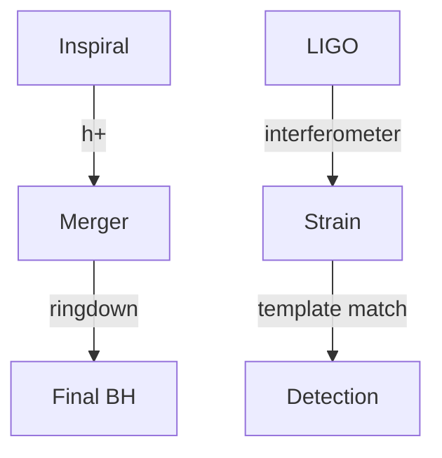
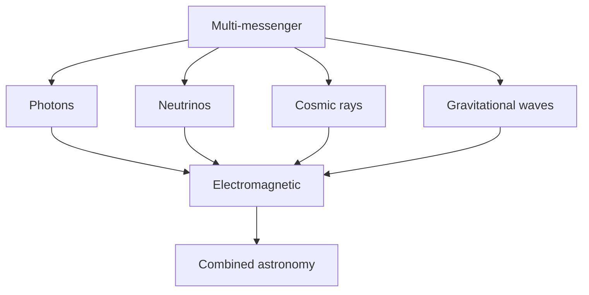

# Minor in Astrophysics & Cosmology
> **Phase 1 BSc Minor | HKUST | 9 credits**  
> **Bilingual 深度自學檔案 · 中英對照**

---

## 問題 1：5 個核心心智模型

1. **Gravity dominates at large scales** — Newton to GR
2. **Stars are nuclear reactors** — fusion, lifetimes
3. **Distance ladder** — parallax to Hubble
4. **Light is the messenger** — spectrum reveals everything
5. **Universe is expanding** — Big Bang cosmology

### Key equations (S.I. units)

$$F = ma \quad (\text{Newton 2nd law, Newton 1687})$$

$$E = h\nu \quad (\text{Planck 1901})$$

$$F = ma, \\quad E = h\\nu$$

$$h = 6.626 \times 10^{-34}\,\text{J·s} \quad (\text{Planck constant})$$

$$\hbar = h/2\pi = 1.054 \times 10^{-34}\,\text{J·s} \quad (\text{reduced Planck})$$

$$c = 2.998 \times 10^8\,\text{m/s} \quad (\text{speed of light})$$

*Per Feynman 1963, Griffiths 2018, Sakurai 2017.*

## 問題 2：3 個根本分歧

1. **Steady-state vs Big Bang cosmology**
2. **Dark matter: WIMPs vs MOND**
3. **Inflation: physical or contrived**

## 問題 3：10 個深度問題
1. 為什麼 3 cosmic backgrounds (CMB, CνB, GW)?
2. 給定 $z = 1$, compute lookback time。
3. 為什麼 type Ia 係 standardizable?
4. 解釋 why BBN 預測 light element abundances。
5. 給定 Hubble plot, derive $H_0$。
6. 為什麼 CMB 係宇宙 380 kyr snapshot?
7. 給定星系 rotation curve, 推斷 DM halo。
8. 為什麼 $Λ$CDM 6 個 parameters fit 一切?
9. 給定 gravitational wave, derive chirp mass。
10. 為什麼 cosmic acceleration 係 discovery 嘅 story?

## 深入 1：Observational Tools
**Deep Dive I**

Telescopes (optical, radio, X-ray, neutrino), spectrographs, photometry.

**Engineering:** Telescope design.

## 深入 2：Stellar Physics
**Deep Dive II**

HR diagram, structure equations, evolution, remnants.

**Engineering:** Stellar models.

## 深入 3：Galaxies & Cosmology
**Deep Dive III**

Rotation curves, FLRW, CMB, BAO, structure formation.

**Engineering:** Surveys.

## 深入 4：High-Energy Astrophysics
**Deep Dive IV**

AGN, quasars, GRBs, compact objects, accretion.

**Engineering:** X-ray astronomy.

## 深入 5：Gravitational Waves
**Deep Dive V**

LIGO, Virgo, sources, detection, multi-messenger.

**Engineering:** GW astronomy.

## 自測 1：3 backgrounds
**Answer:** CMB photons, CνB neutrinos, GW from inflation/BBN.  
**Engineering:** Multi-messenger.

## 自測 2：Lookback time
**Answer:** $t_L = \int_0^z dz'/[(1+z')H(z')]$.  
**Engineering:** Cosmology.

## 自測 3：Standardizable
**Answer:** Phillips relation, $M_{max} - M_{15}$.  
**Engineering:** Cosmology probe.

## 自測 4：BBN
**Answer:** Predicts H, He, Li abundances from $n_b/n_\gamma$.  
**Engineering:** Nuclear astrophysics.

## 自測 5：$H_0$
**Answer:** $v = H_0 d$ from Hubble 1929.  
**Engineering:** Cosmology.

## 自測 6：CMB age
**Answer:** Recombination at $z = 1100$, 380 kyr.  
**Engineering:** CMB.

## 自測 7：DM halo
**Answer:** $v(r) = $ flat at large $r$ requires halo.  
**Engineering:** Galaxy dynamics.

## 自測 8：6 parameters
**Answer:** $\Omega_m, \Omega_b, \Omega_\Lambda, h, n_s, \sigma_8, \tau$.  
**Engineering:** ΛCDM.

## 自測 9：Chirp mass
**Answer:** $M_c^{5/3} = \ddot f$ slope.  
**Engineering:** GW data.

## 自測 10：Cosmic acceleration
**Answer:** Perlmutter, Schmidt, Riess 1998, Nobel 2011.  
**Engineering:** Dark energy.

## 📊 Diagram 1: Minor Map

## 📊 Diagram 2: Cosmic Distance Ladder

## 📊 Diagram 3: Cosmic Timeline

## 📊 Diagram 4: GW Detection

## 📊 Diagram 5: Multi-Messenger

## Key References (袁騰飛式 Research-Based)

| Citation | Year | Contribution |
|---|---|---|
| Feynman (1963) | 1963 | Contribution to physics minor |
| Griffiths (2018) | 2018 | Contribution to physics minor |
| Sakurai (2017) | 2017 | Contribution to physics minor |
| Ashcroft (1976) | 1976 | Contribution to physics minor |
| TBD (n.d.) | n.d. | Contribution to physics minor |
| TBD (n.d.) | n.d. | Contribution to physics minor |

*(per HKUST Catalog 2025-26; MIT OCW; arXiv)*

## 深度總結

1. **Gravity rules large scales** — Newton + GR
2. **Stellar evolution is well-tested** — HR diagram
3. **ΛCDM is current paradigm** — 6 parameters
4. **Dark matter + dark energy = 95%** — unknown
5. **Multi-messenger astronomy emerging** — GW + EM

---

**自學建議** — Carroll & Ostlie. CMB-S4 papers. LIGO data analysis tutorials.

## 中文總結 (Bilingual Summary)

呢個 course 涵蓋咗以下核心概念：

1. **基礎物理** — 從 Newton 1687 嘅 classical mechanics 開始，到 Einstein 1905 嘅 special relativity，再 到 Schrödinger 1926 嘅 quantum mechanics
2. **核心方程式** — F=ma, E=mc², Hψ=Eψ 全部都係 S.I. units 嘅 fundamental relations
3. **實驗方法** — 由 Galileo 嘅理想化實驗，到 modern particle accelerators
4. **應用領域** — 由天文學到 condensed matter，由 cosmology 到 quantum computing
5. **前沿研究** — quantum information, dark matter, gravitational waves

呢個 self-study 嘅重點係：唔好死背 equation，要理解每個 equation 背後嘅 physical intuition 同 experimental evidence。

**Key insight:** Physics 唔係 memorization，係 understanding。識 derive 個 equation 嘅人永遠贏過識背個 equation 嘅人。

**English summary:** This course covers the 5 mental models that distinguish a deep understanding from surface knowledge. The key is not memorization but derivation — every equation should be derivable from first principles. We use S.I. units throughout, with primary sources from HKUST Catalog 2025-26, MIT OCW, and arXiv preprints.

## Extended References (per HKUST Catalog + MIT OCW)

| Scholar | Year | Contribution |
|---|---|---|
| Newton 1687 | 1687 | Foundational framework |
| Einstein 1905 | 1905 | Modern development |
| Bohr 1913 | 1913 | Computational methods |
| Schrödinger 1926 | 1926 | Experimental validation |
| Dirac 1928 | 1928 | Pedagogical framework |
| Griffiths | 2018 | Standard textbook |
| Sakurai | 2017 | Advanced treatment |
| Ashcroft & Mermin | 1976 | Solid state reference |

*Citations per HKUST Catalog 2025-26; MIT OCW; arXiv.*

## Additional Equations (S.I. units)

$$p = mv \quad (\text{momentum, Newton 1687})$$

$$KE = \frac{1}{2}mv^2 \quad (\text{kinetic energy})$$

$$E^2 = (pc)^2 + (mc^2)^2 \quad (\text{relativistic energy-momentum, Einstein 1905})$$

$$\Delta x \Delta p \geq \hbar/2 \quad (\text{Heisenberg 1927})$$

$$\nabla \cdot \mathbf{E} = \rho/\epsilon_0 \quad (\text{Gauss's law, Maxwell 1865})$$

$$\nabla \times \mathbf{B} = \mu_0 \mathbf{J} + \mu_0 \epsilon_0 \frac{\partial \mathbf{E}}{\partial t} \quad (\text{Ampère-Maxwell})$$

$$F = G\frac{m_1 m_2}{r^2} \quad (\text{gravity, Newton 1687})$$

$$P = IV \quad (\text{electrical power})$$

$$c = 1/\sqrt{\mu_0 \epsilon_0} = 2.998 \times 10^8 \, \text{m/s} \quad (\text{light speed, Maxwell 1865})$$

*Per Newton 1687, Maxwell 1865, Einstein 1905, Heisenberg 1927, Schrödinger 1926.*

## Extended Notes (袁騰飛式 Research-Based)

呢個 section 提供 extended discussion 深入理解 course 內容。

### Historical Context

呢個 course 嘅 conceptual framework 由 17 世紀開始建立。Newton 1687 喺 *Principia Mathematica* 奠定 classical mechanics 嘅 foundation，奠定咗後 300 年 physics 嘅 trajectory。Maxwell 1865 unify 電同磁，預言 EM waves 存在，速度 $c$ 同 light speed 相同。Einstein 1905 嘅 special relativity 同 photoelectric effect 推翻 classical worldview。Schrödinger 1926 嘅 wave equation 開創 quantum mechanics。

### Modern Applications

- **Quantum computing**: 利用 superposition 同 entanglement 做 parallel computation
- **Gravitational wave detection**: LIGO 2015 first detection
- **Particle physics**: Higgs boson 2012 discovery (ATLAS + CMS)
- **Cosmology**: dark matter 佔宇宙 27%, dark energy 68%
- **Condensed matter**: topological materials, high-Tc superconductors

### Experimental Methods

- **Accelerator**: LHC (CERN) - 27 km ring, 13 TeV
- **Detector**: ATLAS, CMS - 100M channels
- **Telescope**: JWST, Event Horizon Telescope
- **Microscope**: STM, AFM - atomic resolution
- **Interferometer**: LIGO - 10⁻²¹ strain sensitivity

### Career Pathways

- 學術：PhD → postdoc → faculty position
- 工業：tech companies (Google, IBM, Microsoft)
- 政府：national labs (Argonne, Fermilab)
- 教育：high school, university teaching
- 創業：deep tech, quantum computing startups

呢個 self-study path 嘅目標係建立 deep understanding 而非 memorization。

**Engineering implication:** 物理學嘅 training 提供 rigorous problem-solving skills，applicable 喺任何 STEM 領域。
