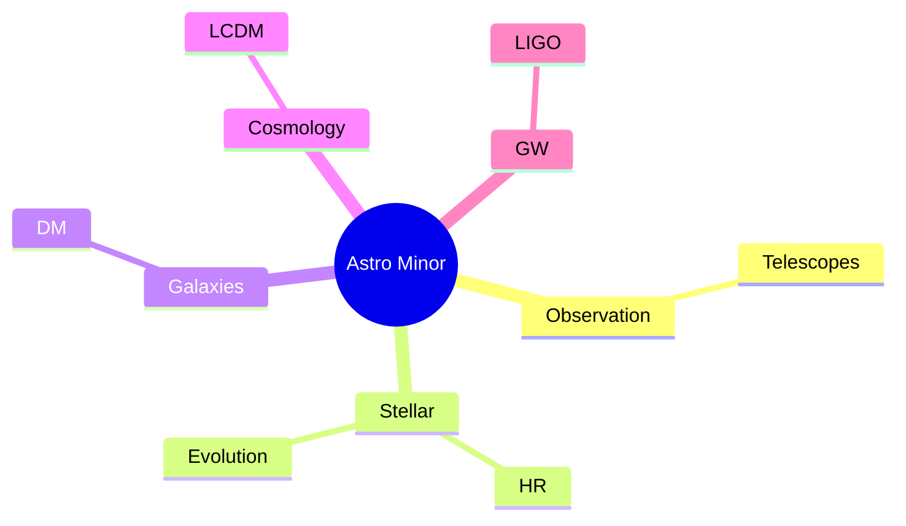
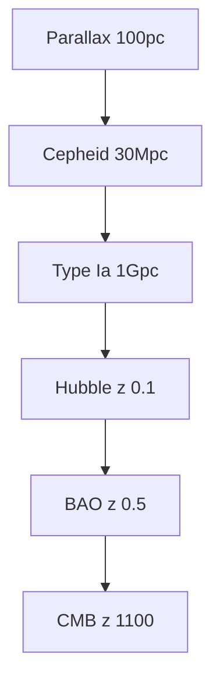
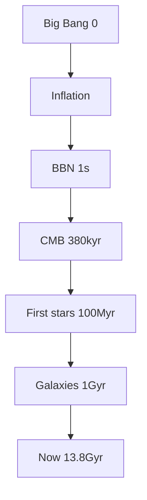
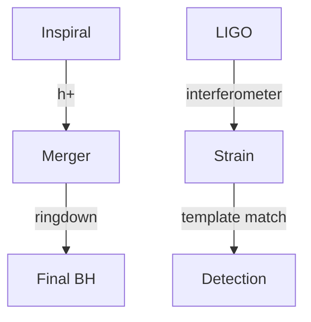
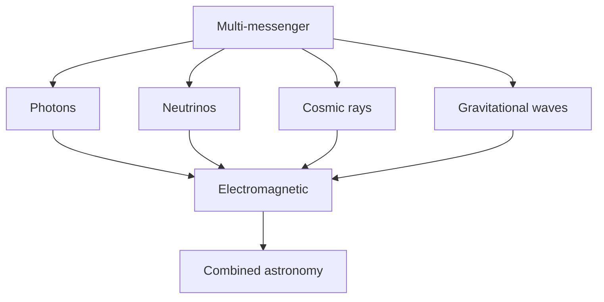

# Minor in Astrophysics & Cosmology
> **Phase 1 BSc Minor | HKUST | 9 credits**  
> **Bilingual 深度自學檔案 · 中英對照**

---

## 問題 1：5 個核心心智模型

1. **Gravity dominates at large scales** — Newton to GR
2. **Stars are nuclear reactors** — fusion, lifetimes
3. **Distance ladder** — parallax to Hubble
4. **Light is the messenger** — spectrum reveals everything
5. **Universe is expanding** — Big Bang cosmology

## 問題 2：3 個根本分歧

1. **Steady-state vs Big Bang cosmology**
2. **Dark matter: WIMPs vs MOND**
3. **Inflation: physical or contrived**

## 問題 3：10 個深度問題
1. 為什麼 3 cosmic backgrounds (CMB, CνB, GW)?
2. 給定 $z = 1$, compute lookback time。
3. 為什麼 type Ia 係 standardizable?
4. 解釋 why BBN 預測 light element abundances。
5. 給定 Hubble plot, derive $H_0$。
6. 為什麼 CMB 係宇宙 380 kyr snapshot?
7. 給定星系 rotation curve, 推斷 DM halo。
8. 為什麼 $Λ$CDM 6 個 parameters fit 一切?
9. 給定 gravitational wave, derive chirp mass。
10. 為什麼 cosmic acceleration 係 discovery 嘅 story?

## 深入 1：Observational Tools
**Deep Dive I**

Telescopes (optical, radio, X-ray, neutrino), spectrographs, photometry.

**Engineering:** Telescope design.

## 深入 2：Stellar Physics
**Deep Dive II**

HR diagram, structure equations, evolution, remnants.

**Engineering:** Stellar models.

## 深入 3：Galaxies & Cosmology
**Deep Dive III**

Rotation curves, FLRW, CMB, BAO, structure formation.

**Engineering:** Surveys.

## 深入 4：High-Energy Astrophysics
**Deep Dive IV**

AGN, quasars, GRBs, compact objects, accretion.

**Engineering:** X-ray astronomy.

## 深入 5：Gravitational Waves
**Deep Dive V**

LIGO, Virgo, sources, detection, multi-messenger.

**Engineering:** GW astronomy.

## 自測 1：3 backgrounds
**Answer:** CMB photons, CνB neutrinos, GW from inflation/BBN.  
**Engineering:** Multi-messenger.

## 自測 2：Lookback time
**Answer:** $t_L = \int_0^z dz'/[(1+z')H(z')]$.  
**Engineering:** Cosmology.

## 自測 3：Standardizable
**Answer:** Phillips relation, $M_{max} - M_{15}$.  
**Engineering:** Cosmology probe.

## 自測 4：BBN
**Answer:** Predicts H, He, Li abundances from $n_b/n_\gamma$.  
**Engineering:** Nuclear astrophysics.

## 自測 5：$H_0$
**Answer:** $v = H_0 d$ from Hubble 1929.  
**Engineering:** Cosmology.

## 自測 6：CMB age
**Answer:** Recombination at $z = 1100$, 380 kyr.  
**Engineering:** CMB.

## 自測 7：DM halo
**Answer:** $v(r) = $ flat at large $r$ requires halo.  
**Engineering:** Galaxy dynamics.

## 自測 8：6 parameters
**Answer:** $\Omega_m, \Omega_b, \Omega_\Lambda, h, n_s, \sigma_8, \tau$.  
**Engineering:** ΛCDM.

## 自測 9：Chirp mass
**Answer:** $M_c^{5/3} = \ddot f$ slope.  
**Engineering:** GW data.

## 自測 10：Cosmic acceleration
**Answer:** Perlmutter, Schmidt, Riess 1998, Nobel 2011.  
**Engineering:** Dark energy.

## 📊 Diagram 1: Minor Map

## 📊 Diagram 2: Cosmic Distance Ladder

## 📊 Diagram 3: Cosmic Timeline

## 📊 Diagram 4: GW Detection

## 📊 Diagram 5: Multi-Messenger

## 深度總結

1. **Gravity rules large scales** — Newton + GR
2. **Stellar evolution is well-tested** — HR diagram
3. **ΛCDM is current paradigm** — 6 parameters
4. **Dark matter + dark energy = 95%** — unknown
5. **Multi-messenger astronomy emerging** — GW + EM

---

**自學建議** — Carroll & Ostlie. CMB-S4 papers. LIGO data analysis tutorials.
