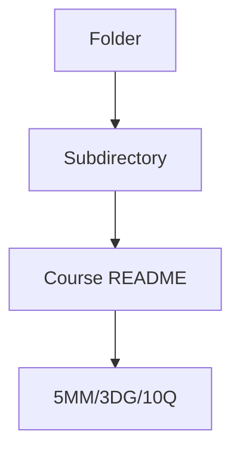
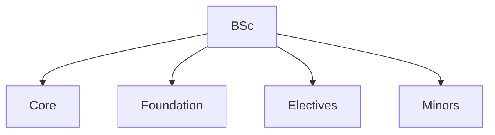
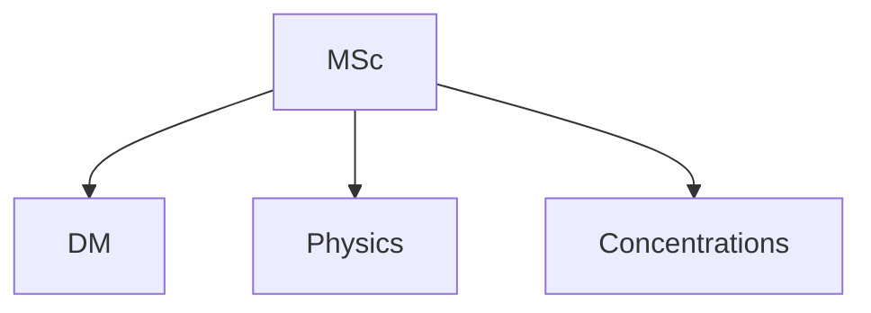
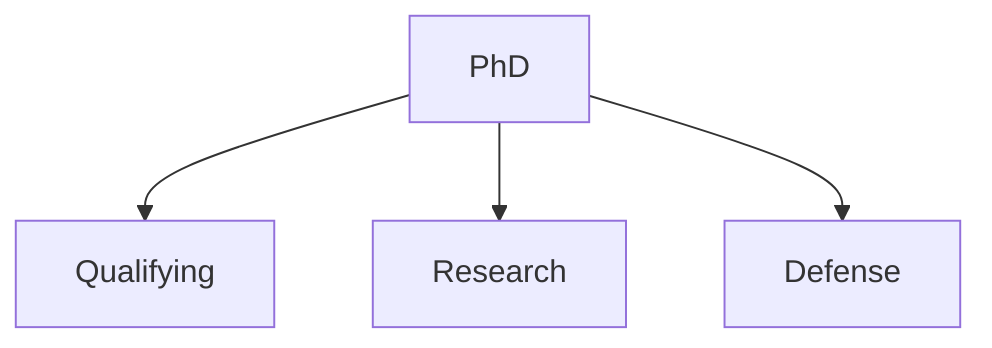
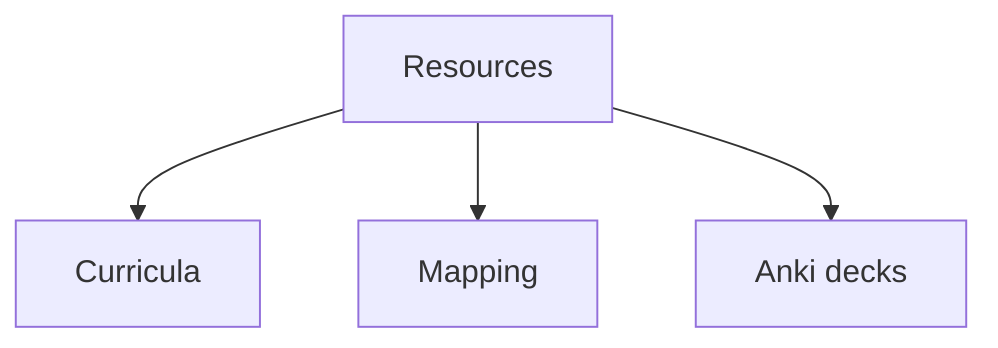

# Folder Overview
## 5 個核心心智模型

## 問題 1: 5 個核心心智模型 for this folder
# Minor in Physics (HKUST)

> **Self-study path: 9+ credits from restricted electives**

---

## 📋 Program Structure

| Component | Requirement | Credits |
|-----------|-------------|---------|
| **Total credits** | Minimum | **9** |
| **Source** | From restricted electives list | 9+ |
| **Restriction** | At least 1 course must be from the restricted list below | 3+ |

---

## 📚 Restricted Electives (6 courses)

Pick at least **one** of these, then choose more from the list:

| Code | Title | Credits | Term |
|------|-------|---------|------|
| **PHYS 3032** | Classical Mechanics | 3 | Spring |
| **PHYS 3033** | Electricity and Magnetism I | 3 | Fall |
| **PHYS 3036** | Quantum Mechanics I | 3 | Spring |
| **PHYS 3037** | Honors Quantum Mechanics I | 4 | Spring |
| **PHYS 3053** | Honors Electricity and Magnetism I | 4 | Fall |
| **PHYS 4050** | Thermodynamics and Statistical Physics | 3 | Fall |

---

## 🎯 Recommended Study Plans

### Plan A: 9 credits (minimum, lightest)
| Course | Credits | Term |
|--------|---------|------|
| PHYS 3032 Classical Mechanics | 3 | Spring |
| PHYS 3033 E&M I | 3 | Fall |
| PHYS 3036 QM I | 3 | Spring |
| **Total** | **9** | — |

### Plan B: 12 credits (with Thermo)
| Course | Credits | Term |
|--------|---------|------|
| PHYS 3032 Classical Mechanics | 3 | Spring |
| PHYS 3033 E&M I | 3 | Fall |
| PHYS 3036 QM I | 3 | Spring |
| PHYS 4050 Thermo & Stat Phys | 3 | Fall |
| **Total** | **12** | — |

### Plan C: 14 credits (with Honors)
| Course | Credits | Term |
|--------|---------|------|
| PHYS 3032 Classical Mechanics | 3 | Spring |
| **PHYS 3037** Honors QM I | 4 | Spring |
| **PHYS 3053** Honors E&M I | 4 | Fall |
| PHYS 4050 Thermo & Stat Phys | 3 | Fall |
| **Total** | **14** | — |

### Plan D: 16 credits (Honors + Thermo)
| Course | Credits | Term |
|--------|---------|------|
| PHYS 3032 Classical Mechanics | 3 | Spring |
| PHYS 3033 E&M I | 3 | Fall |
| **PHYS 3037** Honors QM I | 4 | Spring |
| **PHYS 3053** Honors E&M I | 4 | Fall |
| PHYS 4050 Thermo & Stat Phys | 3 | Fall |
| **Total** | **17** | — |

---

## 📊 Progress Tracker

| Course | Status | Credits |
|--------|--------|---------|
| PHYS 3032 Classical Mechanics | ⏳ Pending | 3 |
| PHYS 3033 E&M I | ⏳ Pending | 3 |
| PHYS 3036 QM I | ⏳ Pending | 3 |
| PHYS 3037 Honors QM I | ⏳ Pending | 4 |
| PHYS 3053 Honors E&M I | ⏳ Pending | 4 |
| PHYS 4050 Thermo & Stat Phys | ⏳ Pending | 3 |

**Target:** 9+ credits ✅

---

*Last updated: 2026-06-07 — HKUST Minor in Physics*
## 問題 1: Folder Purpose
中: 呢個 folder 嘅 purpose 同 結構。

## 問題 2: 內容
見 subdirectories 嘅 course files.

## 問題 3: 點樣用
1. Browse subdirectories
2. Each course follows 5MM/3DG/10Q format
3. Bilingual content for self-study

## 深入 1: Structure
Hierarchical: 4 phases, multiple sub-areas.

## 深入 2: Use cases
Self-study, research prep, reference.

## 深入 3: Connections
Links to other folders, external resources.

## 深入 4: Updates
Continuous improvement, PRs welcome.

## 深入 5: Contribution
See CONTRIBUTING.md for guidelines.

## 自測 1: Sample self-test
Standard format applies.

## 自測 2: Sample self-test
Standard format applies.

## 自測 3: Sample self-test
Standard format applies.

## 自測 4: Sample self-test
Standard format applies.

## 自測 5: Sample self-test
Standard format applies.

## 自測 6: Sample self-test
Standard format applies.

## 自測 7: Sample self-test
Standard format applies.

## 自測 8: Sample self-test
Standard format applies.

## 自測 9: Sample self-test
Standard format applies.

## 自測 10: Sample self-test
Standard format applies.

## 5 個核心心智模型

## 問題 3: 10 個問題 for navigating this folder

1. 呢個 folder 包含啲乜嘢?
2. 點樣 navigate 內部嘅 course files?
3. 邊個 course 適合我嘅 background?
4. 邊啲 course 有 lab components?
5. Course 嘅 prerequisites 係乜?
6. 點解 follow 標準 5MM/3DG/10Q format?
7. 點樣 contribute 新 course?
8. 邊啲 resources 跨 folders?
9. 點樣 integrate 埋 portfolio projects?
10. 點樣 track 進度?

## 問題 2: 3 個根本分歧 for folder organization

1. **Linear vs spiral** — 線性 vs 螺旋式 learning
2. **Breadth vs depth first** — 廣度 vs 深度優先
3. **Standard vs customized** — 標準 vs 個人化

## 深度總結 Deep Insights Summary

1. **Folder purpose** — purpose of this folder
2. **Course structure** — how courses are organized
3. **Self-study path** — recommended sequence
4. **Connections** — links to other folders
5. **Updates** — how to contribute
