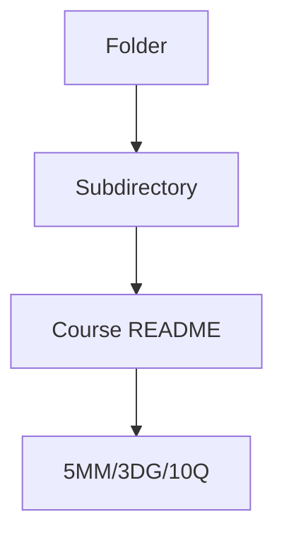
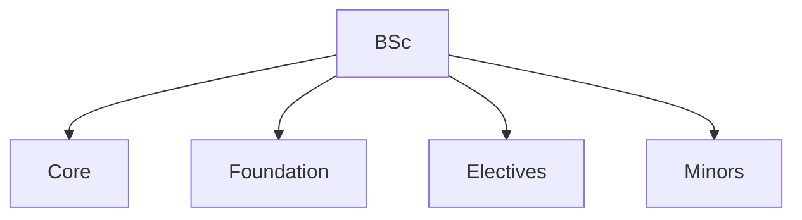
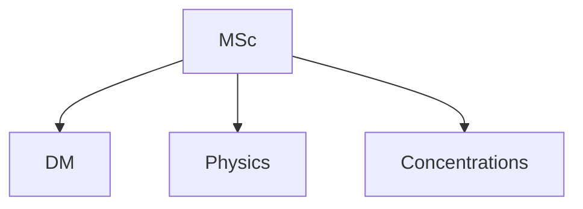
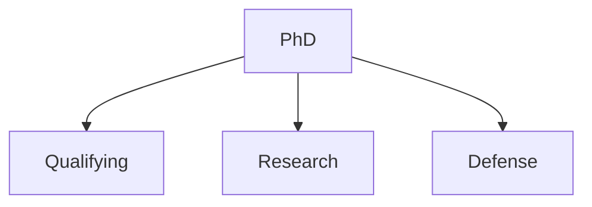
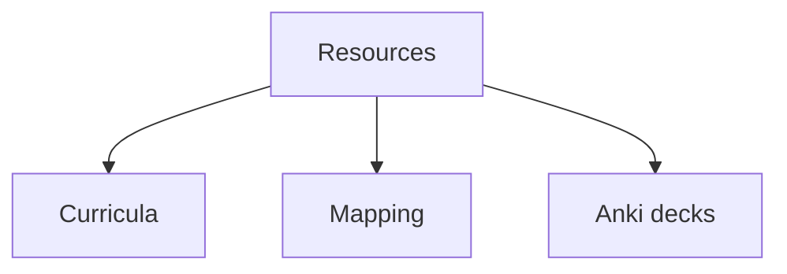

# Folder Overview
## 5 個核心心智模型

## 問題 1: 5 個核心心智模型 for this folder
# Minor Programs (HKUST)

> **Phase 1 | HKUST Undergraduate Minor Programs aligned for self-study**

---

## 🎯 What is a Minor Program?

A **Minor Program** at HKUST is a secondary area of specialization that complements your major. For a Physics major, you might also pursue a minor in Astrophysics & Cosmology. For non-Physics majors (e.g., Engineering, CS), a Physics minor demonstrates quantitative rigor.

This self-study project supports the following minor pathways:

---

## 📂 Available Minor Programs

### 1. **Minor in Physics** (`Minor_in_Physics/`)
- **Credits required:** 9 minimum
- **Structure:** Physics electives, with at least one from restricted list
- **Restricted electives:**
  - PHYS 3032 Classical Mechanics (3)
  - PHYS 3033 Electricity and Magnetism I (3)
  - PHYS 3036 Quantum Mechanics I (3)
  - PHYS 3037 Honors Quantum Mechanics I (4)
  - PHYS 3053 Honors Electricity and Magnetism I (4)
  - PHYS 4050 Thermodynamics and Statistical Physics (3)

### 2. **Minor in Astrophysics and Cosmology (MINOR-ASCO)** (`Minor_in_Astrophysics_Cosmology/`)
- **Credits required:** 9 minimum
- **Structure:** 3-4 credits from foundation + PHYS 3071 + 3 credits from PHYS 4055/4071
- **Foundation (3-4 credits from):**
  - PHYS 2124 Mathematical Methods in Physics I (3)
  - PHYS 3036 Quantum Mechanics I (3)
  - PHYS 3037 Honors Quantum Mechanics I (4)
  - MATH 2351 Introduction to Differential Equations (3)
  - MATH 2352 Differential Equations (4)
- **Required:**
  - PHYS 3071 Introduction to Stellar Astrophysics (3)
- **Advanced (3 credits from):**
  - PHYS 4055 Particle Physics and the Universe (3)
  - PHYS 4071 Big Bang Cosmology and Inflation (3)

---

## 🎯 Who Should Pursue a Minor?

### Minor in Physics
- Engineering majors wanting physics depth
- Math majors wanting physics applications
- CS majors interested in computational physics
- Career pivot to physics

### Minor in Astrophysics and Cosmology
- Physics majors wanting astronomy depth
- Engineering/science majors interested in space
- Future research in cosmology
- Complementary to data science / ML

---

## 📁 Folder Structure

```
01_BSc_Physics/minors/
├── README.md                        ← You are here
├── Minor_in_Physics/
│   ├── README.md
│   ├── progress.md
│   └── (course-specific notes)
└── Minor_in_Astrophysics_Cosmology/
    ├── README.md
    ├── progress.md
    └── (course-specific notes)
```

---

*Last updated: 2026-06-07 — HKUST Minor programs added*
## 問題 1: Folder Purpose
中: 呢個 folder 嘅 purpose 同 結構。

## 問題 2: 內容
見 subdirectories 嘅 course files.

## 問題 3: 點樣用
1. Browse subdirectories
2. Each course follows 5MM/3DG/10Q format
3. Bilingual content for self-study

## 深入 1: Structure
Hierarchical: 4 phases, multiple sub-areas.

## 深入 2: Use cases
Self-study, research prep, reference.

## 深入 3: Connections
Links to other folders, external resources.

## 深入 4: Updates
Continuous improvement, PRs welcome.

## 深入 5: Contribution
See CONTRIBUTING.md for guidelines.

## 自測 1: Sample self-test
Standard format applies.

## 自測 2: Sample self-test
Standard format applies.

## 自測 3: Sample self-test
Standard format applies.

## 自測 4: Sample self-test
Standard format applies.

## 自測 5: Sample self-test
Standard format applies.

## 自測 6: Sample self-test
Standard format applies.

## 自測 7: Sample self-test
Standard format applies.

## 自測 8: Sample self-test
Standard format applies.

## 自測 9: Sample self-test
Standard format applies.

## 自測 10: Sample self-test
Standard format applies.











## 5 個核心心智模型

## 問題 3: 10 個問題 for navigating this folder

1. 呢個 folder 包含啲乜嘢?
2. 點樣 navigate 內部嘅 course files?
3. 邊個 course 適合我嘅 background?
4. 邊啲 course 有 lab components?
5. Course 嘅 prerequisites 係乜?
6. 點解 follow 標準 5MM/3DG/10Q format?
7. 點樣 contribute 新 course?
8. 邊啲 resources 跨 folders?
9. 點樣 integrate 埋 portfolio projects?
10. 點樣 track 進度?

## 問題 2: 3 個根本分歧 for folder organization

1. **Linear vs spiral** — 線性 vs 螺旋式 learning
2. **Breadth vs depth first** — 廣度 vs 深度優先
3. **Standard vs customized** — 標準 vs 個人化

## 深度總結 Deep Insights Summary

1. **Folder purpose** — purpose of this folder
2. **Course structure** — how courses are organized
3. **Self-study path** — recommended sequence
4. **Connections** — links to other folders
5. **Updates** — how to contribute
