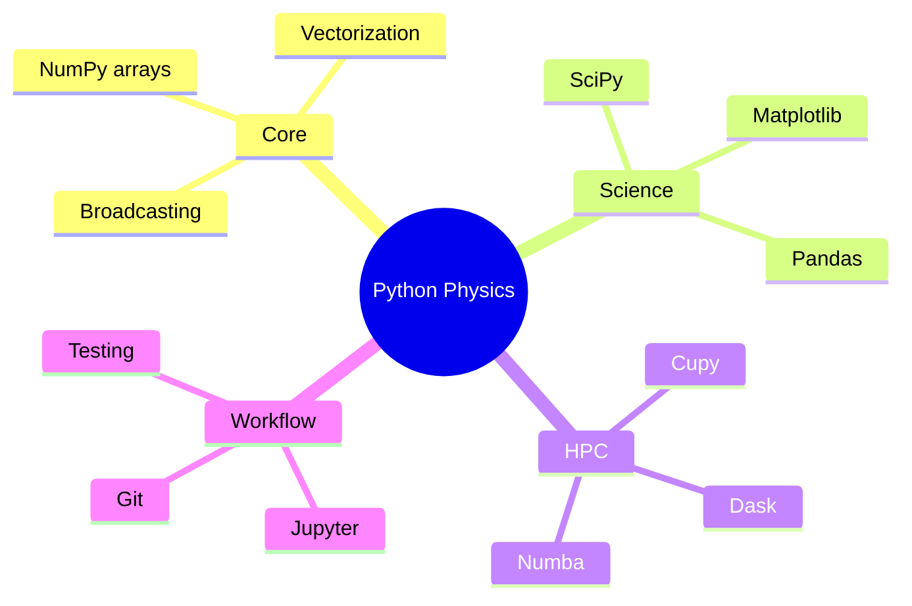
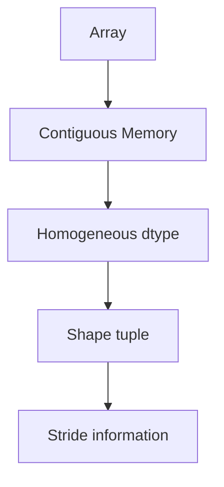
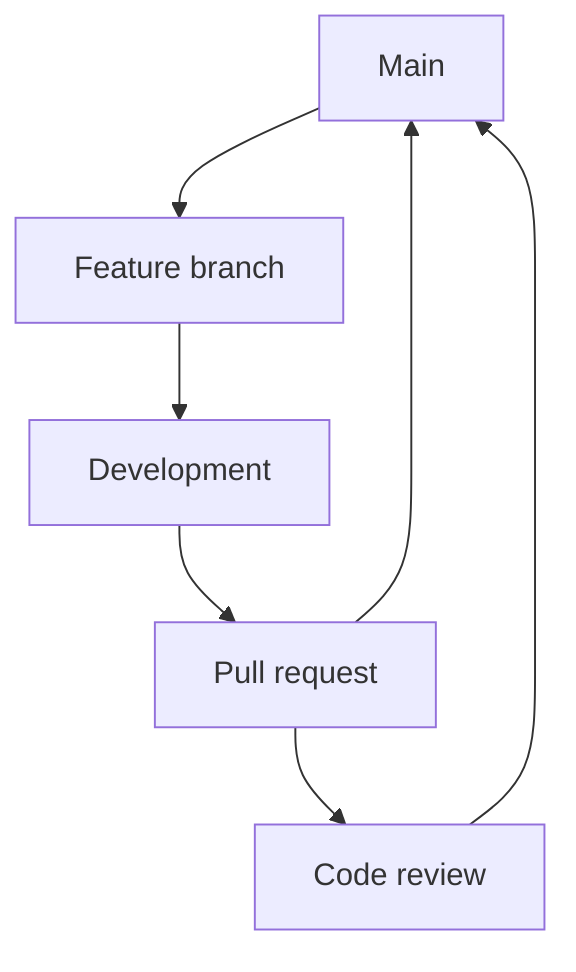
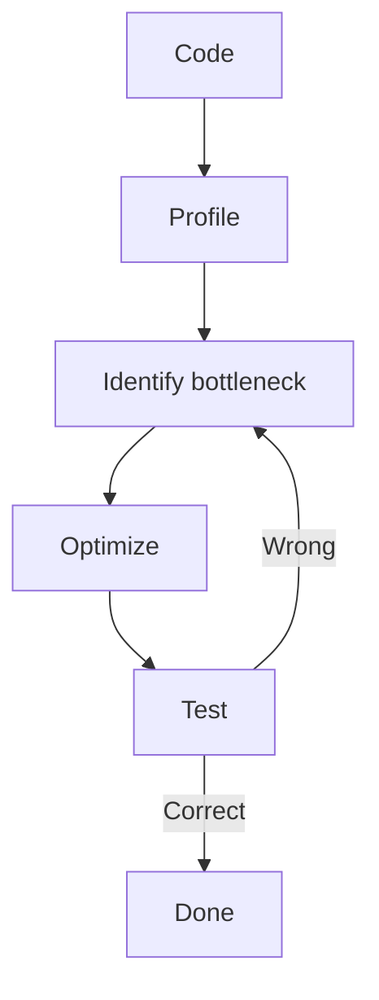
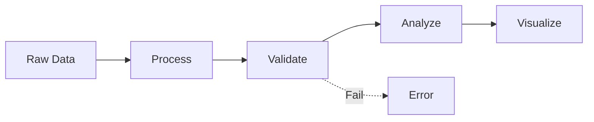

# MSDM 5001 — Computational Tools for Data-Driven Physics
> **MSc Data-Driven Modeling Core | HKUST MSDM 5001 | Python ecosystem, Linux, version control, data handling**  
> **Bilingual 深度自學檔案 · 中英對照**

---

## 問題 1：5 個核心心智模型

1. **Python is the lingua franca of physics computing** — Python是物理計算的通用語 (NumPy, SciPy, Matplotlib ecosystem)
2. **Git enables reproducible research** — Git實現可重現研究 (version control, collaboration, backup)
3. **Linux provides HPC environment** — Linux提供高性能計算環境 (clusters, SLURM, shell scripting)
4. **Data structures determine algorithm efficiency** — 數據結構決定算法效率 (arrays, trees, hashes)
5. **Testing prevents silent failures** — 測試防止靜默失敗 (unit tests, continuous integration)

## 問題 2：3 個根本分歧

1. **Jupyter vs script-based development**
   - Jupyter: interactive exploration, visualization, reproducibility issues
   - Scripts: production code, version control, testing easier

2. **Virtual environments: conda vs venv vs poetry**
   - Conda: package management for C libraries too
   - Venv: built-in, simple
   - Poetry: modern, reproducible builds

3. **Floating point: double vs single precision**
   - Double: safe default for physics, 15 significant digits
   - Single: 2x memory, faster on GPU, sufficient for some ML

## 問題 3：10 個深度問題

1. 給定 $N$ elements, 分析 NumPy broadcasting 的時間複雜度。
2. 解釋為什麼 Python lists 比 NumPy arrays 慢 100x for numerical operations。
3. 為什麼 JIT compilation (Numba) 能加速 Python loop 100x?
4. 給定 Git workflow, 設計 branching strategy for research project。
5. 解釋為什麼 floating point comparison 需要 tolerance。
6. 為什麼 profiling 係 optimization 的第一步?
7. 給定 large dataset, 點樣選擇 data format (HDF5, Parquet, CSV)?
8. 解釋多進程 vs 多線程在 Python 的限制。
9. 為什麼 type hints improve code quality?
10. 給定 experiment data, 點樣 implement reproducible pipeline?

## 深入 1：NumPy Essentials
**Deep Dive I**

### Array Operations
NumPy核心是ndarray:
```python
import numpy as np
a = np.array([1.0, 2.0, 3.0], dtype=np.float64)
b = np.linspace(0, 2*np.pi, 100)
c = np.zeros((100, 100), dtype=np.complex128)
```

Broadcasting rules:
- Shapes match or one is 1
- Output shape = element-wise maximum

### Vectorized Operations
Element-wise operations:
```python
x = np.linspace(-5, 5, 1000)
y = np.sin(x) * np.exp(-x**2/2)  # Vectorized!
```

vs loops:
```python
y = np.empty_like(x)
for i, xi in enumerate(x):
    y[i] = np.sin(xi) * np.exp(-xi**2/2)  # 100x slower
```

### Linear Algebra
```python
A = np.random.rand(1000, 1000)
w, v = np.linalg.eigh(A)  # Eigenvalues
U, s, Vh = np.linalg.svd(A)  # SVD
x = np.linalg.solve(A, b)  # Linear system
```

**Engineering implication:** Vectorization is key to performance

## 深入 2：Scientific Python Stack
**Deep Dive II**

### SciPy
Optimization:
```python
from scipy.optimize import minimize, curve_fit

def model(x, a, b, c):
    return a * np.exp(-b * x) + c

popt, pcov = curve_fit(model, xdata, ydata, p0=[1, 1, 0])
```

Integration:
```python
from scipy.integrate import quad, solve_ivp

result, error = quad(lambda x: np.exp(-x**2), -np.inf, np.inf)
# result = sqrt(pi)
```

### Matplotlib
Publication-quality figures:
```python
import matplotlib.pyplot as plt
fig, ax = plt.subplots(figsize=(6, 4))
ax.plot(x, y, 'o-', linewidth=2, markersize=4)
ax.set_xlabel(r'$x$', fontsize=12)
ax.set_ylabel(r'$f(x)$', fontsize=12)
ax.legend(fontsize=10)
plt.tight_layout()
```

### Pandas for Tabular Data
```python
import pandas as pd
df = pd.read_csv('experiment.csv')
df_filtered = df[df['temperature'] > 100]
df_grouped = df.groupby('condition').mean()
```

**Engineering implication:** Scientific Python enables rapid development

## 深入 3：Version Control & Reproducibility
**Deep Dive III**

### Git Workflow
```bash
git init
git add README.md src/*.py
git commit -m "Initial commit"
git branch feature/new-analysis
git checkout feature/new-analysis
git merge main
```

### Research Project Structure
```
project/
├── README.md
├── requirements.txt
├── setup.py
├── src/
│   └── project/
│       ├── __init__.py
│       ├── analysis.py
│       └── utils.py
├── tests/
│   └── test_analysis.py
├── data/
│   ├── raw/
│   └── processed/
└── notebooks/
    └── exploration.ipynb
```

### Reproducibility Checklist
- [ ] Version control all code
- [ ] Freeze dependencies (requirements.txt, environment.yml)
- [ ] Document data sources
- [ ] Record computational environment (Docker, Singularity)
- [ ] Make data accessible (Zenodo, figshare)

**Engineering implication:** Git enables collaboration and backup

## 深入 4：Performance Optimization
**Deep Dive IV**

### Profiling
```python
import cProfile
cProfile.run('main()', 'profile.stats')

# or line-by-line
%prun main()
```

### JIT Compilation with Numba
```python
from numba import jit

@jit(nopython=True)
def compute_pi(n):
    total = 0.0
    for i in range(n):
        total += 4.0 / (2*i + 1) * (-1)**i
    return total
# 100x faster than pure Python
```

### Memory Management
```python
# Use views, not copies
a = np.zeros((1000, 1000))
b = a[::2, ::2]  # View, no copy

# Preallocate
result = np.empty_like(data)
```

### GPU Acceleration
```python
import cupy as cp  # NumPy-compatible GPU library

a_gpu = cp.array(a)
b_gpu = cp.dot(a_gpu, b_gpu)  # Runs on GPU
```

**Engineering implication:** Profiling before optimization is essential

## 深入 5：Data Handling & Formats
**Deep Dive V**

### HDF5 for Large Arrays
```python
import h5py

with h5py.File('simulation.h5', 'w') as f:
    f.create_dataset('positions', data=positions, compression='gzip')
    f.create_dataset('energy', data=energy)
    f.attrs['temperature'] = 300.0

with h5py.File('simulation.h5', 'r') as f:
    data = f['positions'][:]
```

### Parquet for Tabular Data
```python
import pyarrow.parquet as pq

pq.write_table(table, 'data.parquet')
table = pq.read_table('data.parquet')
```

### Memory-Mapped Arrays
```python
# For arrays larger than RAM
data = np.memmap('largefile.dat', dtype=np.float32, mode='r', 
                 shape=(10000, 10000, 100))
```

**Engineering implication:** Choose format based on data size and access pattern

## 自測 1：Broadcasting Complexity
**Answer:** Broadcast creates output array in $O(N)$ time; no extra memory for 1-dim expansion.  
**Engineering implication:** Broadcasting is efficient

## 自測 2：Python vs NumPy
**Answer:** Python lists store objects with overhead; NumPy arrays contiguous memory, no type checking.  
**Engineering implication:** Use NumPy for numerical work

## 自測 3：Numba Speedup
**Answer:** Numba compiles to machine code, eliminates interpreter overhead. Loop fusion, SIMD.  
**Engineering implication:** JIT transforms Python to compiled speed

## 自測 4：Git Branching
**Answer:** Feature branches for new work, main for stable, merge when done. Rebase for clean history.  
**Engineering implication:** Branching enables parallel work

## 自測 5：Floating Point Tolerance
**Answer:** Due to rounding, `a == b` often fails; use `np.isclose(a, b, rtol=1e-9)`.  
**Engineering implication:** Floating point equality is subtle

## 自測 6：Profiling First
**Answer:** Optimization without profiling is guesswork; find actual bottleneck before optimizing.  
**Engineering implication:** Profile-driven optimization is efficient

## 自測 7：Data Format Choice
**Answer:** CSV: small, human-readable; HDF5: large, structured; Parquet: columnar, compressed.  
**Engineering implication:** Format affects I/O speed significantly

## 自測 8：Python Threading Limits
**Answer:** GIL prevents true parallelism in threads for CPU-bound tasks; use multiprocessing or async.  
**Engineering implication:** GIL limits CPU parallelism in Python

## 自測 9：Type Hints
**Answer:** Catch errors early, IDE autocompletion, documentation, refactoring safety.  
**Engineering implication:** Type hints improve code quality

## 自測 10：Reproducible Pipeline
**Answer:** Script everything, log parameters, version control, automated testing, containerization.  
**Engineering implication:** Reproducibility enables science

## 📊 Diagram 1: Python Ecosystem Map


## 📊 Diagram 2：NumPy Array Memory


## 📊 Diagram 3: Git Workflow


## 📊 Diagram 4: Profiling Workflow


## 📊 Diagram 5: Data Pipeline


## 深度總結 Deep Insights

1. **NumPy is foundation** — array operations enable vectorized physics computing
   **NumPy是基礎** — 數組操作實現向量化物理計算

2. **Git is non-negotiable** — version control is essential for research
   **Git是不可協商的** — 版本控制對研究至關重要

3. **Profile before optimize** — guesswork wastes time; measure first
   **優化前先 profiling** — 猜測浪費時間；先測量

4. **Reproducibility is science** — document everything, automate pipeline
   **可重現性是科學** — 記錄一切，自動化流程

5. **Choose right tools** — format, library, algorithm all matter
   **選擇正確工具** — 格式、庫、算法都很重要

---

**自學建議**
- 必讀: "Python for Data Analysis" (McKinney), NumPy documentation
- 配對: SciPy lecture notes, Python packaging guide
- 工具: VS Code, Jupyter Lab, GitHub, Docker
- 產出: Complete project with Git workflow, tests, documentation
