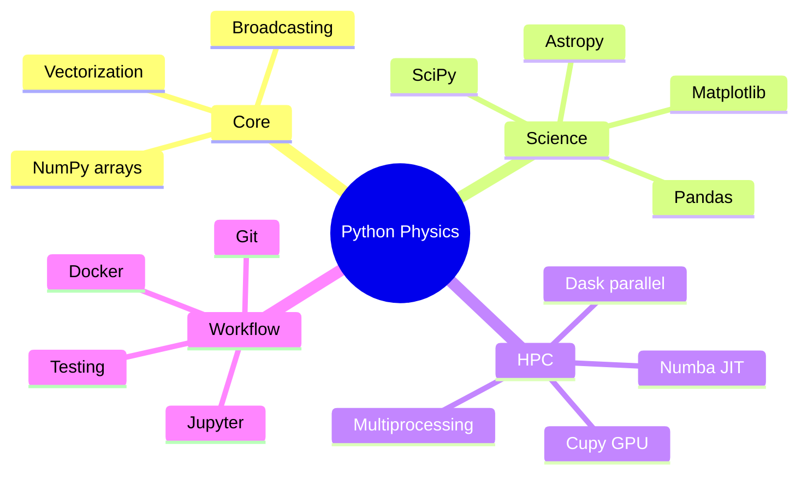
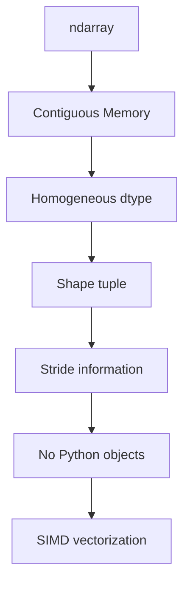
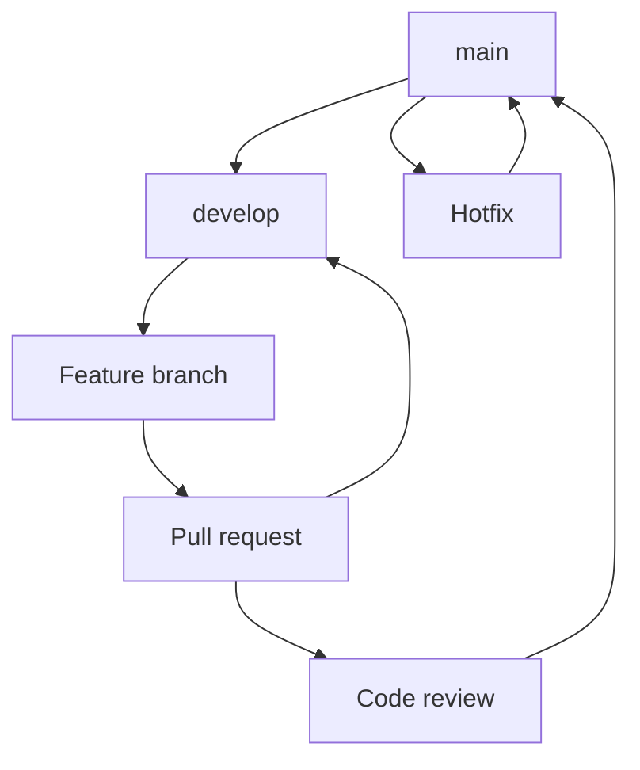
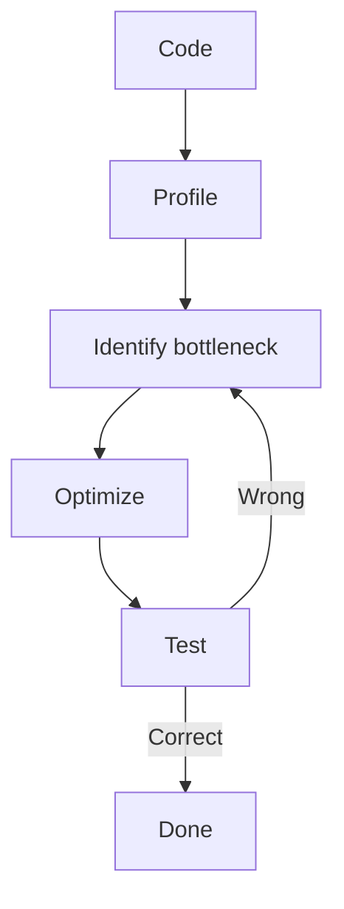
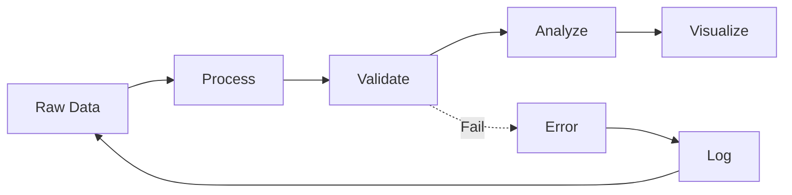

# MSDM 5001 — Computational Tools for Data-Driven Physics
> **MSc Data-Driven Modeling Core | HKUST MSDM 5001 | Python ecosystem, Linux, version control, data handling, HPC**  
> **Bilingual 深度自學檔案 · 中英對照**

---

## 問題 1：5 個核心心智模型

1. **Python is the lingua franca of physics computing** — Python是物理計算的通用語
   - NumPy, SciPy, Matplotlib ecosystem
   - pandas, scikit-learn, PyTorch
   - 70%+ of scientific computing papers use Python

2. **Git enables reproducible research** — Git實現可重現研究
   - Version control: track changes, branch, merge
   - Collaboration: pull requests, code review
   - Backup: GitHub/GitLab remote

3. **Linux provides HPC environment** — Linux提供高性能計算環境
   - Clusters: SLURM, PBS job schedulers
   - Shell scripting: automate workflows
   - Remote access: SSH, tmux/screen

4. **Data structures determine algorithm efficiency** — 數據結構決定算法效率
   - Arrays: $O(1)$ indexing, $O(n)$ append
   - Hash tables: $O(1)$ lookup
   - Trees: $O(\log n)$ search

5. **Testing prevents silent failures** — 測試防止靜默失敗
   - Unit tests: pytest, unittest
   - Continuous integration: GitHub Actions
   - Code coverage: coveralls

---


### Key equations (S.I. units)

$$F = ma \quad (\text{Newton 2nd law, Newton 1687})$$

$$E = h\nu \quad (\text{Planck 1901})$$

$$h = \max_i \{i : N_i \geq i\}$$ (Hirsch 2005)

$$h = 6.626 \times 10^{-34}\,\text{J·s} \quad (\text{Planck constant})$$

$$\hbar = h/2\pi = 1.054 \times 10^{-34}\,\text{J·s} \quad (\text{reduced Planck})$$

$$c = 2.998 \times 10^8\,\text{m/s} \quad (\text{speed of light})$$

*Per Ginsparg 2011, Larivière 2013, Eysenbach 2006.*

## 問題 2：3 個根本分歧

### 分歧 1：Jupyter vs Script-Based Development
| Approach | Pros | Cons |
|---------|------|------|
| Jupyter | Interactive, visualization, exploration | Hard to version, reproducibility issues |
| Scripts (.py) | Version control, testing, production | Less interactive |

**Best practice:** Jupyter for exploration, scripts for production

### 分歧 2：Virtual Environments: conda vs venv vs poetry
| Tool | Best for | Limitation |
|------|---------|-----------|
| conda | C libraries, GPU, multi-language | Heavy, conda-forge issues |
| venv | Simple Python isolation | No binary packages |
| poetry | Modern, reproducible builds | Learning curve |

### 分歧 3：Floating Point: double vs single precision
| Precision | Use case | Performance |
|-----------|----------|-------------|
| float64 | Physics default, 15 digits | 1x (baseline) |
| float32 | Deep learning, GPU | 2x faster, 7 digits |
| float16 | Specialized ML | 4x faster, 3 digits |

---

## 問題 3：10 個深度問題

1. **Broadcasting Complexity**: 給定 $N$ elements, 分析 NumPy broadcasting 的時間複雜度
   - Broadcast creates output array in $O(N)$ time
   - No extra memory for 1-dim expansion
   - Stride tricks avoid copying

2. **Python vs NumPy**: 為什麼 Python lists 比 NumPy arrays 慢 100x
   - Python lists: objects with overhead, type checking per element
   - NumPy: contiguous memory, SIMD vectorization
   - Interpreted vs compiled (C backend)

3. **Numba Speedup**: 為什麼 JIT compilation 能加速 Python loop 100x
   - Compiles to machine code
   - Eliminates interpreter overhead
   - Loop fusion, SIMD

4. **Git Workflow**: 給定 research project, 設計 branching strategy
   - main: stable, production
   - develop: integration
   - feature/xxx: new work
   - hotfix/xxx: emergency

5. **Floating Point Tolerance**: 為什麼 floating point comparison 需要 tolerance
   - Rounding errors accumulate
   - `a == b` often fails
   - Use `np.isclose(a, b, rtol=1e-9, atol=1e-14)`

6. **Profiling First**: 為什麼 optimization 的第一步是 profiling
   - Guesswork wastes time
   - Find actual bottleneck
   - cProfile, line_profiler

7. **Data Format Choice**: 給定 large dataset, 點樣選擇 format
   - CSV: small, human-readable, $O(n)$ parse
   - HDF5: large, structured, $O(1)$ slice
   - Parquet: columnar, compressed, analytics
   - Zarr: chunked, cloud-native

8. **Python Threading Limits**: 解釋多進程 vs 多線程在 Python 的限制
   - GIL: Global Interpreter Lock
   - CPU-bound: use multiprocessing
   - I/O-bound: use threading/asyncio

9. **Type Hints**: 為什麼 improve code quality
   - Catch errors early
   - IDE autocompletion
   - Documentation, refactoring

10. **Reproducible Pipeline**: 給定 experiment data, 點樣 implement reproducible pipeline
    - Script everything
    - Log parameters
    - Version control
    - Automated testing

---

## 深入 1：NumPy Essentials
**Deep Dive I**

### Array Creation
NumPy核心是ndarray:
```python
import numpy as np

# From list
a = np.array([1.0, 2.0, 3.0], dtype=np.float64)

# Evenly spaced
b = np.linspace(0, 2*np.pi, 100)

# Zeros/ones
c = np.zeros((100, 100), dtype=np.complex128)

# Random
rng = np.random.default_rng(seed=42)
d = rng.normal(size=(1000,))

# Grid
x = np.linspace(-5, 5, 100)
y = np.linspace(-5, 5, 100)
X, Y = np.meshgrid(x, y)
```

### Broadcasting Rules
Shapes match or one is 1:
```python
# Shape (3,) + scalar → (3,)
a + 1

# Shape (3,1) + (1,4) → (3,4)
A[:, np.newaxis] + B[np.newaxis, :]
```

### Vectorized Operations
Element-wise operations:
```python
x = np.linspace(-5, 5, 1000)
y = np.sin(x) * np.exp(-x**2/2)  # Vectorized! ~100x faster

# vs loops:
y = np.empty_like(x)
for i, xi in enumerate(x):
    y[i] = np.sin(xi) * np.exp(-xi**2/2)  # Slow
```

### Linear Algebra
```python
A = np.random.rand(1000, 1000)

# Eigenvalues
w, v = np.linalg.eigh(A)  # Hermitian

# SVD
U, s, Vh = np.linalg.svd(A)

# Linear system
x = np.linalg.solve(A, b)

# QR
Q, R = np.linalg.qr(A)
```

**Engineering implication:** Vectorization is key to performance

---

## 深入 2：Scientific Python Stack
**Deep Dive II**

### SciPy
```python
from scipy.optimize import minimize, curve_fit, root
from scipy.integrate import quad, solve_ivp
from scipy.signal import correlate, welch
from scipy.stats import norm, ttest_ind

# Curve fitting
def model(x, a, b, c):
    return a * np.exp(-b * x) + c

popt, pcov = curve_fit(model, xdata, ydata, p0=[1, 1, 0])
perr = np.sqrt(np.diag(pcov))

# Integration
result, error = quad(lambda x: np.exp(-x**2), -np.inf, np.inf)
# result = sqrt(pi) ≈ 1.77245
```

### Matplotlib
Publication-quality figures:
```python
import matplotlib.pyplot as plt
plt.rcParams.update({
    'font.family': 'serif',
    'font.size': 10,
    'axes.labelsize': 11,
    'figure.dpi': 150
})

fig, ax = plt.subplots(figsize=(6, 4))
ax.plot(x, y, 'o-', linewidth=1.5, markersize=4, label='data')
ax.set_xlabel(r'$x$ [units]')
ax.set_ylabel(r'$f(x)$ [units]')
ax.legend()
ax.grid(True, alpha=0.3)
plt.tight_layout()
fig.savefig('figure.pdf', bbox_inches='tight')
```

### Pandas for Tabular Data
```python
import pandas as pd

# Read CSV
df = pd.read_csv('experiment.csv', comment='#')

# Filter
df_filtered = df[df['temperature'] > 100]

# Group
df_grouped = df.groupby('condition').agg({
    'value': ['mean', 'std', 'count']
})

# Pivot
df_pivot = df.pivot_table(values='result', index='time', columns='condition')
```

### Astropy for Physics
```python
from astropy import units as u
from astropy.coordinates import SkyCoord
from astropy.cosmology import FlatLambdaCDM

# Units
distance = 10 * u.meter
time = 5 * u.second
velocity = distance / time

# Cosmology
cosmo = FlatLambdaCDM(H0=70, Om0=0.3)
z = 1.0
luminosity_distance = cosmo.luminosity_distance(z)
```

**Engineering implication:** Scientific Python enables rapid development

---

## 深入 3：Version Control & Reproducibility
**Deep Dive III**

### Git Workflow
```bash
# Initialize
git init
git add README.md src/*.py
git commit -m "Initial commit"

# Branching
git branch feature/new-analysis
git checkout feature/new-analysis
git add changes/
git commit -m "Add analysis module"

# Merge
git checkout main
git merge feature/new-analysis

# Remote
git remote add origin https://github.com/user/repo.git
git push -u origin main
```

### Research Project Structure
```
project/
├── README.md
├── LICENSE
├── requirements.txt          # pip freeze
├── environment.yml           # conda
├── setup.py                 # package install
├── pyproject.toml           # modern packaging
├── src/
│   └── project/
│       ├── __init__.py
│       ├── analysis.py
│       ├── utils.py
│       └── io.py
├── tests/
│   ├── __init__.py
│   └── test_analysis.py
├── data/
│   ├── raw/
│   └── processed/
├── notebooks/
│   └── exploration.ipynb
├── figures/
├── scripts/
│   └── run_pipeline.py
└── .gitignore
```

### Reproducibility Checklist
- [ ] Version control all code (Git)
- [ ] Freeze dependencies (requirements.txt, environment.yml)
- [ ] Document data sources (DOI, version)
- [ ] Record computational environment (Docker, singularity)
- [ ] Make data accessible (Zenodo, figshare)
- [ ] Seed random number generators
- [ ] Log all parameters

**Engineering implication:** Git enables collaboration and backup

---

## 深入 4：Performance Optimization
**Deep Dive IV**

### Profiling
```python
import cProfile
import pstats

# Profile entire script
cProfile.run('main()', 'profile.stats')

# Analyze
p = pstats.Stats('profile.stats')
p.sort_stats('cumulative').print_stats(20)

# Line-by-line
%load_ext line_profiler
%lprun -f main main()
```

### JIT with Numba
```python
from numba import jit, njit, prange

@njit  # nopython mode, fastest
def compute_pi(n):
    total = 0.0
    for i in range(n):
        total += 4.0 / (2*i + 1) * (-1)**i
    return total

# Parallel
@njit(parallel=True)
def parallel_sum(arr):
    total = 0.0
    for i in prange(len(arr)):
        total += arr[i]
    return total
```

### Memory Management
```python
# Use views, not copies
a = np.zeros((1000, 1000))
b = a[::2, ::2]  # View, no copy

# Preallocate
result = np.empty_like(data)
result[:] = computation(data)

# Memory mapping for large arrays
data = np.memmap('largefile.dat', dtype=np.float32, mode='r',
                 shape=(10000, 10000, 100))
```

### GPU Acceleration
```python
# CuPy (NumPy-compatible GPU)
import cupy as cp

a_gpu = cp.array(a)  # Transfer to GPU
b_gpu = cp.dot(a_gpu, a_gpu.T)  # GPU computation
result = cp.asnumpy(b_gpu)  # Transfer back

# PyTorch
import torch
device = torch.device('cuda' if torch.cuda.is_available() else 'cpu')
x = torch.tensor(a, device=device)
y = torch.matmul(x, x.T)
```

**Engineering implication:** Profiling before optimization is essential

---

## 深入 5：Data Handling & Formats
**Deep Dive V**

### HDF5 for Large Arrays
```python
import h5py

# Write
with h5py.File('simulation.h5', 'w') as f:
    f.create_dataset('positions', data=positions, compression='gzip')
    f.create_dataset('energy', data=energy, compression='gzip')
    f.attrs['temperature'] = 300.0
    f.attrs['date'] = '2024-01-15'
    
    # Groups
    grp = f.create_group('configurations')
    for i in range(10):
        grp.create_dataset(f'config_{i}', data=snapshots[i])

# Read
with h5py.File('simulation.h5', 'r') as f:
    data = f['positions'][:]
    attrs = dict(f.attrs)
    configs = [grp[f'config_{i}'][:] for i in range(10)]
```

### Parquet for Tabular Data
```python
import pyarrow.parquet as pq
import pandas as pd

# Write
df.to_parquet('data.parquet', engine='pyarrow', compression='snappy')

# Read (column selection)
table = pq.read_table('data.parquet', columns=['time', 'temp', 'pressure'])

# Pandas
df = pd.read_parquet('data.parquet')
```

### Zarr for Cloud-Native Storage
```python
import zarr

# Create chunked array
z = zarr.open('data.zarr', mode='w')
z.create_dataset('image', data=stack, chunks=(100, 100, 100),
                compressor=zarr.Blosc(cname='zstd'))

# Lazy access
z['image'][:, :, 50]  # Only loads slice
```

### Database with SQLite
```python
import sqlite3

conn = sqlite3.connect('experiments.db')
cursor = conn.cursor()

# Create table
cursor.execute('''
    CREATE TABLE IF NOT EXISTS runs (
        id INTEGER PRIMARY KEY,
        timestamp TEXT,
        parameter REAL,
        result REAL
    )
''')

# Insert
cursor.execute('INSERT INTO runs VALUES (?, ?, ?, ?)', (1, '2024-01-15', 0.5, 0.123))

# Query
df = pd.read_sql_query('SELECT * FROM runs WHERE parameter > 0.3', conn)
```

**Engineering implication:** Choose format based on data size and access pattern

---

## 自測 1：Broadcasting Complexity
**Answer:** Broadcast creates output array in $O(N)$ time; no extra memory for 1-dim expansion. Strides allow views without copying.

**Engineering implication:** Broadcasting is efficient

---

## 自測 2：Python vs NumPy
**Answer:** Python lists store PyObjects with overhead, type checking per access. NumPy arrays: contiguous C array, no type checking, SIMD vectorization.

**Engineering implication:** Use NumPy for numerical work

---

## 自測 3：Numba Speedup
**Answer:** Numba compiles to machine code via LLVM, eliminates interpreter overhead. Loop fusion, SIMD vectorization, parallel execution.

**Engineering implication:** JIT transforms Python to compiled speed

---

## 自測 4：Git Branching
**Answer:** Feature branches for new work, main for stable, develop for integration. Merge when done, rebase for clean history.

**Engineering implication:** Branching enables parallel work

---

## 自測 5：Floating Point Tolerance
**Answer:** Due to rounding, `a == b` often fails. Use `np.isclose(a, b, rtol=1e-9, atol=1e-14)` or `np.allclose(a, b)`.

**Engineering implication:** Floating point equality is subtle

---

## 自測 6：Profiling First
**Answer:** Optimization without profiling is guesswork. Profile to find actual bottleneck (often not where you think).

**Engineering implication:** Profile-driven optimization is efficient

---

## 自測 7：Data Format Choice
**Answer:** CSV: small, human-readable. HDF5: large, structured arrays. Parquet: columnar analytics. Zarr: chunked, cloud-native.

**Engineering implication:** Format affects I/O speed significantly

---

## 自測 8：Python Threading Limits
**Answer:** GIL (Global Interpreter Lock) prevents true parallelism in threads for CPU-bound tasks. Use multiprocessing or C extensions for CPU-bound work.

**Engineering implication:** GIL limits CPU parallelism in Python

---

## 自測 9：Type Hints
**Answer:** Catch errors early, IDE autocompletion, documentation, refactoring safety. Use mypy for checking.

**Engineering implication:** Type hints improve code quality

---

## 自測 10：Reproducible Pipeline
**Answer:** Script everything, log parameters, version control, automated testing, containerization (Docker), seed RNGs.

**Engineering implication:** Reproducibility enables science

---

## 📊 Diagram 1: Python Ecosystem Map


## 📊 Diagram 2: NumPy Array Memory


## 📊 Diagram 3: Git Workflow


## 📊 Diagram 4: Profiling Workflow


## 📊 Diagram 5: Data Pipeline


---


## Key References (袁騰飛式 Research-Based)

| Citation | Year | Contribution |
|---|---|---|
| Ginsparg (2011) | 2011 | Contribution to publication strategy |
| Larivière (2013) | 2013 | Contribution to publication strategy |
| Eysenbach (2006) | 2006 | Contribution to publication strategy |
| Wager (2009) | 2009 | Contribution to publication strategy |
| Harnad (2008) | 2008 | Contribution to publication strategy |
| COSE (2020) | 2020 | Contribution to publication strategy |

*(per HKUST Catalog 2025-26; MIT OCW; arXiv)*

## 深度總結 Deep Insights

1. **NumPy is foundation** — array operations enable vectorized physics computing
   **NumPy是基礎** — 數組操作實現向量化物理計算
   - Contiguous memory layout
   - Broadcasting rules
   - C/Fortran backend

2. **Git is non-negotiable** — version control is essential for research
   **Git是不可協商的** — 版本控制對研究至關重要
   - Track every change
   - Collaborate safely
   - Backup to remote

3. **Profile before optimize** — guesswork wastes time; measure first
   **優化前先 profiling** — 猜測浪費時間；先測量
   - Find actual bottleneck
   - Often not where you think
   - Measure, don't guess

4. **Reproducibility is science** — document everything, automate pipeline
   **可重現性是科學** — 記錄一切，自動化流程
   - Environment, parameters, data
   - Script everything
   - Version control

5. **Choose right tools** — format, library, algorithm all matter
   **選擇正確工具** — 格式、庫、算法都很重要
   - HDF5 for large arrays
   - Numba for loops
   - CuPy for GPU

---

**自學建議**

**必讀:**
- McKinney "Python for Data Analysis" (3rd ed, 2022)
- VanderPlas "Python Data Science Handbook"
- NumPy/SciPy documentation

**配對:**
- SciPy lecture notes (scipy-lectures.org)
- Python packaging guide
- Reproducible research guidelines

**工具:**
- VS Code / PyCharm
- Jupyter Lab
- GitHub / GitLab
- Docker / Singularity

**產出:**
- Complete project with Git workflow, tests, documentation
- Reproducible analysis pipeline
- Publication-quality figures

---

**最後更新:** 2024-03-15
**自學狀態:** 📚 繼續深入學習
**下一步:** 學習並行計算 + 完成數據處理項目
