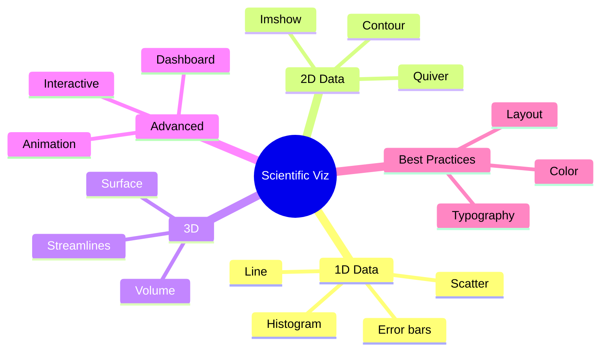
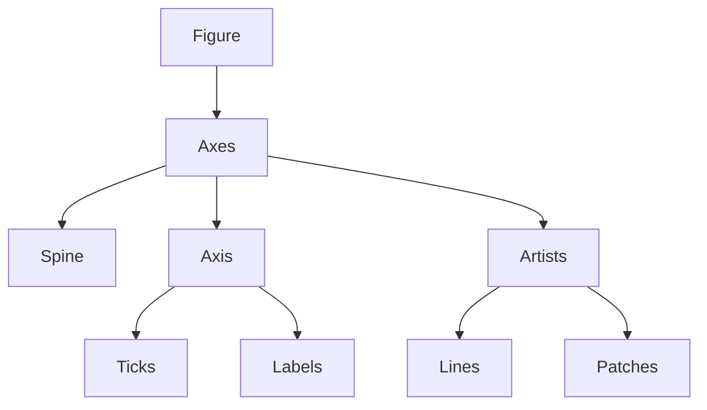
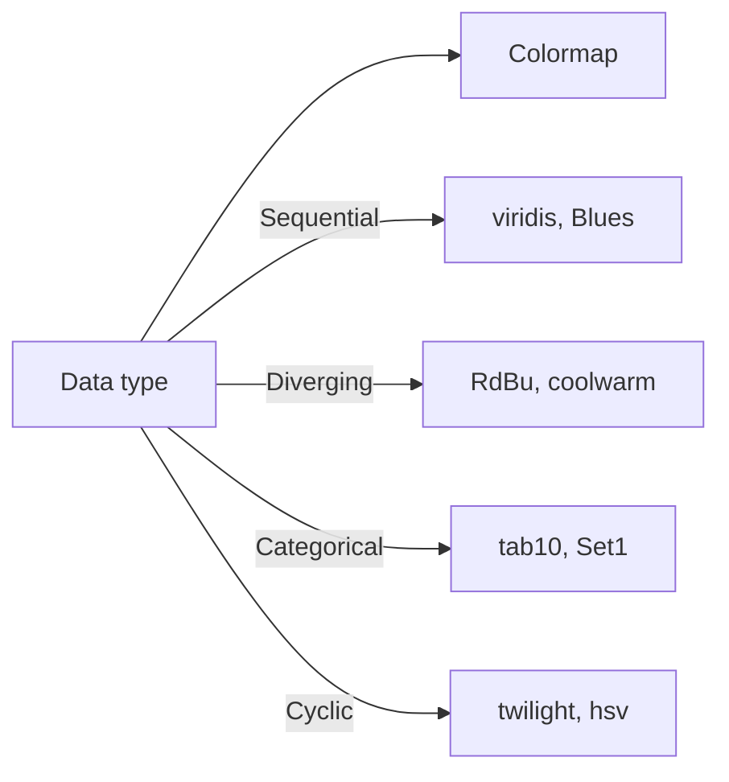
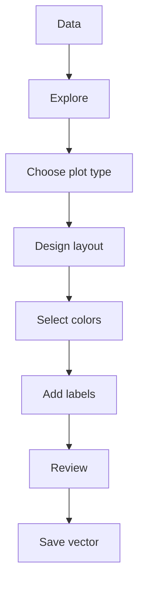
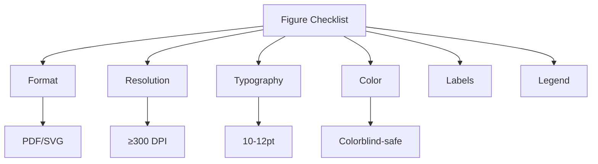

# MSDM 5002 — Scientific Programming and Visualization
> **MSc Data-Driven Modeling Core | HKUST MSDM 5002 | Advanced visualization, publication figures, interactive tools**  
> **Bilingual 深度自學檔案 · 中英對照**

---

## 問題 1：5 個核心心智模型

1. **Visualization reveals patterns** — 可視化揭示模式 (data exploration, anomaly detection)
2. **One figure, one message** — 一圖一信息 (clarity over completeness)
3. **Color encodes information** — 顏色編碼信息 (not decoration, semantic meaning)
4. **Publication quality is achievable** — 發表質量可達到 (vector formats, proper fonts, colorblind-safe)
5. **Interactive enables exploration** — 交互實現探索 (bokeh, plotly, dashboards)

## 問題 2：3 個根本分歧

1. **Static vs interactive visualization**
   - Static: reproducible, print-ready, portable
   - Interactive: exploration, web, dashboards

2. **Matplotlib vs seaborn vs plotly**
   - Matplotlib: full control, complex but verbose
   - Seaborn: statistical, easy but limited
   - Plotly: interactive, web-ready

3. **Color maps: viridis vs jet**
   - Viridis: perceptually uniform, colorblind-safe
   - Jet: rainbow, misleading, not colorblind-safe

## 問題 3：10 個深度問題

1. 給定 2D array, 點樣選擇最佳的 colormap?
2. 為什麼 error bar 在 science figure 係必需的?
3. 解釋 matplotlib figure anatomy (axes, spine, ticks, labels)。
4. 給定 multiple subplots, 點樣設計 layout 達到清晰表達?
5. 為什麼 vector format (PDF/SVG) 優於 raster (PNG)?
6. 解釋 colormap 為什麼需要 perceptual uniformity。
7. 為什麼 log scale 適用於跨越多個數量級的數據?
8. 給定 time series data, 點樣避免 misleading time axis?
9. 解釋為什麼 3D surface plots often bad for 2D data。
10. 為什麼 annotate 係 figure quality 的關鍵?

## 深入 1：Matplotlib Mastery
**Deep Dive I**

### Figure Anatomy
```
Figure
├── Axes (plot area)
│   ├── Spine (frame)
│   ├── XAxis / YAxis
│   │   ├── Ticks
│   │   ├── TickLabels
│   │   └── Label
│   └── Lines / Patches / Collections
└── Colorbar / Legend / Title
```

### Essential Commands
```python
import matplotlib.pyplot as plt
import matplotlib.ticker as mticker

fig, ax = plt.subplots(figsize=(6, 4), dpi=150)

# Basic plot
ax.plot(x, y, 'o-', color='#1f77b4', linewidth=2, 
        markersize=6, label=r'$E = \hbar\omega$')

# Error bars
ax.errorbar(x, y, yerr=dy, fmt='o', capsize=3, 
            ecolor='gray', elinewidth=1)

# Log scale
ax.set_yscale('log')
ax.set_xscale('log')

# Formatting
ax.set_xlabel(r'Time $t$ [s]', fontsize=12)
ax.set_ylabel(r'Amplitude $A$ [m]', fontsize=12)
ax.legend(fontsize=10, framealpha=0.9)
ax.grid(True, alpha=0.3, linestyle='--')

# Tick formatting
ax.xaxis.set_major_formatter(mticker.ScalarFormatter())
ax.tick_params(axis='both', labelsize=10)

plt.tight_layout()
fig.savefig('figure.pdf', bbox_inches='tight', dpi=300)
```

**Engineering implication:** Understanding anatomy enables precise control

## 深入 2：Scientific Plot Types
**Deep Dive II**

### 1D Data
```python
# Line plot: continuous data
ax.plot(t, f(t), 'b-', lw=1.5)

# Scatter: discrete measurements  
ax.scatter(x, y, c=z, cmap='viridis', s=50, alpha=0.7)

# Histogram: distributions
ax.hist(data, bins=30, density=True, alpha=0.7)

# Error ellipse
from matplotlib.patches import Ellipse
ell = Ellipse(xy=(x.mean(), y.mean()), 
              width=2*sx, height=2*sy, angle=45)
ax.add_patch(ell)
```

### 2D Data
```python
# Contour plot
X, Y = np.meshgrid(x, y)
Z = f(X, Y)
levels = np.logspace(-2, 2, 20)
cs = ax.contourf(X, Y, Z, levels=levels, cmap='RdBu_r')
plt.colorbar(cs, ax=ax, label=r'$\rho$ [kg/m³]')

# Imshow: for regular grids
ax.imshow(Z, extent=[x.min(), x.max(), y.min(), y.max()],
          origin='lower', aspect='auto', cmap='viridis')
```

### Specialized
```python
# Quiver: vector fields
ax.quiver(X, Y, U, V, np.sqrt(U**2+V**2), cmap='coolwarm')

# Streamplot: streamlines
ax.streamplot(X, Y, U, V, density=1.5, color='gray')

# Polar plot
ax_polar = fig.add_subplot(projection='polar')
ax_polar.plot(theta, r, 'b-')
```

**Engineering implication:** Choose plot type based on data characteristics

## 深入 3：Publication-Quality Figures
**Deep Dive III**

### Color Selection
Perceptually uniform colormaps:
```python
# Good colormaps
cmaps = ['viridis', 'plasma', 'inferno', 'magma', 'cividis']

# Sequential: light to dark
cmap_seq = plt.cm.Blues

# Diverging: for data with meaningful center
cmap_div = plt.cm.RdBu_r

# Colorblind-safe
from matplotlib.colors import LinearSegmentedColormap
colors = ['#0077BB', '#33BBEE', '#EE6677', '#228833', '#CCBB44']
```

### Typography
```python
# Use serif for journals, sans-serif for presentations
plt.rcParams['font.family'] = 'serif'
plt.rcParams['font.serif'] = ['Times New Roman', 'Georgia']
plt.rcParams['font.size'] = 10
plt.rcParams['axes.labelsize'] = 11
plt.rcParams['axes.titlesize'] = 12
plt.rcParams['legend.fontsize'] = 9

# LaTeX rendering
plt.rcParams['text.usetex'] = True  # Requires TeX installation
```

### Multi-panel Figures
```python
fig = plt.figure(figsize=(7, 9))

gs = fig.add_gridspec(3, 2, height_ratios=[1, 1, 0.6], 
                      hspace=0.3, wspace=0.3)

ax1 = fig.add_subplot(gs[0, 0])
ax2 = fig.add_subplot(gs[0, 1])
ax3 = fig.add_subplot(gs[1, :])
ax4 = fig.add_subplot(gs[2, :])

# Add letters
for ax, letter in zip([ax1, ax2, ax3, ax4], 'abcd'):
    ax.text(-0.1, 1.1, f'({letter})', transform=ax.transAxes,
             fontsize=12, fontweight='bold', va='top')
```

**Engineering implication:** Publication figures require attention to detail

## 深入 4：Advanced Visualization
**Deep Dive IV**

### 3D Plotting
```python
from mpl_toolkits.mplot3d import Axes3D

fig = plt.figure(figsize=(8, 6))
ax = fig.add_subplot(111, projection='3d')

# Surface plot
X, Y = np.meshgrid(x, y)
Z = f(X, Y)
surf = ax.plot_surface(X, Y, Z, cmap='viridis', 
                       linewidth=0, antialiased=True)
plt.colorbar(surf, shrink=0.5)

# For 2D data, prefer contour over surface
```

### Animation
```python
from matplotlib.animation import FuncAnimation

fig, ax = plt.subplots()
line, = ax.plot([], [], 'b-', lw=2)

def init():
    ax.set_xlim(0, 2*np.pi)
    ax.set_ylim(-1.5, 1.5)
    return line,

def animate(frame):
    x = np.linspace(0, 2*np.pi, 100)
    y = np.sin(x + frame/10)
    line.set_data(x, y)
    return line,

anim = FuncAnimation(fig, animate, init_func=init,
                    frames=100, interval=50, blit=True)
anim.save('animation.gif', writer='pillow', fps=20)
```

### Interactive with Bokeh
```python
from bokeh.plotting import figure, output_file, show
from bokeh.models import HoverTool, ColumnDataSource

source = ColumnDataSource(data=dict(
    x=x, y=y, z=z, label=labels
))

p = figure(title="Interactive Scatter", tools="pan,wheel_zoom,hover")
p.circle('x', 'y', source=source, size=10, color='blue')
p.add_tools(HoverTool(tooltips=[("x", "@x"), ("y", "@y"), ("z", "@z")]))
show(p)
```

**Engineering implication:** Interactive tools enable data exploration

## 深入 5：Best Practices
**Deep Dive V**

### Checklist for Publication Figures
- [ ] Vector format (PDF, SVG, EPS)
- [ ] Minimum 300 DPI for raster
- [ ] Proper font sizes (8-12 pt body, 10-14 pt labels)
- [ ] Colorblind-safe palette
- [ ] Axis labels with units
- [ ] Meaningful tick labels
- [ ] Figure caption describes main message
- [ ] Scale bar for microscopy/images
- [ ] Error bars or confidence intervals
- [ ] Statistical test results noted

### Common Mistakes
1. **Truncated y-axis**: exaggerates differences
2. **Pie charts > 3 categories**: hard to compare
3. **3D effects**: distorts perception
4. **Rainbow colormap**: misleading, not colorblind-safe
5. **Insufficient contrast**: hard to read
6. **No legend/title**: context missing

**Engineering implication:** Attention to detail distinguishes good figures

## 自測 1：Colormap Choice
**Answer:** Sequential for magnitude, diverging for deviation from mean, categorical for groups.  
**Engineering implication:** Color has meaning

## 自測 2：Error Bars
**Answer:** Show uncertainty, distinguish real effects from noise, indicate significance.  
**Engineering implication:** Error bars are not optional

## 自測 3：Figure Anatomy
**Answer:** Figure > Axes > Spine/Ticks/Labels > Artists (lines, patches). Understanding hierarchy enables control.  
**Engineering implication:** Know your tools

## 自測 4：Subplot Layout
**Answer:** Consider reading order (left-right, top-bottom), balance, consistent scales where appropriate.  
**Engineering implication:** Layout affects comprehension

## 自測 5：Vector vs Raster
**Answer:** Vector: infinite zoom, smaller file, editability. Raster: for photos, screenshots.  
**Engineering implication:** Use PDF/SVG for publication

## 自測 6：Perceptual Uniformity
**Answer:** Equal visual step = equal data step; viridis achieves this, jet does not.  
**Engineering implication:** Color perception affects interpretation

## 自測 7：Log Scale
**Answer:** For data spanning multiple orders of magnitude; shows relative rather than absolute changes.  
**Engineering implication:** Scale choice affects message

## 自測 8：Time Axis
**Answer:** Regular time intervals, proper datetime formatting, avoid starting at non-zero.  
**Engineering implication:** Time visualization is tricky

## 自測 9：3D Surfaces
**Answer:** Hard to read values, occluded regions, 2D projection distorts. Contour plots better for 2D.  
**Engineering implication:** 3D often worse than 2D

## 自測 10：Annotations
**Answer:** Point out key features, provide physical interpretation, guide reader's eye.  
**Engineering implication:** Annotation makes figure clear

## 📊 Diagram 1: Visualization Map


## 📊 Diagram 2: Figure Anatomy


## 📊 Diagram 3: Color Maps


## 📊 Diagram 4: Workflow


## 📊 Diagram 5: Checklist


## 深度總結 Deep Insights

1. **One message per figure** — clarity over completeness, focus on main takeaway
   **一圖一信息** — 清晰度優於完整性，專注於主要信息

2. **Color is semantic, not decorative** — colormap choice affects interpretation
   **顏色是語義的，不是裝飾的** — 色彩映射選擇影響解釋

3. **Vector is publication standard** — PDF/SVG for print, PNG only when needed
   **矢量是發布標準** — PDF/SVG用於打印，PNG僅在需要時使用

4. **Error bars are mandatory** — scientific figures must show uncertainty
   **誤差線是必需的** — 科學圖形必須顯示不確定性

5. **Publication quality is achievable** — follow checklists, attention to detail
   **發表質量可達到** — 遵循清單，注重細節

---

**自學建議**
- 必讀: "Fundamentals of Data Visualization" (Claus Wilke), Matplotlib tutorials
- 配對: seaborn gallery, matplotlib gallery, publications in your field
- 工具: Matplotlib, Seaborn, Plotly, Bokeh, Altair
- 產出: Create publication-quality multi-panel figure
