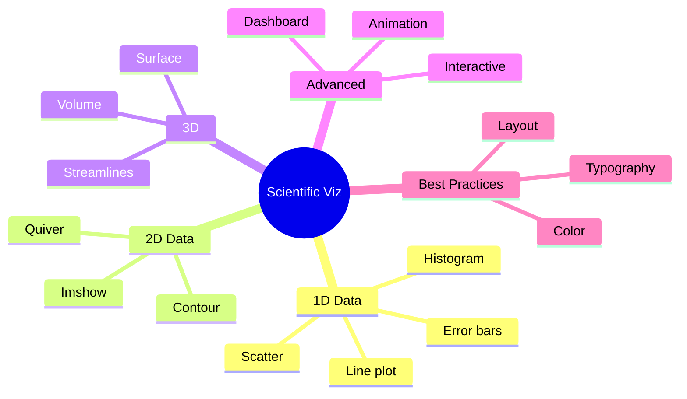
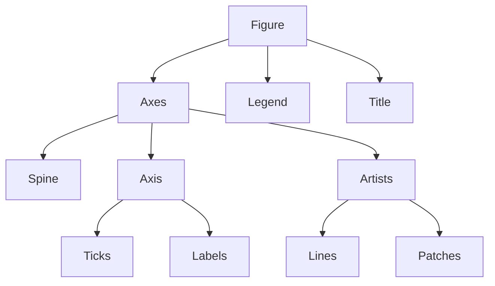
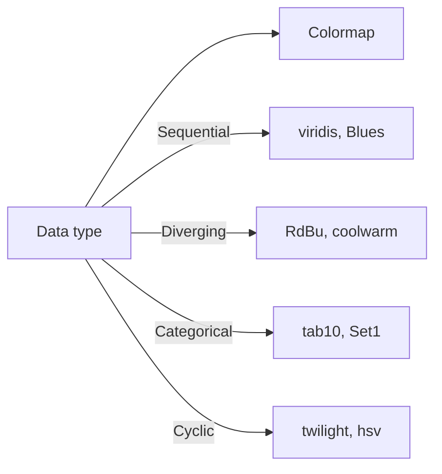
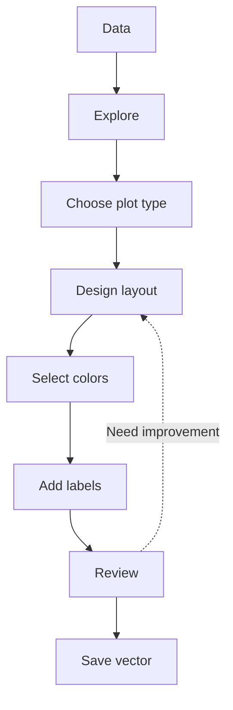
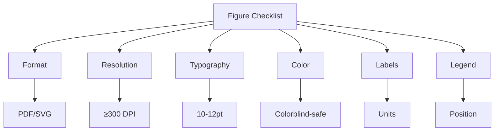

# MSDM 5002 — Scientific Visualization
> **MSc Data-Driven Modeling Core | HKUST MSDM 5002 | Publication-quality figures, interactive tools, scientific communication**  
> **Bilingual 深度自學檔案 · 中英對照**

---

## 問題 1：5 個核心心智模型

1. **Visualization reveals patterns** — 可視化揭示模式
   - Data exploration: find anomalies, trends
   - Pattern recognition: correlations, clusters
   - Communication: tell story with data

2. **One figure, one message** — 一圖一信息
   - Clarity over completeness
   - Each panel should have one takeaway
   - Avoid clutter

3. **Color encodes information** — 顏色編碼信息
   - Not decoration; semantic meaning
   - Perceptually uniform colormaps
   - Colorblind-safe palettes

4. **Publication quality is achievable** — 發表質量可達到
   - Vector formats: PDF, SVG, EPS
   - Proper fonts: 8-12 pt body, 10-14 pt labels
   - High resolution: ≥300 DPI

5. **Interactive enables exploration** — 交互實現探索
   - Bokeh, Plotly for web
   - ParaView, VisIt for 3D
   - Dashboards for monitoring

---

## 問題 2：3 個根本分歧

### 分歧 1：Static vs Interactive Visualization
| Approach | Pros | Cons |
|----------|------|------|
| Static | Reproducible, print-ready, portable | No exploration |
| Interactive | Exploration, web, dashboards | Reproducibility issues |

**Best practice:** Static for publication, interactive for exploration

### 分歧 2：Matplotlib vs seaborn vs plotly
| Library | Best for | Limitation |
|---------|----------|-----------|
| Matplotlib | Full control, complex plots | Verbose, steep learning |
| seaborn | Statistical, easy | Limited customization |
| Plotly | Interactive, web | Less publication-ready |

### 分歧 3：Colormaps: viridis vs jet
| Colormap | Properties | Use case |
|----------|------------|----------|
| viridis | Perceptually uniform, colorblind-safe | Default for sequential |
| plasma, inferno | Similar properties | Alternatives |
| jet (rainbow) | Not uniform, misleading | Avoid! |
| RdBu | Diverging, center meaningful | Positive/negative data |

---

## 問題 3：10 個深度問題

1. **Colormap Selection**: 給定 2D array, 點樣選擇最佳的 colormap
   - Sequential: single hue, light to dark (magnitude)
   - Diverging: two hues, center meaningful (anomaly)
   - Categorical: distinct colors (groups)

2. **Error Bars**: 為什麼 error bar 在 science figure 係必需的
   - Show uncertainty, distinguish signal from noise
   - Indicate significance
   - Standard deviation, SEM, confidence intervals

3. **Matplotlib Anatomy**: 解釋 figure structure
   - Figure > Axes > Spine/Ticks/Labels > Artists
   - Understanding hierarchy enables control
   - Subplots, gridspec layouts

4. **Subplot Layout**: 給定 multiple subplots, 點樣設計清晰 layout
   - Reading order: left-right, top-bottom
   - Balance: similar sizes
   - Consistent scales where appropriate

5. **Vector vs Raster**: 為什麼 vector format (PDF/SVG) 優於 raster (PNG)
   - Infinite zoom, smaller file, editability
   - Print quality: vector sharp at any size
   - Raster: for photos, screenshots

6. **Perceptual Uniformity**: 解釋 colormap 需要 perceptual uniformity
   - Equal visual step = equal data step
   - viridis achieves this, jet does not
   - Color perception affects interpretation

7. **Log Scale**: 為什麼 log scale 適用於跨越多個數量級的數據
   - For data spanning $10^x$ range
   - Shows relative rather than absolute changes
   - Compresses large range

8. **Time Axis**: 給定 time series data, 點樣避免 misleading time axis
   - Regular time intervals
   - Proper datetime formatting
   - Avoid starting at non-zero

9. **3D Surface Plots**: 為什麼 often bad for 2D data
   - Hard to read values
   - Occluded regions
   - 2D projection distorts perception

10. **Annotation**: 為什麼 annotate 係 figure quality 的關鍵
    - Point out key features
    - Provide physical interpretation
    - Guide reader's eye

---

## 深入 1：Matplotlib Mastery
**Deep Dive I**

### Figure Anatomy
```
Figure
├── Axes (plot area)
│   ├── Spine (frame)
│   ├── XAxis / YAxis
│   │   ├── Ticks
│   │   ├── TickLabels
│   │   └── Label
│   └── Lines / Patches / Collections
└── Colorbar / Legend / Title
```

### Essential Commands
```python
import matplotlib.pyplot as plt
import matplotlib.ticker as mticker
from matplotlib.gridspec import GridSpec

# Create figure with subplots
fig, axes = plt.subplots(2, 2, figsize=(10, 8))
gs = GridSpec(2, 2, width_ratios=[1, 1], height_ratios=[1, 1],
              hspace=0.3, wspace=0.3)

# Basic plot
ax = fig.add_subplot(gs[0, 0])
ax.plot(x, y, 'o-', color='#1f77b4', linewidth=2,
        markersize=6, label=r'$E = \hbar\omega$')

# Error bars
ax.errorbar(x, y, yerr=dy, fmt='o', capsize=3,
            ecolor='gray', elinewidth=1)

# Log scale
ax.set_yscale('log')
ax.set_xscale('log')

# Formatting
ax.set_xlabel(r'Time $t$ [s]', fontsize=12)
ax.set_ylabel(r'Amplitude $A$ [m]', fontsize=12)
ax.legend(fontsize=10, framealpha=0.9)
ax.grid(True, alpha=0.3, linestyle='--')

# Tick formatting
ax.xaxis.set_major_formatter(mticker.ScalarFormatter())
ax.tick_params(axis='both', labelsize=10)

# Add letter labels
for ax, letter in zip(axes.flat, 'abcd'):
    ax.text(-0.1, 1.1, f'({letter})', transform=ax.transAxes,
            fontsize=12, fontweight='bold', va='top')

plt.tight_layout()
fig.savefig('figure.pdf', bbox_inches='tight', dpi=300)
```

### Publication Settings
```python
# Nature style settings
plt.rcParams.update({
    'font.family': 'sans-serif',
    'font.sans-serif': ['Arial', 'Helvetica'],
    'font.size': 10,
    'axes.labelsize': 11,
    'axes.titlesize': 12,
    'legend.fontsize': 9,
    'xtick.labelsize': 9,
    'ytick.labelsize': 9,
    'figure.dpi': 150,
    'savefig.dpi': 300,
    'axes.linewidth': 0.5,
    'lines.linewidth': 1.0,
    'axes.spines.top': False,
    'axes.spines.right': False,
})

# LaTeX rendering (requires TeX)
plt.rcParams['text.usetex'] = False  # Set True if TeX installed
```

**Engineering implication:** Understanding anatomy enables precise control

---

## 深入 2：Scientific Plot Types
**Deep Dive II**

### 1D Data
```python
# Line plot: continuous data
ax.plot(t, f(t), 'b-', lw=1.5, label='theory')

# Scatter: discrete measurements
ax.scatter(x, y, c=z, cmap='viridis', s=50, alpha=0.7,
          edgecolors='k', linewidth=0.5, label='data')

# Histogram: distributions
ax.hist(data, bins=30, density=True, alpha=0.7, color='steelblue',
        edgecolor='white')

# Error ellipse
from matplotlib.patches import Ellipse
ell = Ellipse(xy=(x.mean(), y.mean()),
              width=2*sx, height=2*sy, angle=45,
              facecolor='none', edgecolor='red', lw=2)
ax.add_patch(ell)
```

### 2D Data
```python
# Contour plot
X, Y = np.meshgrid(x, y)
Z = f(X, Y)
levels = np.logspace(-2, 2, 20)
cs = ax.contourf(X, Y, Z, levels=levels, cmap='RdBu_r',
                 locator=plt.matplotlib.ticker.LogLocator())
plt.colorbar(cs, ax=ax, label=r'$\rho$ [kg/m³]')

# Contour lines
cs2 = ax.contour(X, Y, Z, levels=levels, colors='k', linewidths=0.5)
ax.clabel(cs2, inline=True, fontsize=8)

# Imshow: for regular grids
ax.imshow(Z, extent=[x.min(), x.max(), y.min(), y.max()],
          origin='lower', aspect='auto', cmap='viridis')
```

### Specialized Plots
```python
# Quiver: vector fields
ax.quiver(X[::4, ::4], Y[::4, ::4],
          U[::4, ::4], V[::4, ::4],
          np.sqrt(U**2+V**2), cmap='coolwarm', scale=20)

# Streamplot: streamlines
ax.streamplot(X, Y, U, V, density=1.5, color='gray',
              linewidth=1, arrowsize=1.5)

# Polar plot
ax_polar = fig.add_subplot(projection='polar')
theta = np.linspace(0, 2*np.pi, 100)
r = 1 + 0.5*np.cos(3*theta)
ax_polar.plot(theta, r, 'b-', lw=2)
```

### Complex Plane
```python
# Smith chart (for RF engineering)
ax = fig.add_subplot(projection='smith')

# Vector field
theta = np.linspace(0, 2*np.pi, 50)
z = np.exp(1j*theta)
ax.plot(z.real, z.imag, 'b-')
```

**Engineering implication:** Choose plot type based on data characteristics

---

## 深入 3：Publication-Quality Figures
**Deep Dive III**

### Color Selection
```python
# Perceptually uniform colormaps (use these!)
cmaps = {
    'sequential': ['viridis', 'plasma', 'inferno', 'magma', 'cividis'],
    'diverging': ['RdBu_r', 'coolwarm', 'seismic'],
    'cyclic': ['twilight', 'twilight_shifted', 'hsv'],
}

# Colorblind-safe palettes
CB_color = ['#0077BB', '#33BBEE', '#EE6677', '#228833', '#CCBB44']
CB_cycle = plt.cycler('color', CB_color)

# Custom colormap
from matplotlib.colors import LinearSegmentedColormap
colors = ['#440154', '#21918c', '#fde725']
cmap = LinearSegmentedColormap.from_list('custom', colors)
```

### Typography
```python
# Use serif for journals, sans-serif for presentations
plt.rcParams['font.family'] = 'serif'
plt.rcParams['font.serif'] = ['Times New Roman', 'Georgia', 'DejaVu Serif']
plt.rcParams['font.sans-serif'] = ['Arial', 'Helvetica', 'DejaVu Sans']

# Math text with LaTeX
ax.set_xlabel(r'$E/\hbar\omega_0$')
ax.set_ylabel(r'$\langle n \rangle$')
ax.set_title(r'$\chi^{(2)}$ susceptibility')

# Annotations with arrows
ax.annotate('peak', xy=(3.5, 1.0), xytext=(4.5, 1.5),
            arrowprops=dict(arrowstyle='->', color='black'),
            fontsize=10)
```

### Multi-panel Figures
```python
fig = plt.figure(figsize=(7, 9))

gs = fig.add_gridspec(3, 2, height_ratios=[1, 1, 0.6],
                      hspace=0.3, wspace=0.3)

ax1 = fig.add_subplot(gs[0, 0])
ax2 = fig.add_subplot(gs[0, 1])
ax3 = fig.add_subplot(gs[1, :])
ax4 = fig.add_subplot(gs[2, :])

# Add letters
for ax, letter in zip([ax1, ax2, ax3, ax4], 'abcd'):
    ax.text(-0.08, 1.05, f'({letter})', transform=ax.transAxes,
            fontsize=12, fontweight='bold', va='top')

# Common labels
fig.text(0.02, 0.5, r'Amplitude $A$ [units]',
          va='center', rotation='vertical', fontsize=12)
fig.text(0.5, 0.02, r'Time $t$ [s]',
         ha='center', fontsize=12)
```

### Saving Figures
```python
# Vector formats (preferred for publication)
fig.savefig('figure.pdf', bbox_inches='tight', dpi=300)
fig.savefig('figure.svg', bbox_inches='tight')
fig.savefig('figure.eps', bbox_inches='tight')

# Raster for web (PNG)
fig.savefig('figure.png', dpi=150, bbox_inches='tight')

# Multiple formats at once
for fmt in ['pdf', 'png', 'svg']:
    fig.savefig(f'figure.{fmt}', dpi=300, bbox_inches='tight')
```

**Engineering implication:** Publication figures require attention to detail

---

## 深入 4：Advanced Visualization
**Deep Dive IV**

### 3D Plotting
```python
from mpl_toolkits.mplot3d import Axes3D

fig = plt.figure(figsize=(8, 6))
ax = fig.add_subplot(111, projection='3d')

# Surface plot
X, Y = np.meshgrid(x, y)
Z = f(X, Y)
surf = ax.plot_surface(X, Y, Z, cmap='viridis',
                       linewidth=0, antialiased=True,
                       alpha=0.8)

# For 2D data, prefer contour over surface
ax.view_init(elev=30, azim=45)
ax.set_xlabel(r'$x$')
ax.set_ylabel(r'$y$')
ax.set_zlabel(r'$z$')
```

### Animation
```python
from matplotlib.animation import FuncAnimation

fig, ax = plt.subplots()
line, = ax.plot([], [], 'b-', lw=2)
ax.set_xlim(0, 2*np.pi)
ax.set_ylim(-1.5, 1.5)

def init():
    line.set_data([], [])
    return line,

def animate(frame):
    x = np.linspace(0, 2*np.pi, 100)
    y = np.sin(x + frame/10)
    line.set_data(x, y)
    return line,

anim = FuncAnimation(fig, animate, init_func=init,
                    frames=100, interval=50, blit=True)
anim.save('animation.gif', writer='pillow', fps=20)
anim.save('animation.mp4', writer='ffmpeg', fps=20)
```

### Interactive with Bokeh
```python
from bokeh.plotting import figure, output_file, show
from bokeh.models import HoverTool, ColumnDataSource, Slider
from bokeh.layouts import column
from bokeh.io import curdoc

output_file('interactive.html')

source = ColumnDataSource(data=dict(
    x=x, y=y, z=z, label=labels
))

p = figure(title="Interactive Scatter", tools="pan,wheel_zoom,box_zoom,reset,save")
p.circle('x', 'y', source=source, size=10, color='blue', alpha=0.6)
p.add_tools(HoverTool(tooltips=[
    ("x", "@x"),
    ("y", "@y"),
    ("z", "@z"),
    ("label", "@label")
]))
show(p)
```

### Plotly
```python
import plotly.express as px
import plotly.graph_objects as go

# 3D scatter
fig = px.scatter_3d(df, x='x', y='y', z='z', color='category')
fig.update_layout(scene_aspectmode='cube')
fig.write_html('interactive_3d.html')

# Contour
fig = go.Figure(data=go.Contour(z=z, x=x, y=y))
fig.write_html('contour.html')
```

**Engineering implication:** Interactive tools enable data exploration

---

## 深入 5：Best Practices & Checklist
**Deep Dive V**

### Publication Figure Checklist
- [ ] **Vector format** (PDF, SVG, EPS)
- [ ] **Minimum 300 DPI** for raster
- [ ] **Proper font sizes** (8-12 pt body, 10-14 pt labels)
- [ ] **Colorblind-safe** palette
- [ ] **Axis labels with units**
- [ ] **Meaningful tick labels**
- [ ] **Figure caption** describes main message
- [ ] **Scale bar** for microscopy/images
- [ ] **Error bars** or confidence intervals
- [ ] **Statistical test results** noted

### Common Mistakes to Avoid
1. **Truncated y-axis**: exaggerates differences
2. **Pie charts > 3 categories**: hard to compare
3. **3D effects**: distorts perception
4. **Rainbow colormap**: misleading, not colorblind-safe
5. **Insufficient contrast**: hard to read
6. **No legend/title**: context missing
7. **Misleading scales**: truncated axes
8. **Overlapping labels**: unreadable

### Data-Ink Ratio
Edward Tufte's principle:
$$\text{Data-Ink Ratio} = \frac{\text{Ink used for data}}{\text{Total ink used}}$$

Maximize data-ink ratio:
- Remove redundant ink
- Erase non-data ink
- Enhance data ink

**Engineering implication:** Attention to detail distinguishes good figures

---

## 自測 1：Colormap Choice
**Answer:** Sequential for magnitude, diverging for deviation from mean, categorical for groups, cyclic for periodic.

**Engineering implication:** Color has meaning

---

## 自測 2：Error Bars
**Answer:** Show uncertainty, distinguish real effects from noise, indicate statistical significance.

**Engineering implication:** Error bars are not optional

---

## 自測 3：Figure Anatomy
**Answer:** Figure > Axes > Spine/Ticks/Labels > Artists (lines, patches). Understanding hierarchy enables control.

**Engineering implication:** Know your tools

---

## 自測 4：Subplot Layout
**Answer:** Consider reading order (left-right, top-bottom), balance, consistent scales where appropriate.

**Engineering implication:** Layout affects comprehension

---

## 自測 5：Vector vs Raster
**Answer:** Vector: infinite zoom, smaller file, editability. Raster: for photos, screenshots only.

**Engineering implication:** Use PDF/SVG for publication

---

## 自測 6：Perceptual Uniformity
**Answer:** Equal visual step = equal data step; viridis achieves this, jet does not. Jet creates false patterns.

**Engineering implication:** Color perception affects interpretation

---

## 自測 7：Log Scale
**Answer:** For data spanning multiple orders of magnitude; shows relative rather than absolute changes. Use for power laws, exponentials.

**Engineering implication:** Scale choice affects message

---

## 自測 8：Time Axis
**Answer:** Regular time intervals, proper datetime formatting, avoid starting at non-zero, label with units.

**Engineering implication:** Time visualization is tricky

---

## 自測 9：3D Surfaces
**Answer:** Hard to read values, occluded regions, 2D projection distorts. Contour plots better for 2D data.

**Engineering implication:** 3D often worse than 2D

---

## 自測 10：Annotations
**Answer:** Point out key features, provide physical interpretation, guide reader's eye to main message.

**Engineering implication:** Annotation makes figure clear

---

## 📊 Diagram 1: Visualization Map


## 📊 Diagram 2: Figure Anatomy


## 📊 Diagram 3: Color Maps


## 📊 Diagram 4: Workflow


## 📊 Diagram 5: Checklist


---

## 深度總結 Deep Insights

1. **One message per figure** — clarity over completeness
   **一圖一信息** — 清晰度優於完整性
   - Focus on main takeaway
   - Avoid clutter
   - Tell story with data

2. **Color is semantic, not decorative** — colormap choice affects interpretation
   **顏色是語義的** — 色彩選擇影響解釋
   - viridis default for sequential
   - Colorblind-safe
   - Perceptually uniform

3. **Vector is publication standard** — PDF/SVG for print
   **矢量是發布標準** — PDF/SVG用於打印
   - Infinite zoom
   - Editable
   - Sharp at any size

4. **Error bars are mandatory** — scientific figures must show uncertainty
   **誤差線是必需的** — 科學圖形必須顯示不確定性
   - Standard deviation
   - Confidence intervals
   - Systematic errors

5. **Publication quality is achievable** — follow checklists, attention to detail
   **發表質量可達到** — 遵循清單，注重細節
   - Templates
   - Style guides
   - Practice

---

**自學建議**

**必讀:**
- Claus Wilke "Fundamentals of Data Visualization" (2019)
- Edward Tufte "The Visual Display of Quantitative Information"
- Matplotlib documentation and gallery

**配對:**
- seaborn gallery (statistical plots)
- plotly gallery (interactive)
- Science journal figure guidelines

**工具:**
- Matplotlib
- Seaborn
- Plotly
- Bokeh
- Altair
- ParaView (3D)

**產出:**
- Create publication-quality multi-panel figure
- Build interactive dashboard
- Design effective color scheme

---

**最後更新:** 2024-03-15
**自學狀態:** 📚 繼續深入學習
**下一步:** 完成項目視覺化 + 學習動態可視化
