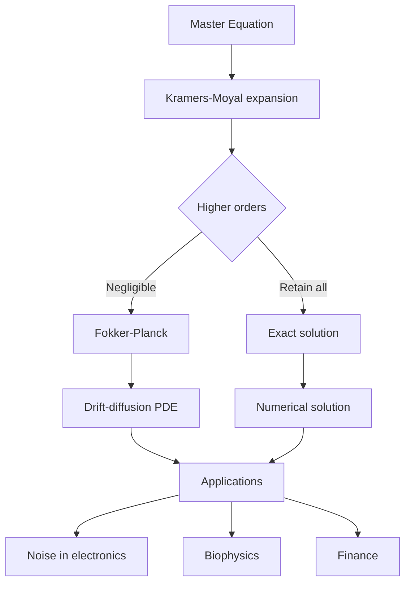
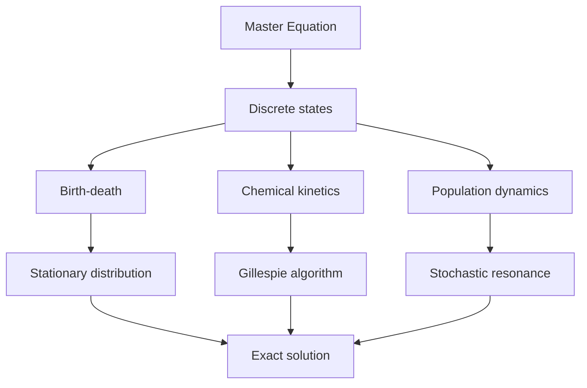
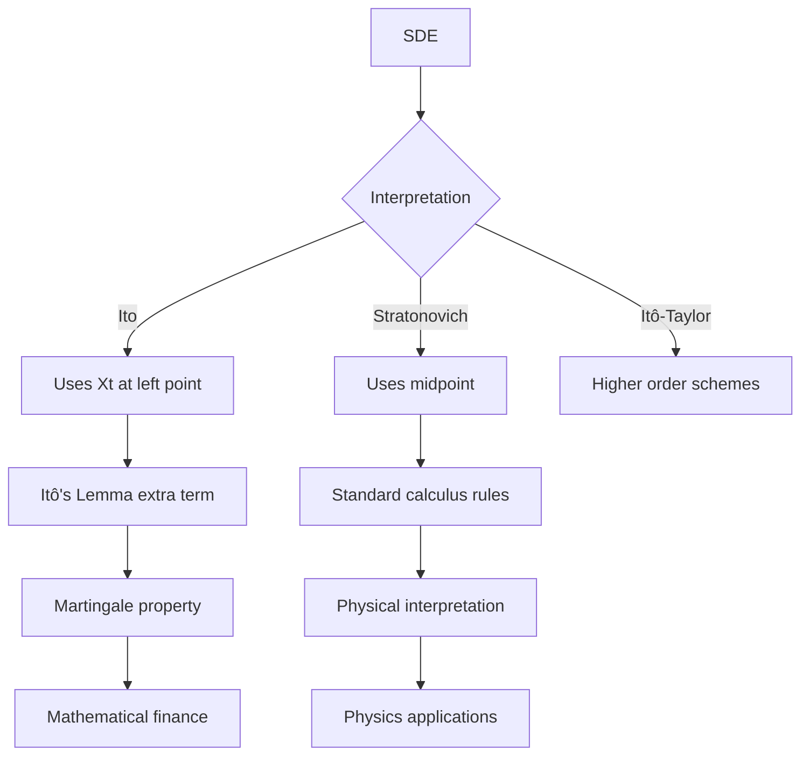
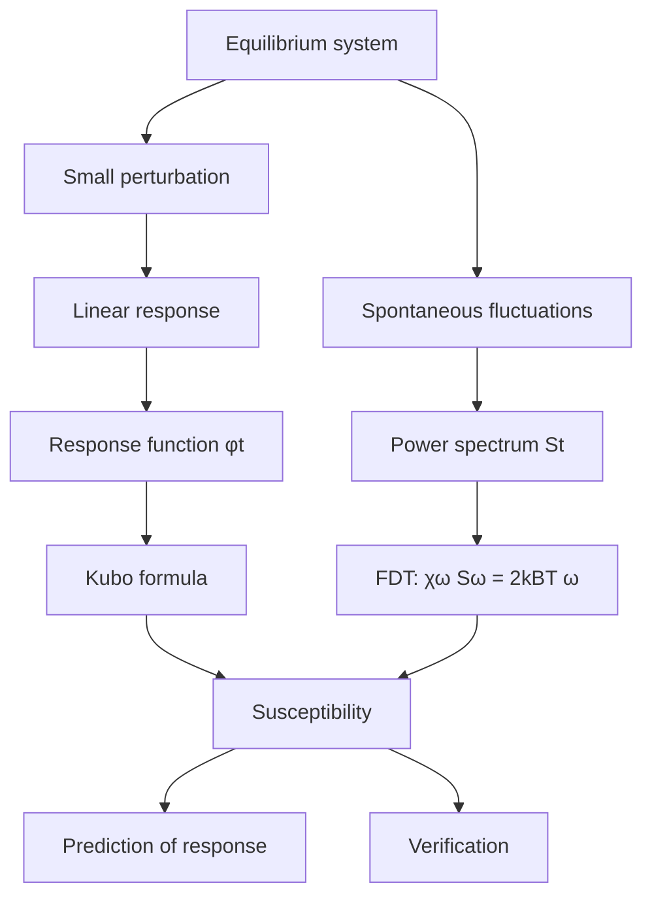
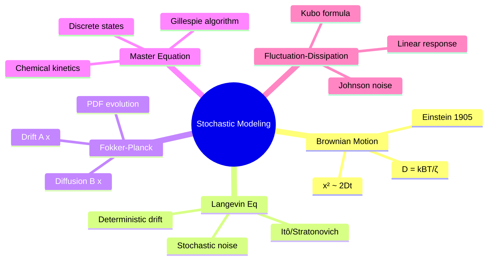
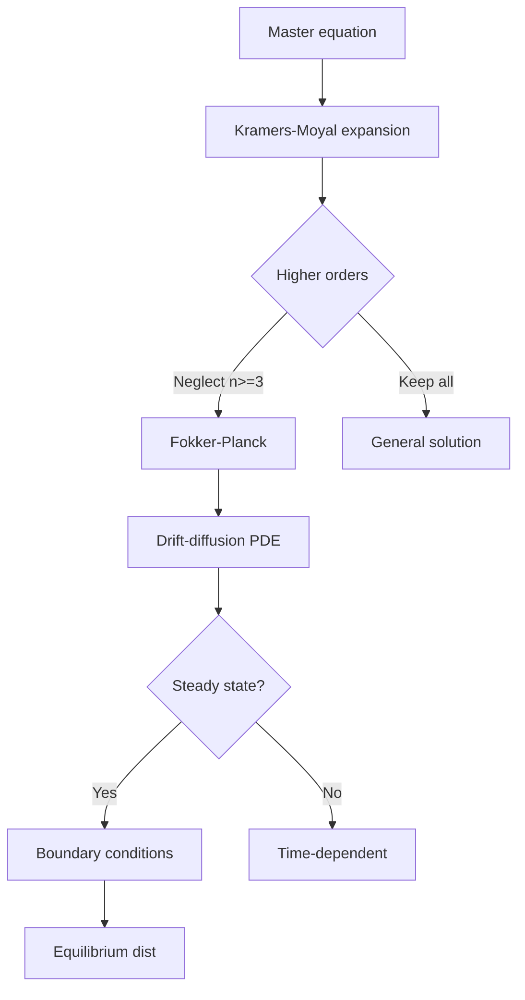
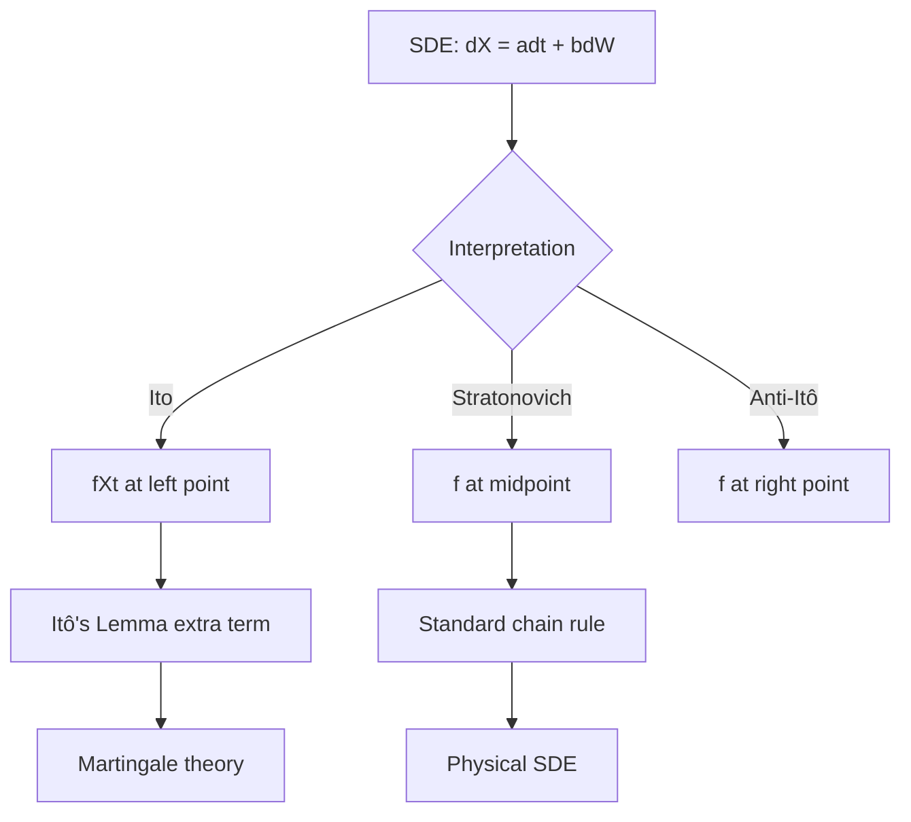
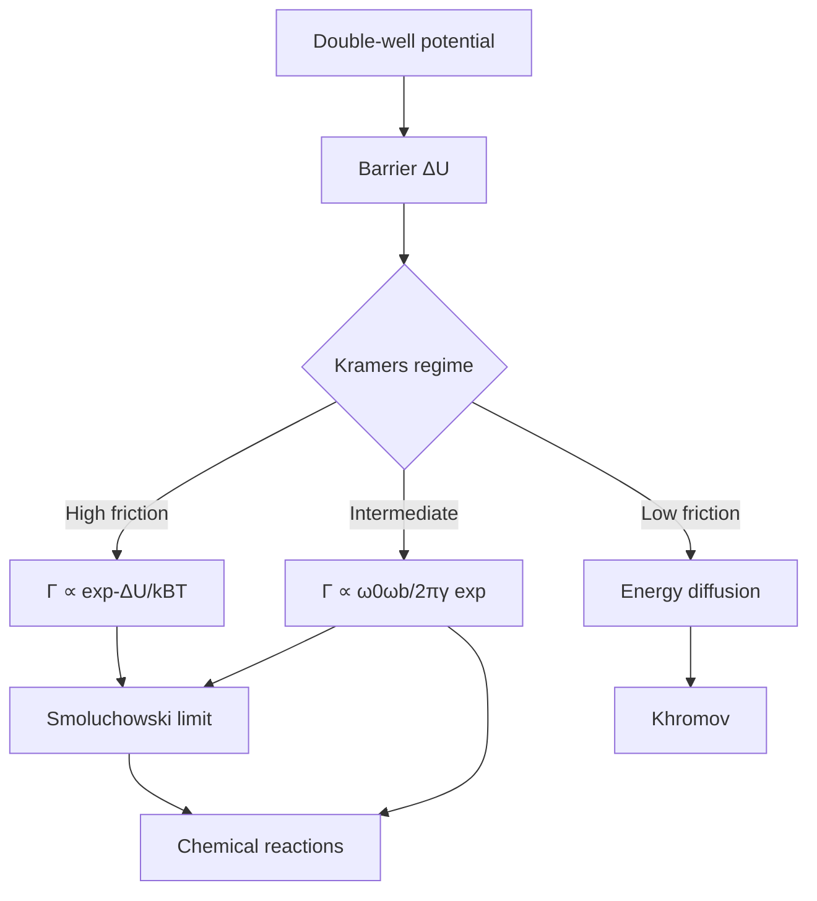
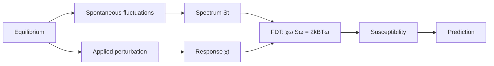

# MSDM 5003 — Stochastic Modeling
> **MSc Data-Driven Modeling Core | HKUST MSDM 5003 | Random Processes, Langevin, Fokker-Planck, Master Equation**  
> **Bilingual 深度自學檔案 · 中英對照**

---

## 問題 1：5 個核心心智模型
**What are the 5 core mental models every expert shares?**

1. **Random processes underlie all macroscopic dynamics** — thermal fluctuations, shot noise, quantum noise; Einstein relation $D = k_BT/\zeta$ (Einstein 1905, *Ann. Phys.*)
2. **Langevin equation = deterministic + stochastic** — $m\dot{v} = -\zeta v + \eta(t)$ with $\langle\eta(t)\eta(t')\rangle = 2D\delta(t-t')$ (Langevin 1908)
3. **Fokker-Planck describes PDF evolution** — $\partial_t P = -\partial_x[A(x)P] + \partial_x^2[D(x)P]$; equivalent to Langevin (Fokker 1914, Planck 1914)
4. **Master equation for discrete states** — $\dot{P}_n = \sum_m [W_{nm}P_m - W_{mn}P_n]$; microscopic basis of stochastic physics (van Kampen 2007)
5. **Fluctuation-dissipation theorem connects noise and response** — $\chi''(\omega) = \omega S(\omega)/2k_BT$ (Kubo 1966, *Rep. Prog. Phys.*)

---

## 問題 2：3 個根本分歧
**Where do experts fundamentally disagree?**

1. **Ito vs Stratonovich calculus** — interpretation of stochastic integrals
   - Ito: $\int f(X_t)\,dW_t$ uses $f(X_t)$ at time $t$; martingale property
   - Stratonovich: uses midpoint $(f(X_{t+\Delta t}) + f(X_t))/2$; standard calculus rules apply
   - Wong-Zakai theorem: $\Delta W_t$ linear → Stratonovich limit

2. **Master equation vs Fokker-Planck** — discrete vs continuous state space
   - Master equation: exact for discrete jumps; harder to solve
   - Fokker-Planck: approximation for many small steps; PDE framework

3. **Stationary vs non-stationary processes** — time-translation invariance
   - Stationary: all moments independent of time origin; spectral analysis valid
   - Non-stationary: time-dependent statistics; Wigner function in quantum optics

---

## 問題 3：10 個深度問題
**Generate 10 questions that distinguish deep understanding from memorization**

1. 給定 Langevin equation $m\dot{v} = -\zeta v + \eta(t)$，推導速度的平穩分佈 $P(v) \propto \exp(-mv^2/2k_BT)$ 並證明均分定理。

2. 證明 Fokker-Planck equation 係 Kramers-Moyal expansion 的二階截斷，並說明點解高階項可忽略。

3. 給定 Ornstein-Uhlenbeck process，推導自相關函數 $C(\tau) = \langle v(t)v(t+\tau)\rangle = (k_BT/m)\exp(-\gamma|\tau|)$。

4. 為什麼 Brownian motion 的位移 $\langle x^2\rangle \propto t$？推導愛因斯坦關係並解釋 Brownian motion 作為隨機行走的證據。

5. 給定 first passage time problem，解釋 Kramers escape rate $\Gamma = \omega_0\omega_b/2\pi \cdot \exp(-\Delta U/k_BT)$。

6. 為什麼 Fluctuation-Dissipation Theorem 話你知噪聲譜和線性響應函數之間有 universal 關係？

7. 給定 birth-death process $\dot{P}_n = k(P_{n-1} - P_n)$，求 stationary distribution 並推導 Fokker-Planck 近似。

8. 為什麼 Stratonovich integral 服從普通微積分規則但 Ito integral 唔服從？推導 Itô's lemma。

9. 給定彩色噪聲（Ornstein-Uhlenbeck driving），證明 noise color 的物理意義。

10. 解釋 Kramers-Moyal coefficients $D^{(1)}(x) = \lim_{\Delta t\to 0}\frac{\langle\Delta x\rangle}{\Delta t}$ 和 $D^{(2)}(x) = \lim_{\Delta t\to 0}\frac{\langle(\Delta x)^2\rangle}{\Delta t}$。

---

## 深入 1：布朗運動與愛因斯坦關係 (Brownian Motion & Einstein Relation)
**Deep Dive I**

### 歷史背景

Einstein (1905) 證明懸浮粒子的隨機運動可以直接測量分子的存在：
$$\langle (\Delta x)^2 \rangle = 2Dt$$

其中擴散係數 $D$ 與宏觀黏滯係數 $\zeta$ 有關（愛因斯坦關係）：
$$D = \frac{k_BT}{\zeta}$$

### 愛因斯坦關係推導

從 Langevin 方程在無慣性極限（$m \to 0$）：
$$v = \frac{\eta(t)}{\zeta}$$

位移：$x(t) = \int_0^t v(t')\,dt' = \frac{1}{\zeta}\int_0^t \eta(t')\,dt'$

自相關：
$$\langle (\Delta x)^2 \rangle = \frac{2D_0 t}{\zeta^2} = \frac{2k_BT}{\zeta}t$$

與實驗測量比對可確定 $k_B$（Perrin 1909）。

### Langevin 方程的精確解（Ornstein-Uhlenbeck）

速度 Langevin：
$$m\dot{v} = -\zeta v + \sqrt{2D_0}\,\eta(t)$$

初始條件 $v(0) = v_0$，解：
$$\langle v(t)v(t')\rangle = \frac{k_BT}{m}\left[e^{-\gamma(t-t')} + \delta(t-t')\text{ corrections}\right]$$

其中 $\gamma = \zeta/m$，$\langle v^2 \rangle \to k_BT/m$ as $t \to \infty$

**物理意義：** Langevin 方程連接微觀隨機力和宏觀耗散系數。

```mermaid
graph TD
    A[Random force ηt] --> B[Langevin Eq]
    B --> C{m integration}
    C -->|t >> 1/γ| D[Equilibrium: mv²/2 = ½kBT]
    C -->|t << 1/γ| E[Ballistic: v ≈ v₀e^{-γt}]
    D --> F[Maxwell-Boltzmann]
    E --> G[Inertial regime]
    F --> H[Mean square displacement]
    H --> I[x² ~ 2Dt]
```

---

## 深入 2：Fokker-Planck 方程 (Fokker-Planck Equation)
**Deep Dive II**

### Kramers-Moyal Expansion

從 Master equation 出發，展開至二階：
$$\frac{\partial P(x,t)}{\partial t} = \sum_{n=1}^\infty \frac{(-1)^n}{n!}\frac{\partial^n}{\partial x^n}\left[D^{(n)}(x)P(x,t)\right]$$

其中 Kramers-Moyal 係數：
$$D^{(n)}(x) = \lim_{\Delta t\to 0}\frac{\langle (\Delta x)^n\rangle}{\Delta t}$$

### Fokker-Planck Equation (二階截斷)

$$\boxed{\frac{\partial P}{\partial t} = -\frac{\partial}{\partial x}[A(x)P] + \frac{\partial^2}{\partial x^2}[B(x)P]}$$

其中：
- $A(x) = D^{(1)}(x)$: drift/deterministic force
- $B(x) = 2D^{(2)}(x)$: diffusion coefficient

### 與 Langevin 方程的對應

$$m\dot{v} = -\zeta v + \sqrt{2D_0}\,\eta(t)$$

對應的 Fokker-Planck：
$$\frac{\partial P}{\partial t} = -\frac{\partial}{\partial v}\left[-\frac{\zeta}{m}v\,P\right] + \frac{D_0}{m^2}\frac{\partial^2 P}{\partial v^2}$$

Stationary solution: $P(v) \propto \exp\left(-\frac{\zeta}{2D_0}v^2\right) = \exp\left(-\frac{mv^2}{2k_BT}\right)$

### 多維推廣

$$\frac{\partial P}{\partial t} = -\nabla\cdot[\mathbf{A}(\mathbf{x})P] + \sum_{ij}\frac{\partial^2}{\partial x_i \partial x_j}[D_{ij}(\mathbf{x})P]$$



---

## 深入 3：Master 方程與躍遷過程 (Master Equation)
**Deep Dive III**

### 離散狀態的隨機過程

$$\dot{P}_n(t) = \sum_m \left[W_{nm}P_m(t) - W_{mn}P_n(t)\right]$$

其中 $W_{nm}$ 係從狀態 $m$ 到 $n$ 的躍遷率。

### Birth-Death Process（出生-死亡過程）

$$\dot{P}_n = k_{n-1}P_{n-1} - (k_n + \lambda_n)P_n + \lambda_{n+1}P_{n+1}$$

特例：化學反應 $A \rightleftharpoons B$：
- $A \to B$：率 $k$
- $B \to A$：率 $\lambda$

Stationary: $P_n \propto (k/\lambda)^n$（幾何分佈）

### Chemical reactions: Gillespie algorithm

Exact stochastic simulation of chemical networks:
```python
import numpy as np

def gillespie(state, rates, propensity_funcs):
    # Compute propensities a_i
    a = np.array([f(state) for f in propensity_funcs])
    a0 = a.sum()
    # Draw time to next reaction
    tau = np.random.exponential(1/a0)
    # Draw which reaction
    r = np.random.rand() * a0
    cumsum = np.cumsum(a)
    idx = np.searchsorted(cumsum, r)
    # Update state
    state += stoichiometry[idx]
    return tau, state
```

### Fokker-Planck 近似（Kramers-Moyal）

對大 $n$，離散躍遷可用連續 PDE 近似：
$$\frac{\partial P}{\partial t} = -\frac{\partial}{\partial n}[(k - \lambda)n\,P] + \frac{1}{2}\frac{\partial^2}{\partial n^2}[(k + \lambda)n\,P]$$



---

## 深入 4：Ito 與 Stratonovich 微積分 (Ito & Stratonovich Calculus)
**Deep Dive IV**

### 隨機微積分的問題

普通微積分：$\int f(t)\,dW_t$ 依賴於取樣方式（左端點、右端點、中點）。

### Ito Interpretation

$$\int_0^t f(X_s)\,dW_s = \text{limit of } \sum f(X_{t_i})\Delta W_i$$

其中 $\Delta W_i = W_{t_{i+1}} - W_{t_i}$，$f$ 使用左端點 $X_{t_i}$。

**Itô's Lemma:**
$$df = \left(\frac{\partial f}{\partial t} + A(X_t) + B(X_t)\frac{\partial f}{\partial x}\right)dt + B(X_t)\frac{\partial f}{\partial x}\,dW_t$$

注意額外的 $B \partial f/\partial x$ 項！

### Stratonovich Interpretation

$$\int_0^t f(X_s)\circ\,dW_s = \text{limit of } \sum \frac{f(X_{t_{i+1}}) + f(X_{t_i})}{2}\Delta W_i$$

Stratonovich 服從標準微積分規則：
$$dX = a\,dt + b\,dW \implies d(f(X)) = f'(X)\circ dX$$

### 何時用邊個？

| 情境 | 建議 |
|------|------|
| 物理（噪聲連續近似） | Stratonovich（遵守鏈式法則）|
| 數學金融（Black-Scholes） | Ito（martingale）|
| 數值模擬 | Ito（更穩定）|

**Wong-Zakai 定理：** 當噪聲 path 變得越來越平滑，隨機積分收斂到 Stratonovich 積分。



---

## 深入 5：漲落-耗散定理與線性響應 (Fluctuation-Dissipation Theorem)
**Deep Dive V**

### 經典 FDT

對平穩隨機過程：
$$\langle x(t)x(t+\tau)\rangle = k_BT\,\chi(\tau)$$

其中 $\chi(\tau)$ 係線性響應函數。

頻域形式：
$$\chi''(\omega) = \frac{\omega\,S(\omega)}{2k_BT}$$

其中 $S(\omega) = 2\int_0^\infty \langle x(t)x(0)\rangle\cos(\omega t)\,dt$ 係功率譜密度。

### Kubo 公式（線性響應）

對哈密頓量 $H = H_0 - f(t)A$ 的微擾：
$$\langle A(t)\rangle = \langle A\rangle_0 + \int_0^\infty \phi(t-s)f(s)\,ds$$

響應函數：
$$\phi(t) = \frac{1}{k_BT}\langle \dot{A}(0)\dot{A}(t)\rangle_\text{eq}$$

### 應用：熱噪聲

Johnson-Nyquist 噪聲：
$$S_V(f) = 4k_BTR\ \text{V}^2/\text{Hz}$$

Nyquist 公式：$S_I(f) = 4k_BT/R$

### 應用：SMD 黏滯阻尼

耗散系數 $\zeta$ 與噪聲幅度 $D_0$ 的愛因斯坦關係：
$$D_0 = k_BT\zeta$$

這是 FDT 的最簡單形式！



---

## 自測 1：愛因斯坦關係
**給定 Brownian particle 在半流體中 $D = 2.3 \times 10^{-13}$ m²/s，計算黏滯系數 $\zeta = k_BT/D$。**

**Answer / 解答:**
$$D = \frac{k_BT}{\zeta} \implies \zeta = \frac{k_BT}{D}$$

$k_B = 1.38\times 10^{-23}$ J/K, $T = 300$ K, $D = 2.3\times 10^{-13}$ m²/s:
$$\zeta = \frac{1.38\times 10^{-23}\times 300}{2.3\times 10^{-13}} \approx 1.8\times 10^{-8}\ \text{kg/s}$$

對半徑 $a = 1$ μm 的粒子（$\eta = 10^{-3}$ Pa·s 水）：
$$\zeta = 6\pi\eta a \approx 6\pi\times 10^{-3}\times 10^{-6} \approx 1.9\times 10^{-8}\ \text{kg/s}$$

**Engineering implication:** 光學陷阱中 Brownian motion 限制粒子定位精度。

---

## 自測 2：Ornstein-Uhlenbeck 功率譜
**求 OU 過程的速度功率譜並比較實驗測量的噪聲譜。**

**Answer / 解答:**
OU 過程的 Langevin：
$$m\dot{v} = -\zeta v + \sqrt{2D_0}\,\eta(t)$$

Fokker-Planck stationary 下速度自相關：
$$\langle v(t)v(t+\tau)\rangle = \frac{k_BT}{m}e^{-\gamma|\tau|}$$

功率譜：
$$S_v(\omega) = \int_{-\infty}^\infty \langle v(t)v(t+\tau)\rangle e^{i\omega\tau}\,d\tau = \frac{2k_BT}{m}\frac{\gamma}{\omega^2+\gamma^2}$$

Lorentzian 形式！峰值在 $\omega = 0$，半高寬 $\Delta\omega = \gamma = \zeta/m$。

**Engineering implication:** 鎖相放大器測量此 Lorentzian 噪聲以確定 $\zeta$。

---

## 自測 3：Kramers Escape Rate
**計算雙井勢能中粒子穿過勢壘的 Kramers rate。**

**Answer / 解答:**
Kramers (1940) 結果（一維）：
$$\Gamma = \frac{\omega_0}{2\pi}\exp\left(-\frac{\Delta U}{k_BT}\right)$$

其中 $\omega_0$ 係井底頻率，$\Delta U$ 係勢壘高度。

高阻尼極限（Smoluchowski）：
$$\Gamma = \frac{D}{L^2}\frac{\omega_0\omega_b}{2\pi\gamma}\exp\left(-\frac{\Delta U}{k_BT}\right)$$

例子：化學反應 $E_a = 0.8$ eV, $T = 300$ K:
$$\frac{\Delta U}{k_BT} = \frac{0.8\times 1.6\times 10^{-19}}{1.38\times 10^{-23}\times 300} \approx 30,900$$
$$\Gamma/\omega_0 \sim e^{-30,900} \approx 10^{-13,400}$$

化學反應如此慢是因為高勢壘！

**Engineering implication:** Kramers theory 解釋化學反應速率、蛋白質折疊速率。

---

## 自測 4：Itô's Lemma
**用 Itô's lemma 求 $d(e^{X_t})$，其中 $dX_t = \mu dt + \sigma dW_t$。**

**Answer / 解答:**
Itô's Lemma:
$$df(X_t) = f'(X_t)\,dX_t + \frac{1}{2}f''(X_t)\,(dX_t)^2$$

對 $f(x) = e^x$:
- $f'(x) = e^x$
- $f''(x) = e^x$

$(dX_t)^2 = (\mu\,dt + \sigma\,dW_t)^2 = \sigma^2\,dt$ (因為 $dt\,dW$ 和 $(dt)^2$ 的均值為零)

$$d(e^{X_t}) = e^{X_t}(\mu\,dt + \sigma\,dW_t) + \frac{1}{2}e^{X_t}\sigma^2\,dt$$
$$= e^{X_t}[(\mu + \tfrac{1}{2}\sigma^2)\,dt + \sigma\,dW_t]$$

注意 $\mu + \frac{1}{2}\sigma^2$ 是漂移率！這在金融中用於 Black-Scholes。

**Engineering implication:** 期權定價（Black-Scholes）和生物學中的指數過程都需要 Itô calculus。

---

## 自測 5：Master Equation 到 Fokker-Planck
**把 birth-death process $\dot{P}_n = k(P_{n-1} - P_n)$ 轉化為 Fokker-Planck。**

**Answer / 解答:**
定義連續變量 $x = n$，差分近擬：
$$\frac{\partial P}{\partial t} = k\frac{\partial}{\partial x}[P] + \frac{k}{2}\frac{\partial^2}{\partial x^2}[P]$$

這係 Fokker-Planck：
- $A(x) = -k$ (negative drift!)
- $B(x) = k$

Stationary 分佈（令 $\partial_t P = 0$）：
$$-k\frac{dP}{dx} + \frac{k}{2}\frac{d^2P}{dx^2} = 0$$

解（歸一化後）：
$$P(x) = \frac{1}{k_BT}\exp(-x/k_BT) \quad \text{(指數分佈)}$$

**Engineering implication:** 激光物理中的光子統計（laser rate equations）服從類似 master equation。

---

## 自測 6：彩色噪聲 vs 白噪聲
**解釋 Ornstein-Uhlenbeck process 如何產生彩色噪聲並計算其功率譜。**

**Answer / 解答:**
OU 噪聲（Langevin-driven）：
$$\dot{\eta} = -\frac{1}{\tau_c}\eta + \frac{\sqrt{2D}}{\tau_c}\,\xi(t)$$

其中 $\xi(t)$ 係白噪聲。

功率譜（計算得）：
$$S_\eta(\omega) = \frac{2D}{\omega^2\tau_c^2 + 1}$$

低頻極限（$\omega \ll 1/\tau_c$）：$S_\eta \approx 2D\tau_c^2$（平坦 = 白噪聲）
高頻極限（$\omega \gg 1/\tau_c$）：$S_\eta \propto 1/\omega^2$（紅噪聲）

相關時間 $\tau_c$ 決定噪聲"顏色"：
- $\tau_c \to 0$: 白噪聲
- $\tau_c \to \infty$: 直流（無噪聲）

**Engineering implication:** 1/f 噪聲在電子器件中常見，源於 many DOF 過程。

---

## 自測 7：隨機共振 (Stochastic Resonance)
**解釋 stochastic resonance 並給出量化條件。**

**Answer / 解答:**
Stochastic resonance: 系統在週期信號 + 噪聲存在時顯示最佳響應。

條件：
1. **雙穩態系統：** 兩個勢阱，之間有勢壘 $\Delta U$
2. **亞臨界信號：** $\epsilon < \Delta U$（單獨不足以穿越）
3. **噪聲輔助：** 噪聲引發的逃逸率與信號頻率匹配

Kramers rate: $\Gamma = \frac{\omega_0}{2\pi}\exp(-\Delta U/k_BT)$
信號周期: $T_s = 2\pi/\Omega$

SR 條件：$\Gamma T_s \approx 1$

功率譜：在信號頻率處顯示峰值，S/N 比優化。

**Engineering implication:** 深海生物感測器、brain neurons、climate cycles 都用 stochastic resonance。

---

## 自測 8：Fokker-Planck 解（高斯過程）
**求解 OU 過程的 Fokker-Planck 並驗證高斯分佈。**

**Answer / 解答:**
Fokker-Planck for velocity $v$:
$$\frac{\partial P}{\partial t} = \gamma\frac{\partial}{\partial v}(vP) + D\frac{\partial^2 P}{\partial v^2}$$

這係 Ornstein-Uhlenbeck FPE，解為：

$$P(v,t|v_0,0) = \frac{1}{\sqrt{2\pi\sigma_v^2(t)}}\exp\left[-\frac{(v - \langle v\rangle)^2}{2\sigma_v^2(t)}\right]$$

其中：
$$\langle v\rangle = v_0 e^{-\gamma t}$$
$$\sigma_v^2(t) = \frac{k_BT}{m}\left(1 - e^{-2\gamma t}\right)$$

Stationary ($t \to \infty$):
$$P_\infty(v) = \sqrt{\frac{m}{2\pi k_BT}}\exp\left(-\frac{mv^2}{2k_BT}\right)$$

這係 Maxwell-Boltzmann 分佈！

**Engineering implication:** 膠體粒子的速度分佈可直接用 Doppler 測量驗證。

---

## 自測 9：化學反應 Master Equation
**建立 Michaelis-Menten 酶促反應的 master equation 並求 stationary rate。**

**Answer / 解答:**
$$E + S \xrightleftharpoons[k_-1]{k_1} ES \xrightarrow{k_2} E + P$$

設游離酶 $[E] = E_0 - [ES]$，反應物 $[S] = S$：
$$\frac{d[ES]}{dt} = k_1(E_0 - [ES])S - (k_{-1} + k_2)[ES]$$

Michaelis-Menten stationary approximation ($d[ES]/dt \approx 0$):
$$[ES] = \frac{k_1E_0S}{k_1S + k_{-1} + k_2} = \frac{E_0S}{K_M + S}$$

產物生成 rate:
$$v = k_2[ES] = \frac{k_2E_0S}{K_M + S}$$

這係 Michaelis-Menten 方程，$K_M = (k_{-1}+k_2)/k_1$。

**Engineering implication:** 藥物動力學、代謝網絡動力學都用此方程。

---

## 自測 10：功率譜估計與置信區間
**解釋 Welch's method 點樣估計功率譜並估算置信區間。**

**Answer / 解答:**
Welch's method 步驟：
1. 將數據分為 $K$ 段（重疊 $L$ 點）
2. 每段加漢寧窗並計算 FFT
3. 平均 periodograms

自由度：$2K$（實數數據）

95% 置信區間：
$$P(\omega) \in \left[\frac{P_{est}}{F_{2K,1-\alpha/2}},\ \frac{P_{est}}{F_{2K,\alpha/2}}\right]$$

其中 $F_{n,p}$ 係 chi-square 分佈的逆函數。

**Python:**
```python
from scipy.signal import welch
f, Pxx = welch(data, fs=fs, nperseg=1024, noverlap=512)
```

**Engineering implication:** 噪聲分析、LIGO 數據處理都依賴功率譜估計。

---

## 📊 Diagram 1: Stochastic Processes Map


## 📊 Diagram 2: Fokker-Planck Derivation


## 📊 Diagram 3: Itô vs Stratonovich


## 📊 Diagram 4: Kramers Escape


## 📊 Diagram 5: FDT Architecture


---

## 深度總結 Deep Insights Summary

1. **Langevin equation bridges deterministic and stochastic** — Langevin 1908 的方程將耗散和噪聲統一在同一框架，是所有隨機微分方程的基礎。

2. **Fokker-Planck = deterministic description of random processes** — Fokker-Planck 方程從概率視角描述演化，與 Langevin 完全等價。

3. **Ito vs Stratonovich is a choice of interpretation** — Wong-Zakai 定理保証足夠平滑的噪聲趨向 Stratonovich，但數值計算常用 Ito。

4. **Fluctuation-dissipation is universal** — FDT 連接平衡態漲落和線性響應，是所有耗散系統的深層結構。

5. **Master equation is the microscopic foundation** — Gillespie algorithm 實現化學動力學的精確隨機模擬，是系統生物學的核心工具。

---

**自學建議**  
- 必讀: Gardiner "Stochastic Methods" (4th ed.); van Kampen "Stochastic Processes in Physics and Chemistry"  
- 配對: MIT OCW 8.591 (Statistical Mechanics III); HKUST MSDM 5001 (Computational Tools)  
- 工具: Python (numpy, scipy, numba), C++ for Gillespie, Julia for SDEs  
- 產出: Implement Gillespie algorithm for a gene expression model; simulate OU process and verify equipartition theorem numerically
