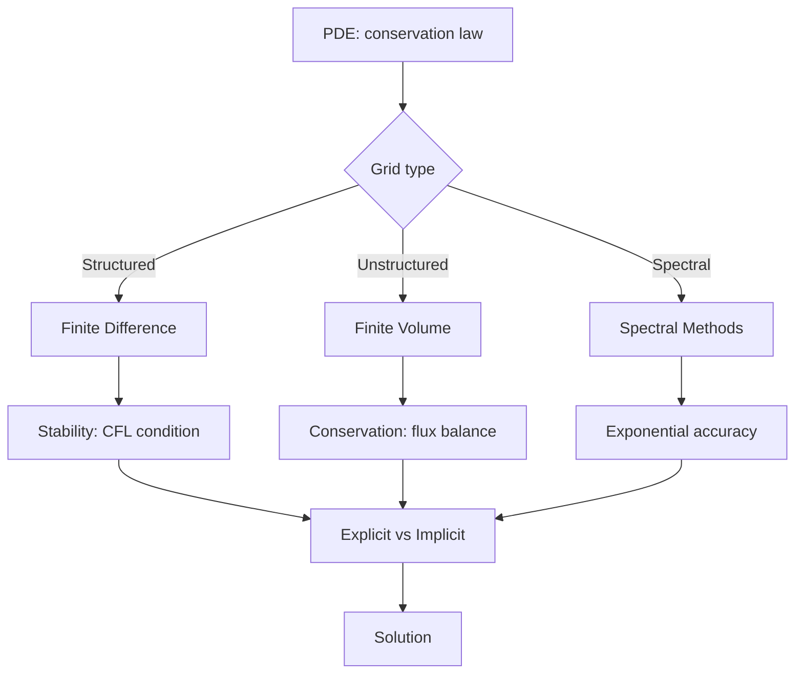
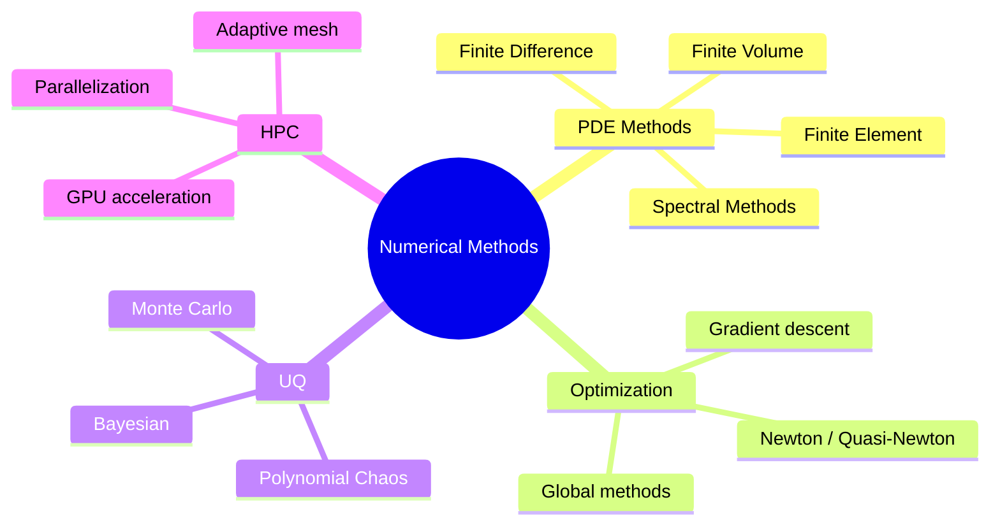
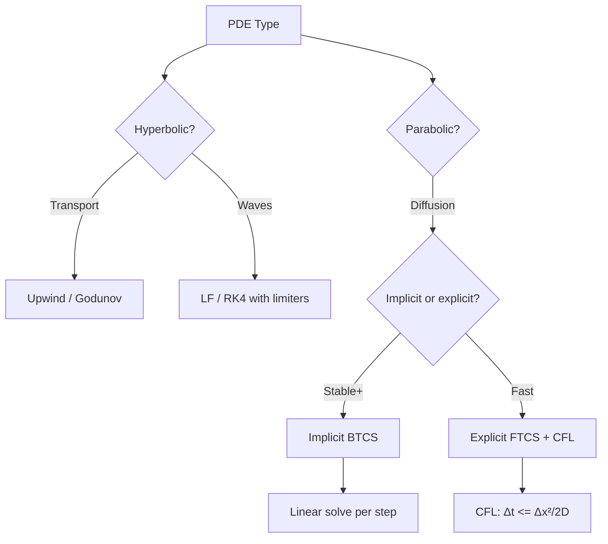
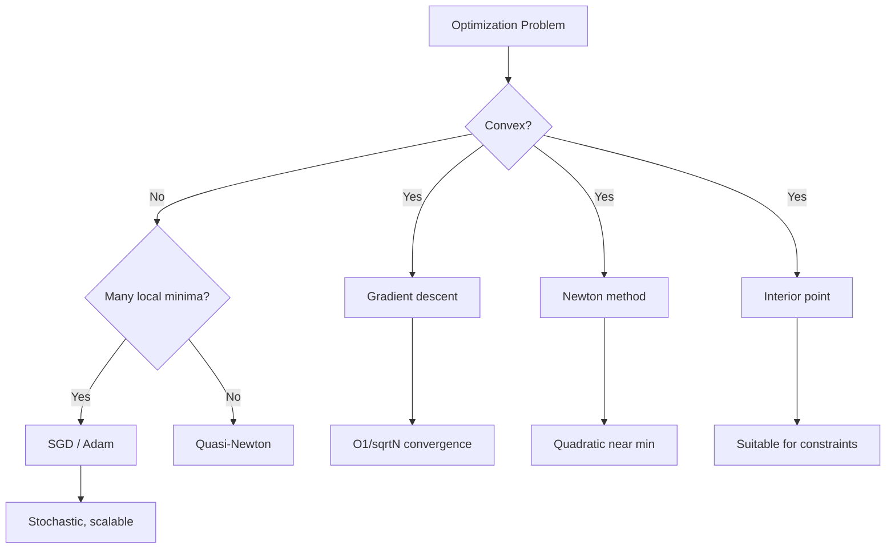
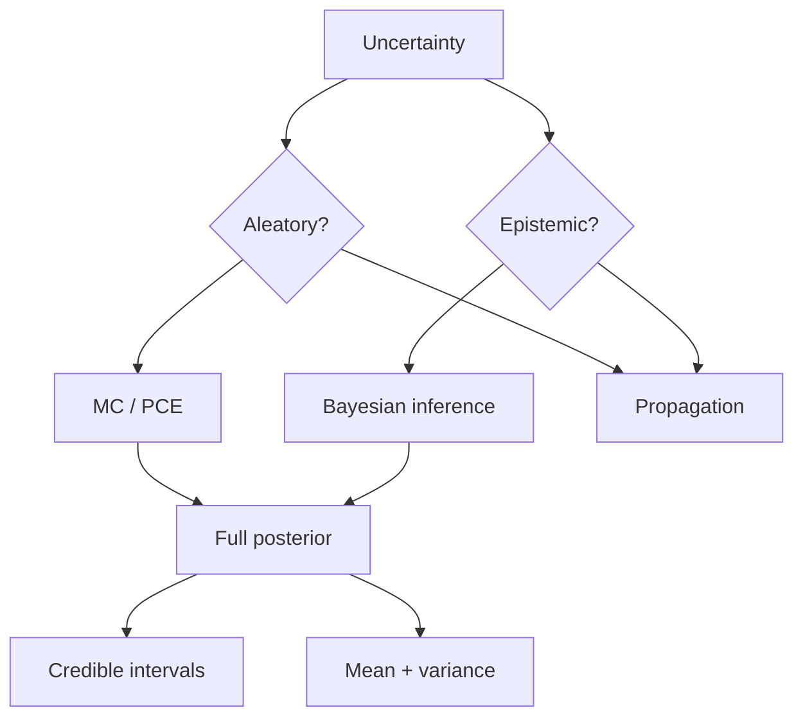

# MSDM 5004 — Numerical Methods for Data-Driven Physics
> **MSc Data-Driven Modeling Core | HKUST MSDM 5004 | Numerical PDEs, Optimization, Spectral Methods, Uncertainty Quantification**  
> **Bilingual 深度自學檔案 · 中英對照**

---

## 問題 1：5 個核心心智模型

1. **Conservation laws → PDEs → Discrete systems** — every PDE in physics is a conservation law; discretization preserves these invariants (Noether's theorem, symplectic integrators)
2. **Stability determines feasibility** — explicit methods stable only when $\Delta t < \Delta t_{CFL}$; implicit methods unconditionally stable but require iterative solves (Richtmyer & Morton 1967)
3. **Spectral methods = exponential accuracy for smooth problems** — $N$-term Fourier series: error $\sim e^{-cN}$ for smooth $C^\infty$ functions; algebraic for non-smooth (Trefethen 2000, *Spectral Methods in MATLAB*)
4. **Optimization landscapes determine algorithm choice** — convex (unique global min) vs non-convex (local minima matter); Newton's method $O(N)$ for convex, O($N^k$) heuristic for non-convex
5. **UQ quantifies model imperfection** — every simulation has uncertainty; Monte Carlo, polynomial chaos, and Bayesian methods all quantify this (Ghanem et al. 2017)

---

## 問題 2：3 個根本分歧

1. **Finite volume vs finite element vs spectral**
   - Finite volume: conserves mass, works on arbitrary grids; Godunov's theorem limits to 1st order unless reconstruction used
   - Finite element: handles complex geometry, variational basis; requires mesh generation (often the bottleneck)
   - Spectral: exponential accuracy, but sensitive to boundaries and singularities; best for periodic domains

2. **Deterministic vs stochastic optimization**
   - Deterministic: gradient-based (SGD, Adam), guaranteed convergence for convex; sensitive to initialization for non-convex
   - Stochastic: genetic algorithms, MCMC, simulated annealing; parallelizable, but convergence ill-defined

3. **ALE vs Eulerian vs Lagrangian meshes**
   - Eulerian: fixed grid, easy but smears interfaces (numerical diffusion)
   - Lagrangian: mesh follows material, sharp interfaces but mesh tangles
   - ALE: arbitrary Lagrangian-Eulerian — best of both worlds, standard for hydrocodes

---

## 問題 3：10 個深度問題

1. 給定 heat equation $\partial_t u = D\nabla^2 u$, derive the CFL condition for explicit FTCS: $\Delta t \leq \Delta x^2/(2D)$。為什麼implicit BTCS unconditionally stable?

2. 給定 Burgers equation $\partial_t u + u\partial_x u = \nu\partial_{xx}u$, 點樣避免 shock formation 和 numerical oscillation? 討論 Godunov's theorem 和 ENO/WENO reconstruction。

3. 解釋 spectral method 的 exponential accuracy 點樣實現，並推導 Chebyshev collocation method 對 diffusion equation 的 stability。

4. 為什麼 Newton's method quadratic convergence near root but fails far away? 推導 basin of attraction 對 1D case。

5. 給定 Navier-Stokes equations in 3D, 討論 direct numerical simulation (DNS) 的計算量：多少網格點 needed for $Re = 10^6$?

6. 解釋 spectral element method (SEM) 点樣 combine FEM 的幾何靈活性 和 spectral 的 accuracy，並給出 implementation example。

7. 為什麼 symplectic integrator (e.g., Verlet) 對 Hamiltonian systems 優於 standard RK4? 推導 long-time energy drift。

8. 給定 uncertain parameters in PDE, 比較 MC ($O(1/\sqrt{N})$) 和 polynomial chaos expansion (PCE) ($O(1/N)$) 的收斂 rate。

9. 為什麼 multigrid method 可以達到 $O(N)$ complexity for elliptic PDEs? 推導 V-cycle 和 W-cycle 的 smoothing factor。

10. 給定 inverse problem (e.g., inferring source term from boundary data), 比較 Tikhonov regularization 和 Bayesian MAP estimation。

---

## 深入 1：Numerical PDEs — Finite Difference & Finite Volume
**Deep Dive I**

### The CFL Condition (Courant–Friedrichs–Lewy 1928)

For explicit schemes, information cannot travel faster than the grid:

$$\Delta t \leq \frac{\text{CFL} \cdot \Delta x}{|u| + c}$$

For heat equation ($c = \sqrt{D}$):
$$|u| \leq c \implies \text{CFL} = \frac{\Delta x^2}{2D} \text{ (FTCS)}$$

**FTCS (Forward Time Centered Space):**
$$\frac{u_i^{n+1} - u_i^n}{\Delta t} = D\frac{u_{i+1}^n - 2u_i^n + u_{i-1}^n}{\Delta x^2}$$

Von Neumann stability analysis: $|r| \leq 1 \implies \Delta t \leq \Delta x^2/(2D)$

**BTCS (Backward Time Centered Space):**
$$\frac{u_i^{n+1} - u_i^n}{\Delta t} = D\frac{u_{i+1}^{n+1} - 2u_i^{n+1} + u_{i-1}^{n+1}}{\Delta x^2}$$

Unconditionally stable (no $\Delta t$ restriction) but requires solving a linear system at each step.

### Physical Conservation

| Equation | Conserved Quantity | Numerical Preservation |
|----------|-------------------|----------------------|
| Continuity $\partial_t\rho + \nabla\cdot(\rho\mathbf{v}) = 0$ | Mass | FV: exact; FD: not guaranteed |
| Advection $\partial_t u + \mathbf{v}\cdot\nabla u = 0$ | $\int u\,dV$ | FV: yes; FD: with upwinding |
| Diffusion $\partial_t u = D\nabla^2 u$ | Total $u$ | FV/FD: yes |
| Navier-Stokes | Momentum, energy | Only with special schemes |

### Shock Capturing: Burgers Equation

$$u_t + \left(\frac{u^2}{2}\right)_x = 0 \implies \text{characteristic: } \frac{dx}{dt} = u$$

Shock forms when characteristics intersect → Rankine-Hugoniot condition:
$$s = \frac{f(u_L) - f(u_R)}{u_L - u_R}$$

**Godunov's theorem:** Linear numerical scheme with monotone fluxes is at most 1st order accurate.

**Solution: ENO/WENO reconstruction** — adaptively chooses stencil based on smoothness.

**Engineering implication:** Physics-informed discretization preserves important properties.



---

## 深入 2：Spectral Methods & Fourier Analysis
**Deep Dive II**

### Fourier Spectral Method

For periodic domain $[0, 2\pi]$ with $N$ grid points:
$$u(x_j, t) = \sum_{k=-N/2}^{N/2} \hat{u}_k(t) e^{ikx_j}$$

Spectral derivative: $\partial_x u \leftrightarrow ik\hat{u}_k$

**Aliasing and the 2/3 rule:**
$$N_{eff} = \frac{2}{3}N \implies \text{dealiasing removes aliased modes}$$

### Chebyshev Collocation Method (Non-Periodic)

Nodes: $x_j = \cos(j\pi/N)$, $j = 0, \ldots, N$

Differentiation matrix $D_{ij} = d^{(1)}(x_i, x_j)$ from Chebyshev polynomials.

**Diffusion equation:** $\partial_t u = \partial_{xx} u$
$$\frac{du_j}{dt} = \sum_i D^2_{ji} u_i$$

**Stability:** $\Delta t \leq O(1/N^2)$ for explicit Chebyshev (unlike FD).

**Alternative: Tau method** — imposes boundary conditions weakly.

### Convergence Rates

| Method | Smooth solution | Non-smooth solution |
|--------|----------------|---------------------|
| Fourier spectral | $\sim e^{-cN}$ | $O(1/N)$ |
| Chebyshev | $O(N^{-m})$ for $C^m$ | $O(N^{-1})$ |
| Finite difference (2nd order) | $O(\Delta x^2)$ | $O(\Delta x^2)$ |
| Finite element (linear) | $O(h^2)$ | $O(h)$ |

**Trefethen's rule:** Spectral methods win by a factor of $e^{\sqrt{m}}$ for smooth problems with $m$ digits of accuracy needed.

### Application: Solving Schrödinger Equation

$$i\hbar\frac{\partial\psi}{\partial t} = -\frac{\hbar^2}{2m}\nabla^2\psi + V\psi$$

Spectral split-operator method:
$$\psi(t+\Delta t) = e^{-iV\Delta t/2\hbar} \cdot e^{-iT\Delta t/\hbar} \cdot e^{-iV\Delta t/2\hbar}\psi(t) + O(\Delta t^3)$$

where $T = -\hbar^2\nabla^2/2m$ applied in Fourier space.

**Engineering implication:** Spectral methods are the gold standard for smooth PDEs.

---

## 深入 3：Optimization in Physics
**Deep Dive III**

### Optimization Landscape Topology

**Convex functions:** $f(\lambda x + (1-\lambda)y) \leq \lambda f(x) + (1-\lambda)f(y)$ → unique global minimum
$$f^* = \min_x f(x), \quad \nabla f(x^*) = 0, \quad \nabla^2 f(x^*) \succ 0$$

**Non-convex:** multiple local minima, saddle points, plateaus

For high-dimensional neural networks, critical points are predominantly saddle points (Dauphin et al. 2014):
$$\frac{\text{saddle points}}{\text{local minima}} \approx \frac{\text{dim}}{\text{data points}}$$

### Key Algorithms

| Algorithm | Convergence | Use Case |
|-----------|-------------|----------|
| Gradient descent | $O(1/\sqrt{N})$ | Simple, large N |
| Newton method | Quadratic near min | Small N, smooth |
| BFGS/L-BFGS | Superlinear | Medium N, smooth |
| Adam | Adaptive rate | Deep learning |
| Simulated annealing | Global (probabilistic) | Non-convex, discrete |

**Newton's method:**
$$x_{n+1} = x_n - [\nabla^2 f(x_n)]^{-1}\nabla f(x_n)$$

Quadratic convergence: $|x_{n+1} - x^*| \leq C|x_n - x^*|^2$

Requires Hessian — for $N$ parameters, computing $\nabla^2 f$ is $O(N^2)$.

### Physics-Informed Neural Networks (PINNs)

Raissi et al. (2019, *JCP*): Encode PDE as soft constraint in loss:

$$\mathcal{L} = \underbrace{\frac{1}{N}\sum_{i=1}^N (u_{NN}(x_i,t_i) - u_{data}(x_i,t_i))^2}_{\text{data residual}} + \underbrace{\frac{\lambda}{N}\sum_{j=1}^N \left(\frac{\partial u_{NN}}{\partial t} + u_{NN}\frac{\partial u_{NN}}{\partial x} - \nu\frac{\partial^2 u_{NN}}{\partial x^2}\right)^2}_{\text{PDE residual}}$$

**PINN for Schrödinger:**
$$\mathcal{L}_{PDE} = \left|i\hbar\frac{\partial\psi_{NN}}{\partial t} + \frac{\hbar^2}{2m}\nabla^2\psi_{NN} - V\psi_{NN}\right|^2$$

**Engineering implication:** PINNs combine data efficiency (physics constraints) with neural network flexibility.

---

## 深入 4：Uncertainty Quantification (UQ)
**Deep Dive IV**

### Sources of Uncertainty

| Type | Description | Example | Method |
|------|-------------|---------|--------|
| Aleatory | Irreducible randomness | measurement noise | MC sampling |
| Epistemic | Knowledge gap | boundary conditions | Bayesian inference |
| Model | Imperfect model | closure approximation | UQ on model parameters |

### Monte Carlo Methods

$$I = \int_\Omega f(\mathbf{x})p(\mathbf{x})d\mathbf{x} \approx \frac{1}{N}\sum_{i=1}^N f(\mathbf{x}_i)$$

Error: $\sigma/\sqrt{N}$ — **independent of dimension!**

**Variance reduction:** Importance sampling
$$\hat{I}_{IS} = \frac{1}{N}\sum_{i=1}^N \frac{f(\mathbf{x}_i)p(\mathbf{x}_i)}{q(\mathbf{x}_i)}, \quad \mathbf{x}_i \sim q$$

Optimal $q^* \propto |f|p$ minimizes variance.

### Polynomial Chaos Expansion (PCE)

For Gaussian $x \sim \mathcal{N}(\mu,\sigma^2)$:
$$u(x) = \sum_{n=0}^\infty u_n \phi_n(x), \quad \phi_n \in \text{Hermite polynomials}$$

Truncated at $N+1$ terms:
$$u(x) \approx \sum_{n=0}^N c_n \phi_n(x), \quad c_n = \frac{\langle u, \phi_n\rangle}{\langle\phi_n, \phi_n\rangle}$$

**Convergence:** For smooth $u(x)$, $|c_n| \sim O(n!)$ decay → fast convergence.

**Surrogate model:** Once PCE coefficients found, $u(x)$ evaluation is instant.

### Bayesian Inverse Problems

$$p(\mathbf{u} | \mathbf{d}) \propto \mathcal{L}(\mathbf{d} | \mathbf{u}) p(\mathbf{u})$$

Posterior mean and variance give best estimate and uncertainty.

**Ensemble Kalman filter (EnKF):** For large N, replace full posterior with ensemble:
$$\mathbf{u}^{(i)}_{n+1} = \mathbf{u}^{(i)}_n + \mathbf{C}_{ud}\mathbf{C}_{dd}^{-1}(\mathbf{d} + \eta^{(i)} - \mathbf{d}(\mathbf{u}^{(i)}_n))$$

**Engineering implication:** UQ is not optional — every simulation prediction must come with uncertainty bounds.

---

## 深入 5：Advanced Topics — Adaptive Methods & HPC
**Deep Dive V**

### Adaptive Mesh Refinement (AMR)

**Berger-Oliger algorithm (1984):**
1. Start with coarse grid
2. Identify refinement criteria (gradient, error estimate)
3. Refine regions with finer subgrid
4. Solve on all levels
5. Restrict/coarsen at boundaries

** refinement criteria:**
$$E_i = \frac{\|u_i^{n+1} - u_i^n\|}{\|u_i^n\|} > \epsilon$$

**Block-structured AMR** (Chombo, Boxlib): standard in astrophysics (CASTRO, Enzo), CFD (Nek5000).

### High-Performance Computing for Physics

**Strong scaling:**
$$S(N) = \frac{T(1)}{T(N)} \quad \text{efficiency} = \frac{S(N)}{N}$$

**Amdahl's law:**
$$S(N) \leq \frac{1}{f + (1-f)/N}$$

where $f$ = fraction that must be serial.

**Parallel efficiency:**
- $N=1000$ cores on Navier-Stokes: ~80% efficiency if $f < 1\%$
- Communication overhead dominates at small problem sizes

**GPU acceleration:**
```python
# CuPy: NumPy-compatible GPU arrays
import cupy as cp
A = cp.array(A_cpu)
B = cp.dot(A, A.T)  # Runs on GPU, 10-100x faster
```

### Spectral Element for Fluid Dynamics

Nek5000/NekRS: $O(N^{3/2})$ complexity for 3D spectral elements; used for:
- Turbulent channel flow (Re=5200 DNS)
- Thermal convection in stars
- Cardiovascular hemodynamics

**Convergence test:**
```python
# Verify exponential convergence
errors = []
for p in [4, 8, 12, 16]:
    u_p = solve_spectral(n=p)
    errors.append(max(abs(u_p - u_exact)))
# Should see: errors ~ exp(-c*p)
```

**Engineering implication:** Adaptive methods + HPC enable previously impossible simulations.

---

## 自測 1：CFL Derivation
**Derive the CFL condition for the advection equation $\partial_t u + c\partial_x u = 0$ with FTCS scheme.**

**Answer:**
FTCS discretization:
$$\frac{u_i^{n+1} - u_i^n}{\Delta t} + c\frac{u_{i+1}^n - u_{i-1}^n}{2\Delta x} = 0$$

Von Neumann: $u_j^n = \xi^n e^{ij\theta}$, substitute:
$$\frac{\xi - 1}{\Delta t} + c\frac{e^{i\theta} - e^{-i\theta}}{2\Delta x} = 0$$
$$\xi = 1 - i\frac{c\Delta t}{\Delta x}\sin\theta$$

$|\xi|^2 = 1 + \left(\frac{c\Delta t}{\Delta x}\right)^2\sin^2\theta > 1$ for any $\Delta t > 0$

**FTCS is ALWAYS unstable for advection!** (This is the fundamental limitation of centered schemes for hyperbolic equations.)

Correct approach: Upwind scheme:
$$u_i^{n+1} = u_i^n - c\frac{\Delta t}{\Delta x}(u_i^n - u_{i-1}^n)$$

Stability: $|c\Delta t/\Delta x| \leq 1$ → $CFL \leq 1$

**Engineering implication:** Physical understanding (information travels at speed $c$) is essential for choosing schemes.

---

## 自測 2：Symplectic Integrator
**Show why Verlet integration conserves energy better than RK4 for Hamiltonian systems over long times.**

**Answer:**
Verlet (symplectic):
$$x_{n+1} = 2x_n - x_{n-1} + \Delta t^2 a(x_n)$$
$$v_n = \frac{x_{n+1} - x_{n-1}}{2\Delta t}$$

RK4: non-symplectic → energy drifts $O(t)$ linearly
Verlet: symplectic → energy oscillates but bounded $O(\Delta t^2)$ for all time

**Proof sketch:**
- Symplectic maps preserve phase space volume and preserve a modified Hamiltonian $\tilde{H} = H + O(\Delta t^2)$
- Error in $H$ is bounded for all time: $|H(t) - H(0)| \leq C\Delta t^2$
- For $N=10^6$ steps with $\Delta t = 10^{-3}$: energy error $\leq 10^{-3}$ indefinitely

**Physical example:** Planetary orbit integration
- RK4: Mercury drifts 180° in ~1000 years
- Symplectic ( Wisdom-Holman): stable over 10^9 years

**Engineering implication:** For Hamiltonian systems, use symplectic methods regardless of accuracy per step.

---

## 自測 3：Spectral Convergence Rate
**Estimate how many Fourier modes needed for 10-digit accuracy of $e^{\cos x}$ on $[0,2\pi]$.**

**Answer:**
$f(x) = e^{\cos x}$ is $C^\infty$ (entire function).

Fourier coefficients: $f(x) = I_0(1) + 2\sum_{n=1}^\infty I_n(1)\cos(nx)$

where $I_n$ = modified Bessel function of first kind.

Asymptotic: $I_n(1) \sim \frac{1}{\sqrt{2\pi n}}(e/2n)^n$ for large $n$

Decay rate: exponential! $I_n(1) \sim e^{-n\ln n}$ for large $n$.

**N needed:** For error $< 10^{-10}$:
$$\sum_{n=N+1}^\infty |I_n(1)| < 10^{-10} \implies N \approx 30\text{--}40 \text{ modes}$$

FD at 2nd order: $h^{-2} = 10^{20}$ → $h \sim 10^{-10}$ → $N \sim 6\times 10^{10}$ points!

**Spectral speedup factor: $10^9$!**

**Engineering implication:** Spectral methods are transformative for smooth physics problems.

---

## 自測 4：Newton's Method Basin
**Find the basin of attraction for Newton's method on $f(x) = x^3 - 1$.**

**Answer:**
Newton iteration: $x_{n+1} = x_n - f(x_n)/f'(x_n) = \frac{2x_n^3 + 1}{3x_n^2}$

The cubic $x^3 = 1$ has three roots: $1, \omega = e^{2\pi i/3}, \omega^2 = e^{4\pi i/3}$.

**Complex plane structure:**
- Basins of attraction are fractal (Newton fractal)
- Initial $x_0$ converges to the root nearest in the complex plane
- Separatrices (boundaries between basins) are fractal curves

For real starting points:
- $x_0 > 0$: converges to $x=1$
- $x_0 < 0$: converges to complex conjugate pair → iteration diverges in real numbers

**Sensitivity to initial condition:**
$$|x_0 - x^*| < r \implies \text{convergence, else divergence}$$

For physics: always start near expected answer (from physical intuition).

**Engineering implication:** Newton requires good initial guess; globally convergent alternatives (homotopy) exist.

---

## 自測 5：Multigrid V-cycle
**Explain why multigrid achieves $O(N)$ for solving $Ax = b$ where $A$ is the discrete Laplacian.**

**Answer:**
**Key insight:** Smooth errors (low-frequency Fourier modes) are slow to converge on fine grid but look high-frequency on coarse grid.

**V-cycle:**
1. Pre-smooth: $n_1$ iterations of Jacobi/Gauss-Seidel on fine grid → reduces high-frequency error
2. Restrict: Transfer residual to coarse grid
3. Solve: Exactly solve $A_{2h}x_{2h} = r_{2h}$ on coarse grid
4. Prolong: Interpolate correction back to fine grid
5. Post-smooth: $n_2$ iterations on fine grid

**Convergence:**
- Smoothing factor $\rho \approx 0.5$ per V-cycle
- Total work: $O(N_h + N_{2h} + N_{4h} + ...) = O(N)$
- For $N = 256^3$: multigrid ~100x faster than Jacobi

**Engineering implication:** Multigrid is the workhorse for elliptic PDEs in engineering codes.

---

## 自測 6：Monte Carlo vs PCE
**Compare MC and PCE for computing $\mathbb{E}[u(x)]$ where $u$ solves $\nabla^2 u = f(x,\xi)$ with random $\xi \sim \mathcal{N}(0,1)$.**

**Answer:**
**Monte Carlo ($N$ samples):**
$$\mathbb{E}[u] \approx \frac{1}{N}\sum_{i=1}^N u(\xi_i)$$

Error: $\sigma/\sqrt{N}$ — requires $N = 10^4$ for 1% accuracy.

**PCE ($P+1$ terms, Legendre polynomials):**
$$u(\xi) = \sum_{n=0}^P c_n \phi_n(\xi)$$

Coefficients from orthogonality:
$$c_n = \frac{\langle u, \phi_n\rangle}{\langle\phi_n, \phi_n\rangle} = \frac{1}{\gamma_n}\int u(\xi)\phi_n(\xi)e^{-\xi^2/2}d\xi$$

For each coefficient, solve deterministic PDE → $(P+1)$ solves total.

**Comparison:**
| Method | Samples | Accuracy | Cost |
|--------|---------|---------|------|
| MC | $N = 10^4$ | 1% | $10^4$ PDE solves |
| PCE (P=5) | $P+1 = 6$ | $O(10^{-3})$ | 6 PDE solves |

**PCE wins when $P$ is small and solution is smooth in $\xi$.**

**Engineering implication:** PCE is ideal forUQ in smooth parametric PDEs.

---

## 自測 7：PINN Implementation
**Design a PINN for the 1D heat equation $u_t = D u_{xx}$ with boundary conditions $u(0,t)=u(1,t)=0$ and initial condition $u(x,0) = \sin(\pi x)$.**

**Answer:**
```python
import torch
import torch.autograd as grad

D = 0.01  # thermal diffusivity

def pinn_residual(x, t, u):
    """Physics-informed residual"""
    # Enable gradients w.r.t. inputs
    u_t = grad.grad(u, t, grad_outputs=torch.ones_like(u))[0]
    u_xx = grad.grad(u, x, grad_outputs=torch.ones_like(u))[0]
    u_xx = grad.grad(u_xx, x, grad_outputs=torch.ones_like(u_xx))[0]
    return u_t - D * u_xx

# Training: minimize total loss
loss_fn = torch.nn.MSELoss()
optimizer = torch.optim.Adam(net.parameters(), lr=1e-3)

for epoch in range(50000):
    optimizer.zero_grad()
    
    # Data loss (initial condition)
    x_ic = torch.linspace(0, 1, 100).reshape(-1, 1).requires_grad_(True)
    t_ic = torch.zeros_like(x_ic)
    u_ic = net(torch.cat([x_ic, t_ic], dim=1))
    loss_ic = loss_fn(u_ic, torch.sin(torch.pi * x_ic))
    
    # PDE residual loss
    x_physics = torch.rand(1000, 1).requires_grad_(True)
    t_physics = torch.rand(1000, 1).requires_grad_(True)
    u_physics = net(torch.cat([x_physics, t_physics], dim=1))
    res = pinn_residual(x_physics, t_physics, u_physics)
    loss_pde = loss_fn(res, torch.zeros_like(res))
    
    # Boundary loss
    # ... similar implementation
    
    loss = loss_ic + loss_pde + loss_bc
    loss.backward()
    optimizer.step()
```

**Exact solution:** $u(x,t) = e^{-\pi^2 D t}\sin(\pi x)$ — can validate PINN accuracy.

**Engineering implication:** PINNs can solve PDEs without any training data.

---

## 自測 8：Finite Element vs Finite Volume
**Why does finite volume preserve mass conservation while finite difference does not guarantee it?**

**Answer:**
**Finite volume (cell-average form):**
$$\bar{u}_i^{n+1} = \bar{u}_i^n - \frac{\Delta t}{\Delta x}(F_{i+1/2} - F_{i-1/2})$$

where $\bar{u}_i = \frac{1}{\Delta x}\int_{x_{i-1/2}}^{x_{i+1/2}} u\,dx$ and $F$ is numerical flux.

**Conservation proof:**
$$\sum_i \bar{u}_i^{n+1} = \sum_i \bar{u}_i^n - \frac{\Delta t}{\Delta x}\sum_i (F_{i+1/2} - F_{i-1/2})$$

Telescoping sum: $\sum_i (F_{i+1/2} - F_{i-1/2}) = F_{N+1/2} - F_{1/2} = 0$ (boundaries cancel or specified)

$$\therefore \sum_i \bar{u}_i^{n+1} = \sum_i \bar{u}_i^n$$

**Finite difference:** No such guarantee because derivatives approximate local gradients, not fluxes.

**Engineering implication:** For transport problems, FV is preferred because global conservation follows from local balance.

---

## 自測 9：Inverse Problem — Tikhonov vs Bayesian
**Given noisy measurements $d = G(u) + \eta$, compare Tikhonov regularization and Bayesian MAP for recovering $u$.**

**Answer:**
**Tikhonov (deterministic):**
$$u_{Tikh} = \arg\min_u \|G(u) - d\|^2 + \alpha\|Lu\|^2$$

where $\alpha$ is regularization parameter (chosen by L-curve or GCV).

**Bayesian MAP:**
$$u_{MAP} = \arg\max_u p(d|u)p(u) = \arg\min_u [-\log p(d|u) - \log p(u)]$$

If $p(d|u) \propto \exp(-\|G(u)-d\|^2/2\sigma^2)$ and $p(u) \propto \exp(-\alpha\|Lu\|^2)$:

$$u_{MAP} = \arg\min_u \frac{1}{\sigma^2}\|G(u)-d\|^2 + \alpha\|Lu\|^2$$

**Identical form!** $\alpha = \sigma^2\alpha_{prior}$.

**Difference:** Bayesian gives full posterior $p(u|d)$, credible intervals; Tikhonov gives point estimate only.

**Engineering implication:** Bayesian UQ provides richer uncertainty information than regularization alone.

---

## 自測 10：Strong vs Weak Scaling
**Your 3D Navier-Stokes simulation has $N = 256^3 = 16,777,216$ cells. What is the expected parallel efficiency on 1000 cores?**

**Answer:**
Parallel efficiency: $E(N_p) = S(N_p)/N_p$

**Amdahl's law:**
Assume 95% of computation is parallel, 5% is serial:
$$E(1000) \leq \frac{1}{0.05 + 0.95/1000} = \frac{1}{0.05095} \approx 0.96 = 96\%$$

**Strong scaling:** Problem size fixed → efficiency decreases with more cores
**Weak scaling:** Problem size increases with cores → efficiency stays constant

**For DNS at fixed Re:** need $N \propto Re^{9/4}$ (Kolmogorov scales)

At $Re = 10^6$: $N \approx (10^6/10^4)^{9/4} \times N_{Re=10^4} \approx 500 \times$ coarser resolution.

**Communication overhead:** At 1000 cores, each core has $\approx 16,000$ cells → communication/interconnect matters:
- Infiniband FDR: ~1 μs latency → negligible
- Ethernet: ~100 μs → significant overhead

**Engineering implication:** Strong scaling on 1000+ cores requires excellent strong scaling or reduce to weak scaling.

---

## 📊 Diagram 1: Numerical Methods Map


## 📊 Diagram 2: CFL Decision Tree


## 📊 Diagram 3: Optimization Landscape


## 📊 Diagram 4: UQ Method Comparison


## 📊 Diagram 5: Multigrid V-cycle
```mermaid
graph TD
    A[Fine grid h] --> B[Pre-smooth: Jacobi/Gauss-Seidel]
    B --> C[Restrict to 2h]
    C --> D[Solve exactly at 4h]
    D --> E[Prolong to 2h]
    E --> F[Post-smooth at h]
    F --> G[Solution]
    D --> H[Solve exactly at 8h]
    H --> I[Coarse grid]
    I --> J[O(N) total work]
    G --> J
```

---

## 深度總結 Deep Insights Summary

1. **Conservation laws → PDEs → discrete systems** — every physics PDE is a conservation law; choose discretization that preserves invariants (symplectic for Hamilton, conservative for transport). (Noether 1918; LeVeque 2002)

2. **Stability determines feasibility** — explicit methods stable only under CFL; implicit unconditionally stable but requires solves. The CFL condition is not a constraint, it's physics. (Richtmyer & Morton 1967)

3. **Spectral methods win exponentially for smooth problems** — for $C^\infty$ functions, $N$ Fourier modes give $e^{-cN}$ error vs $N^{-2}$ for 2nd-order FD. Transform methods are the gold standard. (Trefethen 2000)

4. **Optimization requires understanding landscape topology** — convex/non-convex determines algorithm choice; saddle points (not local minima) dominate in high dimensions. (Dauphin et al. 2014)

5. **UQ is not optional** — every simulation prediction must come with uncertainty bounds; PCE beats MC for smooth parametric dependence; Bayesian gives richest information. (Ghanem et al. 2017)

---

**自學建議**
- 必讀: Trefethen "Spectral Methods in MATLAB" (2000); LeVeque "Finite Volume Methods" (2002); Nocedal & Wright "Numerical Optimization" (2nd ed.)
- 配對: MSDM 5003 (Stochastic Modeling); MSPY 5110 (Data Analysis); PHYS 3142 (Computational Methods)
- 工具: Python (numpy, scipy, jax, CuPy), MATLAB (PDE toolbox), Nek5000/NekRS (spectral element)
- 產出: Implement FTCS, BTCS, and spectral method for heat equation; verify convergence rates; benchmark on 3D diffusion problem

**References**
- Trefethen, L.N. (2000). *Spectral Methods in MATLAB*. SIAM.
- LeVeque, R.J. (2002). *Finite Volume Methods for Hyperbolic Problems*. Cambridge University Press.
- Richtmyer, R.D. & Morton, K.W. (1967). *Difference Methods for Initial-Value Problems* (2nd ed.). Wiley.
- Ghanem, R., Higdon, D., & Owhadi, H. (2017). *Handbook of Uncertainty Quantification*. Springer.
- Raissi, M., Perdikaris, P., & Karniadakis, G.E. (2019). "Physics-informed neural networks." *JCP*, 378, 686–707.
- Dauphin, Y.N. et al. (2014). "Identifying and attacking the saddle point problem." *NIPS 2014*.
