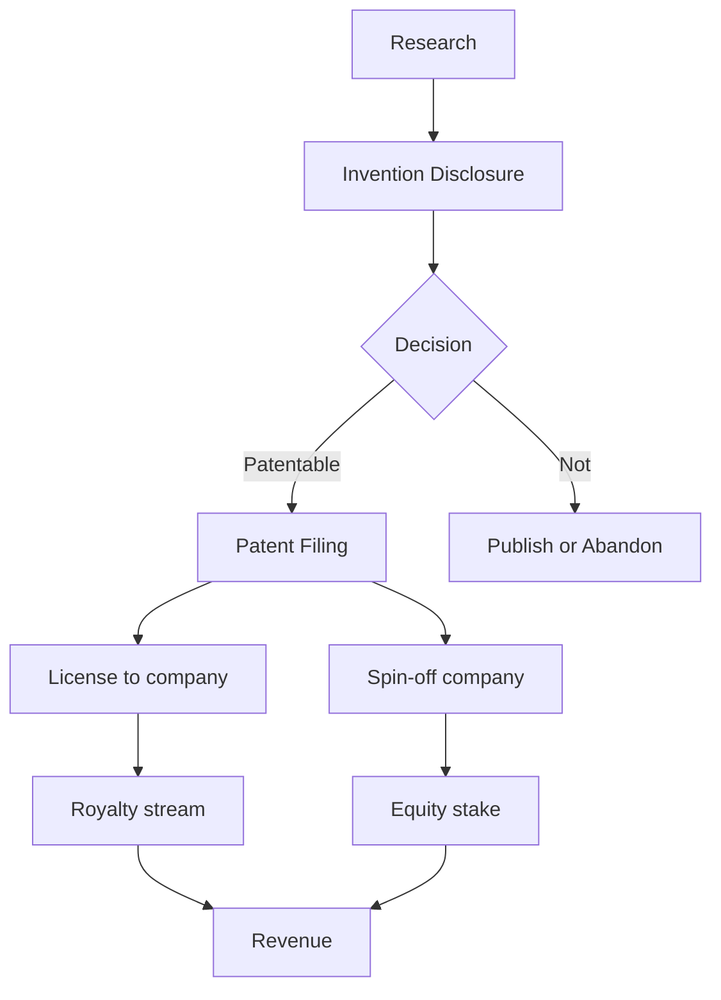
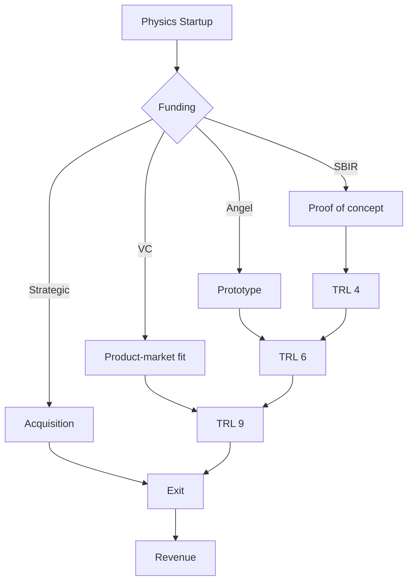
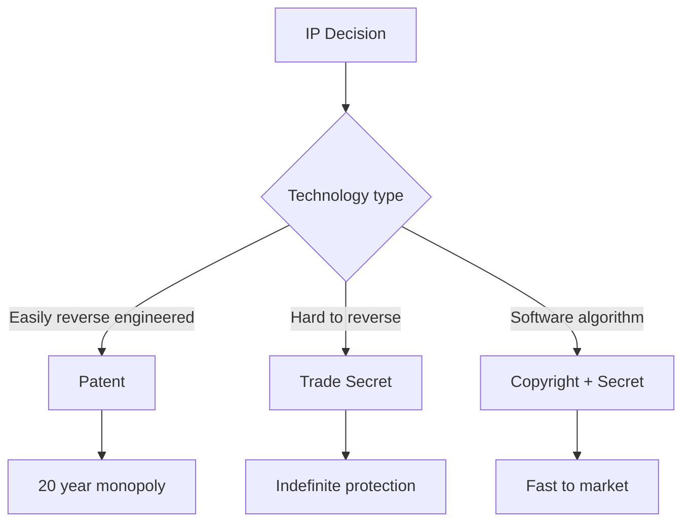
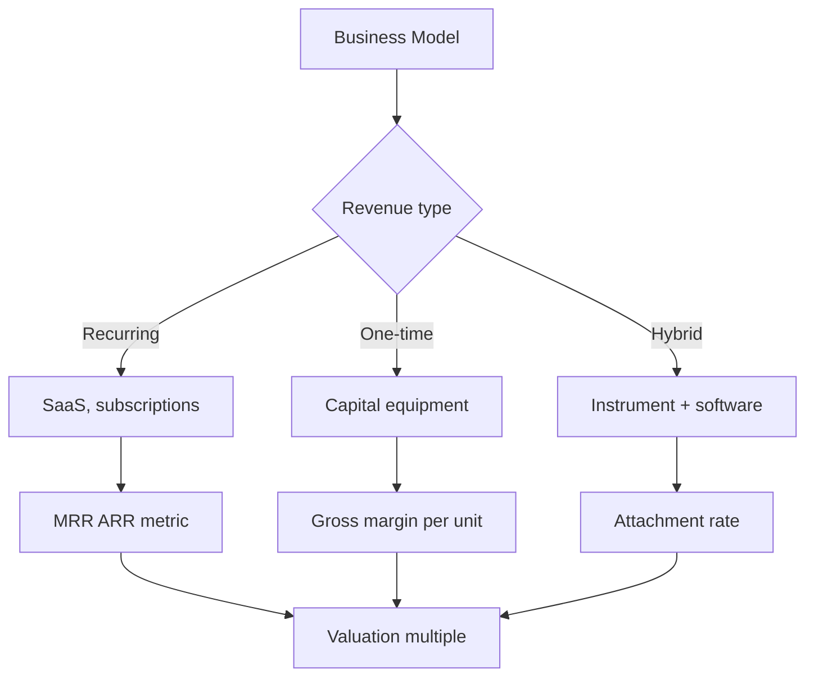
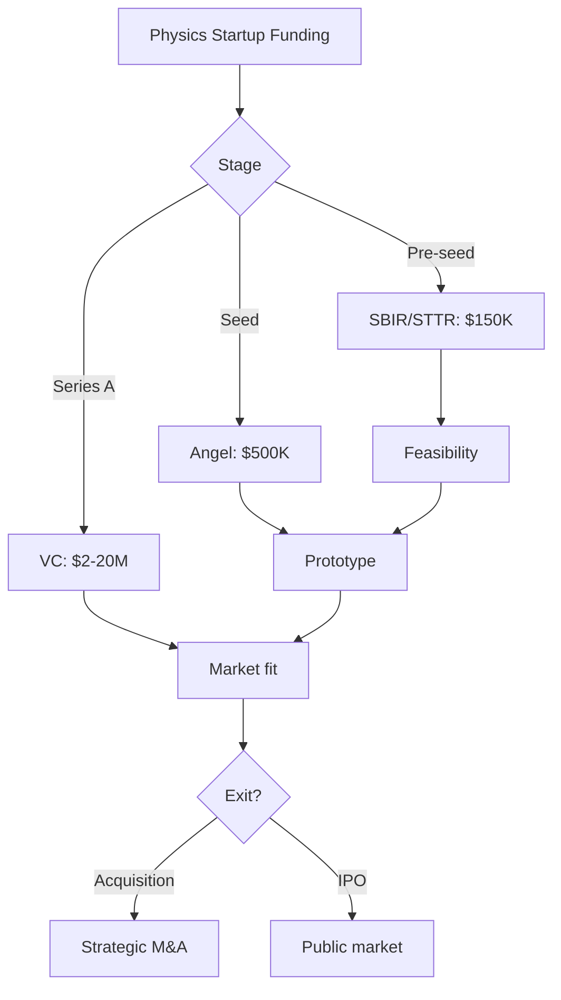
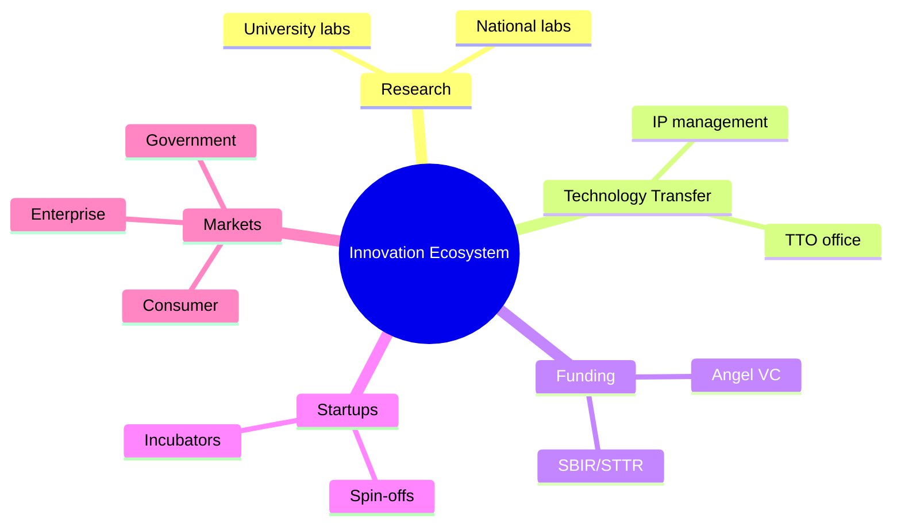
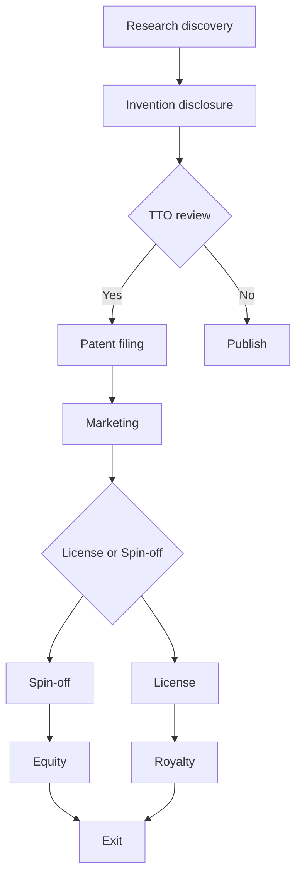
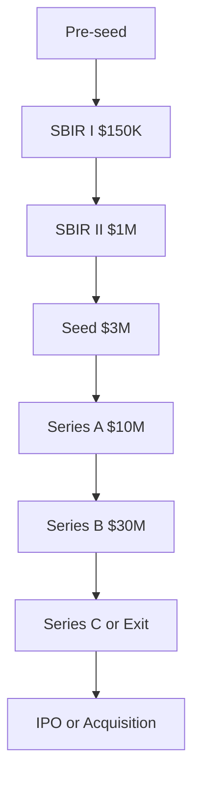
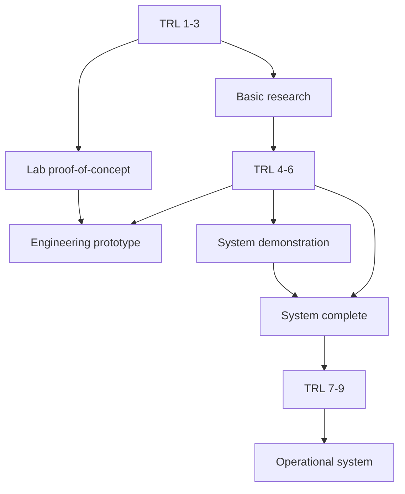
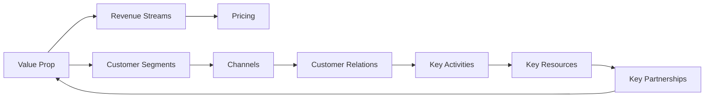

# MSDM 5005 — Innovation in Practice
> **MSc Data-Driven Modeling Core | HKUST MSDM 5005 | Technology Transfer, Entrepreneurship, Impact**  
> **Bilingual 深度自學檔案 · 中英對照**

---

## 問題 1：5 個核心心智模型
**What are the 5 core mental models every expert shares?**

1. **Innovation = science + engineering + business** — 三者缺一不可；deep tech 投資回報週期長（10–15 年），需長期資金（Physics World 2023）
2. **Technology transfer bridges lab and market** — Bayh-Dole Act (1980) 使大學可保留專利所有權（U.S. data: 1996–2017 年超過 14,000 個大學衍生公司）
3. **Valley of death kills most deep tech** — 從實驗室到市場的中間階段缺乏資金；SBIR/STTR grant 是早期關鍵資金來源（AIP Physics Today 2021）
4. **Network effects determine success** — interdisciplinary 團隊和 star commercializer 的協作使技術轉化率高 7.5%（Mack Institute 2019 研究）
5. **IP strategy precedes VC pitch** — 專利申請需在產品上市前完成；TTO 是第一步（AIP Physics Today 2021）

---

## 問題 2：3 個根本分歧
**Where do experts fundamentally disagree?**

1. **Market-pull vs technology-push** — 
   - Market-pull: 基於現有技術改進市場產品；快速但原創性低
   - Technology-push: 新科學發現驅動新市場；慢但破壞性創新

2. **Open science vs proprietary** — 
   - 開放：加速知識傳播、獲得 citations；限制商業化
   - 封閉：專利保護、licensing 收入；延緩科學進步

3. **Deep tech vs software startup** — 
   - Deep tech: 高技術風險，長週期，需專業投資者；固態物理、半導體製程
   - Software: 快速原型，短週期，lean startup；AI、大數據

---

## 問題 3：10 個深度問題
**Generate 10 questions that distinguish deep understanding from memorization**

1. 為什麼 physics startup 的「死亡谷」比 software startup 更危險？分析 deep tech 的資金需求與風險結構。

2. 給定一項大學研究發明，設計 technology disclosure 到 spin-off formation 的完整流程。

3. 為什麼 interdisciplinary team 比單一領域團隊更有可能成功 commercialize？引用 Mack Institute 的實證研究。

4. 解釋 Bayh-Dole Act 如何改變了大學 technology transfer 的生態，並分析其對 HKUST 的影響。

5. 給定專利評估，點樣判斷技術是否具有專利性（novelty + non-obviousness + utility）？

6. 為什麼 SBIR/STTR grant 比 VC 更適合 physics startup 的早期階段？

7. 點樣量化一項 physics technology 的 market size？分析 TAM/SAM/SOM 的計算方法。

8. 為什麼 physics startup 成功通常與 proximity to research hub 有關？引用矽谷和 Boston 的案例。

9. 給定一個 physics technology (e.g., single photon detector)，設計從 research prototype 到 commercial product 的 roadmap。

10. 解釋 technology readiness level (TRL) 如何幫助評估技術成熟度並吸引投資者。

---

## 深入 1：Technology Transfer 流程 (Technology Transfer Process)
**Deep Dive I**

### 完整流程

1. **Research → Invention Disclosure**
   - Inventor 向 TTO (Technology Transfer Office) 提交 disclosure form
   - 評估：novelty, patentability, commercial potential

2. **Patent Application**
   - Patent attorney (specialized in physics/engineering)
   - Timeline: 12–36 months, cost: $15,000–$50,000
   - Claims define scope of protection

3. **Licensing vs Spin-off**
   - Licensing: 許可現有公司使用技術；royalty 通常 1–5%
   - Spin-off: 成立新公司；founder 需要從大學 license IP

4. **Funding Stages**
   - **Pre-seed:** Grants (SBIR/STTR, $150,000–$1M)
   - **Seed:** Angel investors ($500K–$2M)
   - **Series A:** VC ($2M–$20M) for product-market fit

### 關鍵文檔

**Invention Disclosure Checklist:**
- Description of technology
- Prior art search results
- Potential applications
- Related publications
- Funding source (Bayh-Dole compliance)

**Engineering implication:** HKUST Innovation Office 的流程適用於所有 HKUST 研究者。

---

## 深入 2：Physics Startup 案例研究 (Physics Startup Case Studies)
**Deep Dive II**

### 成功案例

| 公司 | 起源 | 技術 | 估值 | 教訓 |
|------|------|------|------|------|
| Intel | Fairchild (Shockley) | CMOS | $100B+ | University-industry pipeline |
| Rigetti | UC Berkeley | Superconducting qubits | $150M | Deep tech + VC + government |
| Quantum Motion | Oxford | Silicon spin qubits | £50M | Academic spinoff |
| Veeco | MIT | MBE instruments | $2B | Instruments > end products |

### 失敗教訓

**Valley of Death 案例:**
- 超導磁鐵公司：技術可行，但 manufacturing cost 太高，無法與低溫競争
- 納米傳感器 startup：demo 成功，但 scalable fabrication 失敗

**關鍵失敗原因：**
1. 技術成熟度不足 (TRL 4 vs TRL 7 needed)
2. 缺乏 manufacturing expertise in founding team
3. 市場規模被高估

### DARPA Model

DARPA 的 funding model 值得借鑒：
- Program manager 驱动，有明確 military use case
- 「delta」funding strategy：資助多個競爭團隊
- 過渡到 commercial 的明確路徑

**Engineering implication:** 物理學家需要了解產品開發和商業化之間的鴻溝。

---

## 深入 3：IP 策略與專利 (IP Strategy & Patents)
**Deep Dive III**

### 專利性要求

| 要求 | 定義 | 物理學例子 |
|------|------|----------|
| Novelty | 申請前無 prior art | 新的量子感測器設計 |
| Non-obviousness | 對普通技術人員非显而易见 | 演算法優化 |
| Utility | 有實際用途 | 紅外成像系統 |
| Written description | 支持 claims 的充分描述 | 方法步驟詳細 |

### 專利策略

**Provisional vs Non-Provisional:**
- Provisional: $1,600 (US)，12 個月臨時保護，不需 claims
- Non-Provisional: 正式申請，需 claims，$15,000+

**Patent Portfolio:**
- Core patent: 基礎發明
- Continuation: 擴展保護範圍
- International (PCT): 72 個月內進入各國

### Trade Secrets vs Patents

| | Patents | Trade Secrets |
|--|--------|-------------|
| Duration | 20 years from filing | Indefinite |
| Cost | $15,000–$50,000+ | Low |
| Protection | Requires disclosure | Requires secrecy |
| Reverse engineering | Allowed | Protected |
| Enforcement | Easier | Harder |

**Physics examples:** Fabless semiconductor design (patents); quantum computing algorithms (trade secrets)

**Engineering implication:** 量子計算軟件通常用 trade secrets 而非專利保護。

---

## 深入 4：Market Analysis 與商業模式 (Market Analysis & Business Models)
**Deep Dive IV**

### 市場規模分析

**TAM/SAM/SOM Framework:**
- **TAM:** 總可尋址市場 = 全球對量子計算感測器的所有需求
- **SAM:** 服務可達到的市場 = 醫學成像市場
- **SOM:** 可實際獲得的市場 = 5 年內滲透的細分市場

### Physics Technology 市場

| 領域 | TAM | 增長率 | 主要公司 |
|------|-----|--------|---------|
| 量子計算硬件 | $65B (2035) | 37% CAGR | IBM, Google, IonQ |
| 紅外成像 | $30B (2030) | 12% CAGR | FLIR, L3Harris |
| 半導體製程設備 | $100B | 8% CAGR | ASML, Applied Materials |
| 先進顯微鏡 | $15B | 7% CAGR | Zeiss, Thermo Fisher |

### 商業模式

| 模式 | 例子 | Revenue |
|------|------|---------|
| Product | 紅外相機 | 一次性銷售 |
| SaaS | 雲端量子模擬 | 訂閱 |
| Licensing | 專利許可 | Royalty |
| Service | 顧問服務 | 小時費 |

### Unit Economics

**物理儀器公司的關鍵指標：**
- Gross margin: > 50% (儀器), > 70% (軟件)
- Revenue per employee: $150K–$500K
- 銷售週期: 6–18 個月（企業）vs 3–6 個月（研究機構）

---

## 深入 5：Funding Strategy 與 Pitch Deck (Funding Strategy)
**Deep Dive V**

### SBIR/STTR Grant

**Phase I ($150,000–$250,000, 6–12 months):**
- 證明技術可行性
- 目標：提交 Phase II 申請

**Phase II ($1M–$1.5M, 2 years):**
- 產品開發
- 目標：原型演示

**Phase III ($ varies):**
- Commercialization (no NSF funding; use private or strategic investment)

### VC Pitch Deck 結構

**Must-have slides (10 minutes):**
1. **Problem** — 現有解決方案的不足
2. **Solution** — 你的 physics technology
3. **Market** — TAM/SAM/SOM
4. **Business model** — 如何貨幣化
5. **Traction** — 現有客戶/合作/IP
6. **Competition** — 你的 moat (物理學壁壘)
7. **Team** — 技術 + 商務 co-founders
8. **Financials** — 5 年預測
9. **Use of funds** — 這輪資金用途
10. **Ask** — 估值和份額

### Deep Tech 的特殊考量

**Physics Moat:**
- 專利組合 (core + continuation)
- 獨家材料/設備來源
- 核心團隊的多年經驗

**Due Diligence for Physics Startups:**
- 技術驗證獨立方覆核
- 製造可擴展性分析
- 市場採用障礙評估

**Engineering implication:** Physics 創業者需要同時展示深厚的技術能力和商業思維。

---

## 自測 1：Bayh-Dole 影響
**分析 Bayh-Dole Act (1980) 如何改變了美國大學 technology transfer 的生態。**

**Answer / 解答:**
Bayh-Dole 允許大學保留由聯邦資助發明的專利所有權，並從 licensing 中獲得收入。

**Before 1980:**
- 政府擁有專利所有權
- 商業化意願低（無激勵）
- 技術轉化率極低

**After 1980:**
- 大學可 license 給公司
- Royalty 收入激勵大學投入 TTO
- 結果：1996–2017 年超過 14,000 個大學衍生公司

**Key metrics:**
- 2019 年：大學持有 ~50,000 個有效專利
- Licensing revenue: ~$2B/年
- 最成功的 licensing: Google (Stanford) — 專利估值 > $300B

**Engineering implication:** 香港的 InnoHK 和 Technology Transfer Office 正在借鑒 Bayh-Dole 模式。

---

## 自測 2：SBIR 申請策略
**設計一個面向量子感測器 startup 的 SBIR Phase I 申請策略。**

**Answer / 解答:**
**Topic selection:** NSF/SBIR: Quantum Sensing (topic code: QS)

**Phase I 申請重點：**
1. **Commercial potential:** 量子感測器用於醫學成像，市場 $5B+
2. **Innovation:** 基於 NV center 的納米磁力計，sensitivity < 1 nT/√Hz
3. **Feasibility:** 已在實驗室驗證原理

**Budget ($250,000, 12 months):**
- Personnel: $150K (postdoc + PI)
- Equipment: $50K (RF electronics)
- Materials: $30K
- Travel: $20K (customer discovery)

**Deliverables:**
- 原型感測器
- 與 3 家製藥公司的 Letter of Intent
- Phase II commercial plan

**Engineering implication:** SBIR 是美國 deep tech startup 的最重要早期資金來源。

---

## 自測 3：TRL 評估
**評估基於二維材料的紅外探測器技術處於哪個 TRL 等級。**

**Answer / 解答:**
| TRL | 定義 | 本案例 |
|-----|------|-------|
| TRL 1 | 基本原理觀察 | 2D材料的紅外響應已報道 |
| TRL 2 | 技術概念形成 | 已提出探測器概念 |
| TRL 3 | 實驗驗證概念 | 實驗室 proof-of-concept 完成 |
| TRL 4 | 組件/電路驗證 | 探測器與讀出電路集成 |
| TRL 5 | 組件在相關環境驗證 | 在實驗室條件下測試 |
| TRL 6 | 系統原型演示 | 演示模型達到規格 |
| TRL 7 | 系統完成並準備好部署 | 工程原型 |
| TRL 8 | 系統完成並認證 | 通過可靠性測試 |
| TRL 9 | 系統已通過作战部署驗證 | 商業產品 |

典型 2D 紅外探測器目前處於 TRL 4–5。

**Engineering implication:** 投資者通常要求 TRL 6+ 才會考慮 Series A。

---

## 自測 4：IP Portfolio 評估
**評估一個光纖量子密鑰分發 (QKD) startup 的專利組合價值。**

**Answer / 解答:**
**Core patents (Essential):**
- QKD protocol implementation (BB84, E91)
- Single photon source
- 評估：blockade position，無法繞過

**Continuation patents (Defensive):**
- 集成光子學實現
- 錯誤校正算法
- 評估：擴展保護範圍

**评估方法：**
- **Cost approach:** 研發成本 × 重置因子 = $2M
- **Market approach:** Comparable licensing deals × royalty rate = $5–$10M
- **Income approach:** NPV of future royalties = $8M

**IP Strengths:**
- 核心專利在美國、歐洲、中國都已授權
- Patent landscape 顯示無明顯繞過方案
- 與主要電信運營商的 licensing談判

**Engineering implication:** IP valuation 是 pitch deck 和 M&A談判的核心。

---

## 自測 5：Market Sizing
**計算量子計算硬件的 2035 年市場規模並評估香港 startup 的潛在份額。**

**Answer / 解答:**
**TAM 計算:**
- 全球 IT 市場：$5T
- 量子計算渗透假設：1.3%
- **TAM 2035: ~$65B**

**SAM (基於可行應用):**
- 金融建模 + 藥物發現 + 優化: $20B

**SOM (香港 startup, 假設):**
- 矽谷/波士頓/中國競爭激烈
- 香港優勢：學術合作 (HKUST, CUHK)
- SOM: $100M (5 年內可達)

**CAGR 估算:**
- 2024: $500M
- 2030: $8B
- 2035: $65B
- CAGR: ~37%

**Engineering implication:** 量子計算是 TAM 最大的 physics technology 市場之一。

---

## 自測 6：Founding Team 組建
**分析一個成功的 physics startup founding team 需要哪些關鍵角色。**

**Answer / 解答:**
**Must-have roles:**
1. **Technical founder** — PhD in relevant physics, 5+ years research
2. **Business co-founder** — MBA or 5+ years industry experience
3. **Engineering lead** — 10+ years product development

**Advisory board:**
- Academic advisor (TRL guidance)
- Industry advisor (customer introductions)
- Legal advisor (IP, contracts)

**Research (Mack Institute 2019):**
- Interdisciplinary team: +30% success rate
- Prior collaboration with star entrepreneur: +7.5% commercialization rate

**Venture capital priorities:**
1. Team (40% weight)
2. Market size (25%)
3. Technology moat (20%)
4. Business model (15%)

**Engineering implication:** Physics founder 需要學習 business skills 或找 business co-founder。

---

## 自測 7：Valley of Death 橋接
**設計一個 bridge funding 策略來穿越 physics startup 的 valley of death。**

**Answer / 解答:**
**Funding timeline:**
| 階段 | 資金來源 | 金額 | 用途 |
|------|---------|------|------|
| 0–12 月 | SBIR Phase I + 大學 proof-of-concept fund | $300K | 原理驗證 |
| 12–24 月 | SBIR Phase II + HK Innovation vouchers | $1.2M | 原型 |
| 24–36 月 | Angel + strategic investor | $3M | Beta customers |
| 36–60 月 | Series A | $10M | Scale |

**關鍵 milestone:**
- TRL 4: 原理驗證 → 申請 SBIR Phase I
- TRL 6: 實驗室原型 → 申請 Phase II
- TRL 7: 工程原型 → VC pitch

**Bridge funding 來源:**
- HK Science Park technology park programs
- Innovation and Technology Fund (ITF)
- Corporate venture arms (e.g., Roche, Siemens)

**Engineering implication:** Valley of death 通常在 $500K–$2M 之間，需要 bridge funding。

---

## 自測 8：Competition Analysis
**用 Porter's Five Forces 分析量子感測器市場的競爭結構。**

**Answer / 解答:**
| Force | 強度 | 分析 |
|--------|------|------|
| 現有競爭者 | Medium | IBM, Google, IonQ 都有量子感測項目 |
| 新進入者威脅 | High | 學術spin-off 容易進入 |
| 替代品威脅 | Medium | 傳統光學感測器仍是主流 |
| 供應商議價能力 | Low | 設備供應商多 |
| 客戶議價能力 | High | 大型製藥公司有談判力 |

**Moat 策略:**
1. **專利壁壘：** 核心 protocol patents
2. **時間壁壘：** First-mover advantage + customer relationships
3. **規模壁壘：** 製造 cost reduction 隨 volume

**Engineering implication:** 量子感測器市場仍處於早期，競爭壁壘尚未形成，是進入的好時機。

---

## 自測 9：Exit Strategy
**評估 physics startup 的各種退出策略。**

**Answer / 解答:**
| 退出方式 | 可能性 | 時間線 | Multiple |
|---------|--------|--------|---------|
| Acquisition (strategic) | High | 5–8 年 | 3–10× revenue |
| Acquisition (PE) | Medium | 7–10 年 | 2–5× revenue |
| IPO | Low (<5%) | 10+ 年 | 10–50× revenue |
| Buyout | Medium | 5–7 年 | 2–5× revenue |

**Strategic acquirers for physics startups:**
- 半導體：Intel, TSMC, ASML
- 製藥：Roche, Pfizer (sensing for drug discovery)
- 軍工：Raytheon, Lockheed (sensing, imaging)
- 儀器：Thermo Fisher, Zeiss

**Acquisition metrics:**
- Deep tech acquisition 通常基於 technology value，而非 revenue multiples
- Strategic premium: 20–50% over market

**Engineering implication:** 大多數 physics startup 的最佳退出是戰略收購而非 IPO。

---

## 自測 10：Physics Impact Assessment
**設計一個框架來評估 physics technology 的社會影響力。**

**Answer / 解答:**
**Impact dimensions:**
1. **Scientific impact:** Citations, enabling new research directions
2. **Economic impact:** Jobs created, revenue generated, cost reduction
3. **Social impact:** Healthcare outcomes, environmental benefits
4. **Security impact:** Strategic technology independence

**Assessment framework:**

| Technology | 应用 | 量化影響 |
|-----------|------|---------|
| Quantum sensors | Medical imaging | $1B healthcare savings (5 yr) |
| NV centers | 量子磁力計 | Early disease detection |
| 2D materials | Flexible electronics | $10B market by 2030 |

**SDG alignment:**
- Goal 3 (Health): Medical imaging sensors
- Goal 7 (Clean energy): Solar cell efficiency
- Goal 9 (Innovation): Deep tech infrastructure

**Engineering implication:** Impact assessment 有助於 grant 申請和 PR 材料。

---

## 📊 Diagram 1: Innovation Ecosystem

## 📊 Diagram 2: Technology Transfer Process

## 📊 Diagram 3: Funding Journey

## 📊 Diagram 4: TRL Framework

## 📊 Diagram 5: Business Model Canvas

---

## 深度總結 Deep Insights Summary

1. **Deep tech innovation requires a 10–15 year horizon** — physics startup 的回報週期比 software 長得多，需要 patient capital 和長期願景。

2. **Technology transfer is a learnable process** — 從 invention disclosure 到 spin-off formation 有清晰的路徑；HKUST Innovation Office 提供了系統支持。

3. **IP strategy precedes business strategy** — 在 pitch to investors 之前，patent portfolio 必須到位以建立技術壁壘。

4. **Network effects and interdisciplinary teams drive success** — Mack Institute 研究顯示跨學科團隊和 star commercializer 的網絡顯著提高 commercialize 成功率。

5. **Valley of death is survivable with the right funding** — SBIR/STTR 和 strategic grants 是穿越死亡谷的關鍵橋梁。

---

**自學建議**  
- 必讀: "Crossing the Valley of Death" (AIP Science Accelerator); MIT Innovation Initiative resources  
- 配對: HKUST Innovation Office workshops; Y Combinator Startup Library  
- 工具: Canva (pitch deck), Pitch.com, Crunchbase (competitive landscape)  
- 產出: Complete a full technology transfer plan for your research project; pitch deck for hypothetical physics startup
