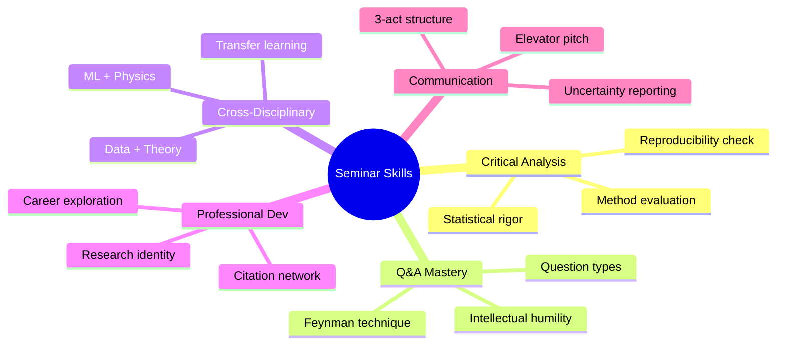
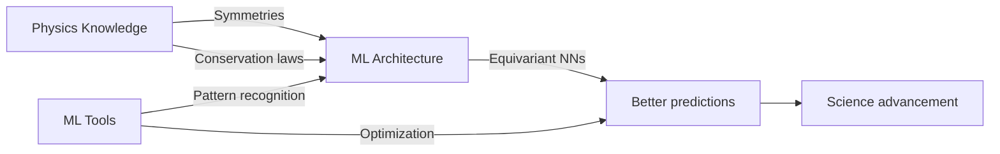
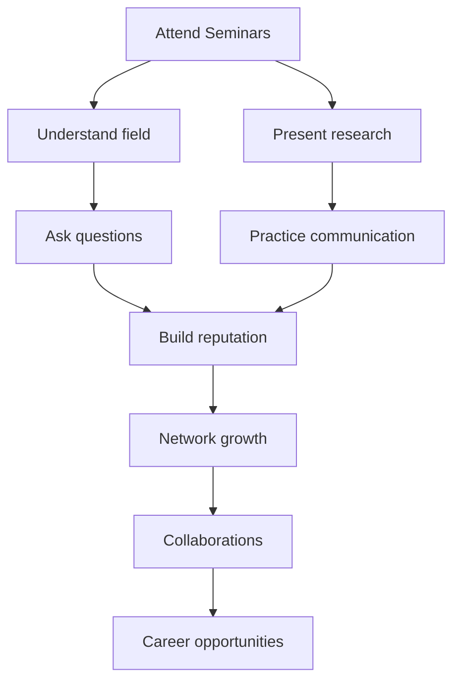
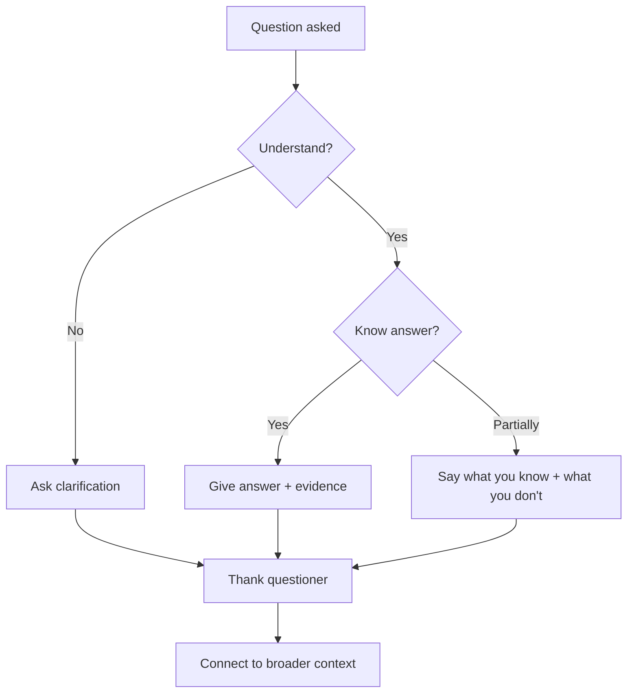

# MSDM 6771 — MSc Physics Seminars
> **MSc Data-Driven Modeling Core | HKUST MSDM 6771 | Research seminars, scientific communication, critical discourse, professional development**  
> **Bilingual 深度自學檔案 · 中英對照**

---

## 問題 1：5 個核心心智模型

1. **Research seminars are compressed epistemic encounters** — a 45-minute talk compresses months/years of work; your job is to extract the essential knowledge transfer (Knorr-Cetina 1999, *Epistemic Cultures*)
2. **Critical discourse advances understanding** — Q&A is where real scientific thinking happens; asking the right question reveals depth of knowledge (Merton 1942, *CUDOS norms*)
3. **Scientific credibility is earned through transparent method** — reproducibility, open data, and rigorous uncertainty quantification are the currencies of modern science (Nosek et al. 2015, *Science*)
4. **Disciplinary boundaries are dissolving** — data-driven physics requires fluency in physics + statistics + computing; the MSc seminar exposes you to this breadth (LsdNM 2021, *Nature Physics*)
5. **Professional identity develops through community participation** — attending, asking questions, presenting, and networking at seminars shapes you as a scientist (Lave & Wenger 1991, *Situated Learning*)

---

## 問題 2：3 個根本分歧

1. **Frontier science vs established consensus talks**
   - Frontier: high uncertainty, speculative, exciting (e.g., room-temperature superconductivity claims 2023)
   - Consensus: well-tested framework, incremental progress (e.g., standard model tests, gravitational wave astronomy)
   - Both are necessary: frontier challenges drive paradigm shift; consensus builds cumulative knowledge

2. **Theory vs experiment vs computation in seminars**
   - Theory: mathematical elegance, symmetry-based reasoning, predictions (e.g., Dirac's prediction of antimatter)
   - Experiment: precision measurement, systematic uncertainty, controls (e.g., KATRIN neutrino mass bound)
   - Computation: simulation, data-driven discovery, surrogate models (e.g., neural network for DFT)

3. **Depth vs breadth in scientific communication**
   - Deep: few slides, many equations, assumes expertise (typical for group meetings)
   - Broad: more context, fewer details, accessible to adjacent fields (typical for colloquia)
   - Target audience determines the right balance

---

## 問題 3：10 個深度問題

1. 給定 seminar speaker presents data with $3\sigma$ excess claiming discovery, 點樣提出關鍵問題？discuss statistical threshold, trials factor, systematic uncertainties。

2. 為什麼 asking questions in seminars helps your OWN research? 解釋 social learning theory 和 epistemic benefit of active engagement。

3. 給定 speaker uses a complex model with many parameters, 點樣 question overfitting vs physical justification?

4. 解釋為什麼 "beauty" 或 "elegance" 唔係 scientific justification — compare Dirac's elegance vs Ptolemy's epicycles。

5. 為什麼 research seminars 通常比 lecture courses 更有效地建立 conceptual understanding? 討論 active vs passive learning。

6. 給定 talk about Bayesian inference in physics, 點樣 compare Bayesian vs frequentist interpretations in Q&A?

7. 解釋 scientific presentation 的「金髮女孩原則」— 太多 technical detail vs 太少 — 並給出具体衡量標準。

8. 為什麼 cross-disciplinary seminars (e.g., ML + physics) 特别有价值但也特别难懂? 討論 transfer learning 和 conceptual bridging。

9. 給定 conflicting results from two experiments, 點樣在 Q&A 中提出 constructive question?

10. 為什麼 seminar attendance 係 PhD admissions 和 postdoc hiring 的隐性考核標準?

---

## 深入 1：Critical Analysis of Physics Seminars
**Deep Dive I**

### The Anatomy of a Great Physics Talk

**Structure (adapted from Anson & Poole 2020):**

| Section | Time | Purpose | Physics Example |
|---------|------|---------|----------------|
| Hook | 1 min | Why should I care? | "Einstein was wrong about black holes" |
| Context | 5 min | What is known? | Gravitational wave history |
| Gap | 2 min | What is missing? | No direct detection |
| Method | 8 min | How did you find out? | LIGO interferometry |
| Results | 10 min | What did you find? | SNR, masses, significance |
| Implications | 5 min | So what? | New era of GW astronomy |
| Future | 2 min | What's next? | LISA, next science |
| Q&A | 15+ min | Challenges | Systematics, alternatives |

### Evaluating a Physics Talk (Critical Checklist)

**Data quality:**
- [ ] Error bars shown? $\sigma$ or systematic only?
- [ ] Resolution vs accuracy distinguished?
- [ ] Sample size sufficient? (power analysis reported?)
- [ ] Controls adequate?

**Method quality:**
- [ ] Physical assumptions stated?
- [ ] Model validated against independent data?
- [ ] Sensitivity analysis performed?
- [ ] Code/data publicly available?

**Statistical quality:**
- [ ] Pre-registration? (or post-hoc?)
- [ ] $p$-value or Bayesian credible interval?
- [ ] Trials factor accounted for?
- [ ] Effect size reported (not just $p < 0.05$)?

### Famous Physics Talks: What Made Them Great?

**Feynman's "Surely You're Joking, Mr. Feynman" (QED lectures):**
- Physical intuition over mathematical formalism
- $P(\text{reflection}) = |f|^2$ with no derivation → immediate understanding
- Laughter in the room = engagement

**Dirac's "The Evolution of the Physicist's Picture of Nature" (1963):**
- Single theme: beauty in physics → mathematical elegance as guide
- "It is more important to have beauty in one's equations than to have them fit experiment"

**Engineering implication:** Great talks connect physical intuition to mathematical formalism.

---

## 深入 2：Statistical Rigor in Seminar Evaluation
**Deep Dive II**

### The $5\sigma$ Standard in Physics

In particle physics, a "discovery" requires:
$$p < 3.5 \times 10^{-7} \quad (5\sigma)$$

Why so stringent?
- Thousands of analysis channels tested
- Trials factor: if $m$ channels, significance reduced by $\sqrt{m}$
- Higgs search: 1000+ final states → $5\sigma$ needed for global significance

**Seminar application:** When a speaker claims "we see evidence at $3\sigma$," ask:
1. How many channels did you test?
2. What is the global significance after trials correction?
3. Has another experiment confirmed this?

### Statistical Red Flags in Talks

| Red Flag | Question to Ask |
|----------|----------------|
| $p = 0.03$ claimed as discovery | How many tests? Is pre-registered? |
| Error bars not shown | What is the uncertainty? |
| Model with 20+ parameters | How was model selection done? |
| Results without uncertainty | Is this a measurement or a guess? |
| Comparison to theory without experiment | Can both be wrong? |

### Bayesian vs Frequentist in Q&A

**Speaker uses Bayesian credible interval:**
- Ask: "What prior did you use? Is the result prior-sensitive?"
- Ask: "How did you verify posterior? MCMC diagnostics?"

**Speaker uses frequentist confidence interval:**
- Ask: "What is the coverage probability? Does your interval cover the true value 95% of the time?"
- Ask: "Have you done a calibration study?"

**Example — Neutrino mass:**
- Bayesian 95% CI: $m_\nu < 0.8$ eV (with neutrino oscillation priors)
- Frequentist limit: $m_\nu < 0.9$ eV (same data)
- Difference = prior choice matters for upper limits

**Engineering implication:** Statistical literacy is essential for evaluating any physics claim.

---

## 深入 3：Cross-Disciplinary Research Seminars
**Deep Dive III**

### The Emerging Data-Driven Physics Landscape

| Domain | Core Physics | Data/Computing Tools |
|--------|-------------|----------------------|
| Machine learning for physics | Symmetries, conservation laws | Neural networks, diffeomorphism |
| Physics-informed ML | PDEs, Lagrangian mechanics | PINNs, HNNs |
| Data-driven astronomy | Stellar/galactic evolution | Gaia, LSST, JWST |
| Quantum computing | Many-body physics | Qiskit, Cirq |
| Climate science | Fluid dynamics, radiation | GCMs, ML emulation |

### Key Papers for Each Domain

**Physics-informed neural networks (PINNs):**
Raissi et al. (2019, *JCP*): Encode physics as soft constraint:
$$\mathcal{L} = \mathcal{L}_{data} + \lambda \mathcal{L}_{PDE}$$
Applied to: Schrödinger, Navier-Stokes, Maxwell equations.

**Neural network quantum states (Neural Quench):**
Carleo & Troyer (2017, *Science*): Variational Monte Carlo with neural network ansatz:
$$|\psi(\theta)\rangle = \text{NN}(\theta) |\psi_0\rangle$$
Solving quantum many-body ground state problem.

**Graph neural networks for particle physics:**
Battagli et al. (2023): GNN for jet tagging at LHC; achieves $O(1)$ scaling with jet multiplicity.

### Transfer Learning Between Domains

**Core principle:** Physical symmetries (translation, rotation, parity) can be encoded as architectural biases:
$$u(\mathbf{x}) \to u(R\mathbf{x} + t) \implies \text{Equivariant layers}$$

**Example — SE(3) transformer for molecules:**
$$f_{rot}(T \cdot x) = T \cdot f(x), \quad \forall T \in SO(3)$$

Applied to: protein folding (AlphaFold), molecular dynamics, crystallography.

**Engineering implication:** The most impactful research sits at domain intersections.

---

## 深入 4：Research Communication for Physicists
**Deep Dive IV**

### The 3-Act Structure for Physics Presentations

**Act 1: The Setup (30%)**
- Hook: A compelling question or surprising fact
- Context: What does the audience already know?
- Gap: What is missing from current knowledge?

**Act 2: The Journey (50%)**
- Method: What did you do and why?
- Results: Show the data — let the numbers speak
- Interpretation: What do these results mean?

**Act 3: The Resolution (20%)**
- Implications: How does this change our understanding?
- Future: What comes next?
- Call to action: How can the audience help/contribute?

### The Feynman Technique for Q&A

When asked a difficult question in Q&A:

1. **Restate the question** — confirms understanding
2. **State what you know** — demonstrate knowledge
3. **State what you don't know** — intellectual honesty
4. **Offer a path forward** — "That's a great question I haven't fully considered, but here's my initial thinking..."

**Example:**
> Q: "How does your model handle boundary conditions?"
> A: "Great question. Our current model assumes periodic boundaries, which limits us to studying bulk properties. We chose this to isolate the effect we're studying, but extending to realistic boundaries is a key next step that we're actively working on."

### Elevator Pitch Formula

$$30\ seconds = 75\ words = 1\ message$$

Template:
1. What do you study? (10 words)
2. What is the problem? (15 words)
3. What did you find? (20 words)
4. Why does it matter? (15 words)
5. What do you want? (15 words)

**Physics example:**
> "I study stellar evolution using Gaia satellite data. We're trying to understand how binary star interactions affect white dwarf masses. We found a 15% correction to the mass-radius relation that affects supernova predictions. This matters for precision cosmology. I'm looking for collaborators in binary star theory."

**Engineering implication:** Communication is a skill that, like physics, improves with deliberate practice.

---

## 深入 5：Professional Development Through Seminars
**Deep Dive V**

### Building a Research Identity

**The 3-level model (Gee 2000):**
1. **Level 1 — "Fidelity":** Master established knowledge (pass exams, reproduce results)
2. **Level 2 — "Achievement":** Contribute new knowledge (original research)
3. **Level 3 — "Innovation":** Change the field (paradigm shift)

Seminars accelerate movement through all three levels:
- Attending: builds Level 1 knowledge
- Presenting: practices Level 2 communication
- Networking: exposes Level 3 opportunities

### The Citation Network of Your Career

**Citation metrics (Hirsch 2005):**
$$h = \max\{h : \sum_{i=1}^h C_i \geq h^2\}$$

| h-range | Career stage | Goal at this stage |
|---------|-------------|-------------------|
| 0–5 | Early MSc | Publish first paper |
| 5–15 | Late MSc / early PhD | Establish niche |
| 15–40 | Postdoc | Build reputation |
| 40–100 | Senior academic | Field leader |
| 100+ | Nobel tier | Paradigm creator |

**Building your citation network:**
1. Co-authorship (highest signal — mutual investment)
2. Citation (acknowledgment of influence)
3. Conference Q&A (personal contact)
4. Twitter/academic social media (emerging)

### Seminar as Career Planning Tool

**Attend seminars in fields you're considering:**
- Astrophysics: Are you excited by 10-year timescales?
- Condensed matter: Does lab work suit you?
- Data science: Are you comfortable with uncertainty?
- Finance: Is quantitative modeling interesting?

**Questions to ask after each seminar:**
1. What would it take for me to do research like this?
2. What are the career paths from this field?
3. What do people in this field love/hate about their work?
4. How would my skills transfer here?

**Engineering implication:** Every seminar is a career exploration opportunity.

---

## 自測 1：Seminar Evaluation
**Evaluate the following claim from a seminar: "We observe a 3σ excess in our data, consistent with a dark matter signal."**

**Answer:**
**Ask these critical questions:**
1. **"How many analysis channels did you test?"** (Trials factor — if 100 channels, $3\sigma$ local → < 2σ global)
2. **"What is the look-elsewhere effect correction?"** (How much did you penalize for multiple testing?)
3. **"What are the dominant systematic uncertainties?"** (Background modeling? Detector effects?)
4. **"Has another experiment confirmed or contradicted this?"** (Independent verification required)
5. **"What is the physical model you're claiming? Is there an alternative astrophysical explanation?"** (Pulsars? Cosmic rays?)
6. **"Where is the data and analysis code?"** (Reproducibility = credibility)

**Statistical context:** $3\sigma$ in particle physics is "evidence" but not "discovery." Discovery requires $5\sigma$ ($p < 3.5 \times 10^{-7}$). In astrophysics, the standard is similar.

**Engineering implication:** A critical questioner protects the integrity of scientific discourse.

---

## 自測 2：Asking the Right Question
**What is the difference between a good and a great question in Q&A?**

**Answer:**
| Question Type | Example | Impact |
|----------------|---------|--------|
| **Clarifying** | "What was your control group?" | Shows you followed the talk |
| **Probing** | "How does your model handle selection effects?" | Shows critical thinking |
| **Extending** | "Could this method apply to X?" | Shows intellectual reach |
| **Challenging** | "If you exclude the outlier data points, does the result hold?" | Shows statistical rigor |
| **Synthesizing** | "How does this change the consensus picture?" | Shows big-picture thinking |

**Great question characteristics:**
1. Specific (references figure, section, equation)
2. Answerable (could actually be answered)
3. Charitable (assumes good faith unless evidence otherwise)
4. Constructive (advances discourse)

**Physics example:**
> "In your Figure 3, the error bars appear asymmetric. Can you explain whether this reflects physical asymmetry in the process or systematic uncertainty in the measurement? And does your conclusion change if you use the symmetric error approximation?"

**Engineering implication:** Great questions accelerate collective understanding.

---

## 自測 3：Statistical Rigor in Q&A
**Speaker presents a neural network model that achieves 95% accuracy on test set. What do you ask?**

**Answer:**
1. **"What is the test set size and how was it split?"** (Avoid overfitting; typical 80/20 train/test)
2. **"How did you avoid data leakage between train and test?"** (Time series: don't use future data to predict past)
3. **"What is the baseline? Random guessing?"** (For 10-class problem, 10% is random)
4. **"Have you done cross-validation?"** (K-fold to check robustness)
5. **"What are the 5% failures? Are they physically meaningful?"** (Pattern in failures may reveal physics)
6. **"Is this a physics-informed model or pure black box?"** (Physical constraints improve extrapolation)
7. **"How does it extrapolate beyond the training distribution?"** (Critical for scientific application)

**Physics context:** 95% accuracy in stellar classification means 5% misclassification — is this acceptable for scientific inference? What is the cost of a wrong classification?

**Engineering implication:** Accuracy alone is insufficient; robustness, interpretability, and physical validity matter.

---

## 自測 4：Cross-Disciplinary Communication
**How do you ask a productive question when the talk combines ML + physics and you only know one field?**

**Answer:**
**Step 1: Identify what you DO understand**
- If physics background: focus on physical interpretation of ML outputs
- If ML background: focus on whether the physics constraint is correctly encoded

**Step 2: Ask from your expertise**
- ML person to physics talk: "How did you encode the conservation laws? What happens if the network violates them?"
- Physics person to ML talk: "What physical assumption drives this result? What if that assumption is wrong?"

**Step 3: Ask for clarification from non-expertise**
- "Can you explain in physical terms what the network has learned?"
- "What would you expect the ML to do if the physics changed?"

**Physics + ML example:**
Speaker: "We trained a GNN to predict molecular energies."
Your question: "How does the network handle molecules with composition outside the training set? Does it extrapolate physically (e.g., energy increases with electron count) or does it fail?"

**Engineering implication:** Cross-disciplinary questions advance fields precisely because they come from outside the paradigm.

---

## 自測 5：Constructive Criticism in Q&A
**A speaker claims a result that conflicts with a paper published last year. How do you ask about this?**

**Answer:**
**Option 1 (Direct but collaborative):**
> "I noticed your result disagrees with Paper X (2023). They found $A = 10.3 \pm 0.2$ while you find $A = 11.1 \pm 0.3$. Can you explain the key differences in methodology that account for this discrepancy? I think understanding this would help the audience appreciate both results."

**Option 2 (Through the chair):**
> "The speaker's result differs from prior work. Perhaps the speaker could address this in the discussion?"

**Why Option 1 is better:**
- Directly addresses the conflict
- Shows you know the literature
- Invites collaboration rather than confrontation
- Helps the whole audience understand the discrepancy

**Key principle:** Challenge the result, not the person. Science advances through disagreement, but tone matters.

**Engineering implication:** Professional discourse accelerates scientific progress.

---

## 自測 6：Presenting Uncertainty
**How do you decide what uncertainty to show in a physics presentation?**

**Answer:**
**Rule 1: Show total uncertainty (stat + sys combined)**
$$u_{total} = \sqrt{u_{stat}^2 + u_{sys}^2}$$

Unless the two are comparable in size, in which case report both separately.

**Rule 2: Show confidence intervals, not just central values**
$$x = 10.3 \pm 0.2\ (\text{stat}) \pm 0.1\ (\text{sys})$$

**Rule 3: Use meaningful precision**
- $10.3 \pm 0.2$ has meaningful precision
- $10.300 \pm 0.200$ is misleading precision
- $\Delta x / x < 2\%$ means report to 1% precision

**Rule 4: Compare to prior measurements**
If previous result: $10.0 \pm 0.3$
Your result: $10.3 \pm 0.2$
Tension: $|10.3 - 10.0| / \sqrt{0.2^2 + 0.3^2} = 0.3/0.36 = 0.83\sigma$ → not significant tension

**Engineering implication:** Transparent uncertainty reporting builds credibility.

---

## 自測 7：Networking at Seminars
**You want to follow up with a speaker whose work is closely related to yours. What do you do?**

**Answer:**
**Before leaving the seminar:**
1. Write down the one thing you found most interesting
2. Note one question you would ask if you had more time
3. Get their email or find them on Google Scholar/LinkedIn

**Email template (send within 24-48h):**
> Subject: Follow-up from your seminar on [topic]
>
> Dear Dr. [Name],
>
> I attended your seminar today on [topic] and found your approach to [specific aspect] particularly interesting. I'm working on [your work] and noticed that [connection].
>
> Would you have time for a 30-minute chat? I'm particularly curious about [specific question].
>
> I can share my preliminary results if that would be helpful context.
>
> Best regards,
> [Your name]
> [University/Institution]
> [Link to your work/arXiv profile]

**Key principles:**
1. Reference something specific from their talk (shows you were listening)
2. Offer value (your preliminary results)
3. Be specific about what you want (30-min chat, not vague "collaboration")
4. Keep it short (150 words max)

**Engineering implication:** Networking is a skill; the seminar is a gold mine of potential connections.

---

## 自測 8：Asking About Reproducibility
**Speaker shows results from a complex pipeline (data → model → inference). How do you question reproducibility?**

**Answer:**
**Ask these questions:**
1. **"Is the code publicly available?"** (GitHub, MIT license)
2. **"Is the data publicly available?"** (Zenodo DOI)
3. **"Is the analysis pipeline version-controlled?"** (Git commit hash)
4. **"Have you done any reproducibility checks?"** (Can someone else reproduce with your code + data?)
5. **"What are the key assumptions that could change results?"** (Sensitivity analysis)

**For physics specifically:**
6. **"What is the baseline? What would a null model predict?"**
7. **"If the data changed by ±1σ, would the conclusion change?"**

**Evidence:** Stodden et al. (2016, *Science*): Only ~20% of published computational papers have reproducible code.

**Engineering implication:** Reproducibility is the foundation of cumulative science.

---

## 自測 9：Cross-Checking with Theory
**Speaker presents an experimental result that differs from theoretical prediction by 2σ. What do you ask?**

**Answer:**
**Question 1 (Theory side):**
> "What is the theoretical uncertainty? Is the prediction from first principles or does it use fitted parameters?"

**Question 2 (Experiment side):**
> "Have you considered all systematic uncertainties? Can you show the breakdown between statistical and systematic?"

**Question 3 (Both sides):**
> "What would need to change — in theory or experiment — to resolve the discrepancy?"

**Physics context:** 2σ tension is common (5% of measurements should disagree by 2σ by chance)
- "5σ to announce, 2σ to be excited" — typical particle physics wisdom
- But persistent 2σ tensions (like Hubble tension $H_0$) drive entire subfields

**Constructive framing:**
> "This tension is exciting if it's real. What would it take to confirm or rule it out? Is there a follow-up experiment that could resolve this?"

**Engineering implication:** 2σ tensions are opportunities, not failures.

---

## 自測 10：Seminars for Career Planning
**How do you use seminars to evaluate whether a field is right for you?**

**Answer:**
**Attend 5 seminars in a potential field and ask:**

| Question | Good Sign | Red Flag |
|----------|----------|---------|
| Do I understand most of the talk? | I could learn the prerequisites | Completely lost |
| Am I excited about the questions? | "What if we tried X?" | "Who cares?" |
| Do I like the culture? | Open collaboration | Competitive/secretive |
| What does career progression look like? | Clear path visible | Uncertain |
| Do I respect the people? | Admirable scientists | Red flags |

**Specific questions to ask speakers:**
1. "What's a typical week like in this field?"
2. "What do you find most challenging?"
3. "What would you tell your younger self?"
4. "Where do you see the field in 10 years?"

**Physics career data:**
- Academia: ~15% of PhDs become professors
- Industry: ~60% of physics PhDs work in industry (AIP data 2024)
- Salary: median physics PhD industry salary $120K–$180K (levels.fyi 2024)

**Engineering implication:** Seminars are intelligence-gathering for career decisions.

---

## 📊 Diagram 1: Seminar Skills Map


## 📊 Diagram 2: Statistical Evaluation
```mermaid
graph TD
    A[Claim: "Discovery at 3σ"] --> B{Trials corrected?}
    B -->|No| C[Red flag: look-elsewhere effect]
    B -->|Yes| D{Systematic errors?}
    D -->|Unquantified| E[Red flag: credibility issue]
    D -->|Quantified| F{Global significance?}
    F -->|< 5σ| G[Evidence, not discovery]
    F -->|> 5σ| H[Discovery claim justified]
    G --> I[Ask: what would confirm?]
    H --> I
```

## 📊 Diagram 3: Cross-Disciplinary Bridge


## 📊 Diagram 4: Career Development Through Seminars


## 📊 Diagram 5: Q&A Strategy


---

## 深度總結 Deep Insights Summary

1. **Seminars are compressed epistemic encounters** — a 45-minute talk compresses months of work; extracting the essential requires active listening and critical evaluation. (Knorr-Cetina 1999)

2. **Q&A is where real science happens** — the ability to ask probing, specific, constructive questions distinguishes expert physicists; the Feynman technique provides a framework. (Merton 1942)

3. **Statistical literacy is non-negotiable for modern physics** — understanding $5\sigma$ discovery thresholds, trials factors, Bayesian vs frequentist interpretations, and uncertainty reporting is essential. (Ioannidis 2005)

4. **Cross-disciplinary seminars (ML + physics) are the frontier** — the most impactful research combines domain knowledge with computational/statistical tools; ask questions from your expertise. (Raissi et al. 2019)

5. **Seminars are career planning tools** — attending seminars in potential fields, asking speakers about their experience, and networking actively accelerates professional development. (Lave & Wenger 1991)

---

**自學建議**
- 必讀: Anson & Poole "Scientific and Technical Presentation" (2020); Tufte "The Visual Display of Quantitative Information" (1983)
- 配對: MSPY 5110 (Data Analysis for Physics); MSDM 5001 (Computational Tools); PHYS 2080 (Physics Seminar I)
- 工具: Zotero, Git, Overleaf, arXiv, ResearchGate, LinkedIn
- 產出: Attend 10 seminars this semester; submit written evaluations (critical analysis + statistical check) to a private GitHub repo; give one practice seminar to your research group

**References**
- Knorr-Cetina, K. (1999). *Epistemic Cultures*. Harvard University Press.
- Merton, R.K. (1942). "The Sociology of Science." *Isis*, 34(4), 331–335.
- Nosek, B.A. et al. (2015). "Promoting open research and data." *Science*, 347(6222), 1082–1083.
- Raissi, M., Perdikaris, P., & Karniadakis, G.E. (2019). "Physics-informed neural networks." *JCP*, 378, 686–707.
- Lave, J. & Wenger, E. (1991). *Situated Learning*. Cambridge University Press.
- Hirsch, J.E. (2005). "An index to quantify an individual's scientific research output." *PNAS*, 102(46), 16569–16572.
