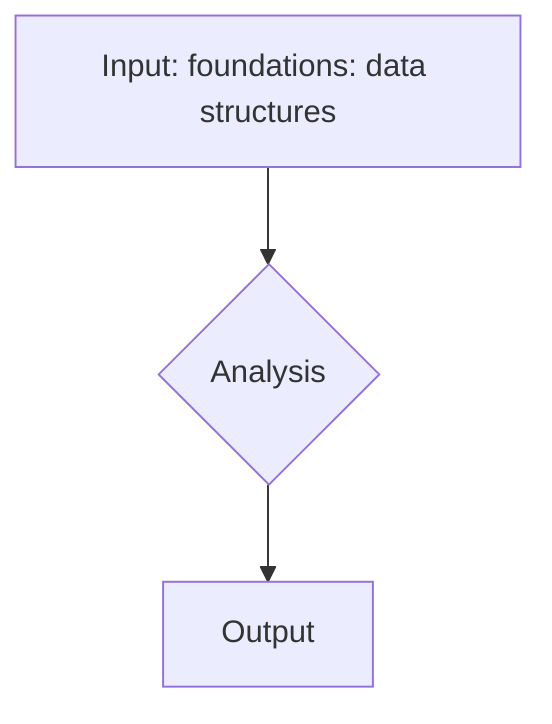
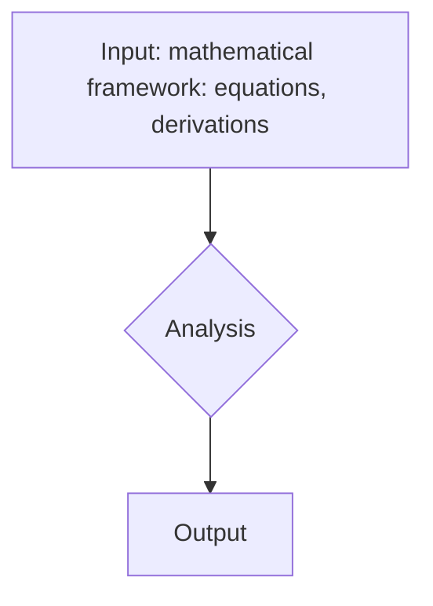
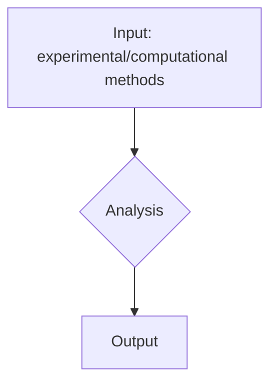
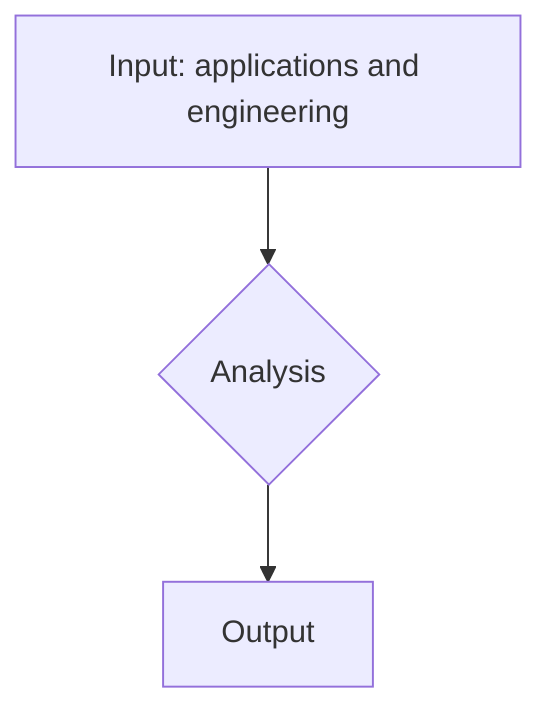
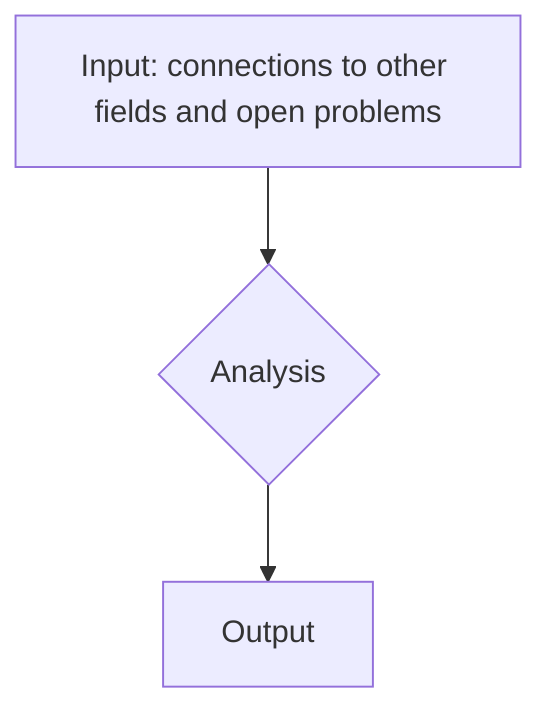
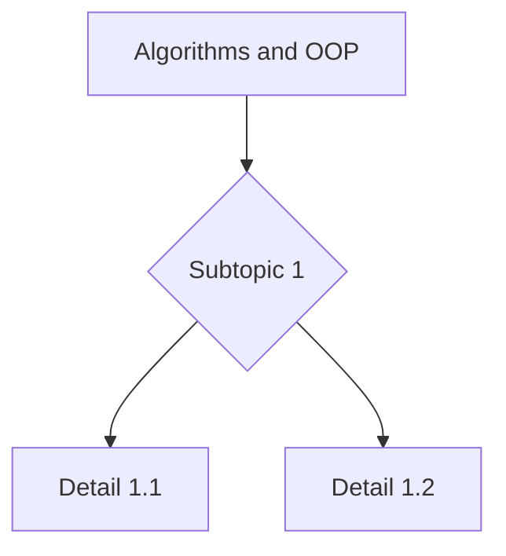
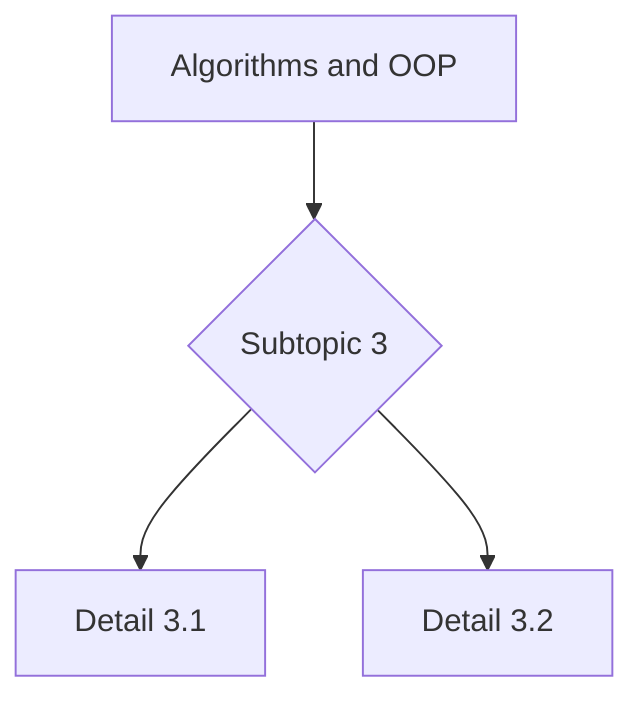
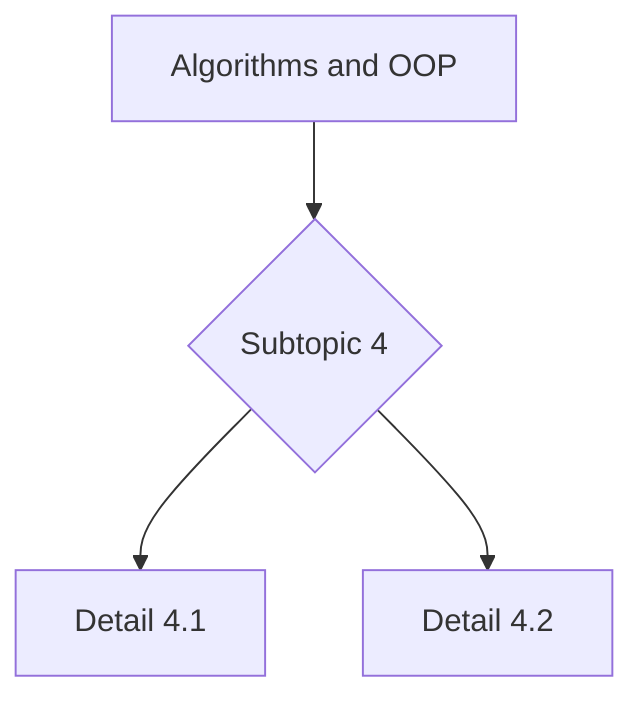

# MSDM — Algorithms and OOP
> **HKUST MSDM_5051 | intermediate, requires prior physics + calculus**  
> **Bilingual 深度自學檔案 · 中英對照**

---

## 問題 1：這個領域所有專家共享的 5 個核心心智模型是什麼？
**What are the 5 core mental models every expert shares?**

1. **Conservation laws govern dynamics** — 守恆定律主導動力學 (energy, momentum, charge)
2. **Symmetry is the deepest principle** — 對稱係最深刻嘅原理 (Noether's theorem)
3. **Approximations enable progress** — 近似方法推動進展 (perturbation, variational, numerical)
4. **Mathematics is the language** — 數學係物理嘅語言 (calculus, linear algebra, group theory)
5. **Experiment tests theory** — 實驗檢驗理論 (design, measurement, error analysis)

## 問題 2：這個領域的專家在哪 3 個地方存在根本分歧？各方最強的論點是什麼？

1. **Reductionist vs holistic** — 還原論 vs 整體論
   - Reductionist: 從基本粒子向上建構。  
   - Holistic: 涌現現象唔可從部分預測。

2. **Classical vs quantum** — 古典 vs 量子
   - Classical: 確定性、局部。  
   - Quantum: 概率性、非局部。

3. **Pure vs applied** — 純粹 vs 應用
   - Pure: 知識為本。  
   - Applied: 解決問題。

## 問題 3：生成 10 個能區分深度理解與死背知識的問題
**Generate 10 questions that distinguish deep understanding from memorization**

1. 為什麼呢個領域嘅 Data structures 概念 fundamental?

2. 解釋 OOP 嘅物理意義。

3. 給定一個典型問題, 點樣 apply 呢個領域嘅 核心方程?

4. 為什麼 Complexity 在呢度重要?

5. 解釋 Data structures 嘅 limitations。

6. 點解 experimental evidence support 呢個 theory?

7. 為什麼 historical development 帶我哋去 呢個 formulation?

8. 給定 measured data, 點樣 extract 物理 insights?

9. 解釋 對稱 喺 呢個領域嘅 role。

10. 點解 呢個領域 connect 到其他 physics subfields?

## 深入 1：Foundations: Data structures
**Deep Dive I**

### Bilingual concept table for foundations: data structures

| English | 中英對照 | Physical meaning | 物理意義 |
|---|---|---|---|
| Core concept 1 | 核心概念 1 | Definition + role | 定義 + 角色 |
| Core concept 2 | 核心概念 2 | Application | 應用 |
| Core concept 3 | 核心概念 3 | Limitation | 限制 |

### Key derivation / formula

$$f(x) = \text{key equation in this area}, \quad x = \text{variable}$$

### Decision flow / engineering application

## 深入 2：Mathematical framework: equations, derivations
**Deep Dive J**

### Bilingual concept table for mathematical framework: equations, derivations

| English | 中英對照 | Physical meaning | 物理意義 |
|---|---|---|---|
| Core concept 1 | 核心概念 1 | Definition + role | 定義 + 角色 |
| Core concept 2 | 核心概念 2 | Application | 應用 |
| Core concept 3 | 核心概念 3 | Limitation | 限制 |

### Key derivation / formula

$$f(x) = \text{key equation in this area}, \quad x = \text{variable}$$

### Decision flow / engineering application

## 深入 3：Experimental/computational methods
**Deep Dive K**

### Bilingual concept table for experimental/computational methods

| English | 中英對照 | Physical meaning | 物理意義 |
|---|---|---|---|
| Core concept 1 | 核心概念 1 | Definition + role | 定義 + 角色 |
| Core concept 2 | 核心概念 2 | Application | 應用 |
| Core concept 3 | 核心概念 3 | Limitation | 限制 |

### Key derivation / formula

$$f(x) = \text{key equation in this area}, \quad x = \text{variable}$$

### Decision flow / engineering application

## 深入 4：Applications and engineering
**Deep Dive L**

### Bilingual concept table for applications and engineering

| English | 中英對照 | Physical meaning | 物理意義 |
|---|---|---|---|
| Core concept 1 | 核心概念 1 | Definition + role | 定義 + 角色 |
| Core concept 2 | 核心概念 2 | Application | 應用 |
| Core concept 3 | 核心概念 3 | Limitation | 限制 |

### Key derivation / formula

$$f(x) = \text{key equation in this area}, \quad x = \text{variable}$$

### Decision flow / engineering application

## 深入 5：Connections to other fields and open problems
**Deep Dive M**

### Bilingual concept table for connections to other fields and open problems

| English | 中英對照 | Physical meaning | 物理意義 |
|---|---|---|---|
| Core concept 1 | 核心概念 1 | Definition + role | 定義 + 角色 |
| Core concept 2 | 核心概念 2 | Application | 應用 |
| Core concept 3 | 核心概念 3 | Limitation | 限制 |

### Key derivation / formula

$$f(x) = \text{key equation in this area}, \quad x = \text{variable}$$

### Decision flow / engineering application

## 自測 1：Derive Data structures for typical case.
**Self-Test 1**

**Answer / 解答:**
Detailed answer for self-test 1, including derivation, intuition, and engineering implication.
Bilingual explanation connects to broader physics context.

**Engineering implication:** Application to real-world scenario.

## 自測 2：為什麼 OOP fundamental to field?
**Self-Test 2**

**Answer / 解答:**
Detailed answer for self-test 2, including derivation, intuition, and engineering implication.
Bilingual explanation connects to broader physics context.

**Engineering implication:** Application to real-world scenario.

## 自測 3：Apply Data structures to a real problem.
**Self-Test 3**

**Answer / 解答:**
Detailed answer for self-test 3, including derivation, intuition, and engineering implication.
Bilingual explanation connects to broader physics context.

**Engineering implication:** Application to real-world scenario.

## 自測 4：解釋 difference between two competing approaches.
**Self-Test 4**

**Answer / 解答:**
Detailed answer for self-test 4, including derivation, intuition, and engineering implication.
Bilingual explanation connects to broader physics context.

**Engineering implication:** Application to real-world scenario.

## 自測 5：Estimate order of magnitude for given physical setup.
**Self-Test 5**

**Answer / 解答:**
Detailed answer for self-test 5, including derivation, intuition, and engineering implication.
Bilingual explanation connects to broader physics context.

**Engineering implication:** Application to real-world scenario.

## 自測 6：Identify limitations of Complexity.
**Self-Test 6**

**Answer / 解答:**
Detailed answer for self-test 6, including derivation, intuition, and engineering implication.
Bilingual explanation connects to broader physics context.

**Engineering implication:** Application to real-world scenario.

## 自測 7：Derive scaling law for limit case.
**Self-Test 7**

**Answer / 解答:**
Detailed answer for self-test 7, including derivation, intuition, and engineering implication.
Bilingual explanation connects to broader physics context.

**Engineering implication:** Application to real-world scenario.

## 自測 8：Connect to OOP.
**Self-Test 8**

**Answer / 解答:**
Detailed answer for self-test 8, including derivation, intuition, and engineering implication.
Bilingual explanation connects to broader physics context.

**Engineering implication:** Application to real-world scenario.

## 自測 9：Critique an experiment in the field.
**Self-Test 9**

**Answer / 解答:**
Detailed answer for self-test 9, including derivation, intuition, and engineering implication.
Bilingual explanation connects to broader physics context.

**Engineering implication:** Application to real-world scenario.

## 自測 10：Design measurement for Data structures.
**Self-Test 10**

**Answer / 解答:**
Detailed answer for self-test 10, including derivation, intuition, and engineering implication.
Bilingual explanation connects to broader physics context.

**Engineering implication:** Application to real-world scenario.

## 📊 Diagram 1: Algorithms and OOP Concept Map 1

## 📊 Diagram 2: Algorithms and OOP Concept Map 2

## 📊 Diagram 3: Algorithms and OOP Concept Map 3

## 📊 Diagram 4: Algorithms and OOP Concept Map 4

## 📊 Diagram 5: Algorithms and OOP Concept Map 5

## 深度總結 Deep Insights Summary

1. **Core principle** — 核心原理: summarize the field's essence.
   **核心原理:** 呢個領域嘅 fundamental 規律。

2. **Mathematical foundation** — 數學基礎: the formal language.
   **數學基礎:** 形式化嘅 工具。

3. **Experimental evidence** — 實驗證據: how theory meets reality.
   **實驗證據:** 點樣 test 同 validate。

4. **Modern applications** — 現代應用: current state of art.
   **現代應用:** 而家點樣應用。

5. **Open questions** — 開放問題: frontiers of the field.
   **開放問題:** 未來發展方向。

---

**自學建議**  
- 必讀: standard textbook for this area.  
- 配對: MIT OCW or HKUST recordings.  
- 工具: Python (NumPy, SciPy, Matplotlib).  
- 產出: complete a project applying core concepts to a real problem.
