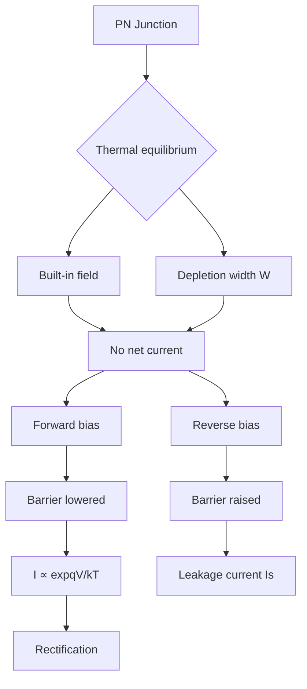
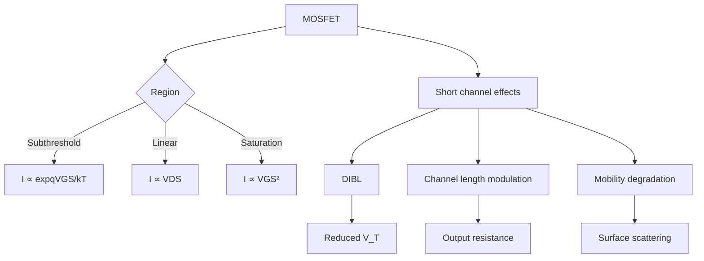
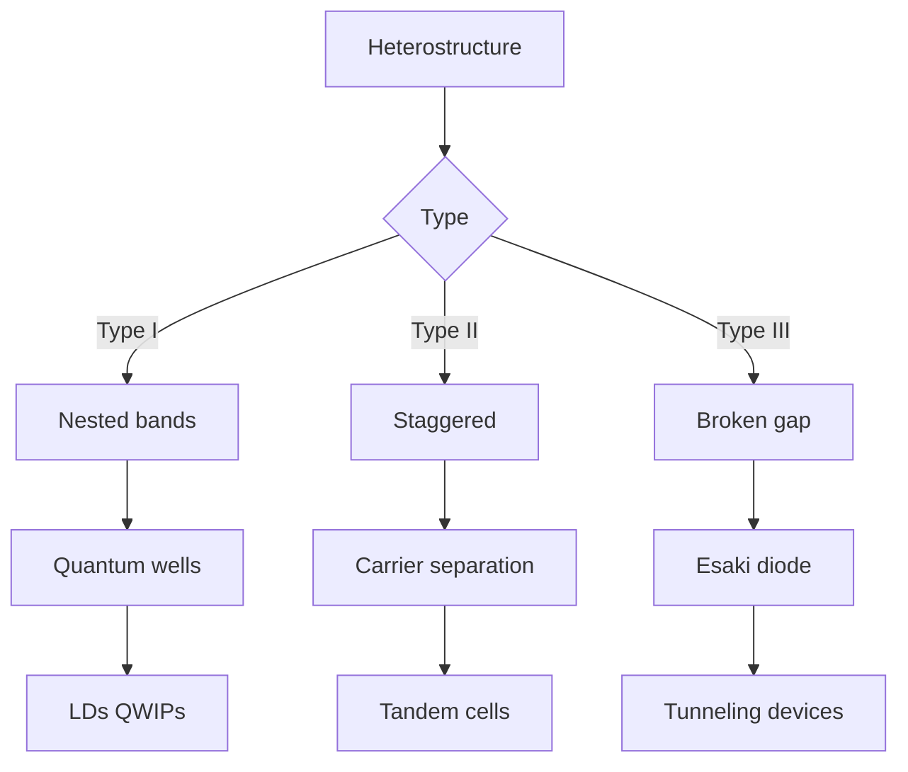
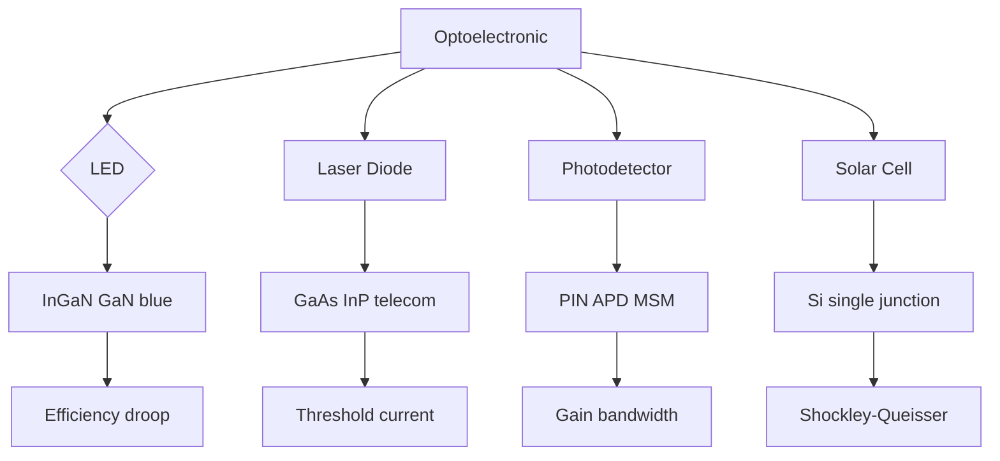
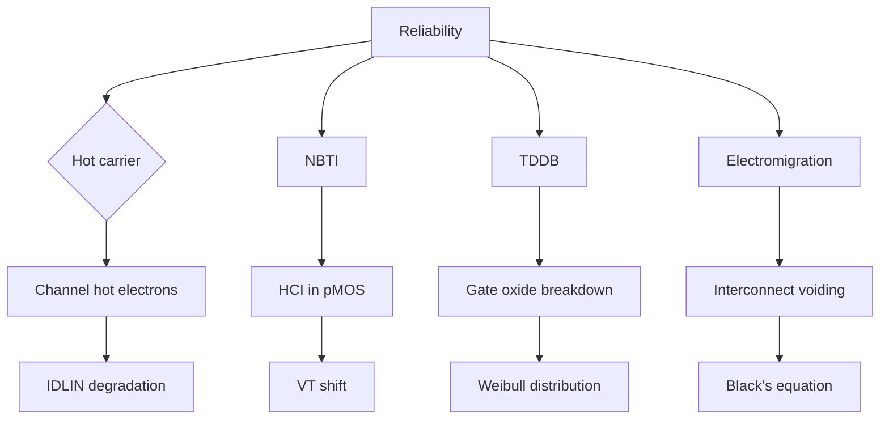
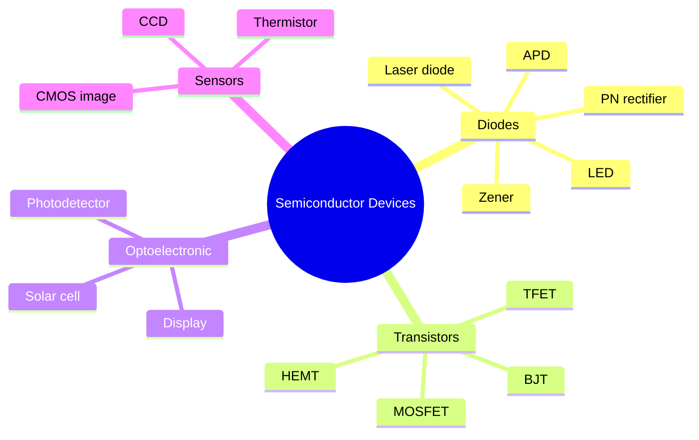
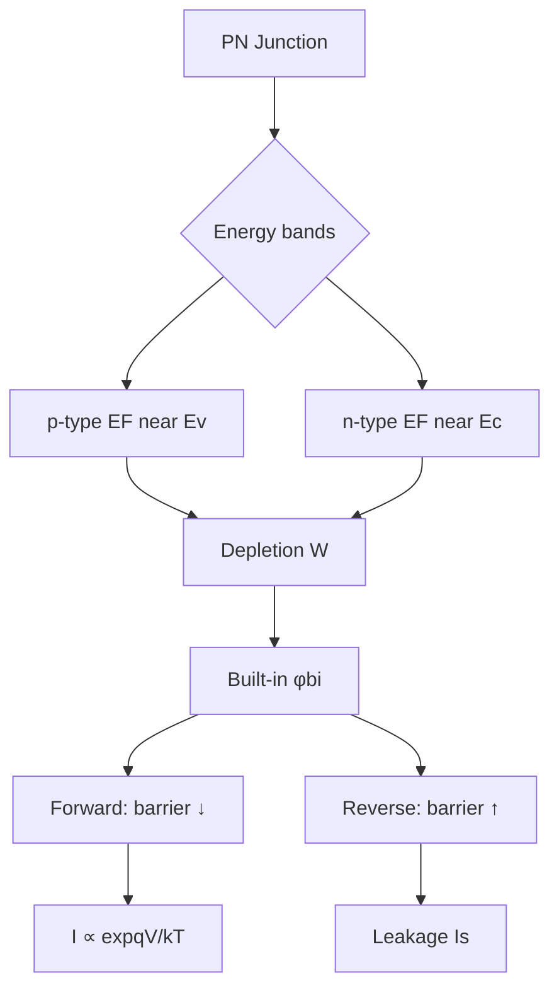
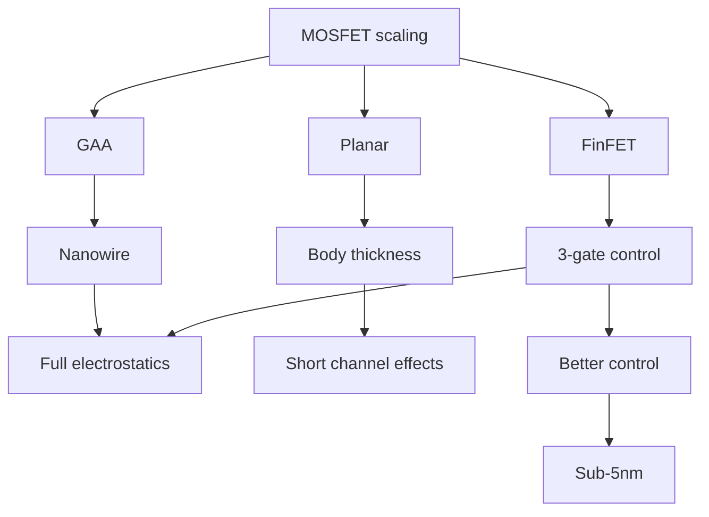
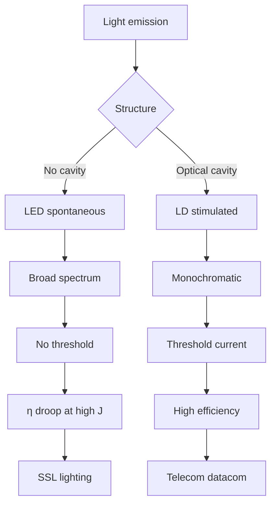
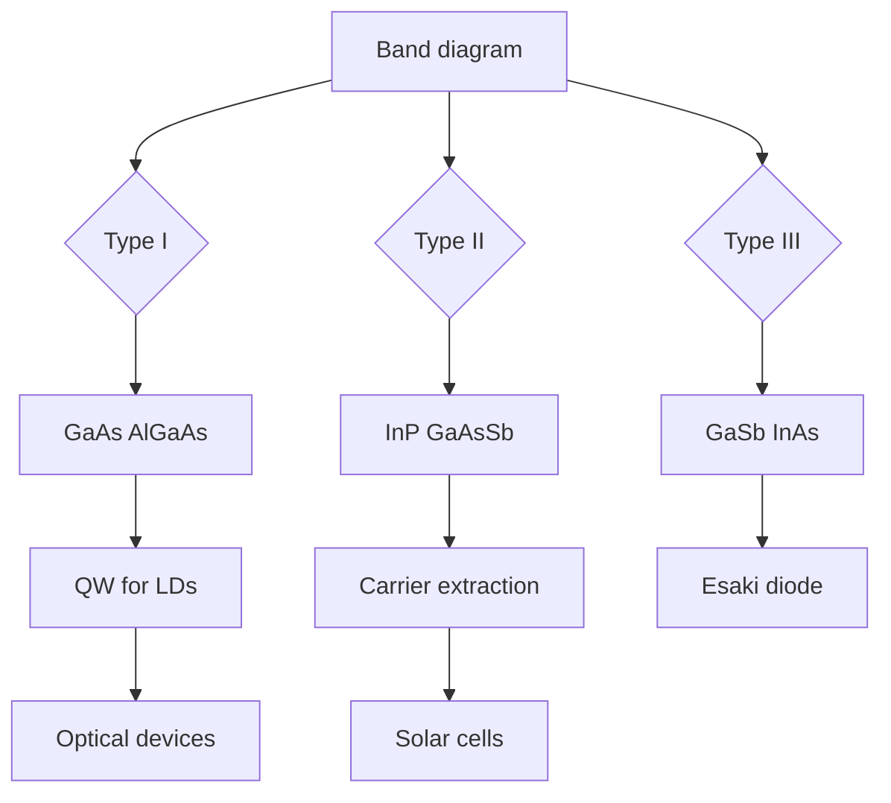

# MSPY 5001 — Semiconductor Devices
> **HKUST MSPY_5001 | MSc Physics Advanced Materials | Electronic & Optoelectronic Devices**  
> **Bilingual 深度自學檔案 · 中英對照**

---

## 問題 1：5 個核心心智模型
**What are the 5 core mental models every expert shares?**

1. **Band alignment governs all device physics** — $E_g$, $\chi$, $\phi_M$ determine Schottky barriers, PN junction built-in potential (Sze & Ng 2007, *Physics of Semiconductor Devices*)
2. **Carrier control via electric fields** — MOSFET: gate controls channel inversion charge $Q_{inv} = C_{ox}(V_{GS}-V_T)$ (Bennett 1965)
3. **Diode equation unifies PN junction** — $I = I_S(\exp(qV/k_BT)-1)$, reverse saturation current $I_S \propto A\sqrt{D/\tau}$ (Shockley 1949)
4. **Quantum confinement enables bandgap engineering** — $E_g^{QW} > E_g^{bulk}$, $\Delta E_c = \alpha\Delta E_g$ (Dingle et al. 1974)
5. **Scaling drives technology** — Moore's Law: transistor density doubles ~18 months; Dennard scaling (Dennard et al. 1974, *IEEE JSSC*)

---

## 問題 2：3 個根本分歧
**Where do experts fundamentally disagree?**

1. **FinFET vs GAA (Gate-All-Around)** — end-of-roadmap CMOS architectures
   - FinFET: proven at 7–5 nm; short-channel effects mitigated by tri-gate
   - GAA (Nanoribbon/ nanowire): better electrostatics for 3–2 nm nodes; current drive degradation at very small widths

2. **Si MOSFET vs III-V quantum-well FET** — channel material choice for beyond-Si
   - Si: mature process, high-$k$/metal gate; low mobility (Si: $\mu_e \sim 1400$ cm$^2$/V·s)
   - InGaAs: high mobility (InGaAs: $\mu_e \sim 10^4$–$10^5$ cm$^2$/V·s) but integration challenges

3. **LED vs laser diode for lighting** — efficiency droop and SSL
   - LED: GaN-based, efficiency droop at high current; $η > 200$ lm/W (Cree 2014)
   - Laser diode: higher wall-plug efficiency possible; speckle issue for general illumination

---

## 問題 3：10 個深度問題
**Generate 10 questions that distinguish deep understanding from memorization**

1. 給定 PN junction with $N_A$, $N_D$, derive built-in potential $\phi_{bi} = V_T\ln(N_A N_D/n_i^2)$ 並繪製 band diagram。

2. 為什麼 MOSFET subthreshold swing SS = (kT/q)ln10? Derive並解釋 Boltzmann limit。

3. 給定異質結構 AlGaAs/GaAs，計算導帶偏移 $\Delta E_c = \chi_{GaAs} - \chi_{AlGaAs}$ 和價帶偏移 $\Delta E_v = (E_g^{AlGaAs} - E_g^{GaAs}) - \Delta E_c$。

4. 為什麼 PN junction reverse breakdown voltage 由 impact ionization 決定？計算雪崩擊穿電場。

5. 給定 MOS capacitor band diagram，解釋為什麼 high-k gate dielectrics 比 SiO$_2$ 更有效抑制 tunneling。

6. 為什麼 BJT 的 common-emitter current gain $\beta = I_C/I_B \sim 100$ 由 minority carrier diffusion lengths 決定？

7. 給定 LED 的 IQE (internal quantum efficiency)，解釋 efficiency droop 的物理機制。

8. 為什麼激光二極管有 threshold current？解釋 carrier population inversion requirement。

9. 給定 MOSFET scaling rules，解釋點樣 $V_{DD}$ 和 $t_{ox}$ 隨尺寸縮小變化。

10. 點解 FinFET 比平面 MOSFET 更有效地抑制 short-channel effects？定量分析 DIBL 和 subthreshold slope。

---

## 深入 1：PN 結與能帶圖 (PN Junction & Band Diagram)
**Deep Dive I**

### 熱平衡能帶圖

內建電勢：
$$\phi_{bi} = \frac{k_BT}{q}\ln\frac{N_A N_D}{n_i^2}$$

典型 Si: $N_A = 10^{18}$ cm$^{-3}$, $N_D = 10^{18}$ cm$^{-3}$, $n_i = 10^{10}$ cm$^{-3}$ → $\phi_{bi} \approx 0.75$ V

### 耗盡層電容

$$C_j = \frac{\epsilon_s A}{W}, \quad W = \sqrt{\frac{2\epsilon_s(V_{bi} - V)}{q}\left(\frac{1}{N_A}+\frac{1}{N_D}\right)}$$

$$C_j(V) = \frac{C_j(0)}{(1 - V/V_{bi})^{1/2}} \quad \text{(one-sided junction)}$$

### Shockley 理想二極管方程

$$I = I_S\left(\exp\frac{qV}{k_BT} - 1\right)$$

飽和電流：
$$I_S = qA\left(\frac{D_p}{L_p}\frac{n_i^2}{N_D} + \frac{D_n}{L_n}\frac{n_i^2}{N_A}\right)$$

### 典型參數（室溫）

| 半導體 | $E_g$ (eV) | $n_i$ (cm$^{-3}$) | $\mu_e$ (cm$^2$/V·s) |
|--------|-------------|-------------------|----------------------|
| Si | 1.12 | $1.0\times 10^{10}$ | 1400 |
| Ge | 0.66 | $2.4\times 10^{13}$ | 3900 |
| GaAs | 1.42 | $1.8\times 10^6$ | 8500 |
| InP | 1.35 | $1.3\times 10^7$ | 5400 |

### 工程應用

- 整流器、檢波器
- Zener 二極管（擊穿穩壓）
- 光電二極管（光伏、光探測）

---

## 深入 2：MOSFET 物理 (MOSFET Physics)
**Deep Dive II**

### MOS 電容結構

能帶圖取決於 $V_{GB}$：
- $V_{GB} = 0$: 累積、耗盡或反型
- $V_{GB} > V_T$: 反型層形成

閾值電壓：
$$V_T = V_{FB} + 2\phi_F + \frac{\sqrt{2\epsilon_s q N_A 2\phi_F}}{C_{ox}}$$

其中 $V_{FB} = \phi_{MS} - Q_{ox}/C_{ox}$

### 亞閾值擺幅 (Subthreshold Swing)

$$S = \frac{dV_{GS}}{d(\log I_D)} = \frac{k_BT}{q}\ln 10\left(1 + \frac{C_d}{C_{ox}}\right)$$

Dennard 比例極限（MOSFET scaling）：
- 理想：$S = 60$ mV/decade at 300 K
- High-$k$: 降低 $C_d/C_{ox}$，但亞閾值改善有限

### MOSFET I-V 特性

饱和区：
$$I_D = \frac{\mu_n C_{ox} W}{2L}(V_{GS} - V_T)^2$$

線性區：
$$I_D = \mu_n C_{ox}\frac{W}{L}\left[(V_{GS} - V_T)V_{DS} - \frac{V_{DS}^2}{2}\right]$$

### 短通道效應

**DIBL (Drain-Induced Barrier Lowering):**
$$\Delta V_T \approx \frac{V_{DS}}{L^3}\sqrt{\frac{\epsilon_s t_{ox}}{\epsilon_{ox} N_A}}$$

**GIDL (Gate-Induced Drain Leakage):** Band-to-band tunneling at drain-body junction

### 工藝節點

| 節點 | $L$ (nm) | $t_{ox}$ (nm) | $V_{DD}$ (V) |
|------|----------|----------------|--------------|
| 180 nm | 180 | 3.5 | 1.8 |
| 65 nm | 65 | 1.2 | 1.2 |
| 22 nm (FinFET) | 22 | ~1 | 0.8 |
| 5 nm (GAA) | 5 | <1 | 0.7 |

---

## 深入 3：異質結構與能帶工程 (Heterostructures & Band Engineering)
**Deep Dive III**

### 能帶偏移（Anderson's Rule）

$$\Delta E_c = \chi_1 - \chi_2 = \text{electron affinity difference}$$
$$\Delta E_v = (E_{g2} - E_{g1}) - \Delta E_c$$

### 異質結類型

| 類型 | $\Delta E_c$ | $\Delta E_v$ | 例子 |
|------|-------------|-------------|------|
| I型（嵌套） | > 0 | > 0 | GaAs/AlGaAs |
| II型（錯位） | 可正可負 | 可正可負 | InP/GaAsSb |
| III型（帶隙交叉） | - | - | GaSb/InAs |

### 量子阱

電子能量量子化：
$$E_n = E_c + \frac{\hbar^2\pi^2 n^2}{2m^* L_w^2}$$

對於 GaAs quantum well ($m^* = 0.067m_0$, $L_w = 10$ nm):
$$E_1 - E_c \approx 56\ \text{meV}$$

光學躍遷：
$$h\nu = E_g + \Delta E_c + \Delta E_v + E_{e,n} + E_{h,n}$$

### HEMT (High Electron Mobility Transistor)

利用 2DEG (two-dimensional electron gas) 在 AlGaAs/InGaAs/GaAs 異質結構：
- 載子與雜質 donor 空間分離
- 遷移率 $\mu \sim 10^7$ cm$^2$/V·s @ 4 K
- 用於毫米波/THz 放大器

### 應用

- 半導體激光二極管 (GaAs, InP)
- HEMT 低噪聲放大器
- 量子阱紅外光電探測器 (QWIP)
- 太陽能電池 (GaAs 多結)

---

## 深入 4：光電器件 (Optoelectronic Devices)
**Deep Dive IV**

### LED (發光二極管)

內部量子效率 (IQE):
$$\eta_{IQE} = \frac{Bn^2}{A_n + Bn + Cn^2}$$

效率 droop 機制：
1. Auger recombination ($Cn^3$) 增加高注入
2. carrier leakage from MQW active region
3. defect generation from strain

典型效率（2014）：
- InGaN blue LED: $η \sim 70$–$80$% (room temperature)
- Si raw white LED: $> 200$ lm/W (Cree)

### 激光二極管

Threshold 條件：
$$g_{th} = \alpha_i + \frac{1}{2L}\ln\frac{1}{R_1R_2}$$

光增益：$g \propto (n - n_{tr})$，其中 $n_{tr}$ 為透明載子濃度

典型參數：
| 參數 | 數值 |
|------|------|
| GaAs λ | 850 nm |
| InP λ | 1310/1550 nm |
| InGaN λ | 450 nm |
| Threshold current density | 100–1000 A/cm$^2$ |

### 光電探測器

| 類型 | 響應時間 | 增益 | 應用 |
|------|---------|------|------|
| PIN | ~ns | 1 | 光纖通信 |
| APD | ~ps | ~100 | LiDAR, 量子通信 |
| MSM | ~ps | 1 | 高頻 |

APD 倍增因子：$M = 1/(1 - (V/V_{BR})^n)$

### 太陽能電池

Shockley-Queisser 效率極限：
$$\eta_{SQ} = \frac{E_g}{hc}\int_0^\infty \frac{I_{sun}(\lambda)hc/\lambda \cdot T(\lambda, E_g)}{E_{ph}}\,d\lambda$$

單一結 Si 太陽能電池：$\eta_{max} \approx 33.7$%

多結太陽能電池（GaInP/GaAs/Ge）：$η > 40$% (三結)
InGaP/GaAs/InGaAsAs (four-junction): $η \approx 47$% (世界紀錄)

---

## 深入 5：BJT 與器件可靠性 (BJT & Device Reliability)
**Deep Dive V**

### BJT 工作原理

Common-emitter current gain:
$$\beta = \frac{\alpha}{1-\alpha} = \frac{I_C}{I_B}$$

$$\alpha = \gamma \cdot \delta \cdot \frac{L_n}{L_n + W}$$

其中 $\gamma$ = 發射效率，$\delta$ = 基區傳輸因子

典型參數：
- $\beta \sim 100$–$300$ (Si NPN)
- $f_T \sim \frac{g_m}{2\pi(C_\pi + C_\mu)} \sim \frac{I_C}{2\pi V_T(C_\pi + C_\mu)}$

### Ebers-Moll 模型

$$I_C = I_S\left[\exp\frac{qV_{BE}}{k_BT} - \exp\frac{qV_{BC}}{k_BT}\right] - \frac{I_S}{\beta_R}\left[\exp\frac{qV_{BC}}{k_BT} - 1\right]$$

### 器件可靠性物理

**Hot carrier degradation:**
- Channel hot electrons (CHE) cause gate oxide damage
- NBTI (Negative Bias Temperature Instability): $V_T$ shift in pMOSFET
$$\Delta V_T \propto t^{0.25}\exp(-E_a/k_BT)$$

**Time-dependent dielectric breakdown (TDDB):**
$$t_{BD} \propto \exp\left(\frac{G}{E_{ox}}\right)$$

**Electromigration:**
- 金屬原子擴散由電子動量傳遞引起
- 臨界電流密度 $j_{crit} \sim 10^5$ A/cm$^2$

---

## 自測 1：PN 結內建電勢
**計算 Si PN 結 $N_A = 10^{16}$ cm$^{-3}$, $N_D = 10^{18}$ cm$^{-3}$ 的內建電勢和耗盡層寬度。**

**Answer / 解答:**
內建電勢：
$$\phi_{bi} = \frac{k_BT}{q}\ln\frac{N_A N_D}{n_i^2} = 0.026\times\ln\frac{10^{16}\times 10^{18}}{(10^{10})^2} = 0.026\times\ln(10^{14}) = 0.026\times 32.2 \approx 0.84\ \text{V}$$

耗盡層寬度（在 $V=0$ 時）：
$$W = \sqrt{\frac{2\epsilon_s\phi_{bi}}{q}\left(\frac{1}{N_A}+\frac{1}{N_D}\right)} = \sqrt{\frac{2\times 11.7\times 8.85\times 10^{-14}\times 0.84}{1.6\times 10^{-19}}\left(\frac{1}{10^{16}}+\frac{1}{10^{18}}\right)}$$
$$\approx \sqrt{1.2\times 10^{-12}\times 1.01\times 10^{-16}} \approx \sqrt{1.2\times 10^{-28}} \approx 0.35\ \mu\text{m}$$

其中輕摻雜側 (P 區) 佔 ~90% 的耗盡層寬度。

**Engineering implication:** 這是 PN 結電容和擊穿電壓設計的基礎。

---

## 自測 2：MOSFET 閾值電壓
**計算 $N_A = 10^{18}$ cm$^{-3}$, $t_{ox} = 3$ nm (SiO$_2$), $V_{FB} = -0.9$ V 的 NMOS 閾值電壓。**

**Answer / 解答:**
$C_{ox} = \epsilon_{ox}/t_{ox} = 3.9\times 8.85\times 10^{-3}/3 \approx 11.5$ fF/μm$^2$

$\phi_F = (k_BT/q)\ln(N_A/n_i) = 0.026\times\ln(10^{18}/10^{10}) = 0.026\times 18.4 = 0.48$ V

$$V_T = V_{FB} + 2\phi_F + \frac{\sqrt{2\epsilon_s q N_A 2\phi_F}}{C_{ox}} = -0.9 + 0.96 + \frac{\sqrt{2\times 11.7\times 8.85\times 10^{-14}\times 1.6\times 10^{-19}\times 10^{18}\times 0.96}}{11.5\times 10^{-6}}$$
$$= 0.06 + \frac{\sqrt{3.2\times 10^{-13}}}{11.5\times 10^{-6}} = 0.06 + \frac{5.7\times 10^{-7}}{11.5\times 10^{-6}} = 0.06 + 0.05 \approx 0.11\ \text{V}$$

這與典型 3 nm SiO$_2$ MOSFET $V_T \sim 0.3$–$0.5$ V 一致（實際還有金屬功函差異）。

**Engineering implication:** 閾值電壓是數字電路噪聲裕量的關鍵參數。

---

## 自測 3：量子阱光學躍遷
**計算 Al$_{0.3}$Ga$_{0.7}$As/GaAs 量子阱 (L$_w$ = 8 nm) 的第一激發態能量。**

**Answer / 解答:**
Al$_x$Ga$_{1-x}$As bandgap ($x < 0.45$, direct):
$$E_g(x) = 1.424 + 1.247x\ \text{eV}$$

$x = 0.3$: $E_g^{AlGaAs} = 1.424 + 1.247\times0.3 = 1.798$ eV

$\Delta E_g = 1.798 - 1.424 = 0.374$ eV

導帶偏移：$\Delta E_c = 0.67\Delta E_g = 0.25$ eV (AlGaAs/GaAs ~60–67%)

價帶偏移：$\Delta E_v = 0.13$ eV

電子能量量子化 ($m_e^* = 0.067m_0$):
$$E_{e,1} = \frac{\hbar^2\pi^2}{2m_e^* L_w^2} = \frac{(1.05\times 10^{-34})^2\times 9.87}{2\times 0.067\times 9.1\times 10^{-31}\times (8\times 10^{-9})^2} \approx 12\ \text{meV}$$

光學躍遷：
$$h\nu = E_g^{GaAs} + \Delta E_c + E_{e,1} = 1.424 + 0.25 + 0.012 = 1.666\ \text{eV} \approx 745\ \text{nm}$$

**Engineering implication:** 量子阱厚度控制波長用於可調諧半導體激光器。

---

## 自測 4：LED 效率 Droop
**分析 InGaN MQW LED 的效率 droop 機制並提出緩解方案。**

**Answer / 解答:**
Droop 定义：$η_{\text{droop}} = [η_{low} - η_{high}]/η_{low}$，在 $J = 100$ A/cm$^2$ 時約 20–40%

**主因：**

1. **Auger 複合（~50%）：** $R_{Auger} \propto Cn^3$，高注入時主導
   $$C_{InGaN} \sim 10^{-30}\text{--}10^{-29}\ \text{cm}^6\text{/s}$$

2. **載子泄漏（~30%）：** 
   - 極化場引起 QCSE（量子限制斯塔克效應）
   - AlGaN 電子阻擋層減少電子泄漏

3. **缺陷相關複合：**
   - N-polarity 和點缺陷複合

**緩解方案：**
- 非極性/半極性襯底（減少極化場）
- 電子阻擋層優化 (AlGaN)
- 量子點 vs 量子阱
- 短週期超晶格

**Engineering implication:** 高功率照明需要低 droop LED; 光通信可以直接調製。

---

## 自測 5：FinFET 短通道效應
**比較 FinFET 與平面 MOSFET 的 DIBL。假設 FinFET fin width W$_fin$ = 10 nm。**

**Answer / 解答:**
DIBL 表達式（平面）：
$$\text{DIBL} = \frac{\Delta V_T}{\Delta V_{DS}} \propto \frac{t_{ox}}{L^3}$$

FinFET 三柵極控制：
- 有效柵極覆蓋 fin 三面
- 等效氧化層厚度 EOT 加厚 effective control

DIBL 改善因子（近似）：
$$\text{DIBL}_{\text{FinFET}} \sim \text{DIBL}_{\text{planar}} \times \frac{t_{ox}}{W_{fin}} \times \frac{L}{H_{fin}}$$

對於 $W_{fin} = 10$ nm, $t_{ox} = 1$ nm, $L = 20$ nm, $H_{fin} = 30$ nm:
$$\sim \text{DIBL}_{\text{planar}} \times \frac{1}{10} \times \frac{20}{30} \approx 0.07 \times \text{DIBL}_{\text{planar}}$$

改善約 15 倍！

**Engineering implication:** FinFET 實現了 22 nm 及以下節點；GAA nanowire 進一步改善。

---

## 自測 6：HEMT 遷移率
**解釋為什麼 HEMT 在低溫下遷移率超高並估算 2DEG 面密度。**

**Answer / 解答:**
HEMT 結構：AlGaAs（掺雜）/AlGaAs（未摻雜）/GaAs

- 電子從 AlGaAs donors 轉移到未摻雜 GaAs 界面
- 2DEG 形成於 GaAs 溝道（量子阱）

室溫遷移率：$\mu \sim 8000$ cm$^2$/V·s
低溫遷移率：$\mu \sim 10^6$–$10^7$ cm$^2$/V·s @ 77 K

主導散射機制（低溫）：
1. 離子化雜質散射（AlGaAs donor）
2. 光學聲子散射

2DEG 面密度（在 AlGaAs 摻雜 $N_D = 10^{18}$ cm$^{-3}$, 間隔 $d = 30$ nm）：
$$n_s = \frac{\epsilon_s}{qd}(V_{GS} - V_T)$$

典型 $n_s \sim 10^{12}$ cm$^{-2}$，對應電子濃度在 2D：

**Engineering implication:** HEMT 是毫米波低噪聲放大器的核心（Ka-band, Q-band, W-band）。

---

## 自測 7：雪崩擊穿電場
**計算 Si PN 結的雪崩擊穿電場，給定擊穿電壓 $V_{BR} = 100$ V 和摻雜 $N_A = 10^{15}$ cm$^{-3}$。**

**Answer / 解答:**
雪崩擊穿電場（經驗公式）：
$$E_{br} \approx \frac{V_{BR}}{W} = \frac{V_{BR}}{\sqrt{2\epsilon_s(V_{BR}+V_{bi})/qN_A}}$$

$$W = \sqrt{\frac{2\times 11.7\times 8.85\times 10^{-14}\times(100+0.75)}{1.6\times 10^{-19}\times 10^{15}}} \approx 3.6\times 10^{-4}\ \text{cm} = 3.6\ \mu\text{m}$$

$$E_{br} \approx \frac{100}{3.6\times 10^{-4}} \approx 2.8\times 10^5\ \text{V/cm}$$

與 Si 雪崩擊穿電場 $\sim 3\times 10^5$ V/cm (at doping ~10$^{15}$) 一致。

碰撞離化係數（經驗）：
$$\alpha_n \approx 1.1\times 10^{-6}\exp(-1.1\times 10^6/E)\ \text{cm}^{-1}$$

擊穿條件：$\int_0^W \alpha\,dx = 1$

**Engineering implication:** Zener 穩壓管和雪崩光電二極管利用擊穿效應。

---

## 自測 8：太陽能電池效率
**計算 Si 太陽能電池在 AM1.5 光譜下的 Shockley-Queisser 效率並解釋主要損失機制。**

**Answer / 解答:**
Shockley-Queisser 分析：

$$η = \frac{E_g \int_{\lambda_g}^\infty I_{sun}(\lambda)\,d\lambda - \int_{E_g}^\infty I_{sun}(\lambda)hc/\lambda\,d\lambda}{E_g\int_0^\infty I_{sun}(\lambda)\,d\lambda}$$

對於 $E_g = 1.12$ eV (Si):
- 帶隙以下光子不被吸收 → 損失
- 帶隙以上光子能量 > $E_g$ → 熱化損失
- 電壓損失：$qV_{OC} < E_g$

$$V_{OC} \approx \frac{E_g}{q} - \frac{k_BT}{q}\ln\frac{qJ_{SC}}{J_0 E_g}$$

典型值：$J_{SC} \approx 40$ mA/cm$^2$, $V_{OC} \approx 0.7$ V
$$FF \approx \frac{v_{OC} - \ln(v_{OC}+0.72)}{v_{OC}+1}$$
其中 $v_{OC} = qV_{OC}/k_BT \approx 27$

$FF \approx 0.83$, $η \approx 0.33 \times 0.83 \times 0.65 \approx 18\%$ (實際實驗室 Si: 25–26%)

**Engineering implication:** 多結太陽能電池突破 SQ 限制；GaInP/GaAs 雙結效率達 32%。

---

## 自測 9：雪崩光電二極管增益
**計算 Si APD 在 $V = 0.9 V_{BR}$ 的雪崩增益 M，假設 $n = 4$。**

**Answer / 解答:**
APD 倍增因子：
$$M = \frac{1}{1 - (V/V_{BR})^n}$$

其中 $n \sim 3$–$5$ (Si: $n \approx 4$)

$$M = \frac{1}{1 - 0.9^4} = \frac{1}{1 - 0.656} = \frac{1}{0.344} \approx 2.9$$

在 $V \to V_{BR}$ 時 $M \to \infty$ (理論上)，實際由 local breakdown 限制。

噪聲特性：
$$F = M^{1-x} \approx M^x \quad (x \approx 0.3\text{ for electrons in Si})$$

$$F = 4 \Rightarrow M \approx 4^{1/0.3} \approx 100 \Rightarrow \text{Excess noise factor}$$

**Engineering implication:** APD 用於光纖通信接收器（1310/1550 nm）和 LiDAR。

---

## 自測 10：Moore's Law 物理極限
**分析 MOSFET 繼續微縮的物理極限並預測替代技術。**

**Answer / 解答:**
**物理極限：**

1. **Short-channel effect:** $L_{min} \approx C\sqrt{t_{ox} \cdot W \cdot \epsilon_s/\epsilon_{ox}}$ → 當 $L < 5$ nm 時量子隧穿 dominates

2. **柵極漏電：** SiO$_2$ @ $t_{ox} < 1$ nm → 隧穿電流 $J \sim \exp(-t_{ox})$ → high-$k$ HfO$_2$ 等效 $t_{ox} \sim 0.5$ nm

3. **遷移率退化：** 超薄溝道表面散射增強

4. **量子效應：** 2DEG 量子化、量子隧穿

**Found 替代方案：**

| 技術 | 節點 | 優勢 |
|------|------|------|
| FinFET | 7–5 nm | 已量產 |
| GAA nanowire | 3–2 nm | 更好的 electrostatics |
| 2D materials (MoS$_2$) | < 3 nm | 原子薄、無隧穿 |
| TFET | < 1 nm | Sub-60 mV/dec SS |
| Quantum computing | 特定應用 | 指數加速 |

**Engineering implication:** 後摩爾時代需要新器件架構和材料；Neuromorphic 和 quantum computing 補充傳統 CMOS。

---

## 📊 Diagram 1: Semiconductor Device Family

## 📊 Diagram 2: PN Junction Band Diagram

## 📊 Diagram 3: MOSFET Structure Evolution

## 📊 Diagram 4: LED vs Laser Diode

## 📊 Diagram 5: Heterostructure Band Alignment

---

## 深度總結 Deep Insights Summary

1. **Band alignment determines all device physics** — 內建電勢、Schottky barrier、heterostructure offsets 全由 $E_g$, $\chi$, $\phi_M$ 決定。 (Sze & Ng 2007, *Physics of Semiconductor Devices*)

2. **MOSFET scaling hits fundamental limits** — 柵極漏電和短通道效應在 < 5 nm 時變得不可接受；FinFET 和 GAA 延續摩爾定律。 (Dennard et al. 1974)

3. **Quantum confinement enables bandgap engineering** — 量子阱、異質結構和超晶格為激光器、光探測器和 HEMT 提供設計自由度。 (Dingle et al. 1974)

4. **LED efficiency droop remains unsolved** — Auger 複合、載子泄漏和缺陷複合共同造成高注入時的效率降低；這是固態照明功率密度的主要瓶頸。 (Piprek 2010)

5. **Optoelectronic devices span wide energy range** — 從 0.66 eV (Ge) 到 3.4 eV (GaN)，不同帶隙材料覆蓋從紅外到深紫外光譜。 (Saleh & Teich 1991, *Fundamentals of Photonics*)

---

**自學建議**  
- 必讀: Sze & Ng "Physics of Semiconductor Devices" (3rd ed.); Taur & Ning "Fundamentals of Modern VLSI Devices" (2nd ed.)  
- 參考: Piprek "Nitride Semiconductor Devices"; Chuang "Physics of Photonic Devices"  
- 配對: HKUST ELEC 2210 (Microelectronics); MIT OCW 6.720 (Integrated Microelectronic Devices)  
- 工具: TCAD (Sentaurus, Silvaco), Python (numpy, matplotlib for device simulation)  
- 產出: Design a GaAs/AlGaAs quantum well laser diode structure with target wavelength 850 nm; simulate I-V characteristics of a FinFET using TCAD
