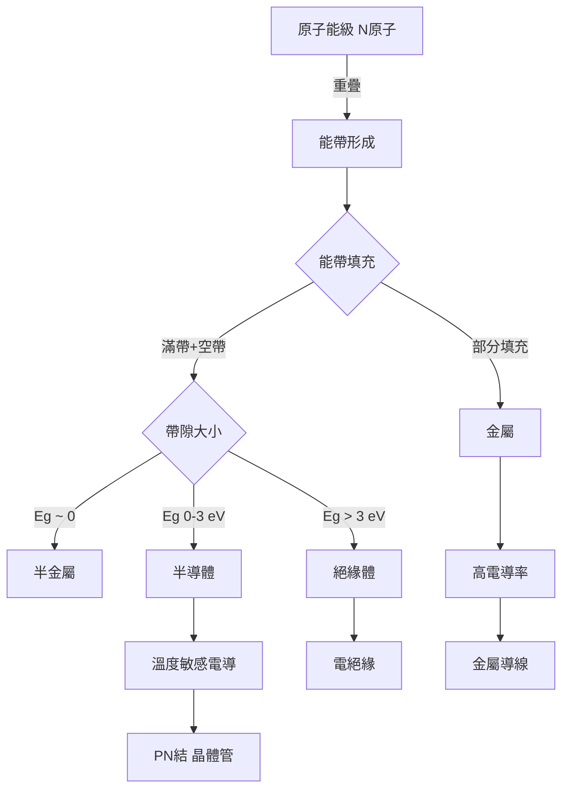
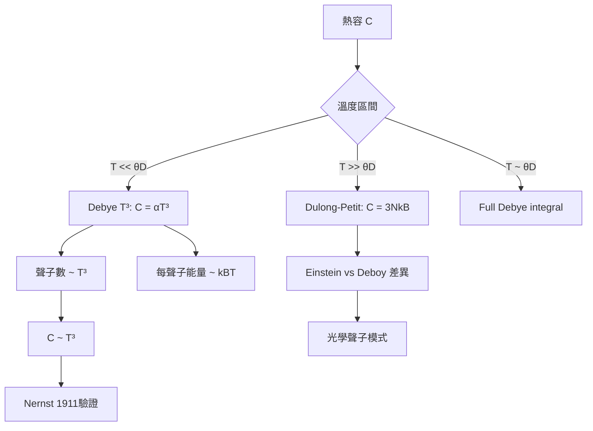
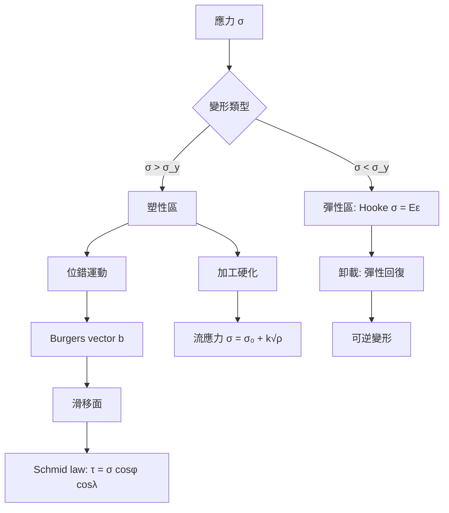
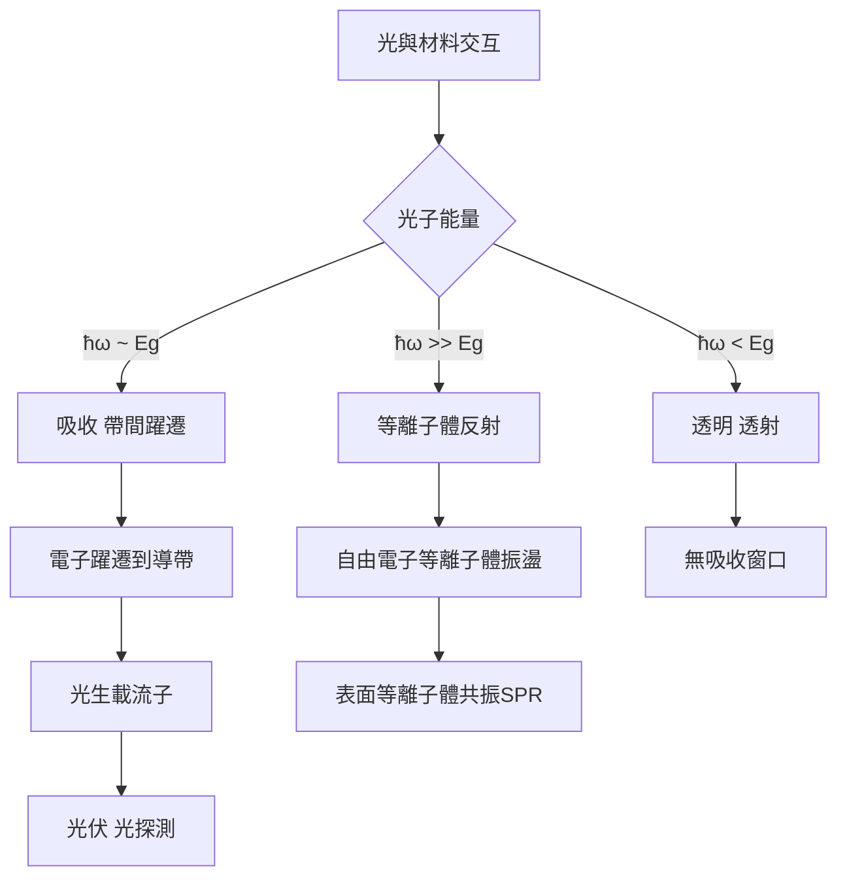
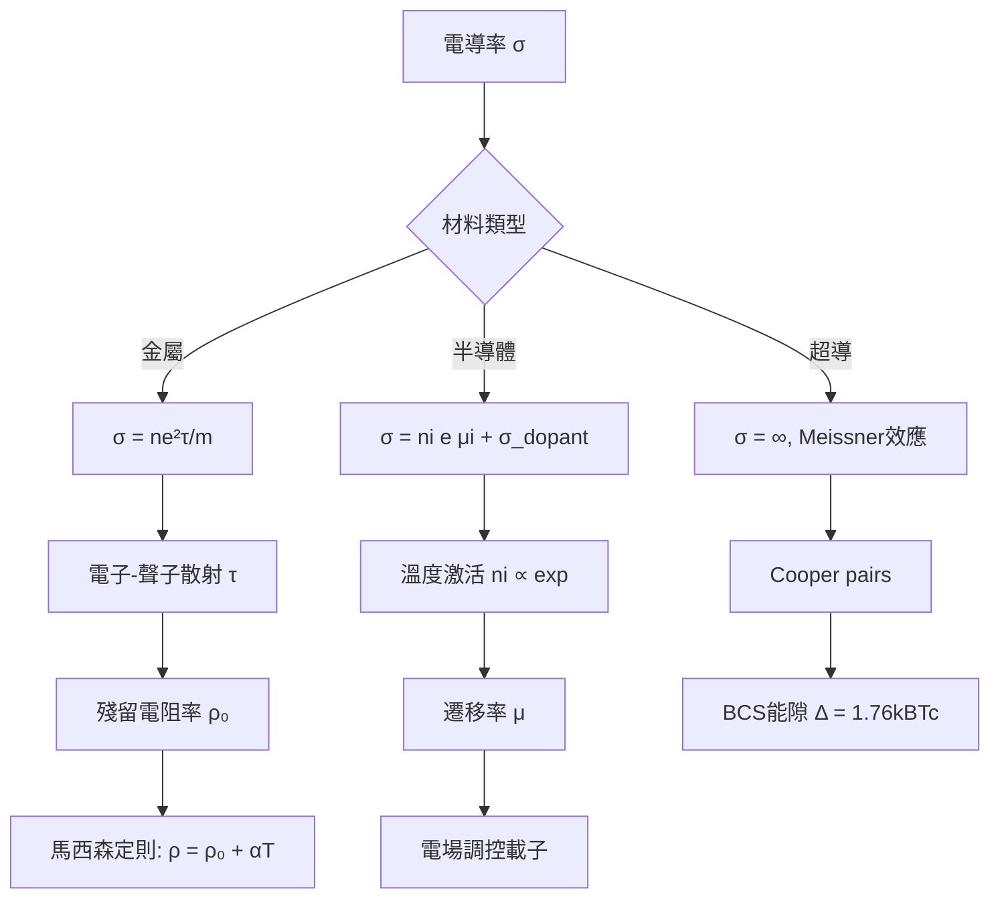
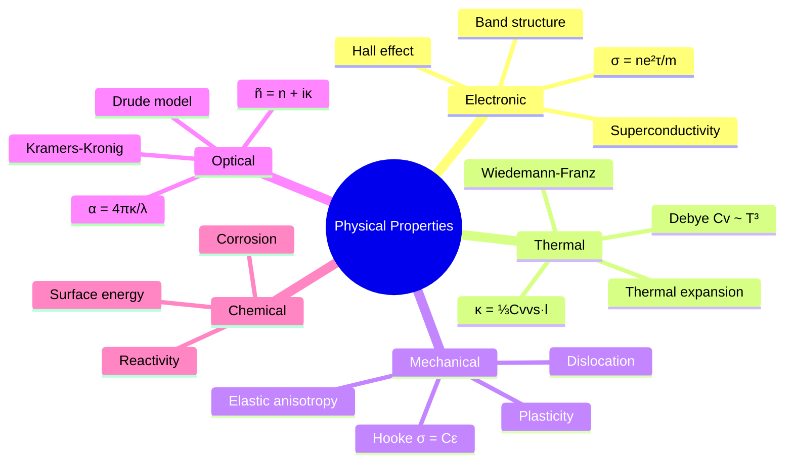
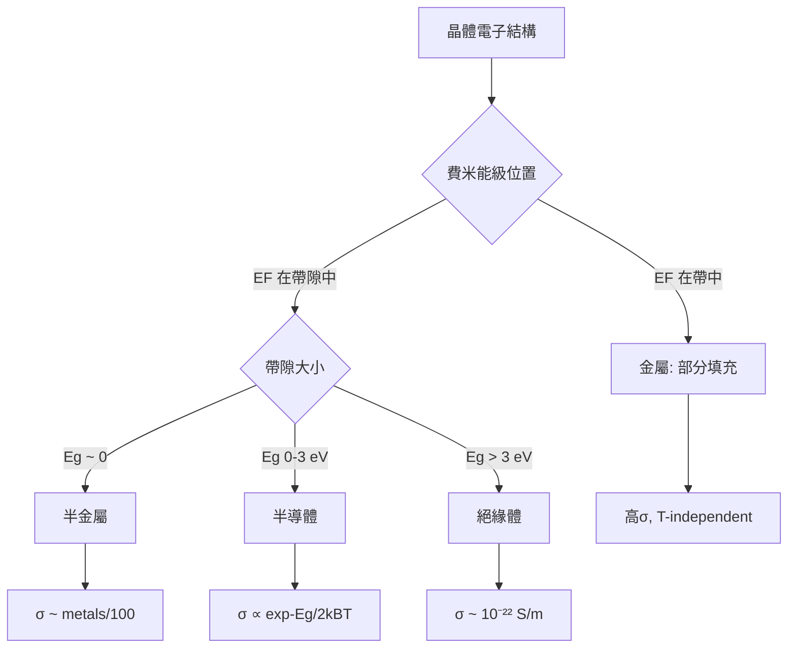
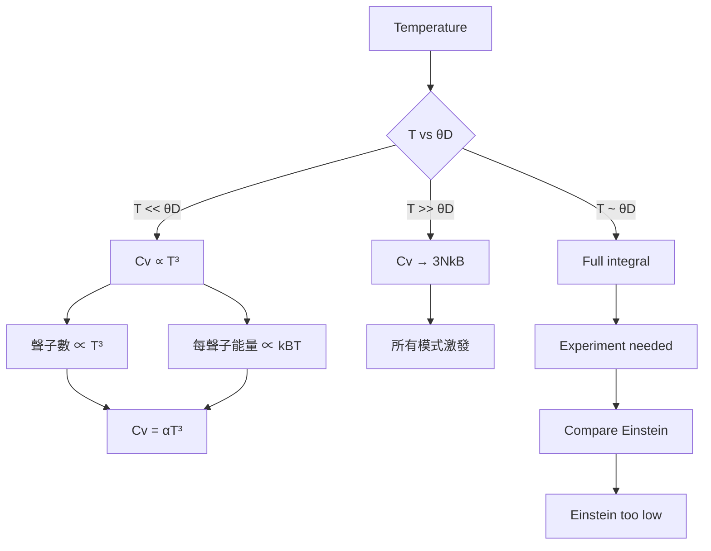

# MSPY 5210 — Physical Properties of Materials
> **HKUST MSPY_5210 | MSc Physics Advanced Materials | Solid-State Physics**  
> **Bilingual 深度自學檔案 · 中英對照**

---

## 問題 1：5 個核心心智模型
**What are the 5 core mental models every expert shares?**

1. **Band structure determines all electronic properties** — metals/semiconductors/insulators from $E(\mathbf{k})$ (Kittel Ch. 6–7; Ashcroft & Mermin)
2. **Phonons dominate thermal properties** — Debye $C_V \propto T^3$, thermal conductivity $\kappa$ (Debye 1912, *Ann. Phys.*)
3. **Elastic constants from Hooke's law** — $\sigma_{ij} = C_{ijkl}\epsilon_{kl}$, anisotropic stiffness tensors
4. **Optical constants are complex** — $\tilde{n} = n + i\kappa$, Kramers-Kronig relations link real and imaginary parts
5. **Drude/Wilson models bridge free electrons to bands** — $\sigma = ne^2\tau/m$, Wiedemann-Franz $\kappa/\sigma T = L_0 = 2.44 \times 10^{-8}$ WΩK$^{-2}$ (Lorenz 1853)

---

## 問題 2：3 個根本分歧
**Where do experts fundamentally disagree?**

1. **Drude classical vs Bloch quantum** — classical free-electron gas (Drude 1900) vs quantum band theory (Bloch 1928)
   - Drude: explains $\sigma$, $\kappa$ but fails on heat capacity ($3k_B$ vs observed $\propto T$)
   - Bloch: explains insulators, semiconductors but complex for real materials

2. **Einstein vs Debye heat capacity** — both predict wrong extreme; Einstein: $C \propto e^{-\theta_E/T}$ exponentially vanishes; Debye: $C \propto T^3$ at low $T$
   - Debye wins for $T \ll \theta_D$ (confirmed by Nernst 1911 for Cu, Ag)
   - Einstein better for optical modes in complex crystals

3. **Local density approximation (LDA) vs hybrid functionals for DFT** — LDA overbinds, hybrid corrects but expensive
   - LDA (Hohenberg-Kohn 1964, Kohn-Sham 1965): 10$^6$+ DFT calculations per year, foundation of materials design
   - Heyd-Scuseria-Ernzerhof (HSE) hybrid: 10–100× slower, better band gaps (Perdew 1981 for LDA; Heyd 2003 for HSE)

---

## 問題 3：10 個深度問題
**Generate 10 questions that distinguish deep understanding from memorization**

1. 為什麼金屬有 electrical conductivity 但琥珀沒有？解釋 band theory 点樣解釋金屬/絕緣體/半導體嘅分別。

2. 給定 free electron gas model，derive electrical conductivity $\sigma = ne^2\tau/m$ 並解釋點解 semi-classical Boltzmann approach 更好。

3. 證明 Wiedemann-Franz law $\kappa/\sigma T = (\pi^2/3)(k_B/e)^2 = 2.44 \times 10^{-8}$ WΩK$^{-2}$，呢個 universal Lorenz number 點樣驗證？

4. 給定 Debye model，derive $C_V(T) = 9Nk_B(T/\theta_D)^3 \int_0^{\theta_D/T} x^4 e^x/(e^x-1)^2 dx$ 並 show $C_V \to 3Nk_B$ as $T \to \infty$。

5. 為什麼熱膨脹係非諧效應？用 Grüneisen parameter $\gamma = -\partial \ln \omega / \partial \ln V$ 解釋。

6. 給定 complex refractive index $\tilde{n} = n + i\kappa$，derive absorption coefficient $\alpha = 4\pi\kappa/\lambda_0$ 對金屬光學。

7. 點解彈性係各向異性？解釋 Voigt notation 点樣 reduced stiffness matrix $C_{ij}$ from $C_{ijkl}$。

8. 為什麼熱導率對非晶體比晶體低？用 phonon mean free path $l = v_s \tau$ 解釋 disorder 嘅 effect。

9. 給定 Mossotti local field factor，解釋介電常數點樣由微觀極化率計算：$\epsilon_r = 1 + \chi = 1 + n\alpha/(1 - n\alpha/3)$。

10. 點解超導體嘅熱導率喺 $T_c$ 以下降低？解釋 BCS theory 中電子配對點樣減少電子對熱傳導嘅貢獻。

---

## 深入 1：電子能帶理論 (Electronic Band Theory)
**Deep Dive I**

### 核心概念：能帶點樣形成？

原子孤立時，電子佔據分立能級。當 $N$ 個原子形成固體，相鄰原子波函數重疊造成能級分裂為準連續帶。

$$\text{Bloch 定理：} \quad \psi_{n\mathbf{k}}(\mathbf{r}) = e^{i\mathbf{k}\cdot\mathbf{r}} u_{n\mathbf{k}}(\mathbf{r}), \quad u_{n\mathbf{k}}(\mathbf{r}+\mathbf{R}) = u_{n\mathbf{k}}(\mathbf{r})$$

### 關鍵方程式

**Free electron model:**
$$\epsilon(\mathbf{k}) = \frac{\hbar^2 k^2}{2m_e}, \quad D(\epsilon) = \frac{V}{2\pi^2}\left(\frac{2m_e}{\hbar^2}\right)^{3/2}\sqrt{\epsilon}$$

**Kronig-Penney model (方勢阱週期):**
$$\cos(k a) = \frac{m E}{P\hbar^2} \frac{\sin(\sqrt{2mE}\,b/\hbar)}{\sqrt{2mE}\,b/\hbar} + \cos(\sqrt{2mE}\,b/\hbar)$$

**Effective mass:**
$$m^* = \hbar^2\left(\frac{d^2\epsilon}{dk^2}\right)^{-1}$$

對於半導體：Si $m^*_e = 0.26m_e$, GaAs $m^*_e = 0.067m_e$

### 工程應用

能帶工程驅動半導體器件設計：
- MOSFET: 溝道摻雜控制載子濃度
- LED: 直接/間接帶隙決定發光效率（GaAs 直接帶隙 1.42 eV 適合光電；Si 1.12 eV 間接帶隙效率低）
- 太陽能電池：Band gap 決定吸收光譜（Shockley-Queisser: $\eta_{max} \approx 33\%$ 對單一結）



---

## 深入 2：熱性質 — 聲子與熱容 (Thermal Properties: Phonons & Heat Capacity)
**Deep Dive II**

### 核心概念：固體點樣儲存熱能？

固體熱容來自兩部分：
1. **晶格振動（聲子）** — 主要貢獻室溫熱容
2. **電子** — 低溫下金屬主導（$C \propto T$ from Fermi-Dirac）

### Debye Model 推導

假設：彈性波（線性色散）$\omega = v_s k$，截止頻率 $\omega_D$ 由總聲子數 $= 3N$ 決定：

$$\underbrace{\frac{V}{(2\pi)^3} \int_{k<\omega_D/v_s} d^3k}_{3N} = 3N \implies \omega_D = v_s\left(\frac{6\pi^2 N}{V}\right)^{1/3}$$

Debye 溫度：$\theta_D = \hbar\omega_D/k_B$

內能：
$$U = 9Nk_B T\left(\frac{T}{\theta_D}\right)^3 \int_0^{\theta_D/T} \frac{x^3}{e^x - 1}\,dx$$

熱容：
$$C_V = \frac{\partial U}{\partial T} = 9Nk_B\left(\frac{T}{\theta_D}\right)^3 \int_0^{\theta_D/T} \frac{x^4 e^x}{(e^x - 1)^2}\,dx$$

**低溫極限 ($T \ll \theta_D$):** $C_V \approx \frac{12\pi^4}{5}Nk_B\left(\frac{T}{\theta_D}\right)^3$ — Debye $T^3$ law

**高溫極限 ($T \gg \theta_D$):** $C_V \to 3Nk_B$ — Dulong-Petit law

### 典型數值

| 物質 | $\theta_D$ (K) | $C_V$ at 300K (J/mol·K) |
|------|----------------|--------------------------|
| Cu | 343 | 24.5 |
| Si | 645 | 20.1 |
| Diamond | 1860 | 6.1 |

### 熱導率

$$\kappa = \frac{1}{3}C_V\, v_s\, l = \frac{1}{3}C_V\, v_s^2\,\tau$$

Wiedemann-Franz Law（金屬）:
$$\frac{\kappa}{\sigma T} = L = \frac{\pi^2}{3}\left(\frac{k_B}{e}\right)^2 = 2.44 \times 10^{-8}\ \text{W}\Omega\text{K}^{-2}$$

### 工程應用

- 散熱片設計（Cu: $\kappa = 400$ W/m·K, Si: 150 W/m·K）
- 半導體製程熱管理
- 低溫超導磁鐵冷却預算計算



---

## 深入 3：機械性質 — 彈性與塑性 (Mechanical Properties: Elasticity & Plasticity)
**Deep Dive III**

### Hooke's Law 張量形式

$$\sigma_{ij} = \sum_{kl} C_{ijkl}\,\epsilon_{kl}$$

對稱性簡化：
- 應力/應變對稱：$C_{ijkl} = C_{jikl} = C_{ijlk}$
- 矩陣表示 (Voigt): $\sigma_i = \sum_j C_{ij}\,\epsilon_j$

各向異性晶體的獨立彈性常數：
| 晶系 | 獨立常數數 |
|------|-----------|
| Cubic | 3 ($C_{11}, C_{12}, C_{44}$) |
| Hexagonal | 5 |
| Triclinic | 21 |

**Cubic crystal (e.g., Si, Cu):**
$$C_{11} = \begin{pmatrix} C_{11} & C_{12} & C_{12} \\ C_{12} & C_{11} & C_{12} \\ C_{12} & C_{12} & C_{11} \end{pmatrix} + C_{44}\begin{pmatrix} 1 & 0 & 0 \\ 0 & 1 & 0 \\ 0 & 0 & 1 \end{pmatrix}$$

### 關鍵工程量

**Young's modulus:** $E = \sigma/\epsilon$ (GPa: Si=165, Cu=130, diamond=1050)

**Bulk modulus:** $B = -V(dP/dV) = (C_{11}+2C_{12})/3$ for cubic

**Poisson's ratio:** $\nu = -\epsilon_{transverse}/\epsilon_{axial}$ (金屬 ~0.33, Si ~0.28)

### 塑性變形

位錯理論（Taylor 1934, Orowan-Polyani）：
$$\dot{\epsilon} = \rho_m\, b\, \bar{v}$$

其中 $\rho_m$ = 移動位錯密度，$b$ = Burgers vector，$\bar{v}$ = 位錯速度

**Strengthening mechanisms:**
1. Work hardening: $\sigma = \sigma_0 + k\sqrt{\rho}$
2. Solid solution: $\Delta\sigma \propto c^{2/3}$
3. Precipitation: Orowan looping

### 工程應用

- 半導體 wafer 加工（Si wafer 脆性斷裂臨界應力 ~ 1 GPa）
- MEMS 設計（彈性梁諧振器）
- 高強度鋼材 alloy design



---

## 深入 4：光學性質 (Optical Properties)
**Deep Dive IV**

### 複折射率

$$\tilde{n}(\omega) = n(\omega) + i\kappa(\omega)$$

- $n$: 相位速度 $v = c/n$
- $\kappa$: 消光係數，決定吸收

**吸收係數：**
$$\alpha(\omega) = \frac{4\pi\kappa(\omega)}{\lambda_0} = \frac{\omega\kappa(\omega)}{c}$$

光學滲透深度：$\delta = 1/\alpha$

對金屬：$\delta \sim 10$–$100$ nm（可見光頻率）

### Drude 模型（金屬光學）

$$\epsilon(\omega) = \epsilon_\infty - \frac{\omega_p^2}{\omega(\omega + i/\tau)}$$

等離子體頻率：$\omega_p = \sqrt{\frac{ne^2}{\epsilon_0 m^*}}$

| 金屬 | $\hbar\omega_p$ (eV) | $\lambda_p$ (nm) |
|------|----------------------|------------------|
| Au | 9.0 | 138 |
| Ag | 9.2 | 135 |
| Al | 15.9 | 78 |

等離子體頻率以上：金屬變透明（等離子體反射截止）

### Kramers-Kronig 關係

$$\text{Re}[\epsilon(\omega)] - 1 = \frac{2}{\pi}\mathcal{P}\int_0^\infty \frac{\omega'\,\text{Im}[\epsilon(\omega')]}{\omega'^2 - \omega^2}\,d\omega'$$

連接吸收（虛部）和色散（實部），由因果律保證。

### 半導體光學

帶間躍遷：吸收閾值 $\hbar\omega \geq E_g$

直接帶隙半導體（GaAs）吸收係數：$\alpha \sim 10^4$ cm$^{-1}$，光學厚度 ~1 μm

間接帶隙半導體（Si）吸收較弱，需更厚吸收層

### 工程應用

- 光纖通信（SiO$_2$: $n=1.46$，損耗 < 0.2 dB/km）
- 半導體光電探測器
- 金屬等離子體納米天線（nanosphere lithography）



---

## 深入 5：電輸運性質 (Electrical Transport Properties)
**Deep Dive V**

### Drude 模型

$$\sigma = ne\frac{e\tau}{m} = \frac{ne^2\tau}{m} = \frac{ne^2l}{mv_F}$$

遷移率：$\mu = \frac{e\tau}{m}$，典型值：Si $@ 300K: \mu_e = 1400$ cm$^2$/V·s

**Boltzmann 輸運方程（半經典）：**

$$f(\mathbf{k}) = f_0 - e\tau(\mathbf{k})\mathbf{E}\cdot\mathbf{v}_k\frac{\partial f_0}{\partial\epsilon}$$

電導率：
$$\sigma = \frac{e^2}{V}\sum_{\mathbf{k}}\tau(\mathbf{k})v_x^2(\mathbf{k})\left(-\frac{\partial f_0}{\partial\epsilon}\right)$$

### 半導體

**本徵載子濃度：**
$$n_i = \sqrt{N_c N_v}\exp(-E_g/2k_BT)$$

| 半導體 | $E_g$ (eV) | $n_i$ (cm$^{-3}$) @ 300K |
|--------|-----------|--------------------------|
| Si | 1.12 | $1.0 \times 10^{10}$ |
| Ge | 0.66 | $2.4 \times 10^{13}$ |
| GaAs | 1.42 | $1.8 \times 10^6$ |

**遷移率溫度依賴：**
$$\mu(T) = \mu_0\left(\frac{T_0}{T}\right)^s \quad s \approx 2.5 \text{ (phonon scattering)}$$

### 霍爾效應

$$R_H = \frac{E_y}{j_x B} = -\frac{1}{ne}$$

用於測量載子濃度與類型（電子 vs 空穴）

### 超導體

BCS theory (Bardeen-Cooper-Schrieffer 1957):
$$T_c = 1.14\theta_D \exp(-1/N(0)V)$$

London 方程：
$$\nabla^2 \mathbf{B} = \lambda_L^{-2}\mathbf{B}, \quad \lambda_L = \sqrt{\frac{m}{\mu_0 ne_s}}$$

### 工程應用

- MOSFET: 納米尺度遷移率降低（surface roughness scattering）
- 高溫超導：YBCO $T_c = 92$ K，液氮冷却可行
- 半導體霍爾傳感器



---

## 自測 1：帶隙與電導
**為什麼 Diamond (Eg = 5.5 eV) 係絕緣體，而 GaAs (Eg = 1.42 eV) 係半導體？**

**Answer / 解答:**
室溫 $k_B T = 0.025$ eV。Diamond $E_g \gg k_BT$，熱激發穿過帶隙的電子可忽略不計（$< 10^{-100}$ cm$^{-3}$）。GaAs $E_g \sim 1.4$ eV，熱激發 $n_i \sim 10^6$ cm$^{-3}$，足以提供明顯電導。

Fermi level 在 intrinsic semiconductor 居於帶隙正中：$E_F = E_i = (E_c + E_v)/2 + \frac{3}{4}k_BT\ln(m_h^*/m_e^*)$。

**Engineering implication:** 寬帶隙材料用於高功率電子、高壓絕緣、紫外光探測；窄帶隙材料用於紅外光電。

---

## 自測 2：Debye vs Einstein 熱容
**哪個模型在 T = 10K 時對 Cu (θD = 343K) 更準確？**

**Answer / 解答:**
$T = 10\text{ K} \ll \theta_D$，Debye $T^3$ law 適用：$C_V \approx \frac{12\pi^4}{5}Nk_B (T/\theta_D)^3 \approx \frac{12\pi^4}{5}\times 6.02\times 10^{23}\times 1.38\times 10^{-23}\times (10/343)^3 \approx 0.008$ J/mol·K

Einstein 模型給出：$C_V = 3Nk_B (T/\theta_E)^2 e^{-\theta_E/T}$，其中 $\theta_E \approx 240$ K（光學模式），數值極小，指數衰減過快。

實驗值 ~ 0.008 J/mol·K，Debye 吻合，Einstein 預測更低。

**Engineering implication:** 低溫製冷系統設計必須用 Debye 模型計算熱負荷。

---

## 自測 3：Wiedemann-Franz 檢驗
**計算 Au 的 Lorenz number 並比較實驗值 $L = 2.35 \times 10^{-8}$ WΩK$^{-2}$。**

**Answer / 解答:**
理論：$L_0 = \frac{\pi^2}{3}\left(\frac{k_B}{e}\right)^2 = 2.44 \times 10^{-8}$ WΩK$^{-2}$

實驗值 $2.35 \times 10^{-8}$，差異 ~4%，主要由於聲子熱導率貢獻（電子 + 聲子）。在低溫，聲子 $\kappa_{ph} \to 0$，電子貢獻主導，$L \to L_0$。

**Engineering implication:** 電子設備熱管理中，金屬熱導率可用電導率估算。

---

## 自測 4：光學吸收深度
**計算 Au 在 λ = 550 nm 的光學滲透深度，給定 κ ≈ 2.5。**

**Answer / 解答:**
$$\alpha = \frac{4\pi\kappa}{\lambda} = \frac{4\pi \times 2.5}{550 \times 10^{-9}\text{ m}} = \frac{31.4}{5.5\times 10^{-7}} \approx 5.7 \times 10^7 \text{ m}^{-1}$$

$$\delta = \frac{1}{\alpha} \approx 17.5 \text{ nm}$$

金膜厚度 > 100 nm 即完全不透明（5 skin depths）。

**Engineering implication:** 等離子體光學納米天線需要精確控制 Au 膜厚 20–50 nm。

---

## 自測 5：位錯強化
**計算純銅 (σ₀ = 20 MPa) 經 10% 冷加工後的屈服強度，給定 k = 0.15 MPa·m$^{1/2}$，ρ 從 10$^{10}$ 增至 10$^{14}$ m$^{-2}$。**

**Answer / 解答:**
$$\sigma = \sigma_0 + k\sqrt{\rho} = 20\text{ MPa} + 0.15\text{ MPa·m}^{1/2} \times \sqrt{10^{14}\text{ m}^{-2}}$$
$$= 20 + 0.15 \times 10^7\text{ m}^{-1} = 20 + 150\text{ MPa} = 170\text{ MPa}$$

增加了約 7.5 倍。實際冷加工還有析出強化等機制。

**Engineering implication:** 銅線冷拉增加強度用於電纜鋼芯；不銹鋼餐具高強度來自加工硬化。

---

## 自測 6：Hall 效應測量
**測得 Ge 樣品 $R_H = +400$ cm$^3$/C，σ = 0.02 (Ω·cm)$^{-1}$，求載子類型和濃度。**

**Answer / 解答:**
$R_H > 0$ → 空穴為主。$n_h = -1/(eR_H) = -1/(1.6\times 10^{-19}\times 400\times 10^{-6}) \approx 1.6\times 10^{16}$ cm$^{-3}$

遷移率 $\mu = \sigma R_H = 0.02 \times 400 \approx 8$ cm$^2$/V·s

**Engineering implication:** Hall 感測器用於磁場測量、無刷直流馬達位置感測。

---

## 自測 7：Young's modulus 各向異性
**計算 cubic crystal 的等體彈性模量 B，並證明 B = (C₁₁ + 2C₁₂)/3。**

**Answer / 解答:**
等體應變：$\epsilon_{vol} = \epsilon_{11} + \epsilon_{22} + \epsilon_{33}$

等體應力：$\sigma_{vol} = -P$

 hydrostatic: $\bar{\sigma} = \frac{1}{3}\sum_i \sigma_{ii} = -P$

由 Voigt 平均：
$$\bar{\sigma} = \frac{1}{3}[(C_{11}+2C_{12})\epsilon_{vol}]$$

$$B = -\frac{\bar{\sigma}}{\epsilon_{vol}} = \frac{C_{11}+2C_{12}}{3}$$

對 Si: $C_{11} = 166$ GPa, $C_{12} = 64$ GPa → $B = 98$ GPa

**Engineering implication:** 半導體 wafer 彎曲模擬需要正確的各向異性彈性常數。

---

## 自測 8：聲子熱導率
**解釋為什麼晶體熱導率在室溫以上隨溫度降低，而玻璃保持較低恆定值。**

**Answer / 解答:**
晶體中 $\kappa = \frac{1}{3}C_V v_s l$，$v_s$ ~常數，但：
- $C_V$ → Dulong-Petit 極限（常數）
- 聲子-聲子 Umklapp 散射：$\tau_U \propto 1/T$，所以 $l \propto 1/T$，$\kappa \propto 1/T$

玻璃：$l$ 被 disorder 限制在 ~1 nm (Anderson localization, Ioffe-Regel limit)，不隨 $T$ 變化，故 $\kappa$ ~常數且 $\ll$ 晶體。

$$\kappa_{\text{crystal}}(300\text{ K}) \sim 100\text{--}400\text{ W/m·K}$$
$$\kappa_{\text{glass}}(300\text{ K}) \sim 1\text{--}2\text{ W/m·K}$$

**Engineering implication:** 保溫玻璃（window glass）利用低熱導率；晶體散熱片比玻璃好 100 倍。

---

## 自測 9：介電函數溫度依賴
**解釋為什麼大多數材料的介電常數隨溫度增加。**

**Answer / 解答:**
微觀極化率 $\alpha$ 來自電子雲畸變和離子位移。溫度升高：
1. **電子極化**：幾乎不變（電子響應 ~10$^{-15}$ s）
2. **離子極化**：離子間距增大， restoring force 減小，$\alpha_{ion} \propto 1/\omega_0^2$ 增加
3. **取向極化**（極性分子）：熱擾動抑制取向，$\alpha$ 降低

Net effect for most solids: **離子貢獻增大**使 $\epsilon_r(T)$ 增大（典型 $\frac{1}{\epsilon}\frac{d\epsilon}{dT} \sim -10^{-4}$ to $-10^{-3}$ K$^{-1}$）

例外：鐵電體（BaTiO$_3$）在 $T_c$ 附近有強烈的 $\epsilon(T)$ 峰值。

**Engineering implication:** 電容器介質選擇需考慮溫度穩定性；微波器件設計需補償 $\epsilon(T)$ 漂移。

---

## 自測 10：BCS 超導能隙
**計算 Nb (Tc = 9.2 K) 的 BCS 能隙，並估算相干長度。**

**Answer / 解答:**
BCS 能隙：$\Delta(0) = 1.76 k_B T_c = 1.76 \times 8.617\times 10^{-5} \times 9.2 \approx 1.39$ meV

對應光子頻率：$\hbar\omega = 2\Delta \approx 2.8$ meV → $\lambda \approx 440$ μm（微波/遠紅外探測）

Pippard 相干長度：
$$\xi_0 = \frac{\hbar v_F}{\pi \Delta(0)} \approx \frac{1.05\times 10^{-34}\times 10^6}{3.14\times 1.39\times 10^{-22}} \approx 2.4\times 10^{-7}\text{ m} = 240\text{ nm}$$

**Engineering implication:** Nb 超導 RF 腔用於粒子加速器（LHC）；微波濾波器 Q > 10$^{10}$。

---

## 📊 Diagram 1: 材料物理性質總覽


## 📊 Diagram 2: 電子能帶分類


## 📊 Diagram 3: Debye 熱容溫度依賴


## 📊 Diagram 4: 光學常數 Kramers-Kronig 關係
```mermaid
graph LR
    A[κ(ω)] -->|因果律| B[n(ω)]
    B -->|物理約束| A
    A -->|帶間躍遷| C[吸收峰]
    B -->|正常色散| D[n(ω)增加]
    C --> E[吸收邊 Eg]
    D --> F[折射率色散]
    E --> G[光電探測截止]
    F --> H[稜鏡分光]
```

## 📊 Diagram 5: 電輸運 vs 溫度
```mermaid
graph TD
    A[電阻率 ρ] --> B{Material}
    B -->|金屬| C[ρ = ρ₀ + αT]
    B -->|半導體| D[ρ ∝ expEg/2kBT]
    B -->|超導| E[ρ = 0 for T < Tc]
    C --> F[電子-聲子散射]
    D --> G[熱激發載子]
    E --> H[Cooper pairs]
    F --> I[馬西森定則]
    G --> J[遷移率 μ(T)]
    H --> K[Meissner效應]
    I --> L[低溫殘留ρ₀]
    J --> M[摻雜控制]
```

---

## 深度總結 Deep Insights Summary

1. **Band structure unifies electronic properties** — 能帶理論一個框架解釋金屬/半導體/絕緣體，foundation of solid-state electronics. (Kittel Ch. 6–7; Ashcroft & Mermin Ch. 2)

2. **Phonons govern thermal behavior** — Debye $T^3$ law confirmed by Nernst (1911); Wiedemann-Franz law links electron and phonon transport. (Debye 1912, *Ann. Phys.*)

3. **Elastic anisotropy encodes crystal symmetry** — Voigt notation reduces 4th-rank $C_{ijkl}$ to 6×6 $C_{ij}$; cubic has only 3 independent constants ($C_{11}, C_{12}, C_{44}$). (Nye 1957, *Physical Properties of Crystals*)

4. **Complex refractive index governs all optical response** — $\tilde{n} = n + i\kappa$, Kramers-Kronig ensures causality; Drude model explains metal plasmons. (Born & Wolf Ch. 2)

5. **Boltzmann transport is the unifying framework** — semi-classical $f(\mathbf{k})$ equation connects microscopic scattering to macroscopic conductivity; extends to thermal, magnetic transport. (Ziman 1960, *Electrons and Phonons*)

---

**自學建議**  
- 必讀: Kittel "Introduction to Solid State Physics" (8th ed.) Ch. 1–12; Ashcroft & Mermin "Solid State Physics" Ch. 1–8  
- 參考: Hooke & Jeeves / Nye "Physical Properties of Crystals"; Born & Wolf "Principles of Optics"  
- 配對: MIT OCW 3.091, 8.511; HKUST PHYS 4050 (Thermodynamics)  
- 工具: Python (ASE, pymatgen for band structures); VASP, Quantum ESPRESSO for DFT  
- 產出: Calculate Debye $T^3$ law for Cu from first principles; simulate optical absorption of Au nanoparticle using Drude model
