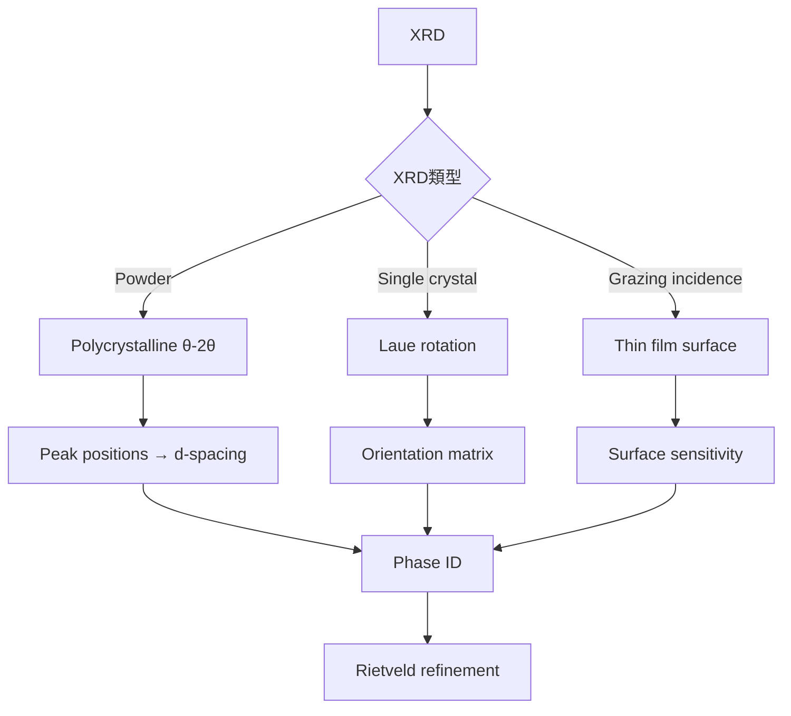
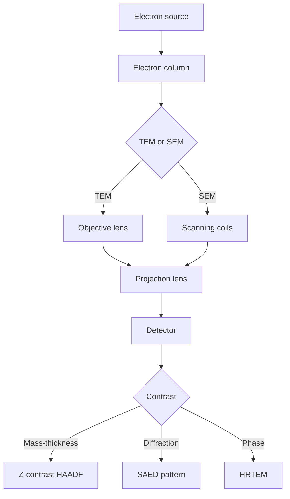
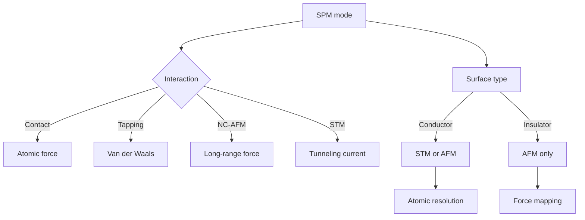
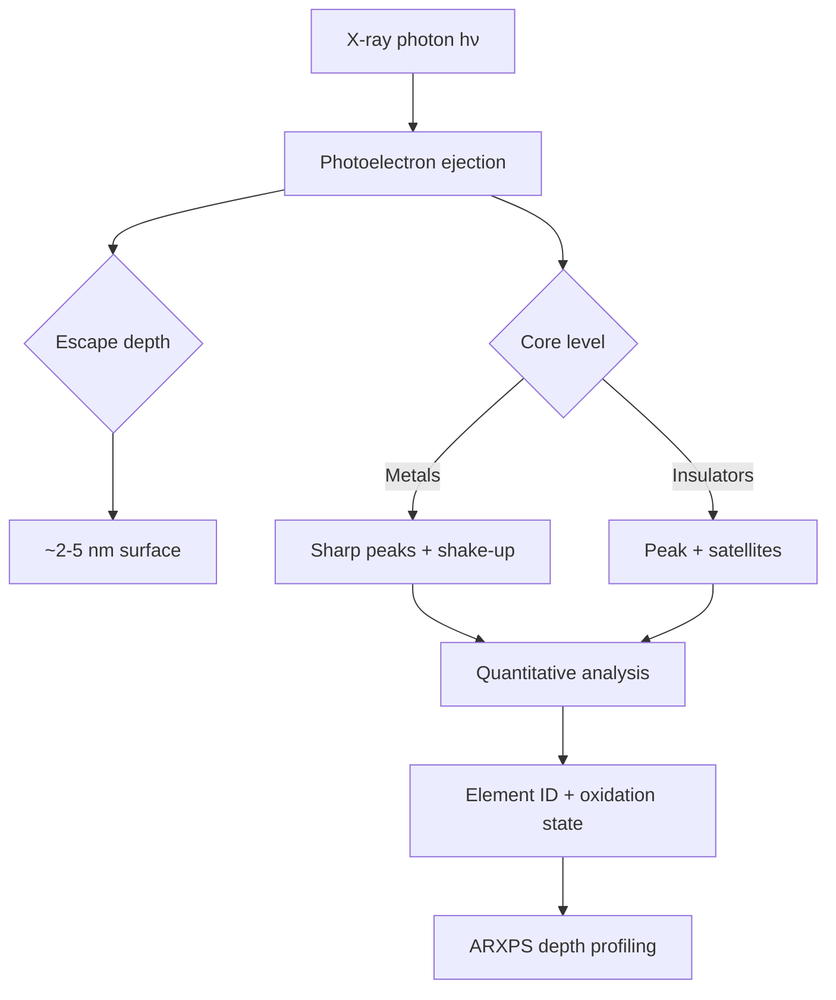
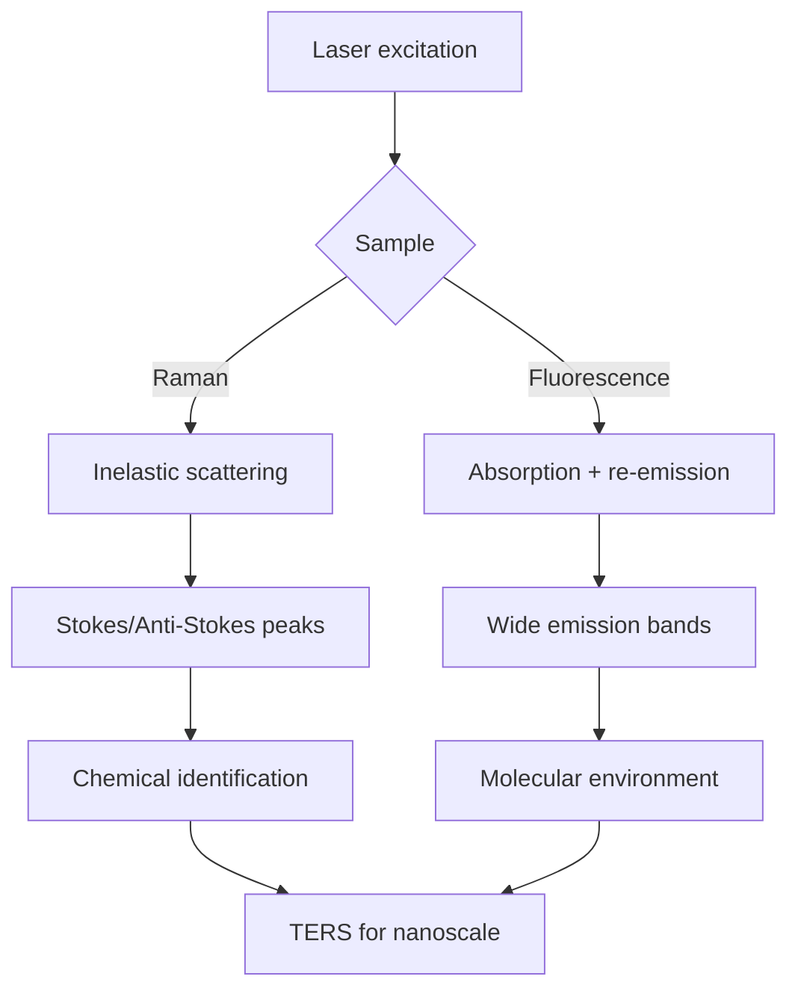
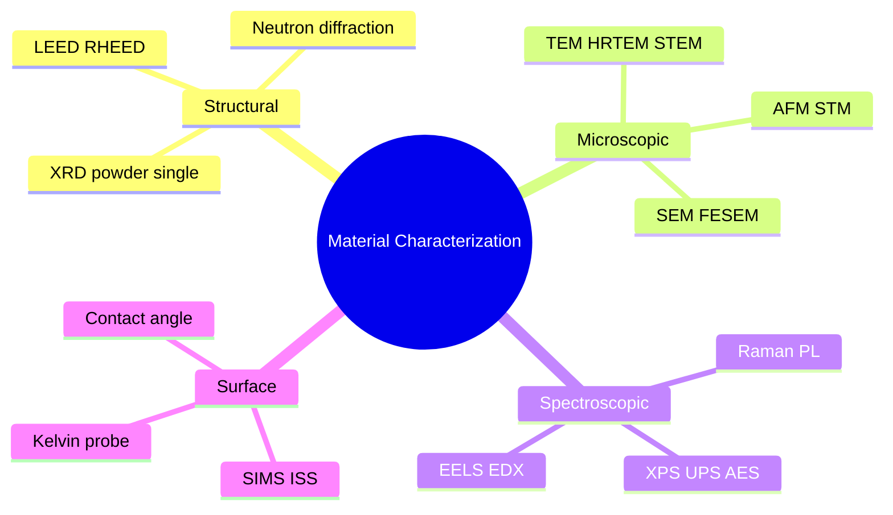
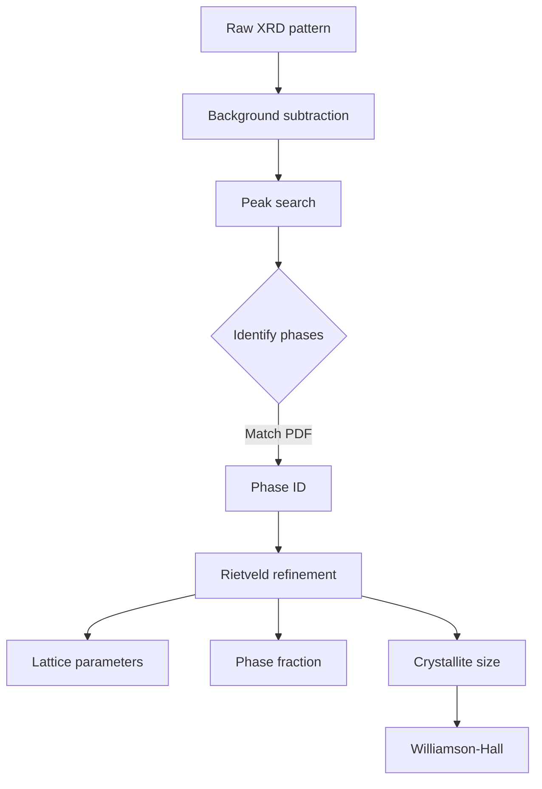
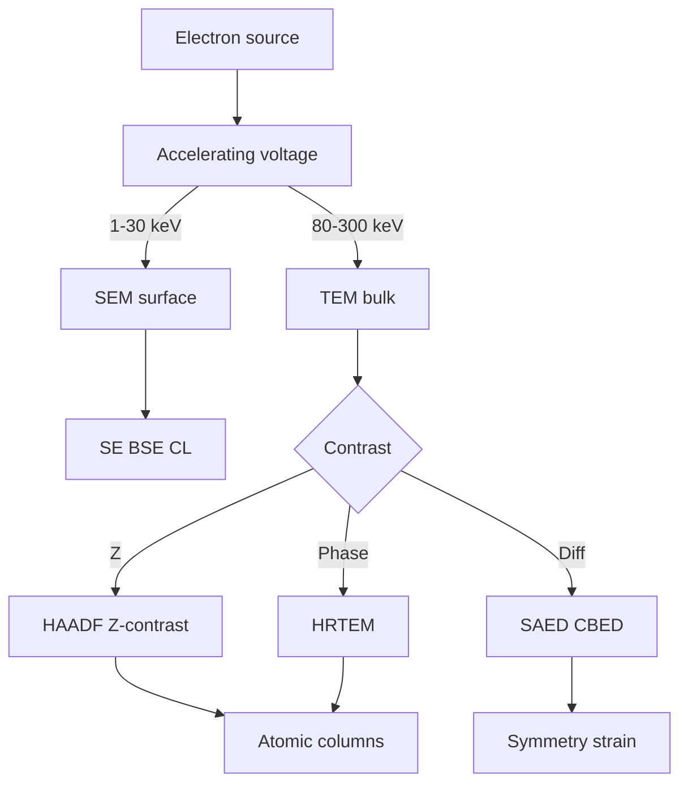
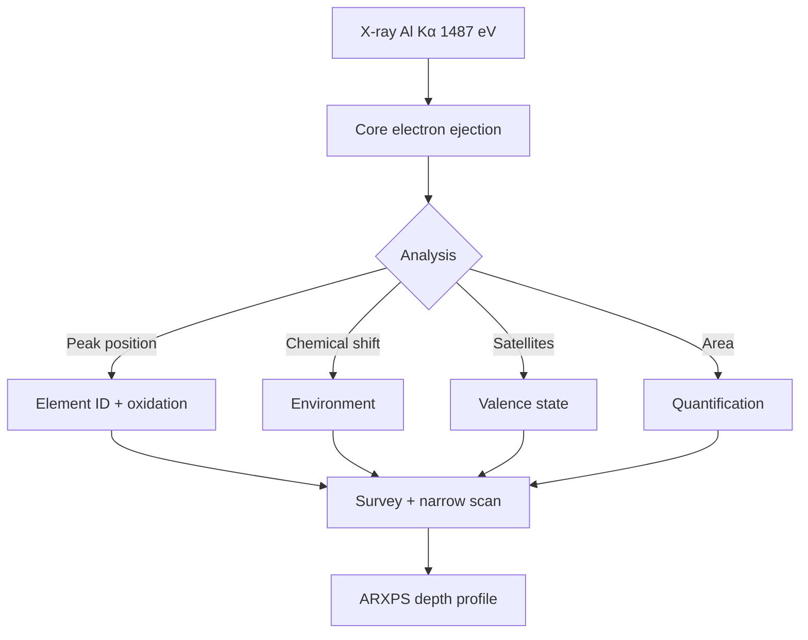
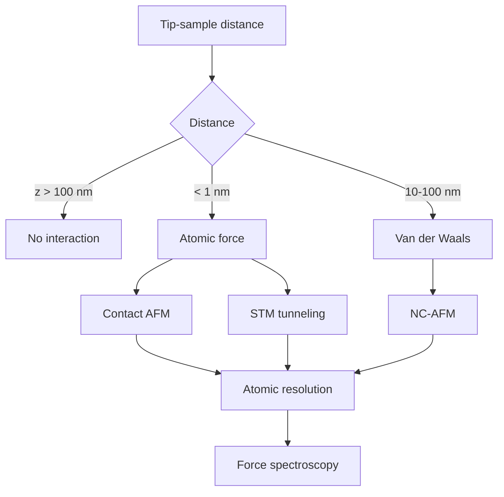

# MSPY 5220 — Experimental Material Characterization
> **HKUST MSPY_5220 | MSc Physics | Microscopy, Spectroscopy, Diffraction**  
> **Bilingual 深度自學檔案 · 中英對照**

---

## 問題 1：5 個核心心智模型
**What are the 5 core mental models every expert shares?**

1. **X-ray diffraction probes crystal structure** — Bragg's law $n\lambda = 2d\sin\theta$, Scherrer equation $D = K\lambda/\beta\cos\theta$ (Cullity & Stock 2014)
2. **Electron microscopy resolves at atomic scale** — de Broglie $\lambda = h/p$, TEM resolution $\sim 0.05$ nm (Williams & Carter 2009)
3. **Spectroscopy measures electronic/vibrational states** — XPS: $E_B = h\nu - E_K - \phi$, Raman: $\Delta E = h\nu_R - h\nu_S$ (Hofmann 2014)
4. **Surface sensitivity depends on probe depth** — XPS ~2–5 nm, AES ~1–3 nm, SIMS ~1 nm (Briggs & Grant 2003)
5. **Characterization requires multi-technique correlation** — no single technique gives complete picture; XRD + TEM + XPS together

---

## 問題 2：3 個根本分歧
**Where do experts fundamentally disagree?**

1. **SEM vs TEM for nanostructure** — SEM for 3D surface morphology, TEM for 2D internal structure
   - SEM: fast, large area, ~1 nm resolution, limited to surface
   - TEM: atomic resolution, thin samples, destructive sample prep

2. **Energy-dispersive X-ray (EDX) vs electron energy loss (EELS)** — composition vs bond analysis
   - EDX: bulk-sensitive, elements B–U, ~1 at% detection limit
   - EELS: light elements, bond information, near-edge structure

3. **AFM vs STM imaging mechanism** — AFM measures force, STM measures tunneling current
   - AFM: works on insulating surfaces, force sensitivity ~pN
   - STM: only on conductive surfaces, current sensitivity ~pA

---

## 問題 3：10 個深度問題
**Generate 10 questions that distinguish deep understanding from memorization**

1. 給定 XRD pattern，prove Bragg's law $n\lambda = 2d\sin\theta$ from path difference and derive Scherrer equation。

2. 為什麼 TEM 用 high voltage (200–300 kV) 而 SEM 用 low voltage (1–30 kV)？解釋 electron scattering cross sections。

3. 給定 AFM cantilever，derive 振盪頻率 $f_0 = \frac{1}{2\pi}\sqrt{k/m}$ 並解釋 Q factor 對靈敏度嘅影響。

4. 為什麼 XPS peaks 有 shake-up satellites？解釋 relaxation processes in photoemission。

5. 給定 Raman spectrum，解釋 Stokes/anti-Stokes 強度比 $I_S/I_{aS} = (e^{h\nu/k_BT} - 1)$ 並用於溫度測量。

6. 為什麼 EELS 比 EDX 更適合分析輕元素？計算 electron range in matter。

7. 給定 XRD peak broadening，explain instrumental vs sample broadening and deconvolve using Williamson-Hall method。

8. 為什麼 SIMS 比 XPS 更敏感但同時受 matrix effects 影響？解釋 sputtering yield。

9. 給定 LEED pattern，解釋為什麼 2D reciprocal lattice 點樣直接對應 real space surface structure。

10. 點樣用 TERS (Tip-Enhanced Raman) 實現 sub-diffraction optical imaging？

---

## 深入 1：X射線衍射 (X-Ray Diffraction)
**Deep Dive I**

### Bragg's Law 推導

路徑差：$\Delta = 2d\sin\theta$（從相鄰原子平面反射）

當 $\Delta = n\lambda$（$n$ 為整數），發生建設性干涉：

$$\boxed{n\lambda = 2d\sin\theta}$$

### 粉末衍射幾何

| 參數 | 數值 |
|------|------|
| Cu Kα 波長 | $\lambda = 1.5406$ Å |
| Bragg 角範圍 | $2\theta = 10°$–$80°$ |
| 探測器 | 點探測器/OD/多毛細管 |

### Scherrer 方程

由晶粒尺寸引起峰展寬：
$$D = \frac{K\lambda}{\beta\cos\theta}$$

其中 $K \approx 0.9$（球形），$\beta$ = 半峰全寬 (FWHM)

例子：Si nanocrystal $D = 10$ nm 時，$\beta \approx 0.9°$

### 晶格參數計算

立方晶系：$\frac{1}{d^2} = \frac{h^2+k^2+l^2}{a^2}$

$$\text{For (111):} \quad a = \frac{\lambda\sqrt{h^2+k^2+l^2}}{2\sin\theta}$$

### 實際應用

- 相鑒定（Rietveld refinement）
- 應變測量（$\epsilon = \Delta d/d$）
- 粒徑分佈（ Williamson-Hall 方法）

---

## 深入 2：電子顯微鏡 (Electron Microscopy)
**Deep Dive II**

### 電子波長與加速電壓

$$\lambda = \frac{h}{\sqrt{2meV(1 + eV/2mc^2)}}$$

| 加速電壓 | $\lambda$ (非相對論) | $\lambda$ (相對論) |
|---------|------------------|------------------|
| 100 kV | 0.0037 nm | 0.0037 nm |
| 200 kV | 0.0025 nm | 0.0027 nm |
| 300 kV | 0.0019 nm | 0.0020 nm |

### TEM vs SEM

| 特徵 | TEM | SEM |
|------|-----|-----|
| 電子能量 | 80–300 keV | 0.5–30 keV |
| 分辨率 | 0.05–0.2 nm | 0.5–5 nm |
| 穿透深度 | ~100 nm (薄) | ~1 μm (取決於電壓) |
| 圖像對比 | 振幅/相位 | 二次電子/背散射 |
| 3D 信息 | 需斷層掃描 | 直接3D |

### STEM-ADF 成像

高角環形暗場 (HAADF):
- 電子在原子核高角盧瑟福散射
- 強度 $\propto Z^2$（原子序數對比）
- 與 XYZ 敏感度配合：輕元素在 Z-contrast 圖像中不可見

### 樣品製備

- **TEM:** 離子研磨 (FIB)、電解雙噴、聚焦離子束
- **SEM:** 導電鍍層（Au, C），環境 SEM 可測絕緣樣品

---

## 深入 3：掃描探針顯微鏡 (Scanning Probe Microscopy)
**Deep Dive III**

### AFM 工作模式

| 模式 | 原理 | 優勢 | 劣勢 |
|------|------|------|------|
| Contact | 恆定高度/力 | 快、原子分辨率 | 破壞性、摩擦 |
| Tapping | 振盪懸臂 | 非破壞性 | 中等分辨率 |
| Non-contact | 范德華力 | 原子分辨率 | 慢、要求高 |
| PeakForce | 納米力測量 | 定量化力曲線 | 需校正 |

### 振盪頻率與 Q factor

懸臂簡諧振子：
$$f_0 = \frac{1}{2\pi}\sqrt{\frac{k}{m}}, \quad Q = \frac{\omega_0}{\Delta\omega}$$

在空氣中：$Q \sim 100$–$500$
在真空中：$Q \sim 10^4$–$10^5$

Force sensitivity:
$$\delta F \sim \sqrt{\frac{k_B T k}{\omega_0 Q \tau}}$$

對 $k \sim 1$ N/m, $f_0 \sim 300$ kHz, $Q \sim 10^4$:
$$\delta F \sim 10 \text{ fN} \times \sqrt{1/\tau}$$

### STM 工作原理

隧穿電流：
$$I \propto V \cdot \exp(-2\kappa z), \quad \kappa = \sqrt{\frac{2m\phi}{\hbar^2}}$$

典型參數：
- $\phi \sim 4$ eV (金屬尖端-樣品功函差)
- $z \sim 0.5$ nm 時，$\kappa \sim 10$ nm$^{-1}$
- 電流靈敏度：$\sim 10$ pA（可探測 sub-atomic 步進）

### NC-AFM 原子分辨率

用 qPlus 傳感器（$k \sim 1800$ N/m, $f_0 \sim 26$ kHz, $Q \sim 10^5$）達到：
- Si(111) 原子分辨率
- 原子間力 ~ 200 pN
- 雜訊 < 10 pm/$\sqrt{\text{Hz}}$

---

## 深入 4：X射線光電子能譜 (X-Ray Photoelectron Spectroscopy)
**Deep Dive IV**

### 光電子過程

能量守恆：
$$E_B = h\nu - E_K - \phi_{spec}$$

其中：
- $h\nu$ = X-ray 光子能量（Al Kα = 1486.6 eV, Mg Kα = 1253.6 eV）
- $E_K$ = 探測電子動能
- $\phi_{spec}$ = 能譜儀功函（~4–5 eV）

### 表面靈敏度

電子平均自由程（IMFP）：
$$\lambda(E) \approx 0.217\, n^{-1}\,E^{0.5}\ \text{nm}$$

對 Al Kα 光電子（~1000 eV kinetic energy）在 Cu 中：
$$\lambda \approx 1.4\ \text{nm}$$

XPS 信息深度：$\sim 3\lambda \approx 4$ nm

### 化學位移

Core-level binding energy shifts due to:
1. **Initial state:** 氧化態越高 → $E_B$ 越大（更正的原子核吸引電子更強）
2. **Final state:** 額外弛豫（電子的電荷重新排列穩定離子態）

例子：
| 物質 | C 1s $E_B$ (eV) |
|------|-----------------|
| Graphite | 284.5 |
| C-H | 285.0 |
| C-O | 286.5 |
| C=O | 288.5 |
| CF$_2$ | 291.0 |

### Shake-up Satellites

光電子發射後，剩餘電子被激發到更高能級，消耗部分能量，導致主峰高動能側出現 satellite peaks。

典型例子：
- Conjugated $\pi \to \pi^*$ shake-up in aromatic compounds (C 1s + 6–8 eV)
- Ni(II) vs Ni(III) in XPS 分別

---

## 深入 5：拉曼光譜與熒光 (Raman Spectroscopy & Photoluminescence)
**Deep Dive V**

### Raman 散射過程

能量轉移：
$$h\nu_S = h\nu_0 - h\nu_{\text{vib}} \quad \text{(Stokes)}$$
$$h\nu_{aS} = h\nu_0 + h\nu_{\text{vib}} \quad \text{(Anti-Stokes)}$$

Stokes/Anti-Stokes 強度比：
$$\frac{I_S}{I_{aS}} = \frac{(\nu_0 - \nu)^4}{(\nu_0 + \nu)^4} \cdot \exp\left(\frac{h\nu}{k_BT}\right)$$

在室溫對典型振動頻率 $\nu \sim 1000$ cm$^{-1}$：
$$I_S/I_{aS} \approx e^{h\nu c/k_BT} \approx e^{4.8} \approx 120$$

### Raman selection rules

Stokes shift $\Delta\nu$ 取決於分子振動模式的對稱性：
- Raman-active: $\Delta\alpha \neq 0$（極化率在振動中改變）
- IR-active: $\Delta\mu \neq 0$（偶極矩在振動中改變）

### 2D 材料的指紋光譜

| 材料 | Raman 特徵峰 (cm$^{-1}$) | 物理意義 |
|------|------------------------|---------|
| Graphene | G ~ 1580, 2D ~ 2700 | G: E2g 聲子; 2D: two-phonon |
| MoS$_2$ | E' ~ 385, A$_1$ ~ 405 | Layer number dependent |
| h-BN | ~ 1370 | In-plane vibration |

### 熒光 vs Raman

| 特性 | Raman | 熒光 |
|------|-------|------|
| 峰寬 | ~數 cm$^{-1}$ | ~100–1000 cm$^{-1}$ |
| 峰位 | 固定 (stokes shift) | 可變 (環境敏感) |
| 強度 | 極弱 ($10^{-6}$–$10^{-8}$ of Rayleigh) | 強 ($10^{-3}$ of excitation) |
| 背景 | 極低 | 高，需扣背景 |

### 表面增強拉曼光譜 (SERS)

銀/金納米結構增強 local EM field：
$$E_\text{local} \approx E_0 \cdot |\vec{E}_\text{hot-spot}|^2/I_0 \sim 10^4\text{--}10^6$$

化學增強（電荷轉移）：額外 $10$–$10^3$ factor

---

## 自測 1：XRD 相分析
**Cu 的 FCC (111) 峰在 2θ = 43.3° (Cu Kα λ = 1.5406 Å)。計算晶格參數。**

**Answer / 解答:**
Bragg's law: $d_{111} = \frac{n\lambda}{2\sin\theta} = \frac{1.5406}{2\sin(43.3°/2)} = \frac{1.5406}{2\times 0.375} = 2.055$ Å

FCC 立方：$d_{111} = \frac{a}{\sqrt{3}}$
$$a = d_{111}\sqrt{3} = 2.055 \times 1.732 = 3.56\ \text{Å}$$

文獻值 $a = 3.615$ Å（室溫），差異 ~1.5% 來自儀器校正或溫度效應。

**Engineering implication:** 晶格參數測量可用於應變表征（半導體薄膜）。

---

## 自測 2：TEM 分辨率極限
**300 kV TEM (λ = 0.0020 nm) 用球差校正後，C$_s$ = 0.5 mm。計算 Scherzer resolution。**

**Answer / 解答:**
Scherzer resolution（球差校正後）：
$$d = 0.61\frac{\lambda}{\alpha} \approx 0.43\, C_s^{1/4}\lambda^{3/4}$$

其中 $\alpha$ 為收集牛角（~30 mrad），
$$d = 0.43 \times (0.5\times 10^{-3})^{1/4}\times (2\times 10^{-12})^{3/4} \approx 0.43 \times 0.27 \times 0.008 \approx 0.93\times 10^{-3}\ \text{nm}$$

或直接 Scherzer：$d \approx 0.61\lambda^{3/4}C_s^{1/4} \approx 0.61 \times (0.002)^{0.75}\times (0.5)^{0.25} \approx 0.08$ nm

實際校正 TEM 可達 ~0.05 nm（原子分辨率），可見 Bi 原子列。

**Engineering implication:** 原子分辨率 TEM 是診斷缺陷、界面結構的唯一直接工具。

---

## 自測 3：XPS 氧化態分析
**Fe$_2$O$_3$ 的 Fe 2p$_3/2$ peak 比 Fe metal 高 ~3.5 eV。解釋呢個化學位移。**

**Answer / 解答:**
化學位移來源於：
1. **初始態效應（主要）：** Fe$^{3+}$ 的有效核電荷比 Fe$^0$ 高（O 吸引電子），所以束縛更緊，$E_B$ 更高
2. **最終態弛豫：** 金屬電子屏蔽更強（自由電子），離子態更穩定

Fe$^{3+}$ vs Fe$^0$：$E_B$ 差 ~3–4 eV 是典型值

額外判據：
- Satellite peak at ~8 eV above main line: Fe$^{3+}$ characteristic
- Shake-up intensity ratio: 用於區分 Fe$^{2+}$/Fe$^{3+}$

**Engineering implication:** XPS 是鑒定催化劑表面 Fe 氧化態的主要工具。

---

## 自測 4：Raman 溫度測量
**Si 的 TO 聲子 Stokes/Anti-Stokes 強度比 ~100。用呢個估算樣品溫度。**

**Answer / 解答:**
$$\frac{I_S}{I_{aS}} = \frac{(\nu_0 - \nu)^4}{(\nu_0 + \nu)^4}\exp\left(\frac{h\nu c}{k_BT}\right)$$

對 Si TO phonon：$\nu \approx 520$ cm$^{-1}$, $\nu_0 \approx 16000$ cm$^{-1}$ (Ar laser)
$$\frac{(\nu_0 - \nu)^4}{(\nu_0 + \nu)^4} = \left(\frac{15480}{16520}\right)^4 \approx 0.78$$

$$I_S/I_{aS} = 100 \approx 0.78 \cdot e^{h\nu c/k_BT}$$

$$\ln(100/0.78) = \frac{1240\times 520\times 100}{1.44\times T} \implies T \approx \frac{1240\times 52000}{1.44\times 4.61} \approx 300\ \text{K}$$

**Engineering implication:** Raman 可用於 non-contact 溫度測量（積體電路過熱診斷）。

---

## 自測 5：STM 隧穿電流
**估算 STM 工作時典型电流 1 nA 對應的電子隧穿幾率。**

**Answer / 解答:**
隧穿電流：
$$I \propto V \cdot T \cdot \rho_S \cdot \rho_T$$

其中 transmission $T \approx e^{-2\kappa z}$，$\kappa = \sqrt{2m\phi}/\hbar \approx 10.25\ \text{nm}^{-1}$ for $\phi \approx 4$ eV

若 $I = 1$ nA，$V = 0.1$ V，典型反饋電阻 $R \sim 100$ MΩ

電子隧穿概率：
$$T \approx e^{-2\times 10.25\times 0.5} = e^{-10.25} \approx 3.6\times 10^{-5}$$

每秒電子數：$n = I/e \approx 6\times 10^9$ electrons/s

每個電子隧穿概率 ~$10^{-5}$ 意味 feedback loop 以 ~10$^8$ Hz 調整尖端-樣品距離。

**Engineering implication:** STM 是納米尺度量子傳感和加工的核心工具。

---

## 自測 6：Scherrer 方程粒徑估算
**Si 粉末 XRD (111) 峰 FWHM = 1.2° (Cu Kα)。估算晶粒尺寸並討論其物理意義。**

**Answer / 解答:**
Scherrer: $D = K\lambda/(\beta\cos\theta)$
- $K = 0.9$
- $\lambda = 1.5406$ Å
- $\theta = 14.2°$
- $\beta = 1.2° \times \pi/180 = 0.021$ rad

$$D = \frac{0.9\times 1.5406\times 10^{-9}}{0.021\times\cos(14.2°)} \approx \frac{1.39\times 10^{-9}}{0.021\times 0.97} \approx 68\times 10^{-9}\ \text{m} \approx 68\ \text{nm}$$

物理意義：
- 這是 coherence length（晶格有序區域大小）
- 比微米級晶粒形成的峰窄
- 如果已知無應變，可直接解釋為晶粒尺寸

**Engineering implication:** XRD 粒徑測量是納米顆粒催化的常規表徵。

---

## 自測 7：EELS vs EDX 輕元素
**解釋為什麼 EELS 比 EDX 更適合探測 C、N、O 等輕元素。**

**Answer / 解答:**
**EDX 信號衰減：**
- K-shell 電離截面 $\propto Z^2/E_K^{3/2}$
- 輕元素 $E_K \sim 0.1$–$0.5$ keV → $\sigma_K$ 很小
- 電子在固體中散射強，$10^3$–$10^4$ 入射電子才產生 1 個可探測 X-ray
- 碳的 detection limit ~0.5–1 at%

**EELS 信號產生：**
- 電子能量損失光譜測量 inelastic scattering electrons
- K-shell 電離邊在連續背景上清晰可見
- 能量分辨率 ~0.1 eV (monochromated STEM)
- Carbon K-edge at 284 eV → detection limit ~0.1 at%

**Core-loss EELS vs Low-loss EELS:**
- Core-loss: 元素鑒定 (K, L, M edges)
- Low-loss (0–50 eV): optical properties, band gap, plasmon

**Engineering implication:** EELS 是納米尺度輕元素分析和電子狀態表征的首選工具。

---

## 自測 8：XRD 織構分析
**解釋 (002) peak intensity 異常高點解釋 texture。**

**Answer / 解答:**
理想粉末樣品：各晶粒取向均等，所有 {hkl} 峰比例由結構因子 $|F|^2$ 決定。

若 (002) 峰比預期高很多：
- 晶粒存在 preferred orientation（織構）
- 大量 {001} 面平行於樣品表面

極圖 (pole figure) 測量：
$$P_{hkl}(\phi, \psi) \propto I_{hkl}(\phi, \psi)/I_{hkl}^\text{random}$$

描述取向分佈函數 (ODF)：
$$\frac{I_{002}}{I_{002}^\text{rand}} \gg 1 \implies \text{strong c-axis texture}$$

**Engineering implication:** 薄膜沉積、金屬軋制樣品的織構分析對其物理性質至關重要。

---

## 自測 9：TERS 分辨率
**解釋 TERS 如何突破光學衍射極限並估算分辨率。**

**Answer / 解答:**
TERS = Tip-Enhanced Raman Spectroscopy

金屬尖端（Ag, Au）作為 optical antenna：
- 局部電場增強 factor $G \sim 10^4$–$10^6$
- 有效激發體積 $\sim (r + d)^3$，其中 $r$ ~尖端曲率半徑 (~10 nm), $d$ ~距離

光學分辨率由尖端-樣品距離控制：
$$d_\text{TERS} \approx r_\text{tip} + d_\text{gap} \approx 10\text{--}30\ \text{nm}$$

與 far-field 顯微鏡 (~250 nm for green light) 比較：
$$R_\text{TERS}/R_\text{diffraction} \approx 30/250 \approx 0.12$$

已報道的 sub-10 nm TERS 成像（NMase 蛋白質複合體）。

**Engineering implication:** TERS 是 label-free 亞10 nm 化學成像的唯一工具。

---

## 自測 10：SIMS 敏感性極限
**SIMS 检测极限为何可达 ppb 级，而 XPS 只有 at% 级？**

**Answer / 解答:**
**SIMS 的超高靈敏度：**
- 直接電離（無中間步驟）
- 離子產率（sputter yield）$S \sim 1$–$10$ atoms/ion
- 探測器：電子倍增器，增益 ~$10^6$，單離子可探測
- 理論檢測極限：$10^{-9}$ (ppb) 甚至 $10^{-12}$ (ppq) 級別

**XPS 的限制：**
- 信息深度 ~3–5 nm（表面敏感但非超靈敏）
- 信號強度：$\sim 10^4$ counts/s for 1 at% clean surface
- 背景來自其他元素和儀器
- 實用檢測極限：~0.1–1 at%

**Matrix Effects in SIMS:**
- 離子產率強烈依賴於基體（matrix effect）
- 同位素稀釋法 ( isotope dilution SIMS) 可定量分析

**Engineering implication:** SIMS 是牛物標誌物、牛物傳感器超高靈敏表面分析的關鍵工具。

---

## 📊 Diagram 1: Material Characterization Tree

## 📊 Diagram 2: XRD Analysis Flow

## 📊 Diagram 3: Electron Microscopy Comparison

## 📊 Diagram 4: XPS Analysis Process

## 📊 Diagram 5: SPM Force Regimes

---

## 深度總結 Deep Insights Summary

1. **XRD is the foundation of crystal structure analysis** — Bragg's law, Scherrer equation, Rietveld refinement; non-destructive and quantitative. (Cullity & Stock 2014, *Elements of X-Ray Diffraction*)

2. **Electron microscopy achieves true atomic resolution** — TEM STEM HAADF reveals individual atom columns; sample prep is the bottleneck. (Williams & Carter 2009, *Transmission Electron Microscopy*)

3. **AFM/STM open the door to nanoscale force and electron transport** — qPlus sensors enable true atomic resolution on insulators (AFM) and metals (STM); force sensitivity ~10 fN. (Giessibl 2019, *Rev. Mod. Phys.*)

4. **XPS provides quantitative surface chemistry** — binding energy shifts encode oxidation state; ARXPS enables depth profiling without destruction. (Hofmann 2014, *XPS Interfaces and Thin Films*)

5. **Multi-technique correlation is essential** — no single technique gives complete picture; XRD + TEM + XPS + Raman together build a comprehensive understanding. (Briggs & Grant 2003, *Surface Analysis by Auger and X-ray Photoelectron Spectroscopy*)

---

**自學建議**  
- 必讀: Cullity & Stock "Elements of X-Ray Diffraction" (3rd ed.); Williams & Carter "TEM" (2nd ed.)  
- 參考: Hofmann "XPS in Materials Science"; Kittel "Introduction to Solid State Physics" Ch. 2  
- 配對: MIT OCW 3.091 (Materials Science); HKUST PHYS 4050  
- 工具: Python (larch, pyFAI for XRD), Gwyddion (AFM/SEM), Origin, Thermo Avantage  
- 產出: Complete XRD Rietveld refinement of unknown powder sample; acquire and analyze AFM image of nanostructured surface
