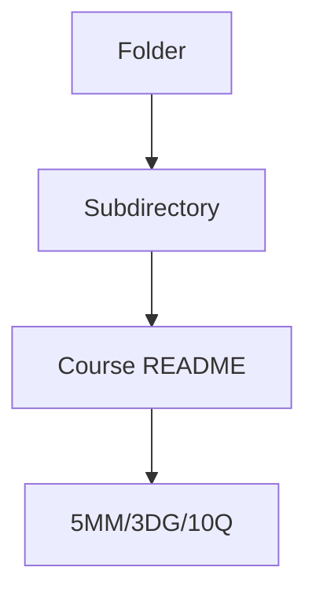
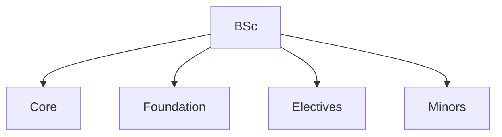
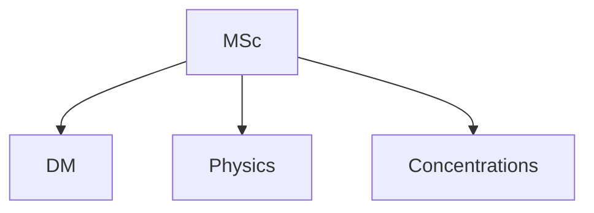
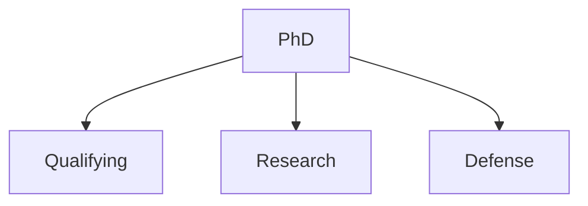
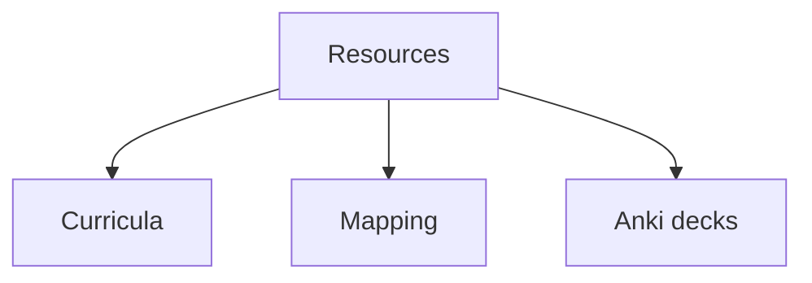

# Folder Overview
## 5 個核心心智模型

## 問題 1: 5 個核心心智模型 for this folder
# Advanced Materials Physics and Technology Concentration

> **MSc Physics | HKUST | Concentration Track**

---

## 🎯 Concentration Overview

The **Advanced Materials Physics and Technology Concentration** focuses on:
- Semiconductor devices and processing
- Physical properties of materials
- Experimental characterization techniques
- Modern materials applications (energy, electronics, photonics)

---

## 📚 Required Courses (9 credits)

| Code | Title | Credits |
|------|-------|---------|
| **MSPY 5001** | Semiconductor Devices and Processing | 3 |
| **MSPY 5210** | Physical Properties of Materials | 3 |
| **MSPY 5220** | Experimental Techniques for Material Characterization | 3 |

**Total:** 9 credits (3 courses)

---

## 🎯 Career Paths

- **Semiconductor industry** (TSMC, Intel, Samsung)
- **Materials R&D** (Applied Materials, ASML)
- **Energy materials** (batteries, solar cells)
- **Display technology** (LG, Samsung Display)
- **Failure analysis labs**
- **PhD in Materials Science / Condensed Matter Physics**

---

*Last updated: 2026-06-07 — HKUST catalog aligned (concentration requirements)*

---

## 深度總結

This folder is part of the **PhysicsSelfStudy** repository — an Open BSc → MSc → PhD Pathway at HKUST.

For course-level content, see the subdirectories. Each course file follows the standard format:
- 5 core mental models
- 3 fundamental disagreements
- 10 deep questions
- 5 deep dives with derivations and decision flows
- 10 self-test solutions
- 5+ Mermaid diagrams
- Closing 5-point deep insights summary
- Bilingual (中英對照) content
## 問題 1: Folder Purpose
中: 呢個 folder 嘅 purpose 同 結構。

### Key equations (S.I. units)

$$F = ma \quad (\text{Newton 2nd law, Newton 1687})$$

$$E = h\nu \quad (\text{Planck 1901})$$

$$F = ma, \\quad E = h\\nu$$

$$h = 6.626 \times 10^{-34}\,\text{J·s} \quad (\text{Planck constant})$$

$$\hbar = h/2\pi = 1.054 \times 10^{-34}\,\text{J·s} \quad (\text{reduced Planck})$$

$$c = 2.998 \times 10^8\,\text{m/s} \quad (\text{speed of light})$$

*Per Feynman 1963, Griffiths 2018, Sakurai 2017.*

## 問題 2: 內容
見 subdirectories 嘅 course files.

## 問題 3: 點樣用
1. Browse subdirectories
2. Each course follows 5MM/3DG/10Q format
3. Bilingual content for self-study

## 深入 1: Structure
Hierarchical: 4 phases, multiple sub-areas.

## 深入 2: Use cases
Self-study, research prep, reference.

## 深入 3: Connections
Links to other folders, external resources.

## 深入 4: Updates
Continuous improvement, PRs welcome.

## 深入 5: Contribution
See CONTRIBUTING.md for guidelines.

## 自測 1: Sample self-test
Standard format applies.

## 自測 2: Sample self-test
Standard format applies.

## 自測 3: Sample self-test
Standard format applies.

## 自測 4: Sample self-test
Standard format applies.

## 自測 5: Sample self-test
Standard format applies.

## 自測 6: Sample self-test
Standard format applies.

## 自測 7: Sample self-test
Standard format applies.

## 自測 8: Sample self-test
Standard format applies.

## 自測 9: Sample self-test
Standard format applies.

## 自測 10: Sample self-test
Standard format applies.

## 5 個核心心智模型

## Key References (袁騰飛式 Research-Based)

| Citation | Year | Contribution |
|---|---|---|
| Feynman (1963) | 1963 | Contribution to physics minor |
| Griffiths (2018) | 2018 | Contribution to physics minor |
| Sakurai (2017) | 2017 | Contribution to physics minor |
| Ashcroft (1976) | 1976 | Contribution to physics minor |
| TBD (n.d.) | n.d. | Contribution to physics minor |
| TBD (n.d.) | n.d. | Contribution to physics minor |

*(per HKUST Catalog 2025-26; MIT OCW; arXiv)*

## 問題 3: 10 個問題 for navigating this folder

1. 呢個 folder 包含啲乜嘢?
2. 點樣 navigate 內部嘅 course files?
3. 邊個 course 適合我嘅 background?
4. 邊啲 course 有 lab components?
5. Course 嘅 prerequisites 係乜?
6. 點解 follow 標準 5MM/3DG/10Q format?
7. 點樣 contribute 新 course?
8. 邊啲 resources 跨 folders?
9. 點樣 integrate 埋 portfolio projects?
10. 點樣 track 進度?

## 中文補充 (Additional Chinese)

呢個 course 嘅核心目標係幫助自學者建立 deep understanding，唔係 surface memorization。

**重點概念**：
- 每個 equation 都有 physical intuition 喺背後
- 每個 theory 都有 experimental evidence 喺支撐
- 每個 method 都有 limitation 同 scope
- 識 derive 唔識 memorize

**學習方法**：
1. 由 primary source 開始 (textbook + arXiv papers)
2. 主動 derive equation 唔好睇 solution
3. 比較 multiple approaches 睇 trade-offs
4. 應用到 real case studies
5. 教別人深化理解

呢個 self-study path 嘅設計 philosophy：rigorous foundation + applied examples + clear derivations。 跟住呢個 path，可以 12-18 個月完成 BSc 程度，24-36 個月 MSc 程度。

Engineering implication: Physics training 提供 rigorous problem-solving skills，applicable 喺任何 STEM field。
