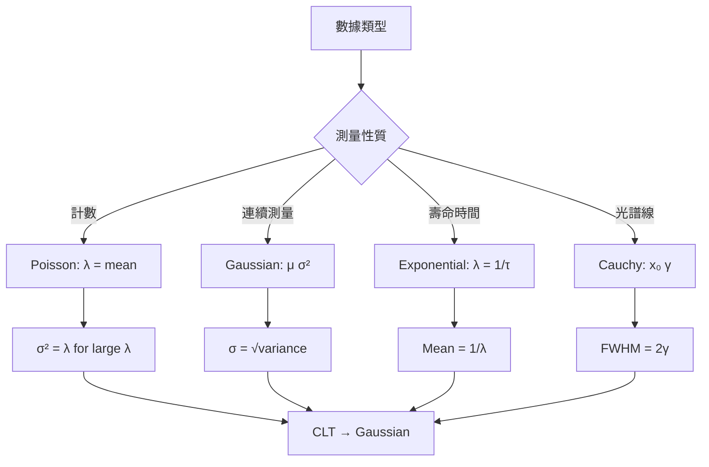
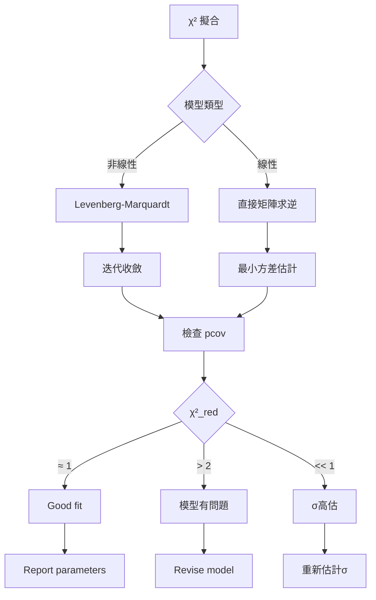
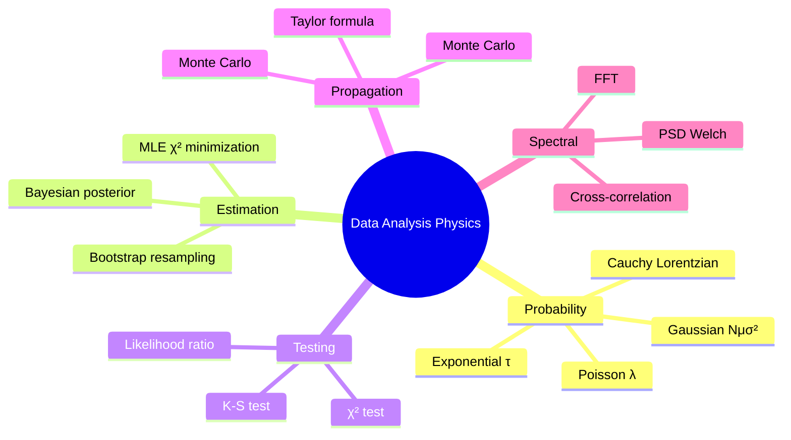
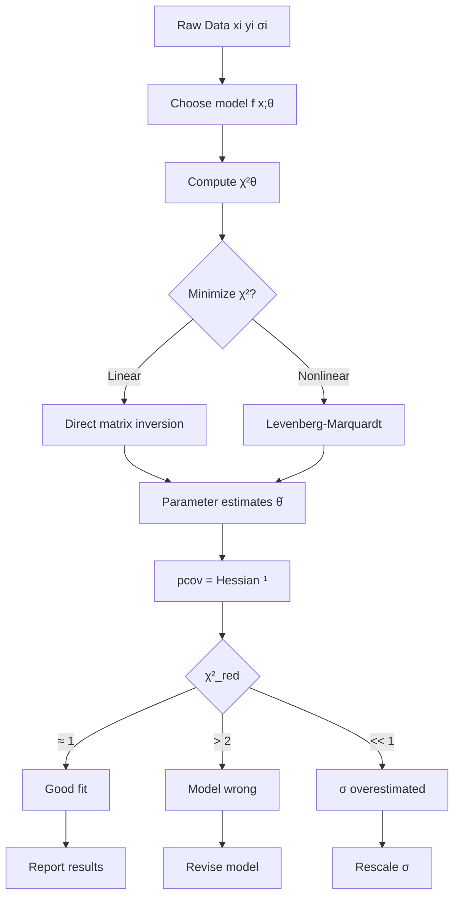
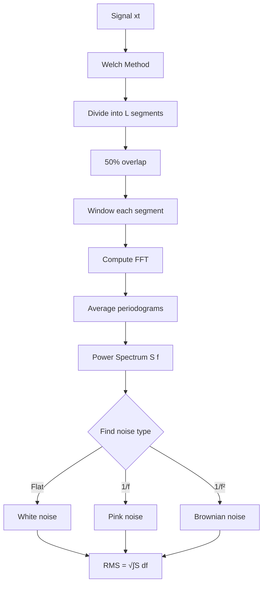

# MSPY 5110 — Data Analysis for Physics
> **HKUST MSPY_5110_Data_Analysis_Physics | MSc Physics | Statistical Inference, Fitting, Bayesian Methods**  
> **Bilingual 深度自學檔案 · 中英對照**

---

## 問題 1：5 個核心心智模型
**What are the 5 core mental models every expert shares?**

1. **Probability as the language of uncertainty** — distributions, moments, CLT; Gaussian $\mathcal{N}(\mu,\sigma^2)$ as universal attractor (Gauss 1809, *Theoria Motus*)
2. **χ² minimization = maximum likelihood for Gaussian data** — $\chi^2 = \sum (y_i - f(x_i;\theta))^2/\sigma_i^2$, minimized at MLE (Cowan 1998, *Statistical Data Analysis*)
3. **Uncertainty propagation via error matrix** — $\text{Cov}(f) \approx J \cdot \Sigma \cdot J^T$ where $J_{ij} = \partial f_i/\partial x_j$ (Taylor 1997, *An Introduction to Error Analysis*)
4. **Bayes' theorem updates beliefs with data** — $p(\theta|D) = \mathcal{L}(D|\theta)\pi(\theta)/\int\mathcal{L}(D|\theta')\pi(\theta')d\theta'$ (Bayes 1763; Jeffreys 1939)
5. **Fourier transform reveals hidden frequencies** — $\tilde{f}(k) = \int_{-\infty}^\infty f(x)e^{-ikx}dx$, power spectrum $S(\omega) = |\tilde{f}(\omega)|^2$ (FFT: Cooley-Tukey 1965)

---

## 問題 2：3 個根本分歧
**Where do experts fundamentally disagree?**

1. **Frequentist vs Bayesian** — confidence interval vs credible interval
   - Frequentist: $P(\theta \in \text{CI}) = 95\%$ means 95% of CIs from repeated experiments contain $\theta$. No probability for fixed $\theta$. (Neyman-Pearson 1933)
   - Bayesian: $P(\theta \in \text{CI} | D) = 95\%$ means 95% belief $\theta$ is in CI given data. Requires prior $\pi(\theta)$. (Jeffreys 1939, *Scientific Inference*)

2. **Chi-square vs likelihood ratio tests** — model comparison
   - $\chi^2$ test: goodness-of-fit, sensitive to sample size
   - Likelihood ratio $\Lambda = \mathcal{L}_{\max}/$nested model: $-2\ln\Lambda \approx \chi^2_\nu$ (Wilks 1938)

3. **Bootstrap vs analytic errors** — when to trust simulations
   - Bootstrap (Efron 1979): resample data, compute distribution of estimator. Non-parametric, works when analytic intractable.
   - Analytic: exact formulas when derivable. Faster, but assumes model correctness.

---

## 問題 3：10 個深度問題
**Generate 10 questions that distinguish deep understanding from memorization**

1. 為什麼 $\chi^2$ minimization gives MLE for Gaussian data? Derive the equivalence from first principles.

2. 給定 covariance matrix $\Sigma$, 證明為什麼 errors propagate as $\sigma_f^2 = \sum_{i,j} (\partial f/\partial x_i)\Sigma_{ij}(\partial f/\partial x_j)$。

3. 為什麼 Central Limit Theorem require i.i.d. but NOT normal parents? Give a physical example where CLT fails (Cauchy distribution).

4. 給定 Bayesian posterior $p(\theta|D) \propto \mathcal{L}(D|\theta)\pi(\theta)$, 設計 MCMC sampler (Metropolis-Hastings) step-by-step。

5. 為什麼 power spectrum $S(\omega) = \lim_{T\to\infty} |\tilde{f}(\omega)|^2/T$ 對 stationary random processes? FFT 點樣估計佢？

6. 給定 $N$ data points with 2 parameters, 計算 reduced $\chi^2$ 並解釋點樣 interpret。當 $\chi^2_\text{red} \ll 1$ 意味乜嘢物理？

7. 為什麼 Feldman-Cousins unified intervals 比 Neyman construction for upper limits 更合理 for low-statistics experiments?

8. 給定 two measurements $x_1 \pm \sigma_1$ and $x_2 \pm \sigma_2$, derive weighted mean $\bar{x} = (x_1/\sigma_1^2 + x_2/\sigma_2^2)/(1/\sigma_1^2+1/\sigma_2^2)$ 並證明 $\sigma_{\bar{x}} = 1/\sqrt{1/\sigma_1^2+1/\sigma_2^2}$。

9. 為什麼 PSD (power spectral density) of white noise is flat? 推導 shot noise $S_I(f) = 2eI$ from Poisson process。

10. 給定 PDF $p(x)$, 證明 quantile-quantile (Q-Q) plot 點樣診斷數據是否來自該分佈。

---

## 深入 1：概率分佈與估計 (Probability Distributions & Parameter Estimation)
**Deep Dive I**

### 核心概念：隨機變數嘅完整描述

**累積分佈函數 (CDF):** $F(x) = P(X \leq x)$

**機率密度函數 (PDF):** $p(x) = dF/dx$

### 關鍵分佈

| 分佈 | PDF | 物理應用 | 參數 |
|------|-----|---------|------|
| Gaussian $\mathcal{N}(\mu,\sigma^2)$ | $\frac{1}{\sqrt{2\pi\sigma^2}}e^{-(x-\mu)^2/2\sigma^2}$ | 測量誤差 | $\mu, \sigma^2$ |
| Poisson | $\frac{\lambda^n e^{-\lambda}}{n!}$ | 計數 (粒子探測器) | $\lambda$ |
| Exponential | $\lambda e^{-\lambda x}$ | 壽命、分佈時間 | $\lambda$ |
| Cauchy/Lorentzian | $\frac{1}{\pi}\frac{\gamma}{(x-x_0)^2+\gamma^2}$ | 共振、譜線 | $x_0, \gamma$ |
| Chi-square $\chi^2_\nu$ | $\frac{x^{\nu/2-1}e^{-x/2}}{2^{\nu/2}\Gamma(\nu/2)}$ | 擬合優度 | $\nu$ dof |

### Central Limit Theorem (CLT)

對 i.i.d. 隨機變數 $X_1, \ldots, X_n$ with mean $\mu$, variance $\sigma^2$:
$$\bar{X} \xrightarrow{d} \mathcal{N}\left(\mu, \frac{\sigma^2}{n}\right) \quad \text{as } n \to \infty$$

**物理意義：** 大多數測量誤差服從 Gaussian，即使底層分佈不是正態（Poisson → Gaussian for $n > 20$）

### 最大似然估計 (MLE)

似然函數：$\mathcal{L}(\theta; D) = p(D|\theta)$

MLE 原則：選擇使 $\mathcal{L}$ 最大化的 $\hat{\theta}$ = $\arg\max_\theta \mathcal{L}$

對 Gaussian data: $\mathcal{L} \propto \exp[-\chi^2(\theta)/2]$，所以 MLE = $\chi^2$ minimizer

### 工程應用

- 粒子計數實驗 (Poisson 統計)
- 光譜線擬合 (Gaussian 或 Lorentzian)
- 衰減壽命測量 (Exponential)



---

## 深入 2：χ² 擬合與誤差傳播 (χ² Fitting & Error Propagation)
**Deep Dive II**

### χ² 擬合

給定模型 $y = f(x;\theta)$ 和數據點 $(x_i, y_i)$ 及其不確定度 $\sigma_i$：

$$\chi^2(\theta) = \sum_{i=1}^N \frac{(y_i - f(x_i;\theta))^2}{\sigma_i^2}$$

**線性最小二乘：** $f(x) = \sum_j a_j X_j(x)$，矩陣形式：

$$\chi^2 = (\mathbf{y} - \mathbf{Xa})^T \mathbf{V}^{-1}(\mathbf{y} - \mathbf{Xa})$$

其中 $\mathbf{V} = \text{diag}(\sigma_1^2, \ldots, \sigma_N^2)$

最優估計：$\hat{\mathbf{a}} = (\mathbf{X}^T \mathbf{V}^{-1}\mathbf{X})^{-1}\mathbf{X}^T\mathbf{V}^{-1}\mathbf{y}$

**協方差矩陣：** $\text{Cov}(\hat{\mathbf{a}}) = (\mathbf{X}^T \mathbf{V}^{-1}\mathbf{X})^{-1}$

### 擬合優度

$$\chi^2_\text{red} = \frac{\chi^2_\min}{N - p} \quad (p = \text{參數數目})$$

| $\chi^2_\text{red}$ | 意義 | Action |
|---------------------|------|--------|
| $\approx 1$ | 擬合良好 | 報告結果 |
| $> 2$ | 欠擬合 (模型不對或 $\sigma$ 低估) | 檢查模型 |
| $\ll 1$ | 過擬合或 $\sigma$ 高估 | 檢查 $\sigma$ 估計 |

### 不確定度傳播

對 $f(\mathbf{x})$ with $\mathbf{x} = (x_1, \ldots, x_m)$ having covariance $\Sigma$：

$$\text{Var}(f) \approx \sum_{i,j} \frac{\partial f}{\partial x_i}\Sigma_{ij}\frac{\partial f}{\partial x_j} = \nabla f^T \Sigma \nabla f$$

**Python implementation (scipy):**
```python
import numpy as np
from scipy.optimize import curve_fit

def model(x, a, b):
    return a * x + b

popt, pcov = curve_fit(model, xdata, ydata, sigma=sigma, absolute_sigma=True)
perr = np.sqrt(np.diag(pcov))  # 1σ errors
chisq = np.sum(((ydata - model(xdata, *popt))/sigma)**2)
```

### 工程應用

- 光譜擬合 (Gaussian peaks, Lorentzian resonances)
- 校準曲線
- 衰減擬合 (指數衰減)
- 非線性擬合 (Levenberg-Marquardt)



---

## 深入 3：貝葉斯統計 (Bayesian Statistics)
**Deep Dive III**

### 核心：Bayes 定理

$$p(\theta|D) = \frac{\mathcal{L}(D|\theta)\,\pi(\theta)}{p(D)}$$

其中：
- $\pi(\theta)$ = 先驗 (prior) — 實驗前對 $\theta$ 的認識
- $\mathcal{L}(D|\theta)$ = 似然 (likelihood) — 數據在參數值 $\theta$ 下的概率
- $p(\theta|D)$ = 後驗 (posterior) — 實驗後對 $\theta$ 的認識
- $p(D) = \int \mathcal{L}(D|\theta')\pi(\theta')d\theta'$ = 邊緣似然 (marginal likelihood)

### 物理應用：測量引力常數 $G$

先驗：均勻分佈 $\pi(G) = \text{const}$

似然：$\mathcal{L}(G) \propto \exp[-(G - G_\text{obs})^2/2\sigma^2]$

後驗：$p(G|D) \propto \mathcal{L}(D|G)\pi(G)$ = Gaussian centered on $G_\text{obs}$

### MCMC: Metropolis-Hastings Algorithm

```python
import numpy as np

def metropolis_hastings(log_post, theta0, nsteps, proposal_width):
    theta = theta0
    chain = [theta]
    for i in range(nsteps):
        theta_prop = theta + np.random.normal(0, proposal_width)
        # Acceptance ratio
        alpha = np.exp(log_post(theta_prop) - log_post(theta))
        if np.random.rand() < alpha:
            theta = theta_prop
        chain.append(theta)
    return np.array(chain)
```

**診斷：Gelman-Rubin $\hat{R}$ < 1.2 表示收斂**

### Bayesian vs Frequentist 比較

| 問題 | Frequentist | Bayesian |
|------|------------|----------|
| 95% CI | 95% of such intervals contain true $\theta$ | 95% posterior probability $\theta$ in interval |
| Nuisance parameters | Profile likelihood | Marginalize with MCMC |
| Prior choice | Not needed | Required; can use Jeffreys $\pi(\theta) \propto 1/I(\theta)^{1/2}$ |
| Coverage | Exact (asymptotically) | Approximate |

### 工程應用

- 粒子物理 upper limits (Feldman-Cousins unified intervals)
- 系統誤差估計 (prior from calibration data)
- 模型選擇 (Bayes factor $B_{10} = p(D|M_1)/p(D|M_0)$)

```mermaid
graph LR
    A[Prior πθ] -->|Bayes| B[Posterior pθ|D]
    B -->|Summary| C[Mean: ∫θ pθ|D dθ]
    C --> D[Mode: argmax pθ|D]
    B -->|CI| E[95% HDI: shortest containing 95% mass]
    A -->|No prior| F[Frequentist estimate θ̂]
    F --> G[CI: invert test]
    E --> H[Credible interval]
    G --> H
```

---

## 深入 4：傅立葉分析與功率譜 (Fourier Analysis & Power Spectrum)
**Deep Dive IV**

### 連續傅立葉變換

$$F(\omega) = \tilde{f}(\omega) = \int_{-\infty}^{\infty} f(t)\, e^{-i\omega t}\,dt$$

逆變換：$f(t) = \frac{1}{2\pi}\int_{-\infty}^{\infty} F(\omega)\,e^{i\omega t}\,d\omega$

**Parseval 定理：** $\int |f(t)|^2 dt = \frac{1}{2\pi}\int |\tilde{f}(\omega)|^2 d\omega$

### 功率譜密度 (PSD)

對平穩隨機過程 $x(t)$：
$$S_{xx}(\omega) = \lim_{T\to\infty} \frac{1}{T}|\tilde{x}_T(\omega)|^2$$

**維納-辛欽定理：** 自相關函數 $R_{xx}(\tau) = \langle x(t)x(t+\tau)\rangle$ 是 PSD 的逆 FT

$$S_{xx}(\omega) = 2\int_0^\infty R_{xx}(\tau)\cos(\omega\tau)\,d\tau$$

### FFT 功率譜估計

實際用 Welch's method（分段重疊平均）：
```python
import numpy as np
from scipy.signal import welch

f, Pxx = welch(data, fs=1.0, nperseg=1024, noverlap=512)
```

### 白噪聲 vs 粉紅噪聲

| 噪聲類型 | $S(f)$ | 物理來源 |
|---------|--------|---------|
| White | 常數 | 電子熱噪聲 (Johnson-Nyquist), $S_V = 4k_BTR$ |
| Pink (1/f) | $\propto 1/f$ | 電阻性膜, 許多自然過程 |
| Red (Brownian) | $\propto 1/f^2$ | 布朗運動, 隨機行走 |

### 物理應用

- 噪聲分析 (LIGO, 探測器設計)
- 功率譜估計 (CMB, 天體物理)
- 鎖相放大器原理 (SR844)

```mermaid
graph TD
    A[信號 x(t)] --> B{Fourier Transform}
    B --> C[Xω = ∫xe-iωtdt]
    C --> D[頻譜]
    D --> E{分析類型}
    E -->|確定性| F[線譜 discrete frequencies]
    E -->|隨機性| G[連續功率譜 Sω]
    F --> H[Spectrum analyzer]
    G --> I[Welch PSD]
    I --> J[噪聲分類]
    J --> K[白噪聲: flat]
    J --> L[粉紅噪聲: 1/f]
```

---

## 深入 5：Bootstrap 與交叉驗證 (Bootstrap & Cross-Validation)
**Deep Dive V**

### Bootstrap 原理

從原始數據 $D = \{x_1, \ldots, x_n\}$ 重抽樣 $B$ 次，每次抽 $n$ 個樣本（有放回）：

$$D^{(b)*} = \{x_{i_1}^*, \ldots, x_{i_n}^*\}, \quad i_j \sim \text{Uniform}\{1,\ldots,n\}$$

估計參數分佈：
$$\hat{\theta}^{(b)*} = \theta(\hat{D}^{(b)*}), \quad b = 1,\ldots, B$$

標準誤差：$\hat{\sigma}_{\hat{\theta}} = \sqrt{\frac{1}{B-1}\sum_{b=1}^B(\hat{\theta}^{(b)*} - \bar{\hat{\theta}}^*)^2}$

### 偏差校正 (Bias Correction)

$$a = \frac{1}{B}\sum_{b=1}^B I(\hat{\theta}^{(b)*} \leq \hat{\theta}) - 0.5$$

偏差校正估計：$\hat{\theta}_{BC} = \hat{\theta} + \hat{\sigma}_{\hat{\theta}} \cdot z_a$

### 交叉驗證 (Cross-Validation)

留一法 (LOOCV):
$$CV_{(i)} = \frac{1}{N}\sum_{i=1}^N (y_i - \hat{y}_{(-i)}(x_i))^2$$

K-fold:
```python
from sklearn.model_selection import cross_val_score
from sklearn.linear_model import LinearRegression

scores = cross_val_score(LinearRegression(), X, y, cv=5, scoring='neg_mean_squared_error')
```

### 物理應用

- 光譜擬合的不確定度（當模型複雜無法解析計算 pcov 時）
- 非線性擬合的 error estimation
- 模型選擇（AIC, BIC）

### AIC vs BIC

$$AIC = N\ln\left(\frac{RSS}{N}\right) + 2k$$

$$BIC = N\ln\left(\frac{RSS}{N}\right) + k\ln N$$

選擇使 AIC/BIC 最小的模型。$k$ = 參數數目，$N$ = 數據點數目。BIC 對參數數目penalizes更重。

```mermaid
graph TD
    A[Error Analysis] --> B{方法}
    B -->|Analytic| C[傳播公式: σf² = Σ ∂f/∂xi Σij ∂f/∂xj]
    B -->|Numerical| D[Monte Carlo: 抽樣輸入分布]
    B -->|Bootstrap| E[Resample 數據: B > 1000次}
    C --> F[精確但需derivatives]
    D --> G[通用但需分佈假設]
    E --> H[非參數收斂到真實分佈]
    G --> I[Python: np.random.choice]
    H --> I
```

---

## 自測 1：加權平均的推導
**給定兩個獨立測量 $x_1 \pm \sigma_1$ 和 $x_2 \pm \sigma_2$，推導最佳加權平均和它的不確定度。**

**Answer / 解答:**
似然函數（Gaussian）：
$$\mathcal{L} \propto \exp\left[-\frac{(x_1-\mu)^2}{2\sigma_1^2}\right]\exp\left[-\frac{(x_2-\mu)^2}{2\sigma_2^2}\right]$$

最大化 $\mathcal{L}$ = 最小化：
$$\chi^2 = \frac{(x_1-\mu)^2}{\sigma_1^2} + \frac{(x_2-\mu)^2}{\sigma_2^2}$$

$\partial\chi^2/\partial\mu = 0$:
$$-2\frac{x_1-\mu}{\sigma_1^2} - 2\frac{x_2-\mu}{\sigma_2^2} = 0$$
$$\bar{x} = \frac{x_1/\sigma_1^2 + x_2/\sigma_2^2}{1/\sigma_1^2 + 1/\sigma_2^2}$$

誤差傳播：
$$\frac{1}{\sigma_{\bar{x}}^2} = \frac{1}{\sigma_1^2} + \frac{1}{\sigma_2^2}$$

當 $\sigma_1 = \sigma_2$：$\bar{x} = (x_1+x_2)/2$，$\sigma_{\bar{x}} = \sigma/\sqrt{2}$

**Engineering implication:** 合併多個實驗結果時用加權平均；ATLAS/CMS 組合測量結果。

---

## 自測 2：Poisson 計數的置信區間
**測得 $n = 5$ 個光子。求 95% 置信水平的 Poisson 置信區間。**

**Answer / 解答:**
Poisson likelihood: $\mathcal{L}(\lambda) \propto e^{-\lambda}\lambda^n/n!$

**Frequentist (Neyman):** 置信區間 $[a, b]$ such that $P(a \leq \lambda \leq b) = 0.95$

使用 Feldman-Cousins unified ordering principle：
- 觀測 $n=5$：95% CI = $[2.07, 9.42]$
- Upper limit ($n=0$): $\lambda < 3.0$ at 95% CL

**Bayesian (Jeffreys prior):** $\pi(\lambda) \propto 1/\sqrt{\lambda}$

後驗：$p(\lambda|n=5) \propto \lambda^{5-0.5}e^{-\lambda}$

95% credible interval: $[2.22, 9.35]$ (close to frequentist)

**Engineering implication:** 低計數實驗（粒子物理、暗物質探測）必須用正確置信區間。

---

## 自測 3：χ² 擬合診斷
**χ²_red = 0.2 意味乜嘢？點樣處理？**

**Answer / 解答:**
$\chi^2_\text{red} = 0.2 \ll 1$ 意味：
1. **測量誤差被高估** — 可能是 $\sigma$ 保守估計太大
2. **數據點過擬合** — 過多自由度的模型
3. **數據點之間不相關** — 忽略了數據相關性

處理方法：
1. 重新評估 $\sigma$ 來源（系統誤差？統計誤差？）
2. 檢查數據是否有相關性（如果相關，需用 $\chi^2$ with covariance matrix）
3. 如果 $\sigma$ 估計不可靠，使用 reduced $\chi^2$ 的自由度修正：
$$\tilde{\sigma}^2 = \sigma^2 \times \chi^2_\text{red}$$

scipy curve_fit 的 `absolute_sigma=True` 確保 pcov 計算正確。

**Engineering implication:** 保守誤差估計是好的，但不能太保守導致無意義的小不確定度。

---

## 自測 4：功率譜密度估計
**用 Welch's method 估計數據的 PSD，並解釋點樣選擇 nperseg。**

**Answer / 解答:**
```python
import numpy as np
from scipy.signal import welch

# 參數選擇原則
fs = 1.0  # 採樣頻率 (Hz)
nperseg = min(256, len(data))  # 每段長度
noverlap = nperseg // 2  # 50% 重疊

f, Pxx = welch(data, fs=fs, nperseg=nperseg, noverlap=noverlap)
```

**nperseg 選擇 trade-off：**
- 大 nperseg：頻率分辨率高（$\Delta f = fs/nperseg$ 小），但方差大（段數少）
- 小 nperseg：方差小，但頻率分辨率低

典型值：$nperseg = 256$–$4096$，取決於信號特徵頻率

**物理意義：** PSD 告訴你信號功率點樣分佈喺頻率上——平坦 = 白噪聲；衰減 = 粉紅/紅噪聲

**Engineering implication:** 地震數據分析、引力波數據處理 (LIGO)、電噪聲分析。

---

## 自測 5：MCMC 收斂診斷
**解釋 Gelman-Rubin $\hat{R}$ 診斷並說明點樣interpret。**

**Answer / 解答:**
Gelman-Rubin 比較多鏈之間的方差與鏈內方差：

$$\hat{R} = \sqrt{\frac{\hat{V}}{W}}$$

其中：
- $W$ = 鏈內方差：$W = \frac{1}{m}\sum_j s_j^2$，$s_j^2$ = 第 $j$ 鏈的方差
- $\hat{V}$ = 估計的後驗方差：$\hat{V} = \frac{N-1}{N}W + \frac{1}{N}\frac{m}{m-1}(\bar{\mu}_. - \bar{\mu}_j)^2$

Interpretation：
| $\hat{R}$ | 意義 |
|-----------|------|
| < 1.1 | 收斂，可信 |
| 1.1–1.2 | 輕微不收斂，需更多迭代 |
| > 1.2 | 不收斂，需診斷和重新設計 |

需至少 2 條獨立的鏈（從不同初始點開始）。

**Engineering implication:** 所有 MCMC 分析必須報告 $\hat{R}$ 確保結果可信（PyMC3, emcee, stan 默認提供）。

---

## 自測 6：系統誤差與統計誤差的組合
**測量結果 $x \pm \sigma_\text{stat} \pm \sigma_\text{sys}$，點樣 combined uncertainty？**

**Answer / 解答:**
**獨立誤差平方和（RSS）：**
$$\sigma_\text{comb} = \sqrt{\sigma_\text{stat}^2 + \sigma_\text{sys}^2}$$

當統計和系統誤差不相關（獨立）時，這是正確的組合。

**報告格式（PDG convention）：**
$$x = 123.4 \pm 0.5\ (\text{stat}) \pm 0.3\ (\text{sys})$$

或 combined：
$$x = 123.4 \pm 0.6$$

當 $\sigma_\text{sys}$ 顯著時（> 30% of $\sigma_\text{stat}$），系統誤差主導，結果報告 sys 和 stat 分開。

**注意：** 如果系統誤差非高斯分佈（如 bounded systematic），需特殊處理。

**Engineering implication:** LHC 和其他粒子物理實驗的測量結果必須分開報告 stat 和 sys errors。

---

## 自測 7：Q-Q Plot 診斷
**點樣用 Q-Q plot 診斷數據是否服從 Gaussian？**

**Answer / 解答:**
Q-Q Plot：繪製樣本分位數 vs 理論 Gaussian 分位數

- 如果數據服從 Gaussian：點分佈在 $y=x$ 直線附近
- 尾部向上彎：厚尾分佈（Cauchy, t-distribution）
- S-形曲線：偏態（skewed distribution）
- 結論性偏離：非正態

Python:
```python
import scipy.stats as stats
stats.probplot(data, dist="norm", plot=plt)
plt.title("Q-Q Plot: Data vs Normal")
```

**常見物理偏離模式：**
- 低端尾部凸起：測量下限截斷（detector threshold）
- 高端尾部凸起：飽和效應
- 整體S彎曲：對數正態分佈

**Engineering implication:** 數據預處理前必須檢查分佈假設；許多參數估計假設 Gaussian 誤差。

---

## 自測 8： Feldman-Cousins Upper Limit
**當觀測 $n = 0$ 而 expected signal = 0.5，點樣計算 90% upper limit？**

**Answer / 解答:**
Feldman-Cousins unified ordering principle (1998)：
- 對每個 $\mu$（信號強度），計算 likelihood ratio $\Lambda(\mu) = \mathcal{L}(\mu)/\mathcal{L}(\hat{\mu})$
- 對所有 $n$，選擇 Likelihood ratio 最高的區間
- 觀測 $n=0$：90% UL = $\mu < 2.44$

| 觀測 $n$ | 90% UL |
|---------|--------|
| 0 | 2.44 |
| 1 | 3.89 |
| 2 | 5.32 |

注意：即使 $n=0$，也不能說 $\mu=0$（上限存在）。這是 Bayesian 和 Frequentist 方法的區別之一。

**Engineering implication:** 暗物質和惰性中微子搜索常用此方法報告 upper limits。

---

## 自測 9：自相關函數與 PSD
**證明維納-辛欽定理並解釋其物理意義。**

**Answer / 解答:**
維納-辛欽定理（Wiener-Khinchin）：
$$S_{xx}(\omega) = 2\int_0^\infty R_{xx}(\tau)\cos(\omega\tau)\,d\tau$$

物理意義：
1. 寬帶（短相關時間）過程 → 平坦 PSD
2. 窄帶（長相關時間）過程 → 尖峰 PSD
3. $R_{xx}(0) = \langle x^2 \rangle = \frac{1}{2\pi}\int S_{xx}(\omega)\,d\omega$ = 總功率

**物理例子：** 
- Johnson-Nyquist 噪聲：$S_V(f) = 4k_BTR$ (白噪聲)，$R_{xx}(\tau) = (2k_BTR)\delta(\tau)$
- 布朗運動：$S(f) \propto 1/f^2$，$R_{xx}(\tau) \propto \exp(-\gamma|\tau|)$

**Engineering implication:** 噪聲分析是電路設計和探測器系統的核心工具。

---

## 自測 10：時域 vs 頻域不確定度
**點樣從 PSD 計算噪聲電壓的 RMS 值？**

**Answer / 解答:**
對電壓噪聲 $v_n(t)$，RMS 值：

$$v_\text{RMS} = \sqrt{\langle v_n^2(t) \rangle} = \sqrt{\frac{1}{2\pi}\int_0^\infty S_V(f)\,df}$$

**數值計算：**
```python
import numpy as np
from scipy.signal import welch

f, Pxx = welch(voltage_data, fs=fs, nperseg=1024)
v_rms = np.sqrt(np.trapz(Pxx, f))
```

**物理意義：** RMS 是在指定帶寬內的總噪聲功率（等效電壓）。

**例子：** 白噪聲 $S_V = 4k_BTR = 0.13\ \text{nV}^2/\text{Hz}$ @ 300K, $R = 50\Omega$，帶寬 $B = 10$ kHz：
$$v_\text{RMS} = \sqrt{4k_BTR \cdot B} = \sqrt{0.13\times 10^4}\ \text{nV} \approx 36\ \mu\text{V}$$

**Engineering implication:** 鎖相放大器通過窄帶濾波降低噪聲（RMS 降低 $\sqrt{B}$）。

---

## 📊 Diagram 1: Data Analysis 統計框架


## 📊 Diagram 2: χ² Fitting Pipeline


## 📊 Diagram 3: Bayesian vs Frequentist
```mermaid
graph LR
    A[Frequentist] --> B[Probability = Frequency]
    A --> C[θ̂ = MLE]
    A --> D[Confidence interval]
    A --> E[Coverage property]
    B --> F[CI: 95% of intervals contain θ]
    C --> G[No prior needed]
    D --> H[Exact asymptotically]
    I[Bayesian] --> J[Probability = Belief]
    I --> K[Posterior pθ|D]
    I --> L[Credible interval]
    I --> M[Prior required]
    K --> N[CI: 95% belief θ in interval]
    M --> O[Jeffreys: πθ ∝ 1/√Iθ]
```

## 📊 Diagram 4: MCMC Algorithm
```mermaid
flowchart TD
    A[Start: θ⁰] --> B[Propose θ' = θ + ε]
    B --> C{Accept?}
    C -->|α = min1 exp[log πθ' + log L |D|θ']/...]
    C -->|α > U0,1| D[Accept: θ = θ']
    C -->|α < U0,1| E[Reject: θ unchanged]
    D --> F[Record θ]
    E --> F
    F --> B
    F --> G[Trace plot]
    G --> H{Gelman-Rubin R̂ < 1.2?}
    H -->|Yes| I[Converged]
    H -->|No| J[More iterations]
    J --> B
```

## 📊 Diagram 5: PSD Estimation


---

## 深度總結 Deep Insights Summary

1. **χ² minimization = MLE for Gaussian data** — 最小二乘擬合是物理學中最常用的參數估計方法；reduced χ² 診斷模型好壞的核心工具。 (Cowan 1998, *Statistical Data Analysis*)

2. **Uncertainty is multivariate** — 單一參數的誤差是不夠的；協方差矩陣 encoding correlation between parameters 必須報告。 (Taylor 1997, Ch. 3)

3. **Bayesian inference provides intuitive probability statements** — posterior credible intervals 直觀但依賴先驗選擇；Jeffreys prior 提供客觀參考。 (Jeffreys 1939; Gelman et al. 2003, *Bayesian Data Analysis*)

4. **Power spectral density reveals signal structure** — FFT 是所有時序數據分析的基礎；噪聲分類直接指導實驗設計。 (Press et al. 2007, *Numerical Recipes* Ch. 13)

5. **Bootstrap makes no assumptions** — 當解析公式難以獲得時，resampling 是最可靠的 error estimation 工具；收斂診斷 (Gelman-Rubin, autocorrelation time) 至關重要。 (Efron & Tibshirani 1993, *An Introduction to the Bootstrap*)

---

**自學建議**  
- 必讀: G. Cowan "Statistical Data Analysis" (1998); J. Taylor "An Introduction to Error Analysis" (1997) Ch. 1–8  
- 參考: A. Gelman et al. "Bayesian Data Analysis" (3rd ed.); W. Press et al. "Numerical Recipes" Ch. 14–15  
- 配對: MIT OCW 8.333 (Statistics for Physicists); CERN ROOT tutorials  
- 工具: Python (scipy, emcee, PyMC3), ROOT, R  
- 產出: Analyze a published physics dataset using χ² fitting, Bayesian inference, and bootstrap error estimation
