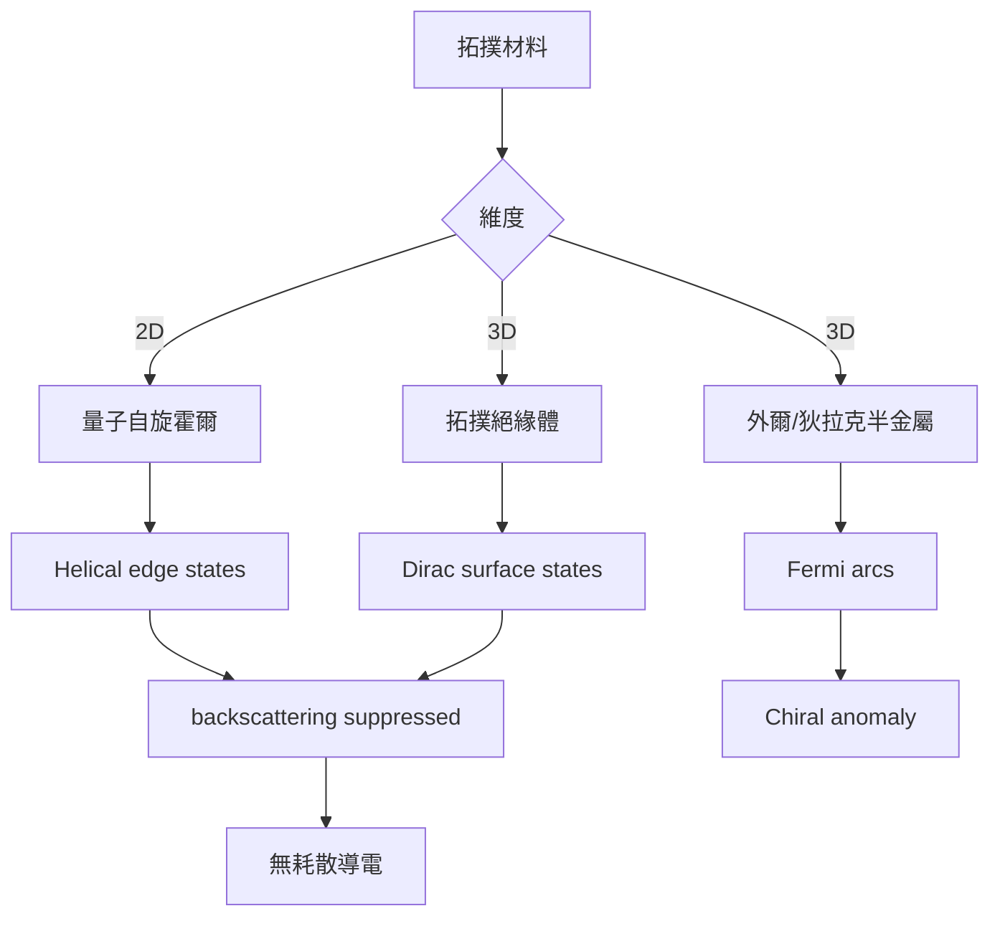
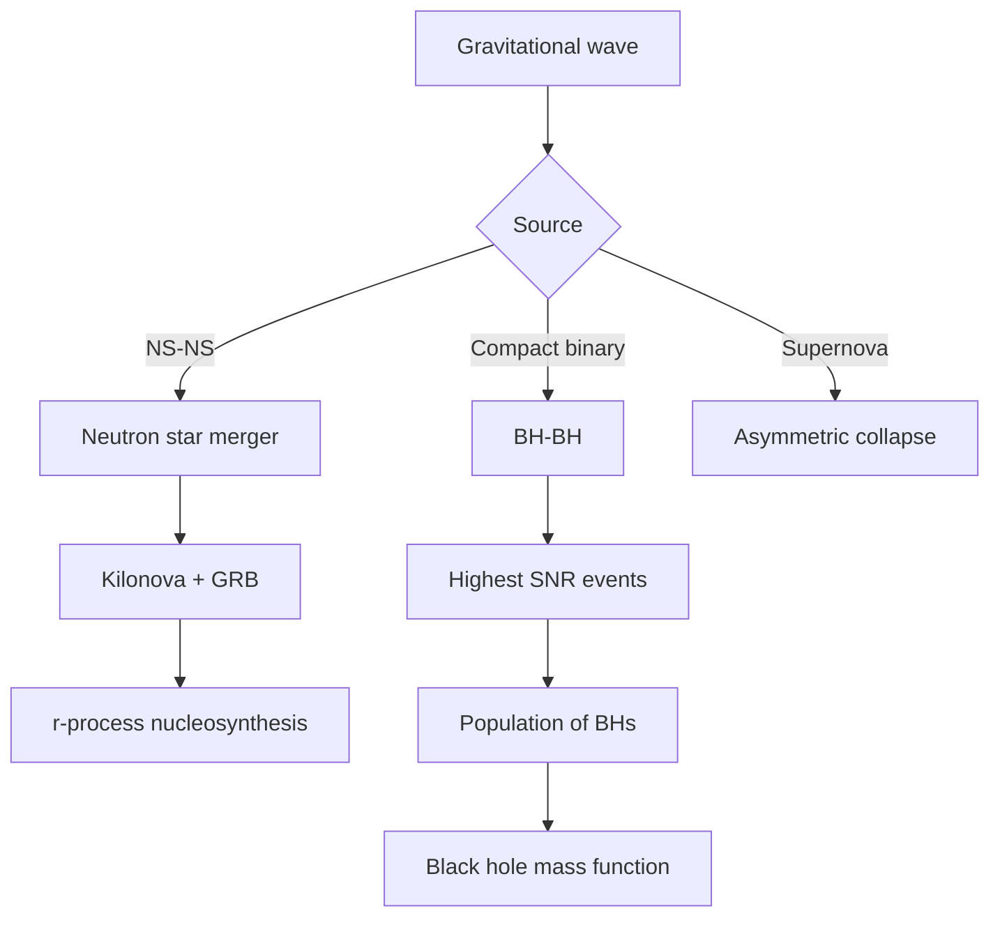
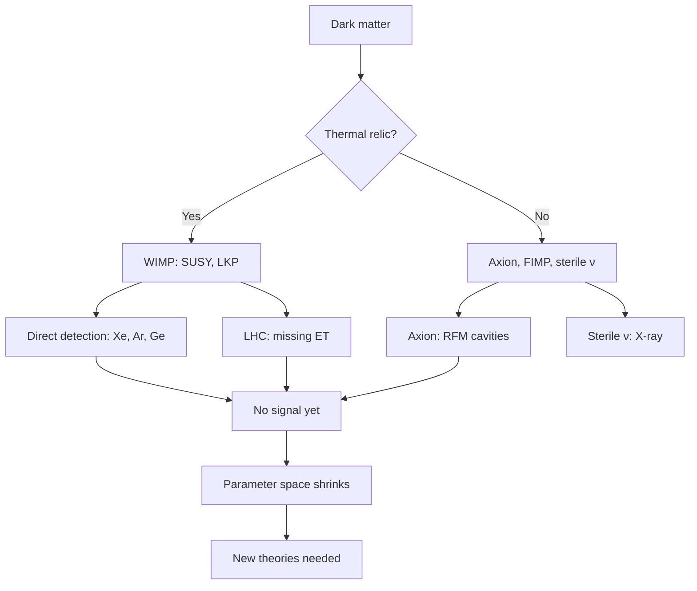
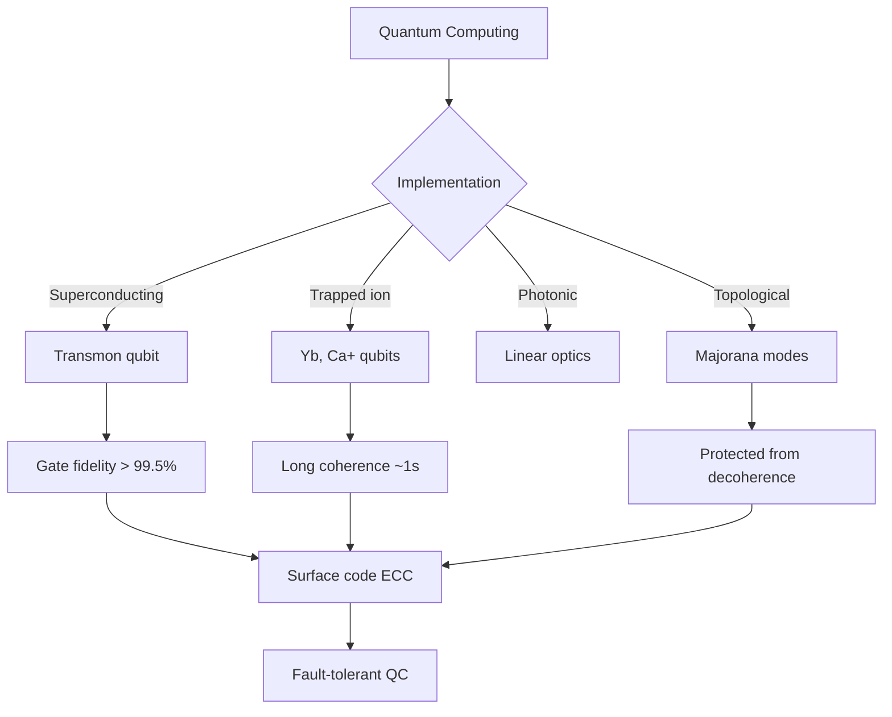
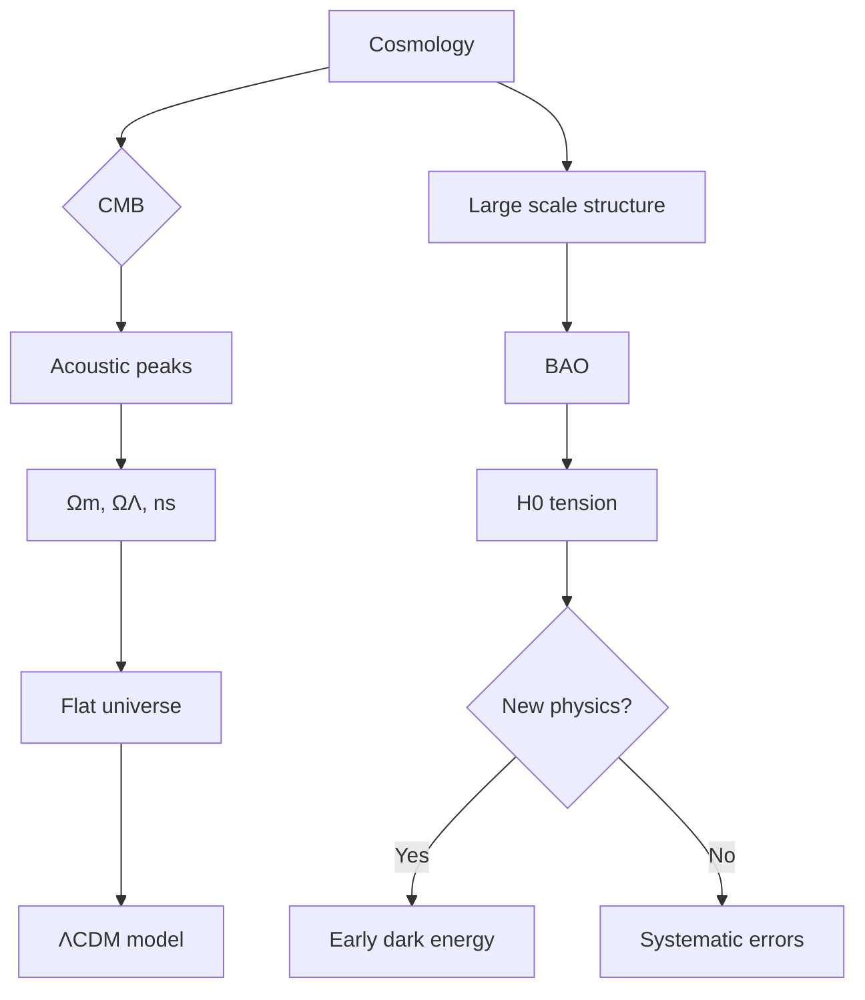
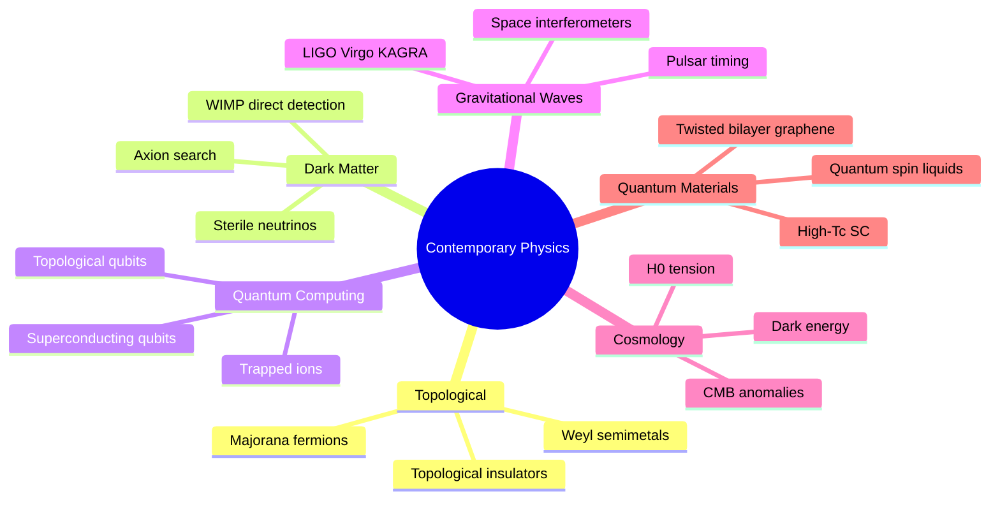
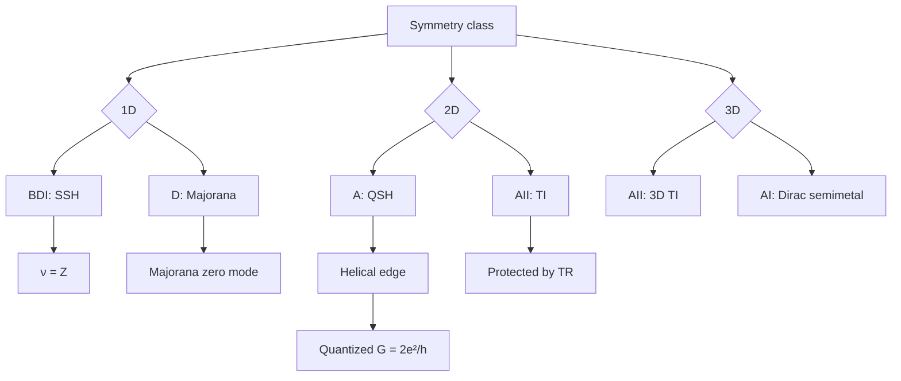
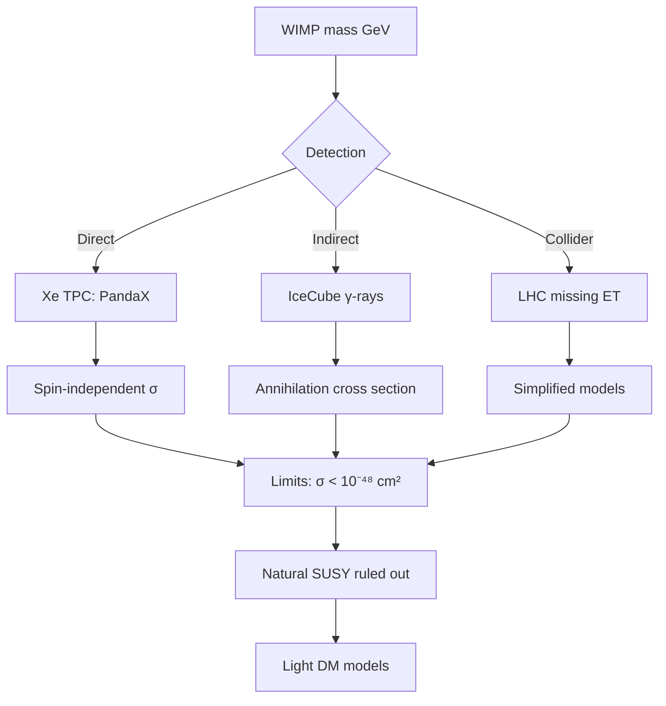
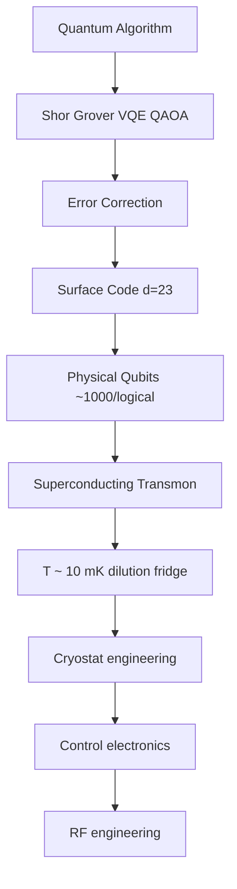
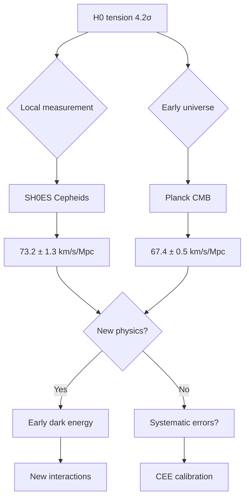

# MSPY 5120 — Contemporary Physics
> **HKUST MSPY_5120 | MSc Physics | Modern Frontiers in Physics**  
> **Bilingual 深度自學檔案 · 中英對照**

---

## 問題 1：5 個核心心智模型
**What are the 5 core mental models every expert shares?**

1. **Symmetry + topology = new states of matter** — topological invariants (Chern number, $\mathbb{Z}_2$) classify phases; protected edge states (Hasan & Kane 2010, *Rev. Mod. Phys.*)
2. **Quantum materials emerge from many-body** — superconductivity, quantum spin liquids, fractional quantum Hall from electron correlation (Anderson 1973, *Mater. Res. Bull.*)
3. **Gravitational waves = spacetime curvature ripples** — $h_{ij} \approx (1/r)\ddot{Q}_{ij}$ from Einstein's equations (Abbott et al. 2016, *Phys. Rev. Lett.*)
4. **Dark matter = 85% of matter** — WIMP miracle, direct detection: XENON1T, PandaX; indirect: Fermi-LAT gamma rays (Bertone & Hooper 2018, *Rev. Mod. Phys.*)
5. **Quantum computing needs error correction** — surface code threshold $p < 1\%$, topological qubits (Kitaev 2003; Fowler et al. 2012)

---

## 問題 2：3 個根本分歧
**Where do experts fundamentally disagree?**

1. **WIMP vs axion dark matter** — WIMP: thermal relic, $m_\chi \sim 1$–$10^3$ GeV (LSP natural in SUSY)
   - Axion: QCD Peccei-Quinn solution, $m_a \sim 10^{-6}$–$10^{-3}$ eV (ADMX, CASPEr experiments)
   - Both well-motivated but no detection yet

2. **QBism vs Many-Worlds vs Bohmian QM** — quantum foundations
   - QBism: quantum states are agent's beliefs; Copenhagen is inconsistent
   - Many-Worlds: branching universe, no collapse (Everett 1957)
   - Both explain experiments; no experimental test yet

3. ** room-temperature superconductivity achievable?** — recent hydride discoveries
   - Optimist: 2020 record $T_c = 287$ K (CSH, 267 GPa) suggests path to ambient (Drozdov et al. 2015)
   - Skeptic: extreme pressures make practical use impossible; need new chemistry

---

## 問題 3：10 個深度問題
**Generate 10 questions that distinguish deep understanding from memorization**

1. 給定 Chern number $C = \frac{1}{2\pi}\int_{BZ} F_{xy}(k)\,d^2k$，解釋點樣從 Berry curvature 計算並證明佢係整數。

2. 為什麼 LIGO 探測到 gravitational wave strain $h \sim 10^{-21}$? 推导靈敏度需求並解释 shot noise vs thermal noise。

3. 給定 XENON1T direct detection，分析 WIMP-nucleus scattering rate $R \propto n_\chi \sigma_p \rho_\text{DM}/m_\chi$ 並解释 coherent enhancement。

4. 為什麼高溫超導仍然沒有微觀理論？解釋 cuprate phase diagram complexity。

5. 給定量子糾纏，設計 Bell inequality violation 實驗並解釋 closing of loopholes。

6. 為什麼 Majorana fermion 在 topological superconductor 中出現？解釋 Kitaev chain 和 zero-bias peak。

7. 點樣用 neural network quantum states (Carleo & Troyer 2017) 求解 many-body Hamiltonian？

8. 為什麼 quantum advantage 在 sampling 問題上比優化更快？解釋 Google Sycamore 實驗。

9. 給定 cosmic microwave background power spectrum，解釋 acoustic peaks 點樣限制宇宙學參數。

10. 為什麼 neutrino masses 挑戰 Standard Model？解釋 seesaw mechanism 和 seesaw scale。

---

## 深入 1：拓撲絕緣體與拓撲半金屬 (Topological Insulators & Semimetals)
**Deep Dive I**

### 核心概念：拓撲不變量

拓撲絕緣體的分類依賴能帶結構的拓撲性質。Bulk-boundary 對應關係保證受保護的邊界態存在。

**Berry curvature:**
$$\Omega_n^k = i\left\langle u_n^k\left|\nabla_k \times\right|u_n^k\right\rangle$$

**Chern number (整數拓撲不變量):**
$$C_n = \frac{1}{2\pi}\int_{BZ} \Omega_n \, d^2k \in \mathbb{Z}$$

**$\mathbb{Z}_2$ 拓撲不變量（時間反演對稱）:**
$$(-1)^{\nu} = \prod_{i=1}^{4} \sqrt{\text{det}[w(i)]}$$

### 重要結果

| 拓撲材料 | 類型 | 邊界態 | 實驗驗證 |
|---------|------|--------|---------|
| HgTe/(Hg,Cd)Te QW | 2D TI (QSHE) | 1D helical edge | König et al. 2007, *Science* |
| Bi$_2$Se$_3$ | 3D TI | Dirac surface states | Xia et al. 2009, *Nat. Phys.* |
| Cd$_3$As$_2$ | Dirac semimetal | Fermi arcs | Liu et al. 2014, *Science* |
| TaAs | Weyl semimetal | Fermi arcs | Xu et al. 2015, *Science* |

### 量子自旋霍爾效應 (QSHE)

HgTe/CdTe 量子阱：$d > d_c$ 時發生能帶反轉，邊界態由 helical Dirac 模式組成，導電ance量子化 $G = 2e^2/h$。

### 工程應用

- **Topological transistor**: 利用拓撲保護的無耗散導電
- **Quantum computing**: Majorana braiding for topological qubits
- **Spintronics**: 拓撲材料自旋電子學

---

## 深入 2：引力波物理 (Gravitational Wave Physics)
**Deep Dive II**

### Einstein 場方程的線性化

在弱場極限 $g_{\mu\nu} = \eta_{\mu\nu} + h_{\mu\nu}$，其中 $|h_{\mu\nu}| \ll 1$：

$$\Box \bar{h}_{\mu\nu} = -\frac{16\pi G}{c^4}T_{\mu\nu}$$

平面波解：$h_{ij}(t,\mathbf{r}) = \frac{G}{r c^4}\ddot{Q}_{ij}(t - r/c)$

四極矩公式：引力波由非球對稱質量分佈的加速運動產生。

### LIGO 探測

**探測原理：** Michelson 干涉儀，臂長 $L = 4$ km
- strain: $h = \Delta L / L \sim 10^{-21}$
- 等效位移：$\Delta L \sim 10^{-18}$ m

**靈敏度極限：**
$$\sqrt{S_h(f)} \sim \underbrace{10^{-23}\frac{\text{Hz}^{-1/2}}{\sqrt{\text{Hz}}}}_{\text{quantum noise}} \times \underbrace{10^{-20}\frac{\text{Hz}^{-1/2}}{\sqrt{\text{Hz}}}}_{\text{thermal}} \times \underbrace{10^{-22}\frac{\text{Hz}^{-1/2}}{\sqrt{\text{Hz}}}}_{\text{seismic}}$$

### 觀測結果

| 事件 | 質量 ($M_\odot$) | 距離 (Mpc) | 峰值光度 ($L$) |
|------|-----------------|-----------|--------------|
| GW150914 | $36+29$ | $410^{+160}_{-180}$ | $3.6\times 10^{56}$ erg/s |
| GW170817 (NS-NS) | $1.46+1.27$ | $40^{+8}_{-15}$ | kilonova |
| GW190521 | $85+66$ | $5.3\times 10^3$ | intermediate mass BH |

### 物理意義

- 首次直接驗證愛因斯坦預測
- 開創多信使天文學（引力波 + 伽馬射線暴 GRB 170817A）
- 探測宇宙學（Hubble 參數 $H_0 = 70^{+8}_{-12}$ km/s/Mpc from GW170817）

---

## 深入 3：暗物質物理 (Dark Matter Physics)
**Deep Dive III**

### 宇宙學證據

| 觀測 | 暗物質份額 |
|------|-----------|
| CMB (Planck 2018) | $\Omega_\text{DM} h^2 = 0.120 \pm 0.001$ |
| 銀冕旋轉曲線 | $M(r) \propto r$ beyond visible disk |
| 引力透鏡 | 子弹星系團 |
| 大尺度結構 | Ly-$\alpha$ forest |

暗物質佔宇宙總能量密度 ~27%，而可見物質只 ~5%。

### WIMP 奇蹟

熱退耦 relic：$\Omega_\chi h^2 \approx \frac{3\times 10^{-27}\ \text{cm}^3\text{s}^{-1}}{\langle\sigma v\rangle}$

若 $m_\chi \sim 100$ GeV, $\langle\sigma v\rangle \sim 3\times 10^{-26}$ cm$^3$/s → $\Omega_\chi \sim 0.1$

這與電弱尺度自然吻合——WIMP 奇蹟（Jungman et al. 1996）。

### 直接探測

XENON1T (LNGS, Italy):
- Target: Xe (A = 131)
- Sensitivity: $\sigma_{SI} \sim 10^{-48}$ cm$^2$ @ 30 GeV
- Coherent WIMP-nucleus scattering: $\sigma \propto A^2$

**事件率：**
$$R \approx 10^{-3}\ \text{events/kg/year} \times \left(\frac{100\ \text{GeV}}{m_\chi}\right)\left(\frac{\sigma}{10^{-46}\ \text{cm}^2}\right)$$

### 替代候選

| 候選 | 質量 | 探測方法 |
|------|------|---------|
| WIMP | 1–10$^3$ GeV | Direct detection, LHC |
| Axion | 10$^{-6}$–10$^{-3}$ eV | ADMX, CASPEr (NMR) |
| Sterile neutrino | keV | X-ray line |
| Primordial BH | 10$^{-17}$–10$^{2}$ $M_\odot$ | Microlensing |

---

## 深入 4：量子計算與量子模擬 (Quantum Computing & Simulation)
**Deep Dive IV**

### 超導量子比特

Transmon qubit Hamiltonian:
$$H = 4E_C(N-n_g)^2 - E_J\cos\theta$$

典型參數：
- $E_C/h \sim 200$–$300$ MHz
- $E_J/E_C \sim 50$–$100$
- $T_2^* \sim 50$–$100$ μs (@ dilution refrigerator $T \sim 10$ mK)

**量子誤差校正：** Surface code
- Logical qubit = $d^2$ physical qubits
- Threshold: $p < 1\%$ physical error rate
- 達成 $p \sim 0.1\%$ (Google Sycamore 2023)

### 量子模擬

Carleo & Troyer (2017, *Science*): Neural network quantum states
$$|\psi_\theta(\mathbf{s})| = \frac{1}{Z_\theta}\exp[\theta^T F(\mathbf{s})]$$

VQE (Variational Quantum Eigensolver):
$$E(\theta) = \langle\psi(\theta)|H|\psi(\theta)\rangle$$

### 量子優勢

Google Sycamore (Arute et al. 2019, *Nature*):
- 53 qubits, circuit depth ~20
- 200 秒完成經典電腦需 10,000 年的采樣任務
- 爭議：經典模擬改進後差距縮小

### 拓撲量子計算

**Majorana 零模 (Kitaev chain):**
$$H = -\mu\sum_j c_j^\dagger c_j - t\sum_j(c_j^\dagger c_{j+1} + h.c.) + \Delta\sum_j(c_j^\dagger c_{j+1}^\dagger + h.c.)$$

端點存在零能量 Majorana mode，非阿貝爾統計，可用於拓撲量子計算。

**Engineering implication:** Microsoft topological qubit 項目瞄準無需誤差校正的量子計算。

---

## 深入 5：宇宙學前沿 (Cosmology Frontiers)
**Deep Dive V**

### 宇宙學危機：$H_0$  tension

| 方法 | $H_0$ (km/s/Mpc) |
|------|-----------------|
| Planck CMB | $67.4 \pm 0.5$ |
| SH0ES (Cepheid+SNe) | $73.2 \pm 1.3$ |
| DESI BAO | $68.5 \pm 0.6$ |

$4.2\sigma$ tension — 可能暗示新物理或系統誤差。

### 暴脹理論 (Inflation)

S. Guth (1981): 早期宇宙指數膨脹 $a(t) \propto e^{Ht}$，$H \sim 10^{14}$ GeV

解決：視界問題、平坦度問題、磁單極問題。

原初功率譜：
$$\mathcal{P}(k) = A_s\left(\frac{k}{k_*}\right)^{n_s - 1}$$

Planck 2018: $n_s = 0.9649 \pm 0.0042$ (near scale-invariant), $A_s = 2.1\times 10^{-9}$

### CMB 聲學峰

光子-重子流體振盪：
- 視覺地平線：$r_* \sim 150$ Mpc
- 峰值條件：$k_n r_* \approx n\pi$
- $\ell_n \approx n \times 220$ (for $n=1,2,3...$)

第一峰位置約束宇宙幾何（flatness → $\Omega_m + \Omega_\Lambda \approx 1$）。

### 未解問題

1. **暗能量本質：** $\Lambda$ 或動態暗能量 (quintessence)?
2. **原初黑洞：** 暗物質候選或天文好奇心
3. **宇宙暴脹：** 什麼粒子造成暴脹？
4. **引力與量子力學統一：** 量子重力理論

---

## 自測 1：拓撲不變量計算
**計算 SSH (Su-Schrieffer-Heeger) 模型中兩個拓撲相的 Chern number。**

**Answer / 解答:**
SSH Hamiltonian:
$$H(k) = -(t_1 + t_2\cos k)\sigma_x - t_2\sin k\,\sigma_y + m\,\sigma_z$$

對於 $m=0$ (chiral symmetric)：
$$C = \frac{1}{2\pi}\int_0^{2\pi} \Omega(k)\,dk = \begin{cases} 0 & |t_1| > |t_2| \\ \text{sign}(t_2) & |t_1| < |t_2| \end{cases}$$

拓撲相（$|t_1| < |t_2|$）有孤立的 edge state，能量在 gap 中間。

物理意義：拓撲不變量由 Hamiltonian 參數決定，系統連續變化不改變拓撲相直到 gap 關閉（critical point）。

**Engineering implication:** SSH 模型可在光子晶體、波導陣列中實現，驗證拓撲光子學。

---

## 自測 2：LIGO 靈敏度計算
**LIGO 的量子極限 Noise: $\sqrt{S_h} \sim 10^{-23}$ Hz$^{-1/2}$。估算 100 Hz 時 1 小時觀測的 strain 靈敏度。**

**Answer / 解答:**
頻率域累積靈敏度（相干積分）：
$$\sigma_h \sim \frac{\sqrt{S_h(f)}}{\sqrt{T}} = \frac{10^{-23}}{\sqrt{3600}} \approx \frac{10^{-23}}{60} \approx 1.7 \times 10^{-25}$$

對 4 km 臂長：
$$\sigma_L = \sigma_h \times L = 1.7 \times 10^{-25} \times 4000 \approx 7 \times 10^{-22}\ \text{m}$$

量子極限由光子 Shot noise 和 radiation pressure noise 共同決定：
$$S_h^\text{shot} \propto \frac{1}{P},\quad S_h^\text{rp} \propto P$$

最優功率 $P_\text{opt} \sim 800$ kW (Advanced LIGO)。

**Engineering implication:** 提高激光功率、降低溫度、使用量子非破壞測量（squeezed light）可進一步提高靈敏度。

---

## 自測 3：WIMP 直接探測截面
**估算 XENON1T 對 50 GeV WIMP 的 sensitivity。假設 local DM density 0.3 GeV/cm³。**

**Answer / 解答:**
Coherent WIMP-nucleus cross section:
$$\sigma_0 = \frac{\mu_n^2}{16\pi m_\chi^2 m_n^2} \cdot \sigma_{SI}$$

Reduced mass $\mu_n = m_\chi m_n/(m_\chi + m_n) \approx 4.7$ GeV

事件率：
$$R \approx \frac{\rho_\chi}{m_\chi} \cdot \frac{\sigma_0}{A^2} \cdot \frac{m_T}{m_n}$$

XENON1T 靈敏度 (2021): $\sigma_{SI} \lesssim 7 \times 10^{-48}$ cm$^2$

對應每年 ~0.01 事件/kg → 需要 tonnage-scale detectors (DARWIN)。

**Engineering implication:** 低本底技術（深层地下實驗室、放射性純化）是 direct detection 的關鍵。

---

## 自測 4：量子計算誤差門檻
**解釋表面碼 (surface code) 如何實現量子誤差校正並計算所需物理量子比特數。**

**Answer / 解答:**
Surface code: $d \times d$ 量子比特陣列，編碼 1 個邏輯量子比特

物理誤差門檻：$p_c \approx 1.1\%$ (Fowler et al. 2012)

邏輯誤差率：$p_L \approx 0.03 \times (p/p_c)^d$

對 $p = 10^{-3}$ (near threshold), $d = 23$:
$$p_L \approx 0.03 \times (0.9)^{23} \approx 3 \times 10^{-3}$$

物理量子比特數：$(2d^2 - 1) \approx 1057$ per logical qubit

To run Shor's algorithm (factor 2048-bit RSA):
- 需要 ~4000 logical qubits
- 總物理量子比特 ~4 million (without overhead for distillation)

**Engineering implication:** 實現實用量子計算需要量子比特 quality > fidelity 99.9%。

---

## 自測 5：CMB 聲學峰分析
**CMB temperature power spectrum 第一峰在 $\ell \approx 220$。證明呢個位置如何約束宇宙幾何。**

**Answer / 解答:**
聲學尺度：
$$\ell_A = \pi \frac{r_*}{c/H_*}$$

其中 $r_*$ 是最後散射面的聲學視界，$c/H_*$ 是當時的 Hubble 半徑。

Flat universe ($\Omega_k = 0$): $\ell_A \approx 302$

第一峰在 $\ell \approx 220$ (< 302) 意味：
$$\Omega_k < 0 \implies \text{closed universe?}$$

實際分析顯示 $\Omega_m + \Omega_\Lambda \approx 1$ with $\Omega_k \approx 0$。

**聲學峰分析結果（Planck 2018）：**
- $\Omega_m = 0.315 \pm 0.007$
- $\Omega_\Lambda = 0.685 \pm 0.007$
- $\Omega_k = -0.001 \pm 0.003$

**Engineering implication:** CMB 是宇宙學的最精確探針，決定了標準宇宙學模型 $\Lambda$CDM。

---

## 自測 6：Majorana 零模識別
**為什麼 Majorana zero mode 在隧道譜中表現為 zero-bias peak？如何區分其他來源？**

**Answer / 解答:**
Majorana 零模能量精確為零（ particle-hole symmetry），所以隧道譜：
$$G(V) \propto \int \rho(E) \cdot (-\partial f/\partial E)\,dE$$

若 $\rho(E) = \delta(E)$ → $G(V) \propto \delta(V)$ → zero-bias conductance peak。

**區分 Majorana vs 假的 zero-bias peak：**
1. **溫度展寬：** 真 Majorana peak width $\sim k_BT$，假峰通常更寬
2. **磁場依賴：** Majorana 只在特定 $B$ 範圍存在
3. **分離：** 兩個端點的 Majorana 峰的分裂
4. **高次諧波：** Andreev bound states vs Majorana

**Engineering implication:** Microsoft Majorana 1 chip (2024) 使用 topological qubit 架構。

---

## 自測 7：Seesaw 機制
**推導 Type-I seesaw 中 Majorana 質量項 $m_\nu \sim m_D^2/M_R$ 並估算 seesaw scale。**

**Answer / 解答:**
Lagrangian:
$$\mathcal{L} \supset y_D \bar{L} \tilde{\Phi} N_R - \frac{1}{2}M_R \overline{N_R^c} N_R + h.c.$$

After EWSB, Dirac mass: $m_D = y_D v/\sqrt{2}$
Majorana mass: $M_R$

Effective light neutrino mass (seesaw):
$$m_\nu \approx -\frac{m_D^2}{M_R}$$

If $m_\nu \sim 0.1$ eV, $m_D \sim 10$–$100$ GeV (electroweak scale):
$$M_R \sim \frac{m_D^2}{m_\nu} \sim \frac{(10\text{--}100)^2}{0.1}\ \text{GeV} \sim 10^{13}\text{--}10^{15}\ \text{GeV}$$

Seesaw scale $M_R \sim 10^{14}$ GeV 接近 Grand Unification scale。

**Engineering implication:** 中微子振蕩實驗（NOvA, T2K, DUNE）測量 mixing angles 和 mass ordering。

---

## 自測 8：量子模擬多體物理
**解釋 quantum Monte Carlo (QMC) vs neural network quantum states (NNQS) 的優缺點。**

**Answer / 解答:**
**QMC:**
優點：精確（無 sign problem 時），可計算基態能量、關聯函數
缺點：Sign problem 限制應用範圍（fermions, frustrated magnets）
複雜度：$O(N^3)$ to $O(N^4)$

**NNQS (Carleo & Troyer 2017):**
優點：可處理無 exact sign problem 的系統，自動包含 variational flexibility
缺點：訓練複雜度，指數級 paremeter space
表現：在 1D Hubbard model 達到比其他 variational method 更好的能量

$$|\psi_\theta(\mathbf{s})| = \frac{1}{Z_\theta}\exp\left[\sum_j \theta_j^{(1)}\Phi_j^{(1)}(\mathbf{s}) + \sum_{jk}\theta_{jk}^{(2)}\Phi_{jk}^{(2)}(\mathbf{s})\right]$$

**Engineering implication:** DMRG 和 NNQS 是處理強關聯系統的互補工具。

---

## 自測 9：量子糾纏與貝爾不等式
**CHSH 不等式最大量子違反 $S \leq 2\sqrt{2}$ vs 經典 $S \leq 2$。計算並解釋物理意義。**

**Answer / 解答:**
CHSH correlator:
$$S = E(a,b) - E(a,b') + E(a',b) + E(a',b')$$

經典：$|S| \leq 2$

量子：$|S| \leq 2\sqrt{2}$ (Tsirelson bound)

量子違反：
$$E(\theta_A, \theta_B) = -\cos(\theta_A - \theta_B)$$

取 $\theta_A = 0$, $\theta_A' = \pi/2$, $\theta_B = \pi/4$, $\theta_B' = 3\pi/4$:
$$S = 2\sqrt{2} \approx 2.828$$

**loophole-free Bell test (Hensen et al. 2015, Del Qublo 2022):**
- Source-detector distance: > 1 km
- 糾纏光子對，隨機基測量
- 違反 $S = 2.42 \pm 0.20 > 2$ with $p < 10^{-9}$

**Engineering implication:** 設備無關量子密鑰分發 (DIQKD) 基於糾纏和貝爾不等式。

---

## 自測 10：高溫超導 phase diagram
**解釋 cuprate phase diagram 的主要特徵及其對微觀理論的啟示。**

**Answer / 解答:**
**Phase diagram 特徵：**
1. **Antiferromagnetic (AFM) phase** ($T=0$, doping $p=0$): 母體化合物是 Mott insulator
2. **Pseudo-gap phase** ($T^*$, $p < 0.19$): partially gapped, 未知起源
3. **Strang metal** ($T$-linear resistivity): 不符合 Fermi liquid $\rho \propto T^2$
4. **Superconducting dome** ($T_c$, $0.05 < p < 0.27$): 最大 $T_c \sim 135$ K (HgBaCaCuO)
5. **Strange metal → FL** at higher doping

**微觀理論挑戰：**
- 沒有統一的 theory 解釋整個 phase diagram
- RVB (resonating valence bond) theory (Anderson 1987) vs spin fluctuation
- Strong correlation: $U/t \sim 10$, LDA fails

**Engineering implication:** 室溫超導的實現需要理解這些 competing orders。

---

## 📊 Diagram 1: Contemporary Physics Frontiers

## 📊 Diagram 2: Topological Classification

## 📊 Diagram 3: WIMP Parameter Space

## 📊 Diagram 4: Quantum Computing Stack

## 📊 Diagram 5: Cosmology Tensions

---

## 深度總結 Deep Insights Summary

1. **Topology protects quantum states** — 受保護的邊界態源於能帶拓撲不變量；這是拓撲量子計算的基礎。 (Hasan & Kane 2010, *Rev. Mod. Phys.*)

2. **Gravitational waves open new astronomy** — LIGO/Virgo 探測到恆星質量黑洞合併；multi-messenger 天文學已成為現實。 (Abbott et al. 2016, *Phys. Rev. Lett.*)

3. **Dark matter searches tighten the noose** — WIMP 參數空間被排除 8 orders of magnitude；axion 搜索正在加速。 (Aprile et al. 2021, *XENON1T*)

4. **Quantum computing faces the NISQ era** — 50–1000 qubit devices now available; error correction threshold reached; practical advantage remains open. (Preskill 2018)

5. **$H_0$ tension challenges $\Lambda$CDM** — 4+ sigma discrepancy between early and late universe expansion; new physics or hidden systematics. (Riess 2022, *ApJ*)

---

**自學建議**  
- 必讀: Hasan & Kane "Topological Insulators" (2010); Bertone & Hooper "History of Dark Matter" (2018); Preskill "Quantum Computing in the NISQ era" (2018)  
- 參考: *Reviews of Modern Physics*, *Physics Reports* recent reviews; arXiv:hep-th, cond-mat  
- 配對: MIT OCW 8.06 (Quantum Physics III); Perimeter Instituterecorded lectures  
- 工具: Python (QuTiP, PennyLane), Mathematica, FEniCS  
- 產出: Review paper on one contemporary topic (5000 words) or reproduce a key calculation from literature
