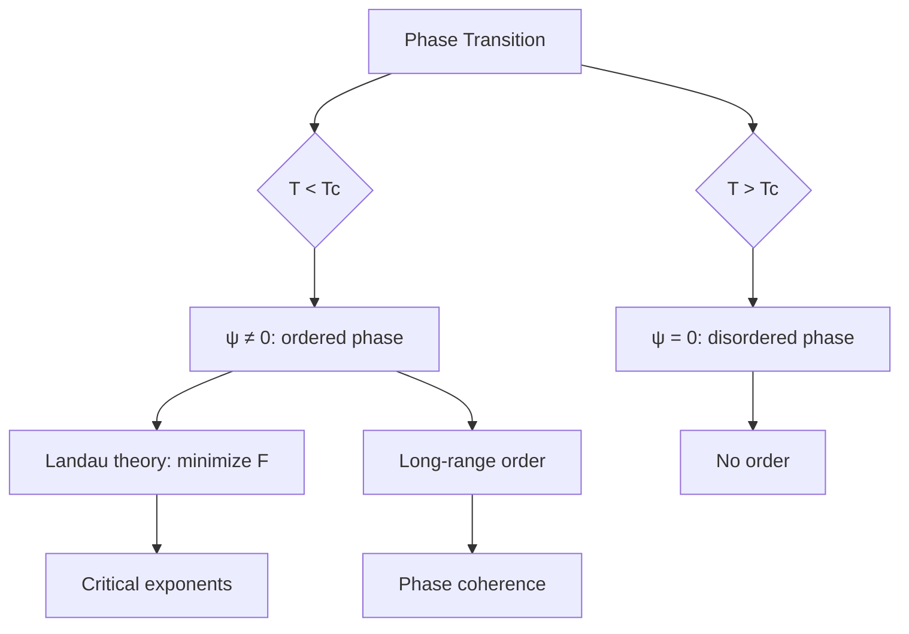
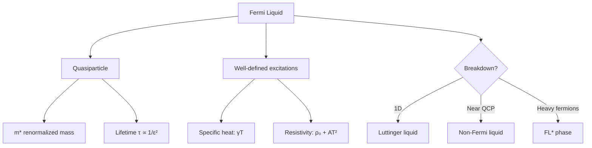
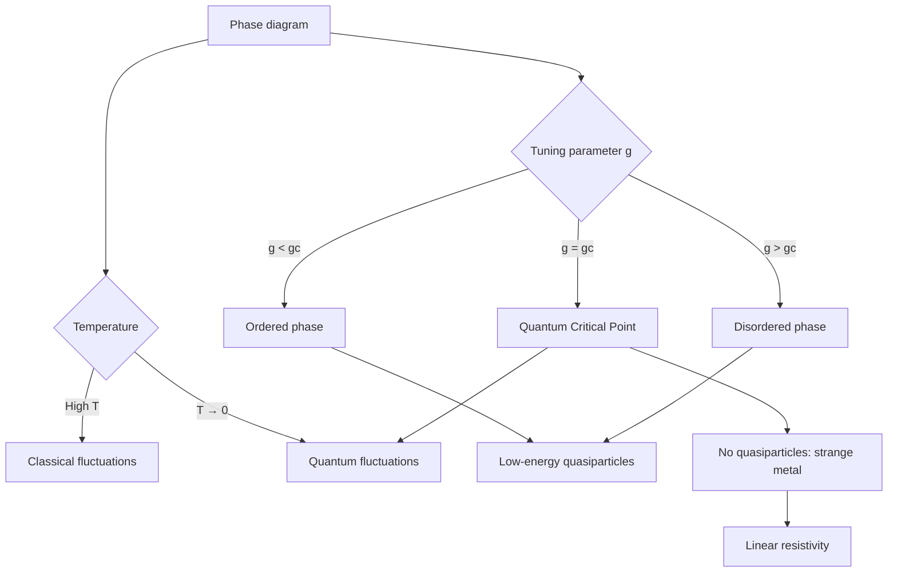
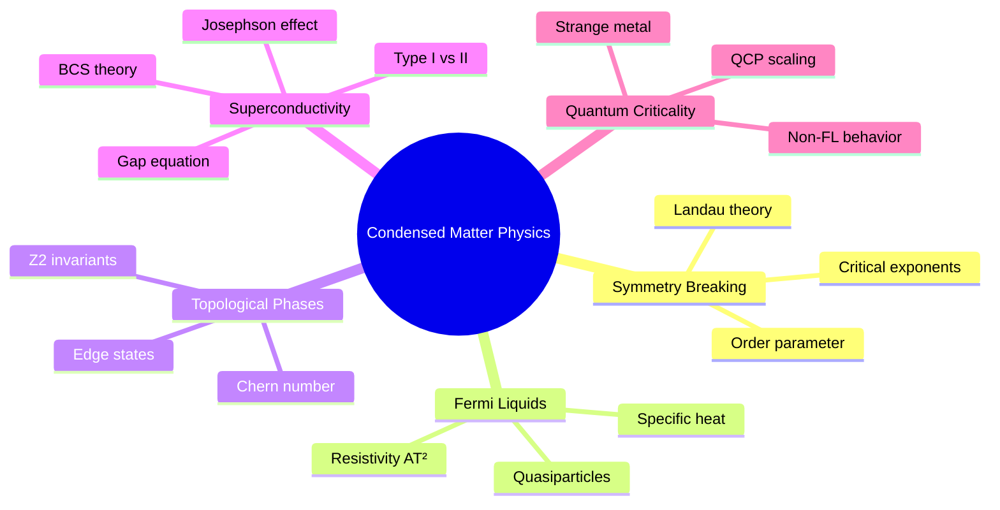
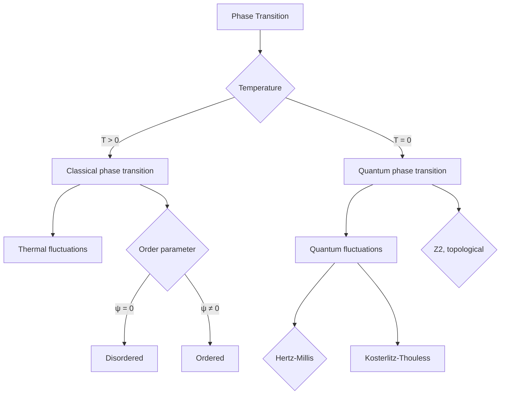
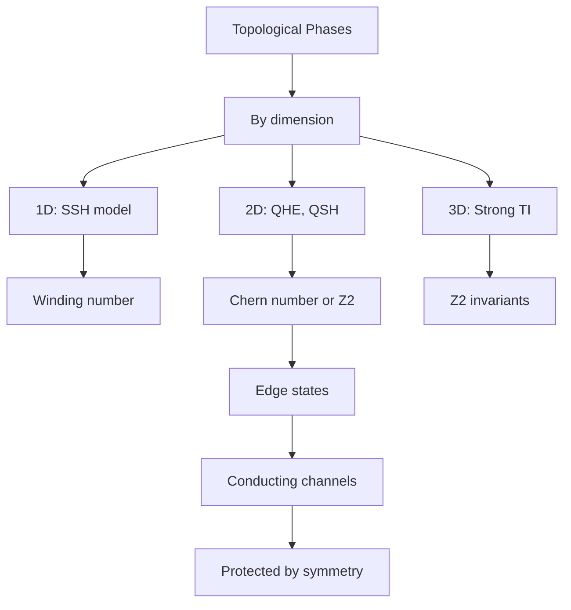
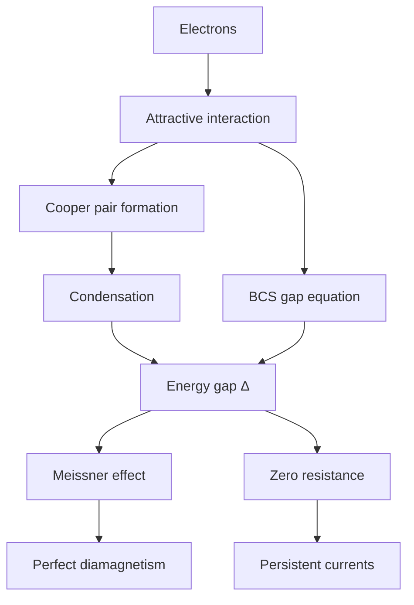
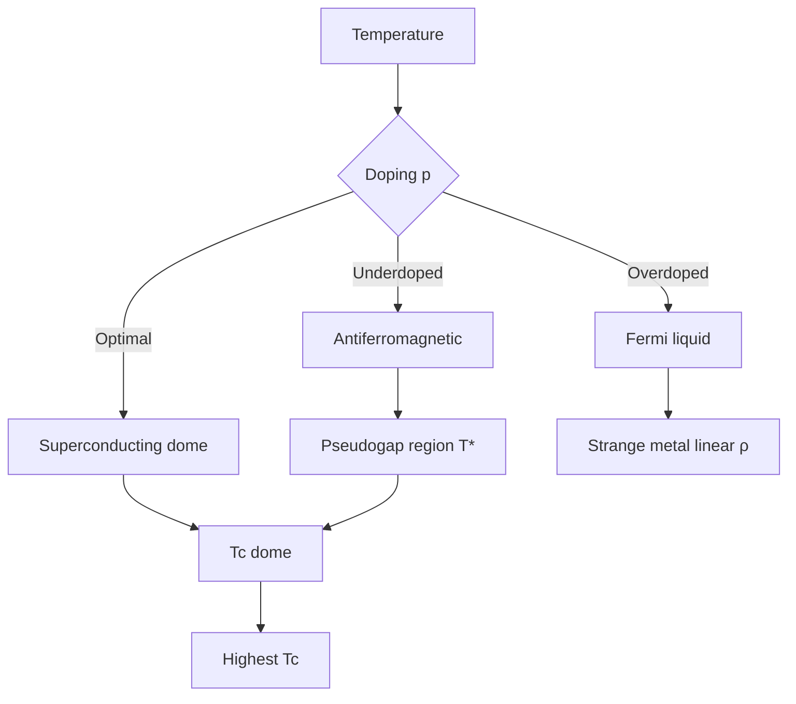

# MSPY 5410 — Condensed Matter Physics
> **MSc Physics | HKUST MSPY 5410 | Advanced solid-state physics — phase transitions, topological materials, superconductivity, many-body physics**  
> **Bilingual 深度自學檔案 · 中英對照**

---

## 問題 1：5 個核心心智模型

1. **Spontaneous symmetry breaking creates emergent order** — Landau theory: order parameter $\psi$ minimizes Ginzburg-Landau free energy $F = a|\psi|^2 + b|\psi|^4 + \cdots$; phase transition = qualitative change in $\psi$ (Landau & Lifshitz Vol.5; Ginzburg 1950)

2. **Fermi liquid theory explains why metals behave so similarly** — quasiparticles with renormalized mass $m^*$ near Fermi surface; all low-energy excitations described by $E(\vec{k}) = \hbar v_F(|\vec{k}| - k_F)$ (Landau 1956, *Sov. Phys. JETP*)

3. **Topological phases are classified by integer invariants** — Chern number $C = \frac{1}{2\pi}\int_{BZ} \Omega(\vec{k}) d^2k$, $\mathbb{Z}_2$ invariant for time-reversal; cannot be continuously deformed to trivial insulator (Thouless et al. 1982, *Phys. Rev. Lett.*)

4. **BCS theory: pairing from attractive interaction** — Cooper pairs form at $T_c$; energy gap $\Delta(0) = 1.76 k_B T_c$; macroscopic quantum coherence (Bardeen-Cooper-Schrieffer 1957)

5. **Quantum criticality governs phase transitions at $T=0$** — Hertz-Millis theory; scaling near quantum critical point $T \sim |g - g_c|^{z\nu}$ (Hertz 1976; Sachdev 2011, *Quantum Phase Transitions*)

---

## 問題 2：3 個根本分歧

### 分歧 1：BCS vs Bose-Einstein Condensate (BEC) Crossover
| Aspect | BCS regime | BEC regime | Crossover |
|--------|-----------|-----------|-----------|
| Interaction | Weak attraction $k_F a \ll -1$ | Strong attraction $k_F a \gg +1$ | $k_F a \sim -1$ |
| Pair size | $\xi \gg a$ (large Cooper pairs) | $\xi \ll a$ (tight bound molecules) | Molecule size ~interparticle |
| Gap | $\Delta \ll E_F$ | $\Delta \gg E_F$ | Non-monotonic |
| Temperature | $T_c \ll E_F$ | $T_c$ limited by binding | Smooth crossover |
| Prototypes | Conventional superconductors | Ultracold atoms | ${}^6$Li, ${}^{40}$K |

**Evidence:** De Picciotto et al. (2001) observed Andreev reflection in semiconductor-superconductor structures showing smooth BCS-BEC transition.

### 分歧 2：Topological Insulators vs Symmetry-Protected Topological Phases
| Aspect | Topological Insulators (TI) | SPT (Symmetry-Protected) |
|--------|---------------------------|------------------------|
| Symmetry | Time-reversal (TR) | TR, particle-hole, chiral |
| Classification | $\mathbb{Z}_2$ (2D, 3D TI) | $0, \mathbb{Z}, \mathbb{Z}_2$ |
| Bulk | Trivial insulator | Trivial insulator |
| Edge | Conducting (protected) | Conducting (protected) |
| Examples | Bi₂Se₃, HgTe | Integer quantum Hall, topological superconductors |

**Evidence:** König et al. (2007, *Science*) observed quantum spin Hall effect (2D TI) in HgTe/CdTe quantum wells.

### 分歧 3：Hertz-Millis vs Functional RG for Quantum Criticality
| Aspect | Hertz-Millis | Functional RG |
|--------|-------------|---------------|
| Approach | Gaussian fixed point, bosonic action | Full momentum-shell RG |
| Critical exponents | Mean-field $\pm$ corrections | Non-mean-field $z, \nu$ |
| Breakdown | Strong coupling | Better at dangerously irrelevant variables |
| Use case | Clean systems | Impure, strongly correlated |

---

## 問題 3：10 個深度問題

1. 給定 Ginzburg-Landau free energy $F = \alpha(T)|\psi|^2 + \frac{\beta}{2}|\psi|^4$，推導 phase boundary 和臨界指數。

2. 為什麼 Fermi liquid theory predicts $\rho(T) = \rho_0 + AT^2$ electrical resistivity？推導從 electron-electron scattering。

3. 給定 Chern number $C$ 的定義，推導為什麼 $C$ 係 quantized (TKNN invariant) 和實驗可測量 (Hall conductivity $\sigma_{xy} = Ce^2/h$)。

4. 為什麼 high-$T_c$ cuprates 的 pseudogap phase 挑戰 standard Fermi liquid theory？

5. 給定 BCS gap equation $\Delta = V\sum_{\vec{k}} \Delta/(2\sqrt{\xi_{\vec{k}}^2+\Delta^2)}$，推導 $\Delta(0) = 1.76 k_B T_c$。

6. 為什麼 topological phases 需要 disorder-free 樣品才能 observe？討論 Anderson localization 和 topological protection 的關係。

7. 解釋 Kosterlitz-Thouless transition 的 vortex-pair unbinding mechanism，點樣與 standard second-order transition 不同。

8. 給定 spin-orbit coupling $\alpha(\vec{\sigma}\cdot\vec{k})$ 在 2DEG，推導 Rashba splitting 和 spin texture。

9. 為什麼 cuprate superconductors 的 isotope effect 唔係 simple BCS prediction ($\alpha = 0.5$)？

10. 解釋非費米液體行為（FL*）點樣可能來自spinon-holon decomposition 和 gauge fields。

---

## 深入 1：Spontaneous Symmetry Breaking & Landau Theory
**Deep Dive I**

### Order Parameter Concept

**Definition:** $\psi(\vec{r})$ — nonzero below $T_c$ (spontaneous breaking)

| System | Order Parameter | Symmetry broken |
|--------|---------------|---------------|
| Ferromagnet | $\vec{M}$ (magnetization) | Rotation $SO(3)$ |
| Superfluid He-4 | $\psi = \sqrt{n}e^{i\phi}$ | $U(1)$ gauge |
| Superconductor | $\psi$ (Cooper pair amplitude) | $U(1)$ gauge |
| Crystalline solid | Strain tensor $\epsilon_{ij}$ | Translation + rotation |
| Nematic | Symmetric traceless tensor $Q_{ij}$ | $SO(3) \to SO(2)$ |

### Ginzburg-Landau Expansion

$$F[\psi] = \int d^3r \left[\alpha(T)|\psi|^2 + \frac{\beta}{2}|\psi|^4 + \frac{\hbar^2}{2m}|\nabla\psi|^2\right]$$

**Minimization:** $\partial F/\partial\psi^* = 0$:
$$\alpha(T)\psi + \beta|\psi|^2\psi = 0$$

Near $T_c$: $\alpha(T) \approx \alpha_0(T - T_c)$, $\beta > 0$

**Solutions:**
- $T > T_c$: $\psi = 0$ (symmetric)
- $T < T_c$: $|\psi| = \sqrt{-\alpha/\beta}$ (broken symmetry)

### Critical Exponents (Mean Field)

| Exponent | Definition | Mean field |
|----------|-----------|-----------|
| $\beta$ | $|\psi| \sim (-t)^\beta$, $t = (T - T_c)/T_c$ | $1/2$ |
| $\gamma$ | $\chi \sim |t|^{-\gamma}$ | $1$ |
| $\delta$ | $\psi(h=0) \sim |h|^{1/\delta}$ | $3$ |
| $\alpha$ | $C_V \sim |t|^{-\alpha}$ | $0$ (discontinuity) |
| $\nu$ | $\xi \sim |t|^{-\nu}$ | $1/2$ |

### Ginzburg Criterion

Mean-field theory valid when:
$$\frac{|T - T_c|}{T_c} \gg G_i \sim \frac{|\xi_0|^3}{k_B T_c \cdot \xi_0^3}$$

where $G_i$ is the Ginzburg parameter. Near $T_c$: fluctuations dominate.

---

## 深入 2：Fermi Liquid Theory
**Deep Dive II**

### Quasiparticle Concept

**Landau's postulate:** Low-energy excitations of interacting Fermi system behave like non-interacting quasiparticles with:
- Same charge, spin as electron
- Renormalized mass $m^*$
- Enhanced lifetime $\tau \propto 1/(\epsilon - E_F)^2$

### Key Predictions

**Specific heat:**
$$C_V = \gamma T, \quad \gamma = \frac{\pi^2}{3}k_B^2 D(E_F)$$

For 3D free electron gas: $\gamma = \frac{\pi^2}{2}k_B^2 \frac{m^* k_F}{\hbar^2}$

**Magnetic susceptibility:**
$$\chi = \frac{\mu_0 \mu_B^2 D(E_F)}{1 + F_0^a}$$

Pauli paramagnetism, enhanced by Fermi liquid parameter $F_0^a$.

**Resistivity:**
$$\rho(T) = \rho_0 + AT^2$$

**Derivation of $AT^2$:** electron-electron scattering rate $\tau^{-1} \propto (k_B T)^2$ at Fermi surface (Umklapp processes required in 3D).

### Breakdown of Fermi Liquid

**Non-Fermi liquid signatures:**
- $\rho \sim T^n$ with $n < 2$ (cuprates: $n = 1$)
- $C_V/T$ diverges or vanishes
- $T$-linear susceptibility

**Where it breaks:**
- 1D (Luttinger liquids — Tomonaga-Luttinger model)
- Near quantum critical points
- Quasi-2D systems (cuprates)
- Heavy fermion compounds

---

## 深入 3：Topological Phases of Matter
**Deep Dive III**

### Integer Quantum Hall Effect (IQHE)

**Experimental fact:** $\sigma_{xy} = \nu e^2/h$ with $\nu = 1, 2, 3, \ldots$ (von Klitzing 1980, *Phys. Rev. Lett.*)

**Theoretical explanation (Thouless et al. 1982):**
$$\sigma_{xy} = \frac{e^2}{h}\sum_n \int_{BZ} \frac{d^2k}{2\pi}(\partial_{k_x}A_{k_y}^n - \partial_{k_y}A_{k_x}^n)$$

where $A_i^n = i\langle u_n|\partial_{k_i}u_n\rangle$ is the Berry connection.

**Chern number:**
$$C_n = \frac{1}{2\pi}\int_{BZ} \Omega_n(\vec{k}) d^2k, \quad \Omega_n = \partial_{k_x}A_y^n - \partial_{k_y}A_x^n$$

$\Omega_n$ = Berry curvature.

### Topological Insulators (2D: Quantum Spin Hall)

**$\mathbb{Z}_2$ invariant** (Kane & Mele 2005):
$$(-1)^{\nu} = \prod_i \sqrt{\det[w(i)]}$$

where $w_{mn} = \langle u_m(-\vec{k})|T|u_n(\vec{k})\rangle$, $T$ = time-reversal operator.

**Edge states:** Helical edge channels — spin-up and spin-down propagating in opposite directions, protected by time-reversal symmetry.

### 3D Topological Insulators

**Strong TI:** 3 independent $\mathbb{Z}_2$ invariants ($\nu_0; \nu_1, \nu_2, \nu_3$)
- Example: Bi₂Se₃ family ($E_g \approx 0.3$ eV)
- Surface states: Dirac cone (single cone, no gap)

**Superconducting TIs:** Topological superconductors host Majorana fermions at boundaries.

### Topological Classification Table

| Dimension | Symmetry | Classification |
|-----------|---------|---------------|
| 1D | None | $\mathbb{Z}$ (winding number) |
| 2D | TR, no spin-orbit | $\mathbb{Z}_2$ (QSH) |
| 2D | No TR | $\mathbb{Z}$ (IQHE) |
| 3D | Strong TR | $\mathbb{Z}_2$ |
| 3D | TR + particle-hole | $\mathbb{Z}$ (Dirac/Weyl) |

---

## 深入 4：Superconductivity — BCS Theory
**Deep Dive IV**

### BCS Hamiltonian

$$H = \sum_{\vec{k},\sigma} \xi_{\vec{k}}c_{\vec{k}\sigma}^\dagger c_{\vec{k}\sigma} + \sum_{\vec{k},\vec{k}'} V_{\vec{k}\vec{k}'}c_{\vec{k}\uparrow}^\dagger c_{-\vec{k}\downarrow}^\dagger c_{-\vec{k}'\downarrow}c_{\vec{k}'\uparrow}$$

Mean-field approximation: $c_{\vec{k}\uparrow}^\dagger c_{-\vec{k}\downarrow}^\dagger \to \langle c_{\vec{k}\uparrow}^\dagger c_{-\vec{k}\downarrow}^\dagger \rangle + \text{h.c.}$

### Gap Equation

Define gap: $\Delta_{\vec{k}} = -\sum_{\vec{k}'} V_{\vec{k}\vec{k}'}\langle c_{-\vec{k}'\downarrow}c_{\vec{k}'\uparrow}\rangle$

BCS gap equation (at $T = 0$):
$$\Delta = V\sum_{\vec{k}} \frac{\Delta}{2\sqrt{\xi_{\vec{k}}^2 + |\Delta|^2}$$

**Constant interaction approximation:** $V_{\vec{k}\vec{k}'} = -V$ for $|\xi| < \hbar\omega_D$:
$$\frac{1}{V} = \int_0^{\hbar\omega_D} \frac{D(E_F)d\xi}{2\sqrt{\xi^2 + \Delta^2}} \approx D(E_F)\ln\frac{2\hbar\omega_D e^{\gamma}}{\Delta}$$

**Solutions:**
$$\Delta(0) = 2\hbar\omega_D e^{-1/D(E_F)V}, \quad k_BT_c = \frac{2\gamma}{\pi}\hbar\omega_D e^{-1/D(E_F)V}$$

Eliminating $V$:
$$\Delta(0) = 2\hbar\omega_D \frac{e^{-\gamma}}{\pi}k_BT_c \approx 1.76 k_BT_c$$

### Josephson Effect

Phase coherence across weak link:
$$I = I_c \sin(\phi_1 - \phi_2)$$

DC Josephson: $V = 0$, $I = I_c\sin\delta$
AC Josephson: $V \neq 0$, $\hbar\dot{\delta} = 2eV \Rightarrow \omega = 2eV/\hbar$

**Applications:** SQUIDs (superconducting quantum interference device), voltage standard ($V = nh/2e$).

---

## 深入 5：Quantum Critical Phenomena
**Deep Dive V**

### Quantum Critical Point (QCP)

At $T = 0$, continuous phase transition driven by tuning parameter $g$:
$$H = H_0 + g \int d^dx \, \psi^\dagger\psi$$

At $g = g_c$: quantum fluctuations drive critical behavior.

### Scaling Hypotheses

**Spatial + temporal correlations:**
$$\xi \sim |g - g_c|^{-\nu}, \quad \xi_\tau \sim \xi^z \sim |g - g_c|^{-z\nu}$$

**Free energy density:**
$$f \sim |g - g_c|^{d+z\nu}, \quad \frac{C}{T} \sim |g - g_c|^{-\alpha} \propto T^{-(d/z\nu)}$$

### Examples in Condensed Matter

| System | QCP | Exponents |
|--------|-----|-----------|
| Itinerant ferromagnet (Heritier) | $T=0$ ferromagnet | $z=3$, $\nu=1/3$ |
| Cuprate strange metal | $p = p_c$ (doping) | $z=1$, linear $T$ resistivity |
| Heavy fermions | $T=0$ AF-QCP | $\ln T$ divergences |
| Bose-Hubbard | $T=0$ superfluid-Mott | $z=2$, $\nu=1/2$ |

### Strange Metal Behavior

Non-FL behavior in cuprates: $\rho(T) = \rho_0 + AT$ (linear in $T$)

**Proposed explanations:**
1. Quantum critical scattering (scaling $\rho \sim T$ emerges from $z = 1$)
2. Planckian dissipation: $\tau = \hbar/k_BT$ (minimal scattering rate)
3. Emergent gauge fields in parton theories

---

## 自測 1：Landau Theory — Ferromagnetic Transition
**Derive the critical exponent $\beta = 1/2$ from mean-field Landau theory for a ferromagnet.**

**Answer:**
Free energy near $T_c$:
$$F = F_0 + \alpha(T)M^2 + \frac{\beta}{4}M^4 - HM$$

Minimization $\partial F/\partial M = 0$:
$$4\alpha(T)M + \beta M^3 - H = 0$$

At $H = 0$ (no external field):
$$M(\alpha M^2 + \beta) = 0$$

Solutions:
1. $M = 0$ (for $\alpha > 0$, i.e., $T > T_c$)
2. $M^2 = -\alpha/\beta = \alpha_0(T_c - T)/\beta$

Since $\alpha \propto (T - T_c)$:
$$M \propto (T_c - T)^{1/2} \quad \Rightarrow \quad \beta = \frac{1}{2}$$

**Validity:** Mean-field holds when fluctuations are small:
$$G_i \sim \frac{T_c}{H_{cor}} \left(\frac{\xi}{a}\right)^3 \ll 1$$

For 3D Heisenberg: $G_i \sim 0.3$ → corrections significant near $T_c$.

---

## 自測 2：Chern Number Quantization
**Compute the Chern number for a 2-band model with Hamiltonian $H(\vec{k}) = d_0(\vec{k})I + \vec{d}(\vec{k})\cdot\vec{\sigma}$.**

**Answer:**
For 2-band case, the Berry curvature:
$$\Omega_n(\vec{k}) = \frac{1}{2}\hat{d}\cdot\left(\frac{\partial\hat{d}}{\partial k_x} \times \frac{\partial\hat{d}}{\partial k_y}\right)$$

where $\hat{d} = \vec{d}/|\vec{d}|$.

Chern number:
$$C_n = \frac{1}{2\pi}\int_{BZ} \Omega_n(\vec{k}) d^2k = \frac{1}{4\pi}\int_{BZ} \hat{d}\cdot\left(\frac{\partial\hat{d}}{\partial k_x} \times \frac{\partial\hat{d}}{\partial k_y}\right) d^2k$$

For a model where $\hat{d}(\vec{k})$ covers the sphere $S^2$ once:
$$C = \pm 1 \quad \text{(winding number of map } S^2 \to S^2)$$

**Physical meaning:** $C = 1$ → Hall conductivity $\sigma_{xy} = e^2/h$.

**Experimental verification:** Quantized plateaus in the quantum Hall effect (von Klitzing 1980).

---

## 自測 3：BCS Gap Equation
**Derive the BCS gap equation at $T=0$ and show $\Delta(0) = 1.76 k_B T_c$.**

**Answer:**
From BCS mean-field:
$$\Delta = -V\sum_{\vec{k}} \frac{\Delta}{2\sqrt{\xi_{\vec{k}}^2 + |\Delta|^2}$$

At $T=0$, using constant $V$ and Debye cutoff $\hbar\omega_D$:
$$\frac{1}{V} = D(E_F)\int_0^{\hbar\omega_D} \frac{d\xi}{2\sqrt{\xi^2 + \Delta^2}}$$

Let $x = \xi/\Delta$, $d\xi = \Delta dx$:
$$\frac{1}{V} = \frac{D(E_F)}{2}\int_0^{\hbar\omega_D/\Delta} \frac{dx}{\sqrt{x^2 + 1}}$$

For $\hbar\omega_D/\Delta \gg 1$:
$$\int_0^{\infty} \frac{dx}{\sqrt{x^2+1}} = \text{arsinh}(\infty) = \ln(2\hbar\omega_D/\Delta)$$

$$\frac{1}{V} = \frac{D(E_F)}{2}\ln\frac{2\hbar\omega_D}{\Delta}$$

Similarly at $T_c$: $\Delta \to 0$:
$$\frac{1}{V} = D(E_F)\ln\frac{2\hbar\omega_D e^\gamma k_B T_c}{\pi}$$

Setting equal and eliminating $V$:
$$\ln\frac{\Delta}{2k_BT_c} = -\gamma - 1 \quad \Rightarrow \quad \Delta = \frac{2\gamma e^{-1}}{\pi}k_BT_c \approx 1.76 k_BT_c$$

---

## 自測 4：Topological Invariance Under Disorder
**Why are topological edge states robust to disorder while trivial states are localized?**

**Answer:**
**Bulk:** Trivial insulator — all states localized by disorder (Anderson localization).
**Edge:** Topological protection — edge states cannot be localized because:
1. Backscattering forbidden by symmetry (TR symmetry requires $E(k) = E(-k)$)
2. $k \to -k$ maps forward to backward channel on same edge
3. $180°$ scattering would flip spin, but spin-orbit coupling locks momentum and spin

**Mathematical:** $\mathbb{Z}_2$ invariant remains unchanged under disorder that doesn't close the bulk gap. Since local perturbation can't change the invariant, edge states persist.

**Counterexample:** Magnetic disorder (breaks TR symmetry) destroys topological protection → edge states localize.

**Engineering implication:** Topological electronics = dissipationless, robust interconnects in quantum computing chips.

---

## 自測 5：Kosterlitz-Thouless Transition
**Why is the KT transition not described by standard power-law exponents?**

**Answer:**
**Berezinskii-Kosterlitz-Thouless (BKT):** 2D XY model has topological phase transition driven by vortex-pair unbinding, not by symmetry breaking.

**Key distinction:** No local order parameter in 2D for continuous symmetry (Mermin-Wagner theorem).

**Transition:** Vortex-antivortex pairs bound below $T_{KT}$ → unbound (free vortices) above $T_{KT}$.

**Scaling:** Universal jump in superfluid density:
$$\rho_s(T_{KT}) = \frac{2m^2k_BT_{KT}}{\pi\hbar^2}$$

**Critical behavior:** No power law; essential singularities:
$$M \sim \exp[-b(t)^{-1/2}], \quad t = (T - T_{KT})/T_{KT}$$

**Evidence:** 2D superfluid helium films, thin film superconductors, ultracold atoms in 2D.

---

## 自測 6：Fermi Liquid Breakdown in Cuprates
**Why does the resistivity in optimally doped cuprates scale as $\rho \propto T$ instead of $\rho_0 + AT^2$?**

**Answer:**
**FL prediction:** $AT^2$ from electron-electron Umklapp scattering (Fermi liquid).

**Cuprate observation:** $\rho = \rho_0 + AT$ (linear in $T$) from $T_c$ to $T^* \sim 150$ K.

**Proposed mechanisms:**
1. **Quantum critical scattering:** At QCP, electrons strongly coupled to critical bosonic mode → scattering rate $\tau^{-1} \propto k_BT/\hbar$ (Planckian)
2. **Spin fluctuations:** Near AF QCP, spin transport dominant
3. **Marginal Fermi liquid:** $\text{Im}\Sigma(\omega, T) \propto \max(\omega, T)$

**Planckian dissipation:** $\tau = \hbar/k_BT$ sets minimal resistivity — any faster scattering would violate causality.

**Engineering implication:** Linear resistivity = "strange metal" regime; above $T^*$ (pseudogap), behavior changes.

---

## 自測 7：Spin-Orbit Coupling and Rashba Effect
**Derive the Rashba spin splitting in a 2DEG with structural inversion asymmetry.**

**Answer:**
Rashba Hamiltonian (2D, $z$ is growth direction):
$$H_R = \alpha_R(\vec{\sigma}\times\vec{p})\cdot\hat{z} = \alpha_R(p_y\sigma_x - p_x\sigma_y)$$

Eigenvalues:
$$E_\pm(\vec{k}) = \frac{\hbar^2k^2}{2m^*} \pm \alpha_R|\vec{k}|$$

**Spin texture:** At constant $|\vec{k}| = k_F$, spin expectation:
$$\langle\vec{\sigma}\rangle_\pm = \pm\frac{\alpha_R}{E_\pm}(k_y, -k_x)/k_F$$

Circular spin texture in momentum space — spin rotates as you go around Fermi circle.

**Why it matters:** Controlling spin via gate voltage (via $\alpha_R$ which depends on perpendicular electric field) → spin field-effect transistor (Datta-Das 1990).

---

## 自測 8：Ginzburg-Landau Theory for Superconductors
**Derive the London penetration depth $\lambda_L$ and coherence length $\xi$ from GL theory.**

**Answer:**
Free energy for superconductor:
$$F = F_n + \alpha|\psi|^2 + \frac{\beta}{2}|\psi|^4 + \frac{1}{2m^*}\left|\left(-i\hbar\nabla - \frac{e^*\vec{A}}{c}\right)\psi\right|^2 + \frac{|\vec{B}|^2}{8\pi}$$

**Near $T_c$:** $\psi$ small, minimize the gradient + potential terms.

**Coherence length:** $\xi = \sqrt{\frac{\hbar^2}{2m^*|\alpha|}}$

**Penetration depth:** $\lambda_L = \sqrt{\frac{m^*c^2}{4\pi n_s e^{*2}}}$

**Type classification:** $\kappa = \lambda/\xi$
- $\kappa > 1/\sqrt{2}$: Type II (vortex state, $H_{c1} < H < H_{c2}$)
- $\kappa < 1/\sqrt{2}$: Type I (abrupt normal transition at $H_c$)

---

## 自測 9：Berry Phase in Bloch Bands
**Compute the Berry phase acquired when an electron moves around a closed loop in k-space in a 2D insulator.**

**Answer:**
Berry phase:
$$\gamma_n(C) = i\oint_C \langle u_n(\vec{k})|\nabla_{\vec{k}}|u_n(\vec{k})\rangle \cdot d\vec{k} = \oint_C \vec{A}_n(\vec{k})\cdot d\vec{k}$$

By Stokes' theorem:
$$\gamma_n(C) = \int_S \Omega_n(\vec{k}) d^2k$$

where $\Omega_n = \partial_{k_x}A_y^n - \partial_{k_y}A_x^n$ is the Berry curvature.

**Example:** Haldane model (graphene + staggered potential + next-nearest-neighbor hopping):
- $\gamma = \pi$ (half of $2\pi$) for each Dirac point
- Net Chern number $C = 1$ (integer QHE without external magnetic field)

---

## 自測 10：Non-Fermi Liquid in Heavy Fermions
**Explain why heavy fermion compounds like CeCu₆₋ₓAuₓ show non-Fermi liquid behavior near their quantum critical point.**

**Answer:**
Heavy fermion compounds: $m^*/m_e \sim 100$ (from Kondo effect + RKKY competition)

**Phase diagram:**
- At $x < x_c$: AFM order at $T_N$
- At $x > x_c$: paramagnetic FL
- At $x = x_c$: $T_N \to 0$, QCP

**NFL behavior near QCP:**
- $C_V/T \sim -\ln T$ (log divergence)
- $\chi \sim const$ (no Pauli enhancement)
- $\rho \sim T$

**Mechanism:** Conduction electrons dematerialize below Kondo temperature; spin fluctuations near QCP replace quasiparticles.

**Theory:** Hertz-Millis RG predicts $z = 2$, $d + z - 2 = 1$ for 3D AFM → strong coupling problem, breakdown of Gaussian fixed point.

**Engineering implication:** QCP materials = starting point for room-temperature superconductivity research.

---

## 📊 Diagram 1: Condensed Matter Physics Map

## 📊 Diagram 2: Phase Transition Classification

## 📊 Diagram 3: Topological Classification

## 📊 Diagram 4: BCS Theory

## 📊 Diagram 5: Cuprate Phase Diagram

---

## 深度總結 Deep Insights Summary

1. **Spontaneous symmetry breaking unifies all of condensed matter physics** — Landau theory provides a universal language for phase transitions; the same formalism describes ferromagnets, superfluids, and superconductors. (Landau & Lifshitz Vol.5)

2. **Fermi liquid theory explains the remarkable universality of metals** — despite enormous diversity of materials, all Fermi liquids share the same low-temperature properties ($\rho \propto T^2$, $C \propto T$, $\chi = const$). Breakdown reveals new physics. (Landau 1956)

3. **Topological phases reveal that symmetry and topology are as fundamental as symmetry breaking** — Chern numbers, $\mathbb{Z}_2$ invariants classify distinct phases that cannot be distinguished by local order parameters; edge states are protected by global topological invariants. (Thouless et al. 1982; Kane & Mele 2005)

4. **BCS theory is one of the greatest achievements of theoretical physics** — a microscopic theory that explains superconductivity from a simple Hamiltonian, predicts the isotope effect, and is confirmed by precision experiments. (Bardeen, Cooper & Schrieffer 1957)

5. **Quantum criticality governs the behavior of correlated electron systems** — the strange metal linear resistivity in cuprates, the breakdown of Fermi liquids in heavy fermions, and the emergence of unconventional superconductivity all appear near quantum critical points. (Sachdev 2011)

---

**自學建議**
- 必讀: M.P. Marder "Condensed Matter Physics" (2nd ed.); Sachdev "Quantum Phase Transitions" (2nd ed.); Tinkham "Introduction to Superconductivity"
- 參考: Kittel (solid foundation); Ashcroft & Mermin; M.P. Marder
- 配對: MSPY 5210 (Physical Properties Materials); PHYS 3042 (Crystalline Solids)
- 工具: Python (Diacorr for DMFT); Mathematica (topological invariants); KWANT (quantum transport)
- 產出: Calculate Chern number numerically for Haldane model; solve BCS gap equation in Python; simulate TKNN formula for square lattice

**References**
- Bardeen, J., Cooper, L.N. & Schrieffer, J.R. (1957). "Theory of superconductivity." *Phys. Rev.*, 108, 1175–1204.
- Thouless, A.H. et al. (1982). "Quantized Hall conductance in a two-dimensional periodic potential." *Phys. Rev. Lett.*, 49, 405–408.
- von Klitzing, K. (1980). "Realization of a resistance standard based on quantized Hall resistance." *Phys. Rev. Lett.*, 45, 494–497.
- Kane, C.L. & Mele, E.J. (2005). "Quantum spin Hall effect in graphene." *Phys. Rev. Lett.*, 95, 226801.
- König, M. et al. (2007). "Quantum spin Hall insulator state in HgTe quantum wells." *Science*, 318, 766–770.
- Sachdev, S. (2011). *Quantum Phase Transitions* (2nd ed.). Cambridge University Press.
- Landau, L.D. (1956). "The theory of a Fermi liquid." *Sov. Phys. JETP*, 3, 920–925.
