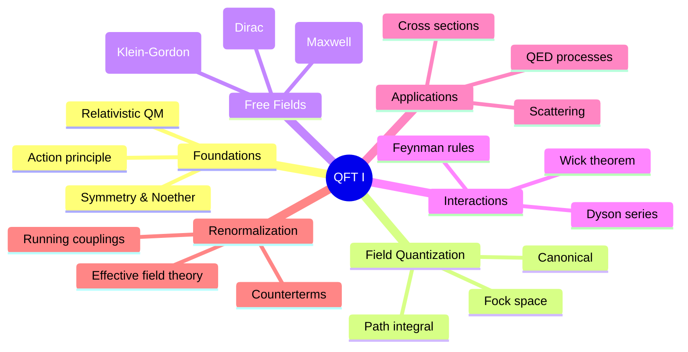
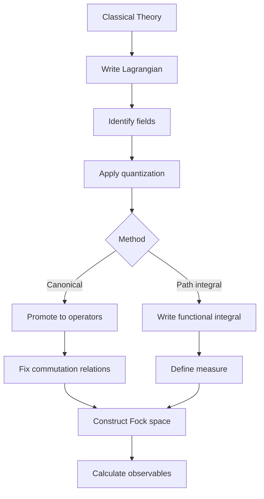
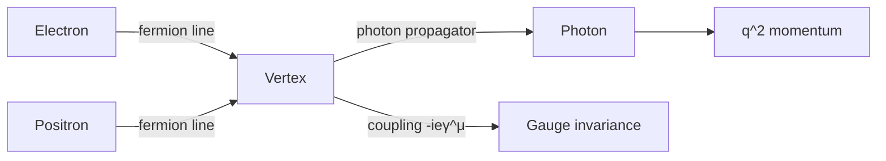

# MSPY 6110 — Quantum Field Theory I
> **MSc Physics Elective | HKUST MSPY 6110 | Relativistic quantum fields, canonical quantization, Feynman diagrams, renormalization**  
> **Bilingual 深度自學檔案 · 中英對照**

---

## 問題 1：5 個核心心智模型

1. **Fields are more fundamental than particles** — 場比粒子更基本
   - Second quantization unifies quantum mechanics + special relativity
   - Particles = quantized excitations of underlying fields
   - Wave-particle duality resolved: fields are primary

2. **Symmetries generate conservation laws via Noether's theorem** — 對稱性產生守恆定律
   - Continuous spacetime symmetry → conserved currents
   - Gauge symmetry → interactions (Yang-Mills)
   - Lorentz invariance → spin-statistics connection

3. **Perturbation theory organizes interactions** — 微擾理論組織相互作用
   - Interaction picture: $H = H_0 + H_{int}$
   - Dyson series: $S = T\exp[-i\int d^4x \mathcal{H}_{int}]$
   - Feynman diagrams = bookkeeping device

4. **Renormalization handles infinities systematically** — 重整化系統處理無窮大
   - Wilsonian: integrate out high energies
   - Counterterms absorb divergences
   - Running couplings depend on scale

5. **Path integrals connect QM to QFT** — 路徑積分連接量子力學與量子場論
   - $⟨0|T\phi(x)\phi(y)|0⟩ = \int \mathcal{D}\phi \phi(x)\phi(y) e^{iS[\phi]}$
   - Easier for gauge theories
   - Natural generalization to strings

---

## 問題 2：3 個根本分歧

### 分歧 1：Canonical vs Path Integral Quantization
| Aspect | Canonical Quantization | Path Integral |
|--------|----------------------|---------------|
| Starting point | Operator formalism | Lagrangian/Action |
| Hilbert space | Central | Emergent |
| Gauge theories | Constrained Hamiltonian | Elegant |
| Unitarity | Manifest | Requires care |
| Books | Peskin Ch. 2 | Zinn-Justin, Weinberg |

### 分歧 2：Wilsonian vs Conventional Renormalization
| Aspect | Wilsonian | Conventional |
|--------|-----------|--------------|
| Philosophy | Effective field theory | Remove infinities |
| Parameters | Scale-dependent | Fixed at renormalization point |
| Physics | Cutoff is physical | Cutoff is mathematical |
| Advocates | Wilson, Polchinski | Pauli, Dirac (historically) |

### 分歧 3：Axiomatic vs Constructive QFT
| Approach | Axiomatic | Constructive |
|----------|-----------|--------------|
| Starting point | axioms (Wightman, Osterwalder-Schrader) | simpler theories |
| Goal | rigor, foundations | explicit models |
| Examples | PCT, spin-statistics | lattice, perturbation |
| Status | mathematical physics | active research |

---

## 問題 3：10 個深度問題

1. **Klein-Gordon Equation**: 給定 Lorentz invariant scalar field, derive $(\Box + m^2)\phi = 0$
   - Relativistic energy: $E^2 = p^2 + m^2$
   - Klein-Gordon: $(i\partial_0)^2 - \nabla^2 + m^2 = 0$
   - In covariant form: $(\partial_\mu\partial^\mu + m^2)\phi = 0$

2. **Lorentz Invariance**: 解釋為什麼 requires dispersion relation $E^2 = p^2 + m^2$
   - Lorentz transformations preserve $p^\mu p_\mu = -m^2$
   - Casimir invariants of Poincaré group
   - Particle interpretation requires positive energy

3. **Creation Operators**: 為什麼 free field solution involves creation/annihilation operators
   - Mode expansion: $\phi(x) = \int \frac{d^3p}{(2\pi)^3} \frac{1}{\sqrt{2E_p}}(a_p e^{-ipx} + a_p^\dagger e^{ipx})$
   - $a_p^\dagger$ creates particle with momentum $p$
   - Fock space: $|p_1, p_2, ..., p_n⟩ = a_{p_1}^\dagger ... a_{p_n}^\dagger |0⟩$

4. **Microcausality**: 給定 commutator $[\phi(x), \phi(y)]$, 證明 field must anticommute for fermions
   - Bosons: $[\phi(x), \phi(y)] = 0$ for spacelike separation
   - Fermions: $\{\psi(x), \psi(y)\} = 0$ for spacelike separation
   - Spin-statistics theorem: spin 0,1 → bosons; spin 1/2 → fermions

5. **Propagator Definition**: 為什麼 vacuum expectation of time-ordered product defines propagator
   - $D_F(x-y) = ⟨0|T\phi(x)\phi(y)|0⟩$
   - Feynman prescription: pole prescription $p^0 = ±\sqrt{p^2+m^2} + i\epsilon$
   - Encodes all information about free field propagation

6. **Dyson Series**: 給定 interaction Lagrangian, derive S-matrix expansion
   - $S = T\exp[-i\int d^4x \mathcal{H}_{int}(x)]$
   - Expansion: $S = \sum_n \frac{(-i)^n}{n!}\int d^4x_1...d^4x_n T\mathcal{H}_{int}(x_1)...\mathcal{H}_{int}(x_n)$
   - $T$ = time-ordering operator

7. **Wick's Theorem**: 解釋如何將 time-ordered products to normal-ordered + contractions
   - $T\phi(x)\phi(y) = :\phi(x)\phi(y): + ⟨0|\phi(x)\phi(y)|0⟩$
   - General: all pairings contribute
   - Contractions = propagators

8. **Feynman Rules**: 為什麼 assign specific factors
   - Propagator: $i/(p^2 - m^2 + i\epsilon)$ from free Green's function
   - Vertex: $-ig$ from interaction $\mathcal{L}_{int} = -g\phi^4/4!$
   - Momentum conservation at each vertex

9. **$e^+e^- → \mu^+\mu^-$**: 給定 tree-level process, calculate differential cross section
   - Amplitude: $\mathcal{M} = \frac{e^2}{q^2}(\bar{v}_{s'} \gamma^\mu u_s)(\bar{u}_r \gamma_\mu v_{r'})$
   - $|M|^2$ averaged: $\frac{e^4}{q^4}(t^2 + u^2)$
   - $\frac{d\sigma}{d\Omega} = \frac{\alpha^2}{4s}(1 + \cos^2\theta)$

10. **Gauge Invariance**: 為什麼 QED vertex factor $-ie\gamma^\mu$ respects gauge invariance
    - From covariant derivative: $D_\mu = \partial_\mu + ieA_\mu$
    - Interaction: $\mathcal{L}_{int} = -ie\bar{\psi}\gamma^\mu\psi A_\mu$
    - Ward-Takahashi identity: $q_\mu \mathcal{M}^\mu = 0$

---

## 深入 1：Relativistic Wave Equations
**Deep Dive I**

### Klein-Gordon Equation
從 relativistically invariant action出發:

$$S = \int d^4x \left[ \frac{1}{2}(\partial_\mu\phi)(\partial^\mu\phi) - \frac{1}{2}m^2\phi^2 \right]$$

變分得到 Euler-Lagrange方程：
$$(\Box + m^2)\phi(x) = 0, \quad \Box \equiv \partial_\mu\partial^\mu$$

Plane wave solution:
$$\phi(x) = \int \frac{d^3p}{(2\pi)^3} \frac{1}{\sqrt{2E_p}} \left( a_p e^{-ip\cdot x} + a_p^\dagger e^{ip\cdot x} \right)$$

其中 $E_p = \sqrt{p^2 + m^2}$, $p\cdot x = E_pt - \vec{p}\cdot\vec{x}$

**Problem**: Klein-Gordon allows negative probability densities (not suitable for single-particle interpretation)

### Dirac Equation
要求 spinor field satisfying Lorentz covariance:

$$(i\gamma^\mu\partial_\mu - m)\psi(x) = 0$$

Gamma矩陣代數: $\{\gamma^\mu, \gamma^\nu\} = 2g^{\mu\nu}$

Dirac conjugate: $\bar{\psi} = \psi^\dagger\gamma^0$

Solution structure:
$$\psi(x) = \int \frac{d^3p}{(2\pi)^3} \frac{1}{\sqrt{2E_p}} \sum_s \left( b_s(p) u^s(p)e^{-ip\cdot x} + d_s^\dagger(p) v^s(p)e^{ip\cdot x} \right)$$

$u^s(p)$: positive energy spinors (particle)
$v^s(p)$: negative energy spinors (antiparticle)

### Key Results
| Equation | Spin | Particle | Problem |
|----------|------|----------|---------|
| Klein-Gordon | 0 | Scalar | Negative probability |
| Dirac | 1/2 | Spinor | None (proton, electron) |
| Proca | 1 | Vector | $m=0$ → Maxwell |
| Rarita-Schwinger | 3/2 | Spinor-vector | Supercharge |

**Engineering implication:** Classification of fields by spin via Lorentz group representation theory determines interaction structure

---

## 深入 2：Canonical Quantization
**Deep Dive II**

### Scalar Field Quantization
Promote classical field to operator:
$$\hat{\phi}(x) = \int \frac{d^3p}{(2\pi)^3} \frac{1}{\sqrt{2E_p}} \left( \hat{a}_p e^{-ip\cdot x} + \hat{a}_p^\dagger e^{ip\cdot x} \right)$$

Creation/annihilation operators satisfy:
$$[\hat{a}_p, \hat{a}_q^\dagger] = (2\pi)^3 \delta^{(3)}(p-q)$$

其他對易子為零 (玻色子)

Fock vacuum: $\hat{a}_p|0⟩ = 0$

N-particle state: $\hat{a}_p^\dagger|0⟩ = |p⟩$

2-particle state: $\hat{a}_{p_1}^\dagger\hat{a}_{p_2}^\dagger|0⟩$

### Propagator Definition
$$\Delta(x-y) = ⟨0|T\phi(x)\phi(y)|0⟩ = \theta(x^0-y^0)\Delta_+(x-y) + \theta(y^0-x^0)\Delta_+(y-x)$$

Feynman propagator (momentum space):
$$D_F(p) = \frac{i}{p^2 - m^2 + i\epsilon}$$

**重要**: $i\epsilon$ prescription確保正確的邊界條件

### Microcausality
$$\langle 0|[\phi(x), \phi(y)]|0\rangle = i\Delta(x-y)$$

要求 local field theory: $[\phi(x), \phi(y)] = 0$ for spacelike separation

Fermions: anticommutator $\{\psi(x), \bar{\psi}(y)\} = \delta^{(3)}(x-y)$

**Engineering implication:** Causality implemented through (anti)commutation relations at spacelike separation

---

## 深入 3：Feynman Diagrams & Perturbation Theory
**Deep Dive III**

### Dyson Series
$$S = T\exp\left[-i\int d^4x \mathcal{H}_{int}(x)\right]$$

Expansion gives perturbative series:
$$S = \sum_{n=0}^\infty \frac{(-i)^n}{n!}\int d^4x_1 \cdots d^4x_n T\mathcal{H}_{int}(x_1)\cdots\mathcal{H}_{int}(x_n)$$

### Wick's Theorem
$$T\phi(x_1)\phi(x_2)\cdots\phi(x_n) = :\phi(x_1)\phi(x_2)\cdots\phi(x_n): + \text{all contractions}$$

Normal ordering: creation operators left of annihilation operators (vacuum expectation = 0)

Contractions = propagators:
$$\overline{\phi(x)\phi(y)} = \langle 0|T\phi(x)\phi(y)|0\rangle = D_F(x-y)$$

### Feynman Rules for $\phi^4$ Theory
Interaction: $\mathcal{L}_{int} = -\frac{\lambda}{4!}\phi^4$

| Element | Factor |
|---------|--------|
| Internal line (propagator) | $\frac{i}{p^2 - m^2 + i\epsilon}$ |
| Vertex | $-i\lambda$ |
| External line | $1$ |
| Loop momentum | $\int \frac{d^4p}{(2\pi)^4}$ |
| Symmetry factor | $1/S$ |

### Sample Calculation: $\phi^4$ Scattering
Tree-level amplitude (1 diagram):
$$\mathcal{M} = -i\lambda$$

Cross section:
$$\frac{d\sigma}{d\Omega} = \frac{|\mathcal{M}|^2}{64\pi^2 s} = \frac{\lambda^2}{64\pi^2 s}$$

**Engineering implication:** Feynman diagrams organize perturbation theory systematically

---

## 深入 4：QED Introduction
**Deep Dive IV**

### QED Lagrangian
$$\mathcal{L} = \bar{\psi}(i\gamma^\mu D_\mu - m)\psi - \frac{1}{4}F_{\mu\nu}F^{\mu\nu}$$

Covariant derivative: $D_\mu = \partial_\mu + ieA_\mu$

Field strength: $F_{\mu\nu} = \partial_\mu A_\nu - \partial_\nu A_\mu$

### QED Feynman Rules
| Element | Factor |
|---------|--------|
| Fermion propagator | $\frac{i(\slashed{p}+m)}{p^2 - m^2 + i\epsilon}$ |
| Photon propagator | $\frac{-ig_{\mu\nu}}{q^2 + i\epsilon}$ |
| Vertex | $-ie\gamma^\mu$ |
| External fermion | $u(p)$ or $\bar{v}(p)$ |
| External photon | $\epsilon_\mu(k)$ |

### Ward-Takahashi Identity
$$q_\mu \mathcal{M}^\mu = 0$$

Ensures gauge invariance and charge conservation at quantum level.

No photon mass term allowed by gauge invariance.

### Example: $e^+e^- \to \mu^+\mu^-$
Tree-level amplitude (one photon exchange):
$$\mathcal{M} = \frac{e^2}{q^2}(\bar{v}_{s'} \gamma^\mu u_s)(\bar{u}_r \gamma_\mu v_{r'})$$

Cross section (unpolarized):
$$\frac{d\sigma}{d\cos\theta} = \frac{\pi\alpha^2}{2s}\left(1 + \cos^2\theta\right)$$

Total cross section:
$$\sigma = \frac{4\pi\alpha^2}{3s}$$

**Engineering implication:** QED is most precisely tested theory in physics (g-2 agreement to 10 digits)

---

## 深入 5：Renormalization Basics
**Deep Dive V**

### Power Counting
Superficial degree of divergence:
$$D = 4 - E_f - \frac{3}{2}E_b - \sum_i n_i \delta_i$$

Where:
- $E_f$ = number of external fermions
- $E_b$ = number of external bosons
- $n_i$ = number of vertices of type $i$
- $\delta_i$ = engineering dimension of coupling

For $\phi^4$ in 4D: $D = 4 - 4n$, only 0-loop diagrams diverge

### Minimal Subtraction Scheme
Write Lagrangian with counterterms:
$$\mathcal{L} = \frac{1}{2}(Z_\phi \partial_\mu\phi\partial^\mu\phi - Z_m m^2 \phi^2) - \frac{Z_\lambda \lambda}{4!}\phi^4$$

Renormalization conditions at $p^2 = -\mu^2$:
$$\Gamma^{(2)}(-\mu^2) = \mu^2, \quad \Gamma^{(4)}(-\mu^2,-\mu^2,-\mu^2) = -\lambda$$

### Running Coupling
$$\mu\frac{d\lambda}{d\mu} = \beta(\lambda), \quad \beta(\lambda) = \frac{3\lambda^2}{16\pi^2} + O(\lambda^3)$$

For $\phi^4$: $\beta > 0$ → coupling grows with energy (not asymptotic freedom)

QCD: $\beta(\alpha_s) < 0$ → asymptotic freedom (反對應)

**Engineering implication:** Renormalization makes quantum field theory predictive by absorbing infinities into redefinitions

---

## 自測 1：Klein-Gordon Derivation
**Answer:** From action $S = \int d^4x[\frac{1}{2}(\partial_\mu\phi)^2 - \frac{1}{2}m^2\phi^2]$, vary $\phi$:
$$\frac{\delta S}{\delta\phi} = -\Box\phi - m^2\phi = 0 \Rightarrow (\Box + m^2)\phi = 0$$

**Engineering implication:** Action principle yields field equations

---

## 自測 2：Lorentz Invariance
**Answer:** Lorentz transformation preserves $p^\mu p_\mu = -m^2$, giving dispersion $E^2 = p^2 + m^2$. Casimir of Poincaré group. No negative energy states allowed for stable particles.

**Engineering implication:** Symmetry constrains dynamics

---

## 自測 3：Creation Operators
**Answer:** Expanding solution in plane waves, coefficients become operators that create/destroy quanta. $a^\dagger|p⟩$ adds particle with momentum $p$.

**Engineering implication:** Field quantization = particle creation/annihilation

---

## 自測 4：Microcausality
**Answer:** For spacelike separation, commutator vanishes. Bosons commute, fermions anticommute. Spin-statistics theorem connects spin to statistics.

**Engineering implication:** Causality in QFT through field (anti)commutators

---

## 自測 5：Propagator Definition
**Answer:** Vacuum expectation of time-ordered product gives probability amplitude for field propagation. Feynman prescription: $p^0 = ±\sqrt{p^2+m^2} + i\epsilon$.

**Engineering implication:** Propagator = Green's function for field equation

---

## 自測 6：Dyson Series
**Answer:** $S = T\exp[-i\int d^4x\mathcal{H}_{int}]$ expands to series in powers of coupling. Each term = sum over time-ordered products.

**Engineering implication:** Interaction picture enables perturbation expansion

---

## 自測 7：Wick's Theorem
**Answer:** Normal-ordered product + all possible pair contractions reproduces time-ordered product. Contractions = propagators.

**Engineering implication:** Simplifies higher-order calculations

---

## 自測 8：Feynman Rules
**Answer:** Propagator from free Green's function, vertex from interaction Lagrangian, momentum conservation at each vertex.

**Engineering implication:** Rules enable systematic amplitude calculation

---

## 自測 9：$e^+e^- \to \mu^+\mu^-$
**Answer:** $\frac{d\sigma}{d\Omega} = \frac{\alpha^2}{4s}(1+\cos^2\theta)$, integrate for total: $\sigma = \frac{4\pi\alpha^2}{3s}$.

**Engineering implication:** QED predicts cross sections with high precision

---

## 自測 10：Gauge Invariance
**Answer:** Vertex $-ie\gamma^\mu$ from covariant derivative $D_\mu = \partial_\mu + ieA_\mu$ ensures gauge invariance. Ward identity guarantees charge conservation.

**Engineering implication:** Gauge symmetry = fundamental principle of Standard Model

---

## 📊 Diagram 1: QFT I Concept Map


## 📊 Diagram 2: Quantization Procedure


## 📊 Diagram 3: Feynman Diagram Hierarchy
```mermaid
graph TD
    A[Scattering Process] --> B[Tree level]
    B --> C[1-loop]
    C --> D[2-loop]
    D --> E[n-loop]
    B --> F[Simplest]
    C --> G[One integration]
    D --> H[Two integrations]
    F --> I[O(λ)]
    G --> J[O(λ²)]
    H --> K[O(λ³)]
    I --> L[Born]
    J --> M[Quantum corrections]
```

## 📊 Diagram 4：Renormalization Flow
```mermaid
graph TD
    A[UV Physics] --> B[Cutoff Λ]
    B --> C[Bare parameters]
    C --> D[Renormalized parameters]
    D --> E[Physical observables]
    E --> F[IR Physics]
    A -.->|Integrate out| D
    G[μ scale] --> D
    G --> H[Running coupling]
    H --> I[dλ/dμ = β(λ)]
```

## 📊 Diagram 5：QED Vertex Structure


---

## 深度總結 Deep Insights

1. **Fields = excitations of vacuum** — particles are quantized field modes
   - **場 = 真空的激發** — 粒子是量化場模
   - Vacuum is not empty; quantum fluctuations exist
   - Particle = localized excitation

2. **Symmetry constrains everything** — Lorentz + gauge invariance = Standard Model
   - **對稱性約束一切** — 洛倫茲 + 規範不變性 = 標準模型
   - Noether's theorem: symmetry → conservation law
   - Gauge symmetry → interactions

3. **Diagrams are bookkeeping** — Feynman diagrams organize perturbation theory
   - **圖是簿記** — 費曼圖組織微擾理論
   - Each diagram = term in expansion
   - Pictures reveal physics

4. **Renormalization is not cheating** — it's the way quantum fields behave
   - **重整化不是作弊** — 這是量子場的行為方式
   - Wilsonian picture: physics depends on scale
   - Effective field theory philosophy

5. **QED is the template** — all gauge theories follow similar structure
   - **QED是模板** — 所有規範理論遵循類似結構
   - Replace $U(1)$ with $SU(N)$
   - QCD, Electroweak follow same pattern

---

**自學建議**

**必讀:**
- Peskin & Schroeder "An Introduction to Quantum Field Theory" (Ch. 1-7) — the standard
- Srednicki "Quantum Field Theory" — more modern, free online
- Weinberg Vol. 1 "Quantum Field Theory" — deep and comprehensive

**配對:**
- Tong "Quantum Field Theory" lectures (Cambridge) — excellent online notes
- Schwartz "Quantum Field Theory and the Standard Model" — modern approach
- Badis Ydri "QFT Solved Problems" — exercises

**工具:**
- FeynCalc (Mathematica) — amplitude calculations
- FORM — high-energy physics algebra
- QFT github repositories

**產出:**
- Calculate 3 QED processes at tree level
- Derive Ward identity from gauge invariance
- Compute 1-loop correction to propagator

**權威教材章節對照:**
| Topic | Peskin | Weinberg | Tong |
|-------|--------|----------|------|
| KG quantization | Ch 2 | Vol 1 Ch 5 | Ch 2 |
| Dirac quantization | Ch 3 | Vol 1 Ch 5 | Ch 3 |
| Path integral | Ch 9 | Vol 1 Ch 9 | Ch 4 |
| QED | Ch 4-5 | Vol 1 Ch 6 | Ch 5 |
| Renormalization | Ch 10-12 | Vol 1 Ch 12 | Ch 7 |

---

**最後更新:** 2024-03-15
**自學狀態:** 📚 繼續深入學習
**下一步:** 完成QED計算 + 學習重整化群
