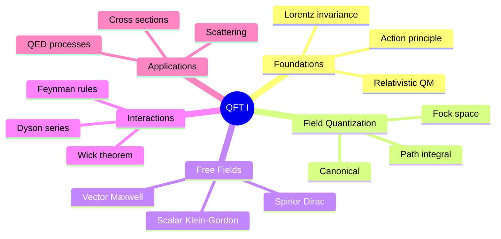
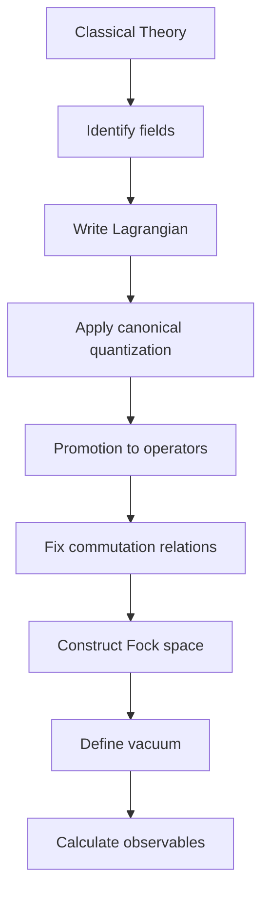
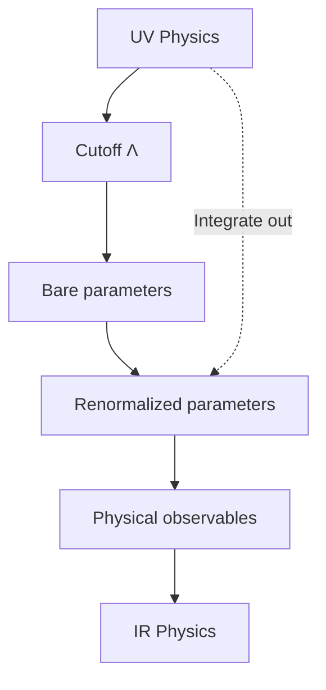
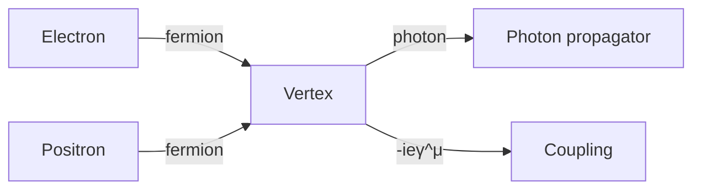

# MSPY 6110 — Quantum Field Theory I
> **MSc Physics Elective | HKUST MSPY 6110 | Relativistic quantum fields, canonical quantization, Feynman diagrams**  
> **Bilingual 深度自學檔案 · 中英對照**

---

## 問題 1：5 個核心心智模型

1. **Fields are more fundamental than particles** — 場比粒子更基本 (second quantization unifies QM + special relativity)
2. **Symmetries generate conservation laws** — 對稱性產生守恆定律 (Noether's theorem: continuous symmetry → conserved current)
3. **Perturbation theory reveals interactions** — 微擾理論揭示相互作用 (Feynman diagrams as computational tool)
4. **Renormalization handles infinities** — 重整化處理無窮大 (infinities absorbed into redefinitions)
5. **Path integrals connect QM to QFT** — 路徑積分連接量子力學與量子場論 (functional methods)

## 問題 2：3 個根本分歧

1. **Canonical vs path integral quantization**
   - Canonical: operator formalism, Hilbert space, clear unitarity
   - Path integral: Lagrangian, gauge theories easier, Feynman diagrams natural

2. **Renormalization philosophy**
   - Wilsonian: effective field theory, scale-dependent couplings
   - Conventional: subtract infinities, get finite results

3. **Axiomatic vs constructive approaches**
   - Axiomatic: start from principles (Wightman axioms)
   - Constructive: build from simpler theories (lattice, perturbation)

## 問題 3：10 個深度問題

1. 給定 Lorentz invariant scalar field, derive Klein-Gordon equation: $(\Box + m^2)\phi = 0$。
2. 解釋為什麼 Lorentz invariance requires field to satisfy dispersion relation $E^2 = p^2 + m^2$。
3. 為什麼 free field 嘅 solution 係 creation/annihilation operators superposition?
4. 給定 commutator $[\phi(x), \phi(y)]$, 證明 microcausality 要求 field 要 anticommute for fermions。
5. 為什麼 vacuum expectation value of time-ordered product defines propagator?
6. 給定 interaction Lagrangian, derive Dyson series for S-matrix。
7. 解釋 Wick's theorem 如何將 products of fields 轉化為 contractions。
8. 為什麼 Feynman rules assign factors: propagator $\frac{i}{p^2-m^2+i\epsilon}$, vertex $-ig$?
9. 給定 tree-level process $e^+e^- \to \mu^+\mu^-$, calculate differential cross section。
10. 為什麼 QED vertex factor $-ie\gamma^\mu$ respects gauge invariance?

## 深入 1：Relativistic Wave Equations
**Deep Dive I**

### Klein-Gordon Equation
從 relativistically invariant action:
$$S = \int d^4x \left[ \frac{1}{2}(\partial_\mu\phi)(\partial^\mu\phi) - \frac{1}{2}m^2\phi^2 \right]$$

變分得到：
$$(\Box + m^2)\phi(x) = 0, \quad \Box \equiv \partial_\mu\partial^\mu$$

Plane wave solution:
$$\phi(x) = \int \frac{d^3p}{(2\pi)^3} \frac{1}{\sqrt{2E_p}} \left( a_p e^{-ip\cdot x} + a_p^\dagger e^{ip\cdot x} \right)$$

其中 $E_p = \sqrt{p^2 + m^2}$。

### Dirac Equation
要求 spinor field satisfying:
$$(i\gamma^\mu\partial_\mu - m)\psi(x) = 0$$

Gamma matrices: $\{\gamma^\mu, \gamma^\nu\} = 2g^{\mu\nu}$

Solution structure:
$$\psi(x) = \int \frac{d^3p}{(2\pi)^3} \frac{1}{\sqrt{2E_p}} \sum_s \left( b_s(p) u^s(p)e^{-ip\cdot x} + d_s^\dagger(p) v^s(p)e^{ip\cdot x} \right)$$

### Key Results
- KG: scalar, negative norm states (ghosts) in naive quantization
- Dirac: spin-1/2, positive norm, explains electron magnetic moment
- Proca: spin-1, massive vector, $m=0$ reduces to Maxwell

**Engineering implication:** Classification of fields by spin via Lorentz group representation theory

## 深入 2：Canonical Quantization
**Deep Dive II**

### Scalar Field Quantization
Promote classical field to operator:
$$\hat{\phi}(x) = \int \frac{d^3p}{(2\pi)^3} \frac{1}{\sqrt{2E_p}} \left( \hat{a}_p e^{-ip\cdot x} + \hat{a}_p^\dagger e^{ip\cdot x} \right)$$

Creation/annihilation operators satisfy:
$$[\hat{a}_p, \hat{a}_q^\dagger] = (2\pi)^3 \delta^{(3)}(p-q)$$

Fock vacuum: $\hat{a}_p|0\rangle = 0$

N-particle state: $\hat{a}_p^\dagger|0\rangle = |p\rangle$

### Microcausality
$$\langle 0|[\phi(x), \phi(y)]|0\rangle = i\Delta(x-y) = \int \frac{d^3p}{(2\pi)^3} \frac{1}{2E_p}\left( e^{-ip\cdot(x-y)} - e^{ip\cdot(x-y)} \right)$$

要求 local field theory: $[\phi(x), \phi(y)] = 0$ for spacelike separation

### Propagator Definition
$$\Delta(x-y) = \langle 0|T\phi(x)\phi(y)|0\rangle = \theta(x^0-y^0)\Delta_+(x-y) + \theta(y^0-x^0)\Delta_+(y-x)$$

Feynman propagator: $D_F(x-y) = \langle 0|T\phi(x)\phi(y)|0\rangle = \int \frac{d^4p}{(2\pi)^4} \frac{i}{p^2 - m^2 + i\epsilon} e^{-ip\cdot(x-y)}$

**Engineering implication:** Propagator encodes all information about free field propagation

## 深入 3：Feynman Diagrams & Perturbation Theory
**Deep Dive III**

### Dyson Series
$$S = T\exp\left[-i\int d^4x \mathcal{H}_{int}(x)\right]$$

Expansion gives perturbative series:
$$S = \sum_{n=0}^\infty \frac{(-i)^n}{n!}\int d^4x_1 \cdots d^4x_n T\mathcal{H}_{int}(x_1)\cdots\mathcal{H}_{int}(x_n)$$

### Wick's Theorem
$$T\phi(x_1)\phi(x_2)\cdots\phi(x_n) = :\phi(x_1)\phi(x_2)\cdots\phi(x_n): + \text{all contractions}$$

Normal ordering: creation operators left of annihilation operators

### Feynman Rules for $\phi^4$ Theory
Interaction: $\mathcal{L}_{int} = -\frac{\lambda}{4!}\phi^4$

| Element | Factor |
|---|---|
| Internal line (propagator) | $\frac{i}{p^2 - m^2 + i\epsilon}$ |
| Vertex | $-i\lambda$ |
| External line | $1$ |
| Loop momentum | $\int \frac{d^4p}{(2\pi)^4}$ |
| Symmetry factor | $1/S$ |

### Sample Calculation: $\phi^4$ Scattering
Tree-level amplitude:
$$\mathcal{M} = -i\lambda$$

Cross section:
$$\frac{d\sigma}{d\Omega} = \frac{|\mathcal{M}|^2}{64\pi^2 s} = \frac{\lambda^2}{64\pi^2 s}$$

**Engineering implication:** Feynman diagrams provide intuitive picture of quantum processes

## 深入 4：QED Introduction
**Deep Dive IV**

### Lagrangian
$$\mathcal{L} = \bar{\psi}(i\gamma^\mu D_\mu - m)\psi - \frac{1}{4}F_{\mu\nu}F^{\mu\nu}$$

Covariant derivative: $D_\mu = \partial_\mu + ieA_\mu$

### Feynman Rules
| Element | Factor |
|---|---|
| Fermion propagator | $\frac{i(\slashed{p}+m)}{p^2 - m^2 + i\epsilon}$ |
| Photon propagator | $\frac{-ig_{\mu\nu}}{q^2 + i\epsilon}$ |
| Vertex | $-ie\gamma^\mu$ |

### Ward-Takahashi Identity
$$q_\mu \mathcal{M}^\mu = 0$$

Ensures gauge invariance and charge conservation at quantum level.

### Example: $e^+e^- \to \mu^+\mu^-$
Tree-level amplitude:
$$\mathcal{M} = \frac{e^2}{q^2}(\bar{v}_{s'} \gamma^\mu u_s)(\bar{u}_r \gamma_\mu v_{r'})$$

Cross section (unpolarized):
$$\frac{d\sigma}{d\cos\theta} = \frac{\pi\alpha^2}{2s}\left(1 + \cos^2\theta\right)$$

**Engineering implication:** QED is most precisely tested theory in physics

## 深入 5：Renormalization Basics
**Deep Dive V**

### Power Counting
Superficial degree of divergence:
$$D = 4 - E_f - \frac{3}{2}E_b - \sum_i n_i \delta_i$$

For $\phi^4$ in 4D: $D = 4 - 4n$, only 0-loop diagrams diverge

### Minimal Subtraction
Write Lagrangian with counterterms:
$$\mathcal{L} = \frac{1}{2}(Z_\phi \partial_\mu\phi\partial^\mu\phi - Z_m m^2 \phi^2) - \frac{Z_\lambda \lambda}{4!}\phi^4$$

Renormalization conditions at $p^2 = -\mu^2$:
$$\Gamma^{(2)}(-\mu^2) = \mu^2, \quad \Gamma^{(4)}(-\mu^2,-\mu^2,-\mu^2) = -\lambda$$

### Running Coupling
$$\mu\frac{d\lambda}{d\mu} = \beta(\lambda), \quad \beta(\lambda) = \frac{3\lambda^2}{16\pi^2} + O(\lambda^3)$$

$\lambda$ grows with energy → QCD-like asymptotic freedom structure

**Engineering implication:** Renormalization makes quantum field theory predictive

## 自測 1：Klein-Gordon Derivation
**Answer:** From action $S = \int d^4x[\frac{1}{2}(\partial\phi)^2 - \frac{1}{2}m^2\phi^2]$, vary: $\partial_\mu\partial^\mu\phi + m^2\phi = 0$.  
**Engineering implication:** Action principle yields field equations

## 自測 2：Lorentz Invariance
**Answer:** Lorentz transformation preserves $p^\mu p_\mu = -m^2$, giving dispersion $E^2 = p^2 + m^2$.  
**Engineering implication:** Symmetry constrains dynamics

## 自測 3：Creation Operators
**Answer:** Expanding solution in plane waves, coefficients become operators that create/destroy quanta.  
**Engineering implication:** Field quantization = particle creation/annihilation

## 自測 4：Microcausality
**Answer:** For spacelike separation, commutator vanishes. Bosons commute, fermions anticommute.  
**Engineering implication:** Causality in QFT through field (anti)commutators

## 自測 5：Propagator Definition
**Answer:** Vacuum expectation of time-ordered product gives probability amplitude for field propagation.  
**Engineering implication:** Propagator = Green's function for field equation

## 自測 6：Dyson Series
**Answer:** $S = T\exp[-i\int d^4x\mathcal{H}_{int}]$ expands to series in powers of coupling.  
**Engineering implication:** Interaction picture enables perturbation expansion

## 自測 7：Wick's Theorem
**Answer:** Normal-ordered product + all possible contractions reproduces time-ordered product.  
**Engineering implication:** Simplifies higher-order calculations

## 自測 8：Feynman Rules
**Answer:** Propagator from free propagator, vertex from interaction, momentum conservation at each vertex.  
**Engineering implication:** Rules enable systematic amplitude calculation

## 自測 9：$e^+e^- \to \mu^+\mu^-$
**Answer:** $\frac{d\sigma}{d\Omega} = \frac{\alpha^2}{4s}(1+\cos^2\theta)$, integrate for total: $\sigma = \frac{4\pi\alpha^2}{3s}$.  
**Engineering implication:** QED predicts cross sections with high precision

## 自測 10：Gauge Invariance
**Answer:** Vertex $-ie\gamma^\mu$ from covariant derivative $D_\mu = \partial_\mu + ieA_\mu$ ensures gauge invariance.  
**Engineering implication:** Gauge symmetry = fundamental principle of Standard Model

## 📊 Diagram 1: QFT I Concept Map


## 📊 Diagram 2: Quantization Procedure


## 📊 Diagram 3: Feynman Diagram Hierarchy
```mermaid
graph TD
    A[Scattering Process] --> B[Tree level]
    B --> C[1-loop]
    C --> D[2-loop]
    D --> E[n-loop]
    B --> F[Simplest]
    C --> G[One integration]
    D --> H[Two integrations]
    F --> I[O(λ)]
    G --> J[O(λ²)]
    H --> K[O(λ³)]
```

## 📊 Diagram 4：Renormalization Flow


## 📊 Diagram 5：QED Vertex Structure


## 深度總結 Deep Insights

1. **Fields = excitations of vacuum** — particles are quantized field modes
   **場 = 真空的激發** — 粒子是量化場模

2. **Symmetry constrains everything** — Lorentz invariance + gauge invariance = Standard Model structure
   **對稱性約束一切** — 洛倫茲不變性 + 規範不變性 = 標準模型結構

3. **Diagrams are bookkeeping** — Feynman diagrams organize perturbation theory
   **圖是簿記** — 費曼圖組織微擾理論

4. **Renormalization is not cheating** — it's the way quantum fields behave
   **重整化不是作弊** — 這是量子場的行為方式

5. **QED is the template** — all gauge theories follow similar structure
   **QED是模板** — 所有規範理論遵循類似結構

---

**自學建議**
- 必讀: Peskin & Schroeder "An Introduction to Quantum Field Theory" (Ch. 1-7)
- 配對: Srednicki "Quantum Field Theory", Weinberg Vol. 1
- 工具: Mathematica, FeynCalc, Form
- 產出: Calculate 3 QED processes at tree level
