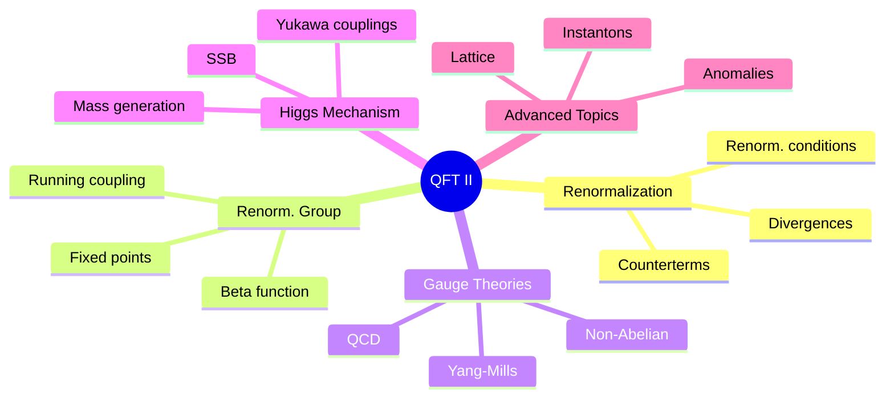
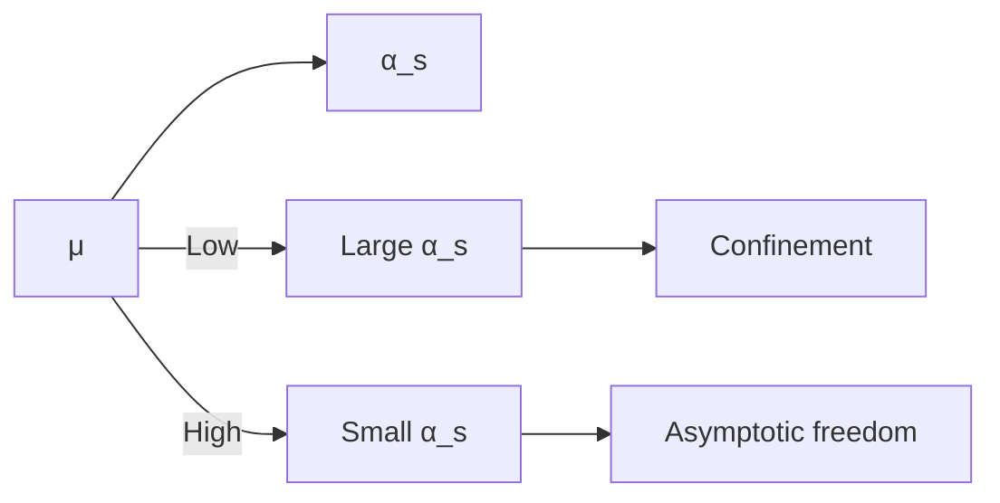
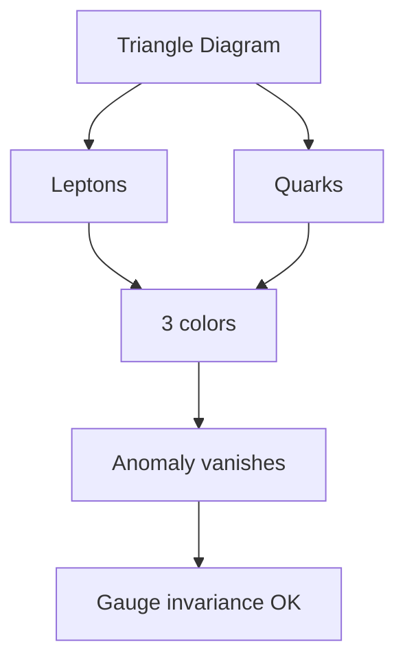

# MSPY 6210 — Quantum Field Theory II
> **MSc Physics Elective | HKUST MSPY 6210 | Renormalization, renormalization group, non-Abelian gauge theories, QCD**  
> **Bilingual 深度自學檔案 · 中英對照**

---

## 問題 1：5 個核心心智模型

1. **Renormalization group describes scale dependence** — 重整化群描述尺度依賴 (couplings run with energy)
2. **Asymptotic freedom makes QCD calculable** — 漸近自由使QCD可計算 (strong coupling → weak at high energy)
3. **Path integral unifies quantization** — 路徑積分統一量化方法 (functional methods for gauge theories)
4. **Spontaneous symmetry breaking generates mass** — 自發對稱性破缺產生質量 (Higgs mechanism)
5. **Anomalies constrain quantum consistency** — 反常約束量子一致性 (Adler-Bell-Jackiw anomaly)

## 問題 2：3 個根本分歧

1. **Wilsonian vs conventional renormalization**
   - Wilsonian: integrate out high modes, effective action at scale $\Lambda$
   - Conventional: subtract infinities, renormalized perturbation theory

2. **Perturbative vs non-perturbative methods**
   - Perturbative: Feynman diagrams, expansion in small coupling
   - Non-perturbative: lattice, instantons, duality

3. **Continuum vs lattice regularization**
   - Continuum: dimensional regularization, Pauli-Villars
   - Lattice: spacetime discretization, numerical simulation

## 問題 3：10 個深度問題

1. 給定 1-loop integral $\int d^4k/(2\pi)^4 \frac{1}{(k^2-m^2)((k+p)^2-m^2)}$, calculate using Feynman parameters。
2. 解釋為什麼 dimensional regularization 保留 gauge invariance 而 cutoff 不行。
3. 為什麼 Callan-Symanzik equation describes coupling evolution?
4. 給定 $\beta(g) = -g^3/(16\pi^2)(11 - 2n_f/3)$, 解释 asymptotic freedom。
5. 為什麼 QCD has confinement but QED doesn't?
6. 給定 gauge field $A_\mu^a$, derive non-Abelian field strength $F_{\mu\nu}^a$。
7. 解釋 Slavnov-Taylor identities 如何確保 gauge invariance after renormalization。
8. 為什麼 Higgs mechanism 要求 scalar triplet vs doublet for massive vector?
9. 給定 anomaly condition $\partial_\mu j^\mu = \frac{g^2}{16\pi^2}\text{Tr}[F_{\mu\nu}\tilde{F}^{\mu\nu}]$, 計算 triangle diagram。
10. 為什麼 instantons break $U(1)_{axial}$ symmetry (PCAC)?

## 深入 1：Renormalization at One Loop
**Deep Dive I**

### One-Loop Integrals
Using Feynman parameters:
$$\frac{1}{AB} = \int_0^1 dx \frac{1}{[xA + (1-x)B]^2}$$

Generic 1-loop integral:
$$I = \int_0^1 dx \int \frac{d^4k}{(2\pi)^4} \frac{1}{(k^2 - \Delta)^2}$$

After integration:
$$I = \frac{i}{16\pi^2}\left[\frac{2}{\epsilon} - \gamma + \ln(4\pi) + \ln\Delta + 1\right]$$

### Counterterm Lagrangian
$$\mathcal{L}_{CT} = \frac{1}{2}(Z_\phi - 1)(\partial\phi)^2 - \frac{1}{2}(Z_m - 1)m^2\phi^2 - (Z_\lambda - 1)\frac{\lambda}{4!}\phi^4$$

At 1-loop in $\phi^4$:
$$Z_\lambda = 1 + \frac{\lambda^2}{16\pi^2}\frac{1}{\epsilon}, \quad Z_\phi = 1, \quad Z_m = 1$$

### Renormalization Conditions
$$\Gamma^{(2)}(p^2 = -\mu^2) = -\mu^2 - m_R^2$$
$$\Gamma^{(4)}(p_i^2 = -\mu^2) = -\lambda_R$$

**Engineering implication:** Renormalization absorbs infinities into redefinitions

## 深入 2：Renormalization Group
**Deep Dive II**

### Callan-Symanzik Equation
$$\left[\mu\frac{\partial}{\partial\mu} + \beta(g)\frac{\partial}{\partial g} + n\gamma_\phi(g)\right]\Gamma^{(n)} = 0$$

Derivation from renormalization scale dependence:
$$\mu\frac{d}{d\mu}\Gamma_R = 0 \Rightarrow \left(\mu\frac{\partial}{\partial\mu} + \beta\frac{\partial}{\partial g} + \gamma\right)\Gamma_R = 0$$

### Beta Function Computation
For QED at 1-loop:
$$\beta(e) = \frac{e^3}{12\pi^2} + O(e^5)$$

Coupling grows → Landau pole at $\Lambda \sim M e^{12\pi^2/e^2}$

For QCD at 1-loop:
$$\beta(g) = -\frac{g^3}{16\pi^2}\left(11 - \frac{2n_f}{3}\right)$$

### Asymptotic Freedom
For $n_f < 33/2$:
- $\beta < 0$: coupling decreases at high energy
- $\alpha_s(M_Z) = 0.118 \pm 0.001$
- Perturbative expansion reliable at collider energies

**Engineering implication:** Running coupling explains why QCD is weak at high energy

## 深入 3：Non-Abelian Gauge Theories
**Deep Dive III**

### Yang-Mills Lagrangian
$$\mathcal{L} = -\frac{1}{4}F_{\mu\nu}^a F^{\mu\nu a} + \bar{\psi}(i\gamma^\mu D_\mu - m)\psi$$

Non-Abelian field strength:
$$F_{\mu\nu}^a = \partial_\mu A_\nu^a - \partial_\nu A_\mu^a + g f^{abc}A_\mu^b A_\nu^c$$

Structure constants $f^{abc}$: $[T^a, T^b] = if^{abc}T^c$

### Gauge Boson Self-Interactions
3-gluon vertex:
$$\sim gf^{abc}((p-q)_\eta g_{\mu\nu} + (q-r)_\mu g_{\nu\eta} + (r-p)_\nu g_{\mu\eta})$$

4-gluon vertex:
$$\sim -ig^2 f^{eab}f^{ecd}(g_{\mu\gamma}g_{\nu\delta} - g_{\mu\delta}g_{\nu\gamma}) - \text{perms}$$

### Slavnov-Taylor Identities
Generalization of Ward identities for non-Abelian:
$$\mathcal{S}\Gamma = 0$$

Ensures renormalizability despite gauge fixing.

**Engineering implication:** Non-Abelian gauge theories = Yang-Mills = foundation of SM

## 深入 4：Quantum Chromodynamics
**Deep Dive IV**

### QCD Lagrangian
$$\mathcal{L}_{QCD} = \sum_f \bar{q}_f(i\gamma^\mu D_\mu - m_f)q_f - \frac{1}{4}G_{\mu\nu}^a G^{\mu\nu a}$$

Color: SU(3) gauge theory with 8 gluons

### Running Coupling
$$\alpha_s(\mu) = \frac{\alpha_s(M_Z)}{1 + \frac{\alpha_s(M_Z)}{12\pi}(33-2n_f)\ln(\mu/M_Z)}$$

| Scale $\mu$ | $\alpha_s(\mu)$ |
|---|---|
| 1 GeV | ~0.5 |
| $M_Z$ | 0.118 |
| 100 TeV | ~0.07 |

### Confinement
- No colored asymptotic states
- $\Lambda_{QCD} \approx 200$ MeV: confinement scale
- Quark model: hadrons are color singlets

### Deep Inelastic Scattering
Structure functions: $F_2(x, Q^2) = x\sum_f e_f^2[q_f(x,Q^2) + \bar{q}_f(x,Q^2)]$

Scaling violation from QCD evolution.

**Engineering implication:** QCD describes strong interactions with 1% precision at high $Q^2$

## 深入 5：Spontaneous Symmetry Breaking & Higgs
**Deep Dive V**

### Global Symmetry Breaking
Goldstone theorem: massless boson for each broken continuous symmetry

Example: O(2) → O(1)
$$\mathcal{L} = (\partial_\mu\phi_1)^2 + (\partial_\mu\phi_2)^2 - V(\phi_1^2 + \phi_2^2)$$
$$V = -\mu^2(\phi_1^2 + \phi_2^2) + \lambda(\phi_1^2 + \phi_2^2)^2$$

Minimum at $\langle\phi\rangle = (v, 0)$ gives one Goldstone boson.

### Higgs Mechanism
Complex scalar doublet:
$$\Phi = \begin{pmatrix} \phi^+ \\ \phi^0 \end{pmatrix}, \quad V = -\mu^2\Phi^\dagger\Phi + \lambda(\Phi^\dagger\Phi)^2$$

VEV: $\langle\Phi\rangle = \frac{1}{\sqrt{2}}\begin{pmatrix} 0 \\ v \end{pmatrix}$, $v \approx 246$ GeV

Gauge boson masses:
$$m_W = \frac{gv}{2}, \quad m_Z = \frac{\sqrt{g^2+g'^2}}{2}v, \quad m_H = \sqrt{2\mu^2}$$

### Fermion Masses
Yukawa couplings:
$$\mathcal{L}_Y = -y_e \bar{L}_e \Phi e_R - y_\mu \bar{L}_\mu \Phi \mu_R - y_\tau \bar{L}_\tau \Phi \tau_R + h.c.$$

Mass: $m_f = y_f v/\sqrt{2}$, Yukawa couplings set by fermion masses.

**Engineering implication:** Higgs mechanism gives mass to W/Z while preserving gauge invariance

## 自測 1：Feynman Parameter Integral
**Answer:** $\int_0^1 dx \int \frac{d^4k}{(2\pi)^4} \frac{1}{(k^2 - \Delta)^2} = \frac{i}{16\pi^2\epsilon} + \text{finite}$。  
**Engineering implication:** Regularization isolates divergences

## 自測 2：Dimensional Regularization
**Answer:** Dimensional reg. preserves gauge invariance because gauge transformations unchanged in $d \neq 4$ dimensions.  
**Engineering implication:** Method choice affects what symmetries survive

## 自測 3：Callan-Symanzik
**Answer:** $\mu d/d\mu \Gamma^{(n)} = 0$ after renormalization, giving scale dependence of couplings.  
**Engineering implication:** RG describes how physics changes with scale

## 自測 4：Asymptotic Freedom
**Answer:** $\beta < 0$ for $n_f < 33/2$, so coupling decreases at high energy → quarks behave freely.  
**Engineering implication:** Explains why pQCD works at colliders

## 自測 5：Confinement
**Answer:** Non-Abelian charge: gluons carry color → flux tube potential $V(r) \sim \sigma r$, no screening at long distance.  
**Engineering implication:** Confirms why only color singlets observed

## 自測 6：Non-Abelian Field Strength
**Answer:** $F_{\mu\nu}^a = \partial_\mu A_\nu^a - \partial_\nu A_\mu^a + gf^{abc}A_\mu^b A_\nu^c$, last term is new.  
**Engineering implication:** Gives self-interactions absent in QED

## 自測 7：Slavnov-Taylor
**Answer:** Ensures $S \Gamma = 0$ after renormalization, gauge invariance maintained order by order.  
**Engineering implication:** Non-Abelian gauge theories renormalizable

## 自測 8：Higgs Doublet
**Answer:** SU(2) doublet: 4 real fields → 1 Goldstone eaten + 1 physical Higgs. Triplet would give wrong $m_W/m_Z$.  
**Engineering implication:** Structure of SM is tightly constrained

## 自測 9：Anomaly Calculation
**Answer:** Triangle diagram with axial current gives $\partial_\mu j^\mu_5 \propto \text{Tr}[F\tilde{F}]$, requires cancellation for consistency.  
**Engineering implication:** Anomalies determine which fermions can exist

## 自測 10：Instantons
**Answer:** Gauge configurations with non-trivial topology ($\theta \neq 0$) violate $U(1)_{axial}$, explaining $\eta'$ mass.  
**Engineering implication:** Non-perturbative effects important for QCD

## 📊 Diagram 1: QFT II Concept Map


## 📊 Diagram 2: Renormalization Flow
```mermaid
graph TD
    A[UV Scale Λ] --> B[Integrate modes]
    B --> C[Effective theory at μ]
    C --> D[Run coupling β(μ)]
    D --> E[IR Scale]
    E --> F[Physical observables]
    A -.->|Wilson| C
```

## 📊 Diagram 3: QCD Coupling Evolution


## 📊 Diagram 4：Higgs Mechanism
```mermaid
graph TD
    A[SU(2)×U(1)Y] --> B[SSB]
    B --> C[U(1)EM]
    A --> D[W±, Z, γ]
    B --> E[m_W = gv/2]
    B --> F[m_Z = √(g²+g'²)v/2]
    E --> D
    F --> D
```

## 📊 Diagram 5：Anomaly Cancellation


## 深度總結 Deep Insights

1. **Renormalization is natural** — effective field theories at every scale
   **重整化是自然的** — 每個尺度都有有效場論

2. **Asymptotic freedom is key** — QCD weak at high energy → perturbative calculations work
   **漸近自由是關鍵** — QCD在高能減弱 → 微擾計算可行

3. **Gauge symmetries constrain everything** — non-Abelian required for weak interactions
   **規範對稱性約束一切** — 非阿貝爾規範理論用於弱相互作用

4. **Higgs mechanism is elegant** — mass without breaking gauge invariance
   **希格斯機制是優雅的** — 質量而不破壞規範對稱性

5. **Anomalies are fundamental** — quantum effects constrain what theories exist
   **反常是根本的** — 量子效應約束什麼理論可以存在

---

**自學建議**
- 必讀: Peskin & Schroeder Ch. 8-17, Weinberg Vol. 2
- 配對: Itzykson & Zuber, Cheng & Li
- 工具: FORM, Mathematica, lattice QCD codes
- 產出: Calculate 2-loop beta function for scalar theory
