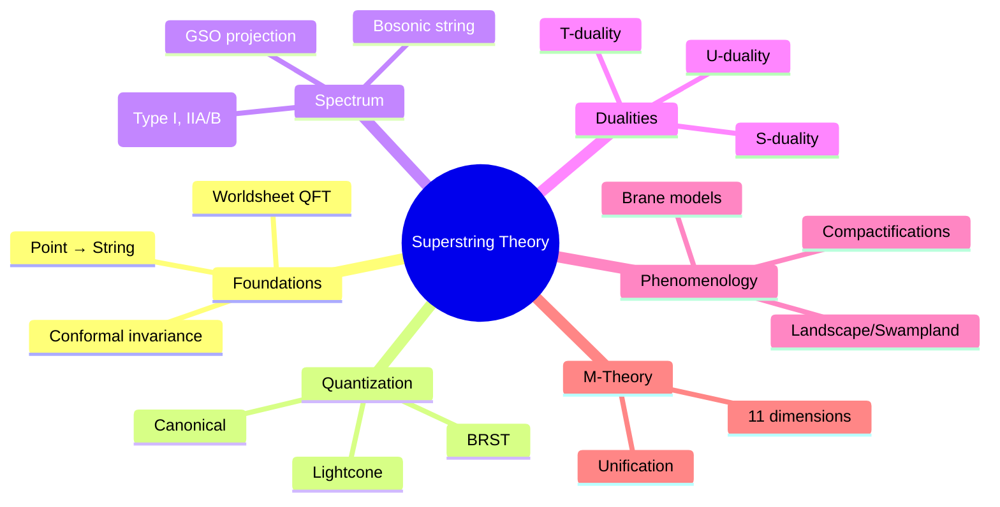
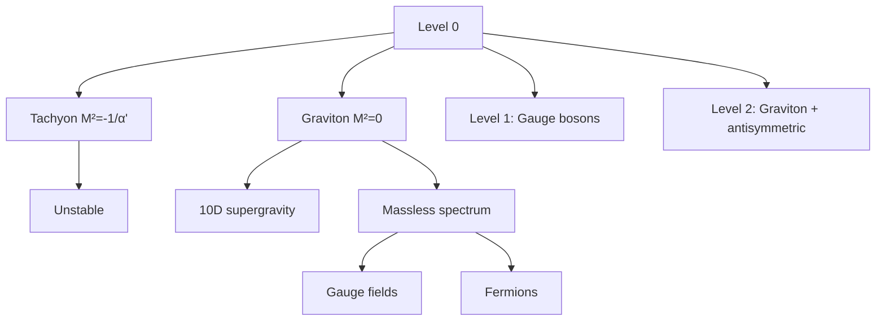
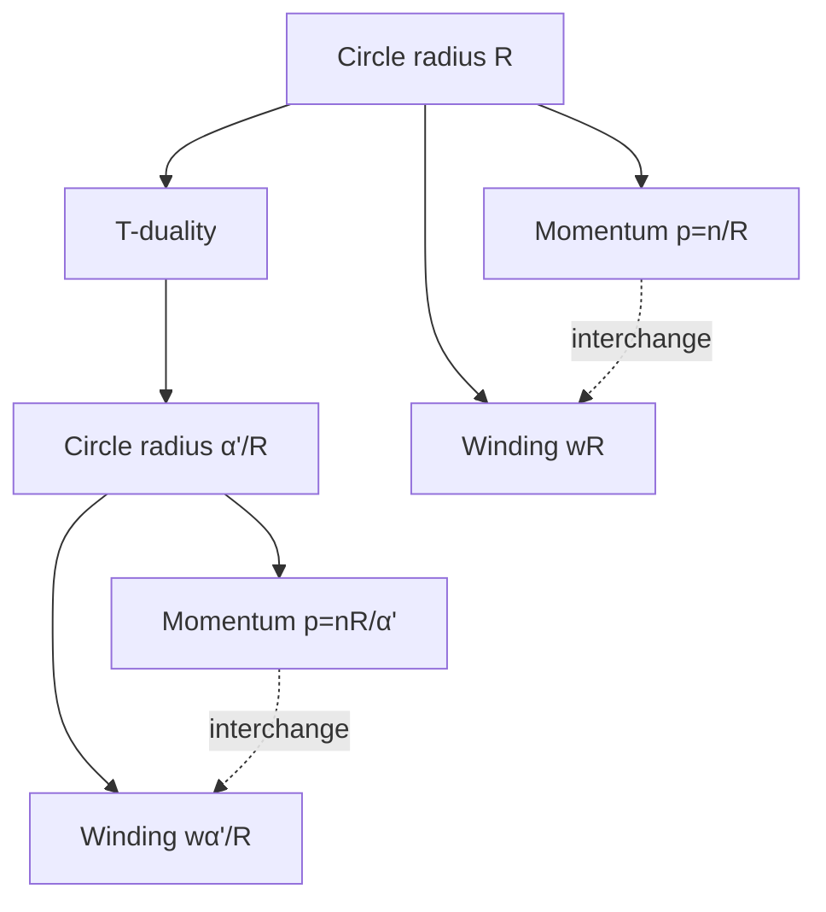
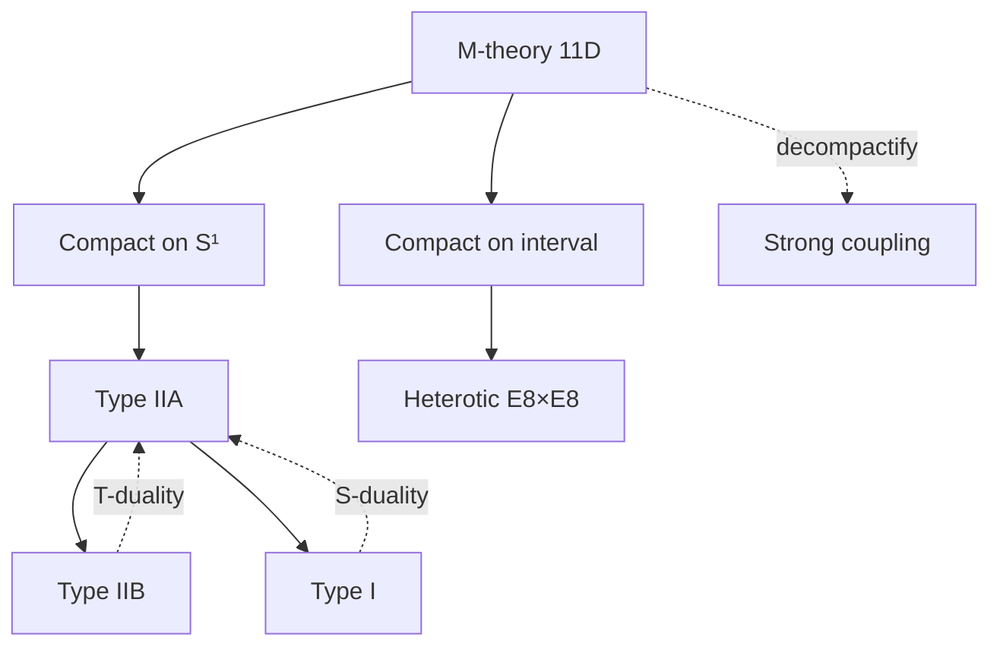

# MSPY 6310 — Superstring Theory
> **MSc Physics Elective | HKUST MSPY 6310 | Bosonic and superstring theory, worldsheet CFT, compactifications, M-theory**  
> **Bilingual 深度自學檔案 · 中英對照**

---

## 問題 1：5 個核心心智模型

1. **Strings replace point particles** — 弦取代點粒子
   - Finite size eliminates UV divergences
   - String length: $\ell_s = \sqrt{\alpha'} \approx 10^{-33}$ cm
   - excitations = different particles (graviton, gauge bosons)

2. **Worldsheet is 2D conformal field theory** — 世界面是二維共形場論
   - Conformal invariance on string worldsheet
   - Virasoro algebra: $L_n$ generators
   - Central charge must vanish for consistency

3. **Critical dimension emerges from consistency** — 一致性要求臨界維度
   - Bosonic string: $D = 26$
   - Superstring: $D = 10$
   - From requiring no conformal anomaly

4. **Supersymmetry eliminates tachyons** — 超對稱消除快子
   - GSO projection removes ground state tachyon
   - Space-time supersymmetry emerges
   - Worldvolume supersymmetry required

5. **Five consistent superstring theories unify** — 五個自洽的超弦理論統一
   - Type I, Type IIA, Type IIB
   - Heterotic $E_8 \times E_8$, Heterotic $SO(32)$
   - All limits of 11D M-theory

---

## 問題 2：3 個根本分歧

### 分歧 1：Which Vacuum is Correct?
| Perspective | Claim | Problem |
|------------|-------|---------|
| Landscape | $10^{500}$ vacua exist | No selection principle |
| Swampland | Most "consistent" vacua are actually inconsistent | Criteria unclear |
| Selection | Anthropic principle | Not predictive |

**Evidence:**
- KKLT: stabilized vacua exist (flux + non-perturbative)
- Volume modulus: many ways to stabilize
- Cosmic landscape: eternal inflation

### 分歧 2：Spacetime Emergent vs Fundamental
| View | Argument |
|------|----------|
| Emergent | Spacetime from quantum entanglement (ER=EPR) |
| Fundamental | String theory is theory of everything |

**Evidence:**
- AdS/CFT: bulk emerges from boundary CFT
- Tensor networks: geometric entanglement
- Holographic principle: information on boundary

### 分歧 3：Experimental Testability
| Challenge | Scale | Possibility |
|-----------|-------|--------------|
| String scale | $M_s \sim 10^{19}$ GeV | Unreachable directly |
| Low-energy SUSY | TeV scale | LHC searches |
| Extra dimensions | $R \sim \ell_s$ | Could be mm-scale |

**Current Status:** No direct experimental evidence, but:
- Naturalness → expect SUSY at TeV
- Fine-tuning suggests new physics
- Cosmological observations may constrain

---

## 問題 3：10 個深度問題

1. **Nambu-Goto to Polyakov**: 給定 $S = -T\int d\tau d\sigma \sqrt{-\det h_{ab}}$, derive Polyakov action
   - $S_P = -\frac{T}{2}\int d\tau d\sigma \sqrt{-\gamma}\gamma^{ab}\partial_a X^\mu\partial_b X_\mu$
   - Eliminates square root; introduces auxiliary metric $\gamma_{ab}$

2. **Critical Dimension**: 解釋 bosonic string $D = 26$
   - Conformal anomaly: $c = D + 6(d-26)/12$ must vanish
   - Requires $D = 26$ for bosonic string
   - Or add $6(d-26)/12$ conformal matter

3. **Tachyon Instability**: 為什麼 tachyon indicates instability
   - Ground state mass: $M^2 = -1/\alpha' < 0$
   - Unstable vacuum
   - GSO projects it out for superstrings

4. **Virasoro Constraint**: 給定 energy-momentum tensor $T_{zz} = -\frac{1}{\alpha'}:\partial X^\mu\partial X_\mu:$, derive $L_0|\psi⟩ = 0$
   - $L_0 = \alpha_0^2/2 + \sum_{n=1}^\infty \alpha_{-n}\cdot\alpha_n$
   - Physical states: $L_0|\psi⟩ = 0$, $L_n|\psi⟩ = 0$ for $n > 0$

5. **GSO Projection**: 為什麼 removes tachyon from superstring
   - Projects onto even G-parity: $P_{GSO} = \frac{1}{2}(1 + (-1)^F)$
   - Removes ground state (odd fermion number)
   - Leaves space-time supersymmetric spectrum

6. **String Mass Formula**: 給定 lightcone quantization, derive $M^2 = \frac{4}{\alpha'}(N - 1)$
   - $M^2 = \frac{4}{\alpha'}(\tilde{N} - 1)$ for closed string
   - Level matching: $N = \tilde{N}$
   - Oscillator number $N = \sum_n n\alpha_{-n}^\dagger\alpha_n$

7. **D-Branes**: 解釋 as dynamical objects supporting open strings
   - D$p$-brane: $(p+1)$-dimensional hyperplane
   - Open strings end with Dirichlet boundary conditions
   - Carry RR charge, gauge fields

8. **T-Duality**: 為什麼 relates Type IIA/B at $R \leftrightarrow \alpha'/R$
   - Compactify on circle radius $R$
   - Momentum modes ↔ winding modes
   - Small/large radius equivalent

9. **Compactification**: 給定 10D supergravity, 點樣 compactify to 4D
   - $M^4 \times K^6$ with Calabi-Yau $K^6$
   - SU(3) holonomy preserves $N=1$ supersymmetry
   - Complex structure + Kähler moduli

10. **M-Theory Unification**: 為什麼 unifies five superstring theories
    - 11D M-theory compactified on $S^1$ → Type IIA
    - Compactified on $S^1/\mathbb{Z}_2$ → Heterotic $E_8 \times E_8$
    - No fundamental length scale; $R_{11}$ undetermined

---

## 深入 1：Classical String Theory
**Deep Dive I**

### Nambu-Goto Action
Relativistic string action proportional to worldsheet area:

$$S_{NG} = -T\int_{\tau_i}^{\tau_f}\int_{\sigma_1}^{\sigma_2} d\tau d\sigma \sqrt{-\det h_{ab}}$$

Where $h_{ab} = \partial_a X^\mu \partial_b X_\mu$ is induced metric, $T = 1/(2\pi\alpha')$ is string tension.

### Polyakov Action
More convenient equivalent form:

$$S_P = -\frac{T}{2}\int d\tau d\sigma \sqrt{-\gamma}\gamma^{ab}\partial_a X^\mu \partial_b X_\mu$$

With auxiliary worldsheet metric $\gamma_{ab}$.

**Advantage:** Linear in derivatives, easier quantization

Equations of motion:
$$\partial_a(\sqrt{-\gamma}\gamma^{ab}\partial_b X^\mu) = 0$$

### Conformal Gauge
Fix $\gamma_{ab} = \eta_{ab}$ (flat metric):

$$\partial_\tau^2 X^\mu - \partial_\sigma^2 X^\mu = 0$$

This is 2D wave equation.

General solution:
$$X^\mu(\tau,\sigma) = x^\mu + \alpha' p^\mu \tau + i\sqrt{\frac{\alpha'}{2}}\sum_{n \neq 0} \frac{1}{n}(\alpha_n^\mu e^{-in(\tau-\sigma)} + \tilde{\alpha}_n^\mu e^{-in(\tau+\sigma)})$$

### Boundary Conditions
Closed string: $X^\mu(\tau, \sigma+2\pi) = X^\mu(\tau, \sigma)$

Open string (Neumann): $\partial_\sigma X^\mu = 0$ at endpoints (free ends)

Open string (Dirichlet): $X^\mu = \text{const}$ at endpoints (on D-brane)

**Engineering implication:** Polyakov action allows gauge fixing while maintaining manifest covariance

---

## 深入 2：Quantization & Spectrum
**Deep Dive II**

### Canonical Quantization
Promote modes to operators:
$$\alpha_n^\mu \to \hat{\alpha}_n^\mu, \quad [\hat{\alpha}_n^\mu, \hat{\alpha}_m^\nu] = n\eta^{\mu\nu}\delta_{n+m,0}$$

Virasoro generators:
$$L_n = \frac{1}{2}\sum_m :\alpha_{n-m}\cdot\alpha_m:$$

Physical state condition: $L_0|\psi⟩ = 0$, $L_n|\psi⟩ = 0$ for $n > 0$

### Critical Dimension
Normal ordering constant for bosonic string: $a = 1$

Mass formula:
$$M^2 = \frac{4}{\alpha'}(N - 1) = \frac{4}{\alpha'}(\tilde{N} - 1)$$

Level matching: $N = \tilde{N}$ for closed strings

### Low-Lying States
| Level | States | Spin | Interpretation |
|-------|--------|------|----------------|
| 0 | tachyon | 0 | $M^2 = -1/\alpha'$ (unstable!) |
| 1 | $D-2$ vectors | 1 | $A_\mu$ gauge boson |
| 2 | tensor + scalar | 2, 0 | $g_{\mu\nu}$ (graviton), $\Phi$ (dilaton) |

Massless states: spin-2 = **graviton** (consistent!)

### Spectrum Summary
| String Type | Ground State | Critical D |
|-------------|--------------|-----------|
| Bosonic | Tachyon $M^2=-1/\alpha'$ | 26 |
| Type I | Fermion $M^2=0$ | 10 |
| Type IIA | Boson $M^2=0$ | 10 |
| Type IIB | Boson $M^2=0$ | 10 |
| Heterotic | Fermion $M^2=0$ | 10 |

**Engineering implication:** Tachyon indicates vacuum instability; superstrings avoid this

---

## 深入 3：Superstrings & GSO Projection
**Deep Dive III**

### Ramond-Neveu-Schwarz (RNS) Formalism
Worldsheet supersymmetry on worldsheet:
$$\{Q, \bar{Q}\} = H, \quad Q^2 = \bar{Q}^2 = 0$$

Grassmann variables $\psi^\mu(\tau,\sigma)$ satisfy:
$$\{\psi^\mu_n, \psi^\nu_m\} = \eta^{\mu\nu}\delta_{n+m,0}$$

Mode expansion:
$$\psi^\mu = \sum_r \psi_r^\mu e^{-ir(\tau-\sigma)}$$

R (Ramond): $r \in \mathbb{Z}$ (integer) — fermion zero modes
NS (Neveu-Schwarz): $r \in \mathbb{Z} + 1/2$ (half-integer)

### GSO Projection
Project onto even G-parity states:
$$P_{GSO} = \frac{1}{2}(1 + (-1)^{F})$$

Where $F$ is fermion number operator.

For Type IIB: project NS-NS, R-R, NS-R, R-NS separately
For Type IIA: different sign in projection

### Spectrum in Type IIB
| Sector | Massless States |
|--------|-----------------|
| NS-NS | $g_{\mu\nu}$ (graviton), $B_{\mu\nu}$ (NS-NS 2-form), $\Phi$ (dilaton) |
| R-R | $C_{(0)}$ (axion), $C_{(2)}$ (2-form), $C_{(4)}$ (4-form) |
| NS-R | $\psi_\mu$ (gravitino) |
| R-NS | $\tilde{\psi}_\mu$ (gravitino) |

Massless fields match 10D supergravity multiplet.

**Engineering implication:** GSO projection essential for consistency and supersymmetry

---

## 深入 4：D-Branes & T-Duality
**Deep Dive IV**

### D-Brane Definition
Hypercube where open strings end with Dirichlet BC on transverse coordinates:

$$\text{D}p\text{-brane: dimension } p+1$$

Worldvolume gauge field: $A_\mu$ (U(1) for single brane)

Open string spectrum:
- Massless: gauge field $A_\mu$ + scalars $\phi^i$ (transverse positions)
- For $N$ coincident branes: $U(N)$ gauge theory

### Open String Spectrum
Worldsheet action for open string:
$$S = \frac{1}{4\pi\alpha'}\int d\tau d\sigma (\dot{X}^2 - X'^2) + \int A_\mu dx^\mu$$

Massless modes give gauge field + adjoint scalars (Goldstone modes).

### T-Duality
Compactify one dimension on radius $R$:
$$X_L \sim X_L + 2\pi R, \quad X_R \sim X_R + 2\pi R'$$

T-duality: $R \leftrightarrow \alpha'/R$ interchanges:
- $\partial_\sigma X \leftrightarrow \partial_\tau X$
- Momentum modes $p = n/R$ ↔ winding modes $w = R/\alpha'$

Implication: Type IIA ↔ Type IIB under T-duality

**Engineering implication:** D-branes carry RR charges, essential for string dualities and phenomenology

---

## 深入 5：Compactifications & Phenomenology
**Deep Dive V**

### Calabi-Yau Compactification
6D internal space: Ricci-flat manifold with SU(3) holonomy

Metric ansatz:
$$ds^2 = e^{2\phi/3}g_{mn}dy^m dy^n + e^{-2\phi/3}dx_\mu dx^\mu$$

Preserves 4D supersymmetry for appropriate topology.

Topology: $h^{(1,1)}$ Kähler moduli, $h^{(2,1)}$ complex structure moduli

### Moduli Stabilization
Complex structure moduli $z_i$, Kähler moduli $T_i$

Potential from fluxes:
$$V \sim \frac{1}{\text{Re}(T)^3}|\int \Omega \wedge G|^2$$

KKLT mechanism:
1. Stabilize complex structure with 3-form fluxes
2. Add $\overline{D3}$ branes + non-perturbative effects
3. Lift to dS vacuum (controversial)

### String Scale Landscape
| Scale | Energy |
|-------|--------|
| Planck $M_{Pl}$ | $2.4 \times 10^{18}$ GeV |
| String $M_s$ | $\sim 10^{18}$ GeV (if $g_s \sim 1$) |
| GUT | $10^{16}$ GeV |
| TeV | $10^3$ GeV |

Extra dimensions could lower string scale to TeV if $V_6 \gg \ell_s^6$.

**Engineering implication:** String phenomenology attempts to connect strings to observable physics

---

## 自測 1：Polyakov Action Derivation
**Answer:** $S_P = -\frac{T}{2}\int d\tau d\sigma \sqrt{-\gamma}\gamma^{ab}\partial_a X^\mu\partial_b X_\mu$ equivalent to $S_{NG}$ via integration over auxiliary metric $\gamma$.

**Engineering implication:** Polyakov action has simpler equations of motion, easier to quantize

---

## 自測 2：Critical Dimension
**Answer:** $D=26$ for bosonic string: conformal anomaly cancels when $D-26$ fermions added or Virasoro constraint with $a=1$.

**Engineering implication:** String theory requires specific spacetime dimension

---

## 自測 3：Tachyon Instability
**Answer:** Tachyon $M^2 = -1/\alpha' < 0$ means ground state unstable. GSO projects it out for superstrings, leaving $M^2 = 0$ ground state.

**Engineering implication:** Bosonic string vacuum is unstable; superstrings are consistent

---

## 自測 4：Virasoro Constraint
**Answer:** $L_0|\psi⟩ = 0$ requires $|\alpha_0^2/2 + N - 1⟩ = 0$ giving $M^2 = (1-\alpha_0^2)/\alpha'$.

**Engineering implication:** Physical states satisfy constraints; tachyon-free spectrum requires superstrings

---

## 自測 5：GSO Projection
**Answer:** GSO projects onto $(-1)^F = +1$ states, removing tachyon (odd) and ensuring space-time supersymmetry. Projected spectrum: massless graviton + fermion partners.

**Engineering implication:** GSO makes superstring consistent and physical

---

## 自測 6：Mass Formula
**Answer:** $M^2 = \frac{4}{\alpha'}(N-1)$ in lightcone gauge, where $N = \sum_n n\alpha_{-n}^\dagger\alpha_n$. Level matching $N = \tilde{N}$ for closed strings.

**Engineering implication:** Spectrum organized by oscillator number

---

## 自測 7：D-Branes
**Answer:** D-branes are hypersurfaces where open strings end; they carry gauge fields (from open string modes) and RR charges. Essential for open string interactions.

**Engineering implication:** D-branes essential for string dualities and phenomenology

---

## 自測 8：T-Duality
**Answer:** $R \to \alpha'/R$ interchanges momentum and winding, relating Type IIA ↔ IIB, small ↔ large radius. No fundamental length scale in string theory.

**Engineering implication:** String theory has no preferred length scale

---

## 自測 9：Compactification
**Answer:** Reduce 10D to 4D by $M^4 \times K^6$ with appropriate holonomy; $N=1$ SUSY in 4D requires Calabi-Yau (SU(3) holonomy). Fluxes stabilize moduli.

**Engineering implication:** Observable physics from string theory requires compactification

---

## 自測 10：M-Theory Unification
**Answer:** 11D M-theory compactified on $S^1$ gives Type IIA (circle direction → $A_\mu$ gauge field). Compactified on $S^1/\mathbb{Z}_2$ gives Heterotic $E_8\times E_8$.

**Engineering implication:** Five superstring theories are limits of single M-theory

---

## 📊 Diagram 1: Superstring Theory Map


## 📊 Diagram 2: String Spectrum Hierarchy


## 📊 Diagram 3: D-Brane Structure
```mermaid
graph LR
    A[D-brane] --> B[Open strings end]
    B --> C[Gauge fields A_μ]
    B --> D[Goldstone modes φ^i]
    C --> E[U(N) gauge theory]
    D --> F[Moduli]
    A --> G[RR charge]
    G --> H[Couples to C_(p+1)]
```

## 📊 Diagram 4: T-Duality


## 📊 Diagram 5: Theory Unification


---

## 深度總結 Deep Insights

1. **Strings are UV finite** — extended objects eliminate short-distance divergences
   - **弦是紫外有限的** — 延展物體消除短距離發散
   - No Landau singularities
   - Renormalizability built in

2. **Worldsheet CFT is fundamental** — 2D conformal invariance constrains everything
   **世界面CFT是根本的** — 2D共形不變性約束一切
   - Virasoro algebra
   - Correlation functions determined by conformal symmetry

3. **Supersymmetry is essential** — eliminates tachyon, enables spacetime SUSY
   **超對稱是必需的** — 消除快子，實現時空超對稱
   - GSO projection projects out tachyon
   - Fermi-Bose symmetry protects mass

4. **Dualities connect theories** — five string theories are different limits of one theory
   **對偶性連接理論** — 五個弦理論是一個理論的不同極限
   - T-duality: small ↔ large
   - S-duality: weak ↔ strong
   - M-theory: unifies all

5. **Phenomenology is challenging** — connecting to 4D physics requires careful compactification
   **現象學是挑戰** — 連接到4D物理需要仔細緊化
   - Moduli stabilization
   - SUSY breaking
   - Proton stability

---

**自學建議**

**必讀:**
- Polchinski "String Theory" Vol. 1 (bosonic string, conformal field theory)
- Polchinski "String Theory" Vol. 2 (superstrings, dualities)
- Green-Schwarz-Witten "Superstring Theory" (comprehensive)

**配對:**
- Tong "String Theory" lectures (Cambridge) — excellent free notes
- Becker-Becker-Schwarz "String Theory and M-Theory" — modern introduction
- Zwiebach "A First Course in String Theory" — undergraduate accessible

**工具:**
- LiE (Lie algebra software)
- SageMath (for algebraic geometry)
- String theory packages in Mathematica/Python

**產出:**
- Calculate tree-level scattering amplitude for four tachyons
- Derive GSO-projected spectrum for Type IIB
- Compactify to 4D and count moduli

**權威教材章節對照:**
| Topic | Polchinski Vol 1 | Polchinski Vol 2 |
|-------|------------------|------------------|
| Bosonic string | Ch 1-4 | - |
| Conformal field theory | Ch 2 | - |
| D-branes | Ch 8 | Ch 13 |
| T-duality | Ch 8 | Ch 13 |
| Superstrings | - | Ch 10-12 |
| Compactifications | - | Ch 15-16 |

---

**最後更新:** 2024-03-15
**自學狀態:** 📚 繼續深入學習
**下一步:** 學習AdS/CFT + 完成D-brane計算
