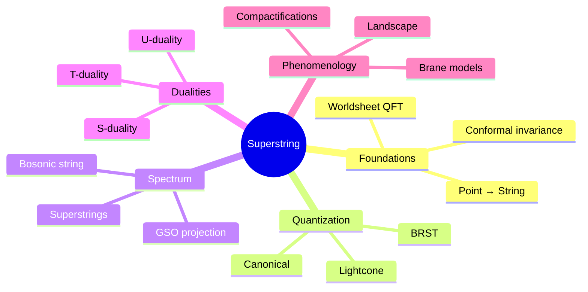
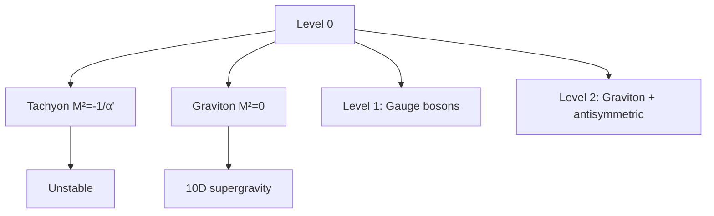
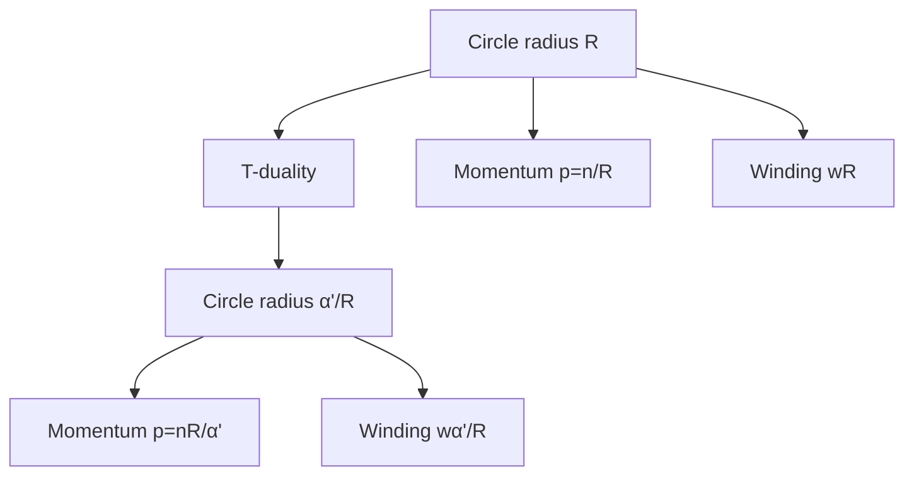
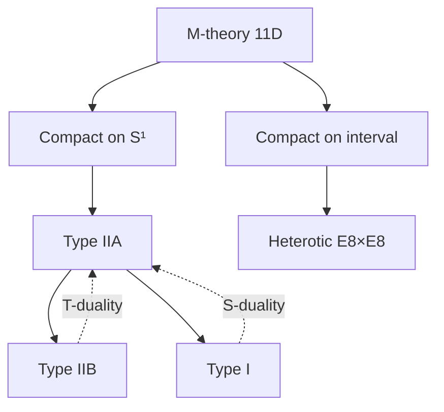

# MSPY 6310 — Superstring Theory
> **MSc Physics Elective | HKUST MSPY 6310 | Bosonic and superstring theory, worldsheet CFT, compactifications**  
> **Bilingual 深度自學檔案 · 中英對照**

---

## 問題 1：5 個核心心智模型

1. **Strings replace point particles** — 弦取代點粒子 (finite size eliminates UV divergences)
2. **Worldsheet is 2D QFT** — 世界面是二維量子場論 (conformal field theory on string worldsheet)
3. **Critical dimension from consistency** — 一致性要求臨界維度 (D=26 for bosonic, D=10 for superstring)
4. **Supersymmetry eliminates tachyons** — 超對稱消除快子 (GSO projection removes ground state tachyon)
5. **Five consistent superstring theories** — 五個自洽的超弦理論 (Type I, IIA, IIB, Heterotic $E_8 \times E_8$, Heterotic $SO(32)$)

## 問題 2：3 個根本分歧

1. **Which vacuum is correct?**
   - Landscape: $10^{500}$ possible vacua
   - Swampland: most are inconsistent
   - Selection principle unknown

2. **Spacetime emergent vs fundamental**
   - Emergent: spacetime from quantum entanglement
   - Fundamental: string theory is theory of everything

3. **Experimental testability**
   - String scale $\sim 10^{19}$ GeV unreachable
   - Low-energy supersymmetry could hint at strings
   - Cosmological observations as tests

## 問題 3：10 個深度問題

1. 給定 Nambu-Goto action $S = -T\int d\tau d\sigma \sqrt{-\gamma}$, derive Polyakov action $S = -\frac{T}{2}\int d\tau d\sigma \sqrt{-\gamma}\gamma^{ab}\partial_a X^\mu\partial_b X_\mu$。
2. 解釋為什麼 bosonic string critical dimension is $D=26$。
3. 為什麼 tachyon in bosonic string indicates instability?
4. 給定 worldsheet energy-momentum tensor $T_{zz} = -\frac{1}{\alpha'}:\partial X^\mu\partial X_\mu:$, derive Virasoro constraint $L_0|\psi\rangle = 0$。
5. 為什麼 GSO projection removes tachyon from superstring?
6. 給定 lightcone quantization, derive string mass formula $M^2 = \frac{1}{\alpha'}(N - 1)$。
7. 解釋 D-branes as dynamical objects supporting open strings。
8. 為什麼 T-duality relates Type IIA/B at $R \leftrightarrow \alpha'/R$?
9. 給定 10D supergravity, 點樣 compactify to 4D?
10. 為什麼 M-theory unifies five superstring theories?

## 深入 1：Classical String Theory
**Deep Dive I**

### Nambu-Goto Action
Relativistic string action proportional to worldsheet area:
$$S_{NG} = -T\int_{\tau_i}^{\tau_f}\int_{\sigma_1}^{\sigma_2} d\tau d\sigma \sqrt{-\det h_{ab}}$$

Where $h_{ab} = \partial_a X^\mu \partial_b X_\mu$ is induced metric.

### Polyakov Action
More convenient equivalent form:
$$S_P = -\frac{T}{2}\int d\tau d\sigma \sqrt{-\gamma}\gamma^{ab}\partial_a X^\mu \partial_b X_\mu$$

With auxiliary worldsheet metric $\gamma_{ab}$.

Equations of motion:
$$\partial_a(\sqrt{-\gamma}\gamma^{ab}\partial_b X^\mu) = 0$$

### Conformal Gauge
Fix $\gamma_{ab} = \eta_{ab}$ (flat metric):
$$\partial_\tau^2 X^\mu - \partial_\sigma^2 X^\mu = 0$$

General solution:
$$X^\mu(\tau,\sigma) = x^\mu + \alpha' p^\mu \tau + i\sqrt{\frac{\alpha'}{2}}\sum_n \frac{1}{n}(\alpha_n^\mu e^{-in(\tau-\sigma)} + \tilde{\alpha}_n^\mu e^{-in(\tau+\sigma)})$$

### Boundary Conditions
Closed string: $X^\mu(\tau, \sigma+2\pi) = X^\mu(\tau, \sigma)$

Open string (Neumann): $\partial_\sigma X^\mu = 0$ at endpoints

Open string (Dirichlet): $X^\mu = \text{const}$ at endpoints

**Engineering implication:** Polyakov action allows gauge fixing while maintaining manifest covariance

## 深入 2：Quantization & Spectrum
**Deep Dive II**

### Canonical Quantization
Promote modes to operators:
$$\alpha_n^\mu \to \hat{\alpha}_n^\mu, \quad [\hat{\alpha}_n^\mu, \hat{\alpha}_m^\nu] = n\eta^{\mu\nu}\delta_{n+m,0}$$

Virasoro generators:
$$L_0 = \frac{1}{2}\alpha_0^2 + \sum_{n=1}^\infty \alpha_{-n}\cdot\alpha_n$$

Physical state condition: $L_0|\psi\rangle = 0$, $L_n|\psi\rangle = 0$ for $n > 0$

### Critical Dimension
Normal ordering constant: $L_0 = \tilde{L}_0 = \frac{1}{2}\alpha_0^2 + N + \tilde{N} - a$

For bosonic string: $a = 1$, physical states require $D = 26$.

Mass formula:
$$M^2 = \frac{1}{\alpha'}(N - 1) = \frac{1}{\alpha'}(\tilde{N} - 1)$$

### Low-Lying States
| Level | States | Spin | Interpretation |
|---|---|---|---|
| 0 | tachyon | 0 | $M^2 = -1/\alpha'$ |
| 1 | $D-2$ vectors | 1 | $A_\mu$ gauge boson |
| 2 | tensor + scalar | 2, 0 | $g_{\mu\nu}$, dilaton |

**Engineering implication:** Tachyon indicates vacuum instability, must be projected out

## 深入 3：Superstrings & GSO Projection
**Deep Dive III**

### Ramond-Neveu-Schwarz Formalism
Worldsheet supersymmetry on worldsheet:
$$\{Q, \bar{Q}\} = H, \quad Q^2 = \bar{Q}^2 = 0$$

Grassmann variables $\psi^\mu(\tau,\sigma)$ satisfy:
$$\{\psi^\mu_n, \psi^\nu_m\} = \eta^{\mu\nu}\delta_{n+m,0}$$

Super-Virasoro generators:
$$L_n = -\frac{1}{2}\sum_m :\alpha_{n-m}\cdot\alpha_m: - \frac{1}{2}\sum_m (m+\frac{n}{2}):\psi_{n-m}\cdot\psi_m: + \frac{D}{16}\delta_n$$

### GSO Projection
Project onto even G-parity states:
$$P_{GSO} = \frac{1}{2}(1 + (-1)^{F})$$

Removes tachyon, leaves space-time supersymmetric spectrum.

### Spectrum in Type IIB
| Sector | Massless States |
|---|---|
| NS-NS | $g_{\mu\nu}$ (graviton), $B_{\mu\nu}$, $\Phi$ (dilaton) |
| R-R | $C_{(0)}$, $C_{(2)}$, $C_{(4)}$ |
| NS-R, R-NS | Fermions: $\psi_\mu$, $\tilde{\psi}_\mu$ |

Massless fields match 10D supergravity multiplet.

**Engineering implication:** GSO projection essential for consistency and supersymmetry

## 深入 4：D-Branes & T-Duality
**Deep Dive IV**

### D-Brane Definition
Hypercube where open strings end with Dirichlet BC:
$$\text{D}p\text{-brane: dimension } p$$

Gauge field on D-brane from massless open string modes:
$$A_\mu \text{ (U(1) gauge field) for D-brane} \subset \text{type IIA/B}$$

### Open String Spectrum
Worldsheet action for open string:
$$S = \frac{1}{4\pi\alpha'}\int d\tau d\sigma (\dot{X}^2 - X'^2) + \int A_\mu dx^\mu$$

Massless modes give gauge field + adjoint scalars (Goldstone modes).

### T-Duality
Compactify one dimension on radius $R$:
$$X_L \sim X_L + 2\pi R, \quad X_R \sim X_R + 2\pi R'$$

T-duality: $R \leftrightarrow \alpha'/R$ interchanges:
- $\partial_\sigma X \leftrightarrow \partial_\tau X$
- Momentum modes $\leftrightarrow$ winding modes

Implication: Type IIA/IIB related, small/large radius equivalent.

**Engineering implication:** D-branes carry RR charges, essential for string phenomenology

## 深入 5：Compactifications & Phenomenology
**Deep Dive V**

### Calabi-Yau Compactification
6D internal space: Ricci-flat manifold with SU(3) holonomy

Metric ansatz:
$$ds^2 = e^{2\phi/3}g_{mn}dy^m dy^n + e^{-2\phi/3}dx_\mu dx^\mu$$

Preserves 4D supersymmetry for appropriate topology.

### Moduli Stabilization
Complex structure moduli $z_i$, Kähler moduli $T_i$

Potential from fluxes:
$$V \sim \frac{1}{\text{Re}(T)^3}|\int \Omega \wedge G|^2$$

KKLT mechanism: add $\overline{D3}$ branes + non-perturbative effects.

### String Scale Landscape
| Scale | Energy |
|---|---|
| Planck | $10^{19}$ GeV |
| String | $\sim 10^{18}$ GeV |
| GUT | $10^{16}$ GeV |
| TeV | $10^3$ GeV |

Extra dimensions could lower string scale to TeV.

**Engineering implication:** String phenomenology attempts to connect strings to observable physics

## 自測 1：Polyakov Action Derivation
**Answer:** $S_P = -\frac{T}{2}\int d\tau d\sigma \sqrt{-\gamma}\gamma^{ab}\partial_a X^\mu\partial_b X_\mu$ is equivalent to $S_{NG}$ via integration over $\gamma$.  
**Engineering implication:** Polyakov action has simpler equations of motion

## 自測 2：Critical Dimension
**Answer:** $D=26$ for bosonic string: conformal anomaly cancels when $D-26$ fermions added or Virasoro constraint with $a=1$.  
**Engineering implication:** String theory requires specific spacetime dimension

## 自測 3：Tachyon Instability
**Answer:** Tachyon $M^2 = -1/\alpha' < 0$ means ground state unstable; GSO projects it out for superstrings.  
**Engineering implication:** Bosonic string vacuum is unstable

## 自測 4：Virasoro Constraint
**Answer:** $L_0|\psi\rangle = 0$ requires $|\alpha_0^2/2 + N - 1\rangle = 0$ giving $M^2 = (1-\alpha_0^2)/\alpha'$.  
**Engineering implication:** Physical states satisfy constraints

## 自測 5：GSO Projection
**Answer:** GSO projects onto $(-1)^F = +1$ states, removing tachyon (odd) and ensuring space-time supersymmetry.  
**Engineering implication:** GSO makes superstring consistent

## 自測 6：Mass Formula
**Answer:** $M^2 = \frac{4}{\alpha'}(N-1)$ in lightcone gauge, where $N = \sum_n n\alpha_{-n}^\dagger\alpha_n$.  
**Engineering implication:** Level matching $N = \tilde{N}$ for closed strings

## 自測 7：D-Branes
**Answer:** D-branes are hypersurfaces where open strings end; they carry gauge fields and RR charges.  
**Engineering implication:** D-branes essential for string dualities

## 自測 8：T-Duality
**Answer:** $R \to \alpha'/R$ interchanges momentum and winding, relating Type IIA ↔ IIB, small ↔ large radius.  
**Engineering implication:** No fundamental length scale in string theory

## 自測 9：Compactification
**Answer:** Reduce 10D to 4D by $M^4 \times K^6$ with appropriate holonomy; $N=1$ SUSY in 4D requires Calabi-Yau.  
**Engineering implication:** Observable physics from string theory requires compactification

## 自測 10：M-Theory Unification
**Answer:** 11D M-theory compactified on $S^1$ gives Type IIA; on $S^1/\mathbb{Z}_2$ gives Heterotic $E_8\times E_8$.  
**Engineering implication:** Five superstring theories are limits of single M-theory

## 📊 Diagram 1: Superstring Theory Map


## 📊 Diagram 2: String Spectrum Hierarchy


## 📊 Diagram 3: D-Brane Structure
```mermaid
graph LR
    A[D-brane] --> B[Open strings end]
    B --> C[Gauge fields]
    B --> D[Goldstone modes]
    C --> E[U(N) gauge theory]
    D --> F[Moduli]
```

## 📊 Diagram 4: T-Duality


## 📊 Diagram 5: Theory Unification


## 深度總結 Deep Insights

1. **Strings are UV finite** — extended objects eliminate short-distance divergences
   **弦是紫外有限的** — 延展物體消除短距離發散

2. **Worldsheet CFT is fundamental** — 2D conformal invariance constrains everything
   **世界面CFT是根本的** — 2D共形不變性約束一切

3. **Supersymmetry is essential** — eliminates tachyon, enables spacetime SUSY
   **超對稱是必需的** — 消除快子，實現時空超對稱

4. **Dualities connect theories** — five string theories are different limits of one theory
   **對偶性連接理論** — 五個弦理論是一個理論的不同極限

5. **Phenomenology is challenging** — connecting to 4D physics requires careful compactification
   **現象學是挑戰** — 連接到4D物理需要仔細緊化

---

**自學建議**
- 必讀: Polchinski "String Theory" Vol. 1, Green-Schwarz-Witten
- 配對: Tong "String Theory" lectures, Becker-Becker-Schwarz
- 工具: LiE (Lie algebra), Python string theory codes
- 產出: Calculate tree-level scattering amplitude for four tachyons
