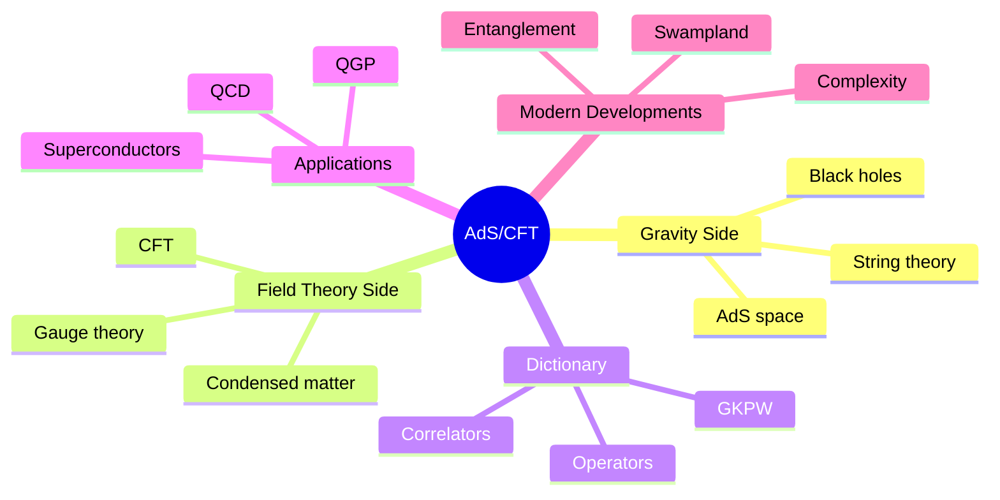
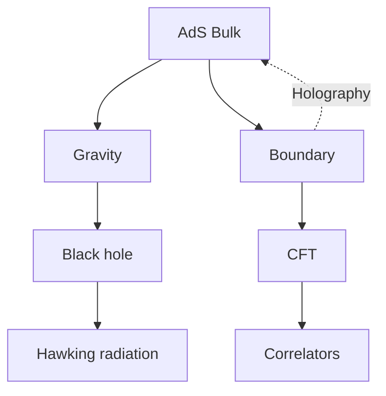
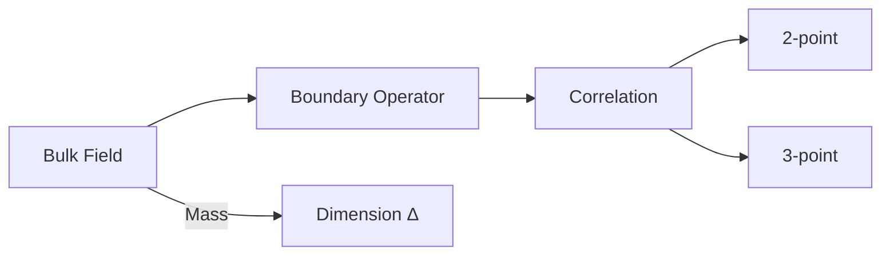
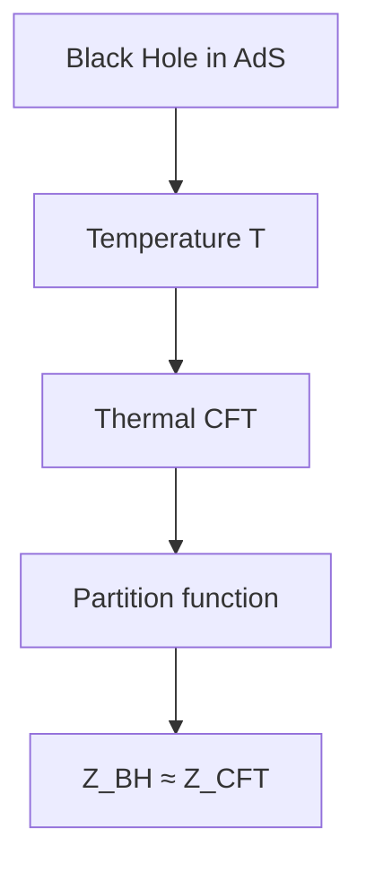
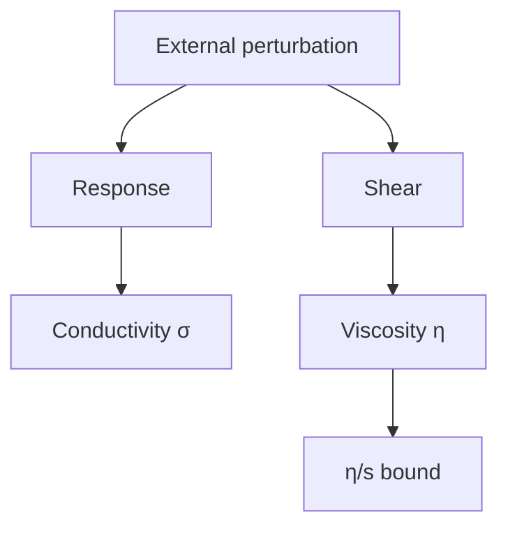

# MSPY 6410 — AdS/CFT Correspondence
> **MSc Physics Elective | HKUST MSPY 6410 | Gauge-gravity duality, holographic principle, applications to QCD and condensed matter**  
> **Bilingual 深度自學檔案 · 中英對照**

---

## 問題 1：5 個核心心智模型

1. **Gravity is holographic** — 重力是全息的 (boundary theory encodes bulk physics)
2. **Strong-weak duality maps problems** — 強弱對偶映射問題 (strong coupling ↔ weak coupling)
3. **Conformal symmetry constrains theory** — 共形對稱約束理論 (scale invariance → strong constraints)
4. **Bulk reconstruction from boundary** — 從邊界重建體 (subregion duality, entanglement)
5. **Black holes encode thermodynamics** — 黑洞編碼熱力學 (Hawking radiation, Bekenstein-Hawking entropy)

## 問題 2：3 個根本分歧

1. **AdS/CFT as definition vs correspondence**
   - Definition: $\mathcal{N}=4$ SYM IS d=5 AdS
   - Correspondence: conjectured equivalence tested in limits

2. **Which bulk is correct?**
   - Stringy: full AdS$_5 \times S^5$ with excited strings
   - Supergravity: low-energy limit, classical Einstein

3. **Swampland vs landscape**
   - Landscape: all consistent-looking vacua
   - Swampland: actually inconsistent, constraints on EFT

## 問題 3：10 個深度問題

1. 給定 $AdS_{d+1}$ metric $ds^2 = \frac{L^2}{z^2}(dz^2 + dx_\mu dx^\mu)$, derive conformal boundary at $z \to 0$。
2. 解釋為什麼 $AdS$ is not physically realistic but theoretically useful。
3. 為什麼 $N=4$ SYM is conformal? What is the evidence?
4. 給定 large $N$ limit, 計算 planar vs non-planar diagrams suppression。
5. 為什麼 strong coupling limit maps to classical gravity?
6. 給定 Wilson loop operator, derive area law for confining gauge theory。
7. 解釋 Entanglement entropy in CFT via Ryu-Takayanagi formula。
8. 為什麼 $\eta/s \geq 1/4\pi$ (KSS bound) from AdS/CFT?
9. 給定 holographic superconductor model, 計算 critical temperature。
10. 為什麼 AdS/CMT enables modeling strongly correlated systems?

## 深入 1：Anti-de Sitter Space
**Deep Dive I**

### Geometry of AdS
$AdS_{d+1}$ is maximally symmetric space with negative curvature.

Metric in Poincaré coordinates:
$$ds^2 = \frac{L^2}{z^2}(dz^2 + \eta_{\mu\nu}dx^\mu dx^\nu), \quad \eta_{\mu\nu} = \text{diag}(-1,1,...,1)$$

Where $L$ is AdS radius, $z \in (0,\infty)$.

Geodesics: boundaries at $z=0$ and $z=\infty$ (horizon).

### Conformal Boundary
Near $z=0$:
$$ds^2 \sim \frac{L^2}{z^2}dx^2$$

Metric scales as $\Omega^{-2}$ with $\Omega = z/L$:
$$\tilde{g}_{\mu\nu} = \Omega^2 g_{\mu\nu}$$

This is conformal to flat space $\rightarrow$ boundary CFT lives in $d$ dimensions.

### Global Coordinates
$$ds^2 = L^2(-\cosh^2\rho\, d\tau^2 + d\rho^2 + \sinh^2\rho\, d\Omega_{d-1}^2)$$

With $\tau \sim \tau + 2\pi$, covers full space.

Penrose diagram is rectangle with two boundaries.

**Engineering implication:** AdS boundary is where CFT lives, bulk physics encoded holographically

## 深入 2：N=4 Super-Yang-Mills Theory
**Deep Dive II**

### Theory Definition
$$\mathcal{N}=4 \text{ SYM: } S = \int d^4x\,\text{Tr}\left[-\frac{1}{2}F_{\mu\nu}F^{\mu\nu} + \bar{\psi}i\gamma^\mu D_\mu\psi - \sum_i|D_\mu\phi_i|^2 - V(\phi)\right]$$

Fields:
- Gauge field $A_\mu$ ( adjoint)
- 4 Weyl fermions $\psi$ (adjoint)
- 6 real scalars $\phi_i$ (adjoint)

Symmetry: $PSU(4) \cong SO(6)$ R-symmetry.

### Why Conformal?
- Superpotential $W = g\epsilon_{ijk}\text{Tr}[\phi_i, \phi_j]\phi_k$ exactly vanishing
- Beta functions vanish to all orders: $\beta(g) = 0$
- Exactly marginal operators preserve conformality

### Correlation Functions
2-point function of scalar operators:
$$\langle \mathcal{O}(x)\mathcal{O}(0)\rangle = \frac{C_{\mathcal{O}}}{|x|^{2\Delta}}$$

Where $\Delta$ is conformal dimension.

3-point function fixed by symmetry up to constants.

**Engineering implication:** $\mathcal{N}=4$ SYM is the simplest CFT, template for AdS/CFT

## 深入 3：Holographic Dictionary
**Deep Dive III**

### GKPW Prescription
$$Z_{\text{CFT}}[J] = \left\langle \exp\left(\int_{\partial} \mathcal{O} \phi_0\right)\right\rangle = Z_{\text{AdS}}[\phi \to \phi_0 \text{ at } z \to 0]$$

Boundary CFT correlators computed from bulk partition function.

### Operator-Field Map
| Bulk Field $\phi$ | Boundary Operator $\mathcal{O}$ | Dimension $\Delta$ |
|---|---|---|
| Metric $g_{\mu\nu}$ | $T_{\mu\nu}$ (stress tensor) | $d$ |
| Scalar $\Phi$ | $\mathcal{O}_\Phi$ | $\Delta(\Delta-d)$ |
| Gauge field $A_\mu$ | $J_\mu$ (current) | $d-1$ |

Mass-dimension relation:
$$m^2 L^2 = \Delta(\Delta - d)$$

### Large $N$ Limit
SYM has $U(N)$ gauge group:
- 't Hooft coupling: $\lambda = g_{YM}^2 N$
- Planar limit: $N \to \infty$, $\lambda$ fixed
- String theory: $\alpha' \sim \ell_s^2 \sim \sqrt{\lambda}/N^{1/4}$

**Engineering implication:** Dictionary translates bulk fields to boundary operators

## 深入 4：Applications to QCD
**Deep Dive IV**

### Holographic QCD Models
Bottom-up approach: find 5D metric reproducing QCD features.

Soft wall model:
$$ds^2 = e^{-A(z)}(dz^2 + dx_\mu dx^\mu), \quad A(z) = c z^2$$

Confinement: linear Regge trajectory:
$$m_n^2 \propto n$$

### Heavy Quark Potential
Wilson loop $W(C) = \text{Tr}P\exp(i\oint_C A)$

Holographic prescription:
$$\langle W(C)\rangle \sim e^{-S_{\text{NG}}(X_{\text{min}})}$$

For static quarks: $V(r) \sim \sigma r$ at large $r$ (confinement).

### Thermal QCD
Quark-gluon plasma:
- Temperature $T \sim 200$ MeV at RHIC/LHC
- Viscosity to entropy ratio: $\eta/s \approx 0.1-0.2$

AdS/CFT prediction: $\eta/s = 1/4\pi \approx 0.08$

**Engineering implication:** AdS/CFT provides qualitative insights into QGP

## 深入 5：AdS/CMT
**Deep Dive V**

### Holographic Superconductor
5D Einstein-Maxwell-scalar action:
$$S = \int d^5x\sqrt{-g}\left[\frac{1}{2\kappa^2}(R - 2\Lambda) - \frac{1}{4}F_{\mu\nu}F^{\mu\nu} - |D\Psi|^2 - m^2|\Psi|^2\right]$$

Phase transition at critical temperature:
$$T_c \propto \mu, \quad \mu = \text{chemical potential}$$

Order parameter: scalar condensation $\langle\mathcal{O}\rangle \neq 0$.

### Transport Properties
Electrical conductivity:
$$\sigma(\omega) = \frac{\sigma_0}{(-i\omega + \Gamma)^\alpha}$$

Optical conductivity follows power law.

### Fermi Surfaces
Probe fermions in bulk:
$$(\slashed{\nabla} + m) \Psi = 0$$

Dual to Fermi surfaces in boundary theory.

**Engineering implication:** AdS/CMT models strange metal behavior, non-Fermi liquids

## 自測 1：AdS Boundary
**Answer:** At $z \to 0$, metric $\sim L^2/z^2 dx^2$, conformally equivalent to flat space.  
**Engineering implication:** CFT lives on AdS boundary

## 自測 2：Why AdS?
**Answer:** AdS has constant negative curvature, solvable black hole solutions, dual to CFT. Not realistic but exactly tractable.  
**Engineering implication:** Theoretical laboratory for quantum gravity

## 自測 3：N=4 Conformal
**Answer:** All beta functions vanish, superpotential vanishes, exactly marginal couplings exist. All-order proof from supersymmetry.  
**Engineering implication:** Simplest CFT with 16 supercharges

## 自測 4：Large N
**Answer:** Planar diagrams $\sim N^2$, non-planar $\sim 1/N^2$. Suppressed at large $N$.  
**Engineering implication:** String theory emerges in large $N$ limit

## 自測 5：Strong-Weak Map
**Answer:** $\lambda \to \infty$ in CFT ↔ classical gravity in AdS. Strong coupling ↔ weak coupling.  
**Engineering implication:** Can study strongly coupled QFT via classical gravity

## 自測 6：Wilson Loop Area Law
**Answer:** $\langle W(C)\rangle \sim e^{-A_{\text{min}}/4\pi\alpha'}$ gives $V(r) \sim \sigma r$ for confinement.  
**Engineering implication:** Holographic Wilson loop tests confinement

## 自測 7：Entanglement Entropy
**Answer:** $S_A = \frac{\text{Area}(\gamma_A)}{4G_N^{(d+1)}}$ where $\gamma_A$ is minimal surface ending on $\partial A$.  
**Engineering implication:** RT formula connects geometry to entanglement

## 自測 8：KSS Bound
**Answer:** $\eta/s \geq 1/4\pi$ from Einstein tensor positivity in AdS. Universal bound from holography.  
**Engineering implication:** Lower bound on transport in strongly coupled systems

## 自測 9：Superconductor Tc
**Answer:** Critical temperature $T_c \approx 0.12\mu$ in probe limit. Condensation below $T_c$.  
**Engineering implication:** Holographic superconductor matches BCS phenomenology

## 自測 10：AdS/CMT
**Answer:** Non-Fermi liquids, linear-in-T resistivity, strange metal behavior reproduced in holographic models.  
**Engineering implication:** Tool for studying strongly correlated electrons

## 📊 Diagram 1: AdS/CFT Map

## 📊 Diagram 2: Holographic Principle

## 📊 Diagram 3: Operator Map

## 📊 Diagram 4: Thermal States

## 📊 Diagram 5: Transport

## 深度總結 Deep Insights

1. **Gravity encodes boundary physics** — bulk geometry determined by boundary data
   **重力編碼邊界物理** — 體幾何由邊界數據決定

2. **Strong coupling accessible** — dual description at weak coupling enables calculation
   **強耦合可達** — 弱耦合對偶描述使計算可行

3. **Entanglement = geometry** — RT formula connects quantum information to spacetime
   **糾纏 = 幾何** — RT公式連接量子信息與時空

4. **Universal bounds emerge** — transport coefficients satisfy bounds from gravity
   **通用界限浮現** — 輸運係數滿足來自重力的界限

5. **Applications to real systems** — QGP, superconductors, strange metals
   **應用於真實系統** — QGP、超導體、奇怪金屬

---

**自學建議**
- 必讀: Maldacena's original paper (hep-th/9711200), Witten "Anti de Sitter"
- 配對: Hartnoll "TASI Lectures", Sachdev "Conformal Field Theories"
- 工具: Mathematica for AdS calculations, AdS/CMT codes
- 產出: Calculate entanglement entropy using RT formula for BTZ black hole
