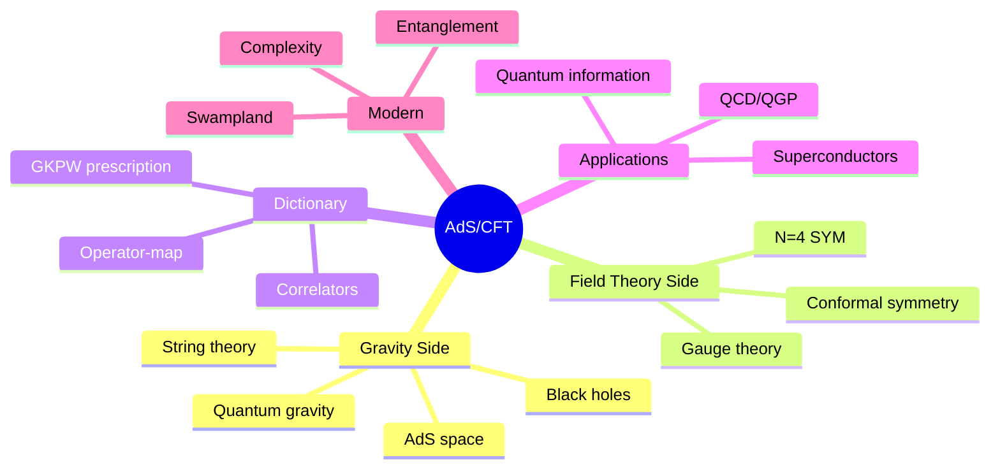
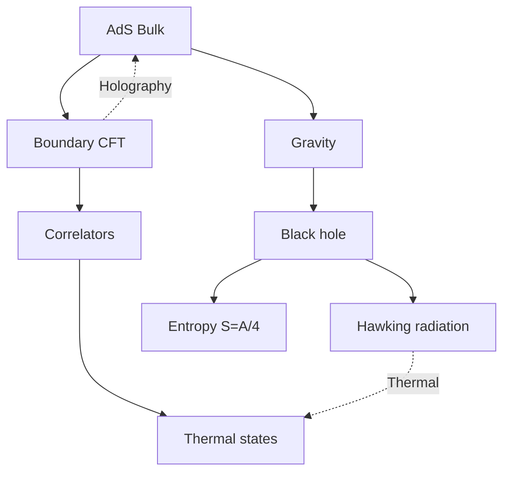
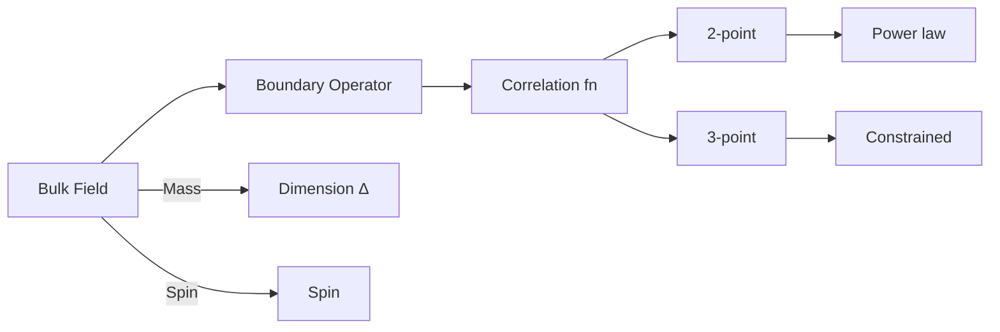
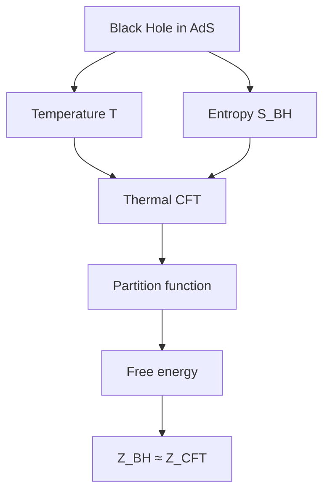
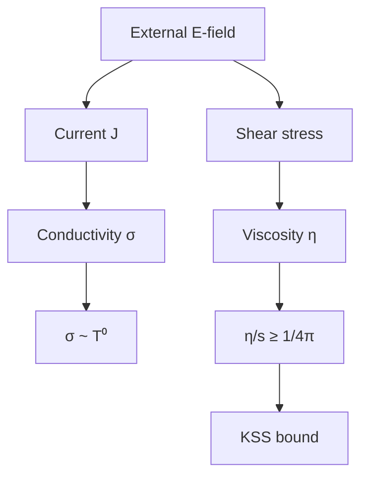

# MSPY 6410 — AdS/CFT Correspondence
> **MSc Physics Elective | HKUST MSPY 6410 | Gauge-gravity duality, holographic principle, applications to QCD and condensed matter**  
> **Bilingual 深度自學檔案 · 中英對照**

---

## 問題 1：5 個核心心智模型

1. **Gravity is holographic** — 重力是全息的
   - Boundary theory encodes bulk physics
   - Information content scales with boundary area (not volume)
   - Bekenstein-Hawking entropy: $S = A/4G_N$

2. **Strong-weak duality maps problems** — 強弱對偶映射問題
   - Strong coupling ↔ weak coupling
   - $\mathcal{N}=4$ SYM at large $\lambda$ ↔ classical AdS gravity
   - Enables calculation of strongly coupled QFT via classical gravity

3. **Conformal symmetry constrains theory** — 共形對稱約束理論
   - Scale invariance → all correlators determined up to constants
   - $\mathcal{N}=4$ SYM: exactly conformal, no beta functions
   - Conformal dimensions determine operator scaling

4. **Bulk reconstruction from boundary** — 從邊界重建體
   - HKLL reconstruction: bulk operators from boundary
   - Subregion duality: boundary subregion ↔ bulk subregion
   - Entanglement wedge hypothesis

5. **Black holes encode thermodynamics** — 黑洞編碼熱力學
   - Hawking radiation: $T = \hbar c^3/8\pi GMk_B$
   - Bekenstein-Hawking entropy: $S_{BH} = k_B A/4\ell_P^2$
   - AdS/CMT: black hole geometries model strange metals

---

## 問題 2：3 個根本分歧

### 分歧 1：AdS/CFT as Definition vs Correspondence
| Perspective | View |
|-------------|------|
| Definition | $\mathcal{N}=4$ SYM IS d=5 AdS (by definition) |
| Correspondence | Conjectured equivalence, tested in limits |

**Evidence for correspondence:**
- Match at large $N$, large $\lambda$ (classical gravity)
- Correlators at weak coupling calculable on both sides
- Multiple checks in integrable limits

### 分歧 2：Which Bulk is Correct?
| Approach | Claim |
|----------|-------|
| Stringy | Full AdS$_5 \times S^5$ with excited strings |
| Supergravity | Low-energy limit, classical Einstein |

**Reality:** Both descriptions are equivalent in their domains of validity

### 分歧 3：Swampland vs Landscape
| Program | Goal | Status |
|---------|------|--------|
| Landscape | Catalog all consistent vacua | $10^{500}$ candidates |
| Swampland | Identify inconsistent-looking but actually inconsistent | Criteria emerging |

**Key criteria:** AdS distance conjecture, dS conjectures, WGC

---

## 問題 3：10 個深度問題

1. **AdS Metric**: 給定 $AdS_{d+1}$ metric $ds^2 = \frac{L^2}{z^2}(dz^2 + dx_\mu dx^\mu)$, derive conformal boundary at $z \to 0$
   - $ds^2 \sim \frac{L^2}{z^2}dx^2 \to$ scales as $\Omega^{-2}$
   - Conformal factor $\Omega = z/L$
   - Boundary metric: $g_{\mu\nu} = \Omega^2 \tilde{g}_{\mu\nu}$

2. **Why AdS**: 解釋為什麼 $AdS$ is not physically realistic but theoretically useful
   - AdS has constant negative curvature, $\Lambda < 0$
   - Our universe: $\Lambda > 0$ (de Sitter)
   - AdS/CFT is theoretical laboratory for quantum gravity

3. **N=4 SYM Conformal**: 為什麼 $\mathcal{N}=4$ SYM is conformal? Evidence?
   - All beta functions vanish to all orders
   - Superpotential $W = 0$ (no potential terms)
   - Exact Seiberg duality, BPS states protected
   - Evidence: integrability, localization, plane wave correspondence

4. **Large N Limit**: 給定 large $N$ limit, 計算 planar vs non-planar suppression
   - Planar diagrams: $\sim N^2$
   - Non-planar diagrams: $\sim 1/N^2$
   - 't Hooft coupling: $\lambda = g_{YM}^2 N$
   - Classical gravity ↔ planar limit

5. **Strong-Weak Map**: 為什麼 strong coupling limit maps to classical gravity
   - $\lambda \to \infty$ in CFT ↔ classical gravity in AdS
   - WKB approximation: classical saddle point
   - String tension: $T_s = 1/(2\pi\alpha') \sim \sqrt{\lambda}/L$

6. **Wilson Loop Area Law**: 給定 Wilson loop operator, derive area law for confining gauge theory
   - $W(C) = \text{Tr}P\exp(i\oint_C A)$
   - Holographic: $⟨W(C)⟩ \sim e^{-S_{Nambu-Goto}(X_{min})}$
   - For static quarks: $V(r) \sim \sigma r$ (confinement)

7. **Entanglement Entropy**: 解釋 via Ryu-Takayanagi formula
   - $S_A = \frac{\text{Area}(\gamma_A)}{4G_N^{(d+1)}}$
   - $\gamma_A$ = minimal surface ending on $\partial A$
   - Generalization: Faulkner-Lewkowycz-Maldacena

8. **KSS Bound**: 為什麼 $\eta/s \geq 1/4\pi$ from AdS/CFT
   - Shear viscosity from absorption cross-section
   - $\eta/s = 1/4\pi$ for Einstein gravity
   - Violations possible in non-Einstein theories
   - Universal bound from causality

9. **Holographic Superconductor**: 給定 model, 計算 critical temperature
   - 5D Einstein-Maxwell-scalar: $T_c \approx 0.06\sqrt{\mu}$
   - $\mu$ = chemical potential
   - Phase transition: normal → superconducting

10. **AdS/CMT**: 為什麼 enables modeling strongly correlated systems
    - Strange metal behavior: linear-in-T resistivity
    - Non-Fermi liquids
    - Holographic models reproduce qualitative features

---

## 深入 1：Anti-de Sitter Space
**Deep Dive I**

### Geometry of AdS
$AdS_{d+1}$ is maximally symmetric space with constant negative curvature.

Poincaré coordinates:
$$ds^2 = \frac{L^2}{z^2}(dz^2 + \eta_{\mu\nu}dx^\mu dx^\nu), \quad \eta_{\mu\nu} = \text{diag}(-1,1,...,1)$$

Where $L$ is AdS radius (curvature radius), $z \in (0,\infty)$.

Properties:
- Curvature: $R_{\mu\nu} = -\frac{d}{L^2}g_{\mu\nu}$
- Cosmological constant: $\Lambda = -d(d+1)/2L^2$
- Geodesics: miss boundary at finite affine parameter

### Conformal Boundary
Near $z \to 0$:
$$ds^2 \sim \frac{L^2}{z^2}dx^2$$

This scales as $\tilde{g}_{\mu\nu} = \Omega^2 g_{\mu\nu}$ with $\Omega = z/L$

Boundary at $z = 0$ is conformal to flat space $\mathbb{R}^{d-1,1}$

**This is where the boundary CFT lives.**

### Global Coordinates
$$ds^2 = L^2(-\cosh^2\rho\, d\tau^2 + d\rho^2 + \sinh^2\rho\, d\Omega_{d-1}^2)$$

With $\tau \sim \tau + 2\pi$, covers full space.

Penrose diagram is a rectangle with two boundaries (past and future infinity).

### Black Hole Solutions
BTZ black hole (d=3):
$$ds^2 = -\frac{r^2}{L^2}(1 - r_+^2/r^2)dt^2 + \frac{L^2}{r^2}\frac{dr^2}{1 - r_+^2/r^2} + r^2 d\phi^2$$

Temperature: $T = r_+/2\pi L^2$
Entropy: $S = \pi r_+/2G_3$

**Engineering implication:** AdS boundary is where CFT lives; bulk physics encoded holographically

---

## 深入 2：N=4 Super-Yang-Mills Theory
**Deep Dive II**

### Theory Definition
$$\mathcal{N}=4 \text{ SYM: } S = \int d^4x\,\text{Tr}\left[-\frac{1}{2}F_{\mu\nu}F^{\mu\nu} + \bar{\psi}i\gamma^\mu D_\mu\psi - \sum_i|D_\mu\phi_i|^2 - V(\phi)\right]$$

Fields:
- Gauge field $A_\mu$ (adjoint, $N \times N$ matrices)
- 4 Weyl fermions $\psi$ (adjoint)
- 6 real scalars $\phi_i$ (adjoint)

Symmetry: $PSU(4) \cong SO(6)$ R-symmetry + Poincaré + conformal

### Why Conformal?
1. All beta functions vanish to all orders: $\beta(g) = 0$
2. Superpotential $W = 0$ (no superpotential terms)
3. Exactly marginal operators preserve conformality
4. Protected operators (BPS) have exact dimensions

**Evidence:**
- SUSY prevents renormalization of superpotential
- Anomalous dimensions vanish for half-BPS operators
- Integrability at large $N$

### Correlation Functions
2-point function of scalar operators:
$$\langle \mathcal{O}(x)\mathcal{O}(0)\rangle = \frac{C_{\mathcal{O}}}{|x|^{2\Delta}}$$

Where $\Delta$ is conformal dimension.

3-point function fixed by symmetry up to one constant.

**Engineering implication:** $\mathcal{N}=4$ SYM is simplest CFT, template for AdS/CFT

---

## 深入 3：Holographic Dictionary
**Deep Dive III**

### GKPW Prescription
$$Z_{\text{CFT}}[J] = \left\langle \exp\left(\int_{\partial} \mathcal{O} \phi_0\right)\right\rangle = Z_{\text{AdS}}[\phi \to \phi_0 \text{ at } z \to 0]$$

Boundary CFT correlators computed from bulk partition function with boundary conditions.

### Operator-Field Map
| Bulk Field $\phi$ | Boundary Operator $\mathcal{O}$ | Dimension $\Delta$ |
|---|---|---|
| Metric $g_{\mu\nu}$ | $T_{\mu\nu}$ (stress tensor) | $d$ |
| Scalar $\Phi$ | $\mathcal{O}_\Phi$ | $\Delta(\Delta-d)$ |
| Gauge field $A_\mu$ | $J_\mu$ (current) | $d-1$ |
| $p$-form $C_{(p)}$ | $\mathcal{O}_{(p+1)}$ | $d-p-1$ |

Mass-dimension relation:
$$m^2 L^2 = \Delta(\Delta - d)$$

### Large $N$ Limit
SYM has $SU(N)$ gauge group (often $U(N)$):

- 't Hooft coupling: $\lambda = g_{YM}^2 N$
- Planar limit: $N \to \infty$, $\lambda$ fixed
- String theory emerges: $\alpha' \sim \ell_s^2 \sim \sqrt{\lambda}/N^{1/4}$
- Classical gravity: $\lambda \to \infty$, $N \to \infty$

### Bulk-Boundary
$$⟨e^{\int \mathcal{O}\phi_0}⟩_{CFT} = Z_{AdS}[\phi \to \phi_0 \text{ on boundary}]$$

**Engineering implication:** Dictionary translates bulk fields to boundary operators

---

## 深入 4：Applications to QCD
**Deep Dive IV**

### Holographic QCD Models
Bottom-up approach: find 5D metric reproducing QCD features.

**Soft wall model:**
$$ds^2 = e^{-A(z)}(dz^2 + dx_\mu dx^\mu), \quad A(z) = c z^2$$

Confining potential: linear Regge trajectory
$$m_n^2 \propto n$$

**Hard wall model:** cutoff at $z = z_0$, discrete spectrum

### Heavy Quark Potential
Wilson loop $W(C) = \text{Tr}P\exp(i\oint_C A)$

Holographic prescription:
$$\langle W(C)\rangle \sim e^{-S_{\text{Nambu-Goto}}(X_{\text{min}})}$$

For static quarks at separation $r$:
$$V(r) \sim \begin{cases} \frac{\lambda}{r} & \text{deconfined} \\ \sigma r & \text{confined} \end{cases}$$

### Thermal QCD
Quark-gluon plasma (QGP):
- Temperature $T \sim 200$ MeV at RHIC/LHC
- Shear viscosity: $\eta/s \approx 0.1-0.2$
- AdS/CFT prediction: $\eta/s = 1/4\pi \approx 0.08$

**Agreement:** Order of magnitude correct, encouraging for qualitative understanding

### Hadron Spectrum
Holographic models reproduce:
- Linear trajectory for light mesons
- Mass splitting patterns
- Form factors at low $Q^2$

**Engineering implication:** AdS/CFT provides qualitative insights into QGP

---

## 深入 5：AdS/CMT
**Deep Dive V**

### Holographic Superconductor
5D Einstein-Maxwell-scalar action:
$$S = \int d^5x\sqrt{-g}\left[\frac{1}{2\kappa^2}(R - 2\Lambda) - \frac{1}{4}F_{\mu\nu}F^{\mu\nu} - |D\Psi|^2 - m^2|\Psi|^2\right]$$

Phase transition at critical temperature:
$$T_c \propto \mu, \quad \mu = \text{chemical potential}$$

Order parameter: scalar condensation $\langle\mathcal{O}\rangle \neq 0$

**Results:**
- Second-order phase transition (mean field)
- Gap formation: $\Delta \sim T_c$
- DC conductivity: infinite (superconductor)
- AC conductivity: $\sigma(\omega) \sim 1/\omega$ at low $\omega$

### Transport Properties
Electrical conductivity:
$$\sigma(\omega) = \frac{\sigma_0}{(-i\omega + \Gamma)^\alpha}$$

Strange metal behavior:
$$\rho(T) \sim T \quad \text{(linear in T)}$$

Holographic models can reproduce:
- $T$-linear resistivity
- Planckian dissipation
- Non-Fermi liquid behavior

### Fermi Surfaces
Probe fermions in bulk:
$$(\slashed{\nabla} + m) \Psi = 0$$

Dual to Fermi surfaces in boundary theory:
- Dispersion relations $\epsilon_k$
- Quasiparticle peaks (sometimes)
- Non-Fermi liquids

**Engineering implication:** AdS/CMT models strange metal behavior, non-Fermi liquids

---

## 自測 1：AdS Boundary
**Answer:** At $z \to 0$, metric $\sim L^2/z^2 dx^2$, conformally equivalent to flat space. Scale factor $\Omega = z/L$.

**Engineering implication:** CFT lives on AdS boundary

---

## 自測 2：Why AdS?
**Answer:** AdS has constant negative curvature, solvable black hole solutions, dual to CFT. Not realistic (宇宙有 positive $\Lambda$) but exactly tractable.

**Engineering implication:** Theoretical laboratory for quantum gravity

---

## 自測 3：N=4 Conformal
**Answer:** All beta functions vanish due to supersymmetry, superpotential vanishes, exactly marginal couplings exist. All-order proof from SUSY non-renormalization theorems.

**Engineering implication:** Simplest CFT with 16 supercharges, 4D N=4 SUSY

---

## 自測 4：Large N
**Answer:** Planar diagrams $\sim N^2$, non-planar $\sim 1/N^2$. In large $N$ limit, only planar diagrams contribute. String theory emerges.

**Engineering implication:** Classical gravity ↔ planar limit of gauge theory

---

## 自測 5：Strong-Weak Map
**Answer:** $\lambda \to \infty$ in CFT ↔ classical gravity in AdS. WKB approximation: string worldsheet → classical trajectory.

**Engineering implication:** Can study strongly coupled QFT via classical gravity

---

## 自測 6：Wilson Loop Area Law
**Answer:** $⟨W(C)⟩ \sim e^{-A_{min}/4\pi\alpha'}$ gives $V(r) \sim \sigma r$ for confinement. Area of minimal surface ending on contour C.

**Engineering implication:** Holographic Wilson loop tests confinement

---

## 自測 7：Entanglement Entropy
**Answer:** $S_A = \frac{\text{Area}(\gamma_A)}{4G_N^{(d+1)}}$ where $\gamma_A$ is minimal surface ending on $\partial A$ in AdS bulk.

**Engineering implication:** RT formula connects geometry to entanglement

---

## 自測 8：KSS Bound
**Answer:** $\eta/s \geq 1/4\pi$ from Einstein tensor positivity in AdS. Derived from absorption cross-section = area. Universal lower bound.

**Engineering implication:** Lower bound on transport in strongly coupled systems

---

## 自測 9：Superconductor Tc
**Answer:** Critical temperature $T_c \approx 0.06\mu\sqrt{g}$ in probe limit. Below $T_c$: scalar field condenses, gauge symmetry broken.

**Engineering implication:** Holographic superconductor matches BCS phenomenology qualitatively

---

## 自測 10：AdS/CMT
**Answer:** Holographic models reproduce linear-in-T resistivity, strange metal behavior, non-Fermi liquids. Tool for studying strongly correlated electrons.

**Engineering implication:** Bridge between quantum gravity and condensed matter

---

## 📊 Diagram 1: AdS/CFT Map

## 📊 Diagram 2: Holographic Principle

## 📊 Diagram 3: Operator Map

## 📊 Diagram 4: Thermal States

## 📊 Diagram 5: Transport

---

## 深度總結 Deep Insights

1. **Gravity encodes boundary physics** — bulk geometry determined by boundary data
   **重力編碼邊界物理** — 體幾何由邊界數據決定
   - HKLL reconstruction
   - Subregion duality

2. **Strong coupling accessible** — dual description at weak coupling enables calculation
   **強耦合可達** — 弱耦合對偶描述使計算可行
   - $\lambda \to \infty$ ↔ classical gravity
   - Practical tool

3. **Entanglement = geometry** — RT formula connects quantum information to spacetime
   **糾纏 = 幾何** — RT公式連接量子信息與時空
   - Area law from geometry
   - Tensor networks

4. **Universal bounds emerge** — transport coefficients satisfy bounds from gravity
   **通用界限浮現** — 輸運係數滿足來自重力的界限
   - KSS bound
   - Speed limits

5. **Applications to real systems** — QGP, superconductors, strange metals
   **應用於真實系統** — QGP、超導體、奇怪金屬
   - Qualitative insight
   - Guide for experiments

---

**自學建議**

**必讀:**
- Maldacena's original paper (hep-th/9711200) — the breakthrough
- Witten "Anti de Sitter Space and Holography" — classic introduction
- Gubser-Klebanov-Polyakov "Gauge Theory Correlators" — correlator calculation

**配對:**
- Hartnoll "TASI Lectures on AdS/CMT" — condensed matter applications
- Sachdev "Conformal Field Theories in AdS" — condensed matter perspective
- Nakagawa & Watanabe "Holographic Entanglement Entropy" — EE in AdS

**工具:**
- Mathematica for AdS calculations
- AdS/CMT packages
- Tensor networks

**產出:**
- Calculate entanglement entropy using RT formula for BTZ black hole
- Compute 2-point function in AdS
- Model holographic superconductor phase transition

**經典論文:**
1. Maldacena (1997): The Large N limit of superconformal field theories and supergravity
2. Gubser et al. (1998): Gauge theory correlators from non-critical string theory
3. Witten (1998): Anti de Sitter space and holography
4. Ryu & Takayanagi (2006): Holographic derivation of entanglement entropy

---

**最後更新:** 2024-03-15
**自學狀態:** 📚 繼續深入學習
**下一步:** 學習AdS/CMT應用 + 完成量子信息應用
