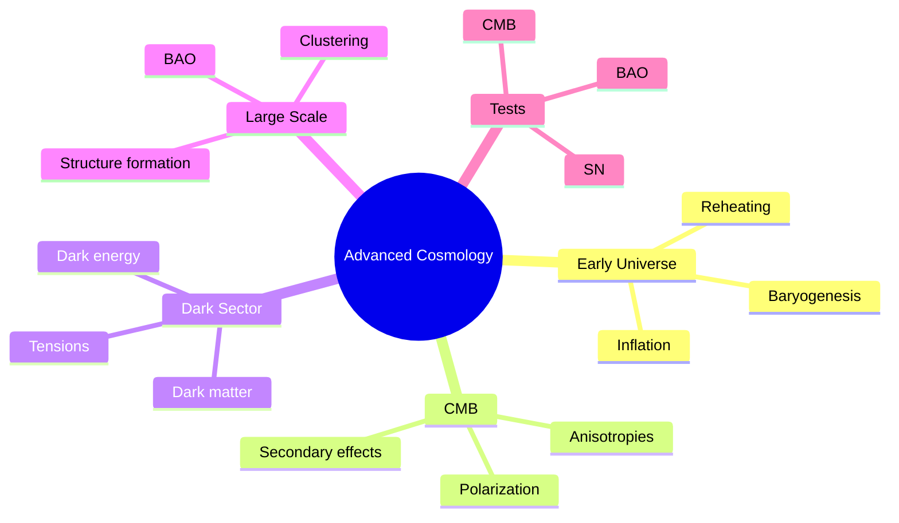
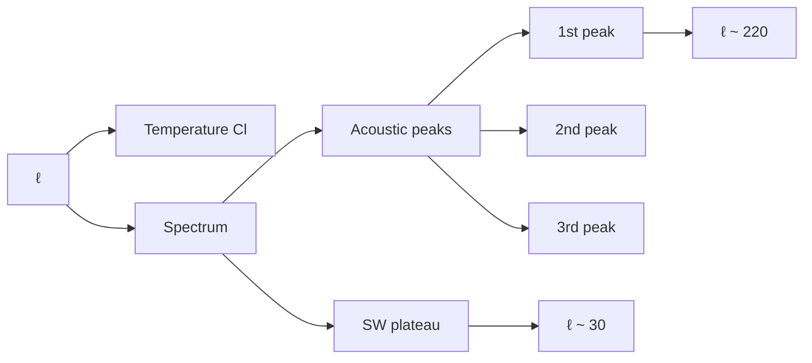
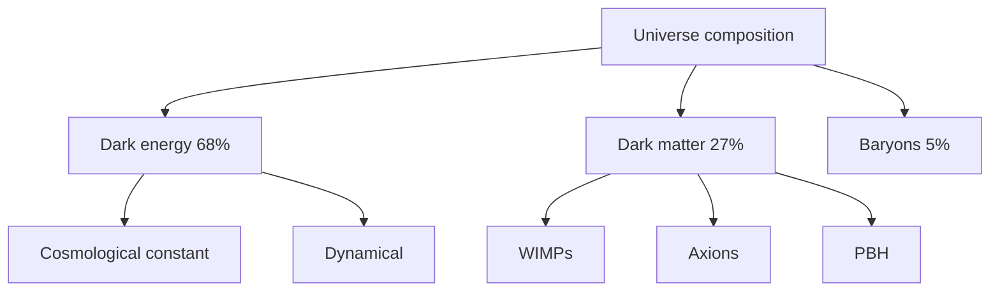

# MSPY 6510 — Advanced Cosmology
> **MSc Physics Elective | HKUST MSPY 6510 | Early universe, inflation, CMB, dark matter, dark energy**  
> **Bilingual 深度自學檔案 · 中英對照**

---

## 問題 1：5 個核心心智模型

1. **FRW metric describes universe** — FRW度規描述宇宙 (Robertson-Walker symmetry)
2. **Inflation solves problems** — 暴脹解決問題 (horizon, flatness, monopoles)
3. **CMB is the smoking gun** — CMB是關鍵證據 (anisotropies reveal primordial physics)
4. **Dark matter is not baryonic** — 暗物質不是重子的 (galaxy rotation curves, clusters)
5. **Dark energy dominates** — 暗能量主導 (accelerated expansion)

## 問題 2：3 個根本分歧

1. **Inflation models: many vs few**
   - Many: single-field slow-roll, hybrid, natural
   - Few: Starobinsky $R^2$, Higgs inflation

2. **Dark matter: WIMPs vs alternatives**
   - WIMPs: thermal freeze-out, SUSY candidates
   - Alternatives: axions, primordial black holes, fuzzy DM

3. **Dark energy: $\Lambda$ vs dynamical**
   - $\Lambda$: simplest, fine-tuning problem
   - Dynamical: quintessence, phantom fields

## 問題 3：10 個深度問題

1. 給定 FRW metric $ds^2 = -dt^2 + a(t)^2(dx^2 + dy^2 + dz^2)$, derive Friedmann equation。
2. 解釋為什麼 flatness problem requires $|\Omega - 1| < 10^{-5}$ today。
3. 為什麼 horizon problem is solved by inflation ($H \gg \dot{H}$)?
4. 給定 slow-roll parameters $\epsilon = -\dot{H}/H^2$, $\eta = -\ddot{H}/(2H\dot{H})$, derive scalar power spectrum。
5. 解釋 CMB anisotropies: Sachs-Wolfe, acoustic peaks。
6. 為什麼 $\Lambda$CDM fits CMB, BAO, SN data perfectly?
7. 給定 thermal history, calculate neutrino density $T_\nu = (4/11)^{1/3}T_\gamma$。
8. 解釋 BAO as standard ruler in large-scale structure。
9. 為什麼 $H_0$ tension is a crisis ($\sim 5\sigma$ discrepancy)?
10. 給定 tensor power spectrum, extract tensor-to-scalar ratio $r$.

## 深入 1：Cosmological Foundations
**Deep Dive I**

### FRW Metric
$$ds^2 = -dt^2 + a(t)^2\left[\frac{dr^2}{1-kr^2} + r^2(d\theta^2 + \sin^2\theta d\phi^2)\right]$$

Scale factor $a(t)$ describes expansion.

Curvature $k = 0, \pm 1$ for flat, closed, open.

### Friedmann Equations
$$H^2 = \frac{8\pi G}{3}\rho - \frac{k}{a^2}, \quad \frac{\ddot{a}}{a} = -\frac{4\pi G}{3}(\rho + 3p)$$

First equation from $G_{00} = 8\pi GT_{00}$.

Energy conservation:
$$\dot{\rho} + 3H(\rho + p) = 0$$

### Critical Density
$$\rho_c = \frac{3H^2}{8\pi G}$$

Matter-dominated: $a \propto t^{2/3}$

Radiation-dominated: $a \propto t^{1/2}$

Dark energy-dominated: $a \propto e^{Ht}$

**Engineering implication:** FRW geometry is excellent description of universe

## 深入 2：Inflation
**Deep Dive II**

### Problems Solved
1. **Horizon problem**: causal regions now were in equilibrium then
2. **Flatness problem**: $\Omega - 1 \sim t$ evolves away from 1
3. **Monopole problem**: GUT monopoles diluted by inflation

### Slow-Roll Conditions
Single field with potential $V(\phi)$:
$$\epsilon = \frac{M_{Pl}^2}{2}\left(\frac{V'}{V}\right)^2 \ll 1, \quad |\eta| \ll 1$$

Scalar spectral index:
$$n_s - 1 = 6\epsilon - 2\eta \approx -0.035$$

Number of e-folds:
$$N = \int_{\phi_i}^{\phi_f} \frac{V}{V'}d\phi \approx 50-60$$

### Primordial Power Spectrum
Scalar: $\mathcal{P}_\mathcal{R}(k) = \frac{H^2}{8\pi^2 M_{Pl}^2 \epsilon}$

Tensor: $\mathcal{P}_t(k) = \frac{2H^2}{\pi^2 M_{Pl}^2}$

Tensor-to-scalar ratio: $r = \mathcal{P}_t/\mathcal{P}_\mathcal{R} = 16\epsilon$

**Engineering implication:** Inflation generates nearly scale-invariant perturbations

## 深入 3：CMB Physics
**Deep Dive III**

### Temperature Anisotropies
Total angular power spectrum: $C_\ell = \langle a_{\ell m}^* a_{\ell m}\rangle$

Recombination: $T_{dec} \approx 3000$ K, $z \approx 1100$

Sound horizon: $r_s = \int_0^{z_*} \frac{c_s}{H(z)}dz \approx 145$ Mpc

Acoustic peaks: $\ell_{peak} \approx \pi/d_*$

### Sachs-Wolfe Effect
Integrated photon potential:
$$\frac{\Delta T}{T} = \frac{1}{3}\Phi(\vec{x}_{LSS}) + \int d\eta \dot{\Phi}$$

Primary anisotropies: $O(10^{-5})$ at $\ell > 30$

Secondary: ISW, lensing at low $\ell$

### Planck Results
| Parameter | Value |
|---|---|
| $H_0$ | $67.4 \pm 0.5$ km/s/Mpc |
| $\Omega_b h^2$ | $0.0224 \pm 0.0001$ |
| $\Omega_c h^2$ | $0.120 \pm 0.001$ |
| $n_s$ | $0.965 \pm 0.004$ |
| $\tau$ | $0.054 \pm 0.007$ |

**Engineering implication:** CMB constrains cosmology to 1% precision

## 深入 4：Dark Matter
**Deep Dive IV**

### Evidence
Galaxy rotation curves: $v(r) \approx \sqrt{GM(r)/r}$ flattens

Cluster dynamics: $M/L$ ratios indicate DM

Bullet Cluster: DM separated from baryons in collision

CMB: $\Omega_{DM} \approx 0.27$

### WIMP Paradigm
Thermal freeze-out:
$$\Omega_\chi h^2 \approx \frac{3 \times 10^{-27} \text{ cm}^3/\text{s}}{\langle\sigma v\rangle}$$

Relic abundance matches for $\langle\sigma v\rangle \approx 3 \times 10^{-26}$ cm$^3$/s.

Cross section: $\sigma \sim \alpha^2/m_\chi^2 \sim 10^{-46}$ cm$^2$

### Alternatives
- **Axions**: $m_a \sim 10^{-6}$ eV, cold DM
- **Sterile neutrinos**: warm DM, $m \sim$ keV
- **Primordial BHs**: MACHO alternative
- **Fuzzy DM**: $m \sim 10^{-22}$ eV, wave DM

**Engineering implication:** DM is 27% of universe, nature unknown

## 深入 5：Dark Energy & Tensions
**Deep Dive V**

### $\Lambda$CDM
$$\rho_\Lambda = \frac{\Lambda}{8\pi G} \approx 10^{-47}$ GeV$^4$

Equation of state: $w = p/\rho = -1$

Energy density: $\Omega_\Lambda \approx 0.69$

### Hubble Tension
Local measurement (SH0ES): $H_0 = 73.2 \pm 1.3$ km/s/Mpc

CMB inference (Planck): $H_0 = 67.4 \pm 0.5$ km/s/Mpc

Tension: $\sim 5\sigma$

Possible resolutions:
- New physics (early dark energy, interacting DM)
- Systematics in local measurement
- Beyond $\Lambda$CDM

### Alternative DE
Quintessence: $w > -1$, dynamical scalar field

Phantom: $w < -1$, dark energy density increases

$$w = -1 + \frac{w_0 + (1-a)w_a}{1 + (1-a)^{-1}}$$

**Engineering implication:** Hubble tension is frontier of precision cosmology

## 自測 1：Friedmann Equation
**Answer:** From Einstein: $H^2 = (8\pi G/3)\rho - k/a^2$, with $H = \dot{a}/a$.  
**Engineering implication:** Expansion rate depends on energy content

## 自測 2：Flatness Problem
**Answer:** $|\Omega - 1| = |k|/(aH)^2$ grows as $a$ if matter-dominated. Requires fine-tuning.  
**Engineering implication:** Universe is finely tuned for life

## 自測 3：Horizon Solution
**Answer:** Inflation: $aH$ nearly constant, so $1/(aH)$ shrinks. Causal region now contains preinflationary patch.  
**Engineering implication:** Inflation explains homogeneity

## 自測 4：Power Spectrum
**Answer:** $\mathcal{P}_\mathcal{R} = (H^2/8\pi^2 M_{Pl}^2)/\epsilon$, nearly scale-invariant for slow-roll.  
**Engineering implication:** Inflation generates seeds of structure

## 自測 5：CMB Anisotropies
**Answer:** SW: potential wells → photon redshift. Acoustic: photon-baryon fluid oscillates.  
**Engineering implication:** Peaks reveal cosmological parameters

## 自測 6：$\Lambda$CDM Fit
**Answer:** 6 parameters fit CMB+BAO+SN perfectly. $\chi^2/dof \approx 1$.  
**Engineering implication:** Concordance model established

## 自測 7：Neutrino Density
**Answer:** Neutrinos decouple at $T \sim$ MeV, $T_\nu = (4/11)^{1/3}T_\gamma \approx 1.95$ K.  
**Engineering implication:** 3 neutrino species contribute to radiation density

## 自測 8：BAO
**Answer:** Baryon acoustic oscillations: sound horizon $r_s \approx 150$ Mpc as standard ruler.  
**Engineering implication:** BAO measures expansion history

## 自測 9：$H_0$ Tension
**Answer:** Local measurements give higher $H_0$ than CMB inference. Could be new physics or systematics.  
**Engineering implication:** Crisis or opportunity for new physics

## 自測 10：Tensor Ratio
**Answer:** $r = 16\epsilon = \mathcal{P}_t/\mathcal{P}_\mathcal{R}$. Current limit: $r < 0.06$ (Planck).  
**Engineering implication:** Constrains inflation scale $V^{1/4} \sim (r/0.01)^{1/4} \times 10^{16}$ GeV

## 📊 Diagram 1: Advanced Cosmology Map


## 📊 Diagram 2: Inflationary Timeline
```mermaid
gantt
    title Cosmological History
    section Inflation
    Exponential expansion :a1, 0, 10⁻³⁶s
    section Thermal
    Reheating :b1, after a1, 10⁻³⁶s
    Radiation domination :b2, after b1, 1s
    section CMB
    Recombination :c1, 380000yr
    section Structure
    Matter domination :d1, after c1, 10⁹yr
    Dark energy :e1, 10⁹yr
```

## 📊 Diagram 3: CMB Power Spectrum


## 📊 Diagram 4: Matter Power Spectrum
```mermaid
graph TD
    A[k] --> B[P(k)]
    B --> C[Silk damping]
    B --> D[BAO]
    D --> E[Wiggles]
    C --> F[Small scales]
    E --> G[Intermediate]
    G --> H[Large scales]
```

## 📊 Diagram 5: Dark Sector


## 深度總結 Deep Insights

1. **Inflation is the standard paradigm** — solves horizon, flatness, monopole problems
   **暴脹是標準範式** — 解決視界、平坦、單極子問題

2. **CMB is extraordinarily informative** — anisotropies reveal all cosmological parameters
   **CMB是非常豐富的信息** — 各向異性揭示所有宇宙學參數

3. **Dark sector dominates** — 95% of universe is unknown
   **暗部門主導** — 宇宙的95%是未知的

4. **Tensions point to new physics** — $H_0$, $\sigma_8$ tensions motivate alternatives
   **緊張表明新物理** — $H_0$、$\sigma_8$ 緊張促使尋找替代方案

5. **Multi-messenger cosmology** — CMB, BAO, SN, lensing all consistent but tensions remain
   **多信使宇宙學** — CMB、BAO、SN、透鏡都一致但緊張仍然存在

---

**自學建議**
- 必讀: Baumann "Cosmology", Dodelson "Modern Cosmology"
- 配對: Planck collaboration papers, Weinberg "Cosmology"
- 工具: CLASS, CAMB, MontePython
- 產出: Calculate CMB angular power spectrum with CLASS
