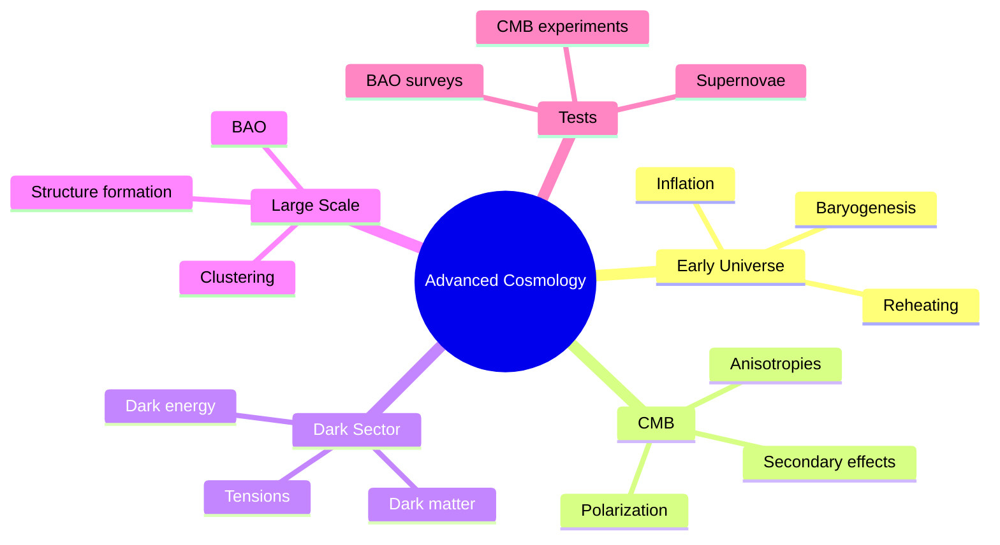
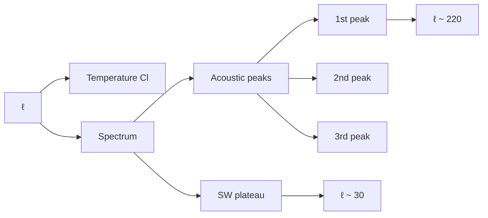
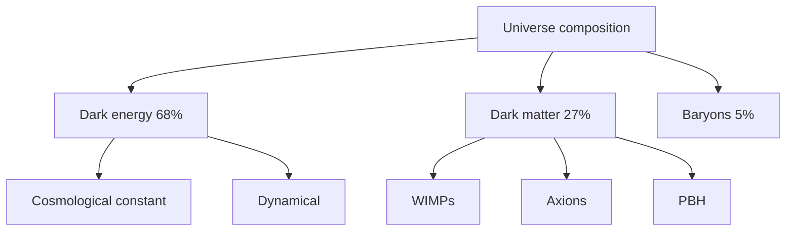

# MSPY 6510 — Advanced Cosmology
> **MSc Physics Elective | HKUST MSPY 6510 | Early universe, inflation, CMB, dark matter, dark energy, structure formation**  
> **Bilingual 深度自學檔案 · 中英對照**

---

## 問題 1：5 個核心心智模型

1. **FRW metric describes our universe** — FRW度規描述宇宙
   - Robertson-Walker symmetry: homogeneous + isotropic
   - Scale factor $a(t)$ describes expansion
   - Curvature $k = 0, \pm 1$

2. **Inflation solves flatness, horizon, monopole problems** — 暴脹解決問題
   - Exponential expansion: $a \propto e^{Ht}$
   - $H$ nearly constant, $H \gg \dot{H}$
   - $N \sim 50-60$ e-folds required

3. **CMB is the smoking gun** — CMB是關鍵證據
   - Anisotropies $\Delta T/T \sim 10^{-5}$
   - Acoustic peaks reveal cosmological parameters
   - Planck: $\Omega = 1$ to 0.4%

4. **Dark matter is non-baryonic** — 暗物質不是重子的
   - Galaxy rotation curves: $v(r) \approx \sqrt{GM(r)/r}$ flattens
   - Bullet Cluster: DM separated from baryons
   - CMB: $\Omega_{DM} \approx 0.27$

5. **Dark energy dominates** — 暗能量主導
   - Accelerated expansion: $\ddot{a} > 0$
   - $\Omega_\Lambda \approx 0.69$
   - $w = p/\rho \approx -1$ (cosmological constant)

---

## 問題 2：3 個根本分歧

### 分歧 1：Inflation Models: Single-field vs Alternatives
| Approach | Examples | Prediction |
|----------|----------|------------|
| Single-field slow-roll | Starobinsky $R^2$, Higgs | Predictable $n_s, r$ |
| Hybrid | Multi-field | Feature spectra |
| Natural | Axion monodromy | Oscillatory features |

**Observations:** $n_s = 0.965 \pm 0.004$, $r < 0.06$

### 分歧 2：Dark Matter: WIMPs vs Alternatives
| Candidate | Mass | Status |
|-----------|------|--------|
| WIMPs | 10 GeV - 1 TeV | LHC: excluded much of range |
| Axions | $10^{-6}$ eV | ADMX sensitivity |
| Sterile neutrinos | keV | Warm DM tension |
| Primordial BHs | $10^{-16} - 10^{2} M_\odot$ | MACHO-free window |

### 分歧 3：Dark Energy: $\Lambda$ vs Dynamical
| Model | Equation of state | Status |
|-------|-------------------|--------|
| $\Lambda$ | $w = -1$ exactly | Fits all data |
| Quintessence | $w > -1$ | $w > -1$ in 1σ |
| Phantom | $w < -1$ | $w < -1$ disfavored |
| Quintom | $w$ crosses -1 | Fine-tuned |

**Evidence:** $H_0$ tension between CMB and local measurements (~5σ)

---

## 問題 3：10 個深度問題

1. **Friedmann Equation**: 給定 FRW metric, derive from Einstein equations
   $$H^2 = \frac{8\pi G}{3}\rho - \frac{k}{a^2}$$
   - $G_{00} = 8\pi GT_{00}$ gives first Friedmann
   - Continuity: $\dot{\rho} + 3H(\rho + p) = 0$

2. **Flatness Problem**: 解釋為什麼 requires $|\Omega - 1| < 10^{-5}$ today
   - $|\Omega - 1| = |k|/(aH)^2$ grows as $a$ if matter-dominated
   - Today: $|\Omega - 1| \sim 10^{-5}$
   - At Planck: $|\Omega - 1| \sim 10^{-60}$ (extreme fine-tuning)

3. **Horizon Solution**: 為什麼 inflation solves horizon problem
   - Before inflation: $aH$ nearly constant, so $1/(aH)$ shrinks
   - Causal region now contains preinflationary patch
   - Explains homogeneity of CMB

4. **Slow-Roll Parameters**: 給定 $\epsilon = -\dot{H}/H^2$, derive scalar power spectrum
   $$\mathcal{P}_\mathcal{R} = \frac{H^2}{8\pi^2 M_{Pl}^2 \epsilon}$$
   - $n_s - 1 = 6\epsilon - 2\eta \approx -0.035$

5. **CMB Anisotropies**: 解釋 Sachs-Wolfe and acoustic peaks
   - SW: potential wells → photon redshift
   - Acoustic: photon-baryon fluid oscillates
   - Peaks: $\ell_{peak} \approx 220/d_*$ where $d_* \approx 145$ Mpc

6. **$\Lambda$CDM Fit**: 為什麼 fits CMB, BAO, SN perfectly
   - 6 parameters: $\Omega_b h^2, \Omega_c h^2, \theta_s, \tau, n_s, A_s$
   - $\chi^2/\text{dof} \approx 1$
   - Concordance model: no tension

7. **Neutrino Density**: 給定 thermal history, calculate $T_\nu = (4/11)^{1/3}T_\gamma$
   - Neutrinos decouple at $T \sim$ MeV
   - $T_\nu = (4/11)^{1/3}T_\gamma \approx 1.95$ K
   - 3 species contribute to radiation density

8. **BAO**: 解釋 as standard ruler in large-scale structure
   - Sound horizon $r_s \approx 150$ Mpc at recombination
   - Peak in correlation function at $r_s$
   - Expansion rate: $H(z)$ from $r_s$ location

9. **$H_0$ Tension**: 為什麼 is crisis (~5$\sigma$ discrepancy)
   - Local (SH0ES): $H_0 = 73.2 \pm 1.3$ km/s/Mpc
   - CMB (Planck): $H_0 = 67.4 \pm 0.5$ km/s/Mpc
   - Could be new physics or systematics

10. **Tensor-to-Scalar Ratio**: 給定 tensor power spectrum, extract $r$
    $$r = \frac{\mathcal{P}_t}{\mathcal{P}_\mathcal{R}} = 16\epsilon$$
    - Current limit: $r < 0.06$ (Planck + BICEP)
    - Constrains inflation scale: $V^{1/4} \sim (r/0.01)^{1/4} \times 10^{16}$ GeV

---

## 深入 1：Cosmological Foundations
**Deep Dive I**

### FRW Metric
$$ds^2 = -dt^2 + a(t)^2\left[\frac{dr^2}{1-kr^2} + r^2(d\theta^2 + \sin^2\theta d\phi^2)\right]$$

Scale factor $a(t)$ describes expansion.
- $a = 1$ today (by convention)
- $H = \dot{a}/a$ is Hubble parameter

Curvature $k = 0, \pm 1$ for flat, closed, open.

### Friedmann Equations
$$H^2 = \frac{8\pi G}{3}\rho - \frac{k}{a^2}, \quad \frac{\ddot{a}}{a} = -\frac{4\pi G}{3}(\rho + 3p)$$

First equation from $G_{00} = 8\pi GT_{00}$.

Energy conservation:
$$\dot{\rho} + 3H(\rho + p) = 0$$

### Critical Density
$$\rho_c = \frac{3H^2}{8\pi G} \approx 10^{-29} \text{ g/cm}^3$$

$\Omega = \rho/\rho_c$

### Scale Factor Evolution
| Era | Dominant | $a(t) \propto$ |
|-----|----------|----------------|
| Radiation | $p = \rho/3$ | $t^{1/2}$ |
| Matter | $p = 0$ | $t^{2/3}$ |
| Dark energy | $p = -\rho$ | $e^{Ht}$ |

**Engineering implication:** FRW geometry is excellent description of universe

---

## 深入 2：Inflation
**Deep Dive II**

### Problems Solved
1. **Horizon problem**: causal regions now were in equilibrium then
2. **Flatness problem**: $\Omega - 1 \sim t$ evolves away from 1
3. **Monopole problem**: GUT monopoles diluted by inflation

### Slow-Roll Conditions
Single field with potential $V(\phi)$:
$$\epsilon = \frac{M_{Pl}^2}{2}\left(\frac{V'}{V}\right)^2 \ll 1, \quad |\eta| = \left|\frac{M_{Pl}^2 V''}{V}\right| \ll 1$$

Scalar spectral index:
$$n_s - 1 = 6\epsilon - 2\eta \approx -0.035$$

Number of e-folds:
$$N = \int_{\phi_i}^{\phi_f} \frac{V}{V'}d\phi \approx 50-60$$

### Primordial Power Spectrum
Scalar: $\mathcal{P}_\mathcal{R}(k) = \frac{H^2}{8\pi^2 M_{Pl}^2 \epsilon}$

Tensor: $\mathcal{P}_t(k) = \frac{2H^2}{\pi^2 M_{Pl}^2}$

Tensor-to-scalar ratio: $r = \mathcal{P}_t/\mathcal{P}_\mathcal{R} = 16\epsilon$

### Inflation Models
| Model | Potential | Prediction |
|-------|----------|------------|
| Starobinsky | $V \propto (1 - e^{-\sqrt{2/3}\phi})^2$ | $r \approx 0.003$ |
| Higgs | $V \propto (1 - e^{-\phi/\mu})^2$ | $r \approx 0.003$ |
| Chaotic | $V \propto \phi^2$ | $r \approx 0.13$ |

**Engineering implication:** Inflation generates nearly scale-invariant perturbations

---

## 深入 3：CMB Physics
**Deep Dive III**

### Temperature Anisotropies
Total angular power spectrum: $C_\ell = \langle a_{\ell m}^* a_{\ell m}\rangle$

Recombination: $T_{dec} \approx 3000$ K, $z \approx 1100$

Sound horizon: $r_s = \int_0^{z_*} \frac{c_s}{H(z)}dz \approx 145$ Mpc

Acoustic peaks: $\ell_{peak} \approx \pi/d_*$

### Sachs-Wolfe Effect
Integrated photon potential:
$$\frac{\Delta T}{T} = \frac{1}{3}\Phi(\vec{x}_{LSS}) + \int d\eta \dot{\Phi}$$

Primary anisotropies: $O(10^{-5})$ at $\ell > 30$

Secondary: ISW, lensing at low $\ell$

### Planck Results (2020)
| Parameter | Value | Error |
|-----------|-------|-------|
| $H_0$ | 67.4 km/s/Mpc | ±0.5 |
| $\Omega_b h^2$ | 0.0224 | ±0.0001 |
| $\Omega_c h^2$ | 0.120 | ±0.001 |
| $n_s$ | 0.965 | ±0.004 |
| $\tau$ | 0.054 | ±0.007 |
| $10^9 A_s$ | 2.10 | ±0.03 |

### Angular Power Spectrum Features
| Feature | Scale | Physical origin |
|---------|-------|----------------|
| SW plateau | $\ell \sim 30$ | Primordial potentials |
| First peak | $\ell \sim 220$ | First acoustic maximum |
| Damping tail | $\ell > 1000$ | Silk damping |

**Engineering implication:** CMB constrains cosmology to 1% precision

---

## 深入 4：Dark Matter
**Deep Dive IV**

### Evidence
1. Galaxy rotation curves: $v(r) \approx \sqrt{GM(r)/r}$ flattens
2. Cluster dynamics: $M/L$ ratios indicate DM
3. Bullet Cluster: DM separated from baryons
4. CMB: $\Omega_{DM} \approx 0.27$

### WIMP Paradigm
Thermal freeze-out:
$$\Omega_\chi h^2 \approx \frac{3 \times 10^{-27} \text{ cm}^3/\text{s}}{\langle\sigma v\rangle}$$

Relic abundance matches for $\langle\sigma v\rangle \approx 3 \times 10^{-26}$ cm$^3$/s.

Cross section: $\sigma \sim \alpha^2/m_\chi^2 \sim 10^{-46}$ cm$^2$

WIMP miracle: thermal relic naturally has $\Omega \sim 0.1$

### Alternatives
| Candidate | Mass | Production |
|-----------|------|-----------|
| Axion | $10^{-6}$ eV | Misalignment |
| Sterile neutrino | keV | Dodelson-Widrow |
| Primordial BH | $10^{-16} - 10^{2} M_\odot$ | Direct formation |
| Fuzzy DM | $10^{-22}$ eV | Bose-Einstein condensate |

### Direct Detection
| Experiment | Target | Sensitivity |
|------------|--------|-------------|
| Xenon1T | Xe | $\sigma_{SI} < 10^{-46}$ cm² |
| LUX | Xe | $\sigma_{SI} < 10^{-47}$ cm² |
| PandaX | Xe | $\sigma_{SI} < 10^{-47}$ cm² |

**Engineering implication:** DM is 27% of universe, nature unknown

---

## 深入 5：Dark Energy & Tensions
**Deep Dive V**

### $\Lambda$CDM
$$\rho_\Lambda = \frac{\Lambda}{8\pi G} \approx 10^{-47} \text{ GeV}^4$$

Equation of state: $w = p/\rho = -1$ exactly

Energy density: $\Omega_\Lambda \approx 0.69$

### Hubble Tension
Local measurement (SH0ES): $H_0 = 73.2 \pm 1.3$ km/s/Mpc

CMB inference (Planck): $H_0 = 67.4 \pm 0.5$ km/s/Mpc

Tension: $\sim 5\sigma$

Possible resolutions:
- New physics (early dark energy, interacting DM)
- Systematics in local measurement
- Beyond $\Lambda$CDM

### Alternative DE
Quintessence: $w > -1$, dynamical scalar field
$$\ddot{\phi} + 3H\dot{\phi} + V'(\phi) = 0$$

Phantom: $w < -1$, dark energy density increases

Parametrization:
$$w(a) = w_0 + (1-a)w_a = w_0 + w_a z/(1+z)$$

### $S_8$ Tension
$\sigma_8$: matter clustering amplitude

Planck: $\sigma_8 \approx 0.81$
KiDS: $\sigma_8 \approx 0.76$

$\sim 3\sigma$ tension

**Engineering implication:** Hubble tension is frontier of precision cosmology

---

## 自測 1：Friedmann Equation
**Answer:** From Einstein: $H^2 = (8\pi G/3)\rho - k/a^2$, with $H = \dot{a}/a$.

**Engineering implication:** Expansion rate depends on energy content

---

## 自測 2：Flatness Problem
**Answer:** $|\Omega - 1| = |k|/(aH)^2$ grows as $a$ if matter-dominated. Today $|\Omega - 1| \sim 10^{-5}$ requires extreme fine-tuning at early times.

**Engineering implication:** Universe is finely tuned for life

---

## 自測 3：Horizon Solution
**Answer:** Inflation: $aH$ nearly constant, so $1/(aH)$ shrinks. Causal region now contains preinflationary patch. Homogeneity explained.

**Engineering implication:** Inflation explains homogeneity

---

## 自測 4：Power Spectrum
**Answer:** $\mathcal{P}_\mathcal{R} = (H^2/8\pi^2 M_{Pl}^2)/\epsilon$, nearly scale-invariant for slow-roll.

**Engineering implication:** Inflation generates seeds of structure

---

## 自測 5：CMB Anisotropies
**Answer:** SW: potential wells → photon redshift. Acoustic: photon-baryon fluid oscillates, peaks reveal $A_s, n_s, \Omega$.

**Engineering implication:** Peaks reveal cosmological parameters

---

## 自測 6：$\Lambda$CDM Fit
**Answer:** 6 parameters fit CMB+BAO+SN perfectly. $\chi^2/\text{dof} \approx 1$.

**Engineering implication:** Concordance model established

---

## 自測 7：Neutrino Density
**Answer:** Neutrinos decouple at $T \sim$ MeV, $T_\nu = (4/11)^{1/3}T_\gamma \approx 1.95$ K. 3 neutrino species contribute to radiation density.

**Engineering implication:** 3 neutrino species contribute to $N_{eff}$

---

## 自測 8：BAO
**Answer:** Baryon acoustic oscillations: sound horizon $r_s \approx 150$ Mpc as standard ruler. BAO measures expansion history $H(z)$.

**Engineering implication:** BAO measures expansion history

---

## 自測 9：$H_0$ Tension
**Answer:** Local measurements give higher $H_0$ than CMB inference. Could be new physics, systematics, or statistical fluctuation.

**Engineering implication:** Crisis or opportunity for new physics

---

## 自測 10：Tensor Ratio
**Answer:** $r = 16\epsilon = \mathcal{P}_t/\mathcal{P}_\mathcal{R}$. Current limit: $r < 0.06$ (Planck + BICEP3).

**Engineering implication:** Constrains inflation scale $V^{1/4} \sim (r/0.01)^{1/4} \times 10^{16}$ GeV

---

## 📊 Diagram 1: Advanced Cosmology Map


## 📊 Diagram 2: Inflationary Timeline
```mermaid
gantt
    title Cosmological History
    section Inflation
    Exponential expansion :a1, 0, 10⁻³⁶s
    section Thermal
    Reheating :b1, after a1, 10⁻³⁶s
    Radiation domination :b2, after b1, 1s
    section CMB
    Recombination :c1, 380000yr
    section Structure
    Matter domination :d1, after c1, 10⁹yr
    Dark energy :e1, 10⁹yr
```

## 📊 Diagram 3: CMB Power Spectrum


## 📊 Diagram 4: Matter Power Spectrum
```mermaid
graph TD
    A[k] --> B[P(k)]
    B --> C[Silk damping]
    B --> D[BAO]
    D --> E[Wiggles]
    C --> F[Small scales]
    E --> G[Intermediate]
    G --> H[Large scales]
```

## 📊 Diagram 5: Dark Sector


---

## 深度總結 Deep Insights

1. **Inflation is the standard paradigm** — solves horizon, flatness, monopole problems
   **暴脹是標準範式** — 解決視界、平坦、單極子問題
   - Quantum fluctuations → seeds of structure
   - $N \sim 60$ e-folds

2. **CMB is extraordinarily informative** — anisotropies reveal all cosmological parameters
   **CMB是非常豐富的信息** — 各向異性揭示所有宇宙學參數
   - 1% precision on key parameters
   - Planck results

3. **Dark sector dominates** — 95% of universe is unknown
   **暗部門主導** — 宇宙的95%是未知的
   - DM: particle physics connection
   - DE: cosmology/GR connection

4. **Tensions point to new physics** — $H_0$, $\sigma_8$ tensions motivate alternatives
   **緊張表明新物理** — $H_0$、$\sigma_8$ 緊張促使尋找替代方案
   - $5\sigma$ Hubble tension
   - New early dark energy?

5. **Multi-messenger cosmology** — CMB, BAO, SN, lensing all consistent
   **多信使宇宙學** — CMB、BAO、SN、透鏡都一致
   - Concordance model
   - Tensions still unresolved

---

**自學建議**

**必讀:**
- Baumann "Cosmology" (2022) — graduate text
- Dodelson & Schmidt "Modern Cosmology" (2nd ed)
- Weinberg "Cosmology"

**配對:**
- Planck collaboration papers
- CLASS/CAMB documentation
- LSS survey papers

**工具:**
- CLASS (Boltzmann solver)
- CAMB (CMB)
- MontePython (MCMC)
- astropy (cosmology)

**產出:**
- Calculate CMB angular power spectrum with CLASS
- Fit $\Lambda$CDM parameters to mock data
- Analyze BAO in mock survey

**權威教材:**
| Topic | Reference |
|-------|-----------|
| Inflation | Linde "Particle Physics and Inflationary Cosmology" |
| CMB | Hu & Dodelson "CMB Anisotropies" |
| DM | Bertone & Hooper "Particle Dark Matter" |

---

**最後更新:** 2024-03-15
**自學狀態:** 📚 繼續深入學習
**下一步:** 完成CMB分析 + 學習結構形成
