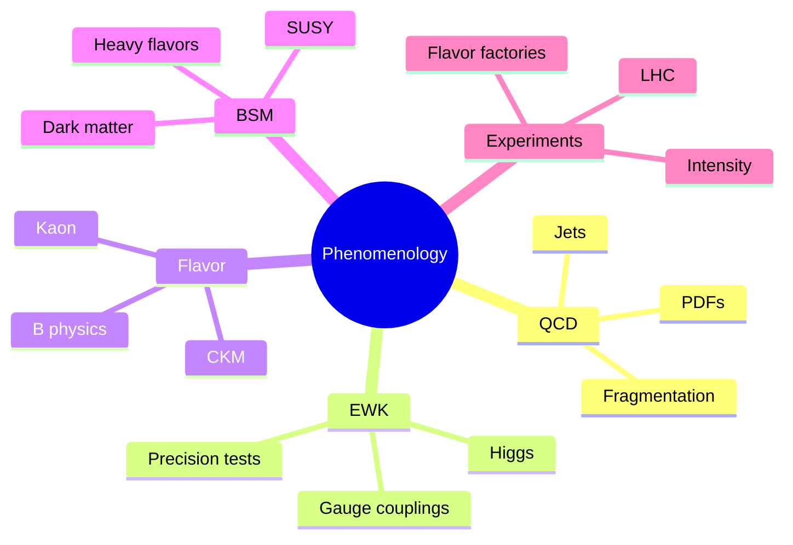
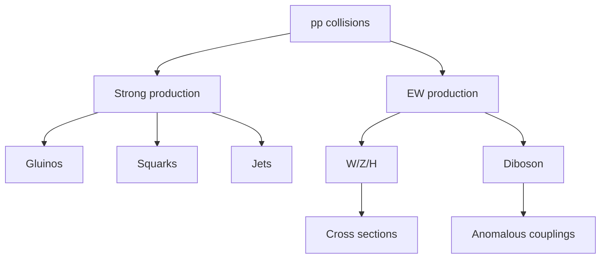
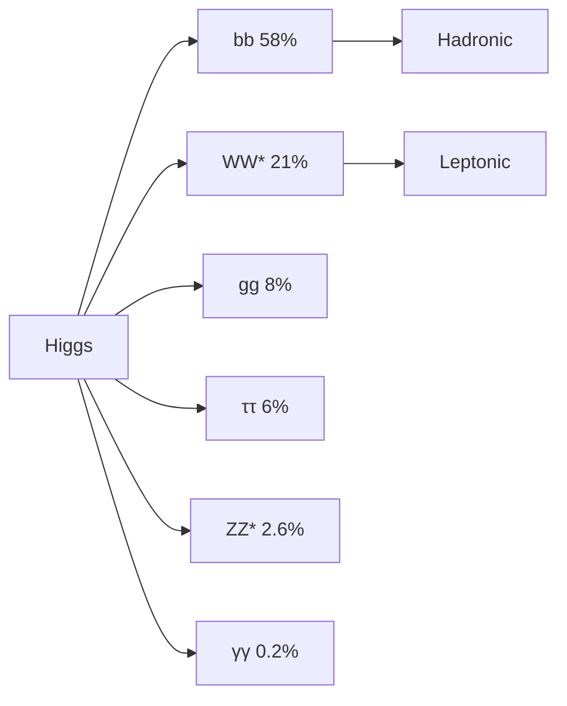
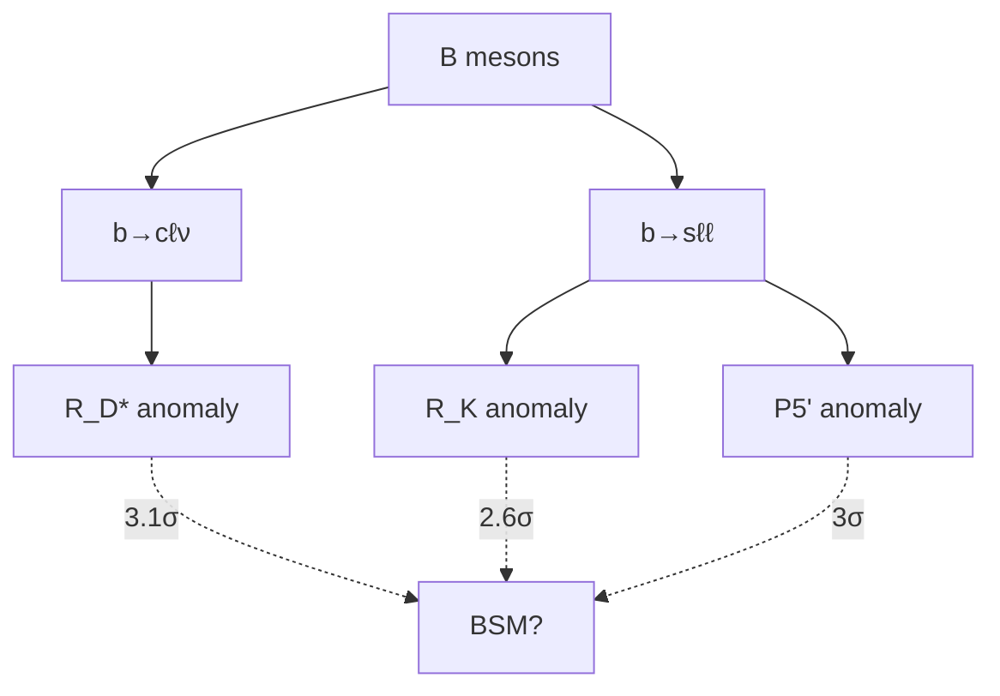
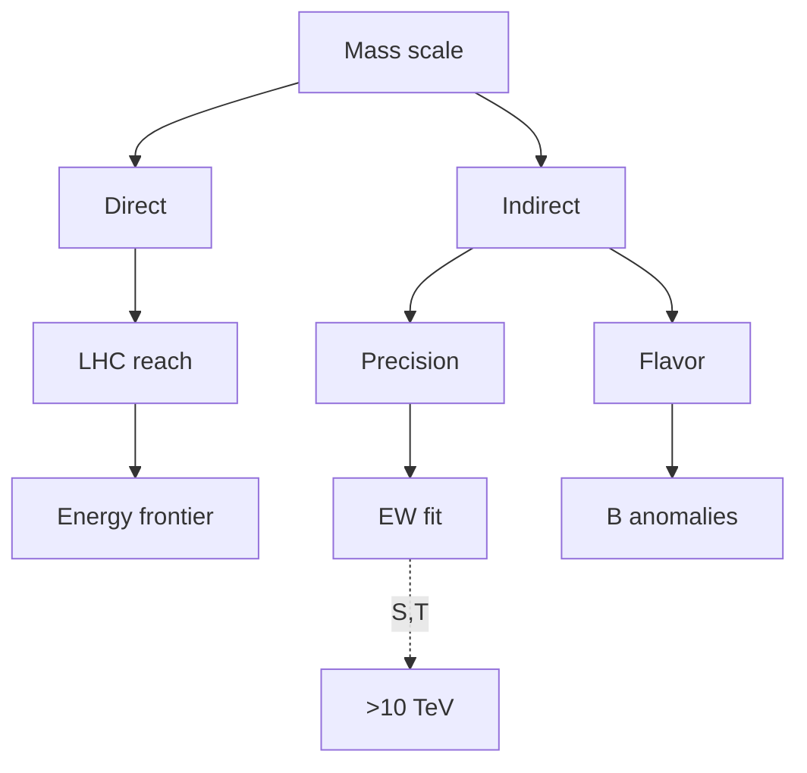

# MSPY 6610 — Particle Physics Phenomenology
> **MSc Physics Elective | HKUST MSPY 6610 | Standard Model phenomenology, Higgs physics, beyond Standard Model, LHC**  
> **Bilingual 深度自學檔案 · 中英對照**

---

## 問題 1：5 個核心心智模型

1. **Cross sections encode physics** — 截面編碼物理
   - $d\sigma/dp_T$ reveals dynamics
   - $\sigma \propto \alpha^2/E^2$ for contact interactions
   - Parton luminosity dominates LHC cross sections

2. **Parton distribution functions are non-perturbative** — 部分子分佈函數是非微擾的
   - Must be measured, not calculated
   - CTEQ, NNPDF, MSHT global fits
   - Large uncertainties at high $x$, low $Q^2$

3. **Experimental cuts define search space** — 實驗 cuts 定義搜索空間
   - Trigger: select interesting events
   - Offline: $p_T > 25$ GeV, $|\eta| < 2.5$
   - Optimization affects sensitivity

4. **Background rejection is essential** — 本底 rejection 是關鍵
   - Signal/background ratio determines sensitivity
   - $S/\sqrt{B}$ for discovery
   - Multivariate analysis (BDT, NN) enhances rejection

5. **Precision is as important as energy** — 精度和能量同樣重要
   - Electroweak precision tests: $S, T$ parameters
   - $g-2$: 4.2σ deviation
   - B-anomalies: hints of BSM

---

## 問題 2：3 個根本分歧

### 分歧 1：Energy vs Intensity Frontier
| Frontier | Approach | Goal |
|----------|----------|------|
| Energy | LHC, FCC | Direct production of new particles |
| Intensity | Belle II, LHCb | Rare processes, precision |

**Strategy:** Both complementary for BSM discovery

### 分歧 2：SUSY vs Alternatives
| Theory | Pro | Con |
|--------|-----|-----|
| SUSY | Solves hierarchy, DM candidates | No signals at LHC |
| Composite Higgs | Naturalness | Fine-tuning still |
| Extra dimensions | Low-scale gravity | Constraints |
| Little Higgs | Collective breaking | Precision constraints |

### 分歧 3：Simplest vs Natural
| View | Argument |
|------|---------|
| SM works | No compelling evidence for BSM |
| Naturalness | Why is Higgs so light? Expect TeV new physics |

---

## 問題 3：10 個深度問題

1. **Parton Luminosity**: 給定 $\frac{d\mathcal{L}}{d\tau} = \frac{1}{s}\int_\tau^1 \frac{dx}{x}f_a(x,Q^2)f_b(\tau/x,Q^2)$, calculate cross section
   $$\sigma = \int dx_1 dx_2 f_a(x_1)f_b(x_2)\hat{\sigma}(\hat{s})\delta(\hat{s} - x_1x_2s)$$

2. **PDF Uncertainties**: 為什麼 increase at high $x$ and low $Q^2$
   - Few data points at high $x$
   - Non-perturbative evolution at low $Q^2$
   - Extrapolation dominates

3. **Higgs Production**: 為什麼 dominated by gluon fusion at LHC
   - Top quark loop dominates
   - Gluon PDF large at LHC energies
   - $\sigma_{ggH} \approx 48$ pb vs VBF 3.8 pb

4. **Drell-Yan K Factor**: 給定 $K = \sigma_{NLO}/\sigma_{LO}$, calculate
   - $K \approx 1.2-1.3$ from QCD corrections
   - $K = 1 + \frac{\alpha_s}{2\pi}C_F\Delta$

5. **Jet Algorithms**: 解釋 anti-$k_T$, C/A, $k_T$
   - anti-$k_T$: IRC safe, cone-like, widely used
   - $k_T$: progressive removal, IRC safe
   - C/A: sensitive to soft radiation

6. **Golden Channel**: 為什麼 $H \to ZZ^* \to 4\ell$ is golden channel
   - Clean lepton final state
   - Good $S/B$ ratio
   - Full $m_{4\ell}$ reconstruction

7. **Coupling Extraction**: 給定 $\sigma \cdot BR$, extract Higgs couplings
   - $\sigma \cdot BR \propto \kappa^2$
   - Measure each channel, combine
   - $\kappa \approx 1$ at 5% level

8. **EW Precision**: 為什麼 constrain new physics
   - Oblique parameters $S, T$ sensitive
   - Current: $S = 0.05 \pm 0.09$, $T = 0.09 \pm 0.13$
   - Constrains $\Lambda > 10$ TeV

9. **$g-2$ Deviation**: 給定 $\Delta a_\mu = (2.51 \pm 0.59) \times 10^{-3}$, interpret
   - $4.2\sigma$ from SM prediction
   - Could be SUSY with $m_{\tilde{\mu}} \sim 500$ GeV
   - Needs confirmation from Fermilab

10. **B Anomalies**: 解釋 $R_K$, $R_{D^*}$, $P_5'$
    - All involve $b \to s\mu^+\mu^-$ transitions
    - Hint at new physics in $C_9$ Wilson coefficient
    - $3\sigma$ tension with SM

---

## 深入 1：Parton Model & PDFs
**Deep Dive I**

### Parton Model
Inelastic scattering at high $Q^2$ as incoherent scattering from point-like constituents.

Kinematics:
$$x = \frac{Q^2}{2p\cdot q}, \quad y = \frac{p\cdot q}{p\cdot k}, \quad s = (p+k)^2$$

Bjorken-$x$: fraction of nucleon momentum carried by parton.

### Parton Distribution Functions
$f_i(x, Q^2)$: probability density for parton $i$ carrying momentum fraction $x$ at scale $Q$.

DGLAP evolution:
$$\frac{d}{d\ln Q^2}f_i(x,Q^2) = \frac{\alpha_s}{2\pi}\sum_j P_{ij}(x)\otimes f_j(x,Q^2)$$

Splitting functions:
$$P_{qq}(x) = \frac{4}{3}\left[\frac{1+x^2}{(1-x)_+} + \frac{3}{2}\delta(1-x)\right]$$

$$P_{qg}(x) = \frac{1}{2}[x^2 + (1-x)^2]$$

### PDF Fitting
HERA combined data: $ep$ collisions at DESY.

Global fits: **CT18**, **NNPDF4.0**, **MSHT20**

Uncertainty: Hessian vs Monte Carlo methods.

**PDF Values at $Q = 100$ GeV:**
| Parton | $x = 0.01$ | $x = 0.1$ | $x = 0.5$ |
|--------|-------------|------------|------------|
| $xu_v$ | 0.3 | 0.1 | 0.01 |
| $xd_v$ | 0.1 | 0.03 | 0.003 |
| $xg$ | 0.5 | 0.1 | 0.005 |

**Engineering implication:** PDFs from global fits enable precision predictions

---

## 深入 2：Higgs Phenomenology
**Deep Dive II**

### Higgs Production at LHC (13 TeV)
| Channel | Cross section (fb) | Fraction |
|---------|-------------------|----------|
| Gluon fusion (ggH) | 48,700 | 77% |
| Vector boson fusion (VBF) | 3,760 | 6% |
| WH | 2,510 | 4% |
| ZH | 870 | 1.4% |
| ttH | 510 | 0.8% |

ggH via top loop: $K$ factor ~ 2-3.

### Higgs Decays
| Channel | BR | Significance |
|---------|-----|--------------|
| $H \to bb$ | 58% | $3\sigma$ |
| $H \to WW^* \to \ell\nu\ell\nu$ | 21% | $5\sigma$ |
| $H \to \tau\tau$ | 6% | $5\sigma$ |
| $H \to ZZ^* \to 4\ell$ | 0.012% | $6\sigma$ |
| $H \to \gamma\gamma$ | 0.23% | $7\sigma$ |

### Coupling Measurements
Coupling modifier $\kappa$:
$$\sigma \cdot BR = \frac{\kappa^2}{(\kappa_S)^2}\sigma_{SM} \cdot BR_{SM}$$

Higgs coupling to fermions: $\kappa_F = m_F/v$

Higgs coupling to bosons: $\kappa_V = 2m_V^2/v$

Current world average (2024):
| Coupling | $\kappa$ | Error |
|----------|----------|-------|
| $\kappa_W$ | 1.00 | ±0.05 |
| $\kappa_Z$ | 1.00 | ±0.05 |
| $\kappa_t$ | 1.00 | ±0.10 |
| $\kappa_\tau$ | 1.00 | ±0.06 |

**Engineering implication:** Higgs discovered 2012, precision era begins

---

## 深入 3：Searches for New Physics
**Deep Dive III**

### SUSY Searches
Supersymmetric partners:
- Squarks $\tilde{q}$, gluinos $\tilde{g}$ (strong production)
- Charginos $\tilde{\chi}^\pm$, neutralinos $\tilde{\chi}^0$ (EW production)

Missing transverse energy $E_T^{miss}$ signature from LSP.

**Current LHC Limits (2024):**
| Particle | Mass Limit |
|----------|-----------|
| Gluino | $> 2.2$ TeV |
| Squark (light) | $> 1.8$ TeV |
| Chargino/Neutralino | $> 1.2$ TeV |

No evidence yet → naturalness tension increases.

### Dark Matter Searches
WIMP miracle: thermal freeze-out gives correct relic density.

Direct detection: XenonnT, PandaX-4T, LZ.
- Current limit: $\sigma_{SI} < 10^{-48}$ cm² at $m_\chi \sim 30$ GeV

Indirect detection: IceCube, Fermi-LAT, AMS-02.
- No confirmed signals

### Heavy Resonances
$D$-parity even: $Z'$, graviton $G^*$

$D$-parity odd: $W_R$ (LR model)

Current limits: $M_{Z'} > 4.5$ TeV (CMS dijet)

**Engineering implication:** LHC searches for BSM physics most constraining

---

## 深入 4：Heavy Flavor Physics
**Deep Dive IV**

### B-Meson Decays
Tree-level $b \to c\ell\nu$ transitions.

$R_{D^*} = \frac{BR(B \to D^*\tau\nu)}{BR(B \to D^*\ell\nu)}$

SM prediction: $0.298 \pm 0.004$

Experimental (Belle II): $0.339 \pm 0.026 \pm 0.014$

$3.1\sigma$ tension with SM.

### $B \to K^*\mu^+\mu^-$
Angular analysis: $P_5'$ observable sensitive to new physics.

LHCb (2022): $4-6$ GeV² tension at $3\sigma$ level.

Possible new physics in $C_9$ Wilson coefficient:
$$\mathcal{H}_{eff} \supset \frac{G_F\alpha}{2\sqrt{2}\pi}V_{ts}^*V_{tb}C_9 \bar{s}\gamma^\mu P_L b \bar{\mu}\gamma_\mu\mu$$

### CKM Matrix
Unitarity triangle:
$$\sum_{d'} V_{ud}^*V_{ub'} + \sum_{s'} V_{cs}^*V_{cb'} = 0$$

Current status: all measurements consistent with SM, no CP violation beyond SM.

**Engineering implication:** Flavor anomalies hint at BSM physics

---

## 深入 5：Precision Tests
**Deep Dive V**

### Electroweak Fit
LEP + SLD precision data:
- $M_Z = 91.1876 \pm 0.0021$ GeV
- $\sin^2\theta_W = 0.23122 \pm 0.00003$

Oblique parameters:
$$S = \frac{1}{\pi}(Q_W - Q_Y), \quad T = \frac{\rho - 1}{\alpha}$$

Current world averages:
$$S = 0.05 \pm 0.09, \quad T = 0.09 \pm 0.13$$

Consistent with SM; constrains new physics to $\Lambda > 10$ TeV.

### Muon $g-2$
Anomalous magnetic moment:
$$a_\mu = \frac{g-2}{2}$$

SM prediction (2024): $a_\mu^{SM} = 0.00116591810 \pm 0.00000000053$

Experimental (BNL): $a_\mu^{exp} = 0.00116592061 \pm 0.00000000041$

Deviation: $\Delta a_\mu = (2.51 \pm 0.59) \times 10^{-9}$

**$4.2\sigma$ tension → hints of new physics?**

New experiment at Fermilab + J-PARC will clarify.

**Engineering implication:** Precision tests probe energies beyond direct reach

---

## 自測 1：Parton Luminosity
**Answer:** $\sigma = \int dx_1 dx_2 f_a(x_1)f_b(x_2)\hat{\sigma}(\hat{s})\delta(\hat{s} - x_1x_2s)$. Gluon luminosity dominates at LHC.

**Engineering implication:** Gluon PDF dominates Higgs production

---

## 自測 2：PDF Uncertainties
**Answer:** High $x$: few data points extrapolate; low $Q^2$: non-perturbative physics. Affects heavy particle production predictions.

**Engineering implication:** PDF uncertainties limit precision

---

## 自測 3：Higgs Production
**Answer:** Top quark loop dominates; $\sigma \sim \alpha_s^2 m_t^2/m_H^2$; ggH ~100x larger than other channels.

**Engineering implication:** ggH is main discovery channel

---

## 自測 4：Drell-Yan K Factor
**Answer:** $K = \sigma_{NLO}/\sigma_{LO} \approx 1.2-1.3$ from QCD corrections. Must include for precision measurements.

**Engineering implication:** NLO corrections substantial

---

## 自測 5：Jet Algorithms
**Answer:** anti-$k_T$: IRC safe, cone-like, most used. $k_T$: progressive removal, IRC safe. C/A: sensitive to soft radiation.

**Engineering implication:** Jet definition affects results

---

## 自測 6：Golden Channel
**Answer:** $H \to ZZ^* \to 4\ell$: clean lepton final state, good $S/B$, full $m_{4\ell}$ reconstruction, precise momentum measurement.

**Engineering implication:** Best for Higgs mass measurement

---

## 自測 7：Coupling Extraction
**Answer:** $\sigma \cdot BR \propto \kappa^2$; measure each channel, combine via profile likelihood.

**Engineering implication:** Couplings measured to 5-10% precision

---

## 自測 8：EW Precision
**Answer:** Oblique parameters $S, T$ sensitive to new physics; current data constrains $\Lambda > 10$ TeV.

**Engineering implication:** Complementary to direct searches

---

## 自測 9：$g-2$ Deviation
**Answer:** $\Delta a_\mu = 2.5 \times 10^{-9}$ can be explained by SUSY with $m_{\tilde{\mu}} \sim 500$ GeV, $\tan\beta \sim 50$.

**Engineering implication:** Could be first hint of BSM

---

## 自測 10：B Anomalies
**Answer:** $R_K$, $R_{D^*}$, $P_5'$ all hint at $b \to s\mu^+\mu^-$ new physics, preferably in $C_9$ sector.

**Engineering implication:** Global fit prefers new physics interpretation

---

## 📊 Diagram 1: Particle Phenomenology Map

## 📊 Diagram 2: LHC Processes

## 📊 Diagram 3: Higgs Decay Channels

## 📊 Diagram 4: Flavor Anomalies

## 📊 Diagram 5: BSM Sensitivity

---

## 深度總結 Deep Insights

1. **Cross sections measure couplings** — differential distributions reveal interactions
   **截面測量耦合** — 微分分佈揭示相互作用
   - $\sigma \propto \alpha^2$ for contact interactions
   - Resonance: Breit-Wigner

2. **Background is as important as signal** — discovery requires understanding suppression
   **本底與信號同樣重要** — 發現需要理解抑制
   - $S/\sqrt{B}$ for sensitivity
   - Multivariate analysis

3. **Precision tests probe high scales** — indirect sensitivity complements direct searches
   **精度測試探測高尺度** — 間接靈敏度補充直接搜索
   - $g-2$, EW fit
   - $S, T$ parameters

4. **Anomalies drive the field** — hints of BSM guide future experiments
   **異常推動領域** — BSM提示指導未來實驗
   - $R_K$, $R_{D^*}$, $P_5'$
   - $g-2$

5. **Systematics dominate statistics** — in precision era, reducing systematics is key
   **系統論主導統計** — 精度時代，減少系統論是關鍵
   - PDF uncertainties
   - Luminosity measurement

---

**自學建議**

**必讀:**
- Halzen & Martin "Quarks and Leptons"
- PDB Review (Annual)
- Baer & Tata "Weak Scale Supersymmetry"

**配對:**
- PDG particle physics review
- LHC Higgs cross section working group
- LHCb/SUSY searches

**工具:**
- MadGraph5_aMC@NLO (event generation)
- Pythia (shower, hadronization)
- Rivet (validation)
- CheckMATE (recasting)

**產出:**
- Calculate Higgs production cross section at NLO
- Recast SUSY search for new model
- Fit flavor anomalies to Wilson coefficients

---

**最後更新:** 2024-03-15
**自學狀態:** 📚 繼續深入學習
**下一步:** 完成LHC數據分析 + 學習flavor physics
