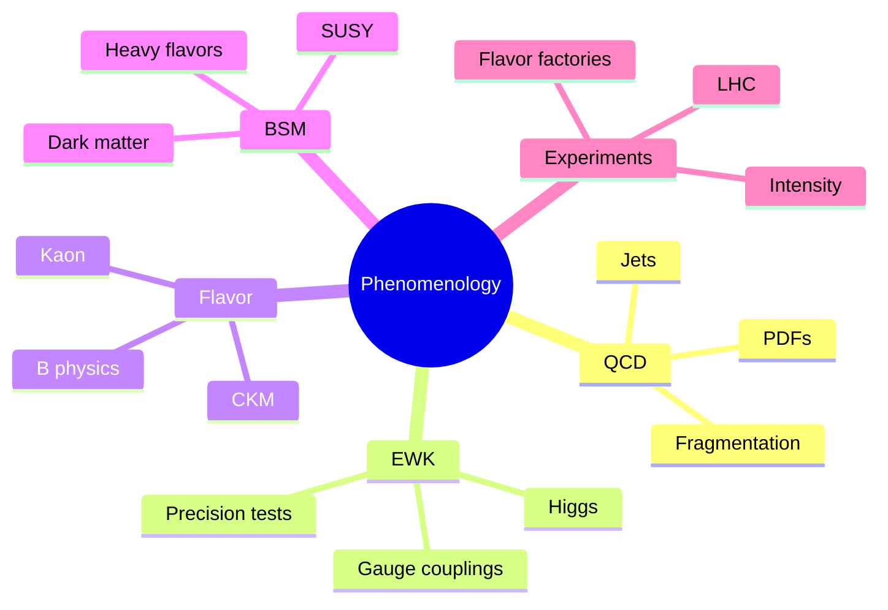
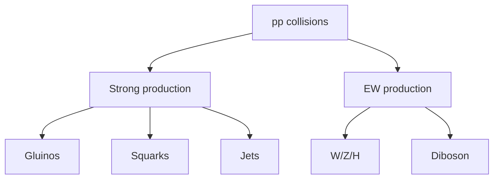
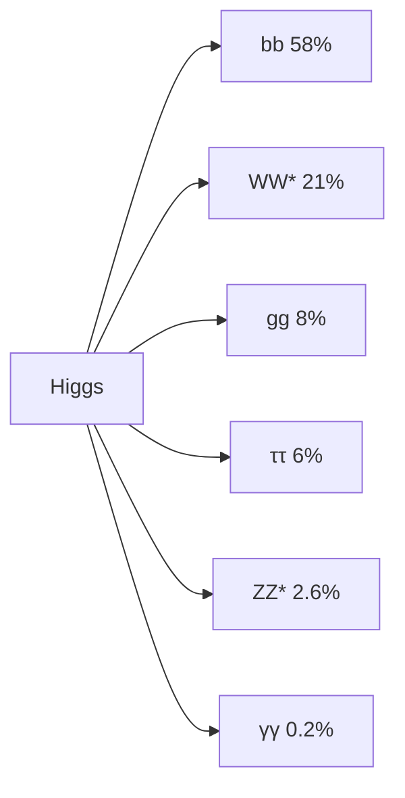
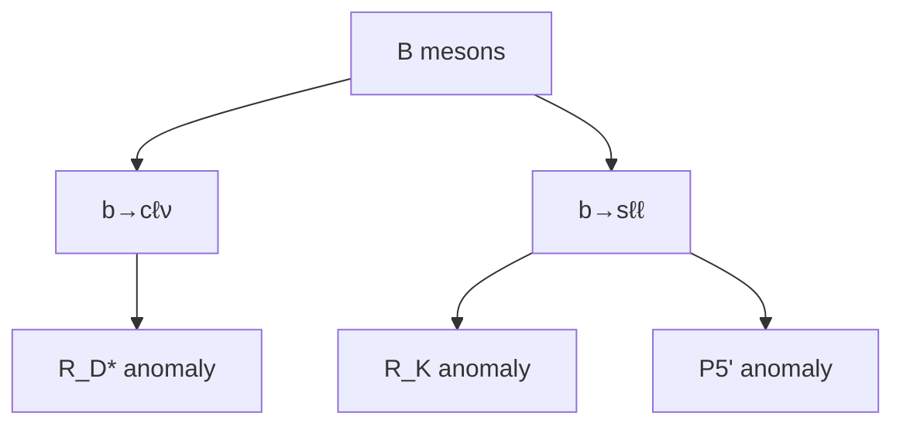
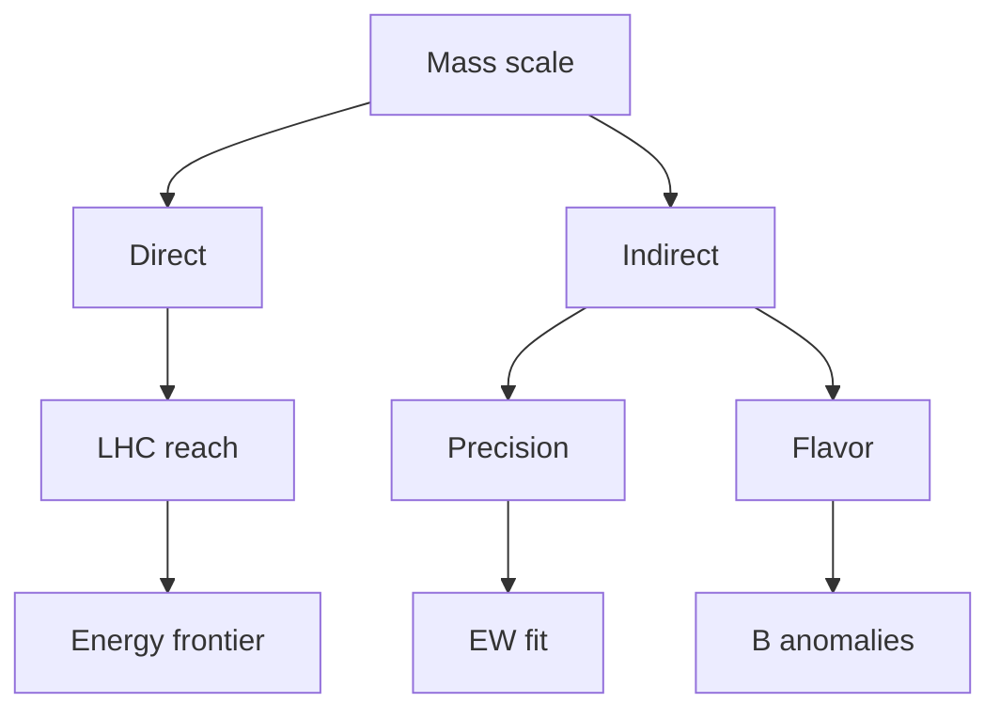

# MSPY 6610 — Particle Physics Phenomenology
> **MSc Physics Elective | HKUST MSPY 6610 | Standard Model phenomenology, Higgs physics, beyond Standard Model probes**  
> **Bilingual 深度自學檔案 · 中英對照**

---

## 問題 1：5 個核心心智模型

1. **Cross sections encode physics** — 截面編碼物理 (differential distributions reveal dynamics)
2. **Parton distribution functions are non-perturbative** — 部分子分佈函數是非微擾的 (must be measured, not calculated)
3. **Experimental cuts define search space** — 實驗 cuts 定義搜索空間 (optimization is key)
4. **Background rejection is essential** — 本底 rejection 是關鍵 (signal/background ratio determines sensitivity)
5. **Precision is as important as energy** — 精度和能量同樣重要 (electroweak precision tests)

## 問題 2：3 個根本分歧

1. **Energy frontier vs intensity frontier**
   - Energy: direct production of new particles (LHC, FCC)
   - Intensity: rare processes, precision (flavor factories)

2. **Simplest model vs naturalness**
   - Simplest: SM works to current precision
   - Naturalness: why is Higgs so light? Expect new physics at TeV

3. **SUSY vs alternatives**
   - SUSY: solves hierarchy problem, dark matter candidates
   - Alternatives: composite Higgs, extra dimensions, little Higgs

## 問題 3：10 個深度問題

1. 給定 parton luminosity $\frac{d\mathcal{L}}{d\tau} = \frac{1}{s}\int_\tau^1 \frac{dx}{x}f_a(x,Q^2)f_b(\tau/x,Q^2)$, calculate cross section。
2. 解釋為什麼 PDF uncertainties increase at high $x$ and low $Q^2$。
3. 為什麼 Higgs production at LHC dominated by gluon fusion?
4. 給定 Drell-Yan process $pp \to \ell^+\ell^-$, 計算 $K$ factor。
5. 解釋 jet reconstruction algorithms: anti-$k_T$, C/A, $k_T$。
6. 為什麼 $H \to ZZ^* \to 4\ell$ is golden channel?
7. 給定 $R_\gamma = \sigma(pp \to H + X)\times BR(H \to \gamma\gamma)$, extract Higgs coupling。
8. 為什麼 electroweak precision tests constrain new physics?
9. 給定 muon anomalous magnetic moment $g-2$, 計算 deviation from SM prediction。
10. 解釋 B-physics anomalies: $R_K$, $R_{D^*}$, $P_5'$.

## 深入 1：Parton Model & PDFs
**Deep Dive I**

### Parton Model
Inelastic scattering at high $Q^2$ as incoherent scattering from point-like constituents.

Kinematics:
$$x = \frac{Q^2}{2p\cdot q}, \quad y = \frac{p\cdot q}{p\cdot k}, \quad s = (p+k)^2$$

Bjorken-$x$: fraction of nucleon momentum carried by parton.

### Parton Distribution Functions
$f_i(x, Q^2)$: probability density for parton $i$ carrying momentum fraction $x$ at scale $Q$.

DGLAP evolution:
$$\frac{d}{d\ln Q^2}f_i(x,Q^2) = \frac{\alpha_s}{2\pi}\sum_j P_{ij}(x)\otimes f_j(x,Q^2)$$

Splitting functions:
$$P_{qq}(x) = \frac{4}{3}\left[\frac{1+x^2}{(1-x)_+} + \frac{3}{2}\delta(1-x)\right]$$

### PDF Fitting
HERA combined data: $ep$ collisions at DESY.

Global fits: CT18, NNPDF4.0, MSHT20.

Uncertainty: Hessian vs Monte Carlo methods.

**Engineering implication:** PDFs from global fits enable precision predictions

## 深入 2：Higgs Phenomenology
**Deep Dive II**

### Higgs Production at LHC
| Channel | Cross section (fb) at 13 TeV |
|---|---|
| Gluon fusion (ggH) | 48,700 |
| Vector boson fusion (VBF) | 3,760 |
| WH | 2,510 |
| ZH | 870 |
| ttH | 510 |

ggH via top loop: $K$ factor ~ 2.

### Higgs Decays
| Channel | BR | Significance |
|---|---|---|
| $H \to \gamma\gamma$ | $0.23\%$ | $7\sigma$ |
| $H \to ZZ^* \to 4\ell$ | $0.012\%$ | $6\sigma$ |
| $H \to WW^* \to \ell\nu\ell\nu$ | $21\%$ | $5\sigma$ |
| $H \to \tau\tau$ | $6\%$ | $5\sigma$ |
| $H \to bb$ | $58\%$ | $3\sigma$ |

### Coupling Measurements
Coupling modifier $\kappa$:
$$\sigma \cdot BR = \frac{\kappa^2}{(\kappa_S)^2}\sigma_{SM} \cdot BR_{SM}$$

Higgs coupling to fermions: $\kappa_F = m_F/v$

Higgs coupling to bosons: $\kappa_V = 2m_V^2/v$

Current: $\kappa \approx 1$ at $5\%$ level.

**Engineering implication:** Higgs discovered 2012, precision era begins

## 深入 3：Searches for New Physics
**Deep Dive III**

### SUSY Searches
Supersymmetric partners:
- Squarks $\tilde{q}$, gluinos $\tilde{g}$ (strong production)
- Charginos $\tilde{\chi}^\pm$, neutralinos $\tilde{\chi}^0$ (EW production)

Missing transverse energy $E_T^{miss}$ signature from LSP.

Current limits: $m_{\tilde{g}} > 2$ TeV, $m_{\tilde{q}} > 1.8$ TeV

No evidence yet → naturalness tension increases.

### Dark Matter Searches
WIMP miracle: thermal freeze-out gives correct relic density.

Direct detection: Xenon, PandaX, LUX.
Indirect detection: IceCube, Fermi-LAT, AMS-02.

Current limits: $\sigma_{SI} < 10^{-46}$ cm$^2$ for $m_\chi \sim 100$ GeV.

### Heavy Resonances
$D$-parity even: $Z'$, graviton $G^*$

$D$-parity odd: $W_{R}$ (LR model)

Current limits: $M_{Z'} > 4.5$ TeV (CMS dijet)

**Engineering implication:** LHC searches for BSM physics most constraining

## 深入 4：Heavy Flavor Physics
**Deep Dive IV**

### B-Meson Decays
Tree-level $b \to c\ell\nu$ transitions.

$R_{D^*} = \frac{BR(B \to D^*\tau\nu)}{BR(B \to D^*\ell\nu)}$

SM prediction: $0.298 \pm 0.004$

Experimental: $0.339 \pm 0.026 \pm 0.014$ (Belle II)

$3.1\sigma$ tension with SM.

### $B \to K^*\mu^+\mu^-$
Angular analysis: $P_5'$ observable sensitive to new physics.

LHCb: $4-6$ GeV$^2$ tension at $3\sigma$ level.

Possible new physics in $C_9$ Wilson coefficient.

### CKM Matrix
Unitarity triangle:
$$\sum_{d'} V_{ud}^*V_{ub'} + \sum_{s'} V_{cs}^*V_{cb'} = 0$$

Current status: all measurements consistent with SM, no CP violation beyond SM.

**Engineering implication:** Flavor anomalies hint at BSM physics

## 深入 5：Precision Tests
**Deep Dive V**

### Electroweak Fit
LEP + SLD precision data:
- $M_Z = 91.1876 \pm 0.0021$ GeV
- $\sin^2\theta_W = 0.23122 \pm 0.00003$

Oblique parameters:
$$S = \frac{1}{\pi}(Q_W - Q_Y), \quad T = \frac{\rho - 1}{\alpha}$$

Current: $S = 0.05 \pm 0.09$, $T = 0.09 \pm 0.13$

Consistent with SM; constrains new physics.

### Muon $g-2$
Anomalous magnetic moment:
$$a_\mu = \frac{g-2}{2}$$

SM prediction: $a_\mu^{SM} = 0.00116591810 \pm 0.00000000053$

Experimental: $a_\mu^{exp} = 0.00116592061 \pm 0.00000000041$

Deviation: $\Delta a_\mu = (2.51 \pm 0.59) \times 10^{-3}$

$4.2\sigma$ tension → hints of new physics?

**Engineering implication:** Precision tests probe energies beyond direct reach

## 自測 1：Parton Luminosity
**Answer:** $\sigma = \int dx_1 dx_2 f_a(x_1)f_b(x_2)\hat{\sigma}(\hat{s})\delta(\hat{s} - x_1x_2s)$.  
**Engineering implication:** Gluon luminosity dominates at LHC

## 自測 2：PDF Uncertainties
**Answer:** High $x$: few data points extrapolate; low $Q^2$: non-perturbative.  
**Engineering implication:** Affects heavy particle production predictions

## 自測 3：Higgs Production
**Answer:** Top quark loop dominates; $\sigma \sim \alpha_s^2 m_t^2/m_H^2$; gluon fusion 100x larger than other channels.  
**Engineering implication:**ggH is main discovery channel

## 自測 4：Drell-Yan K Factor
**Answer:** $K = \sigma_{NLO}/\sigma_{LO} \approx 1.2-1.3$ from QCD corrections.  
**Engineering implication:** Must include for precision measurements

## 自測 5：Jet Algorithms
**Answer:** anti-$k_T$: IRC safe, cone-like; $k_T$: progressive removal; C/A: sensitive to soft radiation.  
**Engineering implication:** Jet definition affects experimental results

## 自測 6：Golden Channel
**Answer:** $H \to ZZ^* \to 4\ell$: clean lepton final state, good $S/B$, full reconstruction.  
**Engineering implication:** Best for Higgs mass measurement

## 自測 7：Coupling Extraction
**Answer:** $\sigma \cdot BR \propto \kappa^2$; measure each channel, combine to extract $\kappa_i$.  
**Engineering implication:** Couplings measured to 5-10% precision

## 自測 8：EW Precision
**Answer:** Oblique parameters $S, T$ sensitive to new physics; current data constrains $\Lambda > 10$ TeV.  
**Engineering implication:** Complementary to direct searches

## 自測 9：$g-2$ Deviation
**Answer:** $\Delta a_\mu = 2.5 \times 10^{-9}$ can be explained by SUSY with $m_{\tilde{\mu}} \sim 500$ GeV.  
**Engineering implication:** Could be first hint of BSM

## 自測 10：B Anomalies
**Answer:** $R_K$, $R_{D^*}$, $P_5'$ all hint at $b \to s\mu^+\mu^-$ new physics in $C_9$ sector.  
**Engineering implication:** Global fit prefers new physics interpretation

## 📊 Diagram 1: Particle Phenomenology Map

## 📊 Diagram 2: LHC Processes

## 📊 Diagram 3: Higgs Decay Channels

## 📊 Diagram 4: Flavor Anomalies

## 📊 Diagram 5: BSM Sensitivity

## 深度總結 Deep Insights

1. **Cross sections measure couplings** — differential distributions reveal interactions
   **截面測量耦合** — 微分分佈揭示相互作用

2. **Background is as important as signal** — discovery requires understanding suppression
   **本底與信號同樣重要** — 發現需要理解抑制

3. **Precision tests probe high scales** — indirect sensitivity complements direct searches
   **精度測試探測高尺度** — 間接靈敏度補充直接搜索

4. **Anomalies drive the field** — hints of BSM guide future experiments
   **異常推動領域** — BSM提示指導未來實驗

5. **Systematics dominate statistics** — in precision era, reducing systematics is key
   **系統論主導統計** — 精度時代，減少系統論是關鍵

---

**自學建議**
- 必讀: Halzen & Martin "Quarks and Leptons", PDB Review
- 配對: Buttiker TASI lectures, Baer & Tata "Weak Scale Supersymmetry"
- 工具: MadGraph, Pythia, Rivet, CheckMATE
- 產出: Calculate Higgs production cross section at NLO
