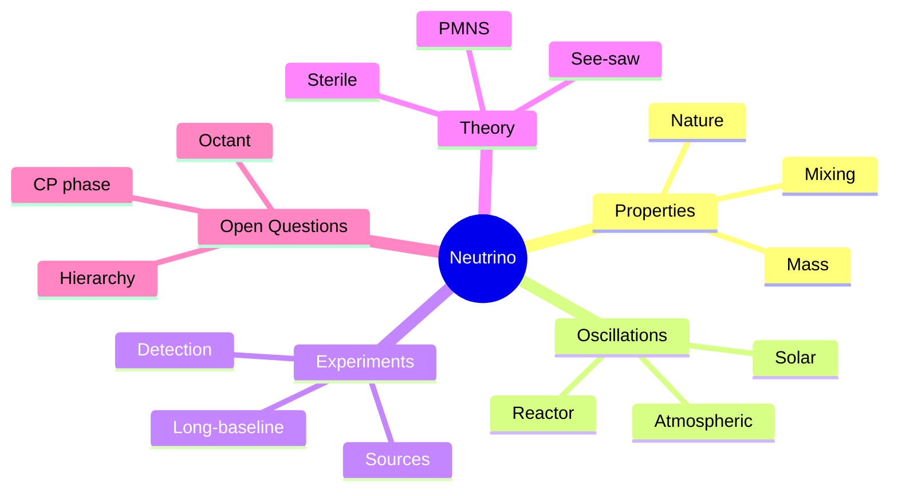
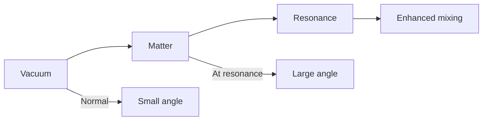
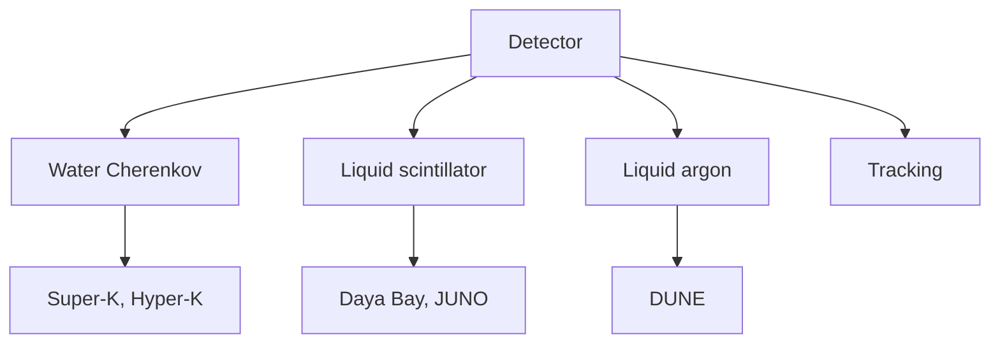
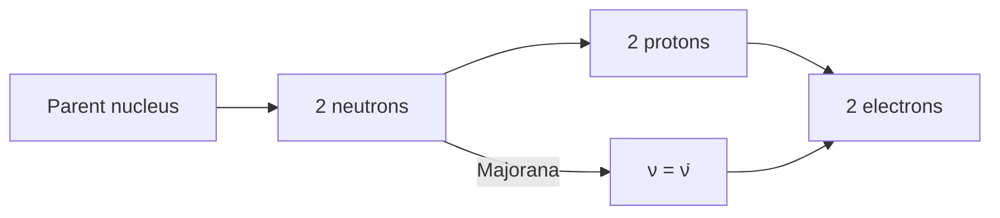

# MSPY 6710 — Neutrino Physics
> **MSc Physics Elective | HKUST MSPY 6710 | Neutrino masses, mixing, oscillations, experiments**  
> **Bilingual 深度自學檔案 · 中英對照**

---

## 問題 1：5 個核心心智模型

1. **Neutrinos are unique** — 中微子是獨特的 (only weakly interacting, light, possibly Majorana)
2. **Mass generates mixing** — 質量產生混合 (PMNS matrix connects flavor to mass eigenstates)
3. **Oscillations are quantum interference** — 振盪是量子干涉 (flavor change over distance)
4. **Mixing angles are not small** — 混合角不小 (unlike CKM, $\theta_{12}, \theta_{23}$ large)
5. **Hierarchy is unknown** — 層次結構未知 (NH vs IH, octant of $\theta_{23}$)

## 問題 2：3 個根本分歧

1. **Mass ordering: normal vs inverted**
   - Normal: $m_1 < m_2 < m_3$ (lightest sterile?)
   - Inverted: $m_3 < m_1 < m_2$ (heavier at low energy)
   - Matters for DUNE, Hyper-K, JUNO

2. **Dirac vs Majorana nature**
   - Dirac: distinct particle/anti-particle, $U(1)_{L}$ conserved
   - Majorana: particle = antiparticle, lepton number violated
   - $0\nu\beta\beta$ experiments test Majorana

3. **Sterile neutrinos: yes or no?**
   - LSND, MiniBooNE hints of sterile
   - No confirmed evidence, all anomalies fading
   - cosmology constraints on $N_{eff}$

## 問題 3：10 個深度問題

1. 給定 neutrino production via weak interaction, 證明只有 left-handed neutrinos couple。
2. 解釋為什麼 standard model neutrinos are massless before Higgs mechanism。
3. 為什麼 neutrino mixing differs from quark mixing (large angles)?
4. 給定 2-flavor oscillation $P(\nu_\alpha \to \nu_\beta) = \sin^2(2\theta)\sin^2(\Delta m^2 L/4E)$, derive for vacuum。
5. 為什麼 matter effects change oscillation (MSW effect)?
6. 給定 solar neutrino problem, 點樣 SNO experiment solved it。
7. 解釋 atmospheric neutrino deficit via $\nu_\mu \to \nu_\tau$ oscillation。
8. 為什麼 reactor neutrinos have flux anomalies (gallium, LSND, Daya Bay)?
9. 給定 $0\nu\beta\beta$ rate, extract Majorana mass bound $m_{\beta\beta} < 0.1$ eV。
10. 為什麼 cosmology constrains sum of neutrino masses $\sum m_\nu < 0.1-1$ eV?

## 深入 1：Neutrino Basics
**Deep Dive I**

### Discovery & Properties
Fermi's theory (1934): proposed to explain $\beta$ decay spectrum.

Pauli's neutrino hypothesis (1930): neutral, weakly interacting particle.

Cowan & Reines (1956): first detection via inverse $\beta$ decay:
$$\bar{\nu}_e + p \to n + e^+$$

Current bounds:
| Property | Bound | Source |
|---|---|---|
| Mass $m_{\nu_1}$ | $< 1.1$ eV | KATRIN |
| Magnetic moment | $< 10^{-12}\mu_B$ | Solar |
| Charge | $< 10^{-20}e$ | White dwarf |
| Lifetime | $> 10^{10}$ yr | Astrophysics |

### Weak Interactions
Only left-handed neutrinos couple:
$$P_L = \frac{1 - \gamma^5}{2}$$

Charged current interaction:
$$\mathcal{L}_{CC} = \frac{g}{\sqrt{2}}W_\mu \bar{\nu}_e\gamma^\mu P_L e + \text{h.c.}$$

Neutral current: $\nu$ scatters off all matter.

### Three Flavors
$$\nu_e, \nu_\mu, \nu_\tau$$

Associated leptons: $e, \mu, \tau$

Pdg review: $m_{\nu_e} < 2$ eV, $m_{\nu_\mu} < 0.2$ MeV, $m_{\nu_\tau} < 18.2$ MeV

**Engineering implication:** Neutrinos are lightest fermions, probe new physics

## 深入 2：Mass Generation & Mixing
**Deep Dive II**

### Standard Model Limitation
Before EWSB: neutrinos massless
After EWSB: still massless (no right-handed neutrino in SM)

Mass terms possible:
- Dirac: $m_D\bar{\nu}_L \nu_R + h.c.$ requires $\nu_R$
- Majorana: $m_M \nu_L^T C^{-1}\nu_L + h.c.$ violates $L$

### See-saw Mechanism
Type I see-saw:
$$m_\nu \sim \frac{m_D^2}{M_R}$$

With $m_D \sim v \sim 100$ GeV, $M_R \sim 10^{15}$ GeV:
$$m_\nu \sim \frac{(100)^2}{10^{15}} \sim 10^{-2} \text{ eV}$$

Other types: Type II ($\Delta_L$), Type III ($\Sigma$)

### PMNS Matrix
Flavor $\leftrightarrow$ mass connection:
$$\nu_\alpha = \sum_j U_{\alpha j}\nu_j, \quad \alpha = e, \mu, \tau$$

PMNS parametrization:
$$U = \begin{pmatrix} c_{12}c_{13} & s_{12}c_{13} & s_{13}e^{-i\delta} \\ -s_{12}c_{23} - c_{12}s_{23}s_{13}e^{i\delta} & c_{12}c_{23} - s_{12}s_{23}s_{13}e^{i\delta} & s_{23}c_{13} \\ s_{12}s_{23} - c_{12}c_{23}s_{13}e^{i\delta} & -c_{12}s_{23} - s_{12}c_{23}s_{13}e^{i\delta} & c_{12}c_{23} \end{pmatrix}$$

Current values:
- $\sin^2\theta_{12} \approx 0.31$
- $\sin^2\theta_{23} \approx 0.53$ (octant unknown)
- $\sin^2\theta_{13} \approx 0.022$
- $\delta \approx 3\pi/2$ (CP-violating)

**Engineering implication:** PMNS matrix reveals neutrino sector structure

## 深入 3：Oscillations
**Deep Dive III**

### Two-Flavor Derivation
Start with $\nu_e, \nu_3$ basis:
$$|\nu(t)\rangle = c_1 e^{-iE_1 t}|v_1\rangle + c_2 e^{-iE_2 t}|v_2\rangle$$

Probability:
$$P(\nu_e \to \nu_e) = 1 - \sin^2(2\theta)\sin^2\left(\frac{\Delta m^2 L}{4E}\right)$$

Where $\Delta m^2 = m_2^2 - m_1^2$, $L$ = baseline, $E$ = energy.

### Oscillation Length
$$\lambda_{osc} = \frac{4\pi E}{\Delta m^2} \approx 2.5\text{ km} \times \frac{E[\text{GeV}]}{\Delta m^2[\text{eV}^2]}$$

Matter oscillation length different.

### Three-Flavor Framework
Survival probability (approx):
$$P(\nu_e \to \nu_e) \approx 1 - \sin^2(2\theta_{12})\cos^4\theta_{13}\sin^2(\Delta m_{21}^2 L/4E) - \sin^2(2\theta_{13})\sin^2\theta_{12}\sin^2(\Delta m_{31}^2 L/4E)$$

Appearance: $P(\nu_\mu \to \nu_\tau) \approx \sin^2(2\theta_{23})\cos^2\theta_{13}\sin^2(\Delta m_{31}^2 L/4E)$

### MSW Effect
In matter, effective potential:
$$V_e = \sqrt{2}G_F n_e$$

Modified mass splitting:
$$\Delta m^2_{ee} = \Delta m^2 \cos(\theta_{12} \mp \theta_m)$$

Neutrino: enhanced mixing, adiabatic conversion
Antineutrino: suppressed mixing

**Engineering implication:** Oscillation experiments determine all mixing parameters

## 深入 4：Experimental Probes
**Deep Dive IV**

### Solar Neutrinos
pp chain produces $\nu_e$ only.

Davis (1960s): 40% of predicted flux detected → Solar neutrino problem.

SNO (2001): Combined NC + CC + ES measurements:
- CC: $\Phi_{CC} = 1.67 \pm 0.05$ (only $\nu_e$)
- NC: $\Phi_{NC} = 4.92 \pm 0.08$ ($\nu_e + \nu_\mu + \nu_\tau$)
- $\Phi_{CC}/\Phi_{NC} < 1$: flavor conversion confirmed!

Solution: $\nu_e \to \nu_\mu, \nu_\tau$ oscillations + MSW effect.

### Atmospheric Neutrinos
Super-K (1998): Up-down asymmetry in $\mu$-like events:
$$A = \frac{U - D}{U + D} \approx -0.65\sin^2\theta_{23}(1 - \sin^2\theta_{23}\cos^4\theta_{13})$$

Best fit: $\Delta m_{31}^2 \approx 2.4 \times 10^{-3}$ eV$^2$, $\sin^2\theta_{23} \approx 0.5$

### Reactor Neutrinos
Daya Bay (2012): Discovered $\theta_{13} \neq 0$:
$$\sin^2(2\theta_{13}) = 0.092 \pm 0.016$$

RENO, Double Chooz confirmed.

JUNO (2025+): Will measure mass ordering via $\sim 1\%$ energy resolution.

**Engineering implication:** Multi-channel experiments cross-validate oscillation physics

## 深入 5：Future Directions
**Deep Dive V**

### Mass Ordering Experiments
DUNE (2027+): Liquid argon TPC, 1300 km baseline
- Sensitivity: $5\sigma$ for NH vs IH
- Matter effects enhance sensitivity

Hyper-K (2027+): Water Cherenkov, 295 km baseline
- Complementary to DUNE
- Atmospheric neutrinos help

JUNO (2025+): Reactor, 53 km baseline
- Oscillation dip measurement
- High precision $\Delta m_{21}^2$, $\Delta m_{31}^2$

### Neutrinoless Double Beta Decay
$$(A,Z) \to (A,Z+2) + 2e^-$$

Half-life:
$$T_{1/2}^{0\nu} = \frac{1}{G^{0\nu}|M^{0\nu}|^2 m_{\beta\beta}^2}$$

Effective Majorana mass:
$$m_{\beta\beta} = |\sum_j U_{ej}^2 m_j| < 0.1 \text{ eV (current limit)}$$

Experiments: GERDA, Majorana Demonstrator, LEGEND, nEXO

### Sterile Neutrino Searches
Anomalies: Gallium (GALLEX, SAGE), LSND, MiniBooNE

All anomalies can fit $\Delta m^2 \sim 1$ eV$^2$

Global fit prefers sterile-free, but some tension remains.

**Engineering implication:** Next-generation experiments will determine neutrino sector completely

## 自測 1：Left-Handed Coupling
**Answer:** Weak interaction violates parity maximally: $P_L = (1-\gamma^5)/2$ projects left-handed component only.  
**Engineering implication:** Only $\nu_L$ couples in SM

## 自測 2：Massless SM Neutrinos
**Answer:** No right-handed neutrino in SM; Dirac mass requires $\nu_R$; Majorana mass violates $SU(2)_L$.  
**Engineering implication:** New physics required for neutrino mass

## 自測 3：Large Mixing Angles
**Answer:** Quark mixing small due to hierarchy; neutrino mixing large, possibly due to different mass generation (see-saw).  
**Engineering implication:** Lepton sector differs fundamentally from quark sector

## 自測 4：Vacuum Oscillation
**Answer:** $P(\nu_\alpha \to \nu_\beta) = \sin^2(2\theta)\sin^2(\Delta m^2 L/4E)$, oscillation wavelength $\lambda = 4\pi E/\Delta m^2$.  
**Engineering implication:** Long-baseline experiments probe small $\Delta m^2$

## 自測 5：MSW Effect
**Answer:** Matter potential $V = \sqrt{2}G_F n_e$ changes effective mixing angle; resonance when $V = \Delta m^2\cos(2\theta)/2E$.  
**Engineering implication:** Solar neutrinos converted adiabatically

## 自測 6：SNO Solution
**Answer:** SNO measured NC (all flavors) and CC (only $\nu_e$); CC/NC < 1 proved flavor conversion.  
**Engineering implication:** Solar neutrino problem solved by oscillations

## 自測 7：Atmospheric Deficit
**Answer:** $\nu_\mu$ deficit in up-going events explained by $\nu_\mu \to \nu_\tau$ with $\Delta m_{31}^2 \approx 2.4 \times 10^{-3}$ eV$^2$.  
**Engineering implication:** Atmospheric neutrinos gave first evidence for $L/E$ dependence

## 自測 8：Reactor Anomalies
**Answer:** Gallium calibration deficit, LSND/MiniBooNE hints; Daya Bay measured $\theta_{13}$, explaining some anomalies.  
**Engineering implication:** Multiple anomalies motivate sterile neutrino searches

## 自測 9：$0\nu\beta\beta$ Mass
**Answer:** $T_{1/2} = (G|M|^2 m_{\beta\beta}^2)^{-1}$, current limit $m_{\beta\beta} < 0.1$ eV.  
**Engineering implication:** Probes nature (Dirac/Majorana) of neutrino mass

## 自測 10：Cosmology Bound
**Answer:** CMB+LSS constrain $\sum m_\nu < 0.1-1$ eV (model dependent).  
**Engineering implication:** Cosmology provides strongest bound on neutrino mass scale

## 📊 Diagram 1: Neutrino Physics Map


## 📊 Diagram 2: Oscillation Pattern
```mermaid
graph TD
    A[Neutrino source] --> B[Production]
    B --> C[Propagation L]
    C --> D[Energy E]
    D --> E[Probability]
    E --> F[Flavor]
    C -.->|Oscillation| G[P(L/E)]
```

## 📊 Diagram 3: MSW Effect


## 📊 Diagram 4: Detector Types


## 📊 Diagram 5: $0\nu\beta\beta$


## 深度總結 Deep Insights

1. **Neutrinos reveal new physics** — mass requires beyond-SM mechanism
   **中微子揭示新物理** — 質量需要超出SM的機制

2. **Oscillations are quantum interferometry** — macroscopic manifestation of quantum coherence
   **振盪是量子干涉** — 量子相干性的宏觀表現

3. **Mixing is large** — opposite of quark sector, nature of lepton mass different
   **混合角大** — 與夸克部門相反

4. **Hierarchy matters for experiments** — determines sensitivity of future detectors
   **層次結構影響實驗** — 決定未來探測器的靈敏度

5. **Majorana nature is fundamental** — $0\nu\beta\beta$ tests most profound question
   **馬約拉納本性是根本的** — $0\nu\beta\beta$ 測試最深刻的問題

---

**自學建議**
- 必讀: Giunti & Kim "Fundamentals of Neutrino Physics", Bahcall "Neutrino Astrophysics"
- 配對: Particle Data Group neutrino review, K. M. Kelly PhD thesis
- 工具: GLoBES (simulation), nuance (event rates)
- 產出: Calculate oscillation probabilities for DUNE baseline
