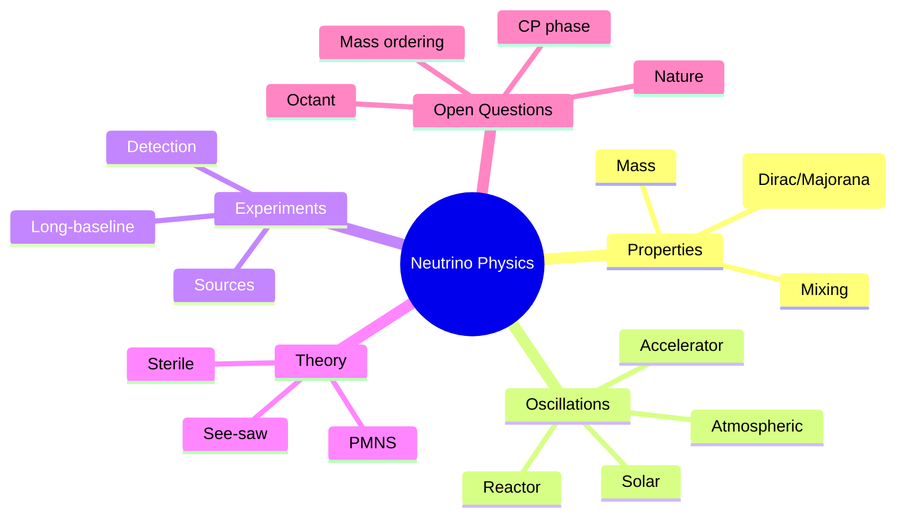
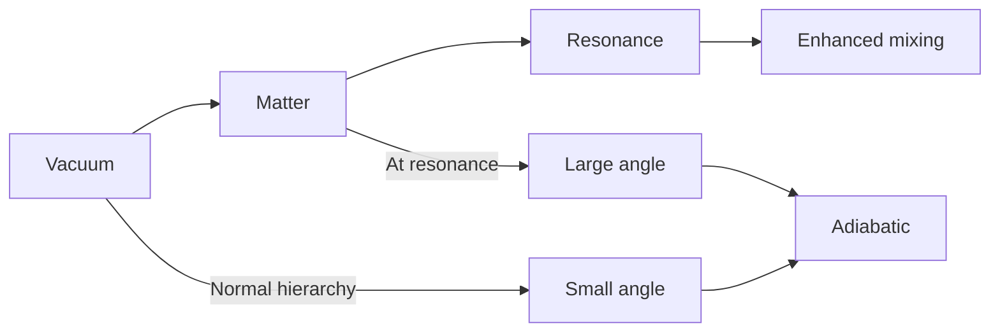
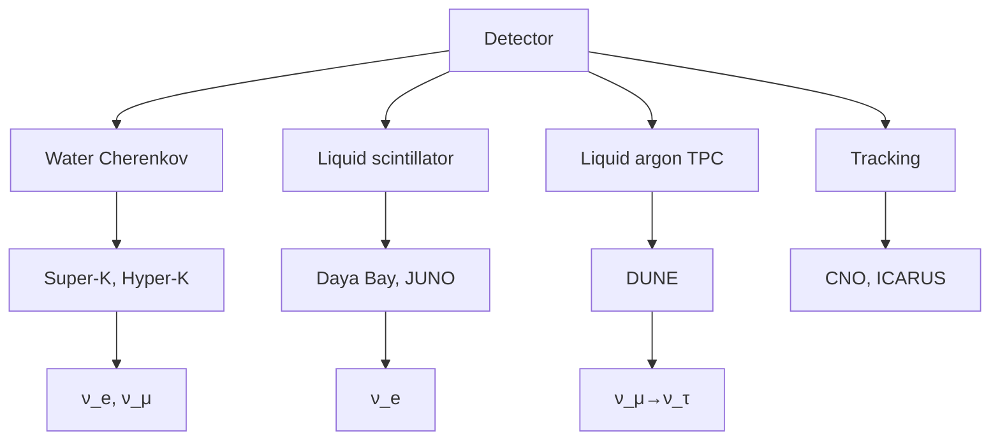
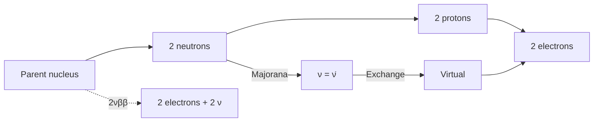

# MSPY 6710 — Neutrino Physics
> **MSc Physics Elective | HKUST MSPY 6710 | Neutrino masses, mixing, oscillations, experiments, beyond Standard Model**  
> **Bilingual 深度自學檔案 · 中英對照**

---

## 問題 1：5 個核心心智模型

1. **Neutrinos are unique** — 中微子是獨特的
   - Only weakly interacting (cross section $\sigma \sim 10^{-43}$ cm² at GeV)
   - Extremely light: $m_\nu < 1$ eV (vs MeV for charged leptons)
   - Possibly Majorana (particle = antiparticle)

2. **Mass generates mixing** — 質量產生混合
   - PMNS matrix connects flavor to mass eigenstates
   - $U_{PMNS} = U_{CKM}$-like but with large angles
   - Three mixing angles measured, one phase unknown

3. **Oscillations are quantum interference** — 振盪是量子干涉
   - Flavor change over distance $L$
   - Wavelength: $\lambda_{osc} = \frac{4\pi E}{\Delta m^2} \approx 2.5\text{ km} \times \frac{E[\text{GeV}]}{\Delta m^2[\text{eV}^2]}$
   - $L/E$ determines sensitivity

4. **Mixing angles are unexpectedly large** — 混合角意外地大
   - $\theta_{12} \approx 33°$, $\theta_{23} \approx 42-49°$, $\theta_{13} \approx 8.7°$
   - Unlike CKM (hierarchical, small angles)
   - Origin of mixing pattern is mystery

5. **Hierarchy and nature are unknown** — 層次結構和本性未知
   - Normal (NH): $m_1 < m_2 < m_3$ or Inverted (IH): $m_3 < m_1 < m_2$
   - Dirac vs Majorana (seesaw mechanism)
   - Sterile neutrinos? Cosmology constraints

---

## 問題 2：3 個根本分歧

### 分歧 1：Mass Ordering: Normal vs Inverted
| Ordering | Mass Spectrum | Experiments |
|----------|--------------|-------------|
| Normal (NH) | $m_1 < m_2 < m_3$, $m_3 \approx \sqrt{\Delta m_{31}^2}$ | DUNE sensitive |
| Inverted (IH) | $m_3 < m_1 \approx m_2$, $m_{1,2} \approx \sqrt{\Delta m_{31}^2}$ | Hyper-K sensitive |

**Matter effect:** Different enhancement/suppression in Earth matter

### 分歧 2：Dirac vs Majorana Nature
| Nature | Implication | Test |
|--------|-------------|------|
| Dirac | Distinct particle/anti-particle, $U(1)_L$ conserved | $0\nu\beta\beta$ rate = 0 |
| Majorana | Particle = antiparticle, lepton number violated | $0\nu\beta\beta$ rate ∝ $m_{\beta\beta}$ |

**Evidence:** $0\nu\beta\beta$ experiments: current limit $m_{\beta\beta} < 0.1$ eV

### 分歧 3：Sterile Neutrinos
| Evidence | Status |
|----------|--------|
| LSND (1995): $\bar{\nu}_e$ appearance | Not confirmed |
| MiniBooNE (2021): $\nu_e$ appearance | Tension with other data |
| Gallium anomaly | Fading |
| Cosmology $N_{eff}$ | Consistent with 3 species |

**Conclusion:** No confirmed sterile; all anomalies fading

---

## 問題 3：10 個深度問題

1. **Left-Handed Coupling**: 給定 neutrino production via weak interaction, 證明只有 left-handed neutrinos couple
   - Weak interaction violates parity maximally: $P_L = (1-\gamma^5)/2$
   - Right-handed neutrino: singlet under $SU(2)_L$, no coupling
   - $\nu_R$ not in Standard Model

2. **Massless SM Neutrinos**: 解釋 standard model neutrinos are massless
   - No right-handed neutrino in SM
   - Dirac mass requires $\nu_R$ coupling to Higgs
   - Majorana mass violates $SU(2)_L$ (no triplet)
   - Neutrino mass requires BSM physics

3. **Large Mixing Angles**: 為什麼 neutrino mixing differs from quark mixing
   - CKM: hierarchical, small angles (from hierarchy)
   - PMNS: non-hierarchical, large angles (origin unknown)
   - Possible explanations:混沌, texture zeros, flavor symmetries

4. **Vacuum Oscillation**: 給定 2-flavor formula derive $P(\nu_\alpha \to \nu_\beta) = \sin^2(2\theta)\sin^2(\Delta m^2 L/4E)$
   - Start with $|\nu(t)⟩ = c_1 e^{-iE_1 t}|\nu_1⟩ + c_2 e^{-iE_2 t}|\nu_2⟩$
   - Transition probability: interference term
   - Result: $\sin^2(\Delta m^2 L/4E)$ oscillation

5. **MSW Effect**: 為什麼 matter effects change oscillation
   - Effective potential: $V_e = \sqrt{2}G_F n_e$ (charged current)
   - Modified mass splitting in matter
   - Resonance when $V_e = \Delta m^2\cos(2\theta)/2E$
   - Solar neutrinos: adiabatic conversion

6. **SNO Solution**: 給定 solar neutrino problem, 點樣 SNO solved it
   - SNO measured CC (only $\nu_e$) and NC (all flavors)
   - $\Phi_{CC}/\Phi_{NC} < 1$: flavor conversion
   - NC/CC combined: $\Phi_{total}$ matches solar model
   - Proved $\nu_e \to \nu_\mu, \nu_\tau$ oscillation

7. **Atmospheric Deficit**: 解釋 via $\nu_\mu \to \nu_\tau$ oscillation
   - Super-K (1998): up-down asymmetry
   - $L/E$ dependence confirmed
   - Best fit: $\Delta m_{31}^2 \approx 2.4 \times 10^{-3}$ eV²
   - $\theta_{23} \approx 45°$ (maximal mixing)

8. **Reactor Anomalies**: 為什麼 have gallium, LSND, Daya Bay hints
   - Gallium: calibration deficit (GALLEX, SAGE)
   - Reactor flux anomaly: 3% deficit
   - Daya Bay measured $\theta_{13} \neq 0$ (explains some)
   - Sterile fit: $\Delta m^2 \sim 1-10$ eV², not confirmed

9. **$0\nu\beta\beta$ Mass**: 給定 half-life formula, extract $m_{\beta\beta}$
   - $T_{1/2}^{0\nu} = (G^{0\nu}|M^{0\nu}|^2 m_{\beta\beta}^2)^{-1}$
   - $m_{\beta\beta} = |\sum_j U_{ej}^2 m_j|$
   - Current limit: $m_{\beta\beta} < 0.1-0.2$ eV
   - Future sensitivity: 10-20 meV

10. **Cosmology Bound**: 為什麼 cosmology constrains $\sum m_\nu < 0.1-1$ eV
    - CMB: $\Lambda$CDM + neutrino density
    - Structure formation: free-streaming suppresses growth
    - $N_{eff} = 3.046$ for 3 species
    - $\sum m_\nu < 0.12$ eV (Planck + lensing + BAO)

---

## 深入 1：Neutrino Basics & Discovery
**Deep Dive I**

### Discovery Timeline
| Year | Event | Significance |
|------|-------|--------------|
| 1930 | Pauli proposes neutrino | Explains $\beta$ spectrum |
| 1956 | Reines & Cowan detect $\bar{\nu}_e$ | First detection |
| 1962 | Lederman et al. detect $\nu_\mu$ | Second flavor |
| 1968 | Davis: solar neutrino deficit | New physics hint |
| 1998 | Super-K: atmospheric oscillation | First oscillation evidence |
| 2001 | SNO: solar neutrino solution | Confirmed oscillation |
| 2012 | Daya Bay: $\theta_{13} \neq 0$ | Third angle measured |

### Current Bounds
| Property | Bound | Source |
|----------|-------|--------|
| Mass $m_{\nu_1}$ | $< 1.1$ eV | KATRIN (2019) |
| Magnetic moment | $< 10^{-12}\mu_B$ | Solar |
| Charge | $< 10^{-20}e$ | White dwarf cooling |
| Lifetime | $> 10^{10}$ yr | Astrophysics |

### Weak Interactions
Only left-handed neutrinos couple (maximal parity violation):

$$P_L = \frac{1 - \gamma^5}{2}$$

Charged current interaction:
$$\mathcal{L}_{CC} = \frac{g}{\sqrt{2}}W_\mu \bar{\nu}_e\gamma^\mu P_L e + \text{h.c.}$$

Neutral current: $\nu$ couples to all matter equally.

### Three Flavors
$$\nu_e, \nu_\mu, \nu_\tau$$

Associated charged leptons: $e, \mu, \tau$

Mass limits: $m_{\nu_e} < 2$ eV, $m_{\nu_\mu} < 0.2$ MeV, $m_{\nu_\tau} < 18.2$ MeV

**Engineering implication:** Neutrinos are lightest fermions, probe new physics

---

## 深入 2：Mass Generation & Mixing
**Deep Dive II**

### Standard Model Limitation
Before EWSB: neutrinos massless
After EWSB: still massless (no right-handed neutrino in SM)

Mass terms possible:
- **Dirac**: $m_D\bar{\nu}_L \nu_R + h.c.$ requires $\nu_R$
- **Majorana**: $m_M \nu_L^T C^{-1}\nu_L + h.c.$ violates $L$

### See-saw Mechanism
**Type I see-saw:**
$$m_\nu \sim \frac{m_D^2}{M_R}$$

With $m_D \sim v \sim 100$ GeV, $M_R \sim 10^{15}$ GeV:
$$m_\nu \sim \frac{(100)^2}{10^{15}} \sim 10^{-2} \text{ eV}$$

**Other types:**
- Type II: SU(2)_L triplet $\Delta_L$
- Type III: SU(2)_L triplet $\Sigma$

### PMNS Matrix
Flavor $\leftrightarrow$ mass connection:
$$\nu_\alpha = \sum_j U_{\alpha j}\nu_j, \quad \alpha = e, \mu, \tau$$

PMNS parametrization (standard):
$$U = \begin{pmatrix} c_{12}c_{13} & s_{12}c_{13} & s_{13}e^{-i\delta} \\ -s_{12}c_{23} - c_{12}s_{23}s_{13}e^{i\delta} & c_{12}c_{23} - s_{12}s_{23}s_{13}e^{i\delta} & s_{23}c_{13} \\ s_{12}s_{23} - c_{12}c_{23}s_{13}e^{i\delta} & -c_{12}s_{23} - s_{12}c_{23}s_{13}e^{i\delta} & c_{23}c_{13} \end{pmatrix} \times \text{diag}(1, e^{i\alpha_1/2}, e^{i\alpha_2/2})$$

**Current best-fit values (2024):**
| Parameter | Best-fit | 1σ error |
|-----------|----------|----------|
| $\sin^2\theta_{12}$ | 0.310 | ±0.013 |
| $\sin^2\theta_{23}$ | 0.538 | ±0.015 |
| $\sin^2\theta_{13}$ | 0.0224 | ±0.0006 |
| $\delta$ | 1.68π | — |
| $\Delta m_{21}^2$ | $7.41 \times 10^{-5}$ eV² | ±0.001 |
| $\Delta m_{31}^2$ (NH) | $2.507 \times 10^{-3}$ eV² | ±0.001 |
| $\Delta m_{31}^2$ (IH) | $-2.498 \times 10^{-3}$ eV² | ±0.001 |

**Engineering implication:** PMNS matrix reveals neutrino sector structure

---

## 深入 3：Oscillations
**Deep Dive III**

### Two-Flavor Derivation
Start with $\nu_e, \nu_2$ basis:
$$|\nu(t)⟩ = c_1 e^{-iE_1 t}|\nu_1⟩ + c_2 e^{-iE_2 t}|\nu_2⟩$$

At $t=0$: $|\nu_e⟩ = c_1|\nu_1⟩ + c_2|\nu_2⟩$

Probability:
$$P(\nu_e \to \nu_e) = 1 - \sin^2(2\theta)\sin^2\left(\frac{\Delta m^2 L}{4E}\right)$$

Where $\Delta m^2 = m_2^2 - m_1^2$, $L$ = baseline, $E$ = energy.

### Oscillation Length
$$\lambda_{osc} = \frac{4\pi E}{\Delta m^2} \approx 2.5\text{ km} \times \frac{E[\text{GeV}]}{\Delta m^2[\text{eV}^2]}$$

Solar: $\Delta m^2_{21} \sim 10^{-5}$ eV², $E \sim$ MeV → $\lambda \sim 100$ km
Atmospheric: $\Delta m^2_{31} \sim 10^{-3}$ eV², $E \sim$ GeV → $\lambda \sim 1$ km

### Three-Flavor Framework
Full probability:
$$P(\nu_\alpha \to \nu_\beta) = \delta_{\alpha\beta} - 4\sum_{i>j}U_{\alpha i}U_{\beta i}U_{\alpha j}^*U_{\beta j}^*\sin^2(\Delta m_{ij}^2 L/4E)$$

Approximate for accelerator experiments:
$$P(\nu_\mu \to \nu_\tau) \approx \sin^2(2\theta_{23})\cos^2\theta_{13}\sin^2(\Delta m_{31}^2 L/4E)$$

### MSW Effect in Matter
In matter, effective potential from charged current:
$$V_e = \sqrt{2}G_F n_e$$

Modified mixing angle in matter:
$$\sin^2 2\theta_m = \frac{\sin^2 2\theta}{(1 - \frac{2\sqrt{2}G_F n_e E}{\Delta m^2}\cos 2\theta + (\frac{2\sqrt{2}G_F n_e E}{\Delta m^2})^2}$$

**Resonance condition:**
$$\frac{2\sqrt{2}G_F n_e E}{\Delta m^2} = \cos 2\theta$$

Neutrinos: enhanced mixing, adiabatic conversion
Antineutrinos: suppressed mixing

**Engineering implication:** Oscillation experiments determine all mixing parameters

---

## 深入 4：Experimental Probes
**Deep Dive IV**

### Solar Neutrinos
pp chain produces $\nu_e$ only (dominant flux):
- pp: 60%, Be-7: 10%, pep: 0.2%, B-8: 0.01%

**Davis (1960s-1990s):** Chlorine detector, 40% of predicted → solar neutrino problem

**SNO (2001):** 1 kton heavy water, three reactions:
- CC: $\nu_e + d \to p + p + e^-$ (only $\nu_e$)
- NC: $\nu_x + d \to p + n + \nu_x$ (all flavors)
- ES: $\nu_x + e^- \to \nu_x + e^-$ (all flavors, reduced)

Results:
- CC: $\Phi_{CC} = 1.67 \pm 0.05$ (units: $10^{10}$/cm²/s)
- NC: $\Phi_{NC} = 4.92 \pm 0.08$ (matches solar model)
- $\Phi_{CC}/\Phi_{NC} < 1$: flavor conversion confirmed!

**Solution:** $\nu_e \to \nu_\mu, \nu_\tau$ + MSW effect

### Atmospheric Neutrinos
Super-K (1998): Up-down asymmetry in $\mu$-like events:
$$A = \frac{U - D}{U + D} \approx -0.65$$

Best fit: $\Delta m_{31}^2 \approx 2.4 \times 10^{-3}$ eV², $\sin^2\theta_{23} \approx 0.5$

**Key:** $L/E$ dependence confirmed oscillation hypothesis

### Reactor Neutrinos
**Daya Bay (2012):** Discovered $\theta_{13} \neq 0$:
$$\sin^2(2\theta_{13}) = 0.092 \pm 0.016 \Rightarrow \sin^2\theta_{13} = 0.0224$$

**RENO, Double Chooz** confirmed.

**JUNO (2025):** 53 km baseline, 3% energy resolution
- Measure $\Delta m_{21}^2$, $\Delta m_{31}^2$ to <1%
- Determine mass ordering via oscillation dip

**Engineering implication:** Multi-channel experiments cross-validate oscillation physics

---

## 深入 5：Future & Open Questions
**Deep Dive V**

### Mass Ordering Experiments
**DUNE (2027+):** Liquid argon TPC, 1300 km baseline
- Matter effect enhances sensitivity
- Sensitivity: $5\sigma$ for NH vs IH
- Also: CP violation, $\delta$ measurement

**Hyper-K (2027+):** Water Cherenkov, 295 km baseline
- Complementary to DUNE
- Atmospheric neutrinos help
- Gadzooks design

**JUNO (2025+):** Reactor, 53 km baseline
- Oscillation dip measurement
- High precision $\Delta m_{21}^2$, $\Delta m_{31}^2$
- Also supernova neutrinos

### Neutrinoless Double Beta Decay
$$(A,Z) \to (A,Z+2) + 2e^-$$

Half-life formula:
$$T_{1/2}^{0\nu} = \frac{1}{G^{0\nu}|M^{0\nu}|^2 m_{\beta\beta}^2}$$

**Effective Majorana mass:**
$$m_{\beta\beta} = |\sum_j U_{ej}^2 m_j|$$

For NH: can be small ($< 1$ meV if $m_1 \to 0$)
For IH: typically $10-50$ meV

**Current limits:**
| Experiment | Isotope | Limit ($T_{1/2}$) |
|------------|---------|-------------------|
| GERDA | Ge-76 | $1.8 \times 10^{26}$ yr |
| KamLAND-Zen | Xe-136 | $2.3 \times 10^{26}$ yr |
| EXO | Xe-136 | $4.3 \times 10^{25}$ yr |

**Future sensitivity:** LEGEND-1000, nEXO, CUPID (10 meV goal)

### Sterile Neutrino Searches
**All anomalies fading:**
- LSND: contradicted by MiniBooNE (though recent tension)
- Gallium: consistent with standard oscillation
- Reactor: explained by improved flux calculations

**Cosmology constraints:**
- $\Delta N_{eff} < 0.2-0.5$ (model dependent)
- Consistent with 3 species

**Engineering implication:** Next-generation experiments will determine neutrino sector completely

---

## 自測 1：Left-Handed Coupling
**Answer:** Weak interaction violates parity maximally: $P_L = (1-\gamma^5)/2$ projects left-handed component. Right-handed neutrino is $SU(2)_L$ singlet, no coupling.

**Engineering implication:** Only $\nu_L$ couples in SM

---

## 自測 2：Massless SM Neutrinos
**Answer:** No right-handed neutrino in SM; Dirac mass requires $\nu_R$ coupling to Higgs; Majorana mass violates $SU(2)_L$.

**Engineering implication:** New physics required for neutrino mass

---

## 自測 3：Large Mixing Angles
**Answer:** Quark mixing small due to mass hierarchy; neutrino mixing large, possibly from different mass generation mechanism (see-saw, chaos).

**Engineering implication:** Lepton sector differs fundamentally from quark sector

---

## 自測 4：Vacuum Oscillation
**Answer:** $P(\nu_\alpha \to \nu_\beta) = \sin^2(2\theta)\sin^2(\Delta m^2 L/4E)$, oscillation wavelength $\lambda = 4\pi E/\Delta m^2$.

**Engineering implication:** Long-baseline experiments probe small $\Delta m^2$

---

## 自測 5：MSW Effect
**Answer:** Matter potential $V = \sqrt{2}G_F n_e$ changes effective mixing; resonance when $V = \Delta m^2\cos(2\theta)/2E$.

**Engineering implication:** Solar neutrinos converted adiabatically

---

## 自測 6：SNO Solution
**Answer:** SNO measured CC (only $\nu_e$) and NC (all flavors); CC/NC < 1 proved flavor conversion; NC matches solar model.

**Engineering implication:** Solar neutrino problem solved by oscillations + MSW

---

## 自測 7：Atmospheric Deficit
**Answer:** $\nu_\mu$ deficit in up-going events explained by $\nu_\mu \to \nu_\tau$ with $\Delta m_{31}^2 \approx 2.4 \times 10^{-3}$ eV².

**Engineering implication:** Atmospheric neutrinos gave first evidence for $L/E$ dependence

---

## 自測 8：Reactor Anomalies
**Answer:** Gallium calibration deficit, LSND/MiniBooNE hints; Daya Bay measured $\theta_{13}$, explaining some anomalies. No confirmed sterile.

**Engineering implication:** Multiple anomalies motivated sterile searches; none confirmed

---

## 自測 9：$0\nu\beta\beta$ Mass
**Answer:** $T_{1/2} = (G|M|^2 m_{\beta\beta}^2)^{-1}$, current limit $m_{\beta\beta} < 0.1-0.2$ eV.

**Engineering implication:** Probes nature (Dirac/Majorana) of neutrino mass

---

## 自測 10：Cosmology Bound
**Answer:** CMB+LSS constrain $\sum m_\nu < 0.1-1$ eV (model dependent). Free-streaming suppresses small-scale structure.

**Engineering implication:** Cosmology provides strongest bound on neutrino mass scale

---

## 📊 Diagram 1: Neutrino Physics Map


## 📊 Diagram 2: Oscillation Pattern
```mermaid
graph TD
    A[Neutrino source] --> B[Production]
    B --> C[Propagation L]
    C --> D[Energy E]
    D --> E[Probability]
    E --> F[Flavor]
    C -.->|Oscillation| G[P(L/E)]
    G --> H[sin²(Δm²L/4E)]
```

## 📊 Diagram 3: MSW Effect


## 📊 Diagram 4: Detector Types


## 📊 Diagram 5：$0\nu\beta\beta$


---

## 深度總結 Deep Insights

1. **Neutrinos reveal new physics** — mass requires beyond-SM mechanism
   **中微子揭示新物理** — 質量需要超出SM的機制
   - See-saw mechanism: $m_\nu \sim v^2/M_{GUT}$
   - Majorana vs Dirac

2. **Oscillations are quantum interferometry** — macroscopic manifestation of quantum coherence
   **振盪是量子干涉** — 量子相干性的宏觀表現
   - 100+ km coherence length
   - Coherent detection

3. **Mixing is large** — opposite of quark sector, nature of lepton mass different
   **混合角大** — 與夸克部門相反
   - $\theta_{23} \approx 45°$
   - Origin: flavor symmetries, chaos

4. **Hierarchy matters for experiments** — determines sensitivity of future detectors
   **層次結構影響實驗** — 決定未來探測器的靈敏度
   - Matter effect: different for NH vs IH
   - DUNE vs Hyper-K competition

5. **Majorana nature is fundamental** — $0\nu\beta\beta$ tests most profound question
   **馬約拉納本性是根本的** — $0\nu\beta\beta$ 測試最深刻的問題
   - Lepton number violation
   - Baryogenesis via leptogenesis

---

**自學建議**

**必讀:**
- Giunti & Kim "Fundamentals of Neutrino Physics and Astrophysics" (2007)
- Bahcall "Neutrino Astrophysics" (1989) — classic
- PDG Review of Particle Physics: neutrino section

**配對:**
- Particle Data Group neutrino review (annual update)
- K. M. Kelly PhD thesis (2022): comprehensive analysis
- Tanabashi et al. "Review of Particle Physics" (2024)

**工具:**
- GLoBES (simulation of long-baseline experiments)
- SNOFIT (solar neutrino analysis)
- nusearch (sterile neutrino)

**產出:**
- Calculate oscillation probabilities for DUNE baseline
- Fit PMNS parameters from mock data
- Analyze $0\nu\beta\beta$ sensitivity

**權威教材:**
| Topic | Reference |
|-------|-----------|
| Oscillation theory | Barger et al. "Neutrino Physics" |
| Experiment | Winter "Neutrino Physics" |
| See-saw | Valle "Neutrino Physics" |
| Cosmology | Bond "Neutrino Cosmology" |

---

**最後更新:** 2024-03-15
**自學狀態:** 📚 繼續深入學習
**下一步:** 學習DUNE數據分析 + 完成宇宙學約束
