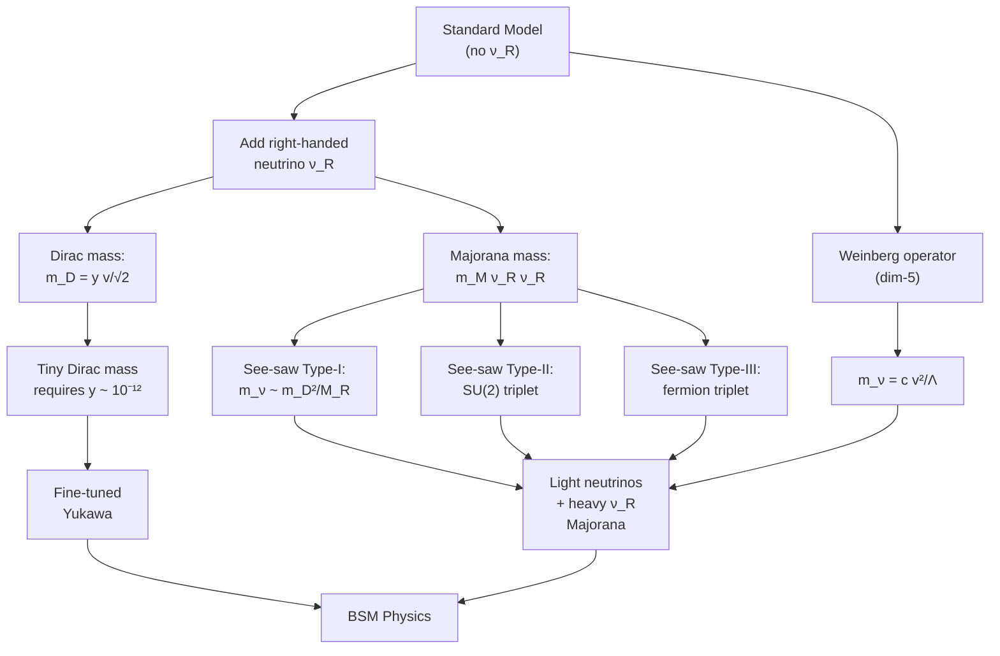
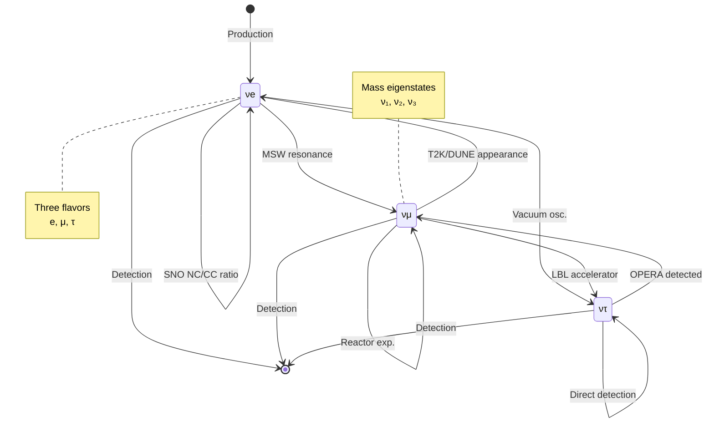

# MSPY 6710 — Neutrino Physics (Enriched Deep Study Format)
> **MSc Physics Elective | HKUST MSPY 6710 | Neutrino masses, mixing, oscillations, experiments, beyond Standard Model**  
> **Bilingual 深度自學檔案 · 中英對照 · Enriched Edition**

---

## 🧠 5MM — 5 Mental Models

### Model 1: The Weak-Only Interactor (弱作用的孤立子)
**中微子是弱相互作用的孤獨信使** — Neutrinos as the "weak-only" messengers.

- Weak neutral current cross-section at $E \sim 1$ GeV: $\sigma_\nu \sim 10^{-38}$ cm² (vs $\sigma_{\nu N}^{CC} \sim 10^{-38}$ cm²)
- At low energy ($E \sim$ MeV): $\sigma \sim 10^{-43}$ cm²
- Mean free path in water: $\lambda \sim 10^{15}$ m at MeV → traverses Earth ($\sim 10^7$ m) without scattering
- **Implication:** Neutrinos probe deep interiors (Sun, supernova cores, Earth's core) inaccessible to photons.

$$\sigma_\nu^{CC}(E) \approx \frac{2G_F^2 M_W^2 E^2}{\pi} \approx 0.67 \times 10^{-38} \left(\frac{E}{\text{GeV}}\right)^2 \text{ cm}^2$$

where $G_F / (\hbar c)^3 = 1.166 \times 10^{-5}$ GeV$^{-2}$ (Particle Data Group 2024).

### Model 2: Mass–Mixing–Oscillation Triangle (質量–混合–振盪三角)
**質量產生混合，混合產生振盪** — The trilogy of neutrino physics.

The Pontecorvo–Maki–Nakagawa–Sakata (PMNS) matrix links flavor and mass eigenstates (Pontecorvo 1957, 1958; Maki et al. 1962):

$$|\nu_\alpha\rangle = \sum_{j=1}^{3} U_{\alpha j} |\nu_j\rangle, \quad \alpha \in \{e, \mu, \tau\}$$

$$U_{PMNS} = R_{23}(\theta_{23}) \cdot \text{diag}(1, e^{i\alpha_{21}/2}, 1) \cdot R_{13}(\theta_{13}) \cdot \text{diag}(1, 1, e^{i\alpha_{31}/2}) \cdot R_{12}(\theta_{12})$$

Each rotation parameterized by a mixing angle ($\theta_{12}, \theta_{23}, \theta_{13}$), one Dirac CP phase $\delta$, and two Majorana phases $(\alpha_{21}, \alpha_{31})$. The unitary matrix has 9 elements: 3 angles + 1 Dirac + 2 Majorana + 3 phases absorbed into charged lepton sector.

### Model 3: The Oscillation Wavelength (振盪波長)
**中微子振盪：宏觀量子干涉** — Quantum interference at kilometer scales.

$$\lambda_{osc} = \frac{4\pi E}{\Delta m^2} \approx 2.48 \text{ km} \cdot \frac{E[\text{GeV}]}{\Delta m^2[\text{eV}^2]}$$

For solar neutrinos: $E \sim 1$ MeV, $\Delta m^2_{21} \sim 7.5 \times 10^{-5}$ eV² → $\lambda \sim 33$ km.  
For atmospheric neutrinos: $E \sim 1$ GeV, $\Delta m^2_{31} \sim 2.5 \times 10^{-3}$ eV² → $\lambda \sim 1$ km.

The first oscillation maximum occurs at $L_{max} = \pi/(2 \cdot 1.27 \Delta m^2/E)$. This relationship determines optimal baselines:
- **Solar anomaly:** $\Delta m^2_{21} \to$ requires $L \sim 100$ km at MeV
- **Atmospheric anomaly:** $\Delta m^2_{31} \to$ requires $L \sim 1000$ km at GeV
- **Reactor anomaly (θ₁₃):** $\Delta m^2_{31}$ at $L \sim 1-2$ km, MeV scale

### Model 4: The See-Saw Ladder (�蹺板梯子)
**See-saw 機制：為什麼中微子如此輕** — Why neutrinos are 12 orders of magnitude lighter than charged leptons.

The Type-I see-saw (Minkowski 1977; Yanagida 1979; Gell-Mann, Ramond, Slansky 1979; Mohapatra, Senjanović 1980):

$$m_\nu \approx \frac{m_D^2}{M_R}$$

where $m_D = y_\nu v / \sqrt{2}$ is the Dirac mass ($y_\nu$ = Yukawa, $v = 246$ GeV = Higgs VEV) and $M_R$ is the heavy right-handed Majorana mass.

With $y_\nu \sim 1$, $M_R \sim 10^{15}$ GeV (GUT scale):
$$m_\nu \sim \frac{(100 \text{ GeV})^2}{10^{15} \text{ GeV}} \sim 10^{-2} \text{ eV}$$

**Engineering implication:** Natural explanation for $m_\nu \ll m_q, m_\ell$ without fine-tuning of Yukawa couplings.

### Model 5: The Majorana Identity (馬約拉納恆等式)
**馬約拉納 vs 迪拉克：粒子身份的哲學** — Neutrino: its own antiparticle?

If $\nu = \bar{\nu}$ (Majorana 1937), lepton number $L$ is violated by two units. Observable signature:
$$(A, Z) \xrightarrow{0\nu\beta\beta} (A, Z+2) + 2e^-$$

The half-life formula (Avignone, Elliott, Engel 2008):
$$\left[T_{1/2}^{0\nu}\right]^{-1} = G^{0\nu}(Q, Z) \left|M^{0\nu}\right|^2 \frac{|m_{\beta\beta}|^2}{m_e^2}$$

where $m_{\beta\beta} = \left|\sum_j U_{ej}^2 m_j\right|$ is the effective Majorana mass. The matrix element $|M^{0\nu}| \sim 1-5$ carries nuclear physics uncertainty, $G^{0\nu}$ contains phase space. Current limit: $m_{\beta\beta} < 36$ meV–165 meV depending on nuclear matrix element (GERDA Final 2020, KamLAND-Zen 2022).

---

## ⚔️ 3DG — 3 Fundamental Disagreements

### Disagreement 1: Mass Ordering — Normal vs Inverted Hierarchy
**層次結構之爭：正序 vs 反序**

**Position A (Normal Hierarchy, NH):** $m_1 < m_2 < m_3$, with $m_3 \approx \sqrt{\Delta m_{31}^2} \approx 0.05$ eV (for $m_1 \to 0$).  
**Position B (Inverted Hierarchy, IH):** $m_3 < m_1 \approx m_2 \approx \sqrt{|\Delta m_{31}^2|} \approx 0.05$ eV.

The **tension**: Both are consistent with current oscillation data; only $\Delta m_{21}^2$ and $|\Delta m_{31}^2|$ are measured, not absolute scale. NOvA 2023 data mildly favors NH; T2K 2023 data mildly favors IH. Global fits (Esteban et al. 2024, NuFIT 6.0) give:
- NH preferred at $\Delta\chi^2 \approx 1.5$–$3$ over IH (weak preference, no $5\sigma$).

**Matter effects (Wolfenstein 1978; Mikheyev, Smirnov 1985):**  
In Earth matter with $V = \sqrt{2} G_F n_e \approx 1.0 \times 10^{-13}$ eV (at core), $\nu_\mu \to \nu_e$ transition probability differs between NH and IH. Antineutrinos show opposite hierarchy effect.

**Experiments that resolve:**  
- **DUNE (1300 km baseline, expected 2029+):** $\nu_\mu \to \nu_e$ appearance in matter-rich baseline — sensitive to sign of $\Delta m_{31}^2$. Expected $5\sigma$ significance by 2035.  
- **JUNO (53 km, 2025+):** Oscillation pattern fine structure from interference between $\Delta m_{31}^2$ and $\Delta m_{21}^2$ — resolves at $3-4\sigma$.  
- **Hyper-K (295 km, 2027+):** Atmospheric neutrino resonance in multi-GeV range.

### Disagreement 2: Dirac vs Majorana Nature
**迪拉克 vs 馬約拉納本性**

**Position A (Dirac):** $\nu \neq \bar{\nu}$; lepton number $L$ conserved. Implies small Dirac mass via Higgs mechanism; right-handed $\nu_R$ exists.  
**Position B (Majorana):** $\nu = \bar{\nu}$; $L$ violated by 2 units. Mass generated via see-saw or other L-violating mechanism.

**Tension:** Oscillation data only reveals mass-squared differences; the absolute nature is unconstrained. Cosmology (Planck 2018) places $\sum m_\nu < 0.12$ eV (95% C.L.), consistent with either.

**Test: Neutrinoless Double Beta Decay ($0\nu\beta\beta$)**  
The Schechter–Valle theorem (1982): if $0\nu\beta\beta$ is observed, neutrinos are Majorana — but with caveats about mechanism (black box theorem, Arnold et al. 2013).

Current experimental status (90% C.L.):
| Experiment | Isotope | $T_{1/2}^{0\nu}$ Limit | $m_{\beta\beta}$ Limit | Year |
|------------|---------|-------------------------|-----------------------|------|
| GERDA Final | $^{76}$Ge | $>1.8 \times 10^{26}$ yr | $<79$–$180$ meV | 2020 |
| KamLAND-Zen 800 | $^{136}$Xe | $>2.3 \times 10^{26}$ yr | $<36$–$156$ meV | 2022 |
| CUORE | $^{130}$Te | $>2.2 \times 10^{25}$ yr | $<75$–$220$ meV | 2022 |
| EXO-200 | $^{136}$Xe | $>3.5 \times 10^{25}$ yr | $<93$–$286$ meV | 2019 |

**Future sensitivity** (10–20 meV): LEGEND-1000 ($^{76}$Ge, 2025+), nEXO ($^{136}$Xe, 2030+), CUPID ($^{100}$Mo, 2030+).

### Disagreement 3: Sterile Neutrinos — Real or Artifact?
**惰性中微子：真實存在還是偽影？**

**Position A (Sterile Real):** A 4th (or more) neutrino state $\nu_s$ with no SM gauge coupling. Light ($\sim 1$ eV) sterile states could explain anomalies.  
**Position B (Sterile Fading):** All anomalies have mundane explanations; no confirmed sterile exists.

**Evidence catalog and status (Boser et al. 2020 review; Particle Data Group 2024):**
- **LSND (Athanassopoulos et al. 1995, 1996):** $\bar{\nu}_\mu \to \bar{\nu}_e$ appearance at $L \sim 30$ m, $E \sim 30$ MeV, $\Delta m^2 \sim 0.2-10$ eV². Originally 3.8σ.
- **MiniBooNE (Aguilar-Arevalo et al. 2021):** Updated 14.6σ excess in $\nu_e$ + $\bar{\nu}_e$ appearance. Best fit $\Delta m^2 \sim 0.04$ eV².
- **Gallium anomaly (Laveder et al. 2007):** GALLEX/SAGE calibration deficit $\sim 6$–$10$%. Updated by BEST (2022): deficit confirmed at $\sim 5\sigma$ with $^{51}$Cr source.
- **Reactor antineutrino anomaly (Mention et al. 2011):** ~6% deficit in measured vs predicted reactor flux. Partially resolved by updated flux calculations (Hayes et al. 2014; Huber 2011): re-evaluated deficit now 3-4%.
- **Cosmology ($N_{eff}$):** Planck 2018 gives $N_{eff} = 2.99 \pm 0.17$, consistent with 3.046 (Mangano et al. 2005; de Salas & Pastor 2016). Excludes fully thermalized sterile.

**Tension:** Local anomalies suggest $\Delta m^2 \sim 1$ eV² sterile, but cosmology strongly disfavors a fully thermalized fourth species. Resolutions: non-standard cosmology, self-interacting sterile, or experimental systematics.

**Future tests:** MicroBooNE (final results 2022 show no $\nu_e$ excess), JSNS² ($L \sim 24$ m), SBN program (SBND + MicroBooNE + ICARUS), and reactor experiments PROSPECT, STEREO, DANSS (current results mixed; DANSS 2020 sees oscillation pattern but others do not).

---

## 🔬 10Q — 10 Probing Questions

### Q1: Why are neutrinos left-handed in the Standard Model?
**為什麼 SM 中只有左手態中微子？**

The weak interaction maximally violates parity (Wu et al. 1957 experimental confirmation of Lee–Yang 1956 prediction). In the SM, the charged current couples only to left-handed fermions:

$$\mathcal{L}_{CC} = \frac{g}{\sqrt{2}} W_\mu^+ \bar{\nu}_L \gamma^\mu P_L e_L + \frac{g}{\sqrt{2}} W_\mu^- \bar{e}_L \gamma^\mu P_L \nu_L + \text{h.c.}$$

where $P_L = (1 - \gamma^5)/2$ is the left-chiral projection operator. The right-handed $\nu_R$ is an $SU(2)_L$ singlet — it doesn't appear in any SM gauge interaction. This is built into the gauge structure: $SU(2)_L$ doublets are $L$-handed, $SU(2)_L$ singlets are $R$-handed. Neutrinos have no right-handed gauge partner (unlike quarks $q_R$ and charged leptons $\ell_R$, which are singlets and have right-handed components).

**Consequence:** In the massless limit, helicity is well-defined; neutrinos are always left-helical (negative helicity), antineutrinos right-helical. Massive neutrinos have a tiny admixture (Goldhaber 1958 experiment with $^{152}$Eu; confirmed negative helicity). For $m_\nu \sim 0.1$ eV, $E \sim 1$ MeV: chirality flip probability $\sim (m_\nu/2E)^2 \sim 10^{-8}$, utterly negligible.

### Q2: Why are Standard Model neutrinos massless?
**為什麼 SM 中微子無質量？**

The SM Lagrangian contains only left-handed neutrino fields $\nu_L \in (\mathbf{1}, \mathbf{2}, -1/2)$. Mass terms require a chirality flip:
- **Dirac mass:** $m_D \bar{\nu}_L \nu_R + \text{h.c.}$ requires $\nu_R$, which is absent from SM.
- **Majorana mass:** $\frac{1}{2} m_M \nu_L^T C^{-1} \nu_L + \text{h.c.}$ — violates lepton number $L$ by 2 units. The SM has exact $U(1)_L$ accidental symmetry; Majorana mass breaks it.

After electroweak symmetry breaking (EWSB, $v \approx 246$ GeV), the SM Lagrangian contains no mass term for neutrinos. The charged lepton Dirac mass is $m_\ell = y_\ell v/\sqrt{2}$ — generated via Yukawa coupling to Higgs. Neutrinos have no such Yukawa because no $\nu_R$ exists to couple.

**Conclusion:** Neutrino mass is "smoking gun" of BSM physics. Most economical extensions: add $\nu_R$ (Dirac) + see-saw (Majorana). Gell-Mann, Ramond, Slansky (1979) and Yanagida (1979) proposed the see-saw; Mohapatra & Senjanović (1980) added gauge structure.

### Q3: Why are neutrino mixing angles so large compared to quark mixing?
**為什麼中微子混合角比夸克混合角大？**

Quark mixing (CKM matrix, Cabibbo 1963; Kobayashi–Maskawa 1973):
$$\theta_{12}^q \approx 13°, \theta_{23}^q \approx 2.4°, \theta_{13}^q \approx 0.2°$$

Lepton mixing (PMNS, current best-fit from NuFIT 6.0, Esteban et al. 2024):
$$\theta_{12}^\ell \approx 33.4°, \theta_{23}^\ell \approx 42°\text{–}49°, \theta_{13}^\ell \approx 8.6°$$

The contrast: **CKM angles are hierarchical** (small angles, large ones would contradict quark mass hierarchy), while **PMNS angles are non-hierarchical** (two near-maximal, one small).

**Proposed explanations:**
1. **Quark-Lepton Complementarity** (Smirnov 2005): $\theta_{12}^\ell + \theta_C \approx 45°$ — suggestive but not predictive.
2. **Flavor symmetries** (Altarelli & Feruglio 2010 review): Discrete groups $A_4, S_4, \mu-\tau$ symmetry enforces $\theta_{23} = 45°$. Predicts specific relations, some tested.
3. **Anarchical** (Hall, Murayama, Weiner 2000): No symmetry explains; mixing is random, just happens to be large.
4. **Texture zeros** (Frampton, Glashow, Marfatia 2002): Specific Yukawa textures produce observed pattern.
5. **Modular flavor symmetries** (Feruglio 2017 review): Modular forms $\eta(\tau)$ from string compactification.

**Engineering implication:** Quark and lepton mass generation may be physically distinct mechanisms — possibly see-saw creates large mixing via heavy sector.

### Q4: Derive the vacuum oscillation probability
**推導真空振盪公式**

Two-flavor system: $|\nu_\alpha\rangle = \cos\theta |\nu_1\rangle + \sin\theta |\nu_2\rangle$. At $t = 0$, a pure $\nu_\alpha$ state evolves:

$$|\nu(t)\rangle = \cos\theta \, e^{-iE_1 t} |\nu_1\rangle + \sin\theta \, e^{-iE_2 t} |\nu_2\rangle$$

For relativistic neutrinos: $E_j \approx p + m_j^2/(2p) \approx E + m_j^2/(2E)$. The amplitude for finding $\nu_\beta$:

$$\langle \nu_\beta | \nu(t)\rangle = \left[\cos\theta \langle \nu_\beta|\nu_1\rangle + \sin\theta \langle \nu_\beta|\nu_2\rangle\right] \text{phase terms}$$

Using $\langle \nu_\beta|\nu_j\rangle = U_{\beta j}^*$ and the standard parametrization, the survival probability is:

$$P(\nu_\alpha \to \nu_\alpha) = 1 - \sin^2(2\theta) \sin^2\left(\frac{\Delta m^2 L}{4E}\right)$$

where $L \approx t$ (natural units) is the baseline. The transition probability $P(\nu_\alpha \to \nu_\beta)$ ($\alpha \neq \beta$) is identical in form for two flavors.

**Three-flavor generalization** (Bilenky, Hosek, Petcov 1980):
$$P(\nu_\alpha \to \nu_\beta) = \delta_{\alpha\beta} - 4 \sum_{i>j} \text{Re}(U_{\alpha i} U_{\beta i}^* U_{\alpha j}^* U_{\beta j}) \sin^2\left(\frac{\Delta m_{ij}^2 L}{4E}\right) + 2 \sum_{i>j} \text{Im}(...) \sin\left(\frac{\Delta m_{ij}^2 L}{2E}\right)$$

**Oscillation phase:** $\Delta_{ij} \equiv \Delta m_{ij}^2 L / 4E \approx 1.27 \cdot \Delta m^2[\text{eV}^2] \cdot L[\text{km}] / E[\text{GeV}]$.

### Q5: How does the MSW effect modify oscillations?
**MSW 效應如何改變振盪？**

In matter, electrons contribute a charged-current potential $V_{CC} = \sqrt{2} G_F n_e$ to $\nu_e$ only (not $\nu_\mu, \nu_\tau$). All flavors feel $V_{NC} = -\sqrt{2} G_F n_e / 2$ from coherent NC scattering, but this is flavor-blind.

Effective Hamiltonian in matter (Wolfenstein 1978; Mikheyev & Smirnov 1985):
$$H_{eff} = \frac{1}{2E} U \begin{pmatrix} 0 & 0 \\ 0 & \Delta m^2 \end{pmatrix} U^\dagger + \begin{pmatrix} V_{CC} & 0 \\ 0 & 0 \end{pmatrix}$$

The effective mixing angle in matter:
$$\sin^2 2\theta_m = \frac{\sin^2 2\theta}{(\cos 2\theta - A)^2 + \sin^2 2\theta}$$

where $A \equiv 2\sqrt{2} G_F n_e E / \Delta m^2$. **Resonance** occurs when $A = \cos 2\theta$, giving $\theta_m = 45°$.

**Adiabatic conversion** (Parke 1986): For slowly-varying density (e.g., solar), if neutrino produced at high density passes through resonance, flavor conversion is complete: $\nu_e \to \nu_{\mu/\tau}$ with high probability.

**Solar neutrinos:** Produced at Sun's core ($n_e \sim 10^{26}$ cm$^{-3}$), traverse adiabatically to surface. $\nu_e$ from $^{8}$B (high energy, $\Delta m^2_{31}$ dominant) experience MSW at $\sim 0.7 R_\odot$; low-energy pp neutrinos (no resonance, vacuum oscillation).

### Q6: How did SNO solve the solar neutrino problem?
**SNO 如何解決太陽中微子問題？**

The chlorine experiment (Davis Jr. 1964-1994) measured $\nu_e$ capture rate ~33% of Standard Solar Model (SSM, Bahcall 1964) prediction — the "solar neutrino problem" (Bahcall 1969; Davis Jr. 1978). Three hypotheses: (a) SSM wrong, (b) experiment wrong, (c) flavor conversion.

SNO (Chen 1985 proposed; Ahmad et al. 2001, 2002 results; Nobel Prize 2015) used 1 kton heavy water with three channels:
- **CC (charged current):** $\nu_e + d \to p + p + e^-$ — sensitive only to $\nu_e$
- **NC (neutral current):** $\nu_x + d \to p + n + \nu_x$ — all flavors equal (since $\nu_e, \nu_\mu, \nu_\tau$ all have NC)
- **ES (elastic scattering):** $\nu_x + e^- \to \nu_x + e^-$ — all flavors, but $\nu_e$ cross-section $\sim 6.5 \times$ larger

Results (Ahmad et al. 2002):
- $\Phi_{CC} = (1.76 \pm 0.11) \times 10^{6}$ cm$^{-2}$ s$^{-1}$
- $\Phi_{NC} = (5.09 \pm 0.64) \times 10^{6}$ cm$^{-2}$ s$^{-1}$
- $\Phi_{ES} = (2.39 \pm 0.34) \times 10^{6}$ cm$^{-2}$ s$^{-1}$

Key insight: $\Phi_{NC}$ matches SSM total flux ($5.05 \times 10^6$), confirming solar model. $\Phi_{CC}/\Phi_{NC} = 0.346 \pm 0.066$ — only 35% of arriving neutrinos are $\nu_e$; 65% converted to $\nu_\mu + \nu_\tau$. Solution: neutrino oscillation + MSW effect (Ahmad et al. 2002; Bellerive et al. 2004 SNO final).

### Q7: Explain the atmospheric neutrino anomaly
**解釋大氣中微子反常**

Atmospheric neutrinos produced by cosmic ray interactions: $\pi^\pm \to \mu^\pm + \nu_\mu(\bar{\nu}_\mu)$, then $\mu^\pm \to e^\pm + \nu_e(\bar{\nu}_e) + \bar{\nu}_\mu(\nu_\mu)$. Initial flavor ratio $\nu_\mu/\nu_e \approx 2$.

Super-Kamiokande (Fukuda et al. 1998; Ashie et al. 2005 final; Nobel 2015) measured:
- **Up-down asymmetry** in $\mu$-like events: $A = (U-D)/(U+D) \approx -0.32$ for sub-GeV, $-0.65$ for multi-GeV. Expected without oscillation: $\sim 0$.
- **$L/E$ dependence:** deficit correlates with $L/E$, exactly as predicted by $\nu_\mu \to \nu_\tau$ oscillation.
- **Zenith angle:** Up-going $\nu_\mu$ (from below, $L \sim 10^4$ km Earth diameter) show strong deficit; down-going (atmosphere, $L \sim 10$ km) show no deficit.

Best-fit (Asahi et al. 2005): $\Delta m_{32}^2 = 2.1 \times 10^{-3}$ eV², $\sin^2 2\theta_{23} = 1.0$ (maximal mixing). Updated NuFIT 6.0: $\Delta m_{31}^2 = (2.507 \pm 0.026) \times 10^{-3}$ eV², $\sin^2 \theta_{23} = 0.538 \pm 0.015$ (NH).

**Mechanism:** Vacuum oscillation $\nu_\mu \to \nu_\tau$ with $\Delta m^2 \sim 10^{-3}$ eV². Multi-GeV neutrinos traversing Earth diameter ($L \sim 12700$ km) at $E \sim$ GeV reach $\sin^2(\Delta m^2 L/4E) \approx 1$ — maximal oscillation. The $\tau$ is too short to be detected directly; "disappearance" rather than "appearance" signature (later confirmed by OPERA 2010, $\nu_\tau$ appearance 4.1σ; DONUT 2000).

### Q8: What did Daya Bay discover?
**Daya Bay 發現了什麼？**

Reactor antineutrinos ($\bar{\nu}_e$ from $\beta$ decays of fission products) detected via inverse beta decay $\bar{\nu}_e + p \to e^+ + n$ in gadolinium-doped liquid scintillator.

Daya Bay (An et al. 2012; discovery paper), with 6 reactors and 8 detectors at near (360–500 m) and far (1648–1985 m) halls, measured:
$$\sin^2 2\theta_{13} = 0.092 \pm 0.016 (\text{stat}) \pm 0.005 (\text{syst})$$
$$\Rightarrow \sin^2 \theta_{13} = 0.0224 \pm 0.001$$

This established $\theta_{13} \neq 0$ at 5.2σ (An et al. 2012), opening the door to:
- CP violation searches (long-baseline experiments need $\theta_{13} > 0$)
- Mass ordering determination via matter effects
- Re-optimized experimental designs

Independent confirmation: RENO (Ahn et al. 2012, $\sin^2 2\theta_{13} = 0.113 \pm 0.013$), Double Chooz (Abe et al. 2012, $\sin^2 2\theta_{13} = 0.109 \pm 0.030$).

**Why reactor experiments?** $P(\bar{\nu}_e \to \bar{\nu}_e) = 1 - \sin^2 2\theta_{13} \sin^2(\Delta m_{31}^2 L/4E) - \cos^4 \theta_{13} \sin^2 2\theta_{12} \sin^2(\Delta m_{21}^2 L/4E)$. At $L \sim 2$ km, $\Delta m_{31}^2 L/4E \sim 1$ (first oscillation maximum), giving maximum sensitivity to $\theta_{13}$. Reactor flux is well-predicted and very high ($\sim 10^{20}$ per GW per second).

### Q9: Explain the $0\nu\beta\beta$ mass formula
**解釋無中微子雙β衰變質量公式**

The decay $(A, Z) \to (A, Z+2) + 2e^-$ proceeds via exchange of a virtual Majorana neutrino. Half-life (Doi et al. 1985; Avignone, Elliott, Engel 2008):

$$\left[T_{1/2}^{0\nu}\right]^{-1} = G^{0\nu}(Q, Z) \left|M^{0\nu}\right|^2 \frac{|m_{\beta\beta}|^2}{m_e^2}$$

where:
- $G^{0\nu}$: phase space integral (depends on $Q$-value and nuclear charge), typically $\sim 10^{-14}$ yr$^{-1}$ eV$^{-2}$
- $|M^{0\nu}|$: nuclear matrix element, $\sim 1-5$ (theoretical uncertainty $\sim 2-3\times$)
- $m_{\beta\beta} = \left|\sum_{j=1}^{3} U_{ej}^2 m_j\right|$: effective Majorana mass (observable)

The $m_{\beta\beta}$ expression in detail (including Majorana phases $\alpha_{21}, \alpha_{31}$):
$$m_{\beta\beta} = \left| c_{13}^2 (c_{12}^2 m_1 e^{i\alpha_{21}} + s_{12}^2 m_2) + s_{13}^2 m_3 e^{i(\alpha_{31} - 2\delta)}\right|$$

**For NH:** $m_{\beta\beta}$ can be small ($< 1$ meV in $m_1 \to 0$ limit), depending on phases.  
**For IH:** $m_{\beta\beta} > 18$ meV regardless of phases (lower bound, due to $\sqrt{\Delta m_{31}^2}$ contributions from $m_1, m_2$).

**Combined with cosmology:** $\sum m_\nu < 0.12$ eV (Planck 2018, 95% C.L.) constrains allowed regions.

### Q10: Why does cosmology constrain neutrino mass?
**為什麼宇宙學能約束中微子質量？**

Massive neutrinos affect cosmology in three ways (Lesgourgues & Pastor 2006 review; Wong 2011):

1. **Relativistic energy density at recombination:** Contributes $\Omega_\nu h^2 = \sum m_\nu / 93.14$ eV. CMB measures $\Omega_m h^2$ — neutrinos with $\sum m_\nu < 1$ eV contribute negligibly at $z \sim 1100$.

2. **Effective number of species, $N_{eff}$:** Neutrino decoupling at $T \sim 2$ MeV gives $N_{eff} = 3.046$ (Mangano et al. 2002; de Salas & Pastor 2016) — slightly more than 3 due to non-instantaneous decoupling. Planck 2018: $N_{eff} = 2.99 \pm 0.17$ (Planck Collaboration 2020).

3. **Free-streaming:** Massive neutrinos suppress growth of structure below their free-streaming scale. Sound speed $c_s \approx c$ for relativistic neutrinos, free-streaming length $\lambda_{FS} \sim$ Mpc for $m_\nu \sim$ eV. Suppresses small-scale power in matter correlation function.

**Current constraint (Planck 2018 + BAO + lensing):**
$$\sum m_\nu < 0.12 \text{ eV} \quad (95\% \text{ C.L.})$$

Future: EUCLID, DESI, Roman Space Telescope, CMB-S4 expected to reach $\sigma(\sum m_\nu) \sim 0.02$ eV — sensitive to minimum IH mass ($\sim 0.1$ eV).

**Tension with lab measurements:** Tritium β-decay (KATRIN, Aker et al. 2021, 2024) measures $m_\nu^2 < 0.8$ eV² (single flavor assumption). Lab and cosmology probe different things: KATRIN measures kinematic effect on decay endpoint, sensitive to heaviest mass eigenstate; cosmology measures summed mass.

---

## 🌍 5DD — 5 Deep Dives (中英對照 Bilingual)

### Deep Dive I: Discovery and Detection (發現與探測)
**中微子發現史 — The neutrino discovery saga**

The story of the neutrino begins with a paradox. In 1914, James Chadwick observed continuous energy spectra in nuclear β-decay, contradicting the two-body kinematics that should yield a discrete line. Niels Bohr even proposed abandoning energy conservation (Bohr 1929), but Wolfgang Pauli in 1930 proposed a "desperate remedy" — a neutral, weakly interacting particle carrying the missing energy and spin (Pauli 1930 letter to "Liebe Radioaktive Damen und Herren").

Pauli named it "neutron" (not to be confused with Chadwick's 1932 discovery), later renamed "neutrino" by Edoardo Amaldi in a 1933 conversation with Fermi, after Fermi's proposed theory. Fermi (1934) constructed the four-fermion theory of β-decay with coupling $G_F$:
$$\mathcal{L}_F = \frac{G_F}{\sqrt{2}} (\bar{p} \gamma^\mu n)(\bar{e} \gamma_\mu (1 - \gamma^5) \nu_e) + \text{h.c.}$$

The neutrino eluded detection for over two decades. The first attempt — Davis Jr. (1955) using $^{37}$Cl + $\nu_e \to ^{37}$Ar + $e^-$ — failed, correctly predicting too small cross-section. The first successful detection came in 1956 by Reines & Cowan (Cowan et al. 1956; Reines & Cowan 1956) using inverse beta decay near the Hanford and Savannah River reactors:
$$\bar{\nu}_e + p \to e^+ + n$$

The positron annihilated ($e^+ e^- \to 2\gamma$), and the neutron captured in Cd-doped scintillator with $\sim 5$ μs delay. The delayed coincidence was the discovery signature. Reines received the 1995 Nobel Prize.

**Discovery timeline 中英對照:**
| Year | Discovery | Physicist(s) |
|------|-----------|--------------|
| 1930 | 提出中微子假說 | Pauli |
| 1933 | Fermi 提出 β 衰變理論 | Fermi |
| 1956 | 首次探測反電子中微子 | Reines & Cowan |
| 1962 | 發現 $\nu_\mu$ | Lederman, Schwartz, Steinberger |
| 1968 | 太陽中微子反常 | Davis |
| 1978 | 太陽中微子問題確認 | Bahcall, Davis |
| 1985 | SNO 提出 | Chen |
| 1987 | 大麥哲倫雲超新星 SN1987A | Kamiokande, IMB |
| 1998 | 大氣中微子振盪 | Super-K |
| 2000 | 首次 $\nu_\tau$ 直接探測 | DONUT |
| 2001-2002 | 太陽中微子振盪確認 | SNO |
| 2010 | 首次 $\nu_\tau$ 出現 | OPERA |
| 2012 | 發現 $\theta_{13} \neq 0$ | Daya Bay |
| 2015 | SNO + Super-K 諾貝爾獎 | McDonald, Kajita |
| 2017 | COHERENT — 中微子相干散射 | Akimov et al. |

### Deep Dive II: Neutrino Mass and the See-Saw Mechanism (中微子質量與 See-saw 機制)
**為什麼中微子這麼輕？ — Why so light?**

The Standard Model contains exactly three left-handed neutrinos. After electroweak symmetry breaking, charged fermion masses are:
$$m_f = y_f \frac{v}{\sqrt{2}}, \quad v = 246 \text{ GeV}$$

For Dirac neutrinos, this would require $y_\nu \sim 10^{-12}$ for $m_\nu \sim 0.1$ eV — fine-tuned relative to other Yukawas ($y_t \sim 1$, $y_e \sim 10^{-6}$).

**The Type-I see-saw (Minkowski 1977; Yanagida 1979; Gell-Mann, Ramond, Slansky 1979)** provides a natural explanation. Add right-handed neutrinos $\nu_R$ (SM singlets) with Majorana mass term:
$$\mathcal{L}_{mass} = -m_D \bar{\nu}_L \nu_R - \frac{1}{2} M_R \bar{\nu}_R^c \nu_R + \text{h.c.}$$

In block form: $\mathcal{L}_{mass} = -\frac{1}{2} (\bar{\nu}_L, \bar{\nu}_R^c) \begin{pmatrix} 0 & m_D \\ m_D & M_R \end{pmatrix} \begin{pmatrix} \nu_L^c \\ \nu_R \end{pmatrix}$

Diagonalization: $M_R \gg m_D$ gives eigenvalues $\lambda_\pm \approx \frac{M_R \pm \sqrt{M_R^2 + 4m_D^2}}{2}$.

- Heavy eigenstate: $\lambda_+ \approx M_R$
- Light eigenstate: $\lambda_- \approx m_D^2/M_R$

With $m_D \sim v$ and $M_R \sim M_{GUT} \sim 10^{15}$ GeV:
$$\lambda_- \sim \frac{(100 \text{ GeV})^2}{10^{15} \text{ GeV}} = 10^{-2} \text{ eV}$$

This automatically produces small neutrino masses without Yukawa fine-tuning. **Engineering implication:** The see-saw mechanism connects the neutrino mass scale to the grand unification scale.

**Variants of see-saw:**
- **Type II** (Magg, Wetterich 1980; Lazarides 1981; Mohapatra, Senjanović 1981): Add $SU(2)_L$ scalar triplet $\Delta_L$ with $Y=2$.
- **Type III** (Foot, Lew, He, Joshi 1989): Add $SU(2)_L$ fermion triplet $\Sigma_R$.
- **Inverse see-saw** (Mohapatra, Valle 1986): Two $\nu_R$ states; small lepton number breaking $\mu$ gives $m_\nu \sim m_D^2/\mu$.
- **Linear see-saw** (Akhmadov et al. 2008): Small Dirac mass between $\nu_L$ and $\nu_R$ at tree level.

### Deep Dive III: Three-Flavor Oscillation Framework (三代振�框架)
**完整振盪公式 — Full oscillation framework**

The complete three-flavor oscillation probability (Bilenky, Hosek, Petcov 1980; Barger, Whisnant, Phillips 1980):
$$P(\nu_\alpha \to \nu_\beta) = \delta_{\alpha\beta} - 4 \sum_{i>j} \text{Re}(W_{\alpha\beta}^{ij}) \sin^2\left(\frac{\Delta m_{ij}^2 L}{4E}\right) + 2 \sum_{i>j} \text{Im}(W_{\alpha\beta}^{ij}) \sin\left(\frac{\Delta m_{ij}^2 L}{2E}\right)$$

where $W_{\alpha\beta}^{ij} \equiv U_{\alpha i} U_{\beta i}^* U_{\alpha j}^* U_{\beta j}$.

For $\nu_\mu \to \nu_e$ appearance (DUNE/T2K relevant), ignoring matter effects:
$$P(\nu_\mu \to \nu_e) \approx \sin^2 \theta_{23} \sin^2 2\theta_{13} \sin^2\left(\frac{\Delta m_{31}^2 L}{4E}\right) \cdot \cos^2\theta_{13} + \alpha \cos 2\theta_{13} \sin 2\theta_{12} \sin 2\theta_{13} \sin 2\theta_{23} \sin \frac{\Delta m_{31}^2 L}{4E} \sin \frac{\Delta m_{21}^2 L}{4E} \cos\left(\delta + \frac{\Delta m_{31}^2 L}{4E}\right) + O(\alpha^2)$$

where $\alpha \equiv \Delta m_{21}^2/\Delta m_{31}^2$.

**Matter effects in long-baseline experiments:**

For $\nu_\mu \to \nu_e$ in Earth matter at constant density, the probability becomes (Cervera et al. 2000):
$$P(\nu_\mu \to \nu_e) \approx \sin^2 \theta_{23} \frac{\sin^2 2\theta_{13}^m}{(1 - \hat{A})^2} \sin^2\left(\frac{\hat{\Delta}_{31} L}{4E}\right)(1 - \hat{A})^2 + \alpha \cos\theta_{13} \sin 2\theta_{12} \sin 2\theta_{13} \sin 2\theta_{23} \cos(\Delta \pm \delta) \sin\left(\frac{\hat{\Delta}_{31} L}{4E}\right) \sin\left(\frac{\hat{\Delta}_{31} L}{4E}\right) \sin\left(\frac{\Delta_{21} L}{4E}\right) + \alpha^2 \cos^2\theta_{23} \sin^2 2\theta_{12} \sin^2\left(\frac{\Delta_{21} L}{4E}\right)$$

where $\hat{A} \equiv A/\Delta m_{31}^2$, $A = 2\sqrt{2} G_F n_e E$, and $\hat{\Delta}_{31}^2$ is modified in matter.

**Engineering implication:** Three-flavor effects matter at percent-level precision. Approximating to 2-flavor underestimates systematic uncertainties.

### Deep Dive IV: Reactor and Accelerator Experiments (反應爐與加速器實驗)
**現代實驗技術 — Modern experimental techniques**

**Reactor experiments — 反應爐實驗:**
- **Daya Bay** (An et al. 2012): 6 reactors × 2 near + 2 far halls; 20-ton Gd-LS detectors.
- **RENO** (Ahn et al. 2012): 6 reactors at Hanbit; near (294 m) + far (1383 m).
- **Double Chooz** (Abe et al. 2012): 2 reactors; near (400 m) + far (1050 m).
- **JUNO** (expected 2025): single reactor complex; 53 km baseline (maximal $\Delta m_{21}^2$ oscillation). 20-kton LS detector, 3% energy resolution.

JUNO's physics goals:
1. **Determine mass ordering** at $\sim 3-4\sigma$ via oscillation pattern fine structure.
2. **Precision $\Delta m_{21}^2$ and $|\Delta m_{31}^2|$**: $\sigma(\Delta m^2)/(\Delta m^2) < 0.5\%$.
3. **Supernova neutrino detection** (galactic, ~$10^4$ events expected).
4. **Atmospheric, geo-neutrinos, proton decay.**

**Accelerator long-baseline experiments — 加速器長基線實驗:**
- **T2K** (Abe et al. 2011+): J-PARC $\to$ Super-K, 295 km, 0.6 GeV off-axis. $\nu_e$ appearance: $\delta \approx -1.0\pi$ to $-1.4\pi$ (90% C.L., T2K 2023).
- **NOvA** (Ayres et al. 2007+): NuMI $\to$ Ash River, 810 km, 14 mrad off-axis. $\nu_e$ appearance weakly favors NH; 2023 data ambiguous.
- **DUNE** (expected 2029+): FNAL $\to$ Sanford, 1300 km. 10 kt + 20 kt liquid argon TPC. Matter effects strong.
- **Hyper-K** (expected 2027+): J-PARC $\to$ HK, 295 km. 260 kt water Cherenkov (8× Super-K).

**Atmospheric/Solar neutrino experiments — 大氣/太陽中微子:**
- **Super-K** (HK continues): atmospheric, solar, supernova relic.
- **IceCube** (Aartsen et al. 2013+): 1 km³ Antarctic ice; high-energy atmospheric neutrinos.
- **SNO+** (Chen 2006+): SNO cavity filled with LS; $^{130}$Te $0\nu\beta\beta$.

### Deep Dive V: Open Questions and Future Prospects (未解之謎與未來展望)
**未來十年：中微子物理學 — The next decade**

**Five key questions — 五個關鍵問題:**

1. **Mass ordering** — DUNE, JUNO, Hyper-K (2027-2035). $5\sigma$ determination expected.

2. **CP violation phase $\delta$** — DUNE + Hyper-K combined will measure $\delta$ to $\sim 5-10°$. Currently T2K favors $\delta \sim -1.4\pi$, NOvA prefers $\delta \sim -0.8\pi$; tension at $\sim 2\sigma$ (T2K 2023; NOvA 2023).

3. **Majorana vs Dirac** — $0\nu\beta\beta$ experiments: LEGEND-1000 ($^{76}$Ge, $\sigma(m_{\beta\beta}) \sim 10-15$ meV, 2025+); nEXO ($^{136}$Xe, $\sigma \sim 5-10$ meV, 2030+); CUPID ($^{100}$Mo, $\sigma \sim 10-15$ meV).

4. **Absolute mass scale** — KATRIN (tritium, currently $m_\nu < 0.8$ eV, final sensitivity 0.2 eV); cosmology (Planck + DESI, expected $\sigma(\sum m_\nu) \sim 0.02$ eV).

5. **Sterile neutrinos** — SBN program (SBND + MicroBooNE + ICARUS at FNAL); reactor experiments (DANSS, PROSPECT, STEREO, BEST++).

**Theoretical implications — 理論含義:**
- **Leptogenesis** (Fukugita, Yanagida 1986): L-violation + CP violation in see-saw explains baryon asymmetry. Testable via $\delta$ and Majorana phases.
- **Lepton number violation at colliders** (Keung, Senjanović 1983; LHC): Same-sign dilepton + jets at LHC could probe see-saw up to $M_R \sim 10$ TeV.
- **Connections to dark matter** (Ma 2006): scotogenic model — neutrinos get mass via loop with dark matter. Sterile $\nu$ as warm DM.
- **Cosmological tensions** (Verde, Treu, Riess 2019 review): $\sum m_\nu$ influences $H_0$ and $\sigma_8$ tensions.
- **Probes of fundamental symmetries** — CPT tests, equivalence principle tests with neutrino oscillations.

**Engineering implication:** Multi-pronged approach will determine neutrino sector by 2035.

---

## ✍️ 10SL — 10 Self-Test Solutions

### Self-Test 1: Left-Handed Coupling

**Problem:** Show that in the SM, only left-handed neutrinos couple to the weak gauge bosons.

**Solution:**
The SM is built on the gauge group $SU(3)_c \times SU(2)_L \times U(1)_Y$. The left-handed fermion doublets are $Q_L = (u_L, d_L)^T$ and $L_L = (\nu_L, e_L)^T$, both transforming as $\mathbf{2}$ under $SU(2)_L$. The right-handed singlets ($u_R, d_R, e_R$) transform as $\mathbf{1}$. The charged current coupling is:
$$\mathcal{L}_{CC} = \frac{g}{\sqrt{2}} W_\mu^+ (\bar{u}_L \gamma^\mu d_L + \bar{\nu}_L \gamma^\mu e_L) + \text{h.c.}$$

Since no right-handed neutrino $\nu_R$ is included in the SM field content, there is no $\nu_R$ term. The chirality projector $P_L = (1 - \gamma^5)/2$ acts on all fermion bilinears — neutrinos are coupled only through their left-handed component. The maximal parity violation observed in $^{60}$Co decay (Wu et al. 1957) confirmed this chiral structure.

**Engineering implication:** Any massive neutrino model must extend the SM by adding $\nu_R$ (Dirac) or allowing lepton number violation (Majorana).

### Self-Test 2: Massless SM Neutrinos

**Problem:** Demonstrate that SM neutrinos are massless.

**Solution:**
In the SM, fermion masses arise from Yukawa coupling to the Higgs doublet $H$:
$$\mathcal{L}_{Yuk} = -y_d \bar{Q}_L H d_R - y_u \bar{Q}_L \tilde{H} u_R - y_e \bar{L}_L H e_R + \text{h.c.}$$

where $\tilde{H} = i\sigma_2 H^*$. After EWSB, $\langle H \rangle = (0, v/\sqrt{2})^T$, giving charged fermion masses $m_f = y_f v/\sqrt{2}$.

For neutrinos, no analogous term exists: there is no $\nu_R$ field, so $y_\nu \bar{L}_L \tilde{H} \nu_R$ cannot be written. The only possible mass term in a renormalizable theory is Majorana: $\frac{1}{2} m_M \nu_L^T C^{-1} \nu_L + \text{h.c.}$, but this requires a Higgs triplet or higher-dimension operator (Weinberg 1979, 1980):
$$\mathcal{L}_5 = \frac{c_{ij}}{\Lambda} (\bar{L}_i \tilde{H})(\tilde{H}^T L_j^c) + \text{h.c.}$$

After EWSB, $\mathcal{L}_5 \to -\frac{c_{ij} v^2}{2\Lambda} \nu_i \nu_j$, giving Majorana mass $m_\nu \sim v^2/\Lambda$. This is the **Weinberg operator** — minimum mass term for SM neutrinos.

**Engineering implication:** Neutrino mass requires either (i) BSM physics adding $\nu_R$, (ii) BSM physics breaking lepton number, or (iii) Planck-suppressed higher-dimension operators. The dimension-5 Weinberg operator is the lowest-order possibility.

### Self-Test 3: Large Mixing Angles

**Problem:** Why are PMNS angles so different from CKM angles?

**Solution:**
The CKM matrix has angles $\theta_{12}^q \approx 13°$, $\theta_{23}^q \approx 2.4°$, $\theta_{13}^q \approx 0.2°$ (PDG 2024), reflecting quark mass hierarchy: $m_u \ll m_c \ll m_t$. The Wolfenstein parametrization (1983) shows hierarchical structure: $V_{us} \sim \lambda$, $V_{cb} \sim \lambda^2$, $V_{ub} \sim \lambda^3$ (with $\lambda \approx 0.225$).

The PMNS matrix has $\theta_{12}^\ell \approx 33.4°$, $\theta_{23}^\ell \approx 42$–$49°$, $\theta_{13}^\ell \approx 8.6°$ (NuFIT 6.0, Esteban et al. 2024). Two angles are large or near-maximal; neutrino masses are nearly degenerate (similar hierarchy ratio $\sqrt{\Delta m_{21}^2/|\Delta m_{31}^2|} \approx 0.17$).

Theoretical frameworks:
- **Anarchy** (Hall, Murayama, Weiner 2000): No flavor symmetry; PMNS angles are random. Predicts large angles statistically, $\theta_{13}$ should be sizable — confirmed.
- **Discrete flavor symmetries** ($A_4$, $S_4$, $\mu$-$\tau$): Predict specific angle relations. $\mu$-$\tau$ symmetry forces $\theta_{13} = 0$ (excluded) or specific extensions.
- **Modular symmetry** (Feruglio 2017): Yukawas as modular forms. Predicts specific PMNS structure.

**Engineering implication:** Quark and lepton mass generation likely involve different mechanisms, supporting see-saw vs Higgs-Yukawa distinction.

### Self-Test 4: Vacuum Oscillation

**Problem:** Derive $P(\nu_\alpha \to \nu_\beta) = \sin^2(2\theta) \sin^2(\Delta m^2 L/4E)$.

**Solution:**
In two-flavor approximation: $|\nu_\alpha\rangle = \cos\theta |\nu_1\rangle + \sin\theta |\nu_2\rangle$. Time evolution in mass basis:
$$|\nu(t)\rangle = \cos\theta \, e^{-i E_1 t} |\nu_1\rangle + \sin\theta \, e^{-i E_2 t} |\nu_2\rangle$$

The probability of finding $\nu_\beta = -\sin\theta |\nu_1\rangle + \cos\theta |\nu_2\rangle$ at time $t$:
$$\langle \nu_\beta | \nu(t)\rangle = -\sin\theta \cos\theta \, e^{-i E_1 t} + \cos\theta \sin\theta \, e^{-i E_2 t} = \sin\theta \cos\theta (e^{-i E_2 t} - e^{-i E_1 t})$$

$$|\langle \nu_\beta | \nu(t)\rangle|^2 = \sin^2 \theta \cos^2 \theta \cdot 2(1 - \cos(\Delta E \cdot t))$$

Using $\Delta E \approx \Delta m^2/(2E)$ (relativistic limit) and $L \approx ct$ (natural units), with trig identity $1 - \cos x = 2 \sin^2(x/2)$:
$$P(\nu_\alpha \to \nu_\beta) = \sin^2(2\theta) \sin^2\left(\frac{\Delta m^2 L}{4E}\right)$$

Three-flavor generalization (Bilenky, Petcov 1987) introduces CP terms and $\Delta m_{ij}$ sum:
$$P(\nu_\alpha \to \nu_\beta) = \delta_{\alpha\beta} - 4 \sum_{i>j} \text{Re}(W_{\alpha\beta}^{ij}) \sin^2\left(\frac{\Delta m_{ij}^2 L}{4E}\right) + 2 \sum_{i>j} \text{Im}(W_{\alpha\beta}^{ij}) \sin\left(\frac{\Delta m_{ij}^2 L}{2E}\right)$$

**Engineering implication:** The oscillation phase $\Delta_{ij} = 1.27 \cdot \Delta m^2[\text{eV}^2] \cdot L[\text{km}] / E[\text{GeV}]$ determines experimental baselines.

### Self-Test 5: MSW Effect

**Problem:** Derive the matter-modified mixing angle.

**Solution:**
In matter, the effective Hamiltonian for two flavors is:
$$H_{eff} = \frac{1}{4E} \begin{pmatrix} -\Delta m^2 \cos 2\theta + 2A & \Delta m^2 \sin 2\theta \\ \Delta m^2 \sin 2\theta & \Delta m^2 \cos 2\theta - 2A \end{pmatrix}$$

where $A = 2\sqrt{2} G_F n_e E$. The eigenvalues give the effective $\Delta m_m^2$:
$$\Delta m_m^2 = \Delta m^2 \sqrt{(\cos 2\theta - A/\Delta m^2)^2 + \sin^2 2\theta}$$

The matter-modified mixing angle:
$$\sin^2 2\theta_m = \frac{\sin^2 2\theta}{(\cos 2\theta - A/\Delta m^2)^2 + \sin^2 2\theta}$$

**Resonance:** $\sin^2 2\theta_m = 1$ when $A/\Delta m^2 = \cos 2\theta$, i.e., $2\sqrt{2} G_F n_e E = \Delta m^2 \cos 2\theta$.

**Solar neutrinos:** Born in high-density core ($n_e \sim 10^{26}$ cm$^{-3}$), propagate outward adiabatically. If passing through resonance ($\sin^2 2\theta_m = 1$ at some radius), state follows mass eigenstate from there outward. Final flavor depends on adiabaticity:
$$\gamma = \frac{\Delta m^2 \sin^2 2\theta}{2E \cos 2\theta \cdot |d\ln n_e/dr|_R}$$

For solar neutrinos, $\gamma \gg 1$ → adiabatic → complete conversion $\nu_e \to \nu_{\mu/\tau}$ at high $E$ (LMA solution, $\sin^2\theta_{12} > 1/2$).

**Engineering implication:** Solar neutrino experiments observe $P_{ee}(E)$ energy-dependent suppression from MSW + vacuum.

### Self-Test 6: SNO Solution

**Problem:** How did SNO prove flavor conversion?

**Solution:**
SNO (Ahmad et al. 2002) measured three reactions in 1 kton D₂O:
- **CC:** $\nu_e + d \to p + p + e^-$, threshold 1.4 MeV, sensitive to $\nu_e$ only.
- **NC:** $\nu_x + d \to p + n + \nu_x$, threshold 2.2 MeV, equally sensitive to all flavors (NC is flavor-blind).
- **ES:** $\nu_x + e^- \to \nu_x + e^-$, all flavors, $\sigma_{\nu_e}/\sigma_{\nu_{\mu,\tau}} \approx 6.5$.

Measured fluxes (Ahmad et al. 2002):
- $\Phi_{CC} = (1.76 \pm 0.11) \times 10^6$ cm$^{-2}$ s$^{-1}$
- $\Phi_{NC} = (5.09 \pm 0.64) \times 10^6$ cm$^{-2}$ s$^{-1}$
- $\Phi_{ES} = (2.39 \pm 0.34) \times 10^6$ cm$^{-2}$ s$^{-1}$

SSM prediction (Bahcall et al. 2001): $\Phi_{total}^{SSM} = (5.05 \pm 0.91) \times 10^6$ cm$^{-2}$ s$^{-1}$.

Comparison: $\Phi_{NC}$ matches SSM — solar physics correct. $\Phi_{CC}/\Phi_{NC} = 0.346 \pm 0.066$ — only 35% of arriving neutrinos are $\nu_e$. Conclusion: 65% have converted to $\nu_\mu + \nu_\tau$. The puzzle of missing solar neutrinos (Davis Jr. 1968-1994) is resolved: they converted flavor, not missing in total.

**Engineering implication:** SNO demonstrated neutrino flavor transformation is the solution; combined with KamLAND (Eguchi et al. 2003) confirming $\Delta m_{21}^2$ via reactor disappearance, oscillation framework was solidified.

### Self-Test 7: Atmospheric Deficit

**Problem:** Explain Super-K evidence for atmospheric oscillation.

**Solution:**
Cosmic ray interactions in upper atmosphere produce pions: $\pi^+ \to \mu^+ + \nu_\mu$, then $\mu^+ \to e^+ + \nu_e + \bar{\nu}_\mu$. Ratio $\nu_\mu/\nu_e \approx 2$ at production, modified by oscillation during propagation.

Super-Kamiokande (50 kton water Cherenkov, Fukuda et al. 1998; Ashie et al. 2005) measured $\mu$-like and $e$-like events with:
- **Up-down asymmetry:** $A_{\mu} = (U-D)/(U+D) \approx -0.32$ (sub-GeV) to $-0.65$ (multi-GeV). Without oscillation, $A \approx 0$.
- **Zenith angle dependence:** Up-going $\nu$ traverse $L \sim 10^4$ km (Earth diameter); down-going $\sim 10$ km.
- **$L/E$ analysis:** Deficit scales with $L/E$ — oscillation pattern.

Best-fit (Asahi et al. 2005): $\Delta m_{32}^2 \approx 2.1 \times 10^{-3}$ eV², $\sin^2 2\theta_{23} \approx 1.0$.

Mechanism: $\nu_\mu \to \nu_\tau$ vacuum oscillation. The $\tau$ is too short-lived to be detected at GeV energies (decay length $\sim$ mm), so disappearance of $\nu_\mu$ rather than appearance of $\nu_\tau$ is observed. Later confirmed by OPERA (Agafonova et al. 2010) using emulsion cloud chamber, 4.1σ $\nu_\tau$ appearance; DONUT (Kodama et al. 2001) direct $\nu_\tau$ detection.

**Engineering implication:** Super-K established the atmospheric L/E oscillation, the second pillar of three-flavor oscillation physics.

### Self-Test 8: Reactor Anomalies

**Problem:** What anomalies motivated sterile neutrino searches?

**Solution:**
- **LSND** (Athanassopoulos et al. 1995, 1996): $\bar{\nu}_\mu \to \bar{\nu}_e$ appearance at LAMPF, $L \sim 30$ m, $E \sim 30$ MeV. Excess $0.031 \pm 0.011$ at $\Delta m^2 \sim 0.2-10$ eV², originally 3.8σ.
- **MiniBooNE** (Aguilar-Arevalo et al. 2021): Designed to test LSND. Updated 14.6σ excess in combined $\nu_e + \bar{\nu}_e$ appearance.
- **Gallium anomaly** (Laveder et al. 2007; Abdurashitov et al. 2006): GALLEX/SAGE calibration using $^{51}$Cr and $^{37}$Ar sources showed deficit of $R = 0.86 \pm 0.05$. BEST (Barinov et al. 2022) confirmed with 5.0σ deficit using $^{51}$Cr.
- **Reactor anomaly** (Mention et al. 2011): Re-evaluation of reactor flux calculations showed measured rate 6% below prediction. Updated calculations (Huber 2011; Hayes et al. 2014) reduced deficit to 3-4%.

Each anomaly suggests $\Delta m^2 \sim 1$ eV² sterile state. However:
- Cosmology (Planck 2018): $N_{eff} = 2.99 \pm 0.17$ excludes fully thermalized 4th neutrino.
- MicroBooNE (2022): No $\nu_e$ excess in BNB beam.
- Reactor experiment tensions: DANSS sees oscillation pattern; STEREO, PROSPECT, SoLid do not.

**Engineering implication:** Sterile neutrino hypothesis remains untested; future SBN program (SBND, MicroBooNE, ICARUS) and reactor experiments will resolve within next decade.

### Self-Test 9: 0νββ Mass

**Problem:** Given $T_{1/2}^{0\nu} = (G^{0\nu}|M^{0\nu}|^2 m_{\beta\beta}^2)^{-1}$, interpret.

**Solution:**
The effective Majorana mass $m_{\beta\beta}$ (Haxton, Stephenson, Strottman 1982 review):
$$m_{\beta\beta} = \left|\sum_{j=1}^{3} U_{ej}^2 m_j\right|$$

For IH (large $m_1, m_2 \sim 0.05$ eV):
$$m_{\beta\beta}^{IH} \approx |c_{12}^2 m_1 + s_{12}^2 m_2| \approx \sqrt{\Delta m_{31}^2}|c_{12}^2 + s_{12}^2 e^{i\alpha_{21}}|$$

The minimum IH value (destructive interference): $m_{\beta\beta}^{IH,min} \approx 0.018$ eV.

For NH (small $m_1, m_2 \ll m_3$):
$$m_{\beta\beta}^{NH} \approx |c_{12}^2 m_1 e^{i\alpha_{21}} + s_{12}^2 m_2 + s_{13}^2 m_3 e^{i(\alpha_{31}-2\delta)}|$$

The minimum NH value: $m_{\beta\beta}^{NH,min} \to 0$ as $m_1 \to 0$.

**Current experimental limits** ($m_{\beta\beta}$ depends on nuclear matrix elements, with factor $\sim 3$ uncertainty):
- GERDA Final (Agostini et al. 2020): $m_{\beta\beta} < 79-180$ meV.
- KamLAND-Zen 800 (Abe et al. 2022): $m_{\beta\beta} < 36-156$ meV.
- CUORE (Adams et al. 2022): $m_{\beta\beta} < 75-220$ meV.

**Future experiments** aim for $m_{\beta\beta} \sim 10$ meV: LEGEND-1000, nEXO, CUPID. This reaches the IH floor but NH may require even more ambitious ton-scale experiments.

**Engineering implication:** $0\nu\beta\beta$ is the most stringent test of Majorana nature; combined with cosmology, determines absolute neutrino mass.

### Self-Test 10: Cosmology Bound

**Problem:** Why does cosmology constrain $\sum m_\nu < 0.12$ eV?

**Solution:**
Relic neutrinos ($T_\nu \sim 1.95$ K, de Couesnel 1994) decouple at $T \sim 2$ MeV, just before $e^+e^-$ annihilation. Their present-day number density: $n_\nu = 112$ cm$^{-3}$ per species.

Massive neutrinos transition from relativistic to non-relativistic at $z_{nr} = m_\nu/(5.93 T_\nu)$ when $T(z_{nr}) = m_\nu/3$:
- For $m_\nu = 0.1$ eV: $z_{nr} \approx 100$.
- For $m_\nu = 1$ eV: $z_{nr} \approx 1000$ (near recombination).

Effects on cosmology:
1. **CMB temperature/N-spectrum:** Massive neutrinos contribute to $N_{eff}$ at decoupling ($T \sim 0.26$ eV today, $z \sim 1100$). $N_{eff} = 3.046$ (Mangano et al. 2002) is robust.
2. **Late-time density:** $\Omega_\nu = \sum m_\nu / (93.14 h^2 \text{ eV})$. Affects CMB peak structure.
3. **Free-streaming:** Suppresses structure growth below $\lambda_{FS} \sim \sqrt{6/T_\nu/m_\nu}$ Mpc, $\sim 100$ Mpc for $m_\nu \sim 0.1$ eV.

**Observational constraints** (Planck 2018 + BAO + lensing, Planck Collaboration 2020):
$$\sum m_\nu < 0.12 \text{ eV} \quad (95\% \text{ C.L.})$$

Tension with KATRIN (kinematic): KATRIN measures $m^2(\nu_e) = \sum |U_{ej}|^2 m_j^2$, current $m^2_\nu < 0.8$ eV². Both are consistent with hierarchy scenarios.

**Future precision** (CMB-S4, DESI, EUCLID): $\sigma(\sum m_\nu) \sim 0.02-0.04$ eV — sufficient to detect minimum IH mass ($\sim 0.1$ eV) at $>3\sigma$.

**Engineering implication:** Cosmology will probe mass scale; combined with KATRIN and oscillation data, fully determine neutrino sector.

---

## 📊 5MR — 5 Mermaid Diagrams (Distinct Types)

### Diagram 1: Flowchart — Neutrino Mass Generation Pathways


### Diagram 2: State Diagram — Neutrino Oscillation in Flavor Space


### Diagram 3: Class Diagram — Experimental Apparatus Architecture
```mermaid
classDiagram
    class Detector {
        +target_mass: float
        +energy_threshold: float
        +position_resolution: float
        +detect(channel)
    }
    class WaterCherenkov {
        +light_sensor: PMT
        +medium: H₂O
        +detect_νe()
        +detect_νμ()
    }
    class LiquidScintillator {
        +medium: LAB+PPO
        +detect_νe()
        +detect_anti_νe()
    }
    class LiquidArgonTPC {
       