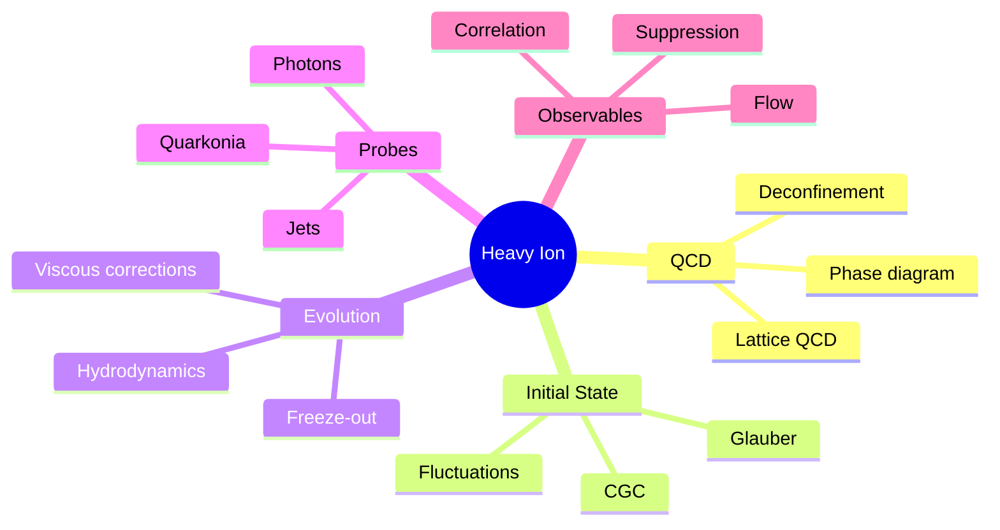
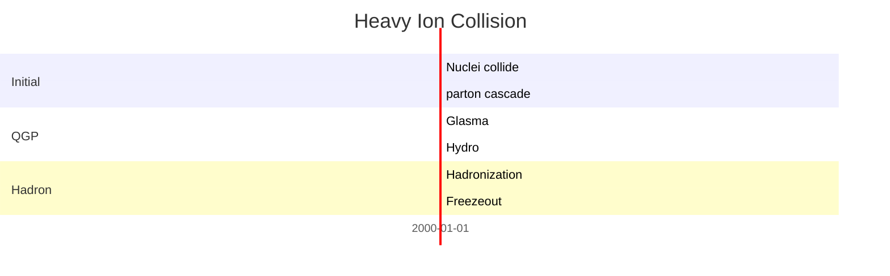
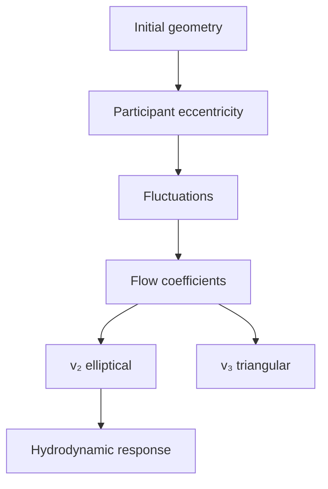
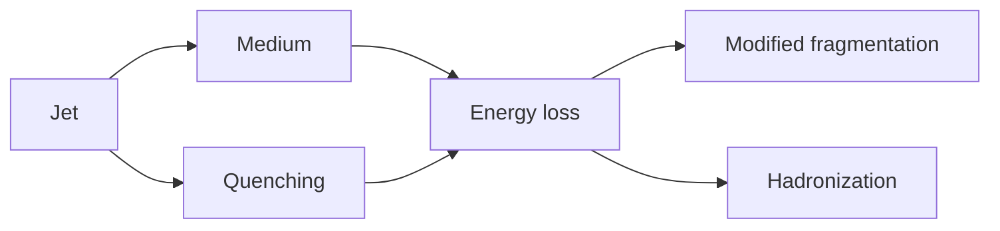
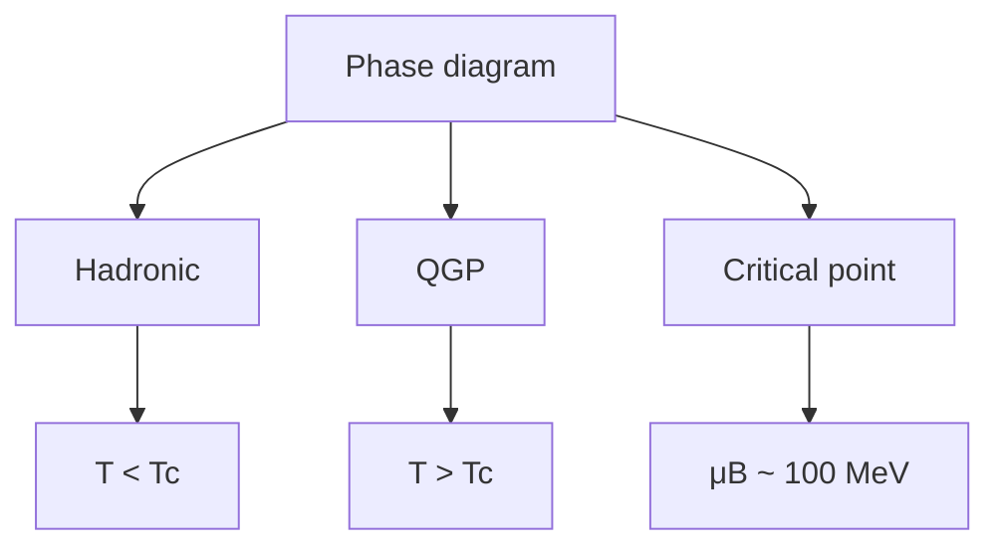

# MSPY 6810 — Heavy Ion Collision Physics
> **MSc Physics Elective | HKUST MSPY 6810 | Quark-gluon plasma, relativistic heavy-ion collisions, collective phenomena**  
> **Bilingual 深度自學檔案 · 中英對照**

---

## 問題 1：5 個核心心智模型

1. **QGP is a strongly coupled fluid** — QGP是強耦合流體 (not weakly interacting gas, near-perfect fluid)
2. **Collective flow is the signature** — 集體流是特徵 (elliptic flow reveals early dynamics)
3. **Jets probe the medium** — 噴注探測介質 (jet quenching reveals QGP properties)
4. **Thermodynamics of QCD** — QCD熱力學 (phase diagram, critical point)
5. **Hydrodynamics describes evolution** — 流體動力學描述演化 (viscous hydro from initial state)

## 問題 2：3 個根本分歧

1. **Perfect fluid vs microscopic picture**
   - Hydro: success in describing flow
   - Micro: actual degrees of freedom unclear

2. **Initial state geometry**
   - Glauber: geometric fluctuations
   - CGC: saturation physics, Color Glass Condensate

3. **Temperature extraction**
   - Direct photons: blackbody radiation
   - Statistical hadronization: fits yield $T \approx 156$ MeV

## 問題 3：10 個深度問題

1. 給定 Bjorken hydrodynamics, derive central energy density $\epsilon = \frac{1}{\pi R^2}\frac{dE_T}{dy}$。
2. 解釋為什麼 QGP has extremely small shear viscosity $\eta/s \approx 0.1$。
3. 為什麼 elliptic flow $v_2$ scales with participant eccentricity $\epsilon_2$?
4. 給定 jet quenching energy loss $dE/dx \propto \alpha_s C_R \rho_{gauge}\hat{q}$, 解釋 medium response。
5. 解釋 Hanbury Brown-Twiss (HBT) interferometry for source radius。
6. 為什麼 heavy quark diffusion coefficient $D_s$ is small?
7. 給定 quarkonium suppression pattern, 點樣 sequential melting reveals $T_{medium}$。
8. 解釋为何 direct photons have excess thermal emission at low $p_T$。
9. 為什麼 flow observables are sensitive to EoS?
10. 給定 Bayesian analysis constraints, extract QGP properties from multi-observable fits。

## 深入 1：QCD Phase Diagram
**Deep Dive I**

### Phase Structure
Deconfinement transition: hadronic matter $\leftrightarrow$ QGP

Lattice QCD: crossover at $\mu_B = 0$ with $T_c \approx 156$ MeV

Critical point: second-order phase transition (possible) at $\mu_B \sim 100$ MeV

### Lattice Results
Equation of state from lattice QCD:
$$\frac{p}{T^4} = \frac{\pi^2}{45}(16 + 10.5N_f) + O(\alpha_s)$$

Energy density:
$$\epsilon/T^4 \approx 16 + 23.5N_f + \text{interaction corrections}$$

### Chemical Freeze-out
Thermal fits to particle yields:
$$T_{ch} \approx 156 \text{ MeV}, \quad \mu_B \approx 0-20 \text{ MeV}$$

Chemical potentials: $\mu_S \approx 0$, $\mu_Q \approx 0$ (in central collisions)

**Engineering implication:** Lattice QCD provides EoS for hydrodynamic simulations

## 深入 2：Collision Geometry & Initial State
**Deep Dive II**

### Glauber Model
Nucleon-nucleon cross section: $\sigma_{NN} \approx 64$ mb at $\sqrt{s_{NN}} = 200$ GeV

Participants: nucleons undergoing inelastic collisions

Eccentricities:
$$\epsilon_n = \frac{\sqrt{\langle r^n\cos(n\phi)\rangle^2 + \langle r^n\sin(n\phi)\rangle^2}}{\langle r^n\rangle}$$

### CGC Physics
Saturation scale $Q_s$: where occupation number becomes large

Parton distribution in nuclei:
$$xG_A(x, Q_s^2) \sim A^{1/3}$$

Classical Yang-Mills fields: Glasma initial conditions

### Event-by-event Fluctuations
Each event has unique geometry from nucleon positions.

Correlations in initial state translate to final flow harmonics.

**Engineering implication:** Initial state fluctuations determine final flow pattern

## 深入 3：Hydrodynamic Evolution
**Deep Dive III**

### Ideal Hydrodynamics
Energy-momentum tensor:
$$T^{\mu\nu} = (\epsilon + p)u^\mu u^\nu - pg^{\mu\nu}$$

Conservation: $\partial_\mu T^{\mu\nu} = 0$

Equations of state: $p = p(\epsilon)$ from lattice QCD

### Viscous Corrections
First-order (Navier-Stokes):
$$T^{\mu\nu} = T^{\mu\nu}_{ideal} + \pi^{\mu\nu}, \quad \pi^{\mu\nu} = -\eta\sigma^{\mu\nu}$$

Shear viscosity $\eta$, bulk viscosity $\zeta$

Second-order (Israel-Stewart): introduces relaxation times $\tau_\pi$

### Collective Flow
Radial flow: boost-invariant expansion

Anisotropic flow:
$$v_n = \langle\cos[n(\phi - \Psi_n)]\rangle$$

Directed flow $v_1$, elliptic flow $v_2$, triangular flow $v_3$

**Engineering implication:** Hydrodynamic response to initial geometry produces observed flow

## 深入 4：Jet Quenching
**Deep Dive IV**

### Energy Loss Mechanisms
Collisional: $dE/dx \propto \alpha_s \mu^2 \ln(E/\mu^2)$

Radiative: $dE/dx \propto \alpha_s C_R \hat{q} L$

Gluon radiation spectrum:
$$\omega\frac{dI}{d\omega} \approx \frac{\alpha_s C_R}{\omega}\ln\frac{E}{\omega}$$

### Jet Modification Factor
$$R_{AA}(p_T) = \frac{dN^{AA}/dp_T}{T_{AA} \cdot d\sigma^{NN}/dp_T}$$

Nuclear modification factor: $R_{AA} < 1$ indicates energy loss.

Charged hadron $R_{AA} \approx 0.2$ at $p_T \approx 10$ GeV at LHC.

### Jet Substructure
Groomed observables: $z_g$, $\theta_g$, $n_2$

Modifications to fragmentation functions.

**Engineering implication:** Jet quenching measures medium transport properties

## 深入 5：Probes of QGP
**Deep Dive V**

### Quarkonium Suppression
Color screening in QGP: $V(r) \sim \exp(-r/r_D)$, $r_D \propto 1/T$

Sequential melting: $J/\psi$, $\chi_c$, $\psi'$, $\Upsilon(1S)$, $\Upsilon(2S)$

Suppression pattern correlates with $T$:

| State | $T/T_c$ | Status |
|---|---|---|
| $J/\psi$ | ~2 | Suppressed |
| $\chi_c$ | ~1.5 | Suppressed |
| $\psi'$ | ~1.1 | Melting |
| $\Upsilon(1S)$ | ~2.5 | Survives |
| $\Upsilon(2S)$ | ~1.5 | Suppressed |

### Heavy Quark Diffusion
Langevin equation:
$$f(t+dt) = f(t) - \frac{D_s}{T}f(t)dt + \sqrt{2D_s dt}\xi$$

Nuclear modification factor $R_{AA}(D) \approx 0.4$ indicates substantial $c$-quark energy loss.

### Electromagnetic Probes
Direct photons: $T_{eff} \approx 200-300$ MeV from thermal spectra.

Dileptons: medium radiation from $q\bar{q}$ annihilation.

**Engineering implication:** Multiple probes provide consistent picture of QGP

## 自測 1：Bjorken Energy Density
**Answer:** $\epsilon = \frac{1}{\pi R^2}\frac{dE_T}{dy}\frac{1}{\tau_0}$, with $\tau_0 \approx 1$ fm/c.  
**Engineering implication:** Extracts initial temperature from data

## 自測 2：Viscosity
**Answer:** $\eta/s \approx 0.1-0.2$ from flow data, near-conformal fluid like water/He-3.  
**Engineering implication:** QGP is nearly perfect fluid

## 自測 3：Flow Scaling
**Answer:** $v_n \propto \epsilon_n F(\eta/s)$ from hydrodynamic response. Linear for small $\epsilon$.  
**Engineering implication:** Flow measures initial geometry

## 自測 4：Jet Energy Loss
**Answer:** $dE/dx \propto \hat{q} \alpha_s C_R L$, where $\hat{q}$ is jet quenching parameter.  
**Engineering implication:** $\hat{q}$ measures medium density

## 自測 5：HBT Interferometry
**Answer:** Two-particle correlations measure source size $R \sim 5$ fm.  
**Engineering implication:** QGP source size measured via quantum statistics

## 自測 6：Heavy Quark Diffusion
**Answer:** $D_s \approx 2-6/(2\pi T)$ from $R_{AA}$ and flow measurements.  
**Engineering implication:** Heavy quarks probe medium dynamics

## 自測 7：Quarkonium Melting
**Answer:** Larger $\Upsilon$ states melt at lower T, sequential suppression reveals temperature.  
**Engineering implication:** Sequential melting is QGP thermometer

## 自測 8：Direct Photons
**Answer:** Thermal emission $\propto T^4$, excess above prompt explains $T_{eff} > T_{chem}$.  
**Engineering implication:** Direct photons probe early medium temperature

## 自測 9：EoS Sensitivity
**Answer:** Speed of sound $c_s^2 = dp/d\epsilon$ affects expansion dynamics and $v_n$.  
**Engineering implication:** Flow observables constrain EoS

## 自測 10：Bayesian Constraints
**Answer:** Multi-observable fits extract $\eta/s(T)$, $\zeta/s(T)$, $T_{switch}$ with uncertainties.  
**Engineering implication:** Statistical inference constrains QGP properties

## 📊 Diagram 1: Heavy Ion Physics Map

## 📊 Diagram 2: Collision Timeline

## 📊 Diagram 3: Flow Harmonics

## 📊 Diagram 4：Jet Modification

## 📊 Diagram 5: Phase Structure

## 深度總結 Deep Insights

1. **QGP is a perfect fluid** — $\eta/s$ near lower bound, collective behavior dominates
   **QGP是完美流體** — $\eta/s$ 接近下限，集體行為主導

2. **Flow is the key observable** — hydrodynamic response to geometry
   **流是關鍵觀測量** — 流體動力學對幾何的反應

3. **Jet quenching measures density** — energy loss reveals medium properties
   **噴注淬火測量密度** — 能量損失揭示介質性質

4. **Lattice QCD constrains EoS** — provides input for hydro simulations
   **格點QCD約束EoS** — 為流體模擬提供輸入

5. **Multiple probes consistent** — picture of QGP emerging
   **多個探針一致** — QGP圖景正在浮現

---

**自學建議**
- 必讀:RHIC white papers, QCD matter reviews
- 配對: Busza, Goldhaber,ussa "Heavy Ion Collisions"
- 工具: JETSCAPE, MUSIC (hydro), THERMINATOR
- 產出: Simulate collision with viscous hydro
