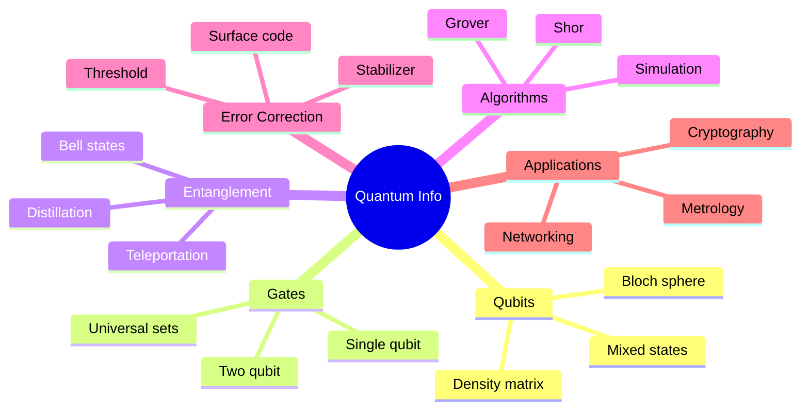
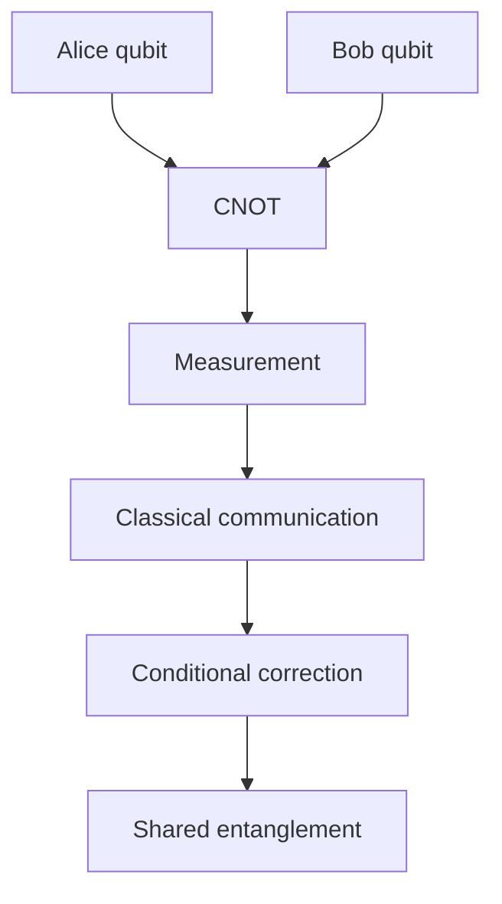
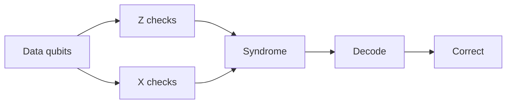
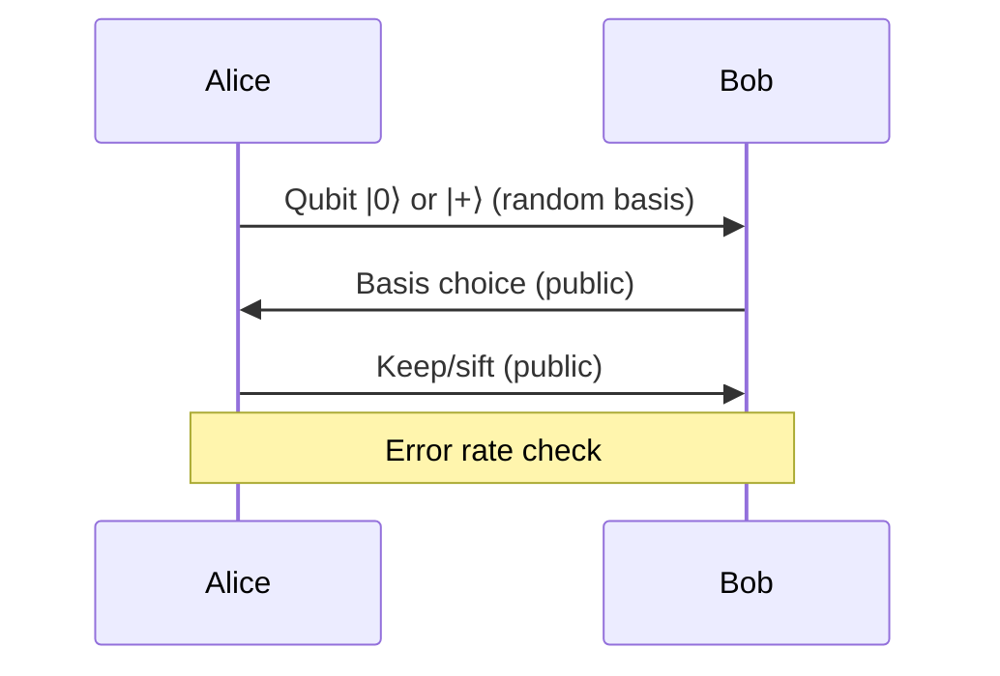

# MSPY 6910 — Quantum Information
> **MSc Physics Elective | HKUST MSPY 6910 | Quantum computation, information theory, entanglement, algorithms**  
> **Bilingual 深度自學檔案 · 中英對照**

---

## 問題 1：5 個核心心智模型

1. **Quantum information is physical** — 量子信息是物理的 (not mathematical abstraction, governed by quantum mechanics)
2. **Entanglement is resource** — 糾纏是資源 (enables teleportation, cryptography, computation)
3. **Quantum vs classical bits** — 量子比特 vs 經典比特 (superposition, entanglement, measurement collapse)
4. **Decoherence is the enemy** — 退相干是敵人 (environmental noise destroys quantum advantage)
5. **Quantum computers solve specific problems** — 量子計算機解決特定問題 (not universal speedup)

## 問題 2：3 個根本分歧

1. **Quantum vs classical supremacy**
   - QC provides exponential speedup for specific problems (factoring, simulation)
   - No speedup for generic problems
   - Classical algorithms often competitive

2. **Hardware approaches: trapped ions vs superconducting**
   - Trapped ions: long coherence, all-to-all connectivity, slow gates
   - Superconducting: fast gates, scalable, short coherence, nearest neighbor

3. **Fault-tolerant vs NISQ era**
   - Fault-tolerant: requires millions of physical qubits per logical qubit
   - NISQ: 50-1000 qubits, noisy, heuristic algorithms

## 問題 3：10 個深度問題

1. 給定 qubit $|\psi\rangle = \alpha|0\rangle + \beta|1\rangle$, derive Bloch sphere representation。
2. 解釋為什麼 Bell state $|\Phi^+\rangle = (|00\rangle + |11\rangle)/\sqrt{2}$ violates Bell inequality。
3. 為什麼 quantum gates must be unitary? What happens if you measure mid-circuit?
4. 給定 Toffoli gate, prove it's universal for classical computation but not quantum。
5. 為什麼 Shor's algorithm factors in polynomial time while classical requires exponential?
6. 給定 Grover's algorithm, 計算 search speedup from $N$ to $\sqrt{N}$ queries。
7. 解釋 quantum error correction: 為什麼 3-qubit flip code works?
8. 為什麼 surface code requires 2D nearest-neighbor layout?
9. 給定 depolarizing channel $\mathcal{E}(\rho) = (1-p)\rho + p\mathbb{I}/2$, derive fidelity。
10. 為什麼 quantum key distribution (BB84) is unconditionally secure?

## 深入 1：Quantum Bits & Gates
**Deep Dive I**

### Qubit Representation
State in 2D Hilbert space:
$$|\psi\rangle = \alpha|0\rangle + \beta|1\rangle, \quad |\alpha|^2 + |\beta|^2 = 1$$

Bloch sphere: $|\psi\rangle = \cos(\theta/2)|0\rangle + e^{i\phi}\sin(\theta/2)|1\rangle$

Density matrix: $\rho = \frac{1}{2}(I + \vec{r}\cdot\vec{\sigma})$, $|\vec{r}| \leq 1$

### Single-Qubit Gates
| Gate | Matrix | Effect |
|---|---|---|
| Pauli X | $\begin{pmatrix}0&1\\1&0\end{pmatrix}$ | Bit flip |
| Pauli Y | $\begin{pmatrix}0&-i\\i&0\end{pmatrix}$ | Y rotation |
| Pauli Z | $\begin{pmatrix}1&0\\0&-1\end{pmatrix}$ | Phase flip |
| Hadamard | $\frac{1}{\sqrt{2}}\begin{pmatrix}1&1\\1&-1\end{pmatrix}$ | Superposition |
| Phase | $\begin{pmatrix}1&0\\0&i\end{pmatrix}$ | Phase shift |

### Two-Qubit Gates
Controlled-NOT (CNOT):
$$\text{CNOT} = \begin{pmatrix}1&0&0&0\\0&1&0&0\\0&0&0&1\\0&0&1&0\end{pmatrix}$$

SWAP:
$$\text{SWAP} = \begin{pmatrix}1&0&0&0\\0&0&1&0\\0&1&0&0\\0&0&0&1\end{pmatrix}$$

### Universal Gate Set
- Any unitary can be decomposed into single-qubit + CNOT
- Clifford + T gates: efficient compilation possible
- $\{H, S, \text{CNOT}\}$ generates Clifford group

**Engineering implication:** Gate fidelity determines circuit depth possible

## 深入 2：Entanglement & Bell Tests
**Deep Dive II**

### Bell States
Four maximally entangled two-qubit states:
$$|\Phi^\pm\rangle = \frac{|00\rangle \pm |11\rangle}{\sqrt{2}}, \quad |\Psi^\pm\rangle = \frac{|01\rangle \pm |10\rangle}{\sqrt{2}}$$

Properties:
- $\rho_{\Phi^+} = |\Phi^+\rangle\langle\Phi^+|$ has purity 1
- Reduced density matrix: $\rho_A = \text{Tr}_B(\rho) = I/2$ (maximally mixed)

### CHSH Inequality
Classical bound: $|S| \leq 2$

Quantum value: $|S| \leq 2\sqrt{2}$ (Tsirelson bound)

CHSH parameter:
$$S = E(a,b) - E(a,b') + E(a',b) + E(a',b')$$

Bell operator: $B = \vec{a}\cdot\vec{\sigma} \otimes (\vec{b}\cdot\vec{\sigma} + \vec{b'}\cdot\vec{\sigma})$

Optimal measurement angles give $S = 2\sqrt{2}$.

### Lo-Phong Tam Inequalities
Generalization: $n$ settings, $m$ outcomes
Violations confirm non-locality.

**Engineering implication:** Bell tests rule out local hidden variable theories

## 深入 3：Quantum Algorithms
**Deep Dive III**

### Shor's Algorithm
Period finding: given $f(x) = a^x \mod N$, find period $r$.

Quantum Fourier transform:
$$|x\rangle \to \frac{1}{\sqrt{N}}\sum_y e^{2\pi ixy/N}|y\rangle$$

Circuit depth: $O((\log N)^2(\log\log N))$

Classical hardness: $O(e^{N^{1/3}})$ best known for general $N$.

### Grover's Algorithm
Search unstructured database: $N$ items, $M$ marked.

Oracle $O|x\rangle = (-1)^{f(x)}|x\rangle$ marks target.

Amplitude amplification: after $k$ iterations:
$$|\psi_k\rangle = \sin((2k+1)\theta)|w\rangle + \cos((2k+1)\theta)|\bar{w}\rangle$$

Optimal iterations: $k \approx \frac{\pi}{4}\sqrt{N/M}$

Speedup: $O(\sqrt{N})$ vs $O(N)$ classical.

### Quantum Simulation
Hamiltonian simulation via Trotter decomposition:
$$e^{-iHt} \approx \left(\prod_i e^{-iH_it/n}\right)^n$$

Complexity: $O(\text{poly}(\log N, t))$

**Engineering implication:** Quantum algorithms provide exponential/speedup for specific problems

## 深入 4：Quantum Error Correction
**Deep Dive IV**

### Three-Qubit Flip Code
Encode logical qubit: $|0_L\rangle = |000\rangle$, $|1_L\rangle = |111\rangle$

Error detection: measure parity $Z_1Z_2$, $Z_2Z_3$

Correction: majority vote

### Stabilizer Formalism
Stabilizer group $\mathcal{S}$: set of operators stabilizing code space.

$n$ qubits, $k$ logical qubits, $r = n-k$ syndrome bits.

Logical operators $\bar{X}, \bar{Z}$ commute with stabilizer, anticommute with each other.

### Surface Code
2D grid of qubits:
- Data qubits on vertices
- Syndrome qubits on plaquettes
- Nearest-neighbor only

Code distance $d$: requires $d^2$ physical qubits per logical qubit.

Threshold: $p < 1\%$ for fault-tolerant operation.

### Syndrome Measurement
Parity checks: $X$ checks measure $\prod X$ on plaquette
$Z$ checks measure $\prod Z$ on plaquette

Error correction: minimum weight perfect matching.

**Engineering implication:** Error correction enables scalable quantum computing

## 深入 5：Quantum Cryptography & Information Theory
**Deep Dive V**

### BB84 Protocol
Basis reconciliation:
1. Alice sends random bits in $Z$ or $X$ basis
2. Bob measures in random basis
3. Public discussion: keep only matching bases
4. Error check: sample of remaining bits

Security: $Eve$ measurement disturbs state, detectable error rate.

### Quantum Key Distribution
BB84 key rate (ideal channel):
$$r = 1 - H_2(e) - H_2(e)$$

Where $e$ is error rate, $H_2$ binary entropy.

Device-independent QKD: even with untrusted devices.

### Entropy & Information
von Neumann entropy:
$$S(\rho) = -\text{Tr}(\rho\log\rho)$$

Subadditivity:
$$S(\rho_{AB}) \leq S(\rho_A) + S(\rho_B)$$

Strong subadditivity:
$$S(\rho_{ABC}) + S(\rho_B) \leq S(\rho_{AB}) + S(\rho_{BC})$$

**Engineering implication:** Quantum cryptography offers information-theoretic security

## 自測 1：Bloch Sphere
**Answer:** $|\psi\rangle = \cos(\theta/2)|0\rangle + e^{i\phi}\sin(\theta/2)|1\rangle$, coordinates $(x,y,z) = (\sin\theta\cos\phi, \sin\theta\sin\phi, \cos\theta)$.  
**Engineering implication:** Visualizing single-qubit states

## 自測 2：Bell Inequality Violation
**Answer:** For $|\Phi^+\rangle$, $S = 2\sqrt{2} > 2$, exceeding classical bound.  
**Engineering implication:** Confirms nonlocality

## 自測 3：Measurement Collapse
**Answer:** Unitary preserves coherence. Mid-circuit measurement causes collapse, destroys superposition.  
**Engineering implication:** Circuit design must minimize mid-circuit measurements

## 自測 4：Toffoli Universality
**Answer:** Toffoli + Hadamard universal for quantum (can produce T gates). Classical: Toffoli alone universal for reversible classical computing.  
**Engineering implication:** Classical and quantum universality differ

## 自測 5：Shor Speedup
**Answer:** Period finding via QFT: $O((\log N)^3)$ quantum vs $O(e^{N^{1/3}})$ classical. Exponential speedup.  
**Engineering implication:** Threatens RSA encryption

## 自測 6：Grover Speedup
**Answer:** $\sqrt{N}$ queries vs $N/2$ classical. Quadratic speedup for search.  
**Engineering implication:** Generic search speedup, not exponential

## 自測 7：Three-Qubit Code
**Answer:** Corrects single bit flip. Measure syndrome, flip erroneous qubit.  
**Engineering implication:** First quantum error correcting code

## 自測 8：Surface Code Layout
**Answer:** 2D grid enables syndrome extraction with nearest-neighbor only. Distance $d$ needs $d^2$ qubits.  
**Engineering implication:** Most promising near-term approach

## 自測 9：Depolarizing Channel
**Answer:** $F = 1 - p(1 - 1/2) = 1 - p/2$. Fidelity decreases linearly with $p$.  
**Engineering implication:** Characterizes noise strength

## 自測 10：BB84 Security
**Answer:** Eve measurement in wrong basis causes detectable errors. Error rate $>0$ indicates eavesdropping.  
**Engineering implication:** Information-theoretic security possible

## 📊 Diagram 1: Quantum Information Map


## 📊 Diagram 2: Bell State Measurement


## 📊 Diagram 3: Grover Circuit
```mermaid
graph TD
    A[Initial |ψ⟩] --> B[H⊗n]
    B --> C[Oracle O]
    C --> D[Diffusion D]
    D --> E{Finished?}
    E -->|No| C
    E -->|Yes| F[Measure]
```

## 📊 Diagram 4: Surface Code


## 📊 Diagram 5: BB84 Protocol


## 深度總結 Deep Insights

1. **Quantum information is a physical resource** — governed by quantum mechanics, not classical intuition
   **量子信息是物理資源** — 受量子力學支配，不是經典直覺

2. **Entanglement enables everything** — teleportation, cryptography, computation all depend on it
   **糾纏使一切成為可能** — 隱形傳態、密碼學、計算都依賴它

3. **Error correction is essential** — noisy qubits need protection for scalable QC
   **錯誤糾正是必需的** — 噪聲量子比特需要保護才能擴展

4. **Specific problems get speedup** — not universal speedup, but transformative for factoring/simulation
   **特定問題獲得加速** — 不是通用加速，但對分解/模擬具有變革性

5. **Cryptography is being transformed** — quantum key distribution, post-quantum crypto
   **密碼學正在轉變** — 量子密鑰分發、後量子密碼學

---

**自學建議**
- 必讀: Nielsen & Chuang "Quantum Computation and Quantum Information"
- 配對: Preskill notes, Gottesman "Quantum Information" (graduate course)
- 工具: Qiskit, Cirq, Pennylane
- 產出: Implement Shor's algorithm for small $N$ on simulator
