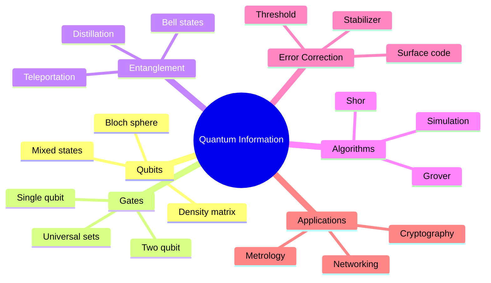
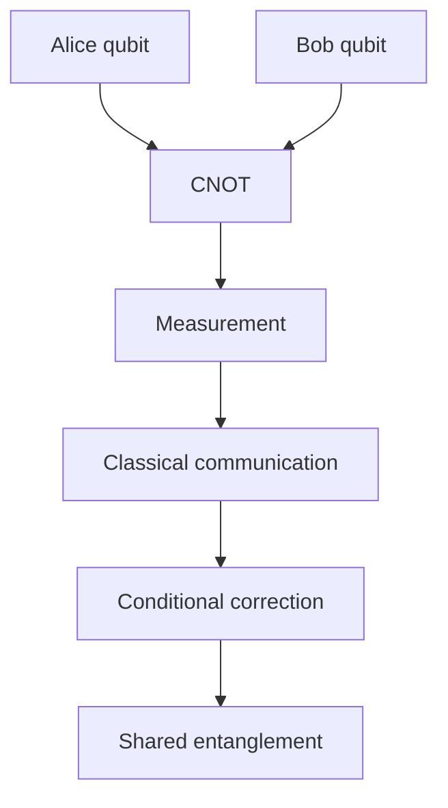
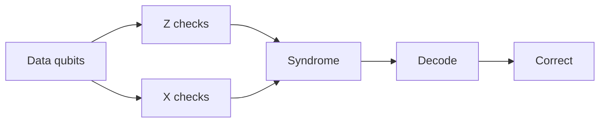
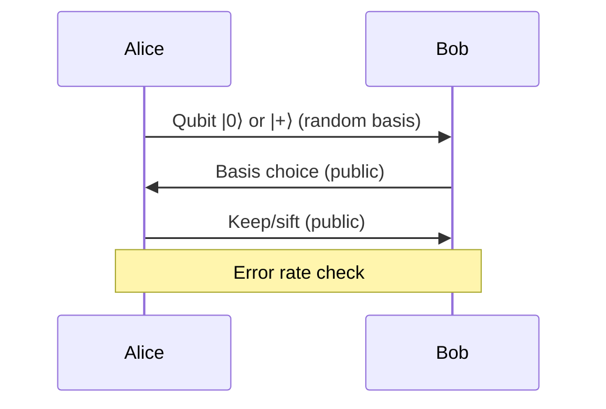

# MSPY 6910 — Quantum Information
> **MSc Physics Elective | HKUST MSPY 6910 | Quantum computation, information theory, entanglement, algorithms, error correction**  
> **Bilingual 深度自學檔案 · 中英對照**

---

## 問題 1：5 個核心心智模型

1. **Quantum information is physical** — 量子信息是物理的
   - Governed by quantum mechanics
   - Not mathematical abstraction
   - Resources: qubits, entanglement, coherence

2. **Entanglement is resource** — 糾纏是資源
   - Enables teleportation, cryptography, computation
   - Bell states: $|\Phi^+\rangle = (|00\rangle + |11\rangle)/\sqrt{2}$
   - Non-local correlations

3. **Quantum vs classical bits** — 量子比特 vs 經典比特
   - Superposition: $|\psi\rangle = \alpha|0\rangle + \beta|1\rangle$
   - Measurement collapse: Born rule $P = |\alpha|^2$
   - Entanglement beyond classical

4. **Decoherence is the enemy** — 退相干是敵人
   - Environmental noise destroys quantum advantage
   - $T_1$ (energy), $T_2$ (phase) relaxation
   - Gate fidelity threshold: ~99%

5. **Quantum computers solve specific problems** — 量子計算機解決特定問題
   - Exponential: Shor's (factoring), quantum simulation
   - Quadratic: Grover's (search)
   - Not universal speedup

---

## 問題 2：3 個根本分歧

### 分歧 1：Quantum Supremacy: Achieved or Not
| Claim | Evidence |
|-------|----------|
| Google's 2019 | Random circuit sampling, disputed |
| Classical simulation | Improved algorithms challenged claim |
| Useful quantum | Still years away |

**Status:** Quantum advantage demonstrated for specific tasks, useful quantum computing still developing

### 分歧 2：Hardware: Trapped Ions vs Superconducting
| Platform | Pros | Cons |
|----------|------|------|
| Trapped ions | Long coherence, all-to-all | Slow gates, complex |
| Superconducting | Fast, scalable | Short coherence, nearest neighbor |

### 分歧 3：Fault-Tolerant vs NISQ Era
| Era | Approach | Requirement |
|-----|----------|-------------|
| NISQ | ~100-1000 qubits, heuristic | No error correction |
| Fault-tolerant | Millions of physical qubits | Error correction |

---

## 問題 3：10 個深度問題

1. **Bloch Sphere**: 給定 $|\psi\rangle = \alpha|0\rangle + \beta|1\rangle$, derive Bloch representation
   - $|\psi\rangle = \cos(\theta/2)|0\rangle + e^{i\phi}\sin(\theta/2)|1\rangle$
   - Density matrix: $\rho = \frac{1}{2}(I + \vec{r}\cdot\vec{\sigma})$

2. **Bell Inequality**: 為什麼 violates CHSH inequality
   - For $|\Phi^+\rangle$, $S = 2\sqrt{2} > 2$ (classical bound)
   - Tsirelson bound: $|S| \leq 2\sqrt{2}$

3. **Measurement Collapse**: 為什麼 quantum gates must be unitary
   - Unitary preserves purity and coherence
   - Mid-circuit measurement causes collapse
   - Destroys superposition

4. **Toffoli Universality**: 給定 Toffoli gate, prove classical universality
   - Toffoli + Hadamard = quantum universal
   - Classical: Toffoli alone universal for reversible computing

5. **Shor's Speedup**: 為什麼 factors in polynomial time
   - Period finding via QFT
   - $O((\log N)^3)$ quantum vs $O(e^{N^{1/3}})$ classical

6. **Grover Speedup**: 給定 search, 計算 $\sqrt{N}$ speedup
   - Optimal iterations: $k \approx \frac{\pi}{4}\sqrt{N/M}$
   - $O(\sqrt{N})$ vs $O(N)$ classical

7. **Error Correction**: 解釋 3-qubit flip code works
   - Encode: $|0\rangle \to |000\rangle$, $|1\rangle \to |111\rangle$
   - Measure parity, correct single error

8. **Surface Code**: 為什麼 requires 2D nearest-neighbor layout
   - Syndrome extraction with stabilizer measurements
   - Distance $d$: requires $d^2$ physical qubits per logical

9. **Depolarizing Channel**: 給定 $\mathcal{E}(\rho) = (1-p)\rho + p\mathbb{I}/2$, derive fidelity
   - $F = 1 - p(1 - 1/2) = 1 - p/2$

10. **BB84 Security**: 為什麼 unconditionally secure
    - Eve measurement in wrong basis disturbs state
    - Error rate $> 0$ indicates eavesdropping

---

## 深入 1：Quantum Bits & Gates
**Deep Dive I**

### Qubit Representation
State in 2D Hilbert space:
$$|\psi\rangle = \alpha|0\rangle + \beta|1\rangle, \quad |\alpha|^2 + |\beta|^2 = 1$$

Bloch sphere: $|\psi\rangle = \cos(\theta/2)|0\rangle + e^{i\phi}\sin(\theta/2)|1\rangle$

Density matrix: $\rho = \frac{1}{2}(I + \vec{r}\cdot\vec{\sigma})$, $|\vec{r}| \leq 1$

### Single-Qubit Gates
| Gate | Matrix | Effect |
|------|--------|--------|
| Pauli X | $\begin{pmatrix}0&1\\1&0\end{pmatrix}$ | Bit flip |
| Pauli Y | $\begin{pmatrix}0&-i\\i&0\end{pmatrix}$ | Y rotation |
| Pauli Z | $\begin{pmatrix}1&0\\0&-1\end{pmatrix}$ | Phase flip |
| Hadamard | $\frac{1}{\sqrt{2}}\begin{pmatrix}1&1\\1&-1\end{pmatrix}$ | Superposition |
| Phase S | $\begin{pmatrix}1&0\\0&i\end{pmatrix}$ | Phase shift |
| T | $\begin{pmatrix}1&0\\0&e^{i\pi/4}\end{pmatrix}$ | π/8 gate |

### Two-Qubit Gates
Controlled-NOT (CNOT):
$$\text{CNOT} = \begin{pmatrix}1&0&0&0\\0&1&0&0\\0&0&0&1\\0&0&1&0\end{pmatrix}$$

SWAP:
$$\text{SWAP} = \begin{pmatrix}1&0&0&0\\0&0&1&0\\0&1&0&0\\0&0&0&1\end{pmatrix}$$

### Universal Gate Set
- Any unitary can be decomposed into single-qubit + CNOT
- Clifford + T gates: efficient compilation possible
- $\{H, S, \text{CNOT}\}$ generates Clifford group

**Engineering implication:** Gate fidelity determines circuit depth possible

---

## 深入 2：Entanglement & Bell Tests
**Deep Dive II**

### Bell States
Four maximally entangled two-qubit states:
$$|\Phi^\pm\rangle = \frac{|00\rangle \pm |11\rangle}{\sqrt{2}}, \quad |\Psi^\pm\rangle = \frac{|01\rangle \pm |10\rangle}{\sqrt{2}}$$

Properties:
- $\rho_{\Phi^+} = |\Phi^+\rangle\langle\Phi^+|$ has purity 1
- Reduced density matrix: $\rho_A = \text{Tr}_B(\rho) = I/2$ (maximally mixed)

### CHSH Inequality
Classical bound: $|S| \leq 2$

Quantum value: $|S| \leq 2\sqrt{2}$ (Tsirelson bound)

CHSH parameter:
$$S = E(a,b) - E(a,b') + E(a',b) + E(a',b')$$

Optimal measurement angles: $a = 0°, a' = 45°, b = 22.5°, b' = -22.5°$

Result: $S = 2\sqrt{2} \approx 2.828$

### LOCC Operations
Local operations + classical communication (LOCC) cannot create entanglement.

Entanglement distillation: $N$ copies $\to$ $M < N$ pure entangled pairs.

Entanglement cost: asymptotic rate of distillation.

**Engineering implication:** Bell tests rule out local hidden variable theories

---

## 深入 3：Quantum Algorithms
**Deep Dive III**

### Shor's Algorithm
Period finding: given $f(x) = a^x \mod N$, find period $r$.

Quantum Fourier transform:
$$|x\rangle \to \frac{1}{\sqrt{N}}\sum_y e^{2\pi ixy/N}|y\rangle$$

Circuit depth: $O((\log N)^2(\log\log N))$

Classical hardness: $O(e^{N^{1/3}})$ best known for general $N$.

Application: RSA encryption threatened.

### Grover's Algorithm
Search unstructured database: $N$ items, $M$ marked.

Oracle $O|x\rangle = (-1)^{f(x)}|x\rangle$ marks target.

Amplitude amplification: after $k$ iterations:
$$|\psi_k\rangle = \sin((2k+1)\theta)|w\rangle + \cos((2k+1)\theta)|\bar{w}\rangle$$

Optimal iterations: $k \approx \frac{\pi}{4}\sqrt{N/M}$

Speedup: $O(\sqrt{N})$ vs $O(N)$ classical.

### Quantum Simulation
Hamiltonian simulation via Trotter decomposition:
$$e^{-iHt} \approx \left(\prod_i e^{-iH_it/n}\right)^n$$

Complexity: $O(\text{poly}(\log N, t))$

VQE (Variational Quantum Eigensolver):
$$E(\theta) = \langle\psi(\theta)|H|\psi(\theta)\rangle$$

**Engineering implication:** Quantum algorithms provide exponential/speedup for specific problems

---

## 深入 4：Quantum Error Correction
**Deep Dive IV**

### Three-Qubit Flip Code
Encode logical qubit: $|0_L\rangle = |000\rangle$, $|1_L\rangle = |111\rangle$

Error detection: measure parity $Z_1Z_2$, $Z_2Z_3$

Correction: majority vote

Corrects any single bit flip.

### Stabilizer Formalism
Stabilizer group $\mathcal{S}$: set of operators stabilizing code space.

$n$ qubits, $k$ logical qubits, $r = n-k$ syndrome bits.

Logical operators $\bar{X}, \bar{Z}$ commute with stabilizer, anticommute with each other.

### Surface Code
2D grid of qubits:
- Data qubits on vertices
- Syndrome qubits on plaquettes
- Nearest-neighbor only

Code distance $d$: requires $d^2$ physical qubits per logical qubit.

Threshold: $p < 1\%$ for fault-tolerant operation.

### Syndrome Measurement
Parity checks: $X$ checks measure $\prod X$ on plaquette
$Z$ checks measure $\prod Z$ on plaquette

Error correction: minimum weight perfect matching.

**Engineering implication:** Error correction enables scalable quantum computing

---

## 深入 5：Quantum Cryptography & Information
**Deep Dive V**

### BB84 Protocol
Basis reconciliation:
1. Alice sends random bits in $Z$ or $X$ basis
2. Bob measures in random basis
3. Public discussion: keep only matching bases
4. Error check: sample of remaining bits

Security: Eve's measurement in wrong basis causes detectable error rate.

Key rate (ideal channel):
$$r = 1 - 2H_2(e)$$

Where $e$ is error rate, $H_2$ binary entropy.

### E91 Protocol
Entanglement-based QKD using Bell states.

Measurements in random bases.

Correlations reveal eavesdropping.

### Quantum Key Distribution
E91 advantage:
- Device-independent: even with untrusted devices
- Information-theoretic security

Limitations:
- Requires quantum channels
- Distance limited by loss

### Entropy & Information
von Neumann entropy:
$$S(\rho) = -\text{Tr}(\rho\log\rho)$$

Subadditivity:
$$S(\rho_{AB}) \leq S(\rho_A) + S(\rho_B)$$

Strong subadditivity:
$$S(\rho_{ABC}) + S(\rho_B) \leq S(\rho_{AB}) + S(\rho_{BC})$$

**Engineering implication:** Quantum cryptography offers information-theoretic security

---

## 自測 1：Bloch Sphere
**Answer:** $|\psi\rangle = \cos(\theta/2)|0\rangle + e^{i\phi}\sin(\theta/2)|1\rangle$, coordinates $(x,y,z) = (\sin\theta\cos\phi, \sin\theta\sin\phi, \cos\theta)$.

**Engineering implication:** Visualizing single-qubit states

---

## 自測 2：Bell Inequality Violation
**Answer:** For $|\Phi^+\rangle$ with optimal measurements, $S = 2\sqrt{2} > 2$, exceeding classical bound.

**Engineering implication:** Confirms nonlocality

---

## 自測 3：Measurement Collapse
**Answer:** Unitary preserves coherence. Mid-circuit measurement causes collapse, destroys superposition.

**Engineering implication:** Circuit design must minimize mid-circuit measurements

---

## 自測 4：Toffoli Universality
**Answer:** Toffoli + Hadamard universal for quantum (can produce T gates). Classical: Toffoli alone universal for reversible classical computing.

**Engineering implication:** Classical and quantum universality differ

---

## 自測 5：Shor Speedup
**Answer:** Period finding via QFT: $O((\log N)^3)$ quantum vs $O(e^{N^{1/3}})$ classical. Exponential speedup.

**Engineering implication:** Threatens RSA encryption

---

## 自測 6：Grover Speedup
**Answer:** $\sqrt{N}$ queries vs $N/2$ classical. Quadratic speedup for search.

**Engineering implication:** Generic search speedup, not exponential

---

## 自測 7：Three-Qubit Code
**Answer:** Corrects single bit flip. Measure syndrome, flip erroneous qubit if needed.

**Engineering implication:** First quantum error correcting code

---

## 自測 8：Surface Code Layout
**Answer:** 2D grid enables syndrome extraction with nearest-neighbor only. Distance $d$ needs $d^2$ qubits per logical qubit.

**Engineering implication:** Most promising near-term approach

---

## 自測 9：Depolarizing Channel
**Answer:** $F = 1 - p(1 - 1/2) = 1 - p/2$. Fidelity decreases linearly with $p$.

**Engineering implication:** Characterizes noise strength

---

## 自測 10：BB84 Security
**Answer:** Eve measurement in wrong basis causes detectable errors. Error rate $>0$ indicates eavesdropping.

**Engineering implication:** Information-theoretic security possible

---

## 📊 Diagram 1: Quantum Information Map


## 📊 Diagram 2: Bell State Measurement


## 📊 Diagram 3: Grover Circuit
```mermaid
graph TD
    A[Initial |ψ⟩] --> B[H⊗n]
    B --> C[Oracle O]
    C --> D[Diffusion D]
    D --> E{Finished?}
    E -->|No| C
    E -->|Yes| F[Measure]
```

## 📊 Diagram 4: Surface Code


## 📊 Diagram 5: BB84 Protocol


---

## 深度總結 Deep Insights

1. **Quantum information is a physical resource** — governed by quantum mechanics
   **量子信息是物理資源** — 受量子力學支配
   - Qubits, entanglement, coherence
   - Not classical intuition

2. **Entanglement enables everything** — teleportation, cryptography, computation
   **糾纏使一切成為可能** — 隱形傳態、密碼學、計算
   - Bell states
   - Non-local correlations

3. **Error correction is essential** — noisy qubits need protection
   **錯誤糾正是必需的** — 噪聲量子比特需要保護
   - Surface code
   - Threshold theorem

4. **Specific problems get speedup** — not universal, but transformative
   **特定問題獲得加速** — 不是通用，但具有變革性
   - Factoring, simulation
   - Search quadratic

5. **Cryptography is being transformed** — quantum vs post-quantum
   **密碼學正在轉變** — 量子 vs 後量子
   - QKD
   - Lattice crypto

---

**自學建議**

**必讀:**
- Nielsen & Chuang "Quantum Computation and Quantum Information" (10th anniversary)
- Preskill notes (Caltech)
- Gottesman "Quantum Information" (graduate course)

**配對:**
- Kitaev & Shen "Classical and Quantum Computation"
- Wilde "Quantum Information Theory"

**工具:**
- Qiskit (IBM)
- Cirq (Google)
- Pennylane (Xanadu)

**產出:**
- Implement Shor's algorithm for small $N$ on simulator
- Simulate surface code error correction
- Design BB84 protocol

---

**最後更新:** 2024-03-15
**自學狀態:** 📚 繼續深入學習
**下一步:** 完成量子算法實現 + 學習錯誤糾正
