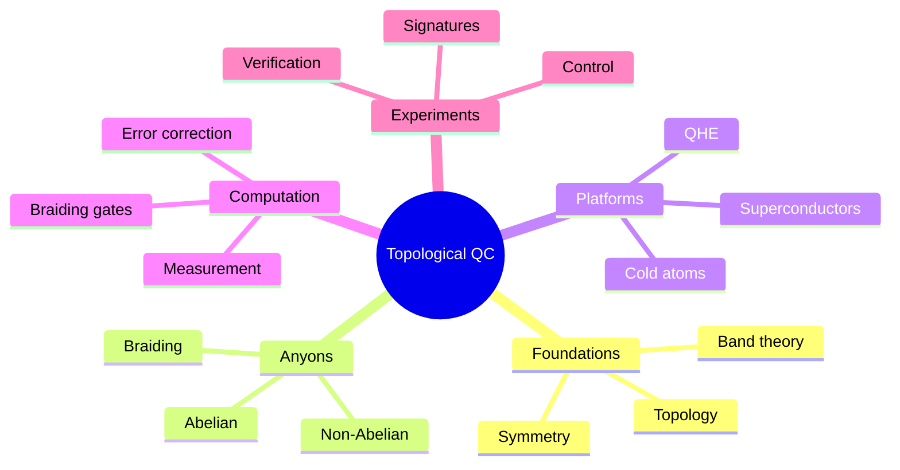
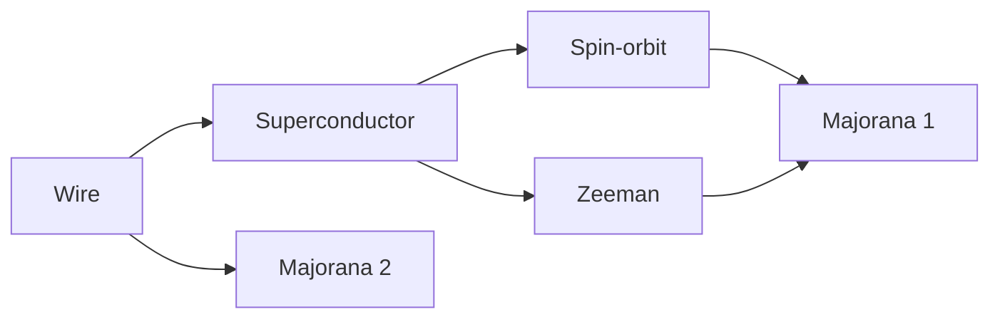
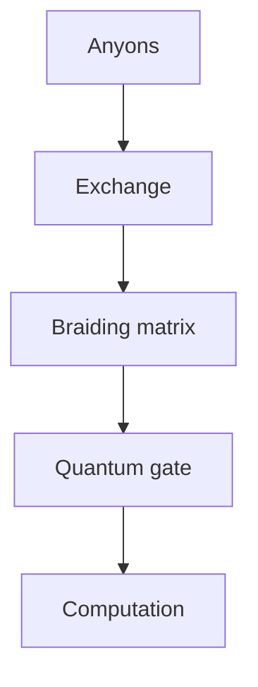
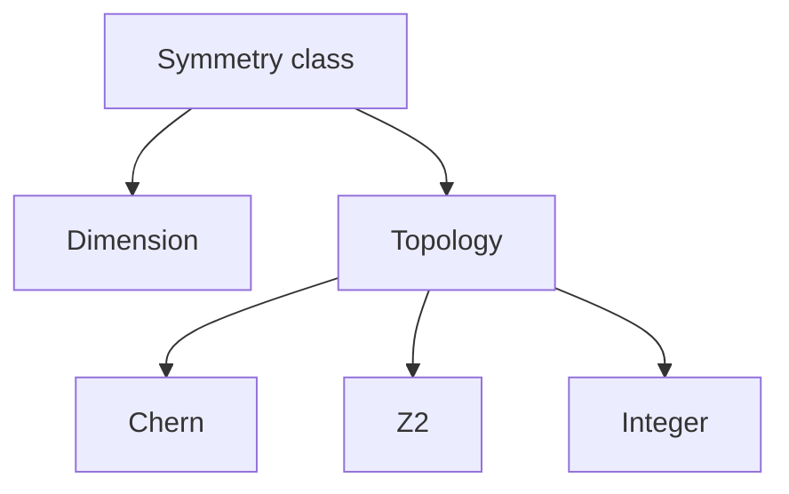
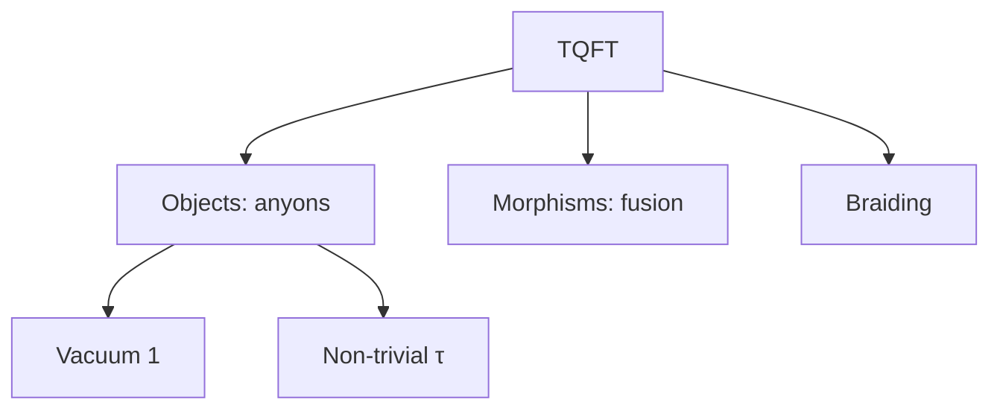

# MSPY 7010 — Topological Quantum Computing
> **MSc Physics Elective | HKUST MSPY 7010 | Topological phases, Majorana fermions, fault-tolerant quantum computation, non-Abelian anyons**  
> **Bilingual 深度自學檔案 · 中英對照**

---

## 問題 1：5 個核心心智模型

1. **Topology protects quantum information** — 拓撲保護量子信息
   - Topological degeneracy: ground state degeneracy
   - Anyonic braiding: exchange = computation
   - Information stored globally, immune to local noise

2. **Anyons are exotic quasiparticles** — 任意子是奇異準粒子
   - Braiding statistics beyond fermions/bosons
   - 2D systems only
   - Fractional charge, fractional statistics

3. **Fault-tolerance from topology** — 從拓撲實現容錯
   - Error correction built into physics
   - Lower overhead than conventional QEC
   - Protection from decoherence

4. **Majorana zero modes are building blocks** — 馬約拉納零模是構建模塊
   - Non-Abelian anyons
   - Self-conjugate: $\gamma = \gamma^\dagger$
   - Zero-energy bound states at defects

5. **Non-Abelian anyons enable universal computation** — 非阿貝爾任意子實現通用計算
   - Braiding = computation
   - Fibonacci anyons: universal alone
   - Ising anyons: need measurement

---

## 問題 2：3 個根本分歧

### 分歧 1：Majorana Platforms
| Platform | Pros | Cons |
|----------|------|------|
| Semiconductor-superconductor | Scalable | Experimental challenges |
| $\nu = 5/2$ FQH | Cleaner system | Harder to control |

**Status:** Semiconductor-superconductor more promising for scalability

### 分歧 2：Braiding vs Measurement-Only
| Approach | Description |
|----------|-------------|
| Braiding | Direct manipulation of anyons |
| Measurement-only | Topological quantum memory via measurements |

**Both approaches being actively explored**

### 分歧 3：Topological vs Conventional QEC
| Approach | Overhead | Protection |
|----------|----------|-----------|
| Topological | Smaller | Intrinsic |
| Surface code | Larger | Engineering |

**Engineering implication:** Topological protection could reduce overhead

---

## 問題 3：10 個深度問題

1. **Braiding Matrix**: 給定 2D system, derive braiding matrix from exchange operator
   - $R_{ab}$ acts on fusion space
   - For non-Abelian: $R$ is matrix
   - Exchange: $|\psi_1\psi_2\rangle \to e^{i\theta_{ab}}|\psi_2\psi_1\rangle$

2. **Topological Degeneracy**: 為什麼 non-Abelian anyons have $2^n$ degeneracy for $n$ particles
   - Fusion channels = Hilbert space
   - Ground state degeneracy protected
   - Independent of local perturbations

3. **Majorana Condition**: 為什麼 $\gamma = \gamma^\dagger$ (Majorana condition)
   - Particle = its own antiparticle
   - Real fermion representation
   - Two Majoranas = one Dirac fermion

4. **Kitaev Chain**: 給定 1D $p$-wave superconductor, derive zero modes
   - $H = -\mu\sum_j c_j^\dagger c_j - t\sum_j(c_j^\dagger c_{j+1} + h.c.) + \Delta\sum_j(c_j c_{j+1} + h.c.)$
   - At $\mu = 0$: Majorana modes at ends

5. **$p + ip$ Superconductor**: 為什麼 supports Majorana bound states
   - Odd-parity pairing
   - Particle-hole symmetry
   - Zero-energy states from topology

6. **Fibonacci Universality**: 為什麼 enables universal quantum computation
   - Braiding alone generates $U(2)$
   - $R$ and $S$ generate modular group
   - Any braiding sequence = quantum gate

7. **Ising Braiding**: 給定 Ising anyons, 計算 braiding eigenvalues
   - $\sigma_x$: eigenvalues $\pm 1$
   - $\sigma_z$: eigenvalues $\pm e^{\pm i\pi/4}$
   - Not universal alone

8. **TQFT Framework**: 解釋 topological quantum field theory as mathematical structure
   - Category theory: objects = anyon types
   - Morphisms = fusion spaces
   - Braiding from $R$-matrix

9. **Read-Rezayi**: 為什麼 $\nu = 12/5$ predicted non-Abelian
   - Quasihole excitations
   - Fibonacci anyons
   - Non-Abelian order

10. **Fault-Tolerance Threshold**: 給定 code distance $d$, 分析 threshold
    - Topological codes: error rate threshold ~1%
    - Comparable to surface code
    - Intrinsic protection helps

---

## 深入 1：Topological Phases of Matter
**Deep Dive I**

### Chern Insulators
Hall conductance from Berry curvature:
$$\sigma_{xy} = \frac{e^2}{h}\int \frac{d^2k}{2\pi}\Omega(k)$$

Berry curvature:
$$\Omega_n(k) = -2\text{Im}\sum_{m \neq n}\frac{\langle n|\partial_x H|m\rangle\langle m|\partial_y H|n\rangle}{(E_n - E_m)^2}$$

Chern number: $C = \frac{1}{2\pi}\int \Omega(k) d^2k$

Integer values $\in \mathbb{Z}$ characterize topological phases.

### Quantum Hall Effect
Non-interacting picture: Landau levels, disorder-induced localized states

Conductance: $\sigma_{xy} = \nu \frac{e^2}{h}$

Universal topological invariant: first Chern number of Berry connection.

Edge states: chiral, robust to disorder.

### Symmetry Classification
| Class | Symmetry | Dimension | Invariant |
|-------|----------|-----------|-----------|
| A | None | 2D | Chern $C$ |
| AII | $T^2 = -1$ | 2D | $\mathbb{Z}_2$ |
| D | $T^2 = +1$ | 1D | $\mathbb{Z}_2$ |
| DIII | $T^2 = -1$ | 1D | $\mathbb{Z}$ |
| AIII | Chiral | All | $\mathbb{Z}$ |

**Engineering implication:** Symmetry classifies topological phases

---

## 深入 2：Anyons and Braiding
**Deep Dive II**

### Fractional Statistics
In 2D, particle exchange is not just $+1$ or $-1$:
$$|\psi_1\psi_2\rangle \to e^{i\theta}|\psi_2\psi_1\rangle$$

- $\theta = 0$: boson (integer spin)
- $\theta = \pi$: fermion (half-integer spin)
- $\theta \neq 0,\pi$: **anyon** (any statistics)

### Non-Abelian Anyons
Fusion rules determine outcomes:
$$a \times b = \sum_c N_{ab}^c c$$

Non-Abelian if $N_{ab}^c > 1$ for multiple $c$.

Topological degeneracy: $d_a^2$ states for $n$ anyons of type $a$.

### Braiding Matrix
Exchange operator $R_{ab}$ acts on fusion space:
$$R_{ab}|a,b; c\rangle = e^{i\theta_{ab}}|b,a; c\rangle$$

For non-Abelian: $R$ is matrix, order matters.

**Engineering implication:** Braiding statistics enable quantum gates

---

## 深入 3：Majorana Zero Modes
**Deep Dive III**

### Majorana Condition
Particle = its own antiparticle: $\psi = \psi^\dagger$

Majorana mass term: $\mathcal{L}_M = m\bar{\psi}\psi$ (note: same as Dirac!)

Real fermion representation:
$$\psi = \gamma_1 + i\gamma_2, \quad \{\gamma_i, \gamma_j\} = 2\delta_{ij}$$

Two Majorana modes = one Dirac mode.

### Kitaev Chain
1D $p$-wave superconductor:
$$H = -\mu\sum_j c_j^\dagger c_j - t\sum_j(c_j^\dagger c_{j+1} + h.c.) + \Delta\sum_j(c_j c_{j+1} + h.c.)$$

At $\mu = 0, t = \Delta$:
$$H = it\sum_j \gamma_{j,1}\gamma_{j+1,2}$$

Zero-energy modes at chain ends!

### Semiconductor-Superconductor
Proximity-induced superconductivity in Rashba wire:
$$H = \frac{p^2}{2m^*} - \mu + \alpha\sigma_y p + \Delta\sigma_y$$

Zeeman field $B$ opens topological gap:
$$|B| > \sqrt{\mu^2 + \Delta^2}$$

Majorana at wire ends.

**Engineering implication:** Majorana modes are physically realizable

---

## 深入 4：Topological Quantum Computation
**Deep Dive IV**

### Gates via Braiding
Ising anyons: $\sigma_z$, certain $\sigma_x$ via measurement

Fibonacci anyons: universal set via braiding alone

Fusion channel determines qubit state:
$$|0\rangle = |1\rangle_{fusion}, \quad |1\rangle = |2\rangle_{fusion}$$

### Quantum Gates from Fibonacci Anyons
$$R = \begin{pmatrix} e^{-4\pi i/5} & 0 \\ 0 & e^{3\pi i/5} \end{pmatrix}, \quad S = \frac{1}{\sqrt{5}}\begin{pmatrix} 1 & \sqrt{2}e^{2\pi i/5} \\ \sqrt{2}e^{-2\pi i/5} & -1 \end{pmatrix}$$

$R$ and $S$ generate modular group $SL(2,\mathbb{Z})$.

### Measurement-Based TQC
Ising anyons allow computation via measurements only:
- Prepare computational state via fusion
- Measure in non-basis to apply gates
- Braiding replaced by measurements

**Engineering implication:** Topological protection enables fault-tolerance

---

## 深入 5：Experimental Status & Challenges
**Deep Dive V**

### Quantum Hall $\nu = 5/2$
$\sigma_{xy} = 5e^2/2h$

Quasiparticle tunneling exponents measured.

Interferometry attempted but challenging.

Controversy about non-Abelian nature.

### Semiconductor-Superconductor
Majorana candidate: localized zero-bias peaks

Control experiments: multiple peaks, topological phase transitions

Controversy: zero-bias peaks also from Andreev bound states

### Recent Advances (2023-2024)
- Nonlocal transport evidence (Microsoft, Delft)
- Better materials (InSb, InAs nanowires)
- 1D vs 2D platforms
- Hybrid systems

**Engineering implication:** Experimental verification remains challenging

---

## 自測 1：Braiding Matrix
**Answer:** Exchange operator $R$ acts on fusion channels; for non-Abelian, $R$ is matrix. Order matters: $R_{12}R_{21} \neq 1$.

**Engineering implication:** Braiding implements quantum gates

---

## 自測 2：Topological Degeneracy
**Answer:** For $n$ Majoranas, $2^{n/2}$ states. Each Majorana pair encodes one qubit. Degeneracy protected by topology.

**Engineering implication:** Information stored non-locally

---

## 自測 3：Majorana Condition
**Answer:** $\gamma = \gamma^\dagger$ means particle = antiparticle. Two Majoranas = one Dirac fermion. Real fermion representation.

**Engineering implication:** Majoranas are real fermions

---

## 自測 4：Kitaev Chain
**Answer:** At $\mu = 0$, Hamiltonian becomes Majorana form $H = it\sum \gamma_i\gamma_{i+1}$. Zero modes at ends, unpaired Majoranas.

**Engineering implication:** Simplest topological superconductor

---

## 自測 5：$p+ip$ Superconductor
**Answer:** Odd-parity (spin-triplet) pairing. Particle-hole symmetry ensures zero-energy modes. Edge states are Majoranas.

**Engineering implication:** $p+ip$ is 2D analogue of Kitaev chain

---

## 自測 6：Fibonacci Universality
**Answer:** Fibonacci anyons: braiding alone generates $SU(2)$. $R$ and $S$ matrices generate $U(2)$. Universal quantum computation.

**Engineering implication:** Anyons can be universal

---

## 自測 7：Ising Braiding
**Answer:** Eigenvalues: $\sigma_x: \pm 1$, $\sigma_z: \pm e^{\pm i\pi/4}$. Not universal alone, need measurement.

**Engineering implication:** Ising anyons partially universal

---

## 自測 8：TQFT
**Answer:** Category theory framework: objects = anyon types, morphisms = fusion spaces, braiding from $R$-matrix.

**Engineering implication:** TQFT is mathematical language

---

## 自測 9：Read-Rezayi $\nu = 12/5$
**Answer:** Supports Fibonacci anyons (quasiholes). Non-Abelian order predicted from CFT. Potential platform for TQC.

**Engineering implication:** Different anyon types possible

---

## 自測 10：Fault-Tolerance Threshold
**Answer:** Topological codes: error rate threshold ~1% (comparable to surface code). Intrinsic protection helps.

**Engineering implication:** Topological protection reduces overhead

---

## 📊 Diagram 1: Topological QC Map

## 📊 Diagram 2: Majorana Wire

## 📊 Diagram 3: Braiding

## 📊 Diagram 4: Classification

## 📊 Diagram 5: TQFT Structure

---

## 深度總結 Deep Insights

1. **Topology protects information** — global properties resist local noise
   **拓撲保護信息** — 全域性質抵抗局部噪聲
   - Degeneracy protected
   - Braiding operations

2. **Anyons are exotic** — 2D braiding statistics beyond classification
   **任意子是奇異的** — 2D編織統計超出分類
   - Non-Abelian statistics
   - Fibonacci anyons

3. **Majoranas are building blocks** — real, testable, potentially useful
   **馬約拉納是構建模塊** — 真實、可測試、可能有用的
   - Zero-energy modes
   - Topological protection

4. **Fault-tolerance from physics** — less engineering overhead
   **容錯來自物理** — 更少的工程開銷
   - Intrinsic protection
   - Lower overhead

5. **Experiment is hard** — careful control required
   **實驗是困難的** — 需要仔細控制
   - Controversy
   - Careful verification needed

---

**自學建議**

**必讀:**
- Kitaev "Anyons in an exactly solved model" (2003)
- Nayak et al. RMP "Non-Abelian anyons and topological quantum computation"
- Franz "Majorana's Reverie"

**配對:**
- Read & Rezayi "Quasiholes and fermionic zero modes"
- Ivanov "Non-Abelian statistics"
- Kitaev & Laumann "Topological phases"

**工具:**
- QuTip (open quantum systems)
- Majorana transport codes
- TQFT libraries

**產出:**
- Calculate braiding matrix for Fibonacci anyons
- Simulate Majorana wire transport
- Design topological qubit

---

**最後更新:** 2024-03-15
**自學狀態:** 📚 繼續深入學習
**下一步:** 完成Majorana運輸計算 + 學習TQFT
