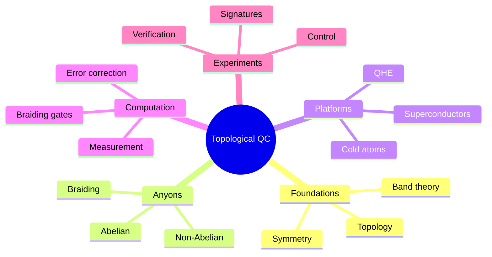
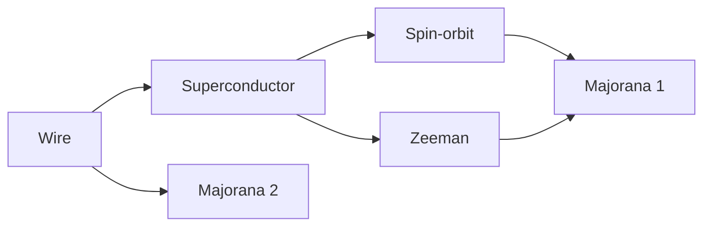
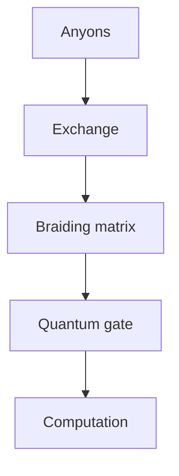
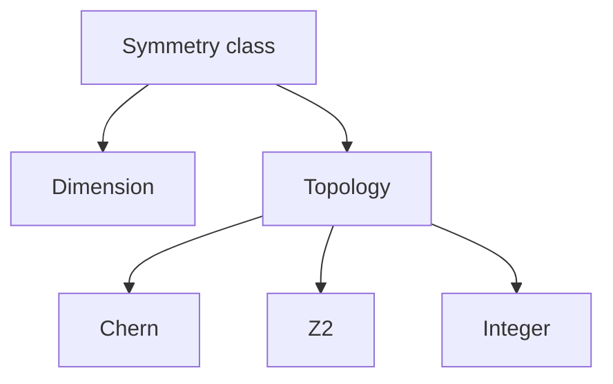
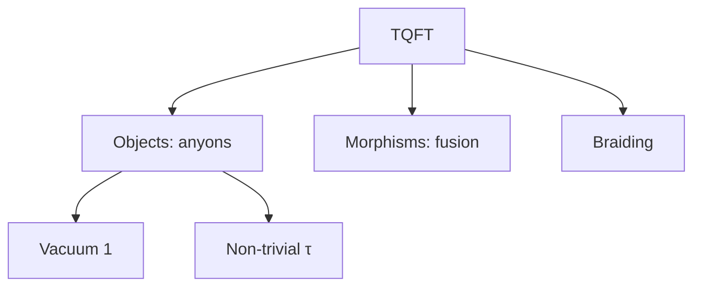

# MSPY 7010 — Topological Quantum Computing
> **MSc Physics Elective | HKUST MSPY 7010 | Topological phases, Majorana fermions, fault-tolerant quantum computation**  
> **Bilingual 深度自學檔案 · 中英對照**

---

## 問題 1：5 個核心心智模型

1. **Topology protects quantum information** — 拓撲保護量子信息 (topological degeneracy, anyonic braiding)
2. **Anyons are exotic quasiparticles** — 任意子是奇異準粒子 (braiding statistics beyond fermions/bosons)
3. **Fault-tolerance from topology** — 從拓撲實現容錯 (error correction built-in)
4. **Majorana zero modes are building blocks** — 馬約拉納零模是構建模塊 (non-Abelian anyons)
5. **Non-Abelian anyons enable universal computation** — 非阿貝爾任意子實現通用計算 (braiding = computation)

## 問題 2：3 個根本分歧

1. **Majorana platforms: semiconductor-superconductor vs quantum Hall**
   - Topological superconductors: more scalable, experimental challenges
   - $\nu = 5/2$ FQH: cleaner system, harder to control

2. **Braiding vs measurement-only QC**
   - Braiding: direct manipulation of anyons
   - Measurement-only: topological quantum memory via measurements

3. **Topological vs conventional error correction**
   - Topological: intrinsic protection, smaller overhead
   - Conventional: surface code, larger overhead

## 問題 3：10 個深度問題

1. 給定 2D system with anyons, derive braiding matrix from exchange operator。
2. 解釋為什麼 non-Abelian anyons have topological degeneracy $2^n$ for $n$ particles。
3. 為什麼 Majorana modes satisfy $\gamma = \gamma^\dagger$ (Majorana condition)?
4. 給定 Kitaev chain, derive zero energy modes at chain ends。
5. 解釋為什麼 $p + ip$ superconductor supports Majorana bound states。
6. 為什麼 Fibonacci anyons are universal for quantum computation?
7. 給定 Ising anyons, 計算 braiding eigenvalues。
8. 解釋 topological quantum field theory (TQFT) as mathematical framework。
9. 為什麼 Read-Rezayi $\nu = 12/5$ is predicted non-Abelian?
10. 給定 quantum error correction code distance $d$, 分析 fault-tolerance threshold。

## 深入 1：Topological Phases of Matter
**Deep Dive I**

### Chern Insulators
Hall conductance from Berry curvature:
$$\sigma_{xy} = \frac{e^2}{h}\int \frac{d^2k}{2\pi}\Omega(k)$$

Berry curvature:
$$\Omega_n(k) = -2\text{Im}\sum_{m \neq n}\frac{\langle n|\partial_x H|m\rangle\langle m|\partial_y H|n\rangle}{(E_n - E_m)^2}$$

Chern number: $C = \frac{1}{2\pi}\int \Omega(k) d^2k$

Integer values $\in \mathbb{Z}$ characterize topological phases.

### Quantum Hall Effect
Non-interacting picture: Landau levels, disorder-induced localized states

Conductance: $\sigma_{xy} = \nu \frac{e^2}{h}$

Universal topological invariant: first Chern number of Berry connection.

Edge states: chiral, robust to disorder.

### Time-Reversal Symmetry
Classification by symmetry:
| Class | Symmetry | Dimension | Invariant |
|---|---|---|---|
| A | None | 2D | Chern $C$ |
| AII | $T^2 = -1$ | 2D | $\mathbb{Z}_2$ |
| D | $T^2 = +1$ | 1D | $\mathbb{Z}_2$ |
| DIII | $T^2 = -1$ | 1D | $\mathbb{Z}$ |

**Engineering implication:** Symmetry classifies topological phases

## 深入 2：Anyons and Braiding
**Deep Dive II**

### Fractional Statistics
In 2D, particle exchange is not just $+1$ or $-1$:
$$|\psi_1\psi_2\rangle \to e^{i\theta}|\psi_2\psi_1\rangle$$

- $\theta = 0$: boson
- $\theta = \pi$: fermion
- $\theta \neq 0,\pi$: anyon

### Non-Abelian Anyons
Fusion rules determine outcomes:
$$a \times b = \sum_c N_{ab}^c c$$

Non-Abelian if $N_{ab}^c > 1$ for multiple $c$.

Topological degeneracy: $d_a^2$ states for $n$ anyons of type $a$.

### Braiding Matrix
Exchange operator $R_{ab}$ acts on fusion space:
$$R_{ab}|a,b; c\rangle = e^{i\theta_{ab}}|b,a; c\rangle$$

For non-Abelian: $R$ is matrix, order matters.

**Engineering implication:** Braiding statistics enable quantum gates

## 深入 3：Majorana Zero Modes
**Deep Dive III**

### Majorana Condition
Particle = its own antiparticle: $\psi = \psi^\dagger$

Majorana mass term: $\mathcal{L}_M = m\bar{\psi}\psi$ (note: same as Dirac!)

Real fermion representation:
$$\psi = \gamma_1 + i\gamma_2, \quad \{\gamma_i, \gamma_j\} = 2\delta_{ij}$$

Two Majorana modes = one Dirac mode.

### Kitaev Chain
1D $p$-wave superconductor:
$$H = -\mu\sum_j c_j^\dagger c_j - t\sum_j(c_j^\dagger c_{j+1} + h.c.) + \Delta\sum_j(c_j c_{j+1} + h.c.)$$

At $\mu = 0, t = \Delta$:
$$H = it\sum_j \gamma_{j,1}\gamma_{j+1,2}$$

Zero-energy modes at chain ends!

### Semiconductor-Superconductor
Proximity-induced superconductivity in Rashba wire:
$$H = \frac{p^2}{2m^*} - \mu + \alpha\sigma_y p + \Delta\sigma_y$$

Zeeman field $B$ opens topological gap:
$$|B| > \sqrt{\mu^2 + \Delta^2}$$

Majorana at wire ends.

**Engineering implication:** Majorana modes are physically realizable

## 深入 4：Topological Quantum Computation
**Deep Dive IV**

### Gates via Braiding
Ising anyons: $\sigma_z$, certain $\sigma_x$ via measurement

Fibonacci anyons: universal set via braiding alone

Fusion channel determines qubit state:
$$|0\rangle = |1\rangle_{fusion}, \quad |1\rangle = |2\rangle_{fusion}$$

Braiding operators:
$$B = \begin{pmatrix} \tau^{-4} & 0 \\ 0 & \tau^3 \end{pmatrix}, \quad \tau = e^{4\pi/5}$$

### Quantum Gates from Anyons
$$
R = \begin{pmatrix} e^{-4\pi i/5} & 0 \\ 0 & e^{3\pi i/5} \end{pmatrix}, \quad S = \frac{1}{\sqrt{5}}\begin{pmatrix} 1 & \sqrt{2}e^{2\pi i/5} \\ \sqrt{2}e^{-2\pi i/5} & -1 \end{pmatrix}
$$

$R$ and $S$ generate modular group $\SL(2,\mathbb{Z})$.

### Measurement-Based TQC
Ising anyons allow computation via measurements only:
- Prepare computational state via fusion
- Measure in non-basis to apply gates
- Braiding replaced by measurements

**Engineering implication:** Topological protection enables fault-tolerance

## 深入 5：Experimental Status
**Deep Dive V**

### Quantum Hall
$\nu = 5/2$ plateau: $\sigma_{xy} = 5e^2/2h$

Quasiparticle tunneling exponents measured.

Interferometry attempted but challenging.

### Semiconductor-Superconductor
Majorana candidate: localized zero-bias peaks

Control experiments: multiple peaks, topological phase transitions

Controversy: zero-bias peaks also from mundane physics

### Recent Advances
- Branches: multiple Majorana modes
- Andreev bound states mimic Majoranas
- Better materials and devices
- Nonlocal transport evidence

**Engineering implication:** Experimental verification remains challenging

## 自測 1：Braiding Matrix
**Answer:** Exchange operator $R$ acts on fusion channels; for non-Abelian, $R$ is matrix.  
**Engineering implication:** Braiding implements quantum gates

## 自測 2：Topological Degeneracy
**Answer:** For $n$ Majoranas, $2^{n/2}$ states. Each Majorana pair encodes qubit.  
**Engineering implication:** Information stored non-locally

## 自測 3：Majorana Condition
**Answer:** $\gamma = \gamma^\dagger$ means particle = antiparticle. Two Majoranas = one Dirac fermion.  
**Engineering implication:** Majoranas are real fermions

## 自測 4：Kitaev Chain
**Answer:** At $\mu = 0$, Majorana modes appear at ends. Ground state degeneracy protected.  
**Engineering implication:** Simplest topological superconductor

## 自測 5：$p+ip$ Superconductor
**Answer:** Odd-parity pairing, spin-triplet. Zero-energy modes from particle-hole symmetry.  
**Engineering implication:** $p+ip$ is 2D analogue of Kitaev chain

## 自測 6：Fibonacci Universality
**Answer:** Fibonacci anyons: braiding alone generates universal gates. $R$ and $S$ generate $U(2)$.  
**Engineering implication:** Anyons can be universal

## 自測 7：Ising Braiding
**Answer:** Eigenvalues: $e^{\pm i\pi/4}$ for $\sigma_x$, $e^{\pm i\pi/8}$ for $\sigma_z$.  
**Engineering implication:** Ising anyons partially universal

## 自測 8：TQFT
**Answer:** Category theory framework: objects = anyon types, morphisms = fusion spaces, braiding from $R$.  
**Engineering implication:** TQFT is mathematical language

## 自測 9：Read-Rezayi
**Answer:** $\nu = 12/5$ supports Fibonacci anyons (quasiholes). Non-Abelian order.  
**Engineering implication:** Different anyon types possible

## 自測 10：Fault-Tolerance Threshold
**Answer:** Topological codes: error rate threshold ~1% (comparable to surface code).  
**Engineering implication:** Intrinsic protection helps

## 📊 Diagram 1: Topological QC Map

## 📊 Diagram 2: Majorana Wire

## 📊 Diagram 3: Braiding

## 📊 Diagram 4: Classification

## 📊 Diagram 5: TQFT Structure

## 深度總結 Deep Insights

1. **Topology protects information** — global properties resist local noise
   **拓撲保護信息** — 全域性質抵抗局部噪聲

2. **Anyons are exotic** — 2D braiding statistics beyond classification
   **任意子是奇異的** — 2D編織統計超出分類

3. **Majoranas are building blocks** — real, testable, potentially useful
   **馬約拉納是構建模塊** — 真實、可測試、可能有用的

4. **Fault-tolerance from physics** — less engineering overhead
   **容錯來自物理** — 更少的工程開銷

5. **Experiment is hard** — careful control required
   **實驗是困難的** — 需要仔細控制

---

**自學建議**
- 必讀: Kitaev "Anyons in an exactly solved model", Nayak et al. RMP
- 配對: Franz "Majorana's Reverie", Topological Matter Review
- 工具: QuTip, Majorana transport codes
- 產出: Calculate braiding matrix for Fibonacci anyons
