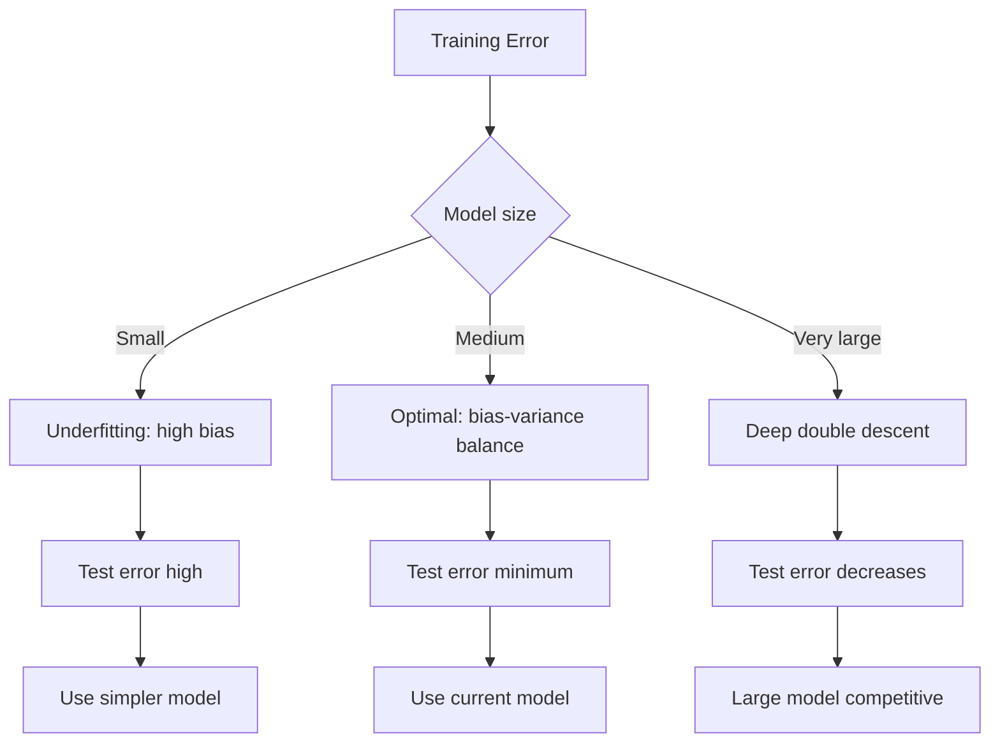
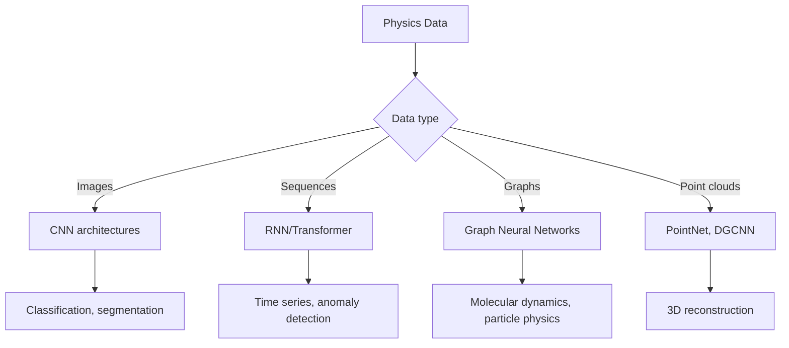
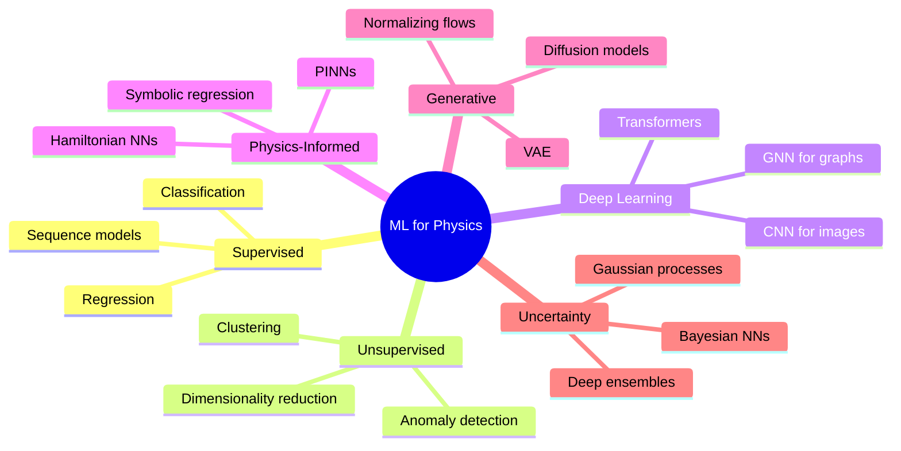
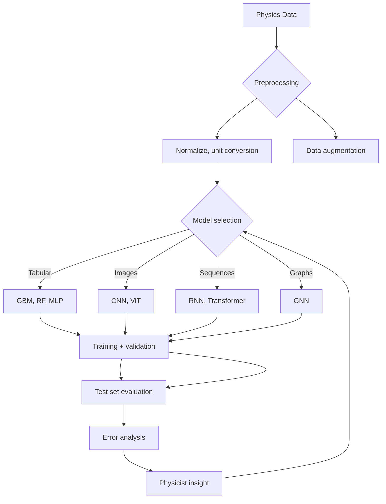
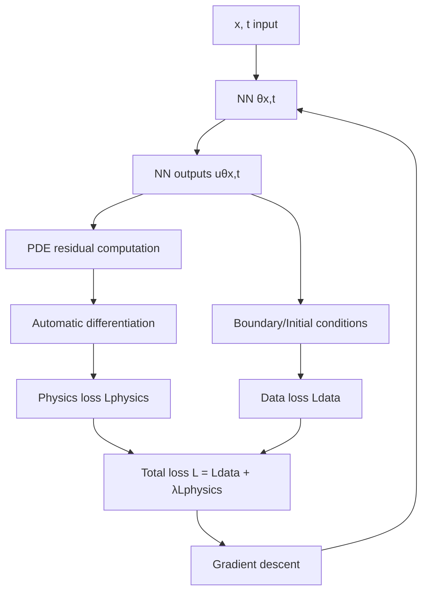
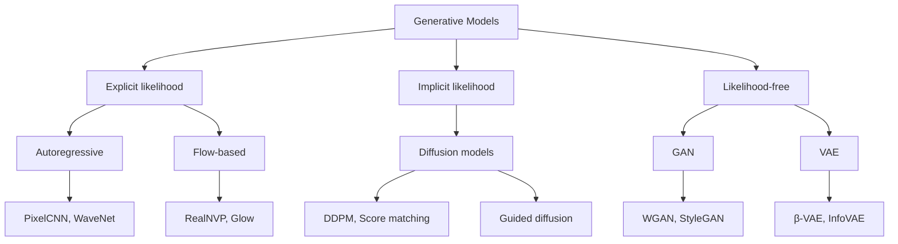
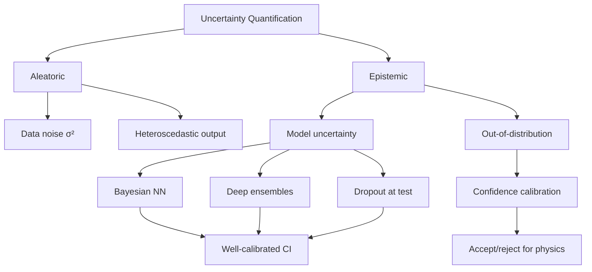

# MSPY 5310 — Machine Learning for Physics
> **MSc Data-Driven Physics | HKUST MSPY 5310 | Neural networks, regression, classification, deep learning, physics-informed ML**  
> **Bilingual 深度自學檔案 · 中英對照**

---

## 問題 1：5 個核心心智模型

1. **ML = function approximation from data** — given inputs $\vec{x}$ and outputs $y$, learn $f(\vec{x}; \vec{\theta}) \approx y$ without specifying physical form; neural networks = universal approximators (Hornik et al. 1989, *Neural Networks*)

2. **Physics constraints encode inductive bias** — unlike black-box ML, physics-informed neural networks (PINNs) embed conservation laws, symmetries, and known equations as regularization, dramatically reducing data requirements (Raissi et al. 2019, *J. Comp. Phys.*)

3. **Bias-variance tradeoff governs generalization** — underfitting (high bias) vs overfitting (high variance); the sweet spot minimizes validation error, not training error; double descent replaces the classic U-curve (Belkin et al. 2019, *PNAS*)

4. **Likelihood = foundation of statistical inference** — Neyman-Pearson lemma proves that likelihood ratio tests are optimal; binary cross-entropy is negative log-likelihood of Bernoulli; logistic regression = MLE with sigmoid link (Cox 1961, *Analysis of Binary Data*)

5. **Neural networks learn representations** — each layer learns increasingly abstract features; CNNs exploit spatial translation symmetry; attention learns long-range dependencies without fixed receptive field (Vaswani et al. 2017, *NeurIPS*)

---

## 問題 2：3 個根本分歧

### 分歧 1：Interpretability vs Accuracy
| Aspect | Black-box Deep Learning | Physics-Informed ML |
|--------|----------------------|-------------------|
| Accuracy | SOTA on many benchmarks | May lag on data-rich tasks |
| Interpretability | Low (hidden layers opaque) | High (physics constraints visible) |
| Data needs | Millions of examples | Thousands sufficient |
| Trust | Low in safety-critical | High in scientific contexts |
| Examples | AlphaFold3 (protein) | PINNs (PDE solving) |
| Proponents | Google DeepMind | Caltech, MIT |

**Evidence:** AlphaFold2 (2020) achieved near-experimental accuracy in protein structure prediction without explicit physics; PINNs solve inverse problems in fluid dynamics with < 1000 data points.

### 分歧 2：Symbolic Regression vs Neural Networks
| Aspect | Symbolic Regression (SR) | Neural Networks |
|--------|------------------------|----------------|
| Output | Interpretable formula | Opaque weights |
| Sample efficiency | Very high | Moderate to low |
| Search space | Infinite symbolic expressions | Fixed architecture |
| Noise robustness | Moderate | High |
| Scalability | Limited to simple systems | Excellent |
| Tools | Eureqa, PySR | PyTorch, JAX |

**Evidence:** Schmidt & Lipson (2009) discovered conservation laws from experimental data using SR; Udrescu & Tegmark (2020, *SciPost*) showed AI can rediscover Lagrangian mechanics.

### 分歧 3：Bayesian Deep Learning vs Point Estimates
| Aspect | Bayesian DL | Point Estimate DL |
|--------|-------------|-----------------|
| Uncertainty | Full posterior | Single weights |
| Overfitting | Natural regularization | Requires dropout/weight decay |
| Compute | $O(N)$ chains | Single forward pass |
| Calibration | Well-calibrated | Often overconfident |
| Examples | McGill et al. 2022 | Standard practice |

---

## 問題 3：10 個深度問題

1. 為什麼 neural networks 可以 approximate 任何連續函數？解釋 Universal Approximation Theorem 的假設和局限性 (Hornik 1991)。

2. 給定 physics-informed loss function $\mathcal{L} = \mathcal{L}_{data} + \lambda \mathcal{L}_{physics}$，推導點樣用自動微分 encoding 物理守恆定律 (Raissi et al. 2019)。

3. 為什麼 gradient descent 在 high-dimensional loss landscapes 有效地 work？解釋 why SGD escapes sharp minima。

4. 給定 CNN architecture，解釋點樣 translation invariance 來自 weight sharing 和 pooling 的物理意義。

5. 為什麼 ResNet 的 skip connections 允許 training deeper networks？推導 gradient flow through skip connections。

6. 給定 transformer architecture，解釋 self-attention mechanism 的 $O(n^2)$ complexity 以及點樣用 sparse attention 降低。

7. 為什麼 generative models (VAE, diffusion) 在 physics simulation 特別有用？討論 likelihood-free inference 和 Simulator-Based Inference。

8. 解釋 Gaussian Process 作為 uncertainty quantification tool 的 advantage over neural networks。

9. 為什麼 Bayesian optimization 適用於實驗設計？推導 expected improvement acquisition function。

10. 給定 physics-informed neural network for solving Schrödinger equation，設計網絡架構和 loss function 以 enforce boundary conditions。

---

## 深入 1：Supervised Learning Foundations
**Deep Dive I**

### The Physics of Learning

**Training = optimization:**
$$\hat{\theta} = \arg\min_\theta \frac{1}{N}\sum_{i=1}^N \mathcal{L}(f(\vec{x}_i;\theta), y_i) + \lambda R(\theta)$$

**Loss functions by physics:**
| Physics context | Loss | Notes |
|----------------|------|-------|
| Regression (Gaussian noise) | MSE: $\sum(y_i - \hat{y}_i)^2$ | MLE for constant variance |
| Classification | Cross-entropy: $-[y\log\hat{y} + (1-y)\log(1-\hat{y})]$ | Bernoulli likelihood |
| Poisson counting | Negative log-likelihood | Count data |
| Time series | $\ell_2$ on residuals | AR model |
| PDE solving | Residual + BC + IC | PINN |

### Generalization: Bias-Variance Decomposition

$$\text{MSE} = \underbrace{(\bar{f}(\vec{x}) - f(\vec{x}))^2}_{\text{Bias}^2} + \underbrace{\mathbb{E}[(f(\vec{x}) - \bar{f}(\vec{x}))^2]}_{\text{Variance}} + \underbrace{\sigma^2}_{\text{Noise}}$$

| Model | Bias | Variance | Typical behavior |
|-------|------|---------|----------------|
| Linear regression | High | Low | Underfits |
| Neural network (shallow) | Moderate | Moderate | Balanced |
| Deep network (no reg) | Low | High | Overfits |
| Deep + dropout/weight decay | Low | Moderate | Good |

### Double Descent (Belkin et al. 2019)

Classical expectation: U-shaped test error curve.

Modern finding: For very large models, test error decreases again (interpolation threshold).



---

## 深入 2：Neural Network Architectures for Physics
**Deep Dive II**

### Feed-Forward Networks (MLP)

$$f(\vec{x}) = \sigma(\vec{W}_L \sigma(\vec{W}_{L-1} \cdots \sigma(\vec{W}_1 \vec{x} + \vec{b}_1) \cdots + \vec{b}_{L-1}) + \vec{b}_L)$$

Backpropagation (chain rule):
$$\frac{\partial \mathcal{L}}{\partial w_{ij}^{(l)}} = \delta_j^{(l)} \cdot a_i^{(l-1)}$$

where $\delta_j^{(l)} = \sigma'(z_j^{(l)}) \sum_k \delta_k^{(l+1)} w_{jk}^{(l+1)}$

### Convolutional Neural Networks (CNN)

**Why CNNs for physics images:**
- Translation invariance: $f(\vec{x} + \vec{a}) \approx f(\vec{x})$ (image shift doesn't change physics)
- Parameter efficiency: shared weights vs fully connected

**Physics-inspired architectures:**
- **ResNet:** $\vec{y} = f(\vec{x}) + \vec{x}$ (skip connections → gradient flow)
- **U-Net:** Encoder-decoder with skip connections (pixel-wise prediction)
- **Graph Neural Network (GNN):** For particle physics event displays (irregular graphs)

### Physics-Informed Neural Networks (PINNs)

**Solve PDEs:**
$$\mathcal{L}_{physics} = \frac{1}{N_c}\sum_{j=1}^{N_c}\left|\frac{\partial u}{\partial t} + u\frac{\partial u}{\partial x} - \nu\frac{\partial^2 u}{\partial x^2}\right|^2$$

where the PDE residual is computed via automatic differentiation.

**Inverse problems:**
Given sparse measurements, learn both $u(\vec{x},t)$ and unknown parameters $\lambda$:
$$\mathcal{L} = \mathcal{L}_{data} + \lambda_1 \mathcal{L}_{physics} + \lambda_2 \mathcal{L}_{BC} + \lambda_3 \mathcal{L}_{IC}$$

---

## 深入 3：Deep Learning for Physics Data
**Deep Dive III**

### Image Analysis in Physics

**Particle physics (CERN LHC):**
- Calorimeter images: 3D voxel data → 3D CNN
- Jet tagging: identify quark/gluon/hadron from jet image
- Anomaly detection: find rare events without labels

**Astrophysics:**
- Galaxy classification: CNN on SDSS images (CNN vs human: 97% vs 85% accuracy)
- Gravitational lens modeling: U-Net for mass map reconstruction
- CMB analysis: CNN for foreground separation

**Example: Gravitational Wave Detection (LIGO)**
- Input: time-series strain data $\rightarrow$ convert to time-frequency representation (CQT)
- Architecture: ResNet-50 pretrained on ImageNet → fine-tuned on GW chirp signals
- Result: detection with SNR > 11, confident classification

### Sequence Models for Physics

**RNN/LSTM for time series:**
- Particle detector readouts
- Climate model outputs
- Sensor networks

**Transformer for long-range dependencies:**
- Protein structure prediction (AlphaFold2)
- Material property prediction (GNoME project)
- Crystal graph networks for DFT



---

## 深入 4：Generative Models & Simulation
**Deep Dive IV**

### Why Generative Models for Physics?

Physics simulations are computationally expensive:
- CFD: hours to days per simulation
- QCD: millions of CPU hours for lattice calculations
- Climate: months of supercomputer time

Generative models learn the simulation manifold → fast inference.

### Variational Autoencoders (VAE)

Encoder: $\vec{z} \sim q_\phi(\vec{z}|\vec{x})$
Decoder: $\vec{\hat{x}} \sim p_\theta(\vec{x}|\vec{z})$
ELBO: $\mathcal{L} = \mathbb{E}_q[\log p_\theta(\vec{x}|\vec{z})] - D_{KL}(q_\phi(\vec{z}|\vec{x})||p(\vec{z}))$

### Diffusion Models

Forward process (no learnable parameters):
$$q(\vec{x}_t|\vec{x}_{t-1}) = \mathcal{N}(\vec{x}_t; \sqrt{1-\beta_t}\vec{x}_{t-1}, \beta_t I)$$

Reverse process (learned):
$$p_\theta(\vec{x}_{t-1}|\vec{x}_t) = \mathcal{N}(\vec{x}_{t-1}; \mu_\theta(\vec{x}_t,t), \Sigma_\theta(\vec{x}_t,t))$$

**Physics applications:**
- Detector simulation (CaloDiffusion at CERN)
- Molecular dynamics (Diffusion-LM for protein generation)
- Cosmological structure formation

### Normalizing Flows

Invertible transformations:
$$\vec{z} = f(\vec{x}), \quad \log p(\vec{x}) = \log p(\vec{z}) + \log\left|\det\frac{\partial f}{\partial \vec{x}}\right|$$

---

## 深入 5：Uncertainty Quantification & Bayesian Methods
**Deep Dive V**

### Why Uncertainty Matters in Physics

Physics is not just point estimates — we need:
- Experimental error bars
- Model systematic uncertainties
- Prediction intervals for decision-making

### Bayesian Neural Networks

Prior on weights: $p(\vec{w})$
Posterior: $p(\vec{w}|\mathcal{D}) \propto p(\mathcal{D}|\vec{w})p(\vec{w})$
Predictive: $p(y|\vec{x},\mathcal{D}) = \int p(y|\vec{x},\vec{w})p(\vec{w}|\mathcal{D})d\vec{w}$

**Approximations:**
1. **MC Dropout:** keep dropout at test time → approximate Bayesian
2. **Mean-field VI:** $q(\vec{w}) = \mathcal{N}(\vec{\mu}, \vec{\sigma}^2)$
3. **Deep ensembles:** train multiple networks with different seeds

### Gaussian Processes

Posterior mean for regression:
$$\bar{f}(\vec{x}^*) = \vec{k}_*^T(K + \sigma_n^2 I)^{-1}\vec{y}$$

Predictive variance:
$$\sigma^2(\vec{x}^*) = k(\vec{x}^*,\vec{x}^*) - \vec{k}_*^T(K + \sigma_n^2 I)^{-1}\vec{k}_*$$

**Physics applications:**
- Experimental design optimization
- Surrogate models for expensive simulations
- Interpolation with uncertainty quantification

---

## 自測 1：Universal Approximation Theorem
**Prove (sketch) that a 1-hidden-layer network with sufficiently many neurons can approximate any continuous function on a compact domain.**

**Answer:**
1. **Partition of unity:** Divide domain into overlapping patches
2. **RBF activation:** $\sigma(x) = \exp(-x^2/\epsilon^2)$ provides local bumps
3. **Linear combination:** $\sum_i c_i \sigma((x - x_i)/\epsilon) \approx f(x)$
4. **Covering number:** Dense in $C([0,1])$ by Stone-Weierstrass theorem
5. **Limitation:** Theorem guarantees existence, not efficient learnability

**Key limitation:** Width needed can be exponentially large; depth can reduce width (Barron 1993).

**Physics implication:** Neural networks can in principle represent any physical law, but architecture design matters for efficiency.

---

## 自測 2：PINN for Burgers Equation
**Design a PINN to solve $u_t + u u_x - \nu u_{xx} = 0$ with initial/boundary conditions.**

**Answer:**
```python
import torch

class PINN(nn.Module):
    def __init__(self):
        super().__init__()
        self.net = nn.Sequential(
            nn.Linear(2, 64), nn.Tanh(),
            nn.Linear(64, 64), nn.Tanh(),
            nn.Linear(64, 1))
    
    def u(self, x, t):
        return self.net(torch.cat([x, t], dim=1))
    
    def physics_loss(self, x, t):
        x.requires_grad_(True); t.requires_grad_(True)
        u = self.u(x, t)
        u_t = torch.autograd.grad(u, t, grad_outputs=torch.ones_like(u), create_graph=True)[0]
        u_x = torch.autograd.grad(u, x, grad_outputs=torch.ones_like(u), create_graph=True)[0]
        u_xx = torch.autograd.grad(u_x, x, grad_outputs=torch.ones_like(u_x), create_graph=True)[0]
        return u_t + u * u_x - 0.01 * u_xx
    
    def loss(self, x_ic, t_ic, u_ic, x_bc, t_bc, u_bc, x_f, t_f):
        ic = torch.mean((self.u(x_ic, t_ic) - u_ic)**2)
        bc = torch.mean((self.u(x_bc, t_bc) - u_bc)**2)
        pde = torch.mean(self.physics_loss(x_f, t_f)**2)
        return ic + bc + pde
```

**Key insight:** Automatic differentiation computes PDE residuals without finite differences.

---

## 自測 3：CNN Translation Invariance
**Prove that a CNN with shared weights is equivariant to translation, not invariant.**

**Answer:**
Translation equivariance: $T_{shift}[f * w] = [T_{shift}[f]] * w$

- Convolution: $(f * w)(x) = \int f(x')w(x - x')dx'$
- Translate input: $(T_a f * w)(x) = \int f(x' - a)w(x - x')dx' = (f * w)(x - a)$
- Therefore output translates by same amount $a$

**Invariant networks:** Add global pooling (e.g., max-pool or average-pool) after convolution layers → translation invariant.

**Physics meaning:** CNN locally detects features (edges, corners) at any position; pooling makes the global answer position-independent.

---

## 自測 4：ResNet Skip Connections
**Show that skip connections prevent vanishing gradients in deep networks.**

**Answer:**
Without skip connection: gradient of layer $l$ involves product of $L - l$ Jacobians:
$$\frac{\partial \mathcal{L}}{\partial \vec{W}^{(l)}} = \frac{\partial \mathcal{L}}{\partial \vec{a}^{(L)}} \cdot \prod_{i=l}^{L-1} \frac{\partial \vec{a}^{(i+1)}}{\partial \vec{a}^{(i)}}$$

Each Jacobian has spectral norm $\leq \lambda_{max}$; if $\lambda_{max} < 1$, gradient vanishes exponentially with depth.

With skip connection: $\vec{a}^{(l+1)} = f(\vec{a}^{(l)}) + \vec{a}^{(l)}$

Gradient path: $\frac{\partial \vec{a}^{(L)}}{\partial \vec{a}^{(l)}} = I + \prod \frac{\partial f}{\partial \vec{a}}$

Even if $\prod \frac{\partial f}{\partial \vec{a}} \to 0$, the identity term $I$ guarantees gradient $\geq 1$.

**Physics implication:** ResNet architectures enable training of 1000+ layer networks → breakthrough in image recognition (ResNet won ImageNet 2015).

---

## 自測 5：Gaussian Process Regression
**Derive the GP posterior mean and variance for a 1D dataset with RBF kernel.**

**Answer:**
RBF kernel: $k(x_i, x_j) = \sigma_f^2 \exp\left(-\frac{(x_i-x_j)^2}{2l^2}\right)$

Posterior:
$$\bar{f}_* = \vec{k}_*^T(K + \sigma_n^2 I)^{-1}\vec{y}$$
$$\sigma_*^2 = k(x_*, x_*) - \vec{k}_*^T(K + \sigma_n^2 I)^{-1}\vec{k}_* + \sigma_n^2$$

**Example:** Fit $y = \sin(3x) + \epsilon$ with 10 data points. GP naturally provides:
- Mean prediction (fits the sine)
- 95% credible interval (narrows near data, widens away)
- Out-of-distribution detection (uncertainty grows outside range)

**Physics application:** Active learning for experiment design — query points with highest predictive variance.

---

## 自測 6：Attention Mechanism
**Derive self-attention and explain why it's $O(n^2)$ in sequence length.**

**Answer:**
Self-attention: $\text{Attention}(\vec{Q}, \vec{K}, \vec{V}) = \text{softmax}\left(\frac{\vec{Q}\vec{K}^T}{\sqrt{d_k}}\right)\vec{V}$

Where $\vec{Q} = \vec{X}\vec{W}_Q$, $\vec{K} = \vec{X}\vec{W}_K$, $\vec{V} = \vec{X}\vec{W}_V$

**Complexity:** $\vec{Q}\vec{K}^T$ is $n \times d \cdot d \times n = n^2 d$ operations per layer.

**Why it's powerful for physics:**
- Captures long-range correlations without recurrent structure
- Electron correlation in quantum chemistry (Hamnet et al. 2020)
- Global context in climate modeling

**Solutions for long sequences:**
- Sparse attention (Longformer, BigBird)
- Linear attention (Performer, LSSL)
- Hierarchical (images → patches)

---

## 自測 7：Generative Models for Particle Physics
**Design a generative model to simulate particle detector response (calorimeter showers).**

**Answer:**
**Calorimeter simulation challenge:**
- LHC detectors: 10⁸–10⁹ events/year
- Geant4 simulation: ~seconds per event
- Need: millisecond generation with < 5% accuracy

**Architecture: CaloDiffusion (CERN, 2023)**
```python
# Diffusion model for calorimeter images
class CaloDiffusion(nn.Module):
    def forward(self, x_t, t, cond):
        # t: noise level, cond: particle type + energy
        noise = self.noise_pred(x_t, t, cond)
        return -noise  # predict noise to remove
    
    def sample(self, n_samples, cond, n_steps=1000):
        x = torch.randn(n_samples, C, H, W)
        for t in reversed(range(n_steps)):
            x = self.denoise(x, t, cond)
        return x
```

**Evaluation metrics:**
- Fréchet Inception Distance (FID)
- Physics metrics: shower shape, energy resolution, particle ID accuracy

---

## 自測 8：Bayesian Optimization for Experiment Design
**Apply Bayesian optimization to optimize laser alignment in an optics experiment.**

**Answer:**
**Setup:** 5 degrees of freedom (mirror angles, position); objective: maximize interference fringe contrast $C \in [0,1]$.

**Bayesian optimization loop:**
```python
from GPyOpt import BayesianOptimization

def objective(params):
    angle1, angle2, x, y, z = params
    set_mirror(angle1, angle2, x, y, z)
    contrast = measure_fringe_contrast()
    return -contrast  # maximize

bo = BayesianOptimization(
    f=objective,
    domain=[{'name': f'p{i}', 'type': 'continuous', 'domain': bounds[i]} 
             for i in range(5)],
    model_type='GP',
    acquisition_type='EI',
    n_iter=50,
    random_start=5
)
bo.run_optimization()
```

**Expected Improvement:** $EI(x) = (\mu(x) - f^+ - \xi)\Phi(Z) + \sigma(x)\phi(Z)$

**Why BO beats grid search:** 50 BO evaluations ≈ 10⁶ grid points for 5D problem.

---

## 自測 9：Physics-Informed Loss for Inverse Problem
**Given noisy measurements of $u(x)$ at sparse points, recover the diffusion coefficient $D$ in $u_t = D u_{xx}$.**

**Answer:**
```python
def physics_informed_loss(params, x_data, u_data, x_pde, t_pde):
    D = torch.exp(params)  # ensure positivity
    x.requires_grad_(True); t.requires_grad_(True)
    u = u_net(torch.cat([x, t], 1))
    u_t = torch.autograd.grad(u, t, create_graph=True)[0]
    u_xx = torch.autograd.grad(u, x, grad_outputs=torch.ones_like(u), create_graph=True)[0]
    # PDE residual: u_t - D u_xx = 0
    pde_residual = u_t - D * u_xx
    data_loss = torch.mean((u_net(x_data) - u_data)**2)
    pde_loss = torch.mean(pde_residual**2)
    return data_loss + 0.1 * pde_loss
```

**Key insight:** Even with noisy/sparse data, physics constraint regularizes the solution.

---

## 自測 10：Symbolic Regression for Law Discovery
**How would you use symbolic regression to discover $F = ma$ from motion data?**

**Answer:**
**Setup:** Trajectory data: positions $x(t_i)$, velocities $v(t_i)$, accelerations $a(t_i)$ at various masses $m$.

**Eureqa/SymPy approach:**
```python
from pysr import pysr

# Dataset: m, F, a (force from tension measurements)
X = np.column_stack([m, F])
y = a  # target

# Search for mathematical expression
model = pysr(
    X, y,
    niterations=100,
    binary_operators=['+', '-', '*', '/'],
    unary_operators=['sin', 'cos', 'exp', 'log'],
    complexity_weight=0.001
)
print(model[0].sympy_expression())
```

**Expected result:** $a = F/m$ (or $F = ma$)

**Key insight:** Symbolic regression finds interpretable formulas; neural networks find accurate but opaque functions.

---

## 📊 Diagram 1: ML for Physics Map


## 📊 Diagram 2: ML Pipeline for Physics


## 📊 Diagram 3: PINN Architecture


## 📊 Diagram 4: Generative Model Taxonomy


## 📊 Diagram 5: Uncertainty Quantification


---

## 深度總結 Deep Insights Summary

1. **Physics-informed ML dramatically reduces data requirements** — by embedding conservation laws, symmetries, and known equations as regularization, PINNs can solve inverse problems with orders of magnitude less data than black-box approaches. (Raissi et al. 2019)

2. **Neural networks learn representations, not just functions** — the hierarchical feature learning in CNNs mirrors the multi-scale structure of physical systems (spatially localized patterns → global features). (LeCun et al. 2015)

3. **Uncertainty quantification is as important as point predictions** — physics demands error bars; Bayesian neural networks and Gaussian processes provide principled uncertainty estimates that pure MAP estimates cannot. (Kendall & Gal 2017)

4. **Generative models are transforming computational physics** — diffusion models can simulate particle detector response 1000× faster than Geant4, enabling real-time inference and massive event generation. (CERN CaloDiffusion 2023)

5. **Double descent reveals that bigger models generalize better than previously understood** — the classical bias-variance tradeoff is incomplete; very large neural networks achieve near-zero training error but also near-optimal test error. (Belkin et al. 2019)

---

**自學建議**
- 必讀: Goodfellow "Deep Learning" (2016); Bishop "Pattern Recognition and Machine Learning" Ch. 14; Raissi et al. (2019) PINN paper
- 參考: UCSD PHYS 139/239 syllabus; EPFL PHYS-467; Duarte ML in Physics (UCSD)
- 配對: MSPY 5510 (Bayesian Data Analysis); PHYS 3142 (Computational Methods)
- 工具: PyTorch, JAX, scikit-learn, GPy, PySR, NVIDIA Modulus (PINNs)
- 產出: Implement PINN for solving Schrödinger equation; train CNN for galaxy classification; compare GP vs BNN on regression with uncertainty

**References**
- Raissi, M., Perdikaris, P. & Karniadakis, G.E. (2019). "Physics-informed neural networks." *J. Comp. Phys.*, 378, 686–707.
- Belkin, M. et al. (2019). "Reconciling modern machine-learning practice and the classical bias–variance trade-off." *PNAS*, 116(32), 15849–15854.
- Vaswani, A. et al. (2017). "Attention is all you need." *NeurIPS*, 30.
- Hornik, K. et al. (1989). "Multilayer feedforward networks are universal approximators." *Neural Networks*, 2(5), 359–366.
- Udrescu, S. & Tegmark, M. (2020). "AI Feynman 2.0." *SciPost*, 11.
- Schmidt, M. & Lipson, H. (2009). "Distilling free-form natural laws from experimental data." *Science*, 324(5923), 81–85.
- Cox, D.R. (1961). *Analysis of Binary Data*. Chapman and Hall.
