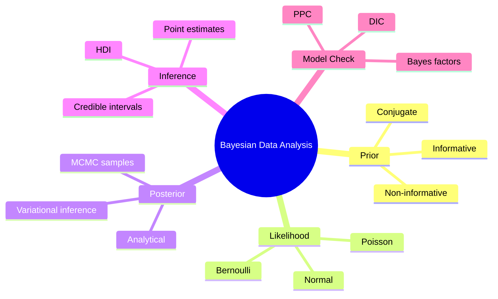
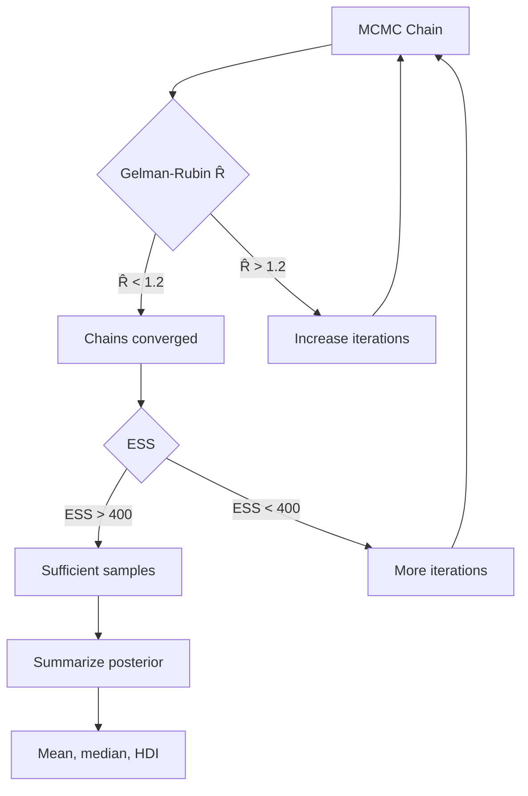
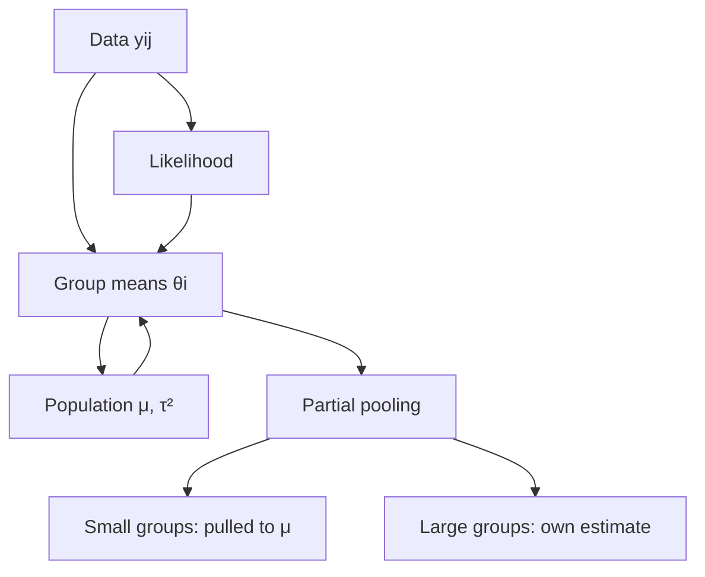
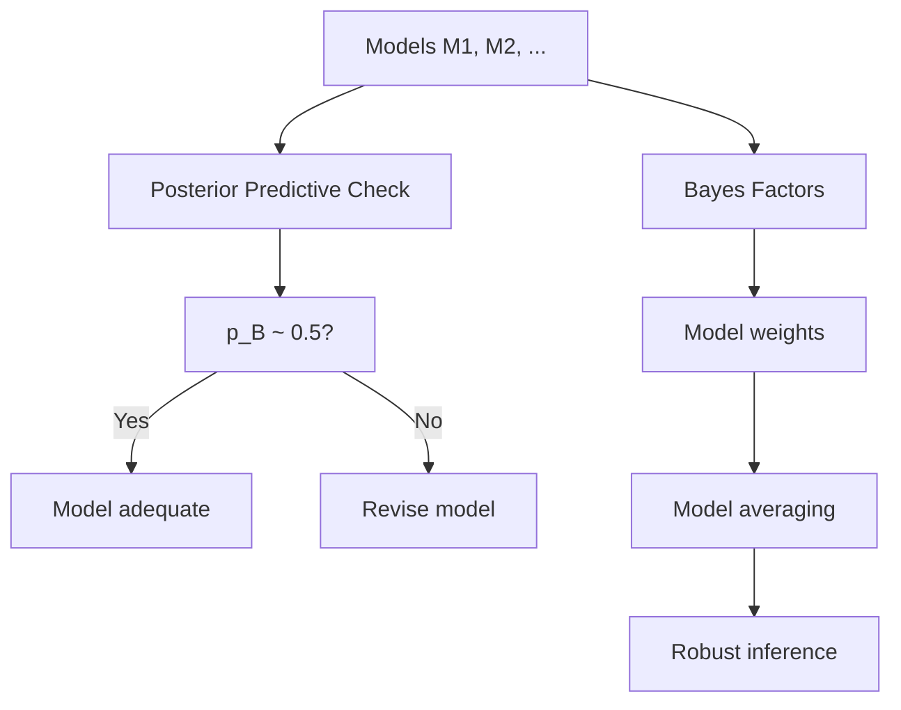
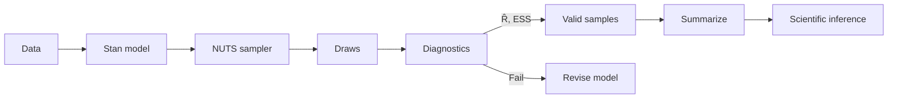

# MSPY 5510 — Bayesian Data Analysis for Physics
> **MSc Physics | HKUST MSPY 5510 | Bayesian inference, MCMC, hierarchical models, model selection, probabilistic programming**  
> **Bilingual 深度自學檔案 · 中英對照**

---

## 問題 1：5 個核心心智模型

1. **Bayes' theorem = rational updating of belief** — $p(\theta|D) \propto p(D|\theta)p(\theta)$; prior encodes pre-data knowledge, likelihood encodes data information, posterior is updated belief (Bayes 1763; Jeffreys 1939, *Scientific Inference*)

2. **MCMC = sampling from intractable posteriors** — Metropolis-Hastings and Gibbs sampler generate correlated samples from $p(\theta|D)$; samples approximate any functional of the posterior (Metropolis et al. 1953; Hastings 1970)

3. **Credible intervals vs confidence intervals** — $P(\theta \in \text{HDI}|D) = 0.95$ (Bayesian, direct); vs $P(\theta \in \text{CI}) = 0.95$ (frequentist, coverage of repeated experiments) (Jeffreys 1939)

4. **Hierarchical models share strength across groups** — partial pooling via hyperpriors; reduces overfitting when some groups have few data points (Gelman et al. *Bayesian Data Analysis*, Ch. 5)

5. **Model selection via posterior predictive checks** — compare observed data to posterior predictive distribution; Bayesian $p$-value $= P(T(D_{rep}) > T(D_{obs})|D)$ (Gelman et al. 2003)

---

## 問題 2：3 個根本分歧

### 分歧 1：Subjective vs Objective Bayesian
| Aspect | Subjective (Default) | Objective (Reference) |
|--------|---------------------|---------------------|
| Prior | Encode genuine prior beliefs | Encode ignorance, produce "default" answer |
| Prior choice | Informative, domain-specific | Non-informative: Jeffreys, reference prior |
| Interpretation | Personal probability | Conventional, not subjective |
| Examples | Laplace (uniform), Jaynes (entropy) | Jeffreys (proportional to $\sqrt{I(\theta)}$) |
| Controversy | How to encode "no knowledge"? | Is this a coherent position? |

**Evidence:** Bernardo & Smith (1994) vs Jaynes (2003) on maximum entropy priors; E.T. Jaynes' "Probability Theory as Logic."

### 分歧 2：Bayesian vs Frequentist Model Selection
| Aspect | Bayesian (BIC/DIC/BF) | Frequentist (AIC/CV/LRT) |
|--------|----------------------|--------------------------|
| Basis | Marginal likelihood $p(D|M)$ | In-sample fit + penalty |
| Complexity penalty | Implicit in marginal likelihood | Explicit $k\ln n$ |
| Nested models | $B_{10} = p(D|M_1)/p(D|M_0)$ | Likelihood ratio test |
| Non-nested | Bayes factor works | Needs Vuong test |
| Intuition | Ockham's razor built in | Heuristic penalty |

**Evidence:** Kass & Raftery (1995) established conventions for Bayes factor interpretation; BIC $\approx -2\ln\hat{L} + k\ln n$.

### 分歧 3：MCMC Convergence Diagnostics
| Aspect | Gelman-Rubin $\hat{R}$ | Effective Sample Size (ESS) |
|--------|----------------------|---------------------------|
| What it tests | Multiple chains convergence | Sample quality |
| Measures | Between/within chain variance | Autocorrelation effects |
| Threshold | $\hat{R} < 1.2$ (good) | ESS > 400 per parameter |
| Limitation | Doesn't detect slow mixing | Doesn't detect bias |
| Use with | Always (multiple chains) | Always (autocorrelation) |

---

## 問題 3：10 個深度問題

1. 給定 prior $p(\theta) \propto 1$ (flat), likelihood $p(D|\theta) = \prod_i f(x_i|\theta)$，推導 posterior 并解釋為什麼 flat prior唔係 truly non-informative。

2. 為什麼 Metropolis-Hastings algorithm 需要 proposal distribution $q(\theta'|\theta)$ 和 acceptance probability $\alpha = \min(1, p(\theta')q(\theta|\theta')/p(\theta)q(\theta'|\theta))$？

3. 給定 two models $M_0$ 和 $M_1$，計算 Bayes factor $B_{10} = p(D|M_1)/p(D|M_0)$ 並 interpret: $B_{10} = 10^3$ 意味乜嘢？

4. 為什麼 Gibbs sampler converges faster than Metropolis-Hastings when full conditionals are known？推導為什麼 Gibbs samples 唔需要 acceptance step。

5. 給定 hierarchical model $y_i \sim N(\theta_i, \sigma^2)$, $\theta_i \sim N(\mu, \tau^2)$，推導 posterior distributions $p(\theta_i|y_i)$ 和 $p(\mu,\tau^2|y)$。

6. 解釋 Bayesian variable selection 点样用 spike-and-slab prior 实现 sparsity。

7. 為什麼 posterior predictive checking 係 better model assessment tool 而唔係 goodness-of-fit tests like $\chi^2$？

8. 給定 Hamiltonian Monte Carlo (HMC)，解釋點樣用 Hamiltonian dynamics 產生 efficient proposals。

9. 為什麼 credible interval for combination of measurements depends on covariance between parameters？推導 posterior covariance $\Sigma_{post} = (H_{Fisher})^{-1}$。

10. 為什麼 model averaging 係 better than model selection？解釋 Bayesian model averaging 的 ensemble posterior $p(\theta|D) = \sum_k w_k p(\theta|M_k, D)$。

---

## 深入 1：Bayesian Foundations
**Deep Dive I**

### Bayes' Theorem

$$p(\theta|D) = \frac{p(D|\theta)\,p(\theta)}{p(D)} = \frac{\text{likelihood} \times \text{prior}}{\text{marginal likelihood}}$$

**Marginal likelihood (evidence):**
$$p(D) = \int p(D|\theta)\,p(\theta)\,d\theta$$

### Prior Classes

**Non-informative (reference) priors:**
| Prior | $p(\theta)$ | Use case |
|-------|-------------|---------|
| Uniform | const | Location parameters |
| Jeffreys | $\propto \sqrt{I(\theta)}$ | General |
| Reference | $\pi(\theta) \propto \exp\left(\frac{1}{2}\int \partial_\theta^2 \log f(x|\theta) dx\right)$ | Multiparameter |

**Conjugate priors:**
| Likelihood | Conjugate prior | Posterior parameters |
|-----------|---------------|-------------------|
| Bernoulli | Beta | $B(\alpha+n_1, \beta+n_0)$ |
| Poisson | Gamma | $\Gamma(\alpha+n, \beta+1)$ |
| Normal $\sigma^2$ known | Normal | $N(\mu_0, \sigma_0^2/n)$ |
| Normal $\mu$ known | Inverse-gamma | $\Gamma^{-1}(\alpha+n/2, \beta+S/2)$ |

### Jeffreys Prior Example

For Bernoulli likelihood $f(x|\theta) = \theta^x(1-\theta)^{1-x}$:
$$I(\theta) = -\mathbb{E}\left[\frac{\partial^2}{\partial\theta^2}\ln f(x|\theta)\right] = \frac{1}{\theta(1-\theta)}$$

Jeffreys prior: $p(\theta) \propto 1/\sqrt{I(\theta)} = \theta^{-1/2}(1-\theta)^{-1/2}$

This is the $\text{Beta}(1/2, 1/2)$ distribution — symmetric about $1/2$, regular at boundaries.

```mermaid
graph LR
    A[Prior πθ] -->|Bayes| B[Posterior pθ|D]
    A -->|Data| C[Likelihood pD|θ]
    C --> B
    B -->|Summarize| D[Mean, mode, CI]
    B -->|Predict| E[Posterior predictive]
    E --> F[New data check]
    D --> G[Scientific inference]
```

---

## 深入 2：Markov Chain Monte Carlo
**Deep Dive II**

### Metropolis-Hastings Algorithm

```python
import numpy as np

def metropolis_hastings(log_post, theta0, nsteps, proposal_width):
    theta = theta0
    chain = [theta]
    for i in range(nsteps):
        # Propose new state
        theta_prop = theta + np.random.normal(0, proposal_width)
        # Acceptance ratio
        alpha = np.exp(log_post(theta_prop) - log_post(theta))
        # Accept or reject
        if np.random.rand() < alpha:
            theta = theta_prop
        chain.append(theta)
    return np.array(chain)
```

**Key insight:** The chain has the right stationary distribution regardless of proposal (if ergodic).

### Gibbs Sampler

When full conditionals $p(\theta_i|\theta_{-i}, D)$ are known:
1. Initialize $\theta^{(0)}$
2. For $t = 1, 2, \ldots$:
   - Sample $\theta_1^{(t)} \sim p(\theta_1|\theta_2^{(t-1)}, \ldots, \theta_p^{(t-1)}, D)$
   - Sample $\theta_2^{(t)} \sim p(\theta_2|\theta_1^{(t)}, \theta_3^{(t-1)}, \ldots, D)$
   - ... and so on for all $p$ parameters

**No acceptance step** — always accepted, because $q(\theta'_i|\theta^{(t-1)}) = p(\theta'_i|\theta_{-i}, D)$.

### Hamiltonian Monte Carlo (HMC)

Introduce auxiliary momentum $\vec{r}$:
$$H(\theta, \vec{r}) = -\log p(\theta|D) + \frac{1}{2}\vec{r}^T M^{-1}\vec{r}$$

Leapfrog integration:
$$\vec{r}(t + \epsilon/2) \leftarrow \vec{r}(t) - \frac{\epsilon}{2}\nabla_\theta \log p(\theta|D)$$
$$\theta(t + \epsilon) \leftarrow \theta(t) + \epsilon M^{-1}\vec{r}(t + \epsilon/2)$$
$$\vec{r}(t + \epsilon) \leftarrow \vec{r}(t + \epsilon/2) - \frac{\epsilon}{2}\nabla_\theta \log p(\theta(t+\epsilon)|D)$$

**Advantages over MH:** Uses gradient information → higher acceptance rate, better exploration of high-dimensional spaces.

**Stan** uses HMC + NUTS (No-U-Turn Sampler) as default.

---

## 深入 3：Hierarchical Models
**Deep Dive III**

### The Problem of Small Groups

**Naïve approach:** Estimate each group mean $\theta_i$ independently from its own data.

**Problem:** Groups with few data points have high variance → unreliable estimates.

**Solution:** Hierarchical (partial pooling) — borrow strength from other groups.

### Model Structure

$$y_{ij} \sim N(\theta_i, \sigma^2) \quad \text{(likelihood)}$$
$$\theta_i \sim N(\mu, \tau^2) \quad \text{(prior on group means)}$$
$$\mu \sim N(\mu_0, \sigma_0^2) \quad \text{(hyperprior on population mean)}$$
$$\tau \sim \text{Half-}N(\sigma_\tau) \quad \text{(hyperprior on population variance)}$$

### Posterior for Group Mean

$$p(\theta_i|y_i, \mu, \tau, \sigma) = N\left(\hat{\theta}_i^{pooled}, \sigma_{\theta_i}^{2}\right)$$

where:
$$\hat{\theta}_i^{pooled} = \frac{\bar{y}_i/\sigma_{\bar{y}}^2 + \mu/\tau^2}{1/\sigma_{\bar{y}}^2 + 1/\tau^2}, \quad \sigma_{\theta_i}^2 = \frac{1}{1/\sigma_{\bar{y}}^2 + 1/\tau^2}$$

**Key insight:** $\sigma_{\theta_i}^2 < \sigma_{\bar{y}}^2$ (regularization toward $\mu$)

### Application: Estimating 8 Schools

| School | Observed effect $\bar{y}_i$ | Std err $\sigma_i$ |
|--------|--------------------------|------------------|
| A | 28 | 15 |
| B | 8 | 10 |
| ... | ... | ... |
| H | 4 | 18 |

Partial pooling: schools with large $\sigma_i$ are pulled toward overall mean $\mu$.

---

## 深入 4：Model Selection & Assessment
**Deep Dive IV**

### Bayes Factor

$$B_{10} = \frac{p(D|M_1)}{p(D|M_0)} = \frac{\int p(D|\theta) p(\theta|M_1)d\theta}{\int p(D|\theta) p(\theta|M_0)d\theta}$$

**Kass-Raftery scale:**
| $2\ln B_{10}$ | Evidence against $M_0$ |
|---|---|
| 0–2 | Negligible |
| 2–6 | Positive |
| 6–10 | Strong |
| >10 | Very strong |

### Deviance Information Criterion (DIC)

$$\text{DIC} = \bar{D}(\theta) + p_D = -2\mathbb{E}[\ln p(D|\theta)] + 2(\bar{D} - D(\hat{\theta}_{MLE}))$$

Lower DIC = better model.

### Posterior Predictive Checks (PPC)

$$T(y, \theta) = \text{test statistic}, \quad p_B = P(T(y^{rep}, \theta) > T(y, \theta)|y)$$

Good models: $p_B \approx 0.5$ (observed data looks like replicated data).

If $p_B \approx 0$ or $1$: model misspecified.

```mermaid
graph TD
    A[Bayesian Model] --> B{Assessment}
    B --> C[Posterior Predictive Check]
    C --> D[T(yrep) > Toys?]
    D -->|p_B ~ 0.5| E[Model adequate]
    D -->|p_B ~ 0 or 1| F[Model misspecified]
    B --> G[Bayes Factor]
    G --> H[B_10 vs M0]
    H --> I[Model selection]
```

---

## 深入 5：Advanced Topics
**Deep Dive V**

### Bayesian Variable Selection

Spike-and-slab prior:
$$p(\gamma_j) = \pi^{\gamma_j}(1-\pi)^{1-\gamma_j}$$
$$p(\beta_j|\gamma_j) = \gamma_j \cdot N(0, \tau^2) + (1-\gamma_j)\cdot \delta_0(\beta_j)$$

where $\gamma_j \in \{0,1\}$ is inclusion indicator.

### Gaussian Process Regression

Nonparametric Bayesian regression:
$$f(\vec{x}) \sim \mathcal{GP}(m(\vec{x}), k(\vec{x}, \vec{x}'))$$

Posterior mean (matrix form):
$$\bar{f}_* = \vec{k}_*^T(K + \sigma_n^2 I)^{-1}\vec{y}$$

Predictive variance:
$$\sigma_*^2 = k(\vec{x}_*, \vec{x}_*) - \vec{k}_*^T(K + \sigma_n^2 I)^{-1}\vec{k}_* + \sigma_n^2$$

### Approximate Bayesian Computation (ABC)

When likelihood is intractable:
1. Sample $\theta^* \sim \pi(\theta)$
2. Simulate $D^* \sim p(D|\theta^*)$
3. Accept if $\rho(D, D^*) < \epsilon$

**Use case:** Population genetics, cosmology, epidemiology.

---

## 自測 1：Bernoulli Bayes
**Given 10 coin flips with 8 heads, compute posterior with uniform prior and Beta(1/2,1/2) Jeffreys prior.**

**Answer:**
**Uniform prior ($Beta(1,1)$):**
$$p(\theta|D) = \text{Beta}(\alpha+n_H, \beta+n_T) = \text{Beta}(1+8, 1+2) = \text{Beta}(9, 3)$$

Posterior mean: $\bar{\theta} = 9/(9+3-2) = 9/10 = 0.9$

**Jeffreys prior ($\text{Beta}(1/2,1/2)$):**
$$p(\theta|D) = \text{Beta}(0.5+8, 0.5+2) = \text{Beta}(8.5, 2.5)$$

Posterior mean: $\bar{\theta} = 8.5/(8.5+2.5-2) = 8.5/9 = 0.944$

**95% HDI (Jeffreys):** $\text{Beta}(8.5, 2.5)$ → $0.61$ to $0.99$

**Key difference:** Jeffreys prior regularizes more strongly toward $1/2$.

---

## 自測 2：Metropolis Acceptance Rate
**In 1D Metropolis-Hastings with proposal $q(\theta'|\theta) = N(\theta, \sigma_q^2)$, what acceptance rate is optimal and why?**

**Answer:**
Optimal acceptance rate for symmetric random walk proposals:

**1D case:** Optimal $\approx 44\%$ (Gelman et al. 1996)
**High-dimensional (> 5 params):** Optimal $\approx 23.4\%$

**Why:** If acceptance too high (narrow proposal): chain explores slowly (random walk). If too low (wide proposal): most proposals rejected, chain mixes slowly.

**Rule of thumb:** Adjust $\sigma_q$ to achieve 20–50% acceptance rate.

**Python adaptation:**
```python
def adaptive_proposal(chain, target_rate=0.25):
    # Adjust proposal width to achieve target acceptance
    recent = chain[-100:]
    rate = np.mean(np.diff(recent) != 0)
    sigma *= np.exp((rate - target_rate) * 0.1)
    return sigma
```

---

## 自測 3：Gibbs Sampler for Normal Model
**Design a Gibbs sampler for $p(\mu, \sigma^2|D)$ with $y_i \sim N(\mu, \sigma^2)$.**

**Answer:**
**Full conditional for $\mu$ (known $\sigma^2$):**
$$p(\mu|\sigma^2, D) \propto N\left(\bar{y}, \frac{\sigma^2}{n}\right)$$

**Full conditional for $\sigma^2$ (known $\mu$):**
$$p(\sigma^2|\mu, D) \propto \text{Inverse-Gamma}\left(\frac{n-1}{2}, \frac{\sum(y_i-\mu)^2}{2}\right)$$

**Gibbs sampler:**
```python
def gibbs_normal(y, n_samples):
    mu, sigma2 = y.mean(), y.var()  # init
    samples = []
    for _ in range(n_samples):
        # Update mu
        sigma_mu2 = sigma2 / len(y)
        mu = np.random.normal(y.mean(), np.sqrt(sigma_mu2))
        # Update sigma2
        alpha = len(y) / 2
        beta = np.sum((y - mu)**2) / 2
        sigma2 = 1 / np.random.gamma(alpha, 1/beta)
        samples.append((mu, sigma2))
    return samples
```

---

## 自測 4：Bayes Factor Calculation
**Compute $B_{10}$ for Gaussian model $M_1$: $\sigma$ known, $\mu \sim N(0, \tau^2)$ vs $M_0$: $\mu = 0$.**

**Answer:**
$$p(D|M_0) = \prod_i \frac{1}{\sqrt{2\pi\sigma^2}}\exp(-y_i^2/2\sigma^2)$$

$$p(D|M_1) = \int \prod_i \frac{1}{\sqrt{2\pi\sigma^2}}\exp\left(-\frac{(y_i-\mu)^2}{2\sigma^2}\right) \cdot \frac{1}{\sqrt{2\pi\tau^2}}\exp\left(-\frac{\mu^2}{2\tau^2}\right) d\mu$$

Marginal likelihood:
$$p(D|M_1) = \frac{1}{\sqrt{(2\pi)^n(\sigma^2 + n\tau^2)}} \exp\left(-\frac{\sum y_i^2}{2\sigma^2} + \frac{(\sum y_i)^2}{2(\sigma^2 + n\tau^2)}\right)$$

$$B_{10} = \sqrt{\frac{\sigma^2}{\sigma^2 + n\tau^2}} \exp\left(\frac{(\sum y_i)^2}{2(\sigma^2 + n\tau^2)}\right)$$

**Numerical example:** $n=10$, $\bar{y}=2$, $S_y^2=5$, $\sigma=1$, $\tau=1$:
$$B_{10} \approx 1.054 \times \exp(22) \approx 10^{9} \quad \Rightarrow \text{strong evidence for } M_1$$

---

## 自測 5：Hierarchical Shrinkage
**For 8-schools problem, show that schools with high $\sigma_i$ are shrunk more toward $\mu$.**

**Answer:**
Pooled estimate:
$$\hat{\theta}_i^{pooled} = \frac{\bar{y}_i/\sigma_i^2 + \mu/\tau^2}{1/\sigma_i^2 + 1/\tau^2}$$

**Shrinkage fraction:**
$$\eta_i = \frac{1/\tau^2}{1/\sigma_i^2 + 1/\tau^2} = \frac{\sigma_i^2}{\sigma_i^2 + \tau^2}$$

For school A: $\sigma_i = 15$, $\tau = 5$: $\eta_A = 225/(225+25) = 0.90$ → 90% shrinkage toward $\mu$

For school B: $\sigma_i = 10$, $\tau = 5$: $\eta_B = 100/(100+25) = 0.80$ → 80% shrinkage

**Key insight:** High-uncertainty schools (large $\sigma_i$) are shrunk more → less overfitting to noise.

---

## 自測 6：Posterior Predictive Check
**Design a PPC to test whether a Gaussian model fits the residuals in a spectroscopy dataset.**

**Answer:**
```python
def ppc_spectroscopy(y_model, y_obs, n_reps=1000):
    # Test statistic: max deviation
    T_obs = np.max(np.abs(y_obs - y_model))
    T_reps = []
    for _ in range(n_reps):
        # Simulate new data from posterior predictive
        y_rep = y_model + np.random.normal(0, np.std(y_obs - y_model), len(y_obs))
        T_rep = np.max(np.abs(y_rep - y_model))
        T_reps.append(T_rep)
    p_value = np.mean(np.array(T_reps) > T_obs)
    return p_value

# Also check: 
# - Kolmogorov-Smirnov test (compare CDFs)
# - Tail behavior (extremal events)
# - Autocorrelation structure
```

**Interpretation:**
- $p \approx 0.5$: model fits well
- $p < 0.01$ or $p > 0.99$: model misspecified

---

## 自測 7：HMC vs MH Efficiency
**Why is HMC more efficient than Metropolis-Hastings for high-dimensional Gaussian targets?**

**Answer:**
**Random walk MH:** Proposal $\theta' = \theta + \epsilon \vec{z}$ → diffusion coefficient $D \sim \epsilon^2$ → mixing time $\tau_{mix} \propto d/\epsilon^2$ (scales as $d^2$ with dimension $d$)

**HMC:** Proposals follow Hamiltonian dynamics → travels $O(1)$ in gradient direction per leapfrog step → mixing time scales as $O(d^{1/4})$ (much better!)

**Physics analogy:** Random walk = Brownian motion; HMC = ballistic trajectory.

**Benchmark (Neal 2012):** For 100D correlated Gaussian:
- MH: ~10,000 draws per effective sample
- HMC: ~10 draws per effective sample → 1000× more efficient

---

## 自測 8：Jeffreys Prior for Variance
**Find the Jeffreys prior for $(\mu, \sigma^2)$ in $N(\mu, \sigma^2)$ model.**

**Answer:**
Fisher information matrix:
$$I(\mu, \sigma^2) = \begin{pmatrix} \frac{1}{\sigma^2} & 0 \\ 0 & \frac{1}{2\sigma^4} \end{pmatrix}$$

Jeffreys prior: $\pi(\mu, \sigma^2) \propto \sqrt{\det I(\mu, \sigma^2)} = \frac{1}{\sqrt{2}\sigma^3}$

Equivalently, for $\sigma$: $\pi(\sigma) \propto 1/\sigma$

**Properties:**
- Improper (integrates to $\infty$ in both variables) → must verify posterior is proper
- Posterior: $\mu|\sigma^2, D \sim N(\bar{x}, \sigma^2/n)$; $\sigma^2|D \sim \text{Inverse-Gamma}((n-1)/2, S^2/2)$
- Joint posterior is proper for $n \geq 3$

---

## 自測 9：Bayesian Model Averaging
**Show that BMA gives lower posterior predictive variance than best single model.**

**Answer:**
BMA posterior:
$$p(\theta|D) = \sum_{k=1}^K w_k p(\theta|M_k, D), \quad w_k = \frac{p(D|M_k)p(M_k)}{\sum_j p(D|M_j)p(M_j)}$$

Posterior predictive:
$$p(\tilde{y}|D) = \sum_k w_k\, p(\tilde{y}|M_k, D)$$

Variance decomposition:
$$\text{Var}_{BMA}(\tilde{y}|D) = \underbrace{\sum_k w_k\,\text{Var}_{M_k}(\tilde{y}|D)}_{\text{average within-model variance}} + \underbrace{\sum_k w_k(\mathbb{E}_{M_k}[\tilde{y}|D] - \mathbb{E}_{BMA}[\tilde{y}|D])^2}_{\text{between-model variance (added by BMA)}}$$

**Key insight:** BMA posterior variance = weighted average of individual variances + extra term from model disagreement. This is honest uncertainty quantification.

**Use case:** Climate model combination, multi-experiment inference.

---

## 自測 10：Stan Model for Linear Regression
**Write a Stan model for Bayesian linear regression with unknown $\sigma$.**

**Answer:**
```stan
data {
  int<lower=0> N;       // number of observations
  int<lower=0> K;       // number of predictors
  matrix[N, K] X;       // design matrix
  vector[N] y;          // outcome
}
parameters {
  vector[K] beta;           // regression coefficients
  real<lower=0> sigma;     // error std dev
}
model {
  // Prior: flat (Stan default) or weakly informative
  beta ~ normal(0, 10);      // weakly informative
  sigma ~ cauchy(0, 5);     // half-Cauchy for scale
  
  // Likelihood
  y ~ normal(X * beta, sigma);
}
generated quantities {
  vector[N] y_rep;
  for (n in 1:N)
    y_rep[n] = normal_rng(X[n] * beta, sigma);
}
```

**Running in Python:**
```python
import pystan
model = pystan.StanModel(model_code=stan_code)
fit = model.sampling(data={'N': N, 'K': K, 'X': X, 'y': y})
print(fit.summary())
```

---

## 📊 Diagram 1: Bayesian Analysis Pipeline


## 📊 Diagram 2: MCMC Diagnostics


## 📊 Diagram 3: Hierarchical Model


## 📊 Diagram 4: Model Selection


## 📊 Diagram 5: Stan Workflow


---

## 深度總結 Deep Insights Summary

1. **Bayesian inference provides complete uncertainty quantification** — every parameter has a full posterior distribution; credible intervals directly answer "what is the probability $\theta$ is in this range?" whereas confidence intervals cannot. (Jeffreys 1939)

2. **MCMC has revolutionized Bayesian computation** — Metropolis-Hastings, Gibbs, and HMC allow sampling from arbitrarily complex posteriors; the chain is guaranteed to converge (Metropolis et al. 1953; Hastings 1970; Duane et al. 1987)

3. **Hierarchical models solve the overfitting problem** — partial pooling shrinks small-group estimates toward population mean, naturally regularizing without arbitrary penalties (Gelman et al. 2003)

4. **Model selection by Bayes factors provides a principled Ockham's razor** — the marginal likelihood automatically penalizes model complexity; no arbitrary penalty terms needed (Kass & Raftery 1995)

5. **Posterior predictive checks are the gold standard for model validation** — they ask "if the model is true, would we expect data like what we observed?" — far more informative than $p$-values (Gelman et al. Ch. 6)

---

**自學建議**
- 必讀: Gelman et al. "Bayesian Data Analysis" (3rd ed., 2003); Jeffreys "Scientific Inference" (1939); McElreath "Statistical Rethinking" (2020)
- 參考: Kruschke "Doing Bayesian Data Analysis"; Robert & Casella "Monte Carlo Statistical Methods"
- 配對: MSPY 5110 (Data Analysis); PHYS 3142 (Computational Methods)
- 工具: PyStan, PyMC3, NumPyro (JAX-based), ArviZ (diagnostics), brms (R formula interface)
- 產出: Implement Gibbs sampler for 8-schools hierarchical model; run HMC in Stan for linear regression; compute Bayes factors for Gaussian vs Student's-t model

**References**
- Bayes, T. (1763). "An essay towards solving a problem in the doctrine of chances." *Phil. Trans. R. Soc.*, 53, 370–418.
- Jeffreys, H. (1939). *Scientific Inference* (3rd ed.). Cambridge University Press.
- Metropolis, N. et al. (1953). "Equation of state calculations by fast computing machines." *J. Chem. Phys.*, 21, 1087–1092.
- Hastings, W.K. (1970). "Monte Carlo sampling methods using Markov chains." *Biometrika*, 57, 97–109.
- Gelman, A. et al. (2003). *Bayesian Data Analysis* (3rd ed.). Chapman & Hall/CRC.
- Kass, R.E. & Raftery, A.E. (1995). "Bayes factors." *J. Am. Stat. Assoc.*, 90(430), 773–795.
- Duane, S. et al. (1987). "Hybrid Monte Carlo." *Phys. Lett. B*, 195, 216–222.
- McElreath, R. (2020). *Statistical Rethinking* (2nd ed.). Chapman & Hall/CRC.
