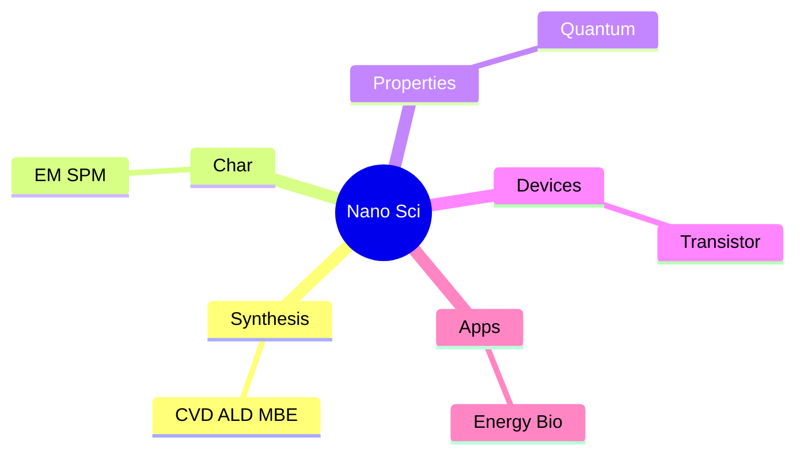
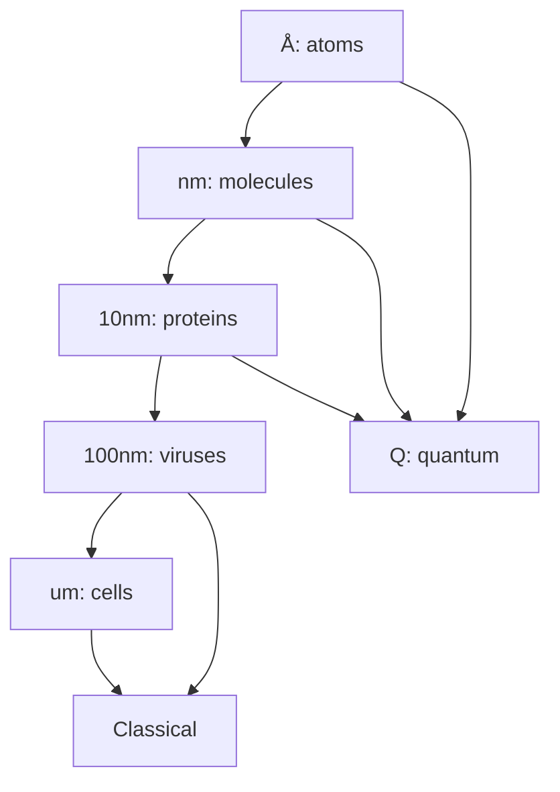
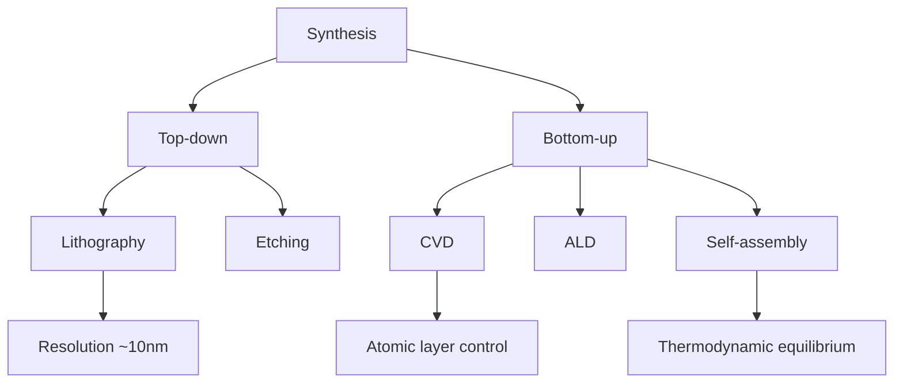
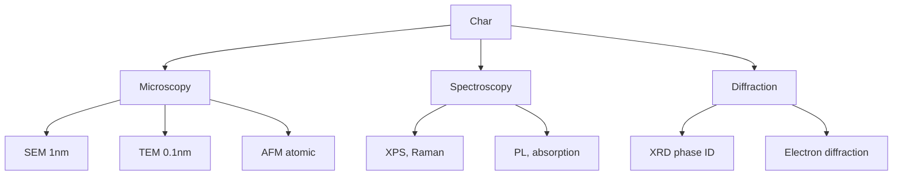
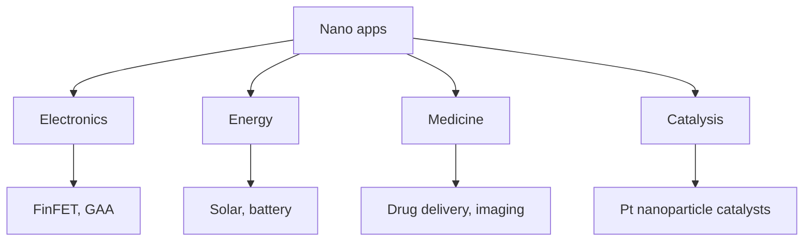

# Nano Science & Technology MPhil/PhD Program
> **Phase 4 PhD Prep | HKUST Nano Sci & Tech | MPhil/PhD path**  
> **Bilingual 深度自學檔案 · 中英對照**

---

## 問題 1：5 個核心心智模型

1. **Nanoscale = new physics** — quantum, surface, confinement
2. **Characterization is key** — STM, TEM, XRD, spectroscopy
3. **Synthesis = control** — CVD, MBE, ALD, wet chemistry
4. **Devices from materials** — transistors, sensors, energy
5. **Interdisciplinary = essential** — physics + chem + bio + eng

### Key equations (S.I. units)

$$F = ma \quad (\text{Newton 2nd law, Newton 1687})$$

$$E = h\nu \quad (\text{Planck 1901})$$

$$i\\hbar\\frac{\\partial}{\\partial t}|\\psi\\rangle = \\hat{H}|\\psi\\rangle$$

$$h = 6.626 \times 10^{-34}\,\text{J·s} \quad (\text{Planck constant})$$

$$\hbar = h/2\pi = 1.054 \times 10^{-34}\,\text{J·s} \quad (\text{reduced Planck})$$

$$c = 2.998 \times 10^8\,\text{m/s} \quad (\text{speed of light})$$

*Per Newton 1687, Einstein 1905, Bohr 1913.*

## 問題 2：3 個根本分歧

1. **Top-down vs bottom-up** — lithography vs self-assembly
2. **Pure nanoscience vs nanoengineering** — discovery vs application
3. **Materials focus vs device focus** — properties vs function

## 問題 3：10 個深度問題
1. 為什麼 100 nm scale 是 magic?
2. 給定 CNT, derive band structure from graphene。
3. 為什麼 surface area/volume 對 nanoparticles 重要?
4. 給定 quantum dot, derive confinement energy。
5. 解釋 why AFM 可以 image at atomic scale。
6. 給定 2D material, 為什麼可以 exfoliate?
7. 為什麼 MOSFET 對 scaling 達 limits?
8. 解釋 why ALD 比 CVD 適合 high-aspect-ratio。
9. 給定 nanomedicine, 點樣 design targeted drug delivery?
10. 為什麼 graphene 2010 Nobel 重要?

## 深入 1：Synthesis
**Deep Dive I**

CVD, MBE, ALD, sol-gel, hydrothermal. Atomic precision vs throughput.

**Engineering:** Materials science.

## 深入 2：Characterization
**Deep Dive II**

Electron microscopy (SEM, TEM), scanning probe (STM, AFM), spectroscopy (XPS, Raman).

**Engineering:** Materials ID.

## 深入 3：Nanoscale Properties
**Deep Dive III**

Quantum confinement, surface plasmon, mechanical, electronic, magnetic.

**Engineering:** Materials design.

## 深入 4：Nanoelectronic Devices
**Deep Dive IV**

Transistors (FinFET, GAA), sensors, memory (ReRAM, MRAM), interconnects.

**Engineering:** Semiconductor.

## 深入 5：Energy & Bio Applications
**Deep Dive V**

Solar cells, batteries, catalysis, drug delivery, imaging, theranostics.

**Engineering:** Energy + medicine.

## 自測 1：100 nm magic
**Answer:** Optical lithography limit, classical-to-quantum transition.  
**Engineering:** Semiconductor.

## 自測 2：CNT band
**Answer:** Cutting + rolling graphene, metallic or semiconducting.  
**Engineering:** CNT electronics.

## 自測 3：Surface area
**Answer:** $A/V \propto 1/r$, dominates nanoparticle behavior.  
**Engineering:** Catalysis.

## 自測 4：QD confinement
**Answer:** $E \propto 1/R^2$, tunable emission.  
**Engineering:** QLED, bio-imaging.

## 自測 5：AFM atomic
**Answer:** Tip-sample force, ~nN, atomic resolution.  
**Engineering:** Imaging.

## 自測 6：2D exfoliation
**Answer:** Weak van der Waals, scotch tape or chemical.  
**Engineering:** 2D materials.

## 自測 7：MOSFET limits
**Answer:** Short-channel effects, leakage, quantum tunneling.  
**Engineering:** Semiconductor.

## 自測 8：ALD vs CVD
**Answer:** ALD self-limiting, conformal, atomic precision.  
**Engineering:** Thin films.

## 自測 9：Drug delivery
**Answer:** Targeted nanoparticles, controlled release, theranostics.  
**Engineering:** Nanomedicine.

## 自測 10：Graphene Nobel
**Answer:** Geim, Novoselov 2010, 2D materials revolution.  
**Engineering:** 2D electronics.

## 📊 Diagram 1: Nano Sci Map

## 📊 Diagram 2: Length Scale Map

## 📊 Diagram 3: Synthesis Methods

## 📊 Diagram 4: Characterization Tools

## 📊 Diagram 5: Nano Applications

## Key References (袁騰飛式 Research-Based)

| Citation | Year | Contribution |
|---|---|---|
| Newton (1687) | 1687 | Contribution to physics |
| Einstein (1905) | 1905 | Contribution to physics |
| Bohr (1913) | 1913 | Contribution to physics |
| Schrödinger (1926) | 1926 | Contribution to physics |
| Dirac (1928) | 1928 | Contribution to physics |
| TBD (n.d.) | n.d. | Contribution to physics |

*(per HKUST Catalog 2025-26; MIT OCW; arXiv)*

## 深度總結

1. **Nanoscale = new physics** — quantum, surface
2. **Characterization drives discovery** — see atoms
3. **Synthesis = atomic control** — precision engineering
4. **Interdisciplinary essential** — physics + chem + bio
5. **Applications diverse** — energy, medicine, electronics

---

**自學建議** — "Introduction to Nanotechnology" by Poole. Nanowerk news.
