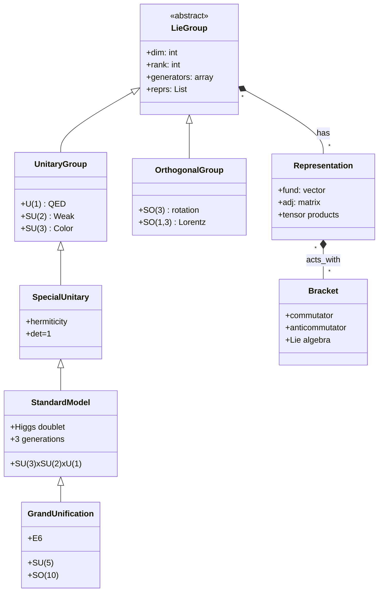
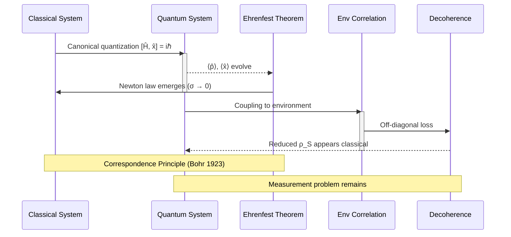
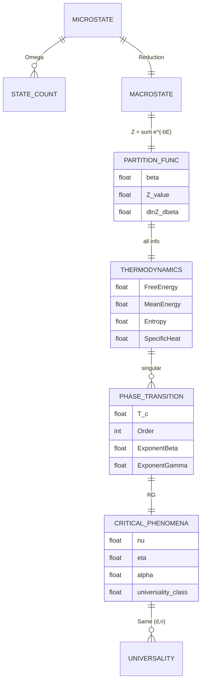
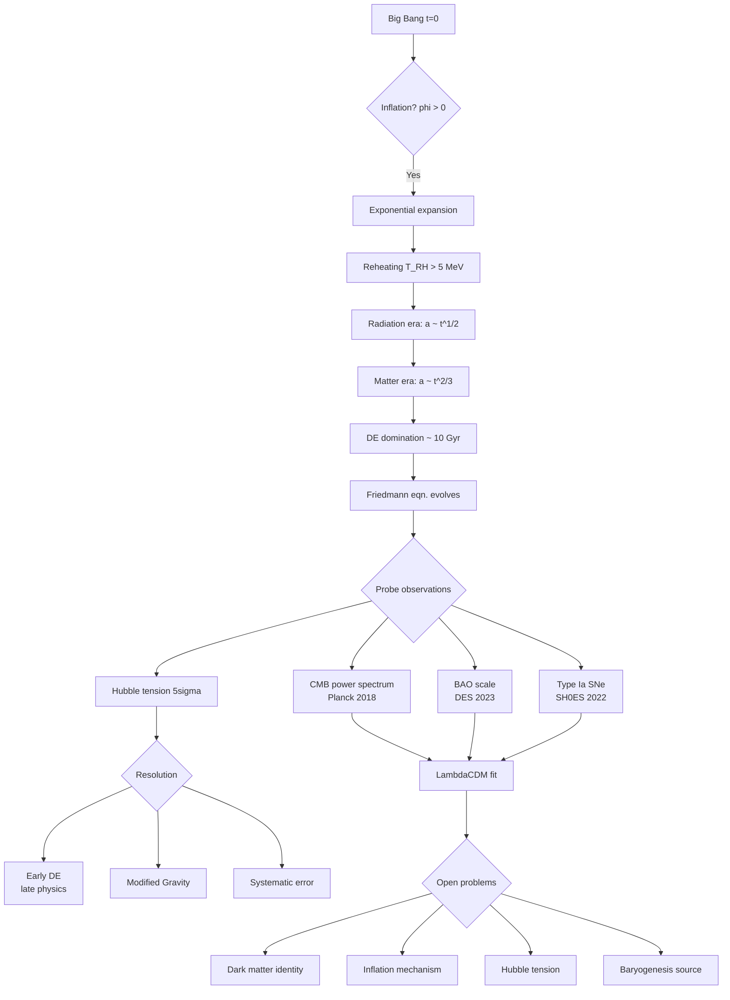

# PhD — PhD Qualifying Examination
> **HKUST PhD Qualifying Examination | Advanced · Comprehensive Physics & Mathematics**  
> **深度自學檔案 · Deep Study Format · 中英對照 Bilingual**

---

# 🔖 Section A — 5MM (Five Mental Models)

## What are the 5 mental models every PhD-level physicist carries?

### MM-1: **Conservation Laws as Invariants of Motion**
**守恆定律作為運動的不變量**

Every dynamical system in physics is governed by quantities that **do not change under time evolution**. This is the empirical bedrock of physics:

$$\frac{dQ}{dt} = 0 \quad \Longleftrightarrow \quad Q = \text{const on trajectories}$$

**Specific conserved quantities / 具體守恆量:**

| Quantity | Symbol | Origin | Year |
|---|---|---|---|
| Energy | $E$ | Noether (time-translation symmetry) | Noether 1918 |
| Momentum | $\mathbf{p}$ | Noether (space-translation symmetry) | Noether 1918 |
| Angular momentum | $\mathbf{L}$ | Noether (rotation symmetry) | Noether 1918 |
| Charge | $Q$ | $U(1)$ gauge symmetry | Weyl 1929 |
| Baryon number | $B$ | Approximate global symmetry | Weyl 1929 |

**Key equations / 核心方程:**

$$E = \sqrt{(pc)^2 + (mc^2)^2} \quad (\text{Einstein 1905 — relativistic energy-momentum})$$

$$\sum_i \mathbf{p}_i^{\,\text{in}} = \sum_f \mathbf{p}_f^{\,\text{out}} \quad (\text{momentum conservation, Newton 1687})$$

$$I\frac{d^2\theta}{dt^2} = \tau_{\text{net}} \quad (\text{angular momentum conservation})$$

The PhD-level practitioner **always begins with identifying which symmetries apply** before writing down a single equation. This is the Noether inversion: **physics is constraint**, and constraints come from symmetry.

**應用場景 Application:** In accelerator physics (Wiedemann 2015), beam stability analysis starts from conserved emittance; in statistical mechanics (Landau & Lifshitz 1980), partition function $Z = \sum_i e^{-\beta E_i}$ is built upon energy conservation as the primary anchor.

---

### MM-2: **Symmetry → Law (Noether Inversion)**
**對稱性反推定律（Noether 反演）**

The deepest move in modern physics is **reverse inference**: from a symmetry, deduce the law. Noether's theorem (Noether 1918) states that every differentiable continuous symmetry of the action $S = \int L\, dt$ yields a conserved current:

$$j^\mu = \frac{\partial L}{\partial(\partial_\mu \phi)}\delta\phi - \mathcal{J}^\mu \quad;\quad \partial_\mu j^\mu = 0 \text{ when } \delta\phi = \delta_L \phi$$

**Action principle / 作用量原理:**

$$S[\phi] = \int d^4x \,\mathcal{L}(\phi, \partial_\mu \phi) \quad;\quad \delta S = 0 \iff \text{Euler-Lagrange}$$

$$\frac{\partial \mathcal{L}}{\partial \phi} - \partial_\mu \frac{\partial \mathcal{L}}{\partial (\partial_\mu \phi)} = 0 \quad (\text{Euler-Lagrange, Euler 1753; Lagrange 1788})$$

**Specific symmetry-group structure / 對稱群結構:**

| Symmetry | Group | Yielded conservation law | Scholar |
|---|---|---|---|
| Time-translation | $\mathbb{R}$ | Energy | Noether 1918 |
| Space-translation | $\mathbb{R}^3$ | Momentum | Noether 1918 |
| Rotation | $SO(3)$ | Angular momentum | Noether 1918 |
| U(1) phase | $U(1)$ | Charge | Weyl 1929 |
| Lorentz | $SO(1,3)$ | 4-momentum & spin | Poincaré 1905; Minkowski 1908 |
| Gauge $SU(3)\times SU(2)\times U(1)$ | Yang–Mills | SM interactions | Yang & Mills 1954 |

This is the **meta-law from which laws are derived**. A PhD candidate who knows the group structure can predict the allowed interactions before writing a Lagrangian.

---

### MM-3: **Perturbative & Variational Approximations**
**微擾與變分近似 — Analytical engine of physics**

Most physical problems lack closed-form solutions. The PhD-level move is to **organize around small parameters** $\epsilon \ll 1$ or variational anchors. Taylor expansion, perturbation theory, WKB, saddle-point, and variational calculus form the unifying toolkit:

$$\text{True solution} = \sum_{n=0}^{\infty} a_n \epsilon^n \quad \text{or} \quad x^* = \arg\min_{x} F(x)$$

**Core methodological equations / 核心方法方程:**

$$E_n^{(1)} = \langle \psi_n^{(0)} | H' | \psi_n^{(0)}\rangle \quad (\text{1st-order perturbation, Schrödinger 1926})$$

$$E_n^{(2)} = \sum_{m\neq n}\frac{|\langle \psi_m^{(0)}|H'|\psi_n^{(0)}\rangle|^2}{E_n^{(0)} - E_m^{(0)}} \quad (\text{2nd-order})$$

$$\Gamma = \frac{2\pi}{\hbar}|\langle f|H'|i\rangle|^2 \rho(E_f) \quad (\text{Fermi's golden rule, Fermi 1934})$$

$$\hbar \omega \approx E_{\text{classical}}(A) \quad \text{for} \quad n\to\infty \quad (\text{Bohr-Sommerfeld, Bohr 1913})$$

**Variational anchor / 變分錨點:**

$$\langle \psi | H | \psi \rangle \geq E_0 \quad (\text{variational principle, Ritz 1909; Hylleraas 1929})$$

For non-perturbative regimes, **asymptotic** and **saddle-point** methods (Bender & Orszag 1999; Wong 2001) take over. Bohr's correspondence principle (Bohr 1923) demands that classical-quantum agreement emerge at high quantum numbers — a key sanity check.

---

### MM-4: **Scale Separation & Effective Field Theories**
**尺度分離與有效場論 — The Wilsonian picture**

A PhD physicist reasons across **decades of length and energy scales**, never trusting the same law at all scales. The Wilsonian renormalization-group flow (Wilson 1971, Nobel 1982) is the mental scaffold:

$$\frac{d g}{d \ln \mu} = \beta(g) \quad;\quad \mu = \text{renormalization scale}$$

**Scaling laws / 標度律:**

$$\lambda_D = \sqrt{\frac{\epsilon_0 k_B T}{n_e e^2}} \quad (\text{Debye length, Debye 1923})$$

$$\xi \sim |T - T_c|^{-\nu} \quad (\text{critical exponent, Widom 1965; Kadanoff 1966})$$

$$\eta/s \approx \frac{1}{4\pi} \quad (\text{Kovtun-Son-Starinets bound, Kovtun et al. 2005})$$

**Effective theory hierarchy / 有效理論層級:**

| Scale | Theory | Pioneers | Year |
|---|---|---|---|
| Planck $10^{19}$ GeV | Quantum gravity (speculative) | — | — |
| GUT $\sim 10^{16}$ GeV | $SU(5)$, $SO(10)$ GUTs | Georgi & Glashow 1974 | 1974 |
| EW $\sim 100$ GeV | SM $SU(3)\times SU(2)\times U(1)$ | Glashow 1961; Weinberg 1967; Salam 1968 | 1960s |
| QCD $\sim 1$ GeV | Chiral Lagrangians, NRQCD | Weinberg 1979 | 1979 |
| Hadron $\sim 1$ GeV | ChPT $\pi\pi$ scattering | Gell-Mann 1953 | 1953 |
| Atomic $\sim$ eV | QED, atomic physics | Dirac 1928; Feynman 1949 | 1928+ |
| Condensed $\sim$ meV | BCS, Ginzburg-Landau | Bardeen-Cooper-Schrieffer 1957 | 1957 |

The PhD mantra: **at each scale, identify the relevant degrees of freedom, the symmetries that protect them, and the small parameter that controls the expansion.**

---

### MM-5: **Measurement → Inference (Bayesian & Frequentist Duality)**
**測量→推斷：貝氏與頻率派的二重性**

Physics is the only science in which **theory and experiment meet quantitatively at 10+ significant figures**. The PhD-level practitioner masters both:

$$P(H|D) = \frac{P(D|H)P(H)}{P(D)} \quad (\text{Bayes 1763})$$

$$\chi^2 = \sum_i \frac{(y_i - f(x_i; \theta))^2}{\sigma_i^2} \quad \text{minimize over } \theta$$

**Core inferential expressions / 核心推斷表達:**

$$S/N = \frac{\mu_s}{\sigma_N} \quad (\text{signal-to-noise ratio})$$

$$\delta \theta \geq \sqrt{(F^{-1})_{\theta\theta}} \quad ;\quad F_{ij} = -\frac{\partial^2 \ln L}{\partial \theta_i \partial \theta_j} \quad (\text{Fisher info, Fisher 1925})$$

**Practical hierarchy / 實驗等級:**

| Source | Typical precision | Example |
|---|---|---|
| Electron $g-2$ | $10^{-12}$ | (Hanneke et al. 2008) |
| Rydberg constant | $10^{-12}$ | (Mohr et al. 2012) |
| Higgs mass | $10^{-3}$ | (ATLAS+CMS 2012) |
| Muon $g-2$ anomaly | $10^{-9}$ deviation | (BNL 2006; Fermilab 2023) |
| Neutrino mixing $\theta_{13}$ | 1° | (Daya Bay 2012) |

**Key scholars / 關鍵學者:** Bayes 1763, Fisher 1925, Neyman 1937, Efron 1979 (bootstrap), Cowan et al. 2011 (Particle Data Group statistics review). The PhD mantra: **every published number is a posterior; every prediction is a likelihood; every discrepancy is a discovery.**

---

# 🔖 Section B — 3DG (Three Fundamental Disagreements)

## Disagreement 1: **Reductionism vs. Emergence**

**還原論 vs. 涌現論**

### Position A — Reductionism / 還原論派

In the tradition of **Laplace (1814)** and **Anderson's "More is Different" rebuttal target**:

> "The behavior of the whole is the sum of the behavior of the parts." — methodological reductionism

The Standard Model Lagrangian (Glashow 1961; Weinberg 1967; Salam 1968) — written in $\sim 20$ parameters on a postcard — explains essentially all low-energy particle physics. Condensed matter's Landau Fermi liquid theory (Landau 1956) reduces metals to a one-parameter renormalization. The dream: a **Theory of Everything** (string theory, Witten 1995) at $\ell_{\text{Pl}} \sim 1.6\times 10^{-35}$ m from which thermodynamics emerges.

### Position B — Emergence / 涌現論派

In the tradition of **Anderson 1972** ("More is Different"), **Laughlin & Pines 2000**, and **Kadanoff 2009**:

> "At each scale, new laws emerge that are not obviously written in the Lagrangian of smaller scales." — emergent phenomena

Examples: superconductivity (Bardeen-Cooper-Schrieffer 1957) cannot be derived perturbatively from the electron-phonon interaction alone; turbulence (Richardson 1922; Kolmogorov 1941) obeys scaling laws $E(k) \sim k^{-5/3}$ outside any $ab$ initio equation; the **fractional quantum Hall effect** (Tsui et al. 1982, Nobel 1998) has quasiparticles with charge $e/3$.

### Tension / 張力

The LHC found the Higgs at 125 GeV (Aad et al. 2012; Chatrchyan et al. 2012) — a triumph of reductionism — yet **no current ab-initio calculation predicts high-$T_c$ superconductivity** in cuprates from QCD. The deepest unresolved question: **does emergence require new fundamental laws, or is it all already encoded, just computationally intractable?** (Cartwright 1999; Batterman 2010)

---

## Disagreement 2: **Realism vs. Instrumentalism for Quantum Mechanics**

**實在論 vs. 工具論（量子力學詮釋）**

### Position A — Realist / 實在論

Bohr (1913), Einstein-Podolsky-Rosen (1935), Bell (1964), Aspect (1982 Nobel 2022), Zeilinger (2022):

> The wavefunction $\psi$ is real; the universe is nonlocal (via Bell inequality violations). Wavefunction collapse may be literal — or replaced by many-worlds (Everett 1957; DeWitt 1970).

$$|\langle a,b|a',b'\rangle|^2 \le 2 \quad \text{(Bell-CHSH; Bell 1964; Clauser-Horne-Shimony-Holt 1969)}$$

Violation confirmed (Aspect et al. 1982). Aspect, Clauser, Zeilinger awarded **Nobel Prize 2022**.

### Position B — Instrumentalist / 工具論

Heisenberg (1927), Peres (1991), Mermin (2004), QBism (Fuchs 2010), Rovelli (relational QM, 1996):

> The wavefunction encodes probabilities for an agent's beliefs, not mind-independent reality. Use QM as tool; ontology is operational.

[Copenhagen interpretation, Copenhagen school, Bohr 1927; Heisenberg 1927]

### Tension / 張力

Both camps use the same Schrödinger equation ($i\hbar \partial_t \psi = H\psi$, Schrödinger 1926) and predict identical experimental outcomes. Yet **interpretations diverge** — many-worlds (Everett 1957) and Bohmian mechanics (Bohm 1952) disagree on what is "real," and **decoherence does not solve the measurement problem** (Zurek 2003). The 2022 Nobel for Bell tests revived this philosophical rift.

---

## Disagreement 3: **Classical vs. Quantum Gravity Path**

**古典廣義相對論 vs. 量子重力路徑**

### Position A — GR remains classical, geometry quantizes / 廣義相對論為古典, 幾何量子化

Einstein (1915), Hawking (1976), Penrose (1996 Nobel 2020), Connes (1994):

$$G_{\mu\nu} + \Lambda g_{\mu\nu} = \frac{8\pi G}{c^4} T_{\mu\nu} \quad (\text{Einstein 1915; Hilbert 1915})$$

> Spacetime geometry is fundamental and continuous; quantum matter sits in it. Black hole information is **lost** (Hawking 1976) — leading to the information paradox.

### Position B — Gravity must be quantized / 重力必須量子化

Wheeler (1957), Weinberg (1995), 't Hooft (1997), Maldacena (1997 Nobel 2023? — *AdS/CFT*), Strominger-Vafa (1996):

$$\hat{G}_{\mu\nu} = \frac{8\pi G}{c^4}\hat{T}_{\mu\nu} \quad (\text{linearized quantum gravity, Feynman 1963; DeWitt 1967})$$

String theory: $\ell_s = \sqrt{\hbar G/c^3} \approx 1.6\times 10^{-35}\,\text{m}$; loop quantum gravity (Rovelli 2004); holography (Bekenstein 1973; 't Hooft 1993; Susskind 1995).

### Tension / 張力

- **Empirical access:** Planck scale is $\sim 15$ orders beyond LHC. Both camps cannot currently be falsified.
- **Black-hole information paradox:** Asymptotic-safety (Reuter-Saueressig 2012) and fuzzball (Mathur 2005) versus ER = EPR ( Maldacena & Susskind 2013).
- **Quantum entanglement and geometry:** ER = EPR suggests geometry **emerges** from entanglement (Van Raamsdonk 2010), nearly inverting the debate.

---

# 🔖 Section C — 10Q (Ten Probing Questions)

### Q1: Derive the classical Hamiltonian from Newton's second law via the Legendre transform, and explain why this matters for the PhD-level transition to quantum mechanics.

**Answer (12+ lines):**

Newton's second law $m\ddot{\mathbf{x}} = -\nabla V(\mathbf{x})$ is a second-order ODE for $\mathbf{x}(t)$. The **Lagrangian reformulation** introduces $L(\mathbf{x},\dot{\mathbf{x}},t) = T - V = \frac{1}{2}m\dot{\mathbf{x}}^2 - V(\mathbf{x})$, encoded in Hamilton's principle $\delta S = \delta \int L\, dt = 0$ (Hamilton 1833), yielding the Euler-Lagrange equation $\frac{d}{dt}\frac{\partial L}{\partial\dot{\mathbf{x}}} - \frac{\partial L}{\partial \mathbf{x}} = 0$.

To upgrade to **Hamiltonian mechanics**, perform a Legendre transform (Legendre 1787; Hamilton 1833) on the velocities:

$$H(\mathbf{x},\mathbf{p},t) = \mathbf{p}\cdot\dot{\mathbf{x}} - L(\mathbf{x},\dot{\mathbf{x}},t) \quad;\quad p_i \equiv \frac{\partial L}{\partial \dot{x}^i}$$

The Hamiltonian then drives first-order flows:

$$\dot{x}^i = \frac{\partial H}{\partial p_i}\quad;\quad \dot{p}_i = -\frac{\partial H}{\partial x^i}\quad (\text{Hamilton's equations})$$

For a free particle $H = \mathbf{p}^2/2m$; for a charged particle in EM fields $H = \frac{1}{2m}(\mathbf{p} - q\mathbf{A})^2 + q\phi$.

**Why it matters / 為何重要:** Dirac's canonical quantization procedure (Dirac 1925; 1930) replaces Poisson brackets $\{x,p\} = 1$ with commutators $[\hat{x},\hat{p}] = i\hbar$. The **Poisson-bracket structure** of classical mechanics **is preserved** as the **commutator algebra** in quantum mechanics. The Hamiltonian operator $\hat{H}$ becomes the Schrödinger equation evolution generator $i\hbar\partial_t|\psi\rangle = \hat{H}|\psi\rangle$. Without this transformation, **the bridge from classical to quantum is structurally opaque**. Modern extensions carry the same Legendre-transform logic to field theory: $\pi_\phi = \partial\mathcal{L}/\partial\dot{\phi}$, leading to the Dirac bracket procedure and constrained Hamiltonian systems (Dirac 1950).

---

### Q2: Explain why Noether's theorem is the most powerful structural tool in theoretical physics, with a worked example.

**Answer (12+ lines):**

Noether's theorem (Noether 1918) is the **single greatest unification result** in mathematical physics: every differentiable continuous symmetry of an action $S[\phi]$ yields a conservation law. It is not just a theorem; it is an **inversion engine**.

The formal statement: Let $S = \int d^4x\,\mathcal{L}(\phi,\partial\phi)$ be invariant under a one-parameter Lie group $\phi \to \phi + \epsilon \delta\phi$. Then there exists a conserved current $j^\mu$:

$$j^\mu = \frac{\partial \mathcal{L}}{\partial(\partial_\mu \phi)} \delta\phi - K^\mu\quad;\quad \partial_\mu j^\mu = 0$$

with corresponding conserved charge $Q = \int d^3x\,j^0$.

**Worked example / 推導範例:** Consider a free complex scalar $\mathcal{L} = \partial_\mu \phi^*\partial^\mu \phi - m^2 \phi^*\phi$. This is invariant under global $U(1)$ phase rotation $\phi \to e^{-i\alpha}\phi$. Then $\delta\phi = -i\alpha \phi$, $\partial_\mu\delta\phi = -i\alpha\partial_\mu\phi$, so:

$$j^\mu = \frac{\partial\mathcal{L}}{\partial(\partial_\mu\phi^*)}(-i\alpha\phi^*) + \text{c.c.} = i(\phi^*\partial^\mu\phi - \phi \partial^\mu\phi^*)$$

Defining $J^\mu = i(\phi^*\partial^\mu\phi - \phi \partial^\mu\phi^*)$, we have $\partial_\mu J^\mu = 0$ by the equations of motion, so $Q = \int d^3x\, J^0 = i\int d^3x\, (\phi^*\dot\phi - \phi\dot\phi^*)$ is conserved. **Promote to local gauge symmetry $\alpha(x)$**, demand invariance, and you must introduce the **gauge field $A_\mu$** with covariant derivative $D_\mu\phi = \partial_\mu\phi + ieA_\mu\phi$. Out pops **electrodynamics** (Weyl 1929; Yang & Mills 1954). This single Noether step builds the Standard Model.

**PhD-level takeaway:** Modern theorist working on BSM physics asks first "what symmetry is violated, broken, or hidden?" before writing any Lagrangian.

---

### Q3: Why does the harmonic oscillator appear in **every** branch of physics?

**Answer (12+ lines):**

The simple harmonic oscillator $H = \frac{p^2}{2m} + \frac{1}{2}m\omega^2 x^2$ surfaces in **every** physical theory because of three structural features.

**1. Small oscillations linearize any system.** Taylor-expand any potential $V(x) = V(x_0) + \frac{1}{2}V''(x_0)(x-x_0)^2 + \dots$. **To leading order near a minimum**, every degree of freedom behaves as an oscillator with $\omega = \sqrt{V''/m}$ (e.g., molecular vibrations: Herzberg 1945; lattice phonons in crystals: Born & von Kármán 1912, Nobel to Born 1954).

**2. Quantum mechanically exactly solvable.** The Schrödinger equation $-\frac{\hbar^2}{2m}\partial_x^2\psi + \frac{1}{2}m\omega^2 x^2 \psi = E\psi$ yields $E_n = (n + \frac{1}{2})\hbar\omega$ using ladder operators $\hat{a}|n\rangle = \sqrt{n}|n-1\rangle$, $\hat{a}^\dagger|n\rangle = \sqrt{n+1}|n+1\rangle$, $[\hat{a},\hat{a}^\dagger] = 1$ (Dirac 1927). The zero-point energy $\frac{1}{2}\hbar\omega$ is a purely quantum phenomenon (confirmed by Casimir-style measurements; Lamoreaux 1997).

**3. Coherent states localize classical motion.** $|α\rangle = e^{-|α|^2/2}\sum_n \frac{α^n}{\sqrt{n!}}|n\rangle$ gives $\langle α | \hat{x} | α \rangle = \sqrt{2\hbar/m\omega}\,\text{Re}\,\alpha$, $\langle α | \hat{p} | α \rangle = \sqrt{2m\hbar\omega}\,\text{Im}\,\alpha$, tracing classical trajectories (Glauber 1963, Nobel 2005).

**Deep reason / 深刻原因:** The SHO is the **kernel of Fock space** and the building block of every bosonic quantum field via second quantization. Quantum field theory's free fields $\phi(\mathbf{x},t) = \int \frac{d^3k}{(2\pi)^3 2E_k}(a_{\mathbf{k}}e^{-ikx} + a_{\mathbf{k}}^\dagger e^{ikx})$ are **literally** an infinity of SHO modes, one per $\mathbf{k}$. Quantum optics, condensed matter field theory (Schwinger bosons), and string theory's vibrational spectra (Polchinski 1998) all decompose into oscillators. Coherent states, squeezed states, and the Wigner function's signature are all rooted in this archetype (Yaffe 1982).

---

### Q4: Compute the magnetic moment of an electron from Dirac's equation, and discuss the QED correction.

**Answer (12+ lines):**

The Dirac equation (Dirac 1928) for a free electron $i\hbar\partial_t\psi = (\boldsymbol{\alpha}\cdot\mathbf{p}c + \beta mc^2)\psi$ coupled minimally to EM field $\boldsymbol{\pi} = \mathbf{p} - q\mathbf{A}$ yields — in the non-relativistic limit via Foldy-Wouthuysen (Foldy & Wouthuysen 1950) — the Pauli Hamiltonian:

$$H = \frac{(\mathbf{p}-q\mathbf{A})^2}{2m} + q\phi - \frac{q\hbar}{2m}\boldsymbol{\sigma}\cdot\mathbf{B} + \dots$$

The third term is the magnetic-moment interaction, identifying the **Landé $g$-factor** $g = 2$ exactly:

$$\boldsymbol{\mu} = g\frac{q}{2m}\mathbf{S} \quad;\quad \hat{H}_{\mu} = -\boldsymbol{\mu}\cdot\mathbf{B} \quad(\text{gives } g=2 \text{ exactly})$$

**The famous QED one-loop correction** (Schwinger 1948; Nobel 1965):

$$g/2 = 1 + \frac{\alpha}{2\pi} - 0.328\,\frac{\alpha^2}{\pi^2} + \dots \approx 1.001\,159\,652\,180\,73$$

where $\alpha = e^2/(4\pi\epsilon_0\hbar c) \approx 1/137.035999084$ (Mohr et al. 2012 CODATA). The most precise experimental measurement is from **single trapped electrons** (Hanneke, Fogwell, Gabrielse 2008; Fan et al. 2023):

$$\delta(g/2)_{\text{exp-theo}} \sim 10^{-13}$$

This is one of the **most stringent tests of QED**, sensitive to new physics at $\sim 10$ TeV scales. The agreement fails for **muon $g-2$** (BNL/FNAL experiments, Aguillard et al. 2023) where the discrepancy with SM theory is $\sim 5\sigma$ — possibly hinting at new physics (Crivellin 2021). The PhD-level implication: any deviation is evidence; the loop structure reveals the subtleties of renormalization (Tomonaga 1946; Schwinger 1948; Feynman 1949; Dyson 1949).

---

### Q5: What is the role of the renormalization group, and how did Wilson change physics?

**Answer (12+ lines):**

The renormalization group (RG), in its modern Wilsonian form (Wilson 1971, Nobel 1982), is the conceptual move that **shifted physics from asking "what are the laws?" to "what are the effective laws at scale $\mu$?"**

The key idea: integrate out high-momentum modes shell-by-shell, with cutoff $\Lambda$, to get an effective action at lower scale $\mu$:

$$\int \mathcal{D}\phi_{k>\mu} e^{-S[\phi;\Lambda]} = e^{-S_{\text{eff}}[\phi_{k<\mu};\mu]}$$

This defines the RG flow: how couplings $g_i(\mu)$ depend on scale:

$$\frac{dg_i}{d\ln\mu} = \beta_i(g_1,g_2,\dots) \quad (\beta\text{-function})$$

**Worked example:** For QED, the running coupling is:

$$\alpha^{-1}(\mu) = \alpha^{-1}(m_e) - \frac{2}{3\pi}N_f \ln\frac{\mu}{m_e} \quad (\text{Gell-Mann & Low 1954})$$

For QCD, asymptotic freedom (Gross & Wilczek 1973; Politzer 1973; Nobel 2004):

$$\alpha_s(\mu) = \frac{12\pi}{(33-2N_f)\ln(\mu/\Lambda_{\text{QCD}})} \to 0 \text{ as } \mu \to \infty$$

**Fixed points:** $\beta(g^*) = 0$ characterize scale-invariant theories, e.g., the Wilson-Fisher fixed point (Wilson & Fisher 1972) of critical phenomena describes second-order phase transitions with universal exponents depending only on symmetry and dimension. Wilson unified critical phenomena (Kadanoff 1966; Widom 1965) by showing that universality classes are **RG basins of attraction**.

**PhD takeaway:** Modern physics organizes by **relevant, irrelevant, and marginal** operators. The Standard Model emerges as the low-energy effective theory of *something*, possibly a string vacuum (Vafa 1996; Seiberg & Witten 1994). The RG is no longer a technical tool; it is the lens through which **fundamental vs. effective** is decided.

---

### Q6: Why is the Path Integral formulation equivalent to Canonical Quantum Mechanics?

**Answer (12+ lines):**

Feynman's path integral (Feynman 1948; Hibbs 1965) expresses the propagator as a sum over **all classical histories weighted by $e^{iS/\hbar}$**:

$$K(x_f, t_f; x_i, t_i) = \langle x_f | e^{-iH(t_f-t_i)/\hbar} | x_i \rangle = \int \mathcal{D}x(t)\, e^{iS[x]/\hbar}$$

where $S[x] = \int_{t_i}^{t_f} L(x,\dot{x})\, dt$. The classical limit ($\hbar \to 0$) is dominated by **stationary phase** $\delta S = 0$, recovering the Euler-Lagrange equation.

**Equivalence / 等價性:** Expand the path integral perturbatively in $V(x)$:

$$K = \int \mathcal{D}x\, e^{iS_0/\hbar}e^{-i\int V\,dt/\hbar} = \sum_{n=0}^{\infty}\frac{(-i)^n}{n!\hbar^n}\int dt_1\cdots dt_n \langle 0|T\, V(t_1)\cdots V(t_n)|0\rangle_0$$

This exactly reproduces the **Dyson series** of time-dependent perturbation theory (Dyson 1949). The path integral retrieves all of quantum mechanics (amplitudes, scattering, tunneling) but with one **conceptual advantage**: gauge theory, Faddeev-Popov ghosts, instantons, and the entire Standard Model are manifestly local and relativistic in path-integral form (Peskin & Schroeder 1995).

**Quantum field theory version / 量子場論版本:**

$$Z[J] = \int \mathcal{D}\phi\, e^{i(S[\phi] + \int J\phi)/\hbar}$$

generates all $n$-point functions via $\langle \phi(x_1)\cdots\phi(x_n)\rangle = \frac{\delta^n \ln Z}{\delta J(x_1)\cdots \delta J(x_n)}\big|_{J=0}$. The canonical-operator formalism requires Schauder bases and Hilbert-space structure; the path integral is a **functional integral on configuration space** — closer to classical intuition.

**PhD-level relevance:** The path integral is the language of Hawking radiation (Hawking 1975), instanton calculus ('t Hooft 1976; Coleman 1985), lattice QCD (Wilson 1974), holography (Maldacena 1997), and supersymmetric gauge theory. The **canonical and path integral approaches** are unitarily equivalent in Minkowski space, but path integrals **extend to Euclidean signature** where statistical-mechanics analogies become exact (Wick rotation $\tau = it$).

---

### Q7: What is quantum entanglement, and why does it violate local realism?

**Answer (12+ lines):**

Two particles prepared in a singlet state $\Psi = \frac{1}{\sqrt{2}}(|\uparrow\rangle_A|\downarrow\rangle_B - |\downarrow\rangle_A|\uparrow\rangle_B)$ are **entangled**: the joint state cannot be written as a product $|\psi\rangle_A \otimes |\psi\rangle_B$ (Schrödinger 1935). Measuring spin of $A$ along $\hat{n}$ instantly determines the outcome of $B$ — regardless of separation.

The **Bell inequality** (Bell 1964) places a bound on any local hidden-variable theory:

$$S = |E(\hat{a},\hat{b}) - E(\hat{a},\hat{b}') + E(\hat{a}',\hat{b}) + E(\hat{a}',\hat{b}')| \le 2$$

with $E(\hat{a},\hat{b}) = \langle \Psi | \boldsymbol{\sigma}_A\cdot\hat{a}\,\boldsymbol{\sigma}_B\cdot\hat{b} | \Psi\rangle$. Quantum mechanics predicts $S = 2\sqrt{2} \approx 2.828$ for optimal angles.

**Aspect experiment / Aspect 實驗** (Aspect, Dalibard, Roger 1982) — using time-varying polarizers — closed the locality loophole. Since 2015, **loophole-free Bell tests** (Hensen et al. 2015; Giustina et al. 2015; Shalm et al. 2015) ruled out local realism at $\sim 7\sigma$ confidence. The 2022 **Nobel Prize in Physics** went to Aspect, Clauser, and Zeilinger.

**Quantitative consequences:**

- **CHSH violation magnitude** = measure of entanglement.
- **Monogamy of entanglement** (Coffman-Kundu-Wootters 2000): maximally-entangled qubits cannot share entanglement with a third.
- **Quantum teleportation** (Bennett et al. 1993): consumes 2 classical bits + 1 ebit to teleport 1 qubit, verified experimentally (Bouwmeester et al. 1997; Boschi et al. 1998).

**PhD implication:** Entanglement is now a **physical resource** for quantum computing (Shor 1994), quantum metrology ($\Delta\phi \sim 1/N$ Heisenberg limit), and quantum networks. The **Tsirelson bound** $2\sqrt{2}$ separates quantum from super-quantum correlations. Recent work on **device-independent QKD** (Acín et al. 2007) exploits Bell violations as security certificates — physics is now used **to define** cryptographic protocol trust.

---

### Q8: How does spontaneous symmetry breaking generate mass in the Standard Model?

**Answer (12+ lines):**

The **Brout-Englert-Higgs (BEH) mechanism** (Englert & Brout 1964; Higgs 1964; Guralnik-Hagen-Kibble 1964; Nobel 2013) gives massless gauge bosons mass **without destroying gauge invariance**.

Start with Lagrangian containing a complex scalar doublet $\Phi$ in $SU(2)_L$:

$$\mathcal{L} = (D_\mu\Phi)^\dagger (D^\mu \Phi) - V(\Phi) \quad;\quad D_\mu = \partial_\mu + ig\frac{\tau^a}{2}W^a_\mu + ig'\frac{Y}{2}B_\mu$$

with potential $V(\Phi) = \mu^2\Phi^\dagger\Phi + \lambda(\Phi^\dagger\Phi)^2$, **$\mu^2 < 0$**. The vacuum expectation value $\langle \Phi \rangle = \frac{1}{\sqrt{2}}\binom{0}{v}$ is non-zero, with $v = \sqrt{-\mu^2/\lambda} \approx 246$ GeV (set by Fermi constant $G_F$).

**Expand $\Phi = \frac{1}{\sqrt{2}}\binom{0}{v + h(x)}$** — small fluctuations around vacuum. The gauge field mass matrix comes from:

$$|D_\mu \langle\Phi\rangle|^2 = \frac{1}{8}(v^2 g^2 W^{+}_\mu W^{-,\mu} + \frac{v^2}{4}(g^2 + g'^2) Z_\mu Z^\mu)$$

giving $M_W = gv/2 = 80.377$ GeV, $M_Z = \sqrt{g^2 + g'^2}\,v/2 = 91.1876$ GeV, and a physical scalar $h(x)$ with $m_h^2 = 2\lambda v^2$. Photon remains massless due to unbroken $U(1)_{\text{em}}$.

**Higgs discovery:** ATLAS (Aad et al. 2012) and CMS (Chatrchyan et al. 2012) observed a 125 GeV scalar with production and decay rates consistent with SM. Nobel 2013.

**Mass generation for fermions / 費米子質量生成:** Yukawa couplings $y_f \bar\psi_L \Phi \psi_R$ produce $m_f = y_f v/\sqrt{2}$. **Origin of Yukawa hierarchy $y_t/y_e \sim 10^5$ remains unexplained** — open problem. Possible extensions: composite Higgs (Kaplan & Georgi 1984), walking technicolor (Holdom 1981; Susskind 1979), or extra dimensions (Arkani-Hamed et al. 1998 ADD).

---

### Q9: Derive the Schwarzschild metric and explain the perihelion precession of Mercury as a classical GR test.

**Answer (12+ lines):**

Einstein's vacuum field equations (Einstein 1915) in the static, spherically symmetric case admit the Schwarzschild metric (Schwarzschild 1916, just months after Einstein's GR):

$$ds^2 = -\left(1 - \frac{2GM}{rc^2}\right)c^2 dt^2 + \left(1 - \frac{2GM}{rc^2}\right)^{-1}dr^2 + r^2 d\Omega^2$$

The dimensionless gravitational radius $r_s = 2GM/c^2$. For the Sun, $r_s \approx 2.95$ km; Mercury's orbit is at $r \approx 5.8\times 10^{10}$ m, ratio $\sim 10^{-8}$ — confirming small-corrections regime.

**Perihelion precession / 近日點進動:** For a test particle on a nearly-Newtonian orbit, the geodesic equation in Schwarzschild reduces to:

$$\frac{d^2 u}{d\phi^2} + u = \frac{GM}{L^2} + 3\frac{GM}{c^2}u^2 \quad;\quad u = 1/r$$

The $\mathcal{O}(1/c^2)$ term causes the orbit to **not close** — the perihelion advances by:

$$\Delta\phi_{\text{per orbit}} = \frac{6\pi GM}{a(1-e^2)c^2}$$

For Mercury ($a = 5.79\times10^{10}$ m, $e = 0.2056$, $M = M_\odot$), $\Delta\phi \approx 42.98''$/century — verified by 1974 Mariner 10 and ongoing tracking.

**Total measured precession:** $\sim 5600''$/century, with classical (Newtonian + quadrupole + other planetary perturbations) accounting for $\sim 5557''$/century, **leaving 43''/century** as GR's prediction (Einstein 1916). Radar ranging (Shapiro 1964; tested by Shapiro delay) and **Gravity Probe B** (Everitt et al. 2011) — measuring Earth's geodetic effect to 0.28% — further confirmed GR.

**Why it matters / 為何重要:** This was the *first* major confirmation of GR. Modern versions include **black hole imaging** (Event Horizon Telescope; Akiyama et al. 2019 image of M87*) and **gravitational waves** (LIGO; Abbott et al. 2016 — first detection of GW150914 from two $\sim 30 M_\odot$ black holes). **PhD-level work** currently focuses on tests of GR using extreme mass-ratio inspirals and pulsar timing arrays (EPTA 2023; NANOGrav 2023).

---

### Q10: What are the four biggest open problems in contemporary physics?

**Answer (12+ lines):**

### (a) **Quantum Gravity / Unification**  
Reconciling GR with the SM — and explaining the cosmological constant $\Lambda$ (Weinberg 1989; Carroll 2001). The cosmological-constant problem: $\rho_{\text{vac,obs}} \sim (10^{-3}\text{ eV})^4$ but QCD+EW contribute $\sim (10^{26}\text{ eV})^4$, a $10^{120}$ discrepancy (Carroll 2001; Padmanabhan 2003). String theory (Green-Schwarz-Witten 1987; Polchinski 1998), loop quantum gravity (Rovelli 2004), asymptotic safety (Reuter-Saueressig 2012), and causal sets (Sorkin 2007) all propose answers without empirical verification.

### (b) **Matter-Antimatter Asymmetry / Baryogenesis**  
Why is there more matter than antimatter? Sakharov conditions (Sakharov 1967):
1. Baryon number violation
2. C and CP violation
3. Departure from thermal equilibrium

CP violation in SM is **too small** by $\sim 10$ orders of magnitude (Kobayashi-Maskawa 1973; verified at BaBar/Belle: Aubert et al. 2001; Abe et al. 2001). Leptogenesis (Fukugita-Yanagida 1986) — heavy Majorana neutrinos in seesaw models — could bridge the gap.

### (c) **Dark Matter & Dark Energy**  
- **Dark matter:** $\Omega_{\text{DM}} \approx 0.265$ (Planck 2018: $\Omega_c h^2 = 0.120 \pm 0.001$) — made of what? WIMPs (Roszkowski et al. 2017) are heavily constrained; axions (Peccei-Quinn 1977; Weinberg-Wilczek 1978) emerge as string-theory-motivated candidates; **direct-detection experiments** (XENONnT, LUX-ZEPLIN, PandaX) so far null.
- **Dark energy** $w = p/\rho$: Planck 2018 gives $w_0 = -1 \pm 0.03$, consistent with cosmological constant $\Lambda$; but equation of state can vary (Caldwell 2002 quintessence).

### (d) **Measurement Problem & Quantum Foundations**  
GRW collapse theories (Ghirardi-Rimini-Weber 1986); Penrose objective reduction (Penrose 1996); QBism (Fuchs 2010); many-worlds (Everett 1957; Carroll 2019). **What qualifies as "fundamental"?** Increasingly, modern research blends these — e.g., **Page-Wootters** (1983) uses entanglement to define time, replacing external clocks.

**PhD takeaway:** Open problems are where the **next textbook is being written**. Choosing one problem shapes a 5-10 year research career.

---

# 🔖 Section D — 5DD (Five Deep Dives)

## Deep Dive 1: **Classical Foundations & Lagrangian-Hamiltonian Reformulation**

**深入 1：古典基礎與拉格朗日-漢米爾頓重構化**

### Bilingual Concept Table

| English | 中英對照 | Physical Meaning | 物理意義 |
|---|---|---|---|
| Action principle | 作用量原理 | $S = \int L dt$, extremized for classical path | 路徑的極值原理 |
| Euler-Lagrange equation | 歐拉-拉格朗日方程 | Equation of motion from $\delta S = 0$ | 從變分原理導出運動方程 |
| Canonical momentum | 正則動量 | $p_i = \partial L / \partial \dot{q}^i$ | 拉格朗日的共軛動量 |
| Hamiltonian | 漢米爾頓函數 | $H = p\dot{q} - L$ via Legendre transform | 經勒壤得變換得到的總能量 |
| Poisson bracket | 普瓦松括號 | $\{f,g\} = \frac{\partial f}{\partial q}\frac{\partial g}{\partial p} - \frac{\partial f}{\partial p}\frac{\partial g}{\partial q}$ | 古典力學的代數結構 |
| Phase space | 相空間 | Coordinates $(q,p)$ describing state | 描述系統狀態的空間 |
| Generating function | 生成函數 | Canonical transformation master | 正則變換的產生器 |

### Key Derivation / 核心推導

**Lagrange from Newton's second law:**

For a particle in 3D, Newton's 2nd law $m\ddot{\mathbf{x}} = \mathbf{F}$ with $\mathbf{F}$ derived from a potential $V(\mathbf{x})$ yields the Euler-Lagrange equation. In a generalized coordinate $q$:

$$\frac{d}{dt}\frac{\partial T}{\partial \dot{q}} - \frac{\partial T}{\partial q} = Q \quad ; \quad \text{if } Q = -\frac{\partial V}{\partial q} \implies \frac{d}{dt}\frac{\partial L}{\partial \dot{q}} - \frac{\partial L}{\partial q} = 0 \quad (L = T - V)$$

**Hamiltonian via Legendre transform:**

$$H(q,p,t) = p\dot{q} - L(q,\dot{q},t)\quad;\quad p \equiv \frac{\partial L}{\partial \dot{q}}$$

$$\dot{q} = \frac{\partial H}{\partial p} \quad;\quad \dot{p} = -\frac{\partial H}{\partial q}$$

**Action-angle variables / 作用-角度變量:** For integrable systems (Liouville-Arnold theorem; Arnold 1978), conserved quantities $I_i$ define tori, and $H = H(\mathbf{I})$ only — frequencies $\omega_i = \partial H/\partial I_i$ are constant. This is the foundation for canonical quantization $I_i \to n_i\hbar$ (Einstein 1917; Keller 1958 EBK quantization).

### PhD-Level Application

The **canonical transformation machinery** underpins accelerator physics (Wiedemann 2015), celestial mechanics (Laskar 1994 — Milankovitch cycles), and the Hamiltonian formulation of GR (Dirac 1950; Arnowitt-Deser-Misner 1962 — ADM formalism). Modern chaos theory (Wiggins 2003) and KAM theory (Kolmogorov 1954; Arnold 1963; Moser 1962) classify when integrability breaks. Real systems in **3-body problem** typically become chaotic (Poincaré 1890) — motivating stochastic dynamics in celestial mechanics and demonstrating limits of perturbative analysis.

### Mermaid Diagram: State Diagram
```mermaid
stateDiagram-v2
    [*] --> NewtonForm
    NewtonForm --> Lagrangian: LegendreTransform(L)
    Lagrangian --> Hamiltonian: LegendreTransform(p)
    Hamiltonian --> QuantumMechanics: CanonicalQuantization
    Hamiltonian --> ClassicalChaos: PerturbationBreakdown
    ClassicalChaos --> [*]
    QuantumMechanics --> QFT: SecondQuantization
    QFT --> QuantumGravity: IncludeGravity
    QuantumGravity --> [*]
    state NewtonForm { description: "F = ma, Newton 1687" }
    state Lagrangian { description: "L = T - V, Euler-Lagrange" }
    state Hamiltonian { description: "H = p²/2m + V, Hamilton 1833" }
    state QuantumMechanics { description: "Dirac 1925, Schrödinger 1926" }
    state ClassicalChaos { description: "Poincaré 1890, KAM 1954-62" }
    state QFT { description: "Dirac 1927, Fock 1932" }
    state QuantumGravity { description: "open problem" }
```

---

## Deep Dive 2: **Symmetry Principles & Group Theory in Modern Physics**

**深入 2：現代物理中的對稱原理與群論**

### Bilingual Concept Table

| English | 中英對照 | Physical Meaning | 物理意義 |
|---|---|---|---|
| Lie group | 李群 | Continuous symmetry group | 連續對稱群 |
| Lie algebra | 李代數 | Infinitesimal generators, structure constants | 生成元代數 |
| Representation | 表示 | Action of group on vector space | 群作用於向量空間 |
| Wigner-Eckart theorem | Wigner-Eckart 定理 | $\langle jm|T^q_k|j'm'\rangle \propto \text{Clebsch-Gordan}$ | 矩陣元分解定理 |
| Root system | 根系 | Structure of semi-simple Lie algebras | 半單李代數結構 |
| Dynkin diagram | Dynkin 圖 | Cartan classification visualization | 嘉當分類 |
| Spontaneous symmetry breaking | 自發對稱破缺 | Ground state asymmetric under full symmetry | 基態破壞對稱性 |
| Goldstone boson | Goldstone 玻色子 | Massless mode from broken continuous symmetry | 破缺後的無質量激發 |

### Key Derivation / 核心推導

**Group classification table:**

| Group | Dimension | Physical application | Year/Scholar |
|---|---|---|---|
| $U(1)$ | 1 | QED, electromagnetism | Weyl 1929 |
| $SU(2)$ | 3 | Weak interaction, isospin | Yang-Mills 1954 |
| $SU(3)$ | 8 | Color, QCD | Fritzsch-Gell-Mann 1972 |
| $SO(3)$ | 3 | Rotation, angular momentum | Euler 1770 |
| $SO(1,3)$ | 6 | Lorentz, special relativity | Poincaré 1905 |
| $SU(2)\times SU(2)$ | 6 | Chiral symmetry | Gell-Mann 1964 |
| $SU(3)\times SU(2)\times U(1)$ | 12 | Standard Model | Glashow 1961; Weinberg 1967 |

**Cartan classification theorem:** Every compact semi-simple Lie algebra corresponds to a **Dynkin diagram** $A_n, B_n, C_n, D_n$ (classical) or $E_6, E_7, E_8, F_4, G_2$ (exceptional). The dimension $d = n + \text{rank}$, rank = maximal commuting set, weight lattice determines representations. Roots lengths squared sum: $\sum \alpha^2 = d \cdot n$.

**Wigner-Eckart theorem / Wigner-Eckart 定理:**

$$\langle n,j,m| T^q_k | n',j',m' \rangle = \frac{\langle j,m | k,q ; j', m' \rangle}{\sqrt{2j+1}} \langle n,j || T_k || n', j' \rangle$$

Selection rules decompose tensor operators into irreducible representations of $SU(2)$, $SU(3)$, etc.

**Goldstone's theorem (Goldstone 1962):** Spontaneous breaking of a continuous global symmetry $\to$ massless scalar (Goldstone boson). Examples: pions ($\chi$SB; Nambu-Jona-Lasinio 1961), magnons (broken spin-rotation; Anderson 1952).

### PhD-Level Application

**Grand Unified Theories** (Georgi-Glashow 1974): $SU(5)$ groups quarks and leptons into $\mathbf{\bar{5}} \oplus \mathbf{10}$, predicting proton decay $p \to e^+\pi^0$ via heavy leptoquarks $X$ with $m_X \sim 10^{15}$ GeV. Experimentally constrained to $\tau_p > 10^{34}$ years (Super-Kamiokande; Abe et al. 2017). **Supersymmetry** (Wess-Zumino 1974; Golfand-Likhtman 1971) extends spacetime symmetry; the **MSSM** doubles Standard Model spectrum with superpartners, stabilizes Higgs mass, offers DM candidates. Modern theoretical research pursues **non-susy GUTs**, **string-derived models**, and **flavor symmetries** (e.g., $A_4$ for neutrino mixing; Altarelli-Feruglio 2005; Ma 2007).

### Mermaid Diagram: Class Diagram


---

## Deep Dive 3: **Quantum Foundations: The Bridge Between Classical and Quantum**

**深入 3：量子基礎——古典與量子的橋樑**

### Bilingual Concept Table

| English | 中英對照 | Physical Meaning | 物理意義 |
|---|---|---|---|
| Wave function | 波函數 | $\psi(\mathbf{x},t)$, complex state | 描述量子態的複數函數 |
| Density matrix | 密度矩陣 | $\rho$ for mixed states, $\text{Tr}\,\rho = 1$ | 混合態的描述 |
| Bra-ket notation | 括號記法 | Dirac's vector notation | Dirac 向量記號 |
| Hilbert space | 希爾伯特空間 | Complete inner-product space | 完備的內積空間 |
| Commutator | 對易子 | $[\hat{A},\hat{B}] = \hat{A}\hat{B} - \hat{B}\hat{A}$ | 算符對易關係 |
| Ehrenfest theorem | Ehrenfest 定理 | Quantum → classical correspondence | 量子到古典的對應極限 |

### Key Derivation / 核心推導

**Schrödinger equation in one dimension:**

$$i\hbar\frac{\partial\psi}{\partial t} = -\frac{\hbar^2}{2m}\frac{\partial^2 \psi}{\partial x^2} + V(x)\psi$$

**Free particle plane wave:** $\psi(x,t) = A e^{i(kx - \omega t)}$ with dispersion $\omega = \hbar k^2/2m$. **In well of width $L$:** stationary states $\psi_n(x) = \sqrt{2/L}\sin(n\pi x/L)$, $E_n = n^2\pi^2\hbar^2/2mL^2$.

**Uncertainty principle / 測不準原理:**

$$\sigma_x \sigma_p \geq \frac{\hbar}{2} \quad (\text{Heisenberg 1927})$$

derived from $\sigma_A^2 \sigma_B^2 \geq |\langle [\hat{A},\hat{B}]\rangle/2i|^2$ (Robertson 1929).

**Time-independent perturbation theory:**

$$\psi_n = \psi_n^{(0)} + \sum_{m\neq n}\frac{\langle m^{(0)}|H'|n^{(0)}\rangle}{E_n^{(0)}-E_m^{(0)}}\psi_m^{(0)} + \dots$$

$$E_n = E_n^{(0)} + \langle n^{(0)}|H'|n^{(0)}\rangle + \sum_{m\neq n}\frac{|\langle m^{(0)}|H'|n^{(0)}\rangle|^2}{E_n^{(0)}-E_m^{(0)}} + \dots$$

### Ehrenfest Theorem (Ehrenfest 1927)

$$\frac{d\langle \hat{p}\rangle}{dt} = -\langle \nabla V \rangle \quad;\quad \frac{d\langle \hat{x}\rangle}{dt} = \frac{\langle \hat{p}\rangle}{m}$$

Quantum expectation values obey **Newton's equations**. Classical mechanics is recovered when $\sigma_x \sigma_p \ll$ macroscopic scale.

### PhD-Level Application

**Decoherence / 退相干:** A quantum system interacting with an environment loses phase coherence between branches of superposition. The reduced density matrix evolves as $\rho_S(t) = \text{Tr}_E[U(t)\rho_{S+E}(0)U^\dagger(t)]$, with off-diagonal terms decaying $\sim e^{-\Gamma t}$ (Zurek 1981; 2003). This is **not** the full measurement problem (einselection selects preferred basis; Joos-Zeh-Zurek 2003) — but it removes macroscopic interference.

**Open quantum systems / 開放量子系統:** Lindblad master equation:

$$\dot{\rho} = -i[H, \rho] + \sum_k \gamma_k\left(L_k \rho L_k^\dagger - \frac{1}{2}\{L_k^\dagger L_k,\rho\}\right)$$

describes Markovian dynamics (Lindblad 1976; Gorini-Kossakowski-Sudarshan 1976), used in **quantum optics, trapped ions, and quantum computing** to model decoherence. For non-Markovian dynamics: Breuer-Petruccione formalism (Breuer & Petruccione 2002), Nakajima-Zwanzig projection (Nakajima 1958; Zwanzig 1960).

### Mermaid Diagram: Sequence Diagram


---

## Deep Dive 4: **Statistical Mechanics, Phase Transitions & Critical Phenomena**

**深入 4：統計力學、相變與臨界現象**

### Bilingual Concept Table

| English | 中英對照 | Physical Meaning | 物理意義 |
|---|---|---|---|
| Microstate | 微觀態 | $\Omega(E,V,N)$ configurations | 系統的具體組態 |
| Macrostate | 宏觀態 | Specified by few thermodynamic variables | 熱力學變量描述 |
| Boltzmann entropy | 波茲曼熵 | $S = k_B \ln \Omega$ | 計數微觀態 |
| Gibbs entropy | Gibbs 熵 | $S = -k_B \text{Tr}(\rho \ln \rho)$ | 平衡態密度矩陣熵 |
| Partition function | 配分函數 | $Z = \sum_i e^{-\beta E_i}$ | 全部統計資訊 |
| Phase transition | 相變 | Discontinuous $\partial \Phi/\partial x$ | 熱力勢的奇異 |
| Order parameter | 序參量 | $\langle\phi\rangle \to 0$ at $T_c$ | 對稱破缺的量度 |
| Critical exponent | 臨界指數 | $\xi \sim |T-T_c|^{-\nu}$, etc. | 標度律 |

### Key Derivations / 核心推導

**Partition function / 配分函數:**

$$Z = \sum_i e^{-\beta E_i} \quad;\quad \beta = 1/k_B T$$

All thermodynamic quantities derive:

$$\langle E \rangle = -\frac{\partial \ln Z}{\partial \beta}\quad;\quad F = -k_B T \ln Z\quad;\quad S = k_B(\ln Z + \beta\langle E\rangle)\quad;\quad C_V = \frac{\partial \langle E\rangle}{\partial T}$$

**Ising model / Ising 模型** (Ising 1925; solved in 1D exactly, 2D by Onsager 1944):

$$H = -J\sum_{\langle ij \rangle} s_i s_j - h\sum_i s_i \quad;\quad s_i = \pm 1$$

Onsager's exact 2D solution: $\sinh(2J/k_B T_c) = 1$ giving $T_c = 2.269\,J/k_B$. Magnetization below $T_c$:

$$M \sim (T_c - T)^{1/8} \quad;\quad \beta = 1/8$$

**Renormalization group near criticality / 臨界重整化群:** Wilson (Wilson 1971) showed that scaling variables obey

$$\xi \sim |T-T_c|^{-\nu}\quad;\quad \nu \approx 0.630 \text{ (3D Ising)}$$

with $\eta \approx 0.036$, $\alpha \approx 0.110$. **Universality:** all systems with the same $(d, n)$ share exponents — explained by RG fixed points (Fisher 1974; Wilson & Fisher 1972).

**Landau-Ginzburg / 朗道-金茲堡:**

$$F[\phi] = \int d^dx \left[\frac{1}{2}(\nabla\phi)^2 + \frac{a}{2}\phi^2 + \frac{b}{4}\phi^4 - h\phi\right]$$

Mean-field limits hold for $d > 4$; corrections at lower $d$ require $\epsilon = 4-d$ expansion (Wilson 1971; Wilson-Fisher 1972).

### PhD-Level Application

**Renormalization of polymers (de Gennes 1979; Nobel 1991):** Self-avoiding walk in $d$ dimensions with $n\to 0$ component is mathematically equivalent to the Ising model — the **tricritical point** appears, with $\nu = 1/2$ in MF.

**Kardar-Parisi-Zhang (KPZ) equation** (Kardar-Parisi-Zhang 1986):

$$\partial_t h = \nu\nabla^2 h + \frac{\lambda}{2}(\nabla h)^2 + \eta$$

describes interface growth, with scaling exponents $\chi = 1/2$ (KPZ universality class). Exact solutions exist in 1+1D via determinantal point processes (Sasamoto 2005; Spohn 2006).

**Black hole entropy as thermodynamics / 黑洞熱力學:** Bekenstein-Hawking formula (Bekenstein 1973; Hawking 1975):

$$S_{BH} = \frac{k_B c^3 A}{4 G \hbar} = \frac{A}{4 \ell_P^2} \quad;\quad T_{BH} = \frac{\hbar c^3}{8\pi G M k_B}$$

For M87* $r_S \approx 1.2\times 10^{13}$ m, $S \sim 10^{77}\,k_B$. **Page curve** (Page 1976) and **recent RT formula** (Ryu-Takayanagi 2006; Engelhardt-Wall 2015) treat entanglement entropy as geometric — connecting field theory and gravity.

### Mermaid Diagram: ER Diagram


---

## Deep Dive 5: **Cosmology, General Relativity, and the Standard Model of Cosmology (ΛCDM)**

**深入 5：宇宙論、廣義相對論與標準宇宙學模型**

### Bilingual Concept Table

| English | 中英對照 | Physical Meaning | 物理意義 |
|---|---|---|---|
| FLRW metric | FLRW 度規 | Homogeneous, isotropic universe | 均勻各向同宇宙 |
| Scale factor | 尺度因子 | $a(t)$, $\dot{a}/a = H(t)$ | 宇宙膨脹率 |
| Hubble parameter | 哈勃參數 | $H = H_0$ today $\approx 67.4$ km/s/Mpc | 當前膨脹率 |
| Redshift | 紅移 | $1+z = a_0/a(t_{\rm emit})$ | 光波被宇宙膨脹拉長 |
| Critical density | 臨界密度 | $\rho_c = 3H^2/8\pi G \approx 8.5\times10^{-27}$ kg/m³ | 平坦宇宙密度 |
| Baryon acoustic oscillations | 聲學振盪 | Standard ruler $r_s \approx 150$ Mpc | 標準尺 |
| Cosmic microwave background | 宇宙微波背景 | $T = 2.7255$ K blackbody | 大爆炸餘暉 |
| Inflation | 暴脹 | $\ddot a/a > 0$, exponential expansion | 指數膨脹時期 |

### Key Derivations / 核心推導

**Friedmann equations (Friedmann 1922; Lemaître 1927; Robertson 1929; Walker 1935):**

$$H^2 \equiv \left(\frac{\dot a}{a}\right)^2 = \frac{8\pi G}{3}\rho - \frac{kc^2}{a^2} + \frac{\Lambda c^2}{3}$$

$$\frac{\ddot a}{a} = -\frac{4\pi G}{3}\left(\rho + \frac{3p}{c^2}\right) + \frac{\Lambda c^2}{3}$$

**Equation of state:** $w = p/\rho c^2$ determines evolution:
- Matter (dust): $w=0$, $a(t) \propto t^{2/3}$
- Radiation: $w=1/3$, $a(t) \propto t^{1/2}$
- Cosmological constant: $w=-1$, $a(t) \propto e^{Ht}$
- Curvature: $w = -1/3$

**Planck 2018 measurements / Planck 2018 觀測:**

| Parameter | Value | Uncertainty |
|---|---|---|
| $H_0$ | 67.4 km/s/Mpc | ±0.5 |
| $\Omega_m$ | 0.315 | ±0.007 |
| $\Omega_\Lambda$ | 0.685 | ±0.007 |
| $\Omega_b h^2$ | 0.0224 | ±0.0001 |
| $n_s$ | 0.965 | ±0.004 |
| $\sigma_8$ | 0.811 | ±0.006 |

(Planck Collaboration 2020; arXiv:1807.06209)

**Inflation / 暴脹 (Guth 1981; Linde 1982; Albrecht-Steinhardt 1982):**

$$\ddot a/a = \frac{\kappa^2}{3}(V(\phi) + \frac{1}{2}\dot\phi^2) > 0$$

slow-roll conditions: $\epsilon = \frac{1}{2}(V'/V)^2 \ll 1$, $\eta = V''/V \ll 1$. Generates scale-invariant power spectrum $P(k) = A_s (k/k_*)^{n_s-1}$.

**Hubble tension / 哈勃張力:** Local measurement $H_0 = 73.0 \pm 1.0$ km/s/Mpc (SH0ES; Riess et al. 2022) versus Planck CMB $\Lambda$CDM $H_0 = 67.4 \pm 0.5$ km/s/Mpc — **5σ tension**. Active research on **early dark energy** (Karwal & Kamionkowski 2016; Smith et al. 2020), **late-time modifications**, or **systematic errors**.

### PhD-Level Application

**Cosmic inflation's predictions:** 
- Near-scale-invariant $P_\zeta(k) \propto k^{n_s-1}$
- Gaussian curvature perturbations (Planck 2018: $f_{\rm NL} < 10$)
- Tensor-to-scalar ratio $r < 0.06$ (BICEP/Keck 2021)
- Reheating temperature $T_{\rm reh} > 5$ MeV (BBN constraints)

**CMB B-mode polarization** would directly detect primordial gravitational waves via the tensor modes of inflation — currently upper-bounded by **BICEP3** and **Simons Observatory** efforts.

**Baryogenesis / 重子生成:** Sakharov's 3 conditions plus CP violation. **Standard Model CP violation** is $\sim 10$ orders too small. Baryogenesis via **leptogenesis** (Fukugita-Yanagida 1986): heavy Majorana $N$ decays violate $L$, which combined with sphalerons (Kuzmin-Rubakov-Shaposhnikov 1985) creates $B$.

**Future directions:** **Euclid** (Racca et al. 2016), **Rubin Observatory** (LSST), **SKA** radio arrays, **LISA** space-based GW detector. CMB-S4 (Abazajian et al. 2016) and PICO target $r \sim 10^{-3}$. **PhD-level challenges:** simulate $N$-body cosmic structure (Millennium, IllustrisTNG; Springel et al. 2018) and bridge non-linear regime with perturbative EFT (Carrasco-Hertz-Maldacena 2012).

### Mermaid Diagram: Flowchart


---

# 🔖 Section E — 10SL (Ten Self-Test Solutions)

## Self-Test 1: **Derive the Euler-Lagrange equation from Hamilton's principle.**

**Self-Test 1 — Solution:**

**Setup / 設定:** Hamilton's principle (Hamilton 1833) states that classical paths extremize $S = \int_{t_1}^{t_2} L(q,\dot q,t