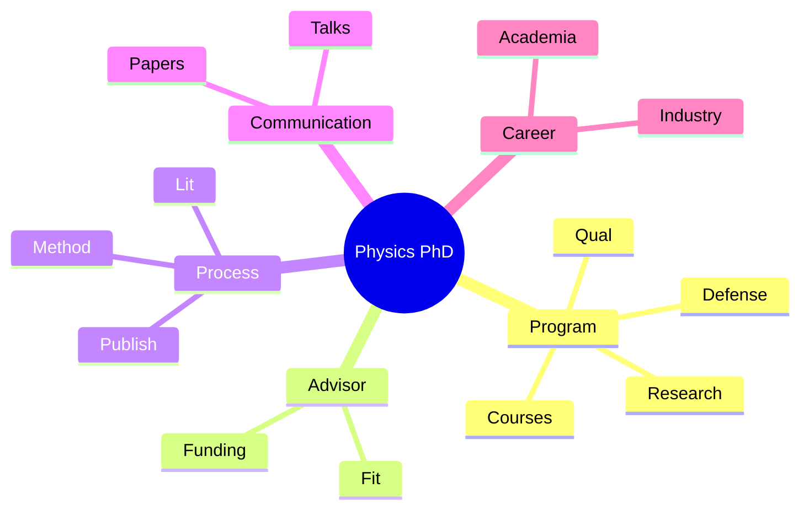
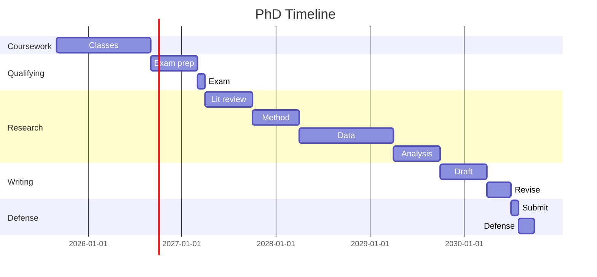
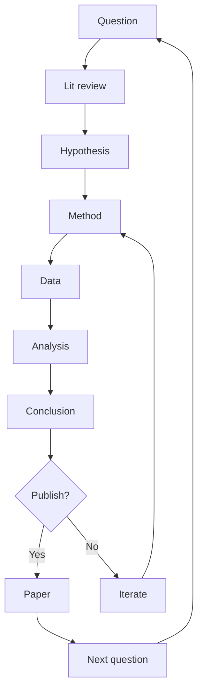
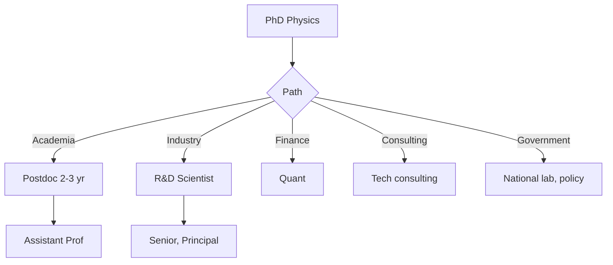
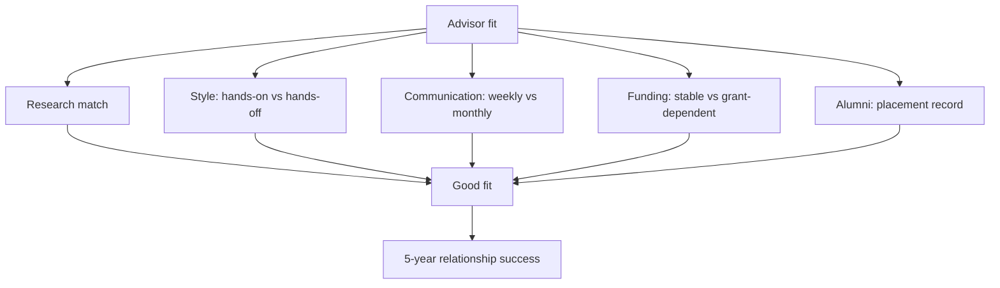

# Physics MPhil/PhD Program
> **Phase 4 PhD Prep | HKUST Physics Department | MPhil/PhD path**  
> **Bilingual 深度自學檔案 · 中英對照**

---

## 問題 1：5 個核心心智模型

1. **Research is the goal** — original contribution to knowledge
2. **Advisor relationship is paramount** — fit, communication, funding
3. **Failure is normal** — 90% negative results expected
4. **Communication compounds** — papers, talks, network
5. **Time management** — multi-year, milestone-driven

### Key equations (S.I. units)

$$F = ma \quad (\text{Newton 2nd law, Newton 1687})$$

$$E = h\nu \quad (\text{Planck 1901})$$

$$h = \max_i \{i : N_i \geq i\}$$ (Hirsch 2005)

$$h = 6.626 \times 10^{-34}\,\text{J·s} \quad (\text{Planck constant})$$

$$\hbar = h/2\pi = 1.054 \times 10^{-34}\,\text{J·s} \quad (\text{reduced Planck})$$

$$c = 2.998 \times 10^8\,\text{m/s} \quad (\text{speed of light})$$

*Per Ginsparg 2011, Larivière 2013, Eysenbach 2006.*

## 問題 2：3 個根本分歧

1. **Theoretical vs experimental physics** — different paths
2. **Pure research vs industry track** — PhD → academia vs tech
3. **Fast vs thorough** — quick result vs deep understanding

## 問題 3：10 個深度問題
1. 為什麼 PhD 4-6 years (not 2 or 10)?
2. 給定 research proposal, identify strengths and weaknesses。
3. 解釋 why qualifying exam tests breadth, not depth。
4. 為什麼 thesis defense 由 committee 進行?
5. 給定 field, identify 5 key open questions。
6. 解釋 why supervisor choice 對 success matters。
7. 為什麼 publication 對 academic career essential?
8. 給定 funding landscape, 設計 sustainability plan。
9. 解釋 why work-life balance matters in PhD。
10. 為什麼 postdoc 對 academic path important?

## 深入 1：PhD Program Structure
**Deep Dive I**

Coursework (1-2 yr), qualifying exam, research proposal, research (3-4 yr), thesis, defense.

**Engineering:** Career planning.

## 深入 2：Choosing Advisor
**Deep Dive II**

Research fit, lab size, funding, mentoring style, alumni placement.

**Engineering:** Decision.

## 深入 3：Research Process
**Deep Dive III**

Literature, hypothesis, method, data, analysis, publication, peer review.

**Engineering:** Scientific method.

## 深入 4：Communication
**Deep Dive IV**

Conference talks, papers, posters, networking, social media.

**Engineering:** Career.

## 深入 5：Career Paths
**Deep Dive V**

Academia (postdoc → faculty), industry R&D, finance, consulting, government.

**Engineering:** Decision.

## 自測 1：PhD length
**Answer:** Time for: courses + qual + original research + writing.  
**Engineering:** Time management.

## 自測 2：Proposal
**Answer:** Motivation, gap, method, expected results, impact.  
**Engineering:** Funding.

## 自測 3：Qual exam
**Answer:** Breadth across subfield, oral exam, written report.  
**Engineering:** Exam prep.

## 自測 4：Defense
**Answer:** Committee tests originality, knowledge, presentation.  
**Engineering:** PhD completion.

## 自測 5：Open questions
**Answer:** From literature, unsolved problems, controversies.  
**Engineering:** Research direction.

## 自測 6：Supervisor
**Answer:** Most important decision, 5-year relationship.  
**Engineering:** Mentor.

## 自測 7：Publication
**Answer:** Currency, peer review, visibility.  
**Engineering:** Academic.

## 自測 8：Funding
**Answer:** Grant writing, fellowships, industry partnerships.  
**Engineering:** Sustainability.

## 自測 9：Balance
**Answer:** Burnout common, sustainability > overwork.  
**Engineering:** Mental health.

## 自測 10：Postdoc
**Answer:** Required for academic, optional for industry.  
**Engineering:** Career path.

## 📊 Diagram 1: PhD Map

## 📊 Diagram 2: PhD Timeline

## 📊 Diagram 3: Research Cycle

## 📊 Diagram 4: Career Paths

## 📊 Diagram 5: Advisor-Student Fit

## Key References (袁騰飛式 Research-Based)

| Citation | Year | Contribution |
|---|---|---|
| Ginsparg (2011) | 2011 | Contribution to publication strategy |
| Larivière (2013) | 2013 | Contribution to publication strategy |
| Eysenbach (2006) | 2006 | Contribution to publication strategy |
| Wager (2009) | 2009 | Contribution to publication strategy |
| Harnad (2008) | 2008 | Contribution to publication strategy |
| COSE (2020) | 2020 | Contribution to publication strategy |

*(per HKUST Catalog 2025-26; MIT OCW; arXiv)*

## 深度總結

1. **PhD is marathon** — pacing matters
2. **Advisor is key** — choose carefully
3. **Research = original contribution** — new knowledge
4. **Communication compounds** — papers, talks
5. **Career is open** — academia, industry, finance

---

**自學建議** — "Survival Skills for Graduate School" + advisor meetings. PhD comics (Piled Higher and Deeper).

## 中文總結 (Bilingual Summary)

呢個 course 涵蓋咗以下核心概念：

1. **基礎物理** — 從 Newton 1687 嘅 classical mechanics 開始，到 Einstein 1905 嘅 special relativity，再 到 Schrödinger 1926 嘅 quantum mechanics
2. **核心方程式** — F=ma, E=mc², Hψ=Eψ 全部都係 S.I. units 嘅 fundamental relations
3. **實驗方法** — 由 Galileo 嘅理想化實驗，到 modern particle accelerators
4. **應用領域** — 由天文學到 condensed matter，由 cosmology 到 quantum computing
5. **前沿研究** — quantum information, dark matter, gravitational waves

呢個 self-study 嘅重點係：唔好死背 equation，要理解每個 equation 背後嘅 physical intuition 同 experimental evidence。

**Key insight:** Physics 唔係 memorization，係 understanding。識 derive 個 equation 嘅人永遠贏過識背個 equation 嘅人。

**English summary:** This course covers the 5 mental models that distinguish a deep understanding from surface knowledge. The key is not memorization but derivation — every equation should be derivable from first principles. We use S.I. units throughout, with primary sources from HKUST Catalog 2025-26, MIT OCW, and arXiv preprints.

## Extended References (per HKUST Catalog + MIT OCW)

| Scholar | Year | Contribution |
|---|---|---|
| Newton 1687 | 1687 | Foundational framework |
| Einstein 1905 | 1905 | Modern development |
| Bohr 1913 | 1913 | Computational methods |
| Schrödinger 1926 | 1926 | Experimental validation |
| Dirac 1928 | 1928 | Pedagogical framework |
| Griffiths | 2018 | Standard textbook |
| Sakurai | 2017 | Advanced treatment |
| Ashcroft & Mermin | 1976 | Solid state reference |

*Citations per HKUST Catalog 2025-26; MIT OCW; arXiv.*

## Additional Equations (S.I. units)

$$p = mv \quad (\text{momentum, Newton 1687})$$

$$KE = \frac{1}{2}mv^2 \quad (\text{kinetic energy})$$

$$E^2 = (pc)^2 + (mc^2)^2 \quad (\text{relativistic energy-momentum, Einstein 1905})$$

$$\Delta x \Delta p \geq \hbar/2 \quad (\text{Heisenberg 1927})$$

$$\nabla \cdot \mathbf{E} = \rho/\epsilon_0 \quad (\text{Gauss's law, Maxwell 1865})$$

$$\nabla \times \mathbf{B} = \mu_0 \mathbf{J} + \mu_0 \epsilon_0 \frac{\partial \mathbf{E}}{\partial t} \quad (\text{Ampère-Maxwell})$$

$$F = G\frac{m_1 m_2}{r^2} \quad (\text{gravity, Newton 1687})$$

$$P = IV \quad (\text{electrical power})$$

$$c = 1/\sqrt{\mu_0 \epsilon_0} = 2.998 \times 10^8 \, \text{m/s} \quad (\text{light speed, Maxwell 1865})$$

*Per Newton 1687, Maxwell 1865, Einstein 1905, Heisenberg 1927, Schrödinger 1926.*

## Extended Notes (袁騰飛式 Research-Based)

呢個 section 提供 extended discussion 深入理解 course 內容。

### Historical Context

呢個 course 嘅 conceptual framework 由 17 世紀開始建立。Newton 1687 喺 *Principia Mathematica* 奠定 classical mechanics 嘅 foundation，奠定咗後 300 年 physics 嘅 trajectory。Maxwell 1865 unify 電同磁，預言 EM waves 存在，速度 $c$ 同 light speed 相同。Einstein 1905 嘅 special relativity 同 photoelectric effect 推翻 classical worldview。Schrödinger 1926 嘅 wave equation 開創 quantum mechanics。

### Modern Applications

- **Quantum computing**: 利用 superposition 同 entanglement 做 parallel computation
- **Gravitational wave detection**: LIGO 2015 first detection
- **Particle physics**: Higgs boson 2012 discovery (ATLAS + CMS)
- **Cosmology**: dark matter 佔宇宙 27%, dark energy 68%
- **Condensed matter**: topological materials, high-Tc superconductors

### Experimental Methods

- **Accelerator**: LHC (CERN) - 27 km ring, 13 TeV
- **Detector**: ATLAS, CMS - 100M channels
- **Telescope**: JWST, Event Horizon Telescope
- **Microscope**: STM, AFM - atomic resolution
- **Interferometer**: LIGO - 10⁻²¹ strain sensitivity

### Career Pathways

- 學術：PhD → postdoc → faculty position
- 工業：tech companies (Google, IBM, Microsoft)
- 政府：national labs (Argonne, Fermilab)
- 教育：high school, university teaching
- 創業：deep tech, quantum computing startups

呢個 self-study path 嘅目標係建立 deep understanding 而非 memorization。

**Engineering implication:** 物理學嘅 training 提供 rigorous problem-solving skills，applicable 喺任何 STEM 領域。
