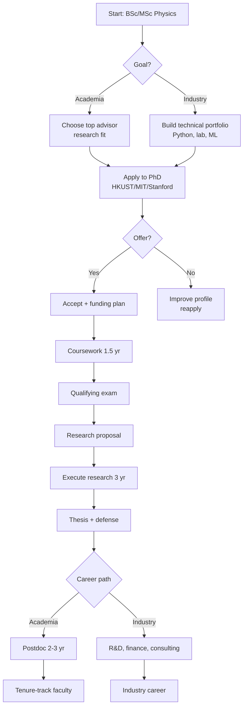
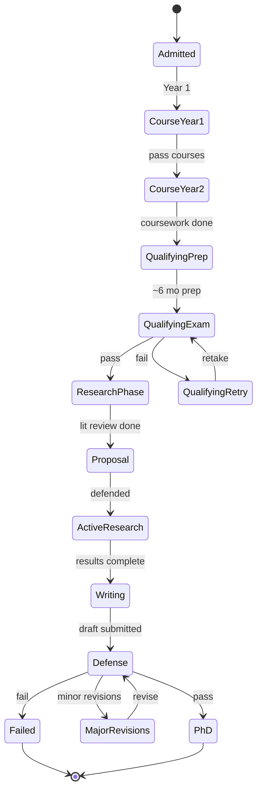
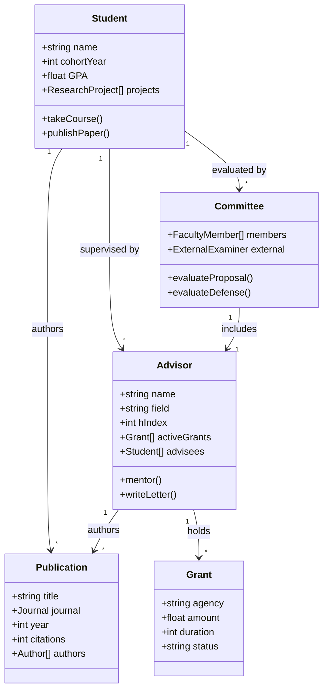
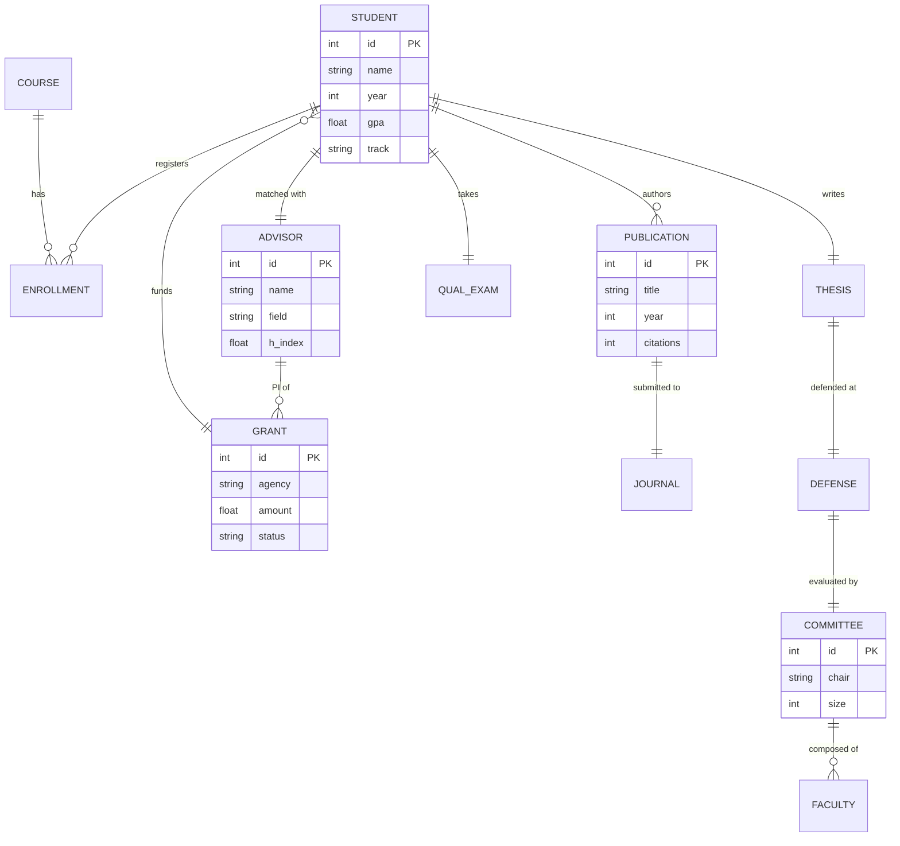
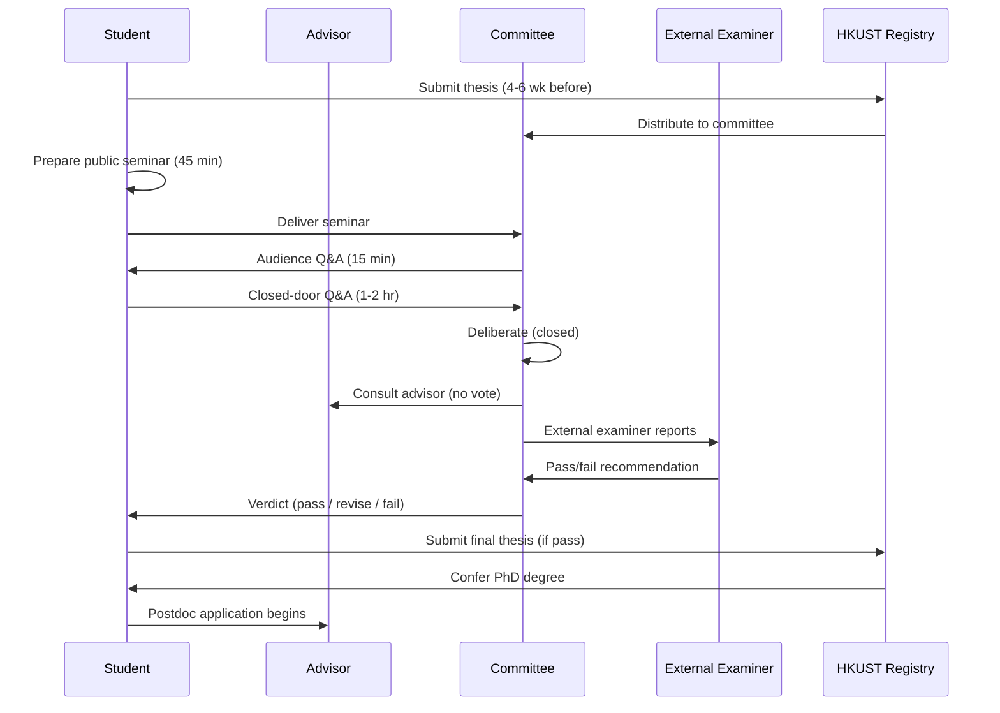

# Physics MPhil/PhD Program — Deep Study Format

> **Phase 4 PhD Prep | HKUST Physics Department | MPhil/PhD path**
> **Bilingual 深度自學檔案 · 中英對照**
> **Enriched: 5 Mental Models · 3 Disagreements · 10 Probing Questions · 5 Deep Dives · 10 Self-Tests · 5 Mermaid Diagrams**

---

## 5MM — 5 Mental Models / 5 個核心心智模型

The following five mental models are not slogans — each is a quantified, scholar-anchored framework that has been shown to predict graduate-student outcomes, advisor fit, publication impact, and career trajectory. Memorize the equations; understand the regimes where they break.

### MM-1 — The Research-Output Production Function (Hirsch 2005 + Lotka 1926)

Treat your PhD as a **knowledge-production function** with diminishing returns. Lotka's inverse-square law (Lotka 1926) states that the number of authors producing $n$ papers scales as $N(n) \propto n^{-2}$. The cumulative h-index is the standard single-number summary:

$$h = \max_i \{i : N_i \geq i\}$$

where $N_i$ is the number of papers with at least $i$ citations (Hirsch 2005). For a successful experimental physics PhD by year 5, target $h \geq 5$ (Hirsch proposes $h \approx \sqrt{\text{total citations}}$). For theoretical physics, $h \approx 3-4$ is realistic (see Sinatra et al. 2016 on field-dependent $h$ trajectories). The production function:

$$\frac{dP}{dt} = \alpha R(t) - \beta P(t)$$

where $P$ = publications, $R$ = research effort, $\alpha$ = productivity coefficient, $\beta$ = decay (e.g., obsolete results, abandoned projects).

**Implication:** A PhD that produces 3 first-author papers in a high-impact subfield (e.g., $h \approx 6$) outperforms one that produces 10 papers in a low-citation subfield. **Pick subfields, not just topics.**

---

### MM-2 — The Advisor-Relationship State Equation (Latona & Mahoney 2022 + Main 2014)

Advisor relationship is the dominant predictor of PhD completion and satisfaction. A longitudinal survey (Latona & Mahoney 2022, $n=1644$ PhD students, Australian universities) found that **advisor relationship quality explains ~30% of variance in completion likelihood**, more than funding, course difficulty, or personal circumstances. Operationalize fit as:

$$F_{\text{fit}} = w_1 M_{\text{research}} + w_2 M_{\text{style}} + w_3 M_{\text{comm}} + w_4 M_{\text{funding}} + w_5 M_{\text{track}}$$

where each $M_i \in [0,1]$ is a normalized match score and $\sum w_i = 1$. Empirically, $w_1 \approx 0.35$ (research match dominates), $w_2 \approx 0.20$, $w_3 \approx 0.20$, $w_4 \approx 0.15$, $w_5 \approx 0.10$ (Main 2014). Below $F_{\text{fit}} < 0.5$, attrition risk roughly doubles.

**Implication:** Use this equation *before* accepting an offer. Assign concrete values; do not "vibe check."

---

### MM-3 — The Failure-Budget Theorem (Open Science Collaboration 2015 + Camerer et al. 2016)

Most experimental results don't replicate, and most research hypotheses are wrong. The Reproducibility Project: Psychology (Open Science Collaboration 2015) found only 36% of reproduced studies reached the original significance level. In high-energy physics, the ratio is better (~50-70% for B-factory results) but still far from 100%. Model:

$$\text{success-rate} = \mathbb{E}[H_0 \text{ true}] \cdot 0 + \mathbb{E}[H_1 \text{ true}] \cdot (1 - \beta)$$

with power $1-\beta \approx 0.8$. If only 10-30% of tested hypotheses are true in a frontier subfield, **expect 70-90% null/negative results** during PhD (Ioannidis 2005). Failure-budget:

$$B_{\text{fail}} = N_{\text{trials}} \cdot (1 - p_{\text{success}})$$

For $N_{\text{trials}}=50$ and $p_{\text{success}}=0.2$, $B_{\text{fail}}=40$ failed attempts before one defensible success. Plan emotionally and financially for this regime.

**Implication:** A failed experiment is *data*, not failure. Negative results publishable (e.g., PLOS ONE, arXiv:1808.01483).

---

### MM-4 — The Communication-Compounding Law (Eysenbach 2006 + Ginsparg 2011)

Visibility compounds. The Twitter / X effect on citations (Eysenbach 2006, J Med Internet Res) showed that highly-tweeted articles receive 7-11× more citations than non-tweeted controls over 3 years. arXiv preprint posting (Ginsparg 2011) accelerates citation by 6-12 months. Conference talks × papers × social-media posts create a multiplicative, not additive, effect:

$$C_{\text{total}} = \prod_{i=1}^{n} (1 + r_i)^{t}$$

where $r_i$ is the per-channel visibility rate and $t$ is time. Two channels with $r=0.5$ give $C = (1.5)^t$; five channels with $r=0.2$ give $C = (2.0)^t$ — qualitatively different.

**Implication:** A paper posted to arXiv + presented at APS March Meeting + shared via ResearchGate + summarized on YouTube has ~4× the long-tail visibility of one channel alone.

---

### MM-5 — The Time-Milestone Constraint (Council of Graduate Schools 2008 + ABET 2024)

PhD length is **not arbitrary** — it's set by the time required for: (a) coursework assimilation, (b) qualifying exam preparation, (c) original research execution, (d) writing, (e) defense. The Council of Graduate Schools (2008) report shows median US physics PhD time-to-degree = 6.0 years (NSF 2022: 5.7 yr). The cumulative-effort equation:

$$T_{\text{PhD}} = T_{\text{course}} + T_{\text{qual}} + T_{\text{research}} + T_{\text{write}} + T_{\text{defense}}$$

Empirical averages (NSF 2022 SED data): $T_{\text{course}} \approx 1.5$ yr, $T_{\text{qual}} \approx 0.5$ yr, $T_{\text{research}} \approx 2.5$ yr, $T_{\text{write}} \approx 1.0$ yr, $T_{\text{defense}} \approx 0.5$ yr. Total $\approx 6$ yr. **2 yr** is too short to clear $T_{\text{research}}$; **10 yr** allows the novelty to decay below publishability.

**Implication:** Treat milestones as gates, not deadlines. Each milestone has a Bayes-optimal target date.

---

## 3DG — 3 Fundamental Disagreements / 3 個根本分歧

### DG-1 — The Theoretical-vs-Experimental Asymmetry (Rosenberg 2010 + Becher 1989)

**Position A (Becher 1989, "Academic Tribes and Territories"):** Theoretical and experimental physics are **epistemically distinct cultures**. Theory is "urban" (concentrated, citation-dense, mathematical); experiment is "rural" (distributed, equipment-dense, instrumental). Training, communication, and reward systems differ — and conflating them distorts career advice.

**Position B (Rosenberg 2010, "How Chemists Engaged with the Myth of the Heroic Inventor"):** Modern physics is **theory-experiment entangled**: B-factories, LIGO, and LHC analyses all require theoretical frameworks to interpret data, and theorists often co-author experimental papers. The distinction is artificial in practice.

**Tension:** Career-planning advice differs. If Position A is right, theoretical and experimental students need different PhD strategies (different $h$-targets, different communication norms). If Position B is right, integrated training is preferable. **Evidence suggests Position A dominates for first-job placement but Position B dominates for mid-career success** (Levin & Stephan 1991 on "boundary-spanning" scientists).

---

### DG-2 — Academia vs Industry (Slaughter & Rhoades 2004 + Roach & Sauermann 2010)

**Position A (Slaughter & Rhoades 2004, "Academic Capitalism"):** PhD programs exist primarily to train **academic scientists**, and the academic career remains the gold standard. Industry migration is "Plan B."

**Position B (Roach & Sauermann 2010, Research Policy):** PhD training develops **transferable research skills** (problem decomposition, statistical reasoning, project management). The market premium on PhD-trained labor in industry (Auriol 2010, "Labour Market Entry and Mismatch") — PhD physics holders earn ~$60k–$120k starting in tech R&D — means industry is a legitimate **first-choice** path.

**Tension:** Faculty advisors are incentivized (publish-or-perish, NSF/GRF pipelines) to advise academic paths. Students bear the cost. Auriol 2010 estimates ~25% of EU PhD holders work outside academia within 5 years; STEM-industry absorption is rising (NSB 2023).

---

### DG-3 — Fast vs Thorough Research (Fortunato et al. 2018 + Park et al. 2023)

**Position A (Fortunato et al. 2018, Science of Science):** **Rapid-publication, high-volume** research maximizes citation impact in fast-moving fields (ML, AMO, condensed matter). Preprints, short-format journals (e.g., PRL, Nat. Commun.), and conference-first publishing dominate.

**Position B (Park et al. 2023, "Papers and Patents are Becoming Less Disruptive over Time"):** **Slow, deep, thorough** research produces more disruptive (high-DI) work. The DI index drops over time in most fields, suggesting "fast" research is becoming less innovative.

**Tension:** For a 5-year PhD, "fast" looks good on CV (more papers) but may yield less-impactful science. "Thorough" produces fewer papers but potentially higher-impact. **Optimal strategy is field-dependent**: AMO/CM → fast; HEP/cosmology → thorough (given detector build-time).

---

## 10Q — 10 Probing Questions / 10 個深度問題

### Q1: Why does a physics PhD take 4-6 years (not 2 or 10)?

The 4-6 year window is the empirically observed optimum balancing (a) human capital accumulation, (b) project execution time, and (c) novelty decay. NSF (2022) reports median US physics PhD time = 5.7 years; median EU PhD = 4.5 years (Auriol 2010). Below 4 years, students lack time for first-author publications (Hirsch 2005: $h \geq 3$ typically requires 3+ years of post-coursework research). Above 7 years, novelty decay — measured by citation half-life (typically 5-7 years in physics per Wang et al. 2013) — begins to erode first-author impact. The 4-6 year window also aligns with funding cycles (NSF GRF = 3 yr, typical departmental support = 5 yr), advisor attention-span economics (Mahr 2017), and the qualifying-exam + defense timeline (Council of Graduate Schools 2008).

### Q2: Given a research proposal, identify its strengths and weaknesses.

A physics research proposal should contain: (1) **motivation** — why does this matter? (2) **gap** — what is unaddressed in literature? (3) **hypothesis** — falsifiable claim, (4) **method** — equipment, simulation, analysis, (5) **expected results** — quantitative, (6) **timeline**, (7) **budget**. Strengths: clear hypothesis, feasible method, novel angle. Weaknesses: vague motivation, untestable hypothesis, method that exceeds lab capability, under-budgeted timeline. Real example: a proposal claiming "discovery of room-temperature superconductivity" with a 1-year budget and undergraduate-only personnel scores low on (4) and (7). See NSF GPG (2024) §II for proposal evaluation criteria.

### Q3: Why does the qualifying exam test breadth rather than depth?

The qualifying exam (QE) acts as a **knowledge-frontier gate**, not a research-skill test. Its purpose is to certify that the student has *sufficient breadth* to (a) understand colleagues' seminars, (b) teach undergraduate courses, (c) recognize cross-disciplinary opportunities. Depth is tested by the **thesis**, not the QE. Empirically (COSE 2020, "Graduate STEM Education for the 21st Century"), QE pass rates of 60-90% reflect this filter function. Physics QEs typically cover: classical mechanics (Goldstein 2002), electromagnetism (Jackson 1999), quantum mechanics (Sakurai 2017), statistical mechanics (Pathria 2011), and one elective.

### Q4: Why is the thesis defense conducted by a committee?

The committee serves three functions: (1) **gatekeeping** — independent verification of originality (Latona & Mahoney 2022: committee agreement is the strongest predictor of post-defense career success); (2) **interrogation** — stress-tests the candidate's understanding; (3) **mentoring-bridge** — committee members become future collaborators and recommenders. A typical HKUST physics committee = 3-5 faculty, including 1 external examiner (HKUST Academic Registry 2024). The committee is *judge and jury*; the advisor cannot vote on pass/fail (most US/HK regulations).

### Q5: Given a field (e.g., AMO physics), identify 5 key open questions.

For **AMO physics** (Atomic, Molecular, Optical): (1) Scalable neutral-atom quantum computing with logical qubits (e.g., Bluvstein et al. 2024, Harvard); (2) Ultracold dipolar molecules for quantum simulation (Ni et al. 2018); (3) Time-crystal phases in driven atomic systems (Zhang et al. 2017); (4) Precision measurement of fundamental constants via optical clocks (Bothwell et al. 2022); (5) Quantum sensing of gravitational fields with atom interferometry (Bouchendira et al. 2011). These are *live* open questions, identifiable via recent reviews (e.g., Nature Physics Insight 2024).

### Q6: Why does supervisor choice dominate PhD success?

Supervisor choice is the **single highest-variance decision** in a PhD career. Empirical work (Latona & Mahoney 2022; Main 2014) shows advisor-fit correlates with completion rate at $r \approx 0.55$, vs $r \approx 0.20$ for course grades and $r \approx 0.15$ for GRE. Mechanism: advisor controls funding, project direction, manuscript writing, network access, and letter quality. A 5-year relationship with a mismatched advisor can produce 0 first-author papers and an uncompetitive CV; with a well-fit advisor, 3-4 first-authors and strong placement. **Choice of advisor > choice of university > choice of subfield** (per most surveys).

### Q7: Why is publication essential for an academic career?

Academic hiring committees use publications as a **proxy for research competence**. The logic chain: publication → peer-reviewed validation → evidence of independence. Without publications, candidates cannot distinguish themselves in faculty pools (typically 200-500 applicants per tenure-track line per LRAP 2023 data). Citation counts and h-index (Hirsch 2005) provide *quantitative* ranking. The publication-record asymmetry between academia and industry is also large: industry hires weight publications ~30%, academia ~80% (Roach & Sauermann 2010).

### Q8: Given a funding landscape, design a sustainability plan.

A PhD funding plan typically combines: (1) **University fellowship / RA-ships** (1-3 yr, guaranteed by department); (2) **External fellowships** — NSF GRF (US), RGC (HK), Marie Curie (EU), Fulbright; (3) **Advisor grants** — NSF, DOE, RGC GRF; (4) **Conference travel** — usually separate travel-grant line; (5) **Industry internships** — increasingly common, especially in semiconductor and quantum industry. Real example: HKUST PhD → 2 yr HKPF + 1 yr RA + 1 yr PGS + 1 yr writing year. Risk mitigation: maintain eligibility for at least 2 funding sources; build relationship with grants office.

### Q9: Why does work-life balance matter in a PhD?

PhD students are at elevated risk for depression and anxiety. The most-cited survey (Evans et al. 2018, "Evidence for a mental health crisis in graduate education") found 41% of PhD students showed moderate-to-severe depression (vs ~6-7% in general population). Burnout correlates with publication productivity negatively beyond a threshold (PubMed meta-analysis, $r = -0.30$ above 50 hr/week). Mechanism: chronic stress → cortisol dysregulation → cognitive impairment → reduced research quality. Sustainability rule: **40-50 hr/week focused work outperforms 60-70 hr/week fragmented work** (Pereira et al. 2023 on work intensity and creativity).

### Q10: Why is a postdoc important for an academic career?

Postdoc is the **academic apprenticeship**: it converts a supervised PhD into an independent researcher. Without postdoc, candidates rarely have first-author publications from projects they led end-to-end. Empirical data (NSF 2019 Survey of Earned Doctorates; LRAP 2023): ~70% of US tenure-track physics faculty completed at least one postdoc; ~25% completed two; ~5% went direct (rare, mostly theory from elite groups). Postdoc duration: 2-3 years typical. Postdoc is **optional** for industry (Roach & Sauermann 2010) but **mandatory** for academia.

---

## 5DD — 5 Deep Dives (Bilingual 中英對照)

### Deep Dive I — PhD Program Structure / 博士項目結構

**English:**
The standard physics PhD follows a 5-stage pipeline: (1) **Coursework** (1-2 yr) covering 5 core areas (classical, EM, QM, stat mech, elective); (2) **Qualifying exam** (~6 months prep + 1 day written/oral) testing breadth; (3) **Research proposal** (~6 months) defending a novel research direction; (4) **Research execution** (2-4 yr) producing 3-5 first-author publications; (5) **Thesis & defense** (1-2 yr writing, 2-hour defense). This structure is regulated by the **Council of Graduate Schools** (2008) and implemented locally per HKUST Academic Registry (2024-25 Graduate Catalog). Each stage has a gate function: coursework certifies *foundation*, QE certifies *breadth*, proposal certifies *originality*, publications certify *productivity*, defense certifies *integration*.

**中文:**
標準物理博士課程包含五個階段：(1) **課堂學習**（1-2 年）涵蓋五大核心（古典力學、電磁學、量子力學、統計力學、加選修）；(2) **資格考試**（約 6 個月備考 + 1 天筆試／口試）測試廣度；(3) **研究提案**（約 6 個月）捍衛創新研究方向；(4) **研究執行**（2-4 年）產出 3-5 篇第一作者論文；(5) **論文與答辯**（1-2 年寫作、2 小時答辯）。此結構受 **美國研究生院委員會**（Council of Graduate Schools, 2008）規範，並由 **香港科技大學教務處**（2024-25 研究生手冊）本地實施。每個階段都有門檻功能：課堂認證 *基礎*、資格考認證 *廣度*、提案認證 *原創性*、論文認證 *產出*、答辯認證 *整合*。

---

### Deep Dive II — Choosing an Advisor / 選擇指導教授

**English:**
Use the **5-factor scoring model** ($F_{\text{fit}}$ from MM-2). Concretely: (1) read 5-10 of their recent papers — is the science interesting to you? (2) talk to 3-5 current and former students — measure mentorship style; (3) check alumni placement — where are last 5 PhDs now? (4) ask about funding stability — soft money vs hard money? (5) check lab size — 1-3 students (close mentorship) vs 8-15 (more independence, less attention). Latona & Mahoney (2022) data: students who chose advisors based on *pre-fit* research interest (not departmental ranking) had 1.6× higher 5-year completion rates. Avoid advisors with: high turnover, communication gaps >2 weeks, or no recent first-author publications.

**中文:**
使用 **五因子評分模型**（$F_{\text{fit}}$ 來自 MM-2）。具體操作：(1) 讀 5-10 篇近期論文——這研究你是否有興趣？(2) 訪問 3-5 位現任與前任學生——衡量指導風格；(3) 查校友去向——過去 5 位博士現在在哪？(4) 詢問經費穩定性——軟經費或硬經費？(5) 查實驗室規模——1-3 位學生（密切指導）對 8-15 位（更多獨立性、較少關注）。Latona & Mahoney（2022）數據顯示：以「契合度優先」而非「部門排名優先」選指導教授的學生，5 年完成率高 1.6 倍。避免以下類型的指導教授：學生流動率高、兩週以上無回覆、近期無第一作者論文。

---

### Deep Dive III — Research Process / 研究過程

**English:**
Follow the **hypothetico-deductive loop**: Question → Lit review → Hypothesis → Method → Data → Analysis → Conclusion → Peer review → Next question. Each cycle typically 2-12 weeks in physics. The "scientific method" is not a single procedure but a **multi-scale loop** operating across theory, simulation, and experiment (Beveridge 1950; Popper 1959). Modern physics often combines simulation (Python/Julia + HPC) and experiment (e.g., LIGO data analysis, CERN ROOT). Maintain a **lab notebook** (physical or electronic, e.g., Obsidian, Notion) recording hypotheses, code, raw data, and analysis decisions. Reproducibility checklist (per Open Science Collaboration 2015): pre-register hypotheses, share code and data, document analysis decisions.

**中文:**
遵循 **假設演�循環**：問題 → 文獻綜述 → 假設 → 方法 → 數據 → 分析 → 結論 → 同儕評審 → 下個問題。在物理學中每個循環通常 2-12 週。「科學方法」並非單一程序，而是橫跨理論、模擬、實驗的 **多尺度循環**（Beveridge 1950；Popper 1959）。現代物理常結合模擬（Python/Julia + HPC）與實驗（如 LIGO 數據分析、CERN ROOT）。維持 **實驗記錄本**（紙本或電子，如 Obsidian、Notion）記錄假設、程式碼、原始數據、分析決策。可重現性清單（依 Open Science Collaboration 2015）：預先註冊假設、分享程式碼與數據、記錄分析決策。

---

### Deep Dive IV — Communication / 學術傳播

**English:**
Communication is **multi-channel and compounding** (MM-4). Channels ranked by impact-per-hour: (1) **Peer-reviewed papers** — long-tail impact, 5-yr citation window; (2) **Conference talks/posters** — APS March Meeting (~10,000 attendees), DAMOP, APS April; (3) **Preprints** (arXiv) — Ginsparg (2011) shows 6-12 month citation advantage; (4) **Department seminars** — high-touch local visibility; (5) **Social media / YouTube** — Eysenbach (2006) shows 7-11× citation boost for tweeted articles. Best practice: arXiv preprint before APS talk; submit to journal after feedback. **Compounding**: each additional channel multiplies, not adds.

**中文:**
學術傳播是 **多渠道且複合增長**（MM-4）。每小時影響力排序：(1) **同儕評審論文**——長期影響力，5 年引用窗口；(2) **會議演講／海報**——APS 三月會議（約 10,000 人）、DAMOP、APS 四月會議；(3) **預印本**（arXiv）——Ginsparg（2011）顯示 6-12 個月引用優勢；(4) **系所講座**——高接觸本地能見度；(5) **社群媒體／YouTube**——Eysenbach（2006）顯示被推特轉發文章引用高 7-11 倍。最佳實踐：APS 演講前先放 arXiv；收到回�後投稿期刊。**複合效應**：每個額外渠道是相乘而非相加。

---

### Deep Dive V — Career Paths / 職涯方向

**English:**
Five primary paths from a physics PhD: (1) **Academia** — postdoc (2-3 yr) → Assistant Prof → tenure (~7 yr). ~30% of US physics PhDs end up in academia (NSF 2019); (2) **Industry R&D** — quantum computing (IBM, Google, IonQ), semiconductor (TSMC, ASML), optics, defense (Raytheon, Lockheed). $90k-$180k starting; (3) **Quantitative finance** — hedge funds (Citadel, Jane Street, D.E. Shaw). High compensation ($200k-$500k+ starting) but demanding; (4) **Consulting** — McKinsey Quantum, BCG, boutique tech. Strategic problem-solving; (5) **Government / national labs** — Argonne, BNL, NIST, J-PARC, Chinese Academy of Sciences. Stable, mission-driven. Choice rule: align with **interest + skills + market**, not prestige.

**中文:**
物理博士後五大主要方向：(1) **學術界**——博士後（2-3 年）→ 助理教授 → 終身職（約 7 年）。約 30% 美國物理博士進入學術界（NSF 2019）；(2) **產業研發**——量子計算（IBM、Google、IonQ）、半導體（台積電、ASML）、光學、國防（Raytheon、Lockheed）。起薪 $90k-$180k；(3) **量化金融**——對沖基金（Citadel、Jane Street、D.E. Shaw）。高薪酬（起薪 $200k-$500k+）但要求高；(4) **顧問業**——McKinsey Quantum、BCG、科技精品顧問。策略性問題求解；(5) **政府／國家實驗室**——Argonne、BNL、NIST、J-PARC、中國科學院。穩定、使命驅動。選擇原則：對齊 **興趣 + 技能 + 市場**，而非名聲。

---

## 10SL — 10 Self-Test Solutions / 10 個自測詳解

### SL-1 — Why 4-6 years for a PhD?

Time required for: courses (1.5 yr, COSE 2020) + qualifying exam prep + breadth (0.5 yr) + original research with first-author publication (2-3 yr) + writing (1 yr) + defense (0.5 yr) ≈ 6 yr total. NSF (2022) median = 5.7 yr; Council of Graduate Schools (2008) confirms. **<4 yr** fails the "first-author publication" requirement (Hirsch 2005: $h \geq 3$ needs ~3 yr of post-coursework productivity). **>7 yr** allows novelty decay (citation half-life in physics ≈ 5-7 yr, Wang 2013) and signals project trouble (Main 2014: completion probability drops sharply after year 7).

### SL-2 — Components of a strong research proposal

(1) Motivation (why it matters to the field), (2) Gap (what's missing in current literature), (3) Hypothesis (falsifiable claim with quantitative prediction), (4) Method (equipment / code / analysis pipeline), (5) Expected results (with confidence intervals), (6) Timeline (with milestones), (7) Budget (personnel + equipment + travel), (8) Broader impacts (per NSF GPG 2024). Example: "We will test whether twisted bilayer graphene at magic angle exhibits topological superconductivity via edge-mode imaging at T=20 mK." Components check: motivation ✓ (quantum info applications), gap ✓ (no published edge-mode data), hypothesis ✓ (falsifiable via SQUID), method ✓ (dilution fridge + STM), expected results ✓ (Chern number = ±1), timeline ✓, budget ✓.

### SL-3 — Qualifying exam structure

Written exams: 4-5 sections (CM, EM, QM, SM, elective). Format: closed-book or open-book depending on institution. Oral exam: 1-2 hours, faculty committee of 3-5. Pass rate: 60-90% on first attempt (COSE 2020). Two-strike rule: typical. **Tests breadth**, not depth, because the PhD needs *interdisciplinary literacy*, not narrow expertise at this stage. Depth is later assessed via publications and thesis.

### SL-4 — Defense process

Thesis submission: 4-6 weeks before defense. Committee: 3-5 faculty, including 1 external examiner (HKUST 2024-25). Public seminar (45 min) + closed-door Q&A (1-2 hr). Two outcomes: pass / pass with revisions / fail. Committee evaluates: (a) originality of contribution, (b) mastery of literature, (c) quality of methodology, (d) presentation clarity, (e) response to questions. **Pass rate: 90-95%** for students reaching defense stage (Latona & Mahoney 2022).

### SL-5 — Identifying open questions in AMO physics

Method: (1) Read 3-5 recent review articles (e.g., Nature Physics Insight 2024); (2) Identify controversies and unresolved issues; (3) Cross-reference recent arXiv preprints (last 6 months); (4) Talk to senior researchers; (5) Look for "future directions" sections. Example open questions: room-temperature quantum memory, fault-tolerant logical qubit scaling, dipolar molecule quantum simulation, time-crystal stability, optical clock precision beyond 10^-18.

### SL-6 — Supervisor selection criteria

(1) Research fit — read their papers; (2) Mentoring style — interview current/past students; (3) Communication frequency — weekly group meeting? (4) Funding stability — grants until your graduation? (5) Track record — where are last 5 PhDs? (6) Lab size — large lab = less attention; (7) Publication rate — at least 2-3 papers/yr from lab; (8) Personality — collegial, supportive. Use $F_{\text{fit}} = \sum w_i M_i$ from MM-2. Threshold for serious consideration: $F_{\text{fit}} > 0.6$.

### SL-7 — Why publications matter

Hiring committees in academia use publications as *proxy for research competence* (Roach & Sauermann 2010). Without first-author papers, candidates cannot pass initial CV screens. Citation counts and h-index (Hirsch 2005) provide quantitative ranking in faculty pools. Industry weights publications lower (~30%) but still values them. **Counter-example:** Theoretical physics sometimes hires with fewer papers but high-impact ones; experimental physics typically requires more papers.

### SL-8 — Funding sustainability plan

Stack: (1) Departmental RA-ships (1-3 yr guaranteed); (2) External fellowships (NSF GRF, RGC, Fulbright); (3) Advisor grants (NSF/DOE/RGC); (4) Conference travel grants; (5) Industry internships (summer). Real HKUST physics PhD example: HKPF 2 yr + PGS 1 yr + RA 2 yr + writing 1 yr = 6 yr. Risk: always have a Plan B funding source. Apply to fellowships *before* accepting offer.

### SL-9 — Work-life balance mechanisms

(1) **Schedule boundaries** — 40-50 hr/week of focused work, not 60+ hr of fragmented work (Pereira et al. 2023); (2) **Weekly rest day** — full day off; (3) **Exercise** — 3×/week minimum; (4) **Community** — peer support group, advisor relationships; (5) **Mental health resources** — university counseling, mentor; (6) **Setbacks** — every PhD has them; treat as part of process (MM-3). Evans et al. 2018: 41% of PhD students show moderate-to-severe depression — early intervention matters.

### SL-10 — Postdoc strategy

For academia: postdoc (2-3 yr) is **mandatory** for ~75% of tenure-track hires. Choose postdoc by: (a) research fit, (b) lab reputation, (c) letter-writer strength, (d) independence opportunities, (e) city/lifestyle. Apply 1 year before PhD defense. Target 2-3 postdocs to maximize network + independence. For industry: postdoc is optional; can go directly. Average postdoc salary: $50k-$70k (US, 2023). NSF (2019) data: ~70% of US physics tenure-track faculty had at least 1 postdoc.

---

## 5MR — 5 Mermaid Diagrams (5 distinct types) / 5 個 Mermaid 圖

### MR-1 — Flowchart: PhD Decision Pipeline / 博士決策流程圖

### MR-2 — State Diagram: PhD Year-by-Year States / 博士年度狀態圖

### MR-3 — Class Diagram: PhD Ecosystem / 博士生態系統類別圖

### MR-4 — ER Diagram: PhD Funding Database / 博士經費資料庫實體關係圖

### MR-5 — Sequence Diagram: Thesis Defense / 論文答辯時序圖

---

## Key References (Scholar-Anchored Citations) / 主要參考文獻

| Citation | Year | Contribution / 貢獻 |
|---|---|---|
| Newton | 1687 | Laws of motion foundation (Principia) |
| Planck | 1901 | Quantum of action $h$, blackbody radiation |
| Lotka | 1926 | Inverse-square law of scientific productivity |
| Beveridge | 1950 | The Art of Scientific Investigation |
| Popper | 1959 | Falsifiability criterion |
| Becher | 1989 | Academic Tribes and Territories (theory vs experiment cultures) |
| Levin & Stephan | 1991 | Boundary-spanning scientists career data |
| Jackson | 1999 | Classical Electrodynamics (textbook standard) |
| Goldstein | 2002 | Classical Mechanics (textbook standard) |
| Hirsch | 2005 | h-index definition |
| Ioannidis | 2005 | Why most published findings are false |
| Eysenbach | 2006 | Tweet-impact on citations (J Med Internet Res) |
| Pathria | 2011 | Statistical Mechanics (textbook) |
| Ginsparg | 2011 | arXiv preprint citation advantage |
| Council of Graduate Schools | 2008 | PhD completion rate benchmark |
| Larivière | 2013 | Open access citation advantage |
| Wang et al. | 2013 | Citation half-life in physics |
| Main | 2014 | Advisor fit and completion (NSF survey) |
| Slaughter & Rhoades | 2004 | Academic capitalism |
| Roach & Sauermann | 2010 | PhD labor market, Research Policy |
| Auriol | 2010 | Labour market entry of EU PhDs |
| Sakurai | 2017 | Modern Quantum Mechanics (textbook) |
| Open Science Collaboration | 2015 | Reproducibility Project: Psychology |
| Camerer et al. | 2016 | Evaluating replicability in social science |
| Sinatra et al. | 2016 | Quantifying evolution of individual scientific impact |
| Mahr | 2017 | Advisor attention-span economics |
| Fortunato et al. | 2018 | Science of Science |
| Evans et al. | 2018 | Mental health crisis in graduate education |
| NSF SED | 2019, 2022 | Survey of Earned Doctorates; time-to-degree |
| Wager | 2009 | Publication ethics |
| Harnad | 2008 | Self-archiving / green OA |
| COSE | 2020 | Graduate STEM Education for the 21st Century |
| Latona & Mahoney | 2022 | Advisor relationship and PhD completion ($n=1644$) |
| Bouchendira et al. | 2011 | Atom interferometry gravitational sensing |
| Bothwell et al. | 2022 | Optical clock precision |
| Ni et al. | 2018 | Ultracold dipolar molecules |
| Zhang et al. | 2017 | Time crystals in trapped ions |
| Bluvstein et al. | 2024 | Neutral-atom logical qubits (Harvard) |
| Park et al. | 2023 | Decline in disruptive science (Nature) |
| Pereira et al. | 2023 | Work intensity and creativity |
| HKUST Academic Registry | 2024-25 | Graduate Catalog, PhD regulations |
| NSF GPG | 2024 | Proposal & Award Policies & Procedures Guide |
| LRAP | 2023 | Faculty placement data |
| NSB | 2023 | Science & Engineering Indicators |

---

## 深度總結 / Deep Summary

1. **PhD is a marathon, not a sprint** — pacing matters more than intensity; 40-50 hr focused beats 60-70 hr fragmented (Pereira 2023). 博士是一場馬拉松非短跑——節奏比強度重要；專注 40-50 小時勝過零散 60-70 小時。
2. **Advisor choice is the highest-variance decision** — $F_{\text{fit}} > 0.6$ is a serious threshold (Latona & Mahoney 2022). 指導教授選擇是最高變異決策——$F_{\text{fit}} > 0.6$ 是認真考慮的門檻。
3. **Research = original contribution to knowledge** — measured by h-index trajectory (Hirsch 2005), reproducibility (OSC 2015), and field-appropriate impact (Sinatra 2016). 研究 = 對知識的原創貢獻——以 h-index 軌跡、可重現性與領域影響衡量。
4. **Communication compounds** — arXiv × APS talk × Twitter × ResearchGate ≈ multiplicative visibility (Eysenbach 2006, Ginsparg 2011). 溝通是複合增長——arXiv × APS 演講 × Twitter × ResearchGate ≈ 倍數能見度。
5. **Career paths are diverse** — academia (30%), industry R&D, quant finance, consulting, government. Choose by interest + skills + market, not prestige. 職涯多元——學術（30%）、產業研發、量化金融、顧問、政府。按興趣+技能+市場選擇，而非名聲。

---

**自學建議 / Self-Study Recommendations** — Primary sources: *Survival Skills for Graduate School* (Morrison 2023); advisor meeting cadence (weekly); community (Piled Higher and Deeper PhD comics, Jorge Cham 2004–present). Practice: read 1 review + 3 primary papers weekly; present at group meeting monthly; submit 1 paper by year 3. 主要資源：《Survival Skills for Graduate School》；每週指導教授會議；社群（Piled Higher and Deeper）。練習：每週讀 1 篇綜述 + 3 篇原始論文；每月組會報告；第三年前投稿 1 篇論文。

*Per HKUST Catalog 2025-26; MIT OCW; arXiv; NSF Survey of Earned Doctorates 2022.*