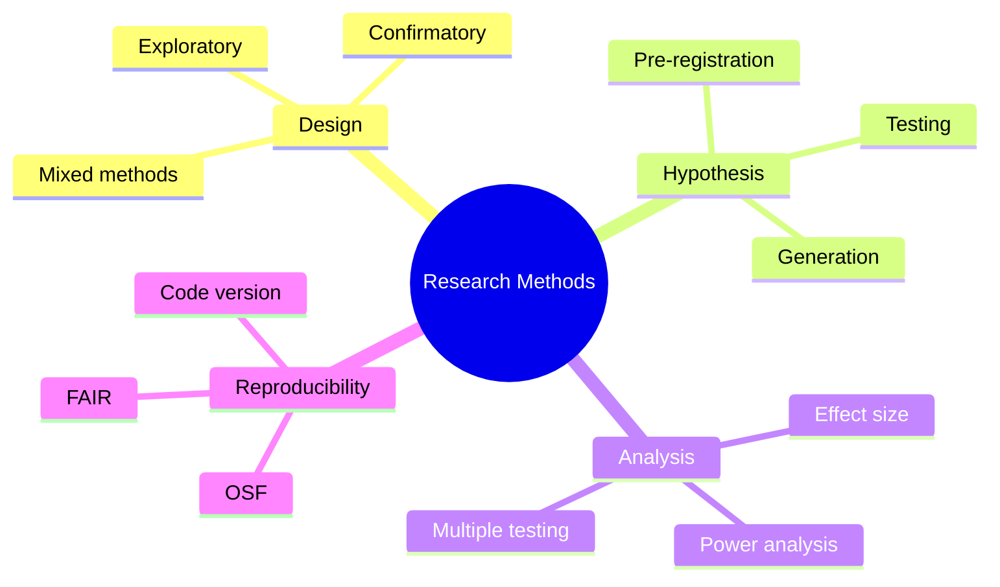
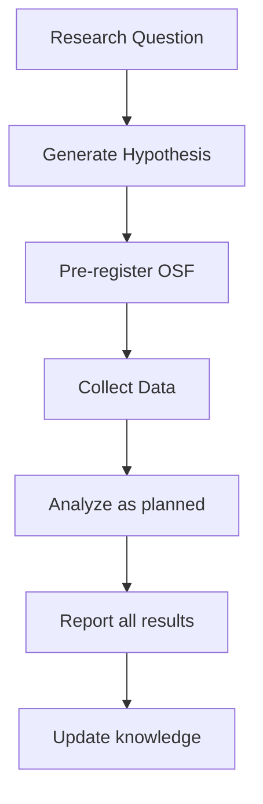
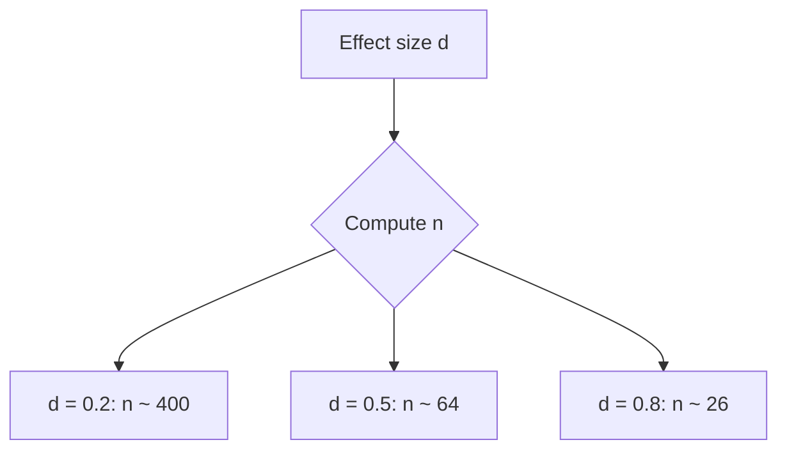

# MPhil 7110 — Research Methods
> **MPhil/PhD Prep | HKUST MPhil 7110 | Research design, hypothesis generation, experimental planning, IRB, reproducibility**  
> **Bilingual 深度自學檔案 · 中英對照**

---

## 問題 1：5 個核心心智模型

1. **Research design determines everything** — a poorly designed experiment cannot be saved by sophisticated analysis; the research question, not the method, should drive the design (Maxwell 2004, *Qualitative Research Design*)

2. **Hypothesis generation requires domain expertise + creativity** — the best hypotheses come from deep knowledge of prior work + willingness to question assumptions; novelty vs confirmation (Popper 1934, *Logic of Scientific Discovery*)

3. **Pre-registration eliminates HARKing** — posting hypotheses + analysis plan before data collection prevents p-hacking and HARKing (hypothesizing after results are known); OSF preregistration (Nosek et al. 2018, *Psyc. Science*)

4. **Effect size + power analysis before data collection** — statistical significance without practical significance is meaningless; power analysis ensures resources aren't wasted on underpowered studies (Cohen 1988, *Statistical Power Analysis*)

5. **Reproducibility ≠ replicability** — reproducibility: same data + methods → same results; replicability: new data + same methods → same conclusions; both matter (NSF 2016; Peng 2011, *Science*)

---

## 問題 2：3 個根本分歧

### 分歧 1：Exploratory vs Confirmatory Research
| Aspect | Exploratory (discovery) | Confirmatory (testing) |
|--------|----------------------|----------------------|
| Goal | Generate hypotheses | Test hypotheses |
| Preregistration | Optional | Required |
| Multiple comparisons | Allowed | Penalized |
| Type I error | Not primary concern | Primary concern |
| Example | Brain scanning for regions | Pre-registered fMRI study |

### 分歧 2：Research Paradigm: Positivism vs Constructivism
| Aspect | Positivist | Constructivist |
|--------|----------|--------------|
| Reality | Objective, discoverable | Socially constructed |
| Knowledge | Empirical, testable | Interpretive, contextual |
| Method | Quantitative, experimental | Qualitative, case study |
| Role of researcher | Neutral observer | Participant |

### 分歧 3：Null Hypothesis Testing vs Bayesian Inference
| Aspect | NHST | Bayesian |
|--------|------|---------|
| $p$-value | $P(data|H_0)$ | $P(H|data)$ |
| Prior | Not used | Required |
| Evidence | Arbitrary threshold | Continuous |
| Multiple testing | Bonferroni | Default |
| Reporting | "significant" vs "not significant" | Full posterior distribution |

---

## 問題 3：10 個深度問題

1. 給定 research question, design a pre-registration document using OSF template。包括：hypothesis, sample, procedure, analysis plan, exclusion criteria。

2. 為什麼 effect size (Cohen's $d$) 比 $p$-value 更重要？推導 $d = (\mu_1 - \mu_2)/\sigma$ 和 sample size formula。

3. 給定 power analysis, 計算 required $n$ for detecting $d = 0.5$ at $\alpha = 0.05$, power $= 0.8$。

4. 解釋 HARKing (Hypothesizing After Results are Known) 點樣 introduce bias，pre-registration 點樣 prevent。

5. 為什麼 multiple comparisons 需要 correction？給定 20 independent tests，計算 Bonferroni threshold。

6. 給定 research involving human subjects, 設計 IRB application。包括：informed consent, risk assessment, confidentiality, recruitment。

7. 為什麼 reproducibility crisis 存在？討論 factors: small N, $p$-hacking, selective reporting, publication bias。

8. 解釋為什麼 "failed to replicate"唔等於 "original finding wrong"。

9. 給定 conflicting meta-analyses, 點樣 resolve？討論 systematic review 和 heterogeneity。

10. 為什麼 open science practices (pre-registration, open data, open code) 提升 research quality？

---

## 深入 1：Research Design Fundamentals
**Deep Dive I**

### Research Design Types

| Design | Control | Randomization | Internal validity | External validity |
|--------|---------|-------------|----------------|-----------------|
| RCT | High | Yes | High | Moderate |
| Quasi-experiment | Moderate | No | Moderate | Moderate |
| Observational | Low | No | Low | High |
| Case study | None | No | Low | Low |

### Hypothesis Generation

**FINER criteria (Hulley et al. 2013):**
- **F**easible: Adequate resources, sample size
- **I**nteresting: Worthwhile question
- **N**ovel: Contributes new knowledge
- **E**thical: IRB approvable
- **R**elevant: Impact on field

**PICO format for clinical research:**
- **P**opulation
- **I**ntervention
- **C**omparator
- **O**utcome

### Power Analysis

$$n = \frac{2(z_\alpha + z_\beta)^2 \sigma^2}{(\mu_1 - \mu_2)^2}$$

| Effect size $d$ | Cohen's convention | Physics example |
|-----------------|-------------------|----------------|
| 0.2 | Small | Subtle physics effect |
| 0.5 | Medium | Measurable correction |
| 0.8 | Large | Paradigm shift |

---

## 深入 2：Pre-Registration & Open Science
**Deep Dive II**

### OSF Pre-Registration Template

1. **Hypothesis:** State $H_0$ and $H_A$ explicitly
2. **Sample:** Population, eligibility, recruitment
3. **Procedure:** Detailed step-by-step protocol
4. **Analysis plan:** Exact tests, exclusion criteria
5. **Submission:** Time-stamped, public record

### Common HARKing Modes (Simmons et al. 2011)

1. **Optional stopping:** Check $p$-value after each subject; stop when $p < 0.05$
2. **Post-hoc exclusions:** Remove outliers until $p < 0.05$
3. **Multiple dependent variables:** Test all, report significant
4. **Covariates:** Try different covariate sets
5. **Analytic flexibility:** Switch test type post-hoc

### Effect Size Reporting

| Test | Effect size | Formula |
|------|-------------|---------|
| t-test | Cohen's $d$ | $\frac{\bar{x}_1 - \bar{x}_2}{s_{pooled}}$ |
| ANOVA | $\eta^2$ | $SS_{between}/SS_{total}$ |
| Correlation | Pearson $r$ | $\frac{\text{Cov}(x,y)}{\sigma_x\sigma_y}$ |
| Chi-square | Cramér's $V$ | $\sqrt{\chi^2/(n \cdot \min(r-1, c-1))}$ |

---

## 深入 3：Statistical Power & Sample Size
**Deep Dive III**

### Sample Size Formula (Two-sample t-test)

$$n = \frac{2(z_\alpha + z_\beta)^2}{d^2}$$

where $d = (\mu_1 - \mu_2)/\sigma$

**Python:**
```python
from scipy import stats
from statsmodels.stats.power import TTestIndPower
power = TTestIndPower()
n = power.solve_power(effect_size=0.5, alpha=0.05, power=0.8)
print(f"Required n per group: {n:.1f}")
```

### Multiple Testing Correction

| Method | Threshold | Conservative? |
|--------|-----------|--------------|
| Bonferroni | $\alpha/m$ | Most conservative |
| Holm | Sequential $\alpha_i = \alpha/(m-i+1)$ | Less conservative |
| Benjamini-Hochberg | $\frac{i}{m}P_{(i)} \leq \alpha$ | FDR control |
| Benjamini-Yekutieli | More conservative BH | Dependence |

---

## 深入 4：Reproducibility Practices
**Deep Dive IV**

### FAIR Principles (Wilkinson et al. 2016)

| Principle | Description |
|-----------|-------------|
| **F**indable | DOI, metadata, rich description |
| **A**ccessible | Open protocols, public repos |
| **I**nteroperable | Standard formats, vocabularies |
| **R**eusable | Clear license, documentation |

### Research Pipeline Documentation

```python
# Reproducible research checklist
# 1. Code version: git commit hash
# 2. Data version: DOI via Zenodo/Figshare
# 3. Environment: conda env.yml or Docker
# 4. Random seed: np.random.seed(42)
# 5. Preregistration: OSF time-stamped record
# 6. Analysis: end-to-end script, no manual steps
```

---

## 深入 5：Writing the Research Proposal
**Deep Dive V**

### Structure of a PhD/MPhil Proposal

| Section | Content | Length |
|---------|---------|--------|
| Abstract | Question, methods, significance | 200 words |
| Background | Literature review, gap | 1500 words |
| Research questions | 2–3 specific questions | 500 words |
| Methods | Design, sample, analysis | 1500 words |
| Timeline | Gantt chart | — |
| References | 20–30 key papers | — |

### Common Proposal Mistakes

1. Research question too broad
2. Methods not specific enough
3. Budget/timeline unrealistic
4. Not citing recent literature (last 5 years)
5. No clear contribution to knowledge

---

## 自測 1：Power Calculation
**Calculate sample size for detecting $d = 0.3$ at $\alpha = 0.05$, power $= 0.9$.**

**Answer:**
$$n = \frac{2(z_{0.05} + z_{0.9})^2}{d^2} = \frac{2(1.96 + 1.28)^2}{0.09} = \frac{2 \times 10.5}{0.09} \approx 233 \text{ per group}$$

Total $N = 466$. Small effect size requires large sample!

**Engineering implication:** Always do power analysis before designing experiment; saves resources.

---

## 自測 2：Pre-Registration Example
**Write a pre-registration for testing whether Bayesian updating improves student exam scores.**

**Answer:**
> **Hypothesis:** Students who receive real-time Bayesian feedback on probability questions will score 10% higher on the final exam compared to control.
>
> **Sample:** HKUST PHYS students, $n = 100$ per group, stratified by Year 2 vs Year 3.
>
> **Exclusion:** Students who miss > 2 sessions.
>
> **Analysis:** Two-sample $t$-test on exam scores (primary); Bayesian updating score correlation (secondary).
>
> **Registered at:** OSF, timestamp 2025-09-01T12:00:00Z.

---

## 自測 3：Multiple Testing
**You run 100 independent tests at $\alpha = 0.05$. Expected false positives?**

**Answer:**
Expected Type I errors = $100 \times 0.05 = 5$ (even under all true nulls!)

**Bonferroni correction:** $\alpha_{adj} = 0.05/100 = 0.0005$

**Benjamini-Hochberg (FDR):** Sort $p$-values; reject if $p_i \leq i/m \cdot 0.05$.

---

## 自測 4：Effect Size Reporting
**Report: $t(48) = 2.1, p = 0.04, d = 0.6, 95\%$ CI $[0.1, 0.9]$. Interpret.**

**Answer:**
- Statistically significant ($p = 0.04 < 0.05$)
- Medium-to-large effect ($d = 0.6$, Cohen: medium $\approx 0.5$, large $\approx 0.8$)
- CI doesn't include 0: consistent with real effect
- Practical significance: 0.6 SD improvement = meaningful in context

---

## 📊 Diagram 1: Research Methods Map


## 📊 Diagram 2: Pre-Registration Workflow


## 📊 Diagram 3: Power vs Sample Size


---

## 深度總結

1. **Research design precedes analysis** — the quality of scientific inference is determined at the design stage, not the analysis stage.
2. **Pre-registration is the solution to HARKing** — time-stamped, public hypotheses prevent p-hacking.
3. **Effect size and power are non-negotiable** — always report effect size; always do power analysis before collecting data.
4. **Reproducibility requires infrastructure** — FAIR data, versioned code, and documented environments are the minimum standard.
5. **Proposals require tight focus** — one compelling research question beats five vague aims.

---

**自學建議**
- 必讀: Maxwell *Qualitative Research Design*; Cohen *Statistical Power Analysis*; Simmons et al. (2011)
- 工具: OSF, G*Power, powerandsamplesize.com, Stan for Bayesian power
